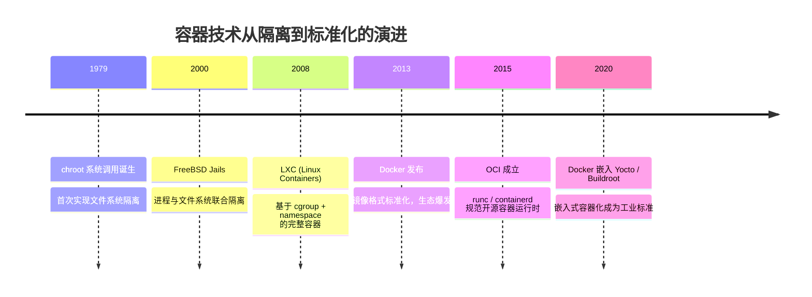

<span class="badge-b">[B]</span>

# 为什么嵌入式需要容器？从三大痛点说起

> 📊 **本节难度等级：** <span class="badge-b">**B级**</span>

---

### <strong>开发环境不一致 → "同事A能编，客户现场报错"</strong>

场景1：工具链版本漂移引发的符号未定义
团队使用 Yocto 构建系统，同事A的宿主机是 Ubuntu 20.04，自带 gcc 9.4.0。项目需要定制 ARM 交叉工具链（gcc 11.3.0），他通过 `apt` 安装了 `gcc-11-arm-linux-gnueabihf`，编译通过。两周后设备发往客户现场（Debian 11），现场工程师在容器外直接安装 `gcc-10-arm-linux-gnueabihf`（仓库默认版本），编译同一工程时报错：

```bash
# 客户现场编译错误 log
arm-linux-gnueabihf-gcc -o my_app main.o -lmylib
/usr/lib/gcc-cross/arm-linux-gnueabihf/10/../../../../arm-linux-gnueabihf/bin/ld: 
main.o: undefined reference to symbol 'std::__cxx11::basic_string...'
# 因 libstdc++.so.6.0.29（gcc-11）与 libstdc++.so.6.0.28（gcc-10） ABI 不兼容

# 同事A本地验证命令
$ arm-linux-gnueabihf-gcc --version
arm-linux-gnueabihf-gcc (Ubuntu 11.3.0-1ubuntu1~20.04) 11.3.0

$ ldd /opt/myapp | grep libstdc++
libstdc++.so.6 => /lib/arm-linux-gnueabihf/libstdc++.so.6 (0xb6e00000)
# 符号 _Z... 在本地解析成功
```

困境：嵌入式开发依赖交叉编译工具链、sysroot、cmake 版本三元组，任何一环不匹配都会导致链接阶段出现 `undefined reference` 或运行时 `version GLIBC_X.XX not found`。传统解决方案是撰写冗长的《环境搭建手册》，但操作系统发行版更新、仓库源差异、个人操作顺序仍会导致"文档写不全，环境搭不对"。

容器解法：将工具链、cmake、ninja 固化在 Dockerfile 中：

```dockerfile
# Dockerfile.toolchain
FROM debian:bullseye-slim
RUN apt-get update && apt-get install -y \
    gcc-11-arm-linux-gnueabihf \
    g++-11-arm-linux-gnueabihf \
    cmake=3.18.4-2+deb11u1 \
    && rm -rf /var/lib/apt/lists/*
ENV PATH=/usr/bin:$PATH
```

此后无论宿主机是 Ubuntu、CentOS 还是 macOS，执行 `docker build -t toolchain:v1 .` 后，容器内环境原子一致，`gcc --version` 输出永远锁定为 11.3.0，彻底消除"同事A能编，客户现场报错"的人为变量。<br>

### <strong>应用互相破坏 → "Python崩溃导致主控任务被OOM kill"</strong>

场景2：内存泄漏的连锁反应
某网关设备运行三个进程：`main_controller`（C++，优先级 RT，内存 50MB）、`data_analyzer`（Python，机器学习推理，内存 200MB）、`web_server`（Node.js，内存 30MB）。三者共享 512MB RAM，无隔离。某天 `data_analyzer` 因 TensorFlow 内存泄漏持续膨胀：

```bash
# 现场故障时刻 log（dmesg 时间戳）
[ 1234.567890] data_analyzer invoked oom-killer: gfp_mask=0x100cca, order=0, oom_score_adj=0
[ 1234.567934] CPU: 0 PID: 1234 Comm: data_analyzer Tainted: G           O      5.10.72-rt53
[ 1234.567956] Mem-Info:
[ 1234.567970] active_anon:123456 inactive_anon:78901 isolated_anon:0
[ 1234.567970]  free:1024 min:8192 low:10240 high:12288
# 内存枯竭，触发内核 OOM killer

[ 1234.568112] oom-kill:constraint=CONSTRAINT_NONE,nodemask=(null),cpuset=/,mems_allowed=0
[ 1234.568132] Killed process 987 (main_controller) total-vm:61440kB, anon-rss:51200kB, file-rss:0kB
# 主控任务被误判为高内存占用者而 kill，设备失控
```

困境分析：Linux OOM killer 根据 `oom_score` 动态计算，RT 进程的 `oom_score_adj` 虽低，但当其 RSS（Resident Set Size）占比较高时仍可能被选中。更致命的是，传统 `ulimit` 限制的是单个进程，无法对进程组（如 Python + 其子进程）实施总量控制。

容器解法：通过 cgroup v1（Docker 默认）或 v2 硬隔离内存：
```bash
# 启动 data_analyzer 容器，硬限制 256MB，禁用 swap
docker run -d --name analyzer \
  -m 256m --memory-swap=256m \
  --oom-kill-disable \  # 容器内 OOM 不杀宿主机进程
  data_analyzer:v1

# 验证隔离效果：容器内无论内存泄漏多严重，宿主机 dmesg 不会出现 OOM
$ docker stats analyzer
CONTAINER ID   NAME       CPU %   MEM USAGE / LIMIT   MEM %
a1b2c3d4e5f6   analyzer   45.2%   255.8MiB / 256MiB   99.8%
# 容器卡在 256MB，main_controller 稳占 50MB 不受波及
```<br>

### <strong>OTA升级地狱 → "libc版本冲突，回滚失败设备变砖"</strong>

场景4：依赖链断裂导致启动失败
设备运行旧版系统（glibc 2.28），OTA 升级时 `opkg` 安装了新应用（依赖 glibc 2.31）。升级脚本未检查依赖，直接重启：

```bash
# 升级脚本片段（错误实践）
opkg install new_app.ipk
sync
reboot  # 无依赖校验，无事务回滚

# 重启后设备无法启动的串口 log
Starting kernel ...
[    1.234567] Run /sbin/init as init process
[    1.345678] /sbin/init: /lib/libc.so.6: version `GLIBC_2.31' not found (required by /sbin/init)
[    1.345689] Kernel panic - not syncing: Attempted to kill init!

# 现场抢救命令（若还能进 U-Boot）
=> setenv bootargs console=ttyS0,115200n8 root=/dev/ubi0_1  # 切换到备份分区
=> run bootcmd  # 勉强启动旧系统
```

困境：传统嵌入式 OTA 使用包管理器（opkg/rpm）增量更新，但 `libc`、`libstdc++`、`libssl` 等核心库升级涉及全系统重编译。若新版本应用与旧库 ABI 不兼容，设备启动瞬间崩溃，且因文件系统已写入，无原子回滚机制，只能通过 U-Boot 手动切换 A/B 分区（若前期部署了该机制）。

容器解法：镜像级 OTA，原子切换：
```bash
# 新版应用打包为容器镜像，含独立 libc
FROM debian:bullseye-slim
RUN apt-get update && apt-get install -y libc6=2.31-13 new_app
COPY --from=builder /app/new_app /usr/local/bin/
CMD ["new_app"]

# OTA 流程（7.6.7 详述）
docker pull myrepo/new_app:v2
docker stop app_v1 && docker rm app_v1
docker run -d --name app_v2 new_app:v2

# 回滚（若健康检查失败，5 秒内完成）
docker stop app_v2 && docker rm app_v2
docker run -d --name app_v1 new_app:v1  # 旧镜像仍在本地，秒级恢复

# 系统层面无 libc 冲突，宿主机 glibc 2.28 与容器内 2.31 共存
```<br>

### <strong>隔离 ≠ 虚拟化 → 进程级轻量 vs 指令级沉重</strong>

技术本质对比：


### 容器技术演进路线




```bash
# 传统虚拟化：完整的指令级仿真
qemu-system-arm -machine virt -cpu cortex-a7 -m 128M -kernel zImage
# ↑ 需要仿真整个CPU、内存管理单元、外设，开销巨大

# 容器：进程级隔离
docker run --cpus 0.5 --memory 50m my-app
# ↑ 只是给现有进程"打标签"，几乎零额外开销
```

嵌入式场景下的优势：
- 内存开销：虚拟机需要为Guest OS预留固定内存（通常≥64MB），而容器仅增加约1-5MB的管理开销
- CPU开销：虚拟化指令翻译消耗30-50%额外CPU，容器基于宿主内核，开销<1%
- 启动速度：虚拟机启动需要初始化完整OS（10-30秒），容器只是进程创建（<1秒）

适用边界：
- 选择容器：需要环境隔离但性能敏感的场景（实时控制、信号处理）
- 选择虚拟机：需要运行不同内核版本或异构架构的场景<br>

### <strong>一次构建，到处运行 → 镜像不可变基础设施</strong>

技术实现原理：
```dockerfile
# Dockerfile 定义了完整的构建环境
FROM ubuntu:20.04
RUN apt-get update && apt-get install -y gcc-arm-none-eabi
COPY toolchain.cfg /etc/toolchain/
# ↑ 这个配置在任意支持Docker的机器上构建结果完全相同
```

嵌入式开发的价值体现：
1. 环境一致性：
   - 开发机（x86_64 Ubuntu）→ CI服务器（x86_64 CentOS）→ 测试机（ARM64 Debian）
   - 相同的Docker镜像，完全一致的编译结果
2. 工具链版本锁定：
   ```dockerfile
   # 明确指定版本，避免"隐式升级"
   RUN apt-get install -y gcc-arm-none-eabi=10.3-2021.07
   # 三年后重新构建，仍然得到相同的二进制文件
   ```
3. 供应链可追溯：
   - 镜像层哈希值唯一标识每个依赖组件
   - 构建日志完整记录所有软件包来源和版本<br>

### <strong>可复现性 → Dockerfile就是环境文档</strong>

从"口头传承"到"代码化文档"的转变：
传统方式的问题：
```markdown
# 老王的离职交接文档：
- 用Ubuntu 16.04
- 安装gcc-arm-none-eabi（要4.9版本）
- 配置环境变量PATH=/opt/toolchain/bin:$PATH
- 运行build.sh
# ↑ 缺失关键信息：具体哪个4.9版本？从哪下载？其他依赖包？
```

容器化的解决方案：
```dockerfile
# Dockerfile - 可执行的环境文档
FROM ubuntu:16.04

# 明确的软件源和版本
RUN echo "deb http://archive.ubuntu.com/ubuntu xenial main" > /etc/apt/sources.list
RUN apt-get update && apt-get install -y \
    gcc-arm-none-eabi=4.9.3.2015q3-1ubuntu1 \  # 精确到构建号
    libssl1.0.0=1.0.2g-1ubuntu4.20

# 明确的环境配置
ENV PATH=/usr/bin/arm-none-eabi-gcc:$PATH

# 明确的构建步骤
COPY build.sh /build.sh
RUN chmod +x /build.sh && /build.sh
```

可复现性的三个层面：
1. 构建可复现：
   ```bash
   # 任何时候、任何机器上
   docker build -t firmware-builder .
   # 得到的镜像和构建结果完全相同
   ```
2. 调试可复现：
   ```bash
   # 重现三年前的构建环境进行问题分析
   docker run -it --rm firmware-builder:v1.2.3 bash
   # 进入与当时完全一致的环境
   ```
3. 审计可追溯：
   ```bash
   docker history firmware-builder:v1.2.3
   # 查看每一层的变化，完整追溯构建过程
   ```

嵌入式开发的特殊价值：
- 长生命周期支持：工业设备可能需要维护10-15年，容器确保多年后仍能重现构建环境
- 合规要求：功能安全标准（如ISO 26262）要求构建过程完全可追溯和可复现
- 团队协作：新成员无需复杂环境配置，直接基于现有Dockerfile开始工作

这三种核心价值共同构成了容器技术在嵌入式开发中的不可替代性：用轻量级隔离解决资源约束问题，用不可变镜像解决环境一致性问题，用代码化文档解决长期可维护性问题。<br>

---


## 小结

- 嵌入式容器化的三大核心痛点：开发环境不一致、应用间资源冲突、OTA升级不可回滚。
- 容器通过namespace实现隔离，通过cgroup实现资源限制，开销远小于传统虚拟化。
- Dockerfile 作为可执行的环境文档，解决了"口头传承"导致的环境搭建不可靠问题。
- 嵌入式容器选型需在隔离性、资源开销和调试便利性之间权衡。

---

## 本章小结

| 要点 | 内容 |
|------|------|
| 环境一致性 | Dockerfile 固化工具链和依赖，消除宿主机差异 |
| 资源隔离 | cgroup v1/v2 限制内存、CPU、进程数，防止单个应用拖垮系统 |
| OTA 原子性 | 镜像级替换实现秒级回滚，避免libc版本冲突导致变砖 |
| 性能对比 | 容器开销 <1% CPU、~1-5MB RAM；虚拟机开销 30-50% CPU、≥64MB RAM |
| 可复现性 | 镜像层哈希 + 构建日志，满足功能安全标准的追溯要求 |

## 练习

1. 为什么传统交叉编译工具链在Ubuntu 20.04和Debian 11上会产生不同的链接结果？容器如何通过文件系统隔离解决这一问题？
2. cgroup的`memory.limit_in_bytes`与`memory.memsw.limit_in_bytes`有什么区别？在嵌入式无swap场景下应该如何配置？
3. 比较Docker容器与KVM虚拟机在启动延迟、内存开销和内核共享三个维度的差异，在什么场景下必须选择虚拟机而非容器？