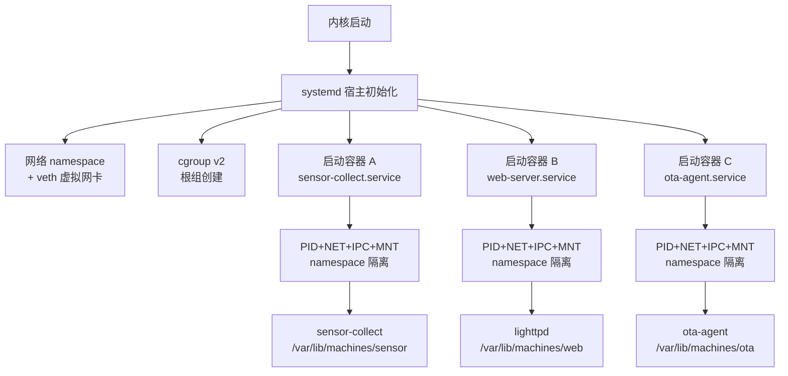

# Buildroot 容器化与 rootfs

<span class="badge-i">[I]</span> <span class="badge-e">[E]</span>

---

### Buildroot 生成容器镜像

<span class="red">Buildroot 是嵌入式 Linux 最流行的构建系统之一，通过 Kconfig 菜单配置工具链、内核、包和 rootfs 格式，一键生成完整的可启动系统。将 Buildroot 与容器化结合，可生成超精简的容器基础镜像和可启动的容器化 rootfs。</span><br>

Buildroot 的 <span class="green">rootfs overlay</span> 机制允许在最终 rootfs 上叠加自定义文件，适合注入容器配置文件和启动脚本。<br>
`BR2_TARGET_ROOTFS_TAR` 生成 tar 格式 rootfs，可直接作为 Docker 的 `ADD` 指令源导入容器。<br>
`BR2_TARGET_ROOTFS_CPIO` 生成 initramfs，适合作为 systemd-nspawn 的启动目录。<br>

```bash
# Buildroot 配置：生成 tar.gz rootfs 用于容器导入
$ make menuconfig
# 选择：Target packages → 所需库
# 选择：Filesystem images → tar the root filesystem → Compression method (gzip)
$ make
# 输出：output/images/rootfs.tar.gz
```

```dockerfile
# 将 Buildroot 生成的 rootfs 导入为容器镜像
FROM scratch
ADD output/images/rootfs.tar.gz /
# 添加容器启动配置
COPY container-init /sbin/init
ENTRYPOINT ["/sbin/init"]
```

<span class="blue">关键认知：Buildroot 生成的 rootfs 是专为特定硬件裁剪的，包含正确的 libc、库和工具链。将其作为容器基础镜像，可确保容器内二进制与宿主机 ABI 完全兼容。</span><br>

---

### 容器镜像作为 Buildroot 包

<span class="red">Buildroot 的 `BR2_PACKAGE_DOCKER_CLI` 和 `BR2_PACKAGE_CONTAINERD` 选项可将容器工具链集成到目标系统，使嵌入式设备具备构建和运行容器的能力。</span><br>

Buildroot 的 external tree 机制允许自定义包定义，可将私有容器镜像仓库的拉取逻辑封装为 Buildroot 包。<br>
构建时，Buildroot 先编译宿主机工具链（host tools），包括 `skopeo` 或 `podman`，然后在 target 阶段生成容器运行时环境。<br>

| Buildroot 选项 | 功能 | 典型体积 |
|---------------|------|----------|
| BR2_PACKAGE_CGROUPFS_MOUNT | cgroup 伪文件系统挂载工具 | ~50KB |
| BR2_PACKAGE_DOCKER_CLI | Docker 命令行客户端 | ~10MB |
| BR2_PACKAGE_CONTAINERD | containerd 守护进程 | ~15MB |
| BR2_PACKAGE_RUNC | OCI 标准运行时 | ~2MB |
| BR2_PACKAGE_CRUN | 轻量级运行时（C 实现） | ~1MB |
| BR2_PACKAGE_SYSTEMD | systemd（含 nspawn） | ~10MB |

<span class="blue">选型建议：最小容器能力仅需 crun + libcgroup；完整容器管理选 containerd + runc；深度 systemd 集成选 systemd-nspawn。</span><br>

---

### systemd-nspawn：原生轻量容器

<span class="red">systemd-nspawn 是 systemd 自带的容器运行时，无需额外安装 Docker 或 containerd，直接利用已有的 systemd 和 namespace 能力创建隔离环境，是嵌入式系统容器化的最轻量方案。</span><br>

`systemd-nspawn` 将指定目录作为容器的根文件系统，自动创建 PID、IPC、NET 和 MNT namespace，并可通过 `--property` 参数绑定 cgroup 限制。<br>
`machinectl` 是 systemd-nspawn 的管理前端，支持启动、停止、登录和镜像导入导出。<br>

```bash
# 使用 systemd-nspawn 启动 Buildroot 生成的 rootfs
$ systemd-nspawn -D /var/lib/machines/buildroot-container     --boot     --network-veth     --property="MemoryMax=64M"     --property="CPUShares=512"

# machinectl 管理容器生命周期
$ machinectl start buildroot-container
$ machinectl status buildroot-container
$ machinectl login buildroot-container
```

```bash
# 将 tar 镜像导入为 machinectl 可管理的容器
$ machinectl import-tar output/images/rootfs.tar.gz buildroot-container
```

<span class="blue">关键结论：systemd-nspawn 的集成优势在于无需额外守护进程，容器生命周期由 systemd 服务单元管理，与设备启动流程无缝衔接。适合已使用 systemd 的嵌入式 Linux 发行版。</span><br>

---

### nspawn 与 cgroup 集成

<span class="red">systemd-nspawn 原生支持 cgroups v2 资源限制，通过 `--property` 参数将 systemd 资源控制属性直接传递给容器 cgroup，无需手动操作 `/sys/fs/cgroup` 伪文件系统。</span><br>

常用资源限制属性：<br>
<span class="orange"><strong>MemoryMax=</strong></span>：硬内存上限，超出触发 OOM。<br>
<span class="orange"><strong>MemoryHigh=</strong></span>：软内存上限，内核优先回收该容器内存。<br>
<span class="orange"><strong>CPUQuota=</strong></span>：CPU 时间配额百分比，如 `50%` 表示每周期最多用一半 CPU。<br>
<span class="orange"><strong>TasksMax=</strong></span>：进程/线程数量上限，防止 fork 炸弹。<br>

```bash
# 以严格资源限制启动嵌入式服务容器
$ systemd-nspawn -D /var/lib/machines/sensor-app     --boot     --property="MemoryMax=32M"     --property="MemoryHigh=24M"     --property="CPUQuota=25%"     --property="TasksMax=10"     --property="DeviceAllow=/dev/i2c-0 rw"
```

<span class="blue">易错点：cgroups v2 的 `MemoryMax` 包含页缓存和内核内存，而不仅仅是匿名内存。嵌入式设备若设置了过低的内存限制，可能导致文件 IO 性能骤降。</span><br>

---

### 容器化 rootfs 的启动流程

<span class="red">容器化 rootfs 的启动流程与传统 monolithic 系统不同：systemd 先初始化宿主机，然后按需启动各个容器服务单元，每个容器作为独立的 systemd service 管理。</span><br>



systemd service 单元配置示例：<br>

```ini
# /etc/systemd/system/sensor-collect.service
[Unit]
Description=Sensor Data Collector Container
After=network.target

[Service]
ExecStart=/usr/bin/systemd-nspawn     -D /var/lib/machines/sensor     --boot     --network-veth     --property="MemoryMax=16M"
Restart=on-failure

[Install]
WantedBy=multi-user.target
```

<span class="blue">关键认知：容器作为 systemd service 管理，天然继承 systemd 的依赖编排、自动重启、日志收集（journald）和定时触发（timer）能力，无需额外的容器编排工具。</span><br>

---

### 根文件系统只读化与 Overlay

<span class="red">嵌入式容器化 rootfs 通常以只读方式挂载，防止运行时意外修改破坏系统一致性。可写数据通过 OverlayFS 或外部 volume 分离存储。</span><br>

OverlayFS 将只读底层（lowerdir）和可写上层（upperdir）合并为统一视图，容器内所有写操作实际发生在 upperdir，底层保持不变。<br>
嵌入式设备可将 SquashFS 压缩只读 rootfs 作为 lowerdir，RAM 或 eMMC 分区作为 upperdir，实现原子更新和快速回滚。<br>

```bash
# 创建 OverlayFS 容器可写层
$ mkdir -p /var/container-upper/sensor /var/container-work/sensor
$ mount -t overlay overlay     -o lowerdir=/var/lib/machines/sensor,       upperdir=/var/container-upper/sensor,       workdir=/var/container-work/sensor     /var/lib/machines/sensor-live

$ systemd-nspawn -D /var/lib/machines/sensor-live --boot
```

<span class="blue">关键结论：OverlayFS 使容器化 rootfs 同时具备只读安全性和可写灵活性。OTA 更新时替换 lowerdir 即可，upperdir 的用户数据保留。</span><br>

---

**学习路径提示**：<br>
- <span class="badge-i">[I]</span> 读者：理解 Buildroot 生成 rootfs 和 systemd-nspawn 启动容器的基本流程。<br>
- <span class="badge-e">[E]</span> 读者：关注 Buildroot 包集成、cgroups 资源限制和 OverlayFS 原子更新机制。<br>

---

## 历史演进与发展趋势

Buildroot 诞生于 2001 年，由 uClibc 项目的开发者创建，最初目的是为无 MMU 的处理器生成精简的 rootfs。2009 年，Buildroot 重写为现代构建系统，引入 Kconfig 配置和包管理机制，成为嵌入式 Linux 的主流选择。2013 年，Buildroot 增加 systemd 支持，为后续容器化集成埋下伏笔。2015 年，systemd-nspawn 从实验性工具升级为核心组件，提供无需 Docker 的轻量容器能力。2016 年，cgroups v2 统一后，systemd 成为 cgroups v2 的主要用户态管理器，systemd-nspawn 的资源控制能力大幅提升。2018 年，Buildroot 增加 containerd 和 runc 包，正式拥抱 OCI 容器生态。2020 年后，嵌入式容器化呈现两条路径：一条是 Docker/containerd 体系，适合已熟悉云原生工具链的团队；另一条是 systemd-nspawn 体系，适合深度 systemd 集成的系统。未来趋势上，Buildroot 正在探索直接生成 OCI 镜像的能力——构建输出不再仅是 rootfs.tar，而是可直接推送到仓库的 OCI 格式分层镜像，打通嵌入式构建与云原生部署的边界。

---

## 本章小结

| 要点 | 内容 |
|------|------|
| Buildroot rootfs | `BR2_TARGET_ROOTFS_TAR` 生成容器可导入的 tar.gz |
| 容器包集成 | crun ~1MB、containerd ~15MB、systemd-nspawn ~0 额外 |
| systemd-nspawn | 基于目录的轻量容器，自动创建 namespace，systemd 原生集成 |
| cgroup 限制 | `--property="MemoryMax=..."` 等 systemd 属性直接传递 |
| 启动流程 | systemd 管理容器为 service 单元，继承依赖编排和自动重启 |
| OverlayFS | 只读 lowerdir + 可写 upperdir，实现安全运行和原子更新 |

## 练习

1. 配置 Buildroot 生成一个最小 rootfs（仅包含 busybox、libcurl 和 systemd），导出为 tar.gz 并用 `machinectl import-tar` 导入为 nspawn 容器。记录从启动到容器内 shell 可用的总时间。
2. 为 systemd-nspawn 容器编写一个 systemd service 单元，设置 `MemoryMax=32M`、`CPUQuota=50%` 和 `Restart=on-failure`。启动后用 `systemctl status` 和 `systemd-cgtop` 验证资源限制是否生效。
3. 设计一个基于 OverlayFS 的嵌入式容器 OTA 方案：lowerdir 为 SquashFS 压缩的系统镜像，upperdir 为持久化数据分区。说明如何在 OTA 更新时仅替换 lowerdir 并保留 upperdir 数据，画出挂载结构和更新流程图。
