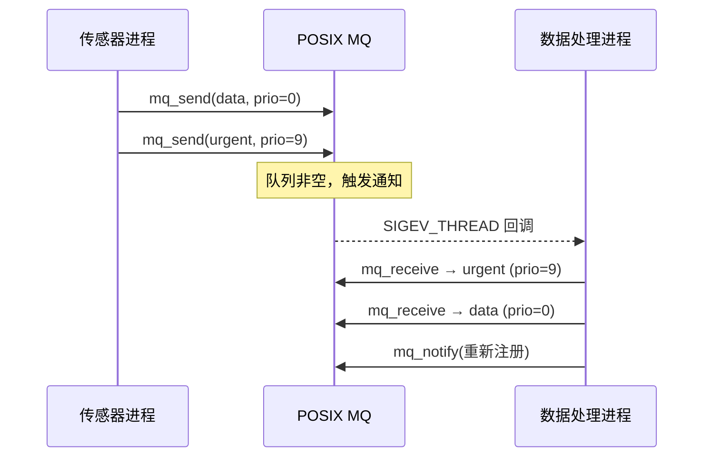

# 管道与消息队列实战

<span class="badge-i">[I]</span>

---

### 无名管道实战：父子进程双向通信

<span class="red">单个管道是半双工的，要实现父子进程双向通信，必须创建两个管道分别负责不同方向的数据流。</span><br>

父进程通过管道 A 向子进程发送命令，子进程通过管道 B 向父进程返回结果，形成请求-响应闭环。<br>
必须注意关闭未使用的文件描述符，否则读端无法感知写端全部关闭，EOF 永远不会到来。<br>

```c
// 双向管道通信：父进程发送命令，子进程执行并返回结果
#include <unistd.h>
#include <stdio.h>
#include <string.h>
#include <sys/wait.h>

int main(void) {
    int parent_to_child[2];   // 父→子 管道
    int child_to_parent[2];  // 子→父 管道
    pipe(parent_to_child);
    pipe(child_to_parent);

    pid_t pid = fork();
    if (pid == 0) {
        // 子进程：关闭不需要的端
        close(parent_to_child[1]);  // 关闭父→子的写端
        close(child_to_parent[0]);  // 关闭子→父的读端

        char cmd[64];
        read(parent_to_child[0], cmd, 64);   // 接收父进程命令
        // 模拟处理：将命令反转后返回
        int len = strlen(cmd);
        for (int i = 0; i < len / 2; i++) {
            char t = cmd[i]; cmd[i] = cmd[len-1-i]; cmd[len-1-i] = t;
        }
        write(child_to_parent[1], cmd, len); // 返回处理结果

        close(parent_to_child[0]);
        close(child_to_parent[1]);
        return 0;
    }

    // 父进程
    close(parent_to_child[0]);  // 关闭父→子的读端
    close(child_to_parent[1]);  // 关闭子→父的写端

    char *cmd = "reverse_me";
    write(parent_to_child[1], cmd, strlen(cmd));
    close(parent_to_child[1]);  // 发送完毕，关闭写端（触发子进程 EOF）

    char result[64];
    int n = read(child_to_parent[0], result, 64);
    result[n] = '\0';
    printf("result: %s\n", result);   // 输出：em_esrever

    close(child_to_parent[0]);
    wait(NULL);
    return 0;
}
```

<span class="blue">关键结论：双向管道通信中，及时关闭未使用的端是防止阻塞和文件描述符泄漏的关键。写端全部关闭后，读端 `read()` 返回 0 表示 EOF。</span><br>

---

### Shell 管道与进程协同

<span class="red">Shell 管道符 `|` 是匿名管道的最高频使用场景，它将前一个命令的标准输出连接到后一个命令的标准输入，实现命令级流水线。</span><br>

```bash
# Shell 管道链：提取日志中的错误行，统计出现次数，取前 10
$ cat /var/log/app.log | grep "ERROR" | awk '{print $3}' | sort | uniq -c | sort -rn | head -n 10
```

Shell 通过 `fork()` 创建子进程，调用 `dup2()` 将标准输出重定向到管道写端，标准输入重定向到管道读端，最后 `exec()` 执行目标程序。<br>
进程间通过管道传递的是字节流，无消息边界，因此 `grep` 需逐行缓冲，`awk` 默认按行处理。<br>

```c
// 模拟 Shell 管道实现：cmd1 | cmd2
int pipefd[2];
pipe(pipefd);

if (fork() == 0) {
    close(pipefd[0]);              // 子进程 1 关闭读端
    dup2(pipefd[1], STDOUT_FILENO); // stdout 重定向到管道写端
    close(pipefd[1]);
    execlp("cmd1", "cmd1", NULL);  // 执行 cmd1，输出进入管道
}

if (fork() == 0) {
    close(pipefd[1]);              // 子进程 2 关闭写端
    dup2(pipefd[0], STDIN_FILENO); // stdin 重定向到管道读端
    close(pipefd[0]);
    execlp("cmd2", "cmd2", NULL);  // 执行 cmd2，从管道读取输入
}

close(pipefd[0]);
close(pipefd[1]);
wait(NULL); wait(NULL);
```

<span class="blue">易错点：管道容量有限（默认 64KB），若写入方持续写入而读取方不消费，写满后写端会阻塞。实时数据流需确保消费速率不低于生产速率。</span><br>

---

### 有名管道 FIFO 跨进程实战

<span class="red">FIFO 突破管道的亲缘限制，允许任意两个知道路径名的进程进行通信，是本地 IPC 中最接近"文件即接口"哲学的设计。</span><br>

FIFO 的打开行为具有阻塞语义：只读打开会阻塞到另一个进程只写打开；只写打开会阻塞到另一个进程只读打开。<br>
以 `O_NONBLOCK` 标志打开可改为非阻塞模式，但需处理 `ENXIO` 错误。<br>

```c
// 服务端：创建 FIFO 并监听客户端请求
#include <sys/stat.h>
#include <fcntl.h>
#include <unistd.h>

#define FIFO_PATH "/tmp/embedded_ipc_fifo"

int main(void) {
    mkfifo(FIFO_PATH, 0666);           // 创建 FIFO，权限 666
    int fd = open(FIFO_PATH, O_RDONLY); // 阻塞等待写端打开

    char buf[256];
    while (1) {
        int n = read(fd, buf, 256);
        if (n > 0) {
            buf[n] = '\0';
            printf("received: %s\n", buf);
        } else if (n == 0) {
            // 所有写端关闭，重新打开等待下一个连接
            close(fd);
            fd = open(FIFO_PATH, O_RDONLY);
        }
    }
    close(fd);
    unlink(FIFO_PATH);
    return 0;
}
```

```c
// 客户端：连接 FIFO 发送数据
int fd = open("/tmp/embedded_ipc_fifo", O_WRONLY);
write(fd, "request_data", 12);
close(fd);                          // 关闭写端触发服务端 EOF
```

<span class="blue">关键结论：FIFO 适合请求-响应式的单次交互，但无内置消息边界，长连接场景下需自定义消息头（长度字段或固定帧大小）。</span><br>

---

### POSIX 消息队列：带边界的异步通信

<span class="red">POSIX 消息队列在管道/FIFO 的字节流之上增加了消息边界，每条消息独立存取，支持按优先级排序和异步通知，是嵌入式系统中异步 IPC 的首选。</span><br>

POSIX 消息队列通过 `mq_open()` 创建或打开，消息以队列形式组织，`mq_send()` 发送时附带优先级，`mq_receive()` 默认读取最高优先级消息。<br>
队列可配置最大消息数和单条消息大小，超出限制时发送方阻塞或返回 `EAGAIN`（非阻塞模式下）。<br>

```c
// POSIX 消息队列：传感器数据发布
#include <mqueue.h>
#include <string.h>

#define MQ_NAME "/sensor_mq"

int main(void) {
    struct mq_attr attr = {
        .mq_flags = 0,
        .mq_maxmsg = 10,          // 队列最多缓存 10 条消息
        .mq_msgsize = 256,        // 单条消息最大 256 字节
        .mq_curmsgs = 0
    };

    mqd_t mq = mq_open(MQ_NAME, O_CREAT | O_RDWR, 0666, &attr);

    char data[256];
    snprintf(data, 256, "temp=25.3,humidity=60%%");
    mq_send(mq, data, strlen(data) + 1, 0);   // 优先级 0

    mq_close(mq);
    mq_unlink(MQ_NAME);           // 清理消息队列
    return 0;
}
```

```c
// POSIX 消息队列：数据处理端接收
mqd_t mq = mq_open("/sensor_mq", O_RDONLY);
char buf[256];
unsigned int prio;
ssize_t n = mq_receive(mq, buf, 256, &prio);
if (n > 0) {
    printf("priority=%u, data=%s\n", prio, buf);
}
```

<span class="blue">关键认知：POSIX 消息队列的消息是边界明确的，解决了管道字节流需要手动拆帧的问题。优先级机制允许紧急消息插队处理。</span><br>

---

### 消息队列的异步通知机制

<span class="red">POSIX 消息队列支持异步通知，当队列从空变为非空时，内核通过信号或线程回调通知接收方，避免轮询消耗 CPU。</span><br>

通知方式通过 `mq_notify()` 注册，可选择信号通知（SIGEV_THREAD）或新线程回调（SIGEV_THREAD）。<br>
嵌入式系统中，传感器采集进程可注册通知，仅在数据到达时唤醒处理线程，大幅降低空闲功耗。<br>

```c
// 异步通知：消息到达时触发回调
#include <mqueue.h>
#include <signal.h>

void mq_callback(union sigval sv) {
    mqd_t mq = *(mqd_t *)sv.sival_ptr;
    char buf[256];
    unsigned int prio;
    while (mq_receive(mq, buf, 256, &prio) >= 0) {
        printf("async recv: %s\n", buf);
    }
    // 重新注册通知（每次通知仅触发一次）
    struct sigevent sev = {
        .sigev_notify = SIGEV_THREAD,
        .sigev_notify_function = mq_callback,
        .sigev_value.sival_ptr = &mq
    };
    mq_notify(mq, &sev);
}

int main(void) {
    mqd_t mq = mq_open("/sensor_mq", O_RDONLY | O_NONBLOCK);
    struct sigevent sev = {
        .sigev_notify = SIGEV_THREAD,
        .sigev_notify_function = mq_callback,
        .sigev_value.sival_ptr = &mq
    };
    mq_notify(mq, &sev);           // 注册异步通知
    pause();                       // 主线程休眠，等待回调
    return 0;
}
```

<span class="blue">易错点：`mq_notify()` 每次仅触发一次通知，处理完毕后必须重新注册。多线程同时调用 `mq_receive` 会导致竞争，通知仅送达一个线程。</span><br>



---

### 管道与消息队列性能对比

<span class="red">在嵌入式实时系统中，IPC 机制的选择直接影响端到端延迟和 CPU 占用，需从吞吐量、延迟和代码复杂度三个维度评估。</span><br>

| 维度 | 无名管道 | FIFO | POSIX 消息队列 |
|------|----------|------|----------------|
| 数据拷贝次数 | 2（用户→内核→用户） | 2 | 2 |
| 是否有消息边界 | 否 | 否 | 是 |
| 支持优先级 | 否 | 否 | 是 |
| 支持广播 | 否 | 否 | 否 |
| 跨进程能力 | 仅亲缘 | 任意 | 任意 |
| 最大数据量 | 64KB 缓冲 | 64KB 缓冲 | 可配置 |
| 实时性 | 中等 | 中等 | 较好 |
| 适用场景 | Shell 管道 | 单次文件交换 | 异步传感器数据 |

<span class="blue">选型结论：管道适合简单字节流和 Shell 集成；消息队列适合需要消息边界和优先级的异步场景；共享内存适合高吞吐低延迟的实时数据。</span><br>

---

**学习路径提示**：<br>
- <span class="badge-i">[I]</span> 读者：掌握双向管道实现、FIFO 阻塞语义、POSIX 消息队列的优先级和异步通知机制。<br>

---

## 历史演进与发展趋势

管道机制诞生于 1973 年的 Unix V3，Doug McIlroy 提出"程序应该像过滤器一样连接"的理念，Shell 管道语法 `|` 成为 Unix 哲学的标志性符号。1977 年，Version 7 Unix 引入 `popen()` 和 `pclose()` 库函数，封装了管道创建和进程管理的细节。1983 年 System V 推出有名管道 FIFO，使无亲缘进程得以通信。1993 年 POSIX.1b 标准定义了 POSIX 消息队列，填补了 System V 消息队列接口不统一、可移植性差的空白。2001 年 Linux 2.6 完整实现 POSIX IPC，消息队列成为嵌入式 Linux 的标配。2010 年后，随着内核实时补丁 PREEMPT_RT 的成熟，POSIX 消息队列支持优先级继承和阻塞超时，成为工业控制中确定性通信的关键组件。未来方向上，内核中的 io_uring 机制正在探索异步 IPC 的零拷贝路径，而 eBPF 则允许在内核态直接处理消息路由，进一步降低延迟。

---

## 本章小结

| 要点 | 内容 |
|------|------|
| 双向管道 | 需创建两个管道，分别负责不同方向，及时关闭未使用端 |
| Shell 管道 | `|` 符通过 `dup2` 重定向 stdin/stdout，实现命令流水线 |
| FIFO 阻塞 | 只读/只写打开默认阻塞，需配对打开；`O_NONBLOCK` 改非阻塞 |
| POSIX MQ | `mq_open/mq_send/mq_receive`，自带消息边界和优先级 |
| 异步通知 | `mq_notify` + `SIGEV_THREAD` 实现事件驱动，避免轮询 |
| 性能权衡 | 管道最简单，消息队列功能最全，共享内存性能最高 |

## 练习

1. 实现一个双向管道通信程序：父进程发送一段 JSON 配置，子进程解析后返回处理结果。请完整写出创建管道、`fork`、`dup2` 重定向和关闭描述符的代码。
2. POSIX 消息队列的 `mq_notify` 每次只能注册一个通知，且通知触发后需要重新注册。请设计一个多线程安全的消息队列消费方案，确保每条消息都被且仅被一个线程处理。
3. 对比无名管道、FIFO 和 POSIX 消息队列在"消息边界"、"优先级"和"异步通知"三个特性上的差异，画出一张特性矩阵表，并说明在什么场景下应选择哪一种 IPC。
