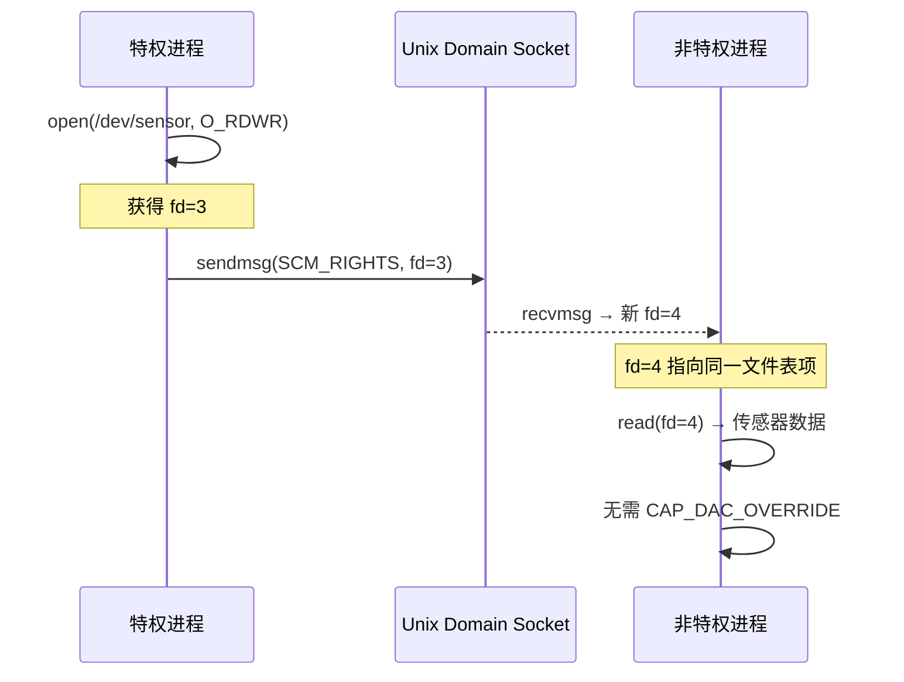

# D-Bus 与内存共享

<span class="badge-i">[I]</span>

---

### D-Bus：桌面与嵌入式总线 IPC

<span class="red">D-Bus（Desktop Bus）是 freedesktop.org 推出的进程间消息总线系统，设计初衷是统一 Linux 桌面环境中各组件的通信，现已成为 systemd、NetworkManager、BlueZ 等基础服务的标准接口。</span><br>

D-Bus 采用总线拓扑，分为 <span class="green">系统总线（System Bus）</span> 和 <span class="green">会话总线（Session Bus）</span> 两类。<br>
系统总线以 root 权限运行，供系统级服务（如网络、电源、蓝牙）使用；会话总线按用户会话隔离，供桌面应用通信。<br>
进程通过总线守护进程（`dbus-daemon`）转发消息，支持点对点直接连接优化延迟。<br>

```mermaid
flowchart TD
    APP1["应用程序 A<br>GNOME 设置"] -->|方法调用| BUS["dbus-daemon<br>总线守护进程"]
    APP2["系统服务 B<br>NetworkManager"] -->|信号广播| BUS
    BUS -->|转发| APP1
    BUS -->|转发| APP3["应用程序 C<br>状态栏图标"]
    APP1 .-.>|direct| APP2
```

---

### D-Bus 核心概念与消息类型

<span class="red">D-Bus 的消息模型基于面向对象思想，每个进程在总线上暴露一个或多个对象路径，对象包含接口和方法，其他进程通过方法调用和信号与之交互。</span><br>

<span class="orange"><strong>对象路径（Object Path）</strong></span>：类似文件系统路径，如 `/org/freedesktop/NetworkManager/Devices/0`，标识总线上的一个对象实例。<br>
<span class="orange"><strong>接口（Interface）</strong></span>：定义对象支持的方法、信号和属性，如 `org.freedesktop.DBus.Properties`。<br>
<span class="orange"><strong>方法调用（Method Call）</strong></span>：同步 RPC，调用方发送请求并等待应答或错误。<br>
<span class="orange"><strong>信号（Signal）</strong></span>：异步广播，发送方不等待响应，任意订阅者接收。<br>

```bash
# 查看系统总线上的所有服务名
$ dbus-send --system --print-reply --dest=org.freedesktop.DBus /     org.freedesktop.DBus.ListNames

# 调用 NetworkManager 的 GetDevices 方法
$ dbus-send --system --print-reply     --dest=org.freedesktop.NetworkManager     /org/freedesktop/NetworkManager     org.freedesktop.NetworkManager.GetDevices
```

<span class="blue">关键认知：D-Bus 的解耦设计使得服务提供者和消费者无需知道对方的 PID 或路径，只需通过总线名和对象路径寻址，支持热插拔式服务发现。</span><br>

---

### D-Bus 在嵌入式系统中的应用

<span class="red">嵌入式 Linux 中，D-Bus 是 systemd 管理服务的标准接口，`systemctl` 命令本质上是 D-Bus 客户端，通过总线向 systemd 发送 `StartUnit`、`StopUnit` 等方法调用。</span><br>

嵌入式设备常用 D-Bus 实现跨进程状态同步：传感器守护进程广播温度变化信号，UI 进程订阅并更新界面。<br>
`libdbus` 是 C 语言基础库，`gdbus`（GLib 绑定）和 `sd-bus`（systemd 绑定）提供更高级的封装。<br>

```c
// sd-bus 客户端：调用远程方法
#include <systemd/sd-bus.h>

int main(void) {
    sd_bus *bus = NULL;
    sd_bus_open_system(&bus);           // 连接到系统总线

    sd_bus_message *reply = NULL;
    sd_bus_call_method(bus,
        "org.freedesktop.systemd1",   // 服务名
        "/org/freedesktop/systemd1",   // 对象路径
        "org.freedesktop.systemd1.Manager", // 接口
        "GetUnit",                     // 方法名
        NULL, &reply,
        "s", "sshd.service");          // 参数：服务单元名

    const char *path;
    sd_bus_message_read(reply, "o", &path);
    printf("unit path: %s\n", path);

    sd_bus_message_unref(reply);
    sd_bus_unref(bus);
    return 0;
}
```

<span class="blue">易错点：D-Bus 消息序列化使用自有类型系统（字符串、整数、数组、字典等），跨进程传递复杂结构需熟悉 D-Bus 类型签名规则，如 `a{sv}` 表示字符串到变体的字典。</span><br>

---

### POSIX 共享内存 mmap 深入

<span class="red">`mmap()` 是 Linux 中最灵活的内存映射系统调用，既可将文件映射到内存，也可创建匿名映射或共享内存对象，是实现进程间零拷贝共享的核心机制。</span><br>

<span class="green">`mmap()`</span> 的映射类型由 `flags` 参数决定：<br>
- `MAP_SHARED`：映射区修改写回文件或共享给其他进程<br>
- `MAP_PRIVATE`：写时复制（Copy-on-Write），修改不影响原文件<br>
- `MAP_ANONYMOUS`：无文件后端，配合 `MAP_SHARED` 可用于父子进程共享<br>

```c
// 父子进程通过匿名共享内存交换数据
#include <sys/mman.h>
#include <unistd.h>
#include <string.h>

int main(void) {
    // 申请 4KB 匿名共享内存
    char *ptr = mmap(NULL, 4096,
                     PROT_READ | PROT_WRITE,
                     MAP_SHARED | MAP_ANONYMOUS,
                     -1, 0);

    pid_t pid = fork();
    if (pid == 0) {
        // 子进程：等待父进程写入后读取
        usleep(100000);
        printf("child read: %s\n", ptr);
    } else {
        // 父进程：写入共享内存
        strcpy(ptr, "shared via mmap");
        wait(NULL);
    }

    munmap(ptr, 4096);
    return 0;
}
```

<span class="blue">关键认知：`MAP_SHARED | MAP_ANONYMOUS` 无需文件系统参与，是进程间共享内存最轻量的方式，但仅适用于亲缘进程。非亲缘进程仍需通过 `shm_open()` 配合文件路径访问。</span><br>

---

### 共享内存同步：进程间互斥锁

<span class="red">共享内存解除内核介入的同时，也将同步责任转嫁给应用层。POSIX 提供 `pthread_mutexattr_setpshared()` 将互斥锁标记为进程间共享，配合共享内存实现无竞态访问。</span><br>

互斥锁必须存储在共享内存区域内，且初始化时使用 `PTHREAD_PROCESS_SHARED` 属性。<br>
`pthread_mutexattr_setrobust()` 可配置健壮锁，当持有锁的进程异常退出时，下一个获取锁的线程会收到 `EOWNERDEAD` 错误并负责清理。<br>

```c
// 进程间共享内存 + 互斥锁同步
#include <pthread.h>
#include <sys/mman.h>

struct shared_data {
    pthread_mutex_t lock;
    int counter;
    char payload[1024];
};

int main(void) {
    int fd = shm_open("/shm_sync", O_CREAT | O_RDWR, 0666);
    ftruncate(fd, sizeof(struct shared_data));

    struct shared_data *sd = mmap(NULL, sizeof(struct shared_data),
                                  PROT_READ | PROT_WRITE,
                                  MAP_SHARED, fd, 0);

    // 初始化进程间互斥锁（仅需一个进程执行）
    pthread_mutexattr_t attr;
    pthread_mutexattr_init(&attr);
    pthread_mutexattr_setpshared(&attr, PTHREAD_PROCESS_SHARED);
    pthread_mutex_init(&sd->lock, &attr);

    pthread_mutex_lock(&sd->lock);
    sd->counter++;
    strcpy(sd->payload, "updated");
    pthread_mutex_unlock(&sd->lock);

    munmap(sd, sizeof(struct shared_data));
    return 0;
}
```

<span class="blue">关键结论：进程间互斥锁的性能开销远低于消息队列的数据拷贝，在嵌入式高频数据交换中（如视频帧缓冲），共享内存 + 互斥锁是标准方案。</span><br>

---

### Unix Domain Socket：本地可靠通信

<span class="red">Unix Domain Socket（UDS）是套接字家族在本地进程通信中的特化形态，兼具网络套接字的流式/数据报语义和本地 IPC 的高性能，是 D-Bus 底层的默认传输。</span><br>

UDS 支持两种模式：<br>
<span class="orange"><strong>流式（SOCK_STREAM）</strong></span>：面向连接、可靠传输、字节流，类似 TCP。<br>
<span class="orange"><strong>数据报（SOCK_DGRAM）</strong></span>：无连接、保留消息边界、类似 UDP。<br>

UDS 以文件系统路径作为地址（如 `/run/dbus/system_bus_socket`），不涉及网络协议栈，数据仅在内存中拷贝，延迟远低于 TCP 回环。<br>

```c
// Unix Domain Socket 服务端
#include <sys/socket.h>
#include <sys/un.h>

#define SOCK_PATH "/tmp/uds_ipc.sock"

int main(void) {
    int fd = socket(AF_UNIX, SOCK_STREAM, 0);
    struct sockaddr_un addr = { .sun_family = AF_UNIX };
    strcpy(addr.sun_path, SOCK_PATH);

    unlink(SOCK_PATH);                  // 清理旧文件
    bind(fd, (struct sockaddr *)&addr, sizeof(addr));
    listen(fd, 5);

    int client = accept(fd, NULL, NULL);
    char buf[256];
    int n = read(client, buf, 256);
    printf("recv: %.*s\n", n, buf);

    close(client);
    close(fd);
    unlink(SOCK_PATH);
    return 0;
}
```

```c
// Unix Domain Socket 客户端
int fd = socket(AF_UNIX, SOCK_STREAM, 0);
struct sockaddr_un addr = { .sun_family = AF_UNIX };
strcpy(addr.sun_path, "/tmp/uds_ipc.sock");
connect(fd, (struct sockaddr *)&addr, sizeof(addr));
write(fd, "hello uds", 9);
close(fd);
```

<span class="blue">易错点：UDS 的地址是文件系统路径，`bind()` 前必须 `unlink()` 旧文件，否则返回 `EADDRINUSE`。`SUN_LEN` 宏可正确计算地址结构长度。</span><br>

---

### Socket IPC 传递文件描述符

<span class="red">Unix Domain Socket 独有的 `SCM_RIGHTS` 控制消息机制允许进程间传递文件描述符，是权限分离架构中代理进程设计的核心工具。</span><br>

发送方通过 `sendmsg()` 附加 `SCM_RIGHTS` 控制消息，接收方通过 `recvmsg()` 获取一个全新的文件描述符，指向同一内核文件表项。<br>
典型应用：特权守护进程打开设备文件（如 `/dev/gps`），通过 UDS 将 fd 传递给无特权进程，后者直接读写而无需提升权限。<br>

```c
// 通过 UDS 发送文件描述符
#include <sys/socket.h>

void send_fd(int sock, int fd_to_send) {
    struct msghdr msg = {0};
    struct cmsghdr *cmsg;
    char buf[CMSG_SPACE(sizeof(int))];
    struct iovec iov = { .iov_base = "x", .iov_len = 1 };

    msg.msg_iov = &iov;
    msg.msg_iovlen = 1;
    msg.msg_control = buf;
    msg.msg_controllen = sizeof(buf);

    cmsg = CMSG_FIRSTHDR(&msg);
    cmsg->cmsg_level = SOL_SOCKET;
    cmsg->cmsg_type = SCM_RIGHTS;
    cmsg->cmsg_len = CMSG_LEN(sizeof(int));
    *(int *)CMSG_DATA(cmsg) = fd_to_send;

    sendmsg(sock, &msg, 0);
}
```

<span class="blue">关键认知：`SCM_RIGHTS` 传递的是内核文件表项的引用，接收方即使无打开权限也能操作该文件，这是 Linux 能力模型中实现最小权限原则的经典模式。</span><br>



---

**学习路径提示**：<br>
- <span class="badge-i">[I]</span> 读者：掌握 D-Bus 总线模型、`mmap` 共享内存、UDS 的流式/数据报模式，以及 `SCM_RIGHTS` 文件描述符传递。<br>

---

## 历史演进与发展趋势

D-Bus 诞生于 2003 年的 freedesktop.org 项目，由 Havoc Pennington 主导设计，目标是为 GNOME 和 KDE 两大桌面环境提供统一的 IPC 总线。2006 年 D-Bus 1.0 发布，成为 Linux 标准基础（LSB）的一部分。2010 年后，systemd 深度集成 D-Bus，将其作为服务管理、设备通知和日志收集的核心通道，使 D-Bus 从桌面组件扩展到系统底层。`mmap` 机制源自 1983 年的 BSD 4.2，SunOS 引入 `mmap` 以支持高效的文件访问和共享库加载，Linux 在 1994 年的 1.0 内核中实现，并在 2.4 内核中引入匿名映射和共享内存文件。Unix Domain Socket 的历史可追溯到 1983 年的 BSD 4.2，最初用于本地进程间传递文件描述符，这一能力至今仍是 Linux 安全架构的基石。未来趋势上，D-Bus 正在向 kdbus（内核态总线）和 bus1 演进，目标是消除用户态守护进程的性能瓶颈；共享内存领域则出现基于 io_uring 的异步映射通知机制，允许一个进程的数据更新通过内核环通知另一进程，避免轮询。

---

## 本章小结

| 要点 | 内容 |
|------|------|
| D-Bus 总线 | 系统总线 + 会话总线，通过 `dbus-daemon` 转发方法调用和信号 |
| 核心概念 | 对象路径、接口、方法调用、信号，支持服务发现和热插拔 |
| mmap 共享 | `MAP_SHARED` 实现零拷贝共享，`MAP_ANONYMOUS` 轻量无文件 |
| 进程间同步 | `pthread_mutexattr_setpshared(PTHREAD_PROCESS_SHARED)` 实现跨进程互斥 |
| Unix Domain Socket | 流式/数据报两种模式，本地性能高于 TCP 回环 |
| fd 传递 | `SCM_RIGHTS` 控制消息实现文件描述符跨进程传递 |

## 练习

1. 使用 `sd-bus` 或 `gdbus` 编写一个 D-Bus 服务端程序，暴露一个对象路径和方法 `GetTemperature`，返回模拟的温度值。再编写客户端调用该方法并打印结果。
2. 实现两个无亲缘关系进程通过 POSIX 共享内存交换 1MB 的数据块，使用进程间互斥锁保证写-读顺序。请画出内存映射关系和同步时序图。
3. Unix Domain Socket 的 `SCM_RIGHTS` 机制允许传递文件描述符。请设计一个安全代理架构：特权进程打开受保护设备，通过 UDS 将 fd 传递给沙箱进程。说明这种设计如何遵循最小权限原则，以及潜在的安全风险。
