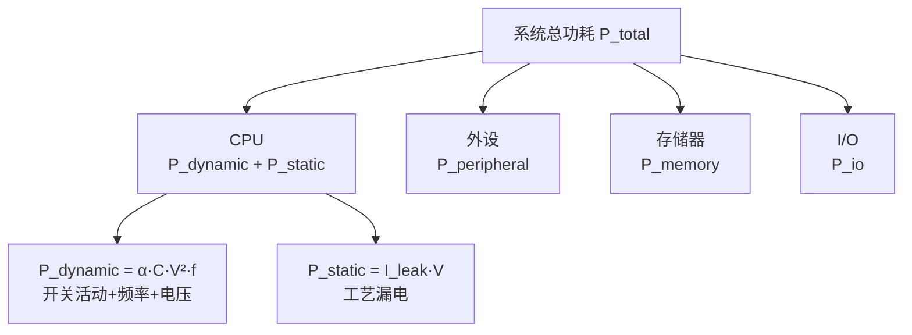
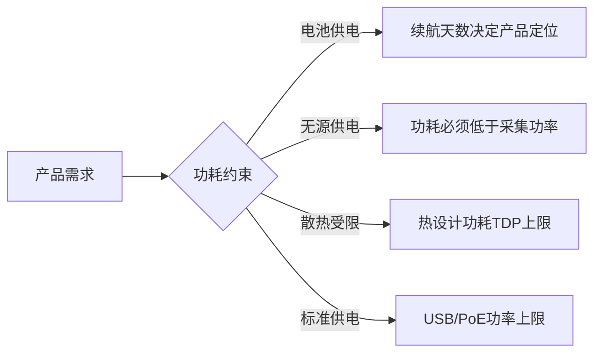

# 低功耗基础认知

> <span class="badge-b">**入门 (Beginner)**</span>
> 理解嵌入式系统的功耗构成模型，掌握低功耗为什么是刚需，了解ACPI、DT和嵌入式电源管理的区别，认识功耗测量工具和关键指标。

---

## 嵌入式功耗构成模型

---

### <strong>系统级功耗的四大组成部分</strong>

<span class="badge-b">B</span><br>
<span class="red">嵌入式功耗</span>由CPU动态功耗、静态漏电、外设功耗和存储器功耗四个部分组成，优化需针对各部分的物理机制分别施策。<br>



<span class="orange"><strong>1. CPU动态功耗：</strong></span><br>
<span class="green">P_dynamic = α · C · V² · f</span>，其中α是开关活动因子，C是等效电容，V是电压，f是频率。
电压的平方关系意味着降电压比降频率的节能效果更显著。<br>

<span class="orange"><strong>2. 静态漏电功耗：</strong></span><br>
<span class="green">P_static = I_leak · V</span>，先进制程（28nm以下）漏电占比可达总功耗的30-50%。
这是DVFS无法优化的部分，需要电源门控（Power Gating）技术。<br>

<span class="orange"><strong>3. 外设功耗：</strong></span><br>
WiFi模块待机几十毫安，GPS模块定位时数百毫安，显示屏背光可能占系统功耗的60%以上。
外设往往是电池设备的最大功耗源。<br>

<span class="orange"><strong>4. 存储器功耗：</strong></span><br>
DDR3 active功耗~1W，DDR4~0.5W，LPDDR4X低至~0.1W。
Flash读写时功耗高，休眠时可忽略。<br>

| 组件 | 典型功耗 | 优化杠杆 |
|------|---------|---------|
| CPU动态 | 100mW~2W | DVFS降电压/频率 |
| CPU漏电 | 10mW~500mW | 电源门控、休眠 |
| WiFi | 50mW~1W | 间歇唤醒、PSM模式 |
| LCD背光 | 100mW~2W | 亮度调节、自动关闭 |
| DDR | 50mW~1W | 自刷新、深度休眠 |
| eMMC | 10mW~100mW | 批量读写、休眠 |

<span class="blue">关键洞察："降频"只能降低动态功耗的一半（P ∝ f），而"降压"能同时降低动态和漏电功耗——DVFS的核心是电压调节，频率只是跟随电压。</span><br>

---

## 为什么低功耗是刚需

---

### <strong>嵌入式设备的能源约束全景</strong>

<span class="badge-b">B</span><br>
<span class="red">低功耗</span>不是锦上添花的功能，而是决定产品形态、部署场景和商业可行性的核心约束。<br>

<span class="orange"><strong>1. 电池供电设备：</strong></span><br>
智能手表的电池容量通常为200-500mAh，要求待机数天。
<span class="green">每毫安的功耗节省直接转化为用户体验提升</span>。<br>

<span class="orange"><strong>2. 无源/能量收集设备：</strong></span><br>
环境传感器节点可能仅靠太阳能或温差发电运行，平均功耗必须低于采集功率。
<span class="green">功耗预算是系统设计的硬天花板</span>。<br>

<span class="orange"><strong>3. 散热约束：</strong></span><br>
工业网关封装在密闭IP67外壳中，无风扇散热，功耗上限由热阻决定。
超过5W的功耗会导致核心温度超过85°C的工业级限制。<br>

<span class="orange"><strong>4. 供电能力：</strong></span><br>
USB供电上限500mA@5V=2.5W，PoE供电上限25.5W（802.3at）。
产品设计必须在供电能力范围内运行。<br>



<span class="blue">关键洞察：低功耗设计不是优化问题，而是约束满足问题——在功耗预算内完成所有功能，预算的边界由能源来源、散热能力和产品形态共同决定。</span><br>

---

## ACPI vs DT vs 嵌入式电源

---

### <strong>三代电源管理架构的适用域</strong>

<span class="badge-i">I</span><br>
<span class="red">ACPI、Device Tree和嵌入式专用电源管理</span>分别服务于x86服务器、ARM Linux和MCU/RTOS三种生态。<br>

| 维度 | ACPI | Device Tree + Linux PM | 嵌入式裸机/RTOS |
|------|------|------------------------|----------------|
| 适用架构 | x86/x64 | ARM/ARM64/RISC-V | Cortex-M/裸机 |
| 操作系统 | Windows/Linux | Linux | RTOS/裸机 |
| 配置方式 | ACPI表（固件提供） | Device Tree + 驱动 | 代码/寄存器直接配置 |
| 状态模型 | S0-S5（系统级） | 系统+设备级混合 | 自定义状态机 |
| 动态调频 | P-states | cpufreq + devfreq | 直接写PLL寄存器 |
| 设备电源 | D-states | Runtime PM | 手动关时钟/电源域 |

<span class="orange"><strong>1. ACPI：</strong></span><br>
ACPI是x86 PC的标准，通过BIOS/UEFI固件暴露ACPI表，操作系统解析后执行电源策略。
<span class="green">ACPI不适用于ARM嵌入式</span>，因为ARM生态的固件和硬件多样性无法统一ACPI表描述。<br>

<span class="orange"><strong>2. Device Tree：</strong></span><br>
ARM Linux使用Device Tree描述硬件拓扑，电源管理由Linux内核子系统（cpufreq、cpuidle、Runtime PM）实现。
驱动通过DT中的power-domain和opp-table节点获取电源信息。<br>

<span class="orange"><strong>3. 嵌入式裸机/RTOS：</strong></span><br>
Cortex-M设备通过直接操作RCC（Reset and Clock Control）寄存器控制时钟门控和电源域。
<span class="green">没有通用框架，每个SoC的寄存器不同</span>，需要查阅参考手册。<br>

```c
// 文件路径：stm32_power.c
// 功能：STM32 Cortex-M 低功耗模式切换
// 行号：1-20
#include <stm32l4xx_hal.h>

void enter_stop_mode(void) {
    // 配置低功耗调节器
    HAL_PWR_EnterSTOPMode(PWR_LOWPOWERREGULATOR_ON, PWR_STOPENTRY_WFI);
    // WFI 后在此恢复，系统时钟需重新配置
    SystemClock_Config();
}

void enter_standby_mode(void) {
    // 最深度休眠，SRAM丢失，从复位向量唤醒
    HAL_PWR_EnterSTANDBYMode();
}
```

<span class="blue">关键洞察：选型逻辑是"ACPI for x86, DT for ARM Linux, Registers for MCU"——没有通用的嵌入式电源管理标准，架构选型决定管理路径。</span><br>

---

## 功耗测量工具

---

### <strong>从万用表到电源分析仪的测量层级</strong>

<span class="badge-i">I</span><br>
<span class="red">功耗测量</span>的精度要求决定了工具选择，从开发调试到产线测试各有对应方案。<br>

| 工具 | 精度 | 时间分辨率 | 成本 | 适用场景 |
|------|------|-----------|------|---------|
| 万用表 | 0.1mA | 秒级 | 低 | 粗略估算、静态电流 |
| USB电流计 | 0.1mA | 秒级 | 低 | USB供电设备 |
| 示波器+电流探头 | 0.1mA | 微秒级 | 中 | 动态电流波形 |
| 电源分析仪 | 0.01mA | 毫秒级 | 高 | 精确功耗预算 |
| INA219/INA226 | 0.1mA | 可配置 | 极低 | 板载实时监测 |

```bash
# 使用 powerstat 测量Linux系统功耗（需电池供电）
$ powerstat -d 0 -R -z -n 120
# -d 0: 不使用 HDD 休眠
# -R: 原始数据
# -z: 忽略零值
# -n 120: 采样120次

# 使用 Intel RAPL 读取CPU能耗
$ cat /sys/class/powercap/intel-rapl/intel-rapl:0/energy_uj
```

<span class="orange"><strong>1. 板载INA219方案：</strong></span><br>
INA219通过I2C输出电流、电压和功率值，适合电池设备的实时功耗监测。
配合MCU采样可绘制功耗时间曲线。<br>

<span class="orange"><strong>2. 测量陷阱：</strong></span><br>
示波器电流探头的带宽限制可能错过ns级电流尖峰，电源分析仪的采样率需高于被测事件频率的2倍（奈奎斯特采样定理）。<br>

<span class="blue">关键洞察："不能测量的就无法优化"——嵌入式功耗优化必须以精确的测量为起点，万用表的精度不足以指导优化决策。</span><br>

---

## 关键指标

---

### <strong>低功耗设计的度量体系</strong>

<span class="badge-i">I</span><br>
<span class="red">低功耗关键指标</span>将功耗目标量化为可比较、可验证的数值。<br>

| 指标 | 符号 | 定义 | 典型目标 |
|------|------|------|---------|
| 活跃功耗 | P_active | 全速运行时的功耗 | 取决于应用场景 |
| 空闲功耗 | P_idle | CPU空闲时的功耗 | < P_active 的 10% |
| 休眠功耗 | P_sleep | 深度休眠时的功耗 | < P_idle 的 1% |
| 唤醒延迟 | T_wake | 从休眠到活跃的时间 | 微秒级（浅休眠）到毫秒级（深休眠） |
| 每事务能耗 | E_per_tx | 单次数据处理的能耗 | 优化目标：最小化 |
| 续航时间 | T_battery | 电池供电总时长 | 产品定义的核心指标 |

<span class="blue">关键洞察：低功耗设计的指标体系必须包含"功耗-延迟-功能"三维——不能只追求最低功耗而牺牲唤醒响应或功能完整性。</span><br>

---

## 历史演进：从APM到ACPI

---

### <strong>电源管理标准的二十年</strong>

<span class="badge-i">I</span><br>

| 年代 | 标准 | 适用平台 | 特点 |
|------|------|---------|------|
| 1992 | APM | x86 | BIOS主导，操作系统被动 |
| 1996 | ACPI | x86 | OS主导，固件提供接口表 |
| 2005 | Device Tree | ARM/PowerPC | 开源硬件描述 |
| 2010+ | Linux PM Framework | ARM/RISC-V | cpufreq/cpuidle/Runtime PM |
| 2020+ | Zephyr PM | MCU | RTOS级统一电源管理 |

<span class="blue">演进逻辑：从"BIOS主导"到"OS主导"再到"内核子系统统一"，趋势是操作系统对电源管理的控制权不断增强。</span><br>

---

## 小结

---

### <strong>本章核心要点</strong>

| 知识点 | 关键内容 | 难度 |
|--------|---------|------|
| 功耗模型 | 动态+漏电+外设+存储四部分 | B |
| 低功耗刚需 | 电池/无源/散热/供电约束 | B |
| ACPI vs DT | x86服务器 vs ARM嵌入式 | I |
| 测量工具 | 万用表到电源分析仪 | I |
| 关键指标 | P_active/P_idle/T_wake/E_per_tx | I |

---

### <strong>本章练习题</strong>

<span class="badge-i">I</span>

1. 为什么DVFS中降电压比降频率的节能效果更显著？从P_dynamic公式推导。
2. ACPI为什么不适用于ARM嵌入式？Device Tree如何解决这个问题？
3. 设计一个使用INA219的板载功耗监测系统，列出硬件连接和采样策略。

---

> <span class="badge-b">B</span> <span class="blue">低功耗不是"让功耗变低"，而是"在功耗预算内完成产品定义的全部功能"——预算是约束，功能是目标。</span>
