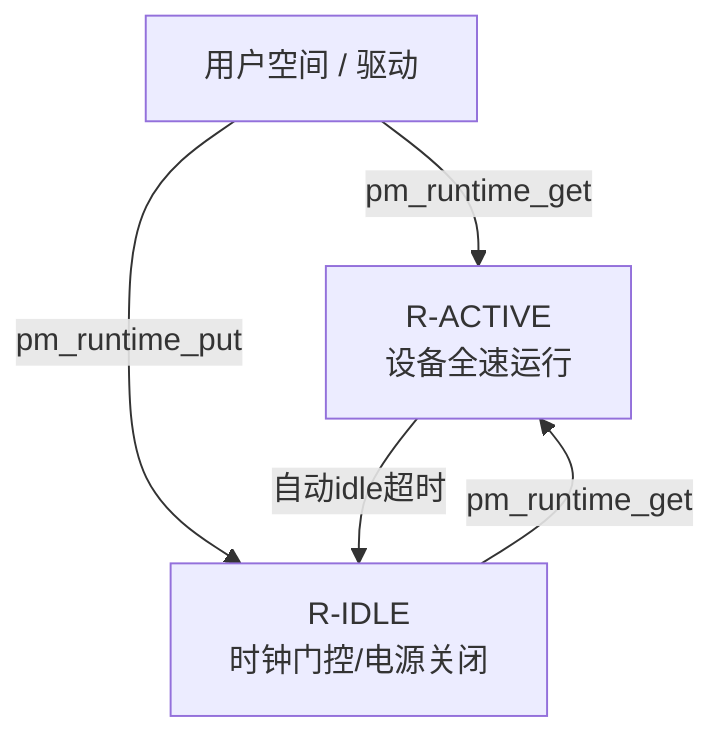
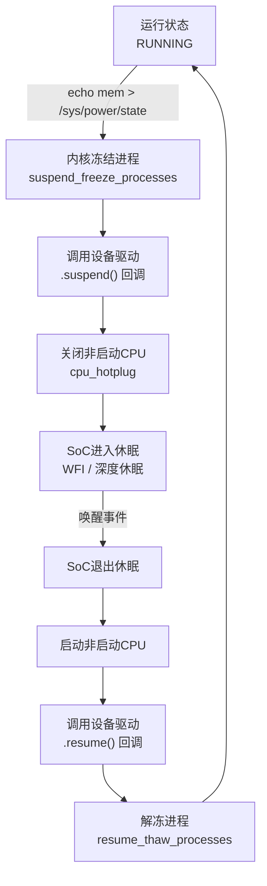
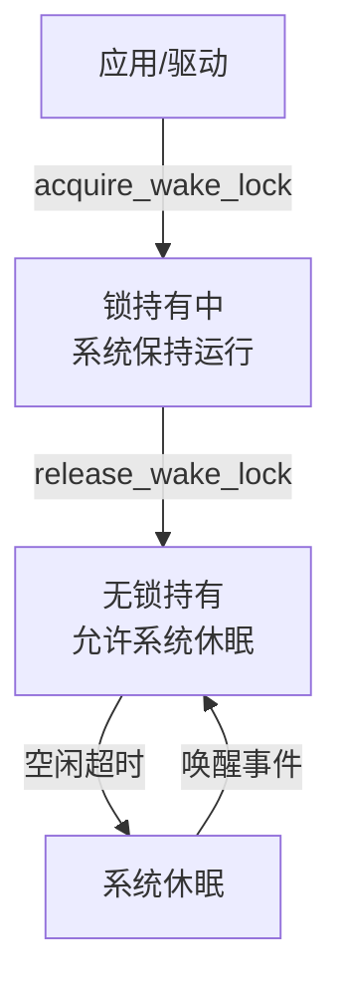
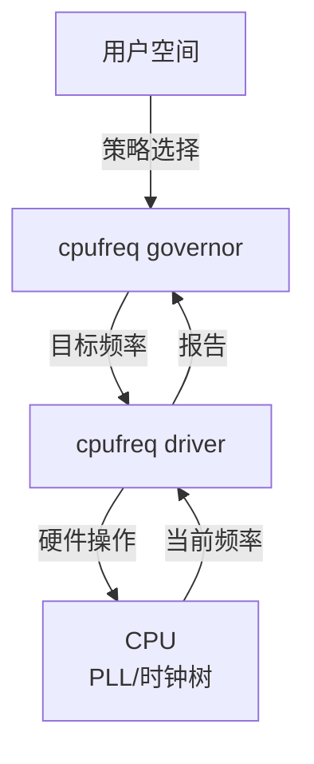
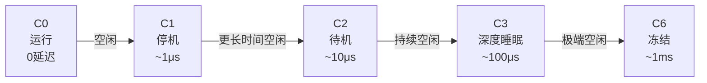

# Linux电源管理框架

> <span class="badge-i">**中级 (Intermediate)**</span>
> 掌握Runtime PM框架、Suspend-Resume流程、Wake Lock机制、cpufreq架构和cpuidle C-state层级。

---

## Runtime PM框架

---

### <strong>设备级动态电源管理</strong>

<span class="badge-i">I</span><br>
<span class="red">Runtime PM（Runtime Power Management）</span>是Linux内核的设备级动态电源管理框架，当设备空闲时自动关闭时钟或电源，有请求时自动恢复。<br>



<span class="orange"><strong>1. 核心API：</strong></span><br>
驱动通过 <span class="green">pm_runtime_get()</span> 和 <span class="green">pm_runtime_put()</span> 标记设备使用区间，Runtime PM子系统自动处理状态转换。<br>

```c
// 文件路径：drivers/spi/spi.c
// 功能：SPI驱动Runtime PM集成示例
// 行号：1-20
static int spi_transfer(struct spi_device *spi, struct spi_message *msg)
{
    struct spi_controller *ctlr = spi->controller;
    int ret;

    ret = pm_runtime_get_sync(ctlr->dev.parent);
    if (ret < 0)
        return ret;

    ret = ctlr->transfer_one_message(ctlr, msg);

    pm_runtime_put(ctlr->dev.parent);
    return ret;
}
```

<span class="orange"><strong>2. 自动idle机制：</strong></span><br>
<span class="green">pm_runtime_set_autosuspend_delay()</span> 设置设备空闲后自动进入低功耗状态的延迟时间。
驱动无需手动管理，由内核定时器触发状态转换。<br>

<span class="orange"><strong>3. 设备状态转换：</strong></span><br>

| 状态 | 描述 | 恢复延迟 |
|------|------|---------|
| R-ACTIVE | 设备全速运行 | 0 |
| R-IDLE | 时钟门控 | 微秒级 |
| SUSPENDED | 电源关闭 | 毫秒级 |

<span class="blue">关键洞察：Runtime PM的核心价值是"透明"——驱动只需标记使用区间，复杂的电源状态管理由内核自动完成。</span><br>

---

## Suspend-Resume流程

---

### <strong>系统级休眠与唤醒</strong>

<span class="badge-i">I</span><br>
<span class="red">Suspend-Resume</span>是系统级电源管理，将整个系统（除RAM外）置于低功耗状态，由外部事件唤醒。<br>



<span class="orange"><strong>1. 休眠状态选择：</strong></span><br>

| 状态 | 内核命令 | 功耗 | 唤醒时间 | RAM | 备注 |
|------|---------|------|---------|-----|------|
| 冻结 | freeze | 极低变化 | 毫秒级 | 保留 | 仅冻结用户态，用于调试 |
| 待机 | standby | 略降 | 毫秒级 | 保留 | CPU时钟门控 |
| 内存 | mem | 显著降低 | 百毫秒级 | 保留 | SoC深度休眠，DDR自刷新 |
| 磁盘 | disk | 接近零 | 秒级 | 不保留 | hibernate，写入swap |

```bash
# 手动触发休眠
$ echo mem > /sys/power/state

# 配置唤醒源
$ echo enabled > /sys/class/rtc/rtc0/device/power/wakeup
$ echo enabled > /sys/devices/platform/gpio-keys/power/wakeup
```

<span class="orange"><strong>2. 设备驱动的 suspend/resume 回调：</strong></span><br>

```c
// 文件路径：drivers/i2c/i2c-dev.c
// 功能：I2C设备的suspend/resume实现
// 行号：1-20
static int i2c_dev_suspend(struct device *dev)
{
    struct i2c_dev *i2c_dev = dev_get_drvdata(dev);
    
    // 保存设备状态
    i2c_dev->saved_ctrl = readl(i2c_dev->base + I2C_CTRL);
    
    // 关闭时钟
    clk_disable(i2c_dev->clk);
    
    return 0;
}

static int i2c_dev_resume(struct device *dev)
{
    struct i2c_dev *i2c_dev = dev_get_drvdata(dev);
    
    // 恢复时钟
    clk_enable(i2c_dev->clk);
    
    // 恢复设备状态
    writel(i2c_dev->saved_ctrl, i2c_dev->base + I2C_CTRL);
    
    return 0;
}

static const struct dev_pm_ops i2c_dev_pm_ops = {
    .suspend = i2c_dev_suspend,
    .resume = i2c_dev_resume,
};
```

<span class="blue">关键洞察：Suspend-Resume的可靠性取决于每个设备驱动正确实现.suspend/.resume回调——遗漏状态保存会导致唤醒后设备异常。</span><br>

---

## Wake Lock机制

---

### <strong>阻止系统进入休眠的显式锁</strong>

<span class="badge-i">I</span><br>
<span class="red">Wake Lock</span>（唤醒锁）是Android引入、后被Linux主流化的机制，允许用户态或内核态显式阻止系统进入休眠状态。<br>



<span class="orange"><strong>1. 内核Wake Lock API：</strong></span><br>

```c
// 文件路径：include/linux/wakelock.h
// 功能：内核态唤醒锁
// 行号：1-15
#include <linux/wakelock.h>

static struct wakelock my_wakelock;

// 初始化
wakelock_init(&my_wakelock, WAKE_LOCK_SUSPEND, "my_wakelock");

// 获取锁（阻止系统休眠）
wakelock_acquire(&my_wakelock);

// 释放锁（允许系统休眠）
wakelock_release(&my_wakelock);
```

<span class="orange"><strong>2. 用户态Wake Lock（Android）：</strong></span><br>

```bash
# 获取唤醒锁
$ echo my_lock > /sys/power/wake_lock

# 释放唤醒锁
$ echo my_lock > /sys/power/wake_unlock

# 查看当前持有的锁
$ cat /sys/power/wake_lock
```

<span class="orange"><strong>3. Wake Lock与Suspend的关系：</strong></span><br>
系统进入suspend之前会检查是否还有活跃的wake lock。如果有，suspend请求被推迟直到所有锁释放。
这是防止关键任务（如数据传输、固件升级）被中断的机制。<br>

| 场景 | 锁类型 | 释放时机 |
|------|--------|---------|
| 屏幕点亮 | PARTIAL_WAKE_LOCK | 屏幕关闭 |
| 数据传输 | FULL_WAKE_LOCK | 传输完成 |
| GPS定位 | PARTIAL_WAKE_LOCK | 定位完成 |
| 音乐播放 | PARTIAL_WAKE_LOCK | 播放停止 |

<span class="blue">关键洞察：Wake Lock是"休眠许可"模型——默认允许休眠，显式锁阻止休眠。这与早期的"禁止休眠默认"模型相比，减少了功耗泄漏风险。</span><br>

---

## cpufreq架构

---

### <strong>CPU频率动态调节</strong>

<span class="badge-i">I</span><br>
<span class="red">cpufreq</span>是Linux内核的CPU频率管理子系统，通过governor策略自动或手动调节CPU运行频率。<br>



<span class="orange"><strong>1. Governor策略：</strong></span><br>

| Governor | 策略 | 适用场景 |
|----------|------|---------|
| performance | 始终最高频率 | 性能优先，无视功耗 |
| powersave | 始终最低频率 | 功耗优先，无视性能 |
| ondemand | 负载高时升频，低时降频 | 通用场景 |
| conservative | 类似ondemand，但升频更保守 | 电池设备 |
| userspace | 用户手动指定频率 | 测试/特殊场景 |
| schedutil | 基于调度器负载信息 | 现代推荐 |

```bash
# 查看可用governor
$ cat /sys/devices/system/cpu/cpu0/cpufreq/scaling_available_governors
ondemand conservative powersave performance schedutil

# 切换governor
$ echo schedutil > /sys/devices/system/cpu/cpu0/cpufreq/scaling_governor

# 查看当前频率
$ cat /sys/devices/system/cpu/cpu0/cpufreq/scaling_cur_freq
```

<span class="orange"><strong>2. OPP表（Operating Performance Points）：</strong></span><br>
OPP表定义了SoC支持的频率-电压组合，通常通过Device Tree描述。
cpufreq驱动根据OPP表执行实际的频率切换。<br>

```dts
// 文件路径：arch/arm64/boot/dts/rockchip/rk3399.dtsi
// 功能：RK3399 CPU OPP表（片段）
// 行号：1-15
cpu0_opp_table: opp-table-0 {
    compatible = "operating-points-v2";
    opp-shared;

    opp-408000000 {
        opp-hz = /bits/ 64 <408000000>;
        opp-microvolt = <800000>;
    };
    opp-600000000 {
        opp-hz = /bits/ 64 <600000000>;
        opp-microvolt = <825000>;
    };
    opp-816000000 {
        opp-hz = /bits/ 64 <816000000>;
        opp-microvolt = <850000>;
    };
    // ... 更多频率点
};
```

<span class="blue">关键洞察：cpufreq的核心是"governor选择策略+OPP表定义可行域+驱动执行切换"的三层架构——策略层决定"何时调"，OPP表决定"可调到哪"，驱动层决定"怎么调"。</span><br>

---

## cpuidle C-state层级

---

### <strong>CPU空闲状态的层级化管理</strong>

<span class="badge-i">I</span><br>
<span class="red">cpuidle</span>管理CPU在空闲时的功耗状态（C-state），从浅休眠（C1，微秒级唤醒）到深休眠（C3+，毫秒级唤醒）形成层级。<br>

| C-state | 名称 | 功耗降低 | 退出延迟 | 行为 |
|---------|------|---------|---------|------|
| C0 | 运行 | 0% | 0 | 正常执行 |
| C1 | 停机 | ~30% | ~1μs | 停止时钟，保留上下文 |
| C2 | 待机 | ~50% | ~10μs | 部分单元关闭 |
| C3 | 深度睡眠 | ~70% | ~100μs | 缓存刷新/关闭 |
| C6 | 冻结 | ~90% | ~1ms | CPU状态保存到内存 |
| C7+ | 离线 | ~95% | ~5ms | CPU核心电源关闭 |



<span class="orange"><strong>1. Governor选择逻辑：</strong></span><br>
cpuidle governor根据历史空闲时长预测下一次任务的到达时间，选择"够深但不太深"的C-state。
<span class="green">预测过短导致功耗节省不足，预测过长导致唤醒延迟超标</span>。<br>

<span class="orange"><strong>2. 嵌入式中的cpuidle限制：</strong></span><br>
- 某些SoC不支持深C-state（如C6），或唤醒延迟超出产品容忍范围<br>
- 实时系统（PREEMPT_RT）可能禁用深C-state以保证确定性延迟<br>
- cpuidle与cpufreq的协同：空闲时降C-state，有负载时升频<br>

<span class="blue">关键洞察：cpuidle的"层级越深功耗越低但延迟越高"是嵌入式设计的关键权衡——工业控制通常只用到C1/C2，消费电子可用到C6/C7。</span><br>

---

## 历史演进：从APM到Runtime PM

---

### <strong>Linux电源管理子系统的二十年</strong>

<span class="badge-i">I</span><br>

| 年代 | 子系统 | 层级 | 特点 |
|------|--------|------|------|
| 2000 | APM兼容 | 系统级 | 旧式BIOS接口 |
| 2003 | cpufreq | CPU级 | 动态调频 |
| 2005 | cpuidle | CPU级 | 空闲状态管理 |
| 2009 | Runtime PM | 设备级 | 设备空闲时自动低功耗 |
| 2010 | PM QoS | 系统级 | 性能/功耗质量约束 |
| 2012 | Device Tree PM | 设备级 | 硬件描述驱动化 |

<span class="blue">演进逻辑：从"系统级开关"到"CPU级调节"再到"设备级精细化"，趋势是更细粒度、更自动化的电源管理。</span><br>

---

## 小结

---

### <strong>本章核心要点</strong>

| 知识点 | 关键内容 | 难度 |
|--------|---------|------|
| Runtime PM | pm_runtime_get/put，自动idle | I |
| Suspend-Resume | freeze/standby/mem/disk，驱动回调 | I |
| Wake Lock | 显式锁，阻止系统休眠 | I |
| cpufreq | governor策略，OPP表 | I |
| cpuidle | C-state层级，延迟-功耗权衡 | I |

---

### <strong>本章练习题</strong>

<span class="badge-i">I</span>

1. Runtime PM和Suspend-Resume的本质区别是什么？分别适用于什么场景？
2. 为什么Wake Lock采用"默认允许休眠，显式锁阻止"模型？与"默认禁止休眠"模型相比有什么优势？
3. 比较ondemand和schedutil governor的决策依据，为什么schedutil被推荐为现代首选？

---

> <span class="badge-i">I</span> <span class="blue">Linux电源管理是"分层协作"的艺术——Runtime PM管设备，cpufreq管CPU，cpuidle管空闲，Suspend-Resume管系统，各层独立工作又相互配合。</span>
