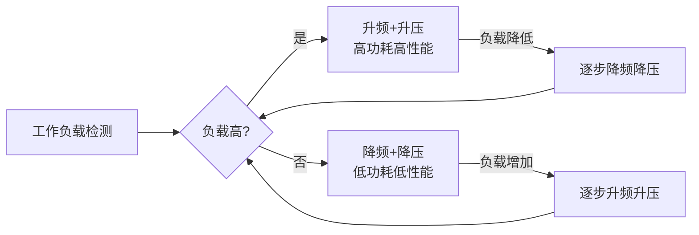
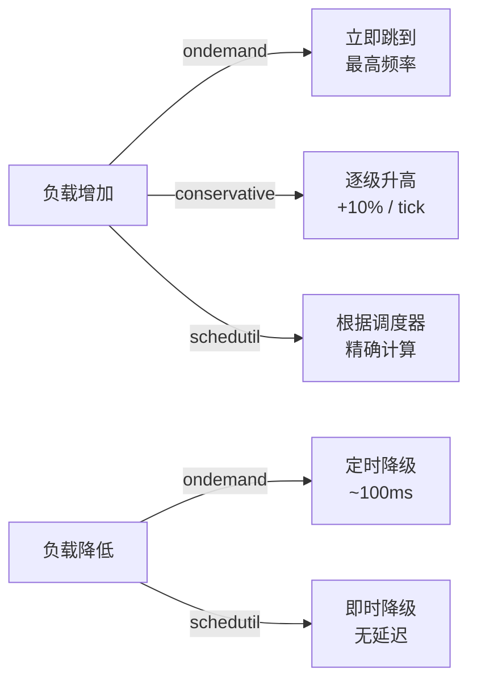
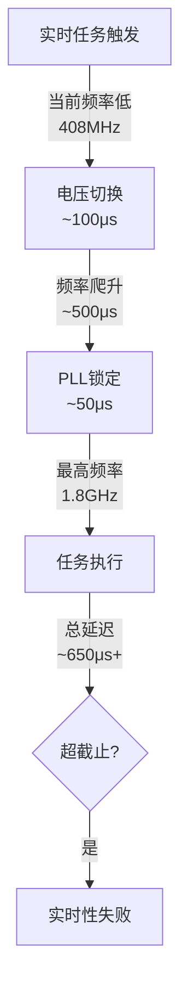

# DVFS与动态调频实战

> <span class="badge-i">**中级 (Intermediate)**</span> <span class="badge-e">**高级 (Expert)**</span>
> 理解DVFS原理与曲线，掌握cpufreq Governor对比和userspace手动调频，了解嵌入式调频策略选型，处理调频与实时性的冲突。

---

## DVFS原理与曲线

---

### <strong>动态电压频率调节的物理基础</strong>

<span class="badge-i">I</span><br>
<span class="red">DVFS（Dynamic Voltage and Frequency Scaling）</span>根据工作负载动态调整CPU电压和频率，是嵌入式功耗优化的核心手段。<br>



<span class="orange"><strong>1. 电压-频率关系：</strong></span><br>
数字电路的最高工作频率与供电电压近似成正比。更高的频率需要更高的电压来保证信号完整性。
<span class="green">因此升频必须伴随升压，降频必须伴随降压</span>。<br>

<span class="orange"><strong>2. 功耗与电压的平方关系：</strong></span><br>
<span class="green">P_dynamic = α · C · V² · f</span>
电压平方项意味着降电压的节能效果远超降频率。
例如电压从1.0V降到0.8V（20%降幅），动态功耗降低约36%。<br>

<span class="orange"><strong>3. OPP曲线：</strong></span><br>
Operating Performance Points定义了SoC支持的频率-电压组合。每条OPP是一个(voltage, frequency)对，形成功耗-性能权衡曲线。<br>

| OPP点 | 频率(MHz) | 电压(mV) | 相对功耗 | 适用场景 |
|-------|----------|---------|---------|---------|
| 最高 | 1800 | 1100 | 100% | 峰值负载 |
| 中高频 | 1200 | 950 | 42% | 中等负载 |
| 中频 | 800 | 850 | 19% | 轻负载 |
| 最低 | 400 | 750 | 5% | 空闲/待机 |

<span class="blue">关键洞察：DVFS的节能核心不是"降频"，而是"降压"——频率只是跟随电压的可行域。</span><br>

---

## cpufreq Governor对比

---

### <strong>策略选型：从保守到激进的频谱</strong>

<span class="badge-i">I</span><br>
<span class="red">cpufreq Governor</span>决定了系统如何根据负载选择目标频率，不同策略在响应速度和功耗节省之间做出不同权衡。<br>

| Governor | 触发机制 | 升频速度 | 降频速度 | 功耗 | 适用场景 |
|----------|---------|---------|---------|------|---------|
| performance | 无，始终最高 | 即时 | 从不 | 最高 | 基准测试、实时任务 |
| powersave | 无，始终最低 | 从不 | 即时 | 最低 | 待机、后台任务 |
| ondemand | 负载超过阈值 | 立即到最高 | 定时降级 | 中 | 通用桌面 |
| conservative | 负载超过阈值 | 逐级升频 | 定时降级 | 中低 | 电池设备 |
| userspace | 手动控制 | 手动 | 手动 | 自定义 | 测试、特殊策略 |
| schedutil | 调度器负载信息 | 即时 | 即时 | 中 | 现代通用首选 |
| interactive | 触摸/输入事件 | 即时 | 延迟降级 | 中 | Android移动设备 |



<span class="orange"><strong>1. ondemand 的锯齿问题：</strong></span><br>
ondemand在负载峰值时立即跳到最高频率，负载降低后定时降级，导致频率在高低之间剧烈震荡。
<span class="green">这种锯齿消耗额外的电压转换能量</span>，且增加系统不稳定风险。<br>

<span class="orange"><strong>2. schedutil 的优势：</strong></span><br>
schedutil直接从Linux调度器获取CPU利用率信息，无需额外的负载采样定时器。
升频和降频都是即时的，没有ondemand的锯齿问题。<br>

```bash
# 查看和切换governor
$ cat /sys/devices/system/cpu/cpu0/cpufreq/scaling_available_governors
$ cat /sys/devices/system/cpu/cpu0/cpufreq/scaling_governor

# 设置schedutil
$ echo schedutil | tee /sys/devices/system/cpu/cpu*/cpufreq/scaling_governor
```

<span class="blue">关键洞察：governor的选择本质是"响应速度 vs 功耗节省 vs 稳定性"的三方权衡——没有 universally 最优的governor，只有最适合当前场景的governor。</span><br>

---

## userspace手动调频

---

### <strong>绕过governor的直接控制</strong>

<span class="badge-e">E</span><br>
<span class="red">userspace governor</span>允许用户态程序直接控制CPU频率，适用于需要自定义策略或固定频率的特殊场景。<br>

```bash
# 切换到userspace governor
$ echo userspace > /sys/devices/system/cpu/cpu0/cpufreq/scaling_governor

# 手动设置频率（必须在OPP表中存在的频率）
$ cat /sys/devices/system/cpu/cpu0/cpufreq/scaling_available_frequencies
408000 600000 816000 1008000 1200000 1416000 1608000 1800000

$ echo 408000 > /sys/devices/system/cpu/cpu0/cpufreq/scaling_setspeed

# 查看实际频率
$ cat /sys/devices/system/cpu/cpu0/cpufreq/cpuinfo_cur_freq
```

```c
// 文件路径：manual_dvfs.c
// 功能：用户态手动DVFS控制
// 行号：1-40
#include <stdio.h>
#include <stdlib.h>
#include <string.h>

#define FREQ_PATH "/sys/devices/system/cpu/cpu0/cpufreq/scaling_setspeed"
#define GOV_PATH  "/sys/devices/system/cpu/cpu0/cpufreq/scaling_governor"

int set_governor(const char *gov) {
    FILE *fp = fopen(GOV_PATH, "w");
    if (!fp) return -1;
    fprintf(fp, "%s\n", gov);
    fclose(fp);
    return 0;
}

int set_frequency(unsigned long freq) {
    FILE *fp = fopen(FREQ_PATH, "w");
    if (!fp) return -1;
    fprintf(fp, "%lu\n", freq);
    fclose(fp);
    return 0;
}

// 场景：数据采集期间锁定最高频率
void enter_high_performance_mode(void) {
    set_governor("userspace");
    set_frequency(1800000);  // 1.8GHz
}

// 场景：待机时锁定最低频率
void enter_low_power_mode(void) {
    set_governor("userspace");
    set_frequency(408000);   // 408MHz
}

// 场景：恢复自动管理
void enter_auto_mode(void) {
    set_governor("schedutil");
}
```

<span class="orange"><strong>1. 适用场景：</strong></span><br>
- 实时任务执行前锁定最高频率，消除调频延迟抖动<br>
- 已知负载模式的应用（如固定周期数据采集），手动切换比governor更高效<br>
- 测试和标定：固定频率以排除DVFS变量<br>

<span class="blue">关键洞察：userspace调频是"手动挡"——控制权完全交给应用，适合负载模式已知且需要精确控制的场景，但增加了应用层的复杂度。</span><br>

---

## 嵌入式调频策略选型

---

### <strong>根据产品定位选择DVFS策略</strong>

<span class="badge-e">E</span><br>
<span class="red">嵌入式调频策略选型</span>不是技术问题，而是产品问题——策略必须与产品形态、能源来源和用户场景匹配。<br>

| 产品类型 | 能源 | 调频策略 | Governor | 理由 |
|----------|------|---------|----------|------|
| 智能手表 | 电池 | 保守调频 | conservative / 自定义 | 续航优先，容忍响应延迟 |
| 工业网关 | 市电/POE | 按需调频 | schedutil | 性能与功耗平衡 |
| 车载T-Box | 汽车电源 | 实时锁定 | performance | 实时性优先，功耗充裕 |
| 环境传感器 | 能量收集 | 间歇运行 | userspace + 手动 | 仅在采集时唤醒 |
| 安防摄像头 | 市电/电池 | 事件触发 | interactive | 事件前升频，空闲时降频 |

<span class="orange"><strong>1. 电池设备的保守策略：</strong></span><br>
保守调频（conservative或自定义）在负载增加时逐级升频，避免ondemand的剧烈跳变。
<span class="green">每级升频伴随升压，逐级升频比一步到位减少电压转换损耗</span>。<br>

<span class="orange"><strong>2. 市电设备的高性能策略：</strong></span><br>
市电供电设备对功耗不敏感，可使用schedutil保持响应性，仅在空闲时段自动降频。
<span class="green">即使功耗不重要，降低CPU温度仍延长设备寿命</span>。<br>

<span class="orange"><strong>3. 能量收集设备的间歇策略：</strong></span><br>
能量收集设备的平均功耗必须低于采集功率，通常采用<span class="green">"采集-处理-休眠"</span>的周期模式。
处理阶段锁定最高频率以最小化处理时间，其余时间深度休眠。<br>

<span class="blue">关键洞察：嵌入式DVFS策略的核心决策因素是"能源来源"——电池设备需要极度保守，市电设备可以宽松，无源设备必须间歇运行。</span><br>

---

## 调频与实时性冲突

---

### <strong>DVFS对实时任务的延迟影响</strong>

<span class="badge-e">E</span><br>
<span class="red">调频与实时性的冲突</span>是嵌入式实时系统的核心矛盾——DVFS的电压切换延迟和频率爬升延迟会引入不可控的执行时间抖动。<br>



<span class="orange"><strong>1. 电压切换延迟：</strong></span><br>
PMIC（电源管理IC）的电压爬升速率通常为<span class="green">10-50mV/μs</span>，从0.7V到1.1V需要约10-40μs。
某些PMIC支持快速瞬态响应，但成本更高。<br>

<span class="orange"><strong>2. 频率切换延迟：</strong></span><br>
PLL（锁相环）重新锁定到新频率需要<span class="green">数十到数百微秒</span>。
某些SoC支持glitch-free时钟切换，可在不停止CPU的情况下平滑过渡。<br>

<span class="orange"><strong>3. 解决方案：</strong></span><br>

| 方案 | 机制 | 代价 |
|------|------|------|
| 实时任务前锁定频率 | userspace锁定最高频率 | 功耗增加 |
| 实时域使用固定频率核心 | ARM big.LITTLE的大核固定高频 | 硬件支持 |
| PREEMPT_RT禁用DVFS | 内核配置关闭调频 | 全时段高功耗 |
| 预测性升频 | 任务调度前提前升频 | 预测准确率 |

```c
// 文件路径：rt_dvfs_lock.c
// 功能：实时任务执行前锁定频率
// 行号：1-30
#include <pthread.h>
#include <sched.h>

// 进入实时任务前调用
void rt_task_prepare(void) {
    // 锁定CPU到最高频率
    FILE *fp = fopen("/sys/devices/system/cpu/cpu0/cpufreq/scaling_governor", "w");
    fprintf(fp, "performance\n");
    fclose(fp);
    
    // 也可锁定特定CPU核心
    cpu_set_t cpuset;
    CPU_ZERO(&cpuset);
    CPU_SET(0, &cpuset);  // 绑定到CPU0
    sched_setaffinity(0, sizeof(cpuset), &cpuset);
}

// 实时任务完成后恢复
void rt_task_complete(void) {
    FILE *fp = fopen("/sys/devices/system/cpu/cpu0/cpufreq/scaling_governor", "w");
    fprintf(fp, "schedutil\n");
    fclose(fp);
}
```

<span class="blue">关键洞察：实时性与DVFS的矛盾本质是"确定性 vs 能效"——当截止时间比调频延迟更紧时，必须牺牲能效换取确定性。</span><br>

---

## 历史演进：从固定频率到智能调频

---

### <strong>DVFS技术的二十年</strong>

<span class="badge-e">E</span><br>

| 年代 | 技术 | 特点 |
|------|------|------|
| 2000 | 固定频率 | 无调频，功耗恒定 |
| 2003 | ondemand | 首个内核governor，负载触发 |
| 2008 | conservative | 逐级调频，减少震荡 |
| 2012 | interactive | Android专用，触摸事件触发 |
| 2016 | schedutil | 调度器信息驱动，即时响应 |
| 2020+ | AI预测调频 | 基于负载预测提前调频 |

<span class="blue">演进逻辑：从"被动响应负载"到"主动预测需求"，DVFS正在从规则驱动转向数据驱动。</span><br>

---

## 小结

---

### <strong>本章核心要点</strong>

| 知识点 | 关键内容 | 难度 |
|--------|---------|------|
| DVFS原理 | P=αCV²f，电压平方项主导 | I |
| Governor对比 | ondemand/conservative/sched/userspace | I |
| userspace调频 | 手动控制，特殊场景 | E |
| 策略选型 | 电池保守、市电平衡、无源间歇 | E |
| 实时性冲突 | 电压/频率切换延迟，锁定方案 | E |

---

### <strong>本章练习题</strong>

<span class="badge-e">E</span>

1. 从P=αCV²f公式推导，为什么电压从1.0V降到0.8V的功耗降低远大于频率从1GHz降到0.8GHz？
2. ondemand governor的"锯齿"问题是什么？schedutil如何解决？
3. 设计一个实时电机控制任务的DVFS策略，要求控制周期1ms内完成，允许的最高功耗为2W。

---

> <span class="badge-e">E</span> <span class="blue">DVFS是嵌入式功耗优化的"瑞士军刀"——但刀口朝向的是能效还是实时性，取决于你如何握持它。</span>
