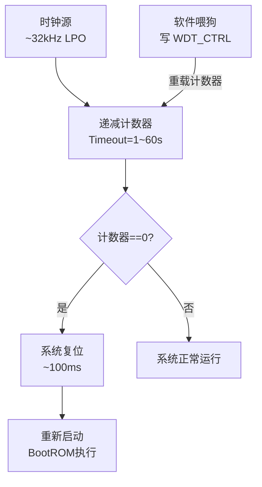
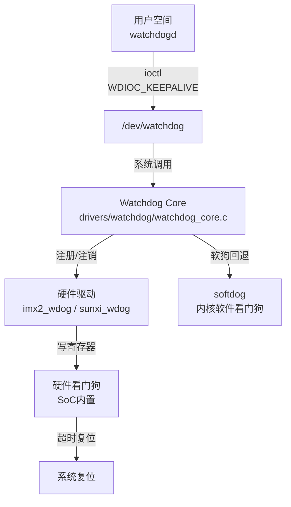
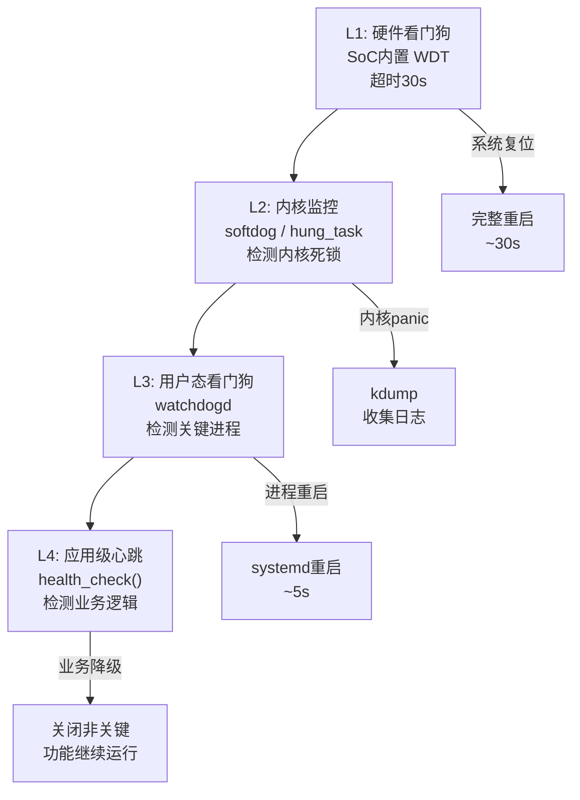

# 看门狗与可靠性设计

> <span class="badge-i">**中级 (Intermediate)**</span> <span class="badge-e">**高级 (Expert)**</span>
> 理解看门狗计数器原理，区分内核watchdog与硬件看门狗，掌握用户空间喂狗实现和多级心跳架构，设计故障恢复策略。

---

## 看门狗计数器原理

---

### <strong>硬件看门狗的计时与复位机制</strong>

<span class="badge-i">I</span><br>
<span class="red">硬件看门狗（Watchdog Timer）</span>是SoC内置的独立计时器，在设定超时时间内未被软件"喂狗"则强制复位整个系统。<br>



<span class="orange"><strong>1. 计数器工作原理：</strong></span><br>
看门狗使用独立的低速时钟（如32.768kHz LPO），即使主CPU时钟停止也能继续计数。
<span class="green">计数器溢出时产生复位脉冲，持续约100ms确保CPU可靠复位</span>。<br>

<span class="orange"><strong>2. 窗口看门狗：</strong></span><br>
<span class="green">窗口看门狗（Window Watchdog）</span>要求喂狗必须在计数器值介于上下窗口之间进行。
过早或过晚喂狗都会触发复位，有效防止死循环中规律性的"假喂狗"。<br>

<span class="orange"><strong>3. 关键参数：</strong></span><br>

| 参数 | 典型值 | 设计考量 |
|------|--------|---------|
| 超时时间 | 1s ~ 60s | 覆盖系统最坏情况恢复时间 |
| 复位脉宽 | 10ms ~ 200ms | 确保CPU完全复位 |
| 时钟源 | 内部32kHz LPO | 独立于主时钟，CPU停转时仍有效 |
| 窗口范围 | 最小50%~最大100% | 防止过早喂狗 |

<span class="blue">关键洞察：看门狗不是"防bug"的——它不能防止逻辑错误，只能防止"系统卡住不动"。</span><br>

---

## 内核watchdog vs 硬件

---

### <strong>软件狗与硬件狗的互补关系</strong>

<span class="badge-i">I</span><br>
<span class="red">Linux内核看门狗</span>（softdog）是内核模块实现的软件看门狗，与硬件看门狗在保护层级上互补。<br>



| 特性 | 硬件看门狗 | 内核softdog | 用户空间监控 |
|------|-----------|------------|-------------|
| 监控范围 | 整个系统 | 内核 alive | 特定进程 alive |
| 独立性 | 完全独立，CPU死锁也能复位 | 依赖内核调度 | 依赖进程调度 |
| 可配置性 | 超时时间固定或有限 | 可动态调整 | 完全可编程 |
| 开销 | 零 | 内核线程定时器 | 用户态定时器 |
| 嵌入式必要性 | 必须 | 可选 | 可选 |

<span class="orange"><strong>1. 硬件看门狗的不可替代性：</strong></span><br>
硬件看门狗使用独立时钟和电源域，即使CPU进入死锁或时钟停止也能正常计数并复位系统。
<span class="green">任何不包含硬件看门狗的嵌入式产品设计都存在可靠性缺陷</span>。<br>

<span class="orange"><strong>2. softdog 的用途：</strong></span><br>
softdog在没有硬件看门狗的平台上提供最小保护，或在开发阶段模拟看门狗行为。
<span class="green">生产环境中softdog不能替代硬件看门狗</span>。<br>

```bash
# 查看系统看门狗状态
$ wdctl
Device:        /dev/watchdog
Identity:      imx2+ watchdog [Watchdog]
Timeout:       60 seconds
Timeleft:      58 seconds
```

<span class="blue">关键洞察：可靠性设计的"深度防御"原则——硬件狗保护系统级故障，软件狗保护内核级故障，用户态监控保护应用级故障，三层互补而非替代。</span><br>

---

## 用户空间喂狗实现

---

### <strong>将应用健康状态绑定到硬件看门狗</strong>

<span class="badge-e">E</span><br>
<span class="red">用户空间喂狗</span>是嵌入式看门狗工程的核心——不是简单地定时写寄存器，而是将系统的综合健康状态映射到喂狗动作。<br>

```c
// 文件路径：watchdog_feed.c
// 功能：多级健康检查喂狗实现
// 行号：1-55
#include <stdio.h>
#include <stdlib.h>
#include <unistd.h>
#include <fcntl.h>
#include <sys/ioctl.h>
#include <linux/watchdog.h>

#define WDT_DEV "/dev/watchdog"
#define WDT_TIMEOUT 30

static int wdt_fd = -1;
static unsigned int health_flags = 0;

#define HEALTH_NET      0x01
#define HEALTH_DISK     0x02
#define HEALTH_TEMP     0x04
#define HEALTH_APP      0x08
#define HEALTH_ALL      0x0F

static int wdt_init(void) {
    wdt_fd = open(WDT_DEV, O_WRONLY | O_CLOEXEC);
    if (wdt_fd < 0) return -1;
    
    int timeout = WDT_TIMEOUT;
    ioctl(wdt_fd, WDIOC_SETTIMEOUT, &timeout);
    
    // 获取实际设置的超时
    ioctl(wdt_fd, WDIOC_GETTIMEOUT, &timeout);
    printf("Watchdog timeout: %d seconds\n", timeout);
    return 0;
}

static void wdt_feed(void) {
    if (wdt_fd < 0) return;
    
    // 只有所有健康检查通过才喂狗
    if ((health_flags & HEALTH_ALL) == HEALTH_ALL) {
        int dummy = 0;
        ioctl(wdt_fd, WDIOC_KEEPALIVE, &dummy);
    } else {
        // 不喂狗，记录临终日志
        fprintf(stderr, "FATAL: health_flags=0x%02x, watchdog will reset\n", 
                health_flags);
    }
    
    // 每个喂狗周期清零标志，要求各子系统重新置位
    health_flags = 0;
}

static void *network_monitor(void *arg) {
    while (1) {
        if (check_network() == OK) {
            health_flags |= HEALTH_NET;
        }
        sleep(1);
    }
}

static void *temperature_monitor(void *arg) {
    while (1) {
        if (read_temperature() < 85) {  // 85°C阈值
            health_flags |= HEALTH_TEMP;
        }
        sleep(5);
    }
}

int main(void) {
    if (wdt_init() < 0) {
        fprintf(stderr, "Failed to open watchdog\n");
        return 1;
    }
    
    // 启动监控线程
    pthread_t net_thread, temp_thread;
    pthread_create(&net_thread, NULL, network_monitor, NULL);
    pthread_create(&temp_thread, NULL, temperature_monitor, NULL);
    
    // 主循环：周期性喂狗
    while (1) {
        // 应用层健康检查
        if (app_health_check()) {
            health_flags |= HEALTH_APP;
        }
        
        // 磁盘空间检查
        if (check_disk_space() > 10) {  // >10% 可用
            health_flags |= HEALTH_DISK;
        }
        
        wdt_feed();
        sleep(WDT_TIMEOUT / 2);  // 每15秒喂一次（超时30秒）
    }
    
    return 0;
}
```

<span class="orange"><strong>1. 喂狗频率设计：</strong></span><br>
喂狗间隔应小于超时时间的50%，通常为超时时间的1/3到1/2。
<span class="green">喂狗间隔15秒、超时30秒是常见的工程配置</span>，既保证及时检测故障，又避免过于频繁的系统调用。<br>

<span class="orange"><strong>2. 正常关闭看门狗：</strong></span><br>
程序正常退出时必须关闭看门狗，否则init进程停止后看门狗无人喂养将触发复位。
<span class="green">关闭方法：ioctl(WDIOS_DISABLECARD) 或直接 close(fd)</span>（取决于驱动实现）。<br>

<span class="blue">关键洞察：喂狗不是"心跳"——心跳只证明进程活着，而多级健康检查喂狗证明"系统不仅活着，而且健康运行"。</span><br>

---

## 多级心跳架构

---

### <strong>从单级喂狗到分层可靠性</strong>

<span class="badge-e">E</span><br>
<span class="red">多级心跳架构</span>将系统的可靠性监测分层，每一级监控不同的范围和粒度，形成深度防御。<br>



| 层级 | 监控范围 | 检测延迟 | 恢复动作 | 代价 |
|------|---------|---------|---------|------|
| L1 硬件狗 | 整个系统 | 30s | 系统复位 | 最大（全重启） |
| L2 内核狗 | 内核调度 | 10s | panic/kdump | 大 |
| L3 进程狗 | 关键进程 | 5s | 进程重启 | 中 |
| L4 业务狗 | 业务逻辑 | 1s | 功能降级 | 最小 |

<span class="orange"><strong>1. 分层设计原则：</strong></span><br>
越底层的监控范围越广、恢复代价越大；越上层的监控越精细、恢复代价越小。
理想情况下故障应在最高层级被发现和处理，避免触发底层的大范围恢复。<br>

<span class="orange"><strong>2. 心跳超时梯度：</strong></span><br>
L4心跳1秒、L3进程狗5秒、L2内核狗10秒、L1硬件狗30秒——
<span class="green">超时时间的梯度设计确保上层故障不会等待到底层超时</span>。<br>

<span class="blue">关键洞察：多级心跳的本质是"故障隔离"——业务故障在业务层处理，进程故障在进程层处理，只有系统级故障才触发整机复位。</span><br>

---

## 故障恢复策略

---

### <strong>看门狗触发后的恢复路径</strong>

<span class="badge-e">E</span><br>
<span class="red">故障恢复策略</span>定义看门狗触发复位后系统如何恢复正常运行，包括状态恢复、故障记录和防反复复位机制。<br>

<span class="orange"><strong>1. 复位原因记录：</strong></span><br>
SoC的复位状态寄存器（RSTC_SR）记录上一次复位原因（POR、WDT、外部复位等）。
Bootloader读取该寄存器并传递给内核，内核通过 <span class="green">/proc/reset_reason</span> 或设备树暴露给用户态。<br>

```c
// 文件路径：reset_reason.c
// 功能：读取并处理复位原因
// 行号：1-30
#include <stdio.h>
#include <stdlib.h>
#include <string.h>
#include <unistd.h>

#define RESET_COUNT_FILE "/var/run/reset_count"
#define MAX_RESET_COUNT  5

void handle_reset_reason(void) {
    unsigned int reason = read_reset_register();  // SoC特定
    
    if (reason == RESET_WATCHDOG) {
        int count = read_reset_count(RESET_COUNT_FILE);
        count++;
        write_reset_count(RESET_COUNT_FILE, count);
        
        if (count >= MAX_RESET_COUNT) {
            // 连续看门狗复位超过阈值，进入安全模式
            fprintf(stderr, "CRITICAL: %d consecutive watchdog resets\n", count);
            enter_safe_mode();
        } else {
            fprintf(stderr, "Watchdog reset #%d, normal boot\n", count);
        }
    } else if (reason == RESET_POWER_ON) {
        // 上电复位，清除计数
        write_reset_count(RESET_COUNT_FILE, 0);
    }
}
```

<span class="orange"><strong>2. 防反复复位机制：</strong></span><br>
连续看门狗复位（如5次内）表明存在系统性故障，继续复位无济于事。
<span class="green">系统应进入安全模式或关机等待人工干预</span>，而非无限复位循环。<br>

<span class="orange"><strong>3. 临终日志：</strong></span><br>
看门狗触发前应尽量保存临终状态。方案包括：
- <span class="green">RAM保留区</span>：复位不清除的RAM区域，Bootloader传递给内核<br>
- <span class="green">持久存储</span>：SPI Flash或EEPROM的紧急写入（需保证写入时间小于看门狗超时）<br>
- <span class="green">远程上报</span>：看门狗触发前的最后机会发送告警<br>

<span class="blue">关键洞察：看门狗是"最后手段"而非"首选方案"——好的可靠性设计应让看门狗极少触发，每次触发都值得深入分析根因。</span><br>

---

## 历史演进：从外部WDT到SoC集成

---

### <strong>看门狗技术的三十年</strong>

<span class="badge-e">E</span><br>

| 年代 | 技术 | 特点 |
|------|------|------|
| 1980s | 外部独立WDT芯片 | MAX705等，需额外硬件 |
| 1990s | MCU内置WDT | 8051/AVR内置，节省成本 |
| 2000s | SoC集成WDT | ARM9/ARM11标配，可配置超时 |
| 2010s | 窗口看门狗 | Cortex-M标配，防止假喂狗 |
| 2020+ | 多级WDT + 安全监控 | 独立安全核心监控主CPU |

<span class="blue">演进逻辑：从"外部附加"到"内置标配"再到"安全核心监控"，看门狗从可选配件演变为SoC不可或缺的安全组件。</span><br>

---

## 小结

---

### <strong>本章核心要点</strong>

| 知识点 | 关键内容 | 难度 |
|--------|---------|------|
| 计数器原理 | 独立时钟、递减计数、溢出复位 | I |
| 软硬对比 | 硬件必须、softdog可选、互补而非替代 | I |
| 用户态喂狗 | 健康检查绑定、周期性喂狗、正常关闭 | E |
| 多级心跳 | L1-L4分层、故障隔离、梯度超时 | E |
| 恢复策略 | 复位原因记录、防复复机制、临终日志 | E |

---

### <strong>本章练习题</strong>

<span class="badge-e">E</span>

1. 窗口看门狗和普通看门狗的本质区别是什么？什么场景下必须用窗口看门狗？
2. 为什么多级心跳架构中的超时时间要设计成梯度（1s/5s/10s/30s）？
3. 设计一个连续看门狗复位后的安全模式策略，包括状态恢复和人工介入机制。

---

> <span class="badge-e">E</span> <span class="blue">看门狗是系统的"安全气囊"——你希望在任何产品生命周期中都不要用上它，但它必须在关键时刻可靠弹出。</span>
