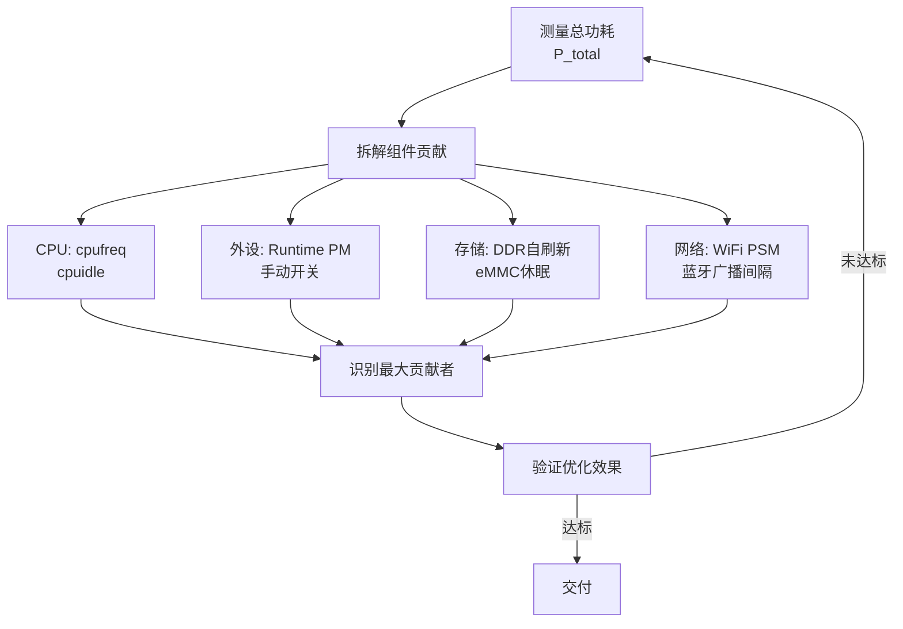

# 功耗分析与优化实战

> <span class="badge-e">**高级 (Expert)**</span>
> 掌握功耗Profiling方法论，建立外设功耗预算表，实现空闲时功耗优化和存储设备功耗优化，分析电池供电设备案例。

---

## 功耗Profiling方法论

---

### <strong>系统化的功耗诊断流程</strong>

<span class="badge-e">E</span><br>
<span class="red">功耗Profiling</span>是定位系统功耗瓶颈的系统性方法，将总功耗拆解为各组件贡献，识别优化优先级。<br>



<span class="orange"><strong>1. 基线测量：</strong></span><br>
在标准化条件下测量系统各工作状态的总功耗：<br>
- 全速运行（CPU满负载、所有外设活跃）<br>
- 典型工作负载（模拟实际应用场景）<br>
- 空闲状态（无用户交互、后台任务最少）<br>
- 深度休眠（Suspend-to-RAM或Suspend-to-Disk）<br>

<span class="orange"><strong>2. 组件拆解方法：</strong></span><br>
- <span class="green">CPU隔离</span>：锁定最低频率，观察功耗降幅（= CPU动态功耗贡献）<br>
- <span class="green">外设隔离</span>：逐个关闭外设，测量功耗变化<br>
- <span class="green">存储隔离</span>：减少DDR访问频率，启用eMMC休眠<br>
- <span class="green">网络隔离</span>：关闭WiFi/蓝牙，测量基线差异<br>

```bash
# 功耗拆解测量脚本
# 文件路径：scripts/power_profile.sh
# 行号：1-25
#!/bin/bash

measure() {
    local label=$1
    echo "=== $label ==="
    sleep 5  # 稳定期
    # 假设通过INA219读取电流值
    python3 -c "import ina219; print(ina219.read_current())"
}

# 基线：全速运行
echo performance | tee /sys/devices/system/cpu/cpu*/cpufreq/scaling_governor
measure "full_speed"

# CPU最低频率
echo powersave | tee /sys/devices/system/cpu/cpu*/cpufreq/scaling_governor
measure "cpu_min"

# 关闭WiFi
ifconfig wlan0 down
measure "no_wifi"

# 关闭蓝牙
hciconfig hci0 down
measure "no_bt"

# 进入空闲
cpufreq-set -g powersave
# 停止非关键服务
measure "idle"
```

<span class="blue">关键洞察：功耗Profiling的核心是"控制变量法"——每次只改变一个因素，精确测量该因素对总功耗的贡献。</span><br>

---

## 外设功耗预算表

---

### <strong>建立组件级功耗账本</strong>

<span class="badge-e">E</span><br>
<span class="red">外设功耗预算表</span>是嵌入式功耗管理的"账本"，记录每个外设在各种工作模式下的功耗，为设计决策提供数据基础。<br>

| 外设 | 活跃功耗 | 空闲功耗 | 休眠功耗 | 唤醒延迟 | 优化策略 |
|------|---------|---------|---------|---------|---------|
| CPU (1.8GHz) | 1500mW | 200mW | 10mW | 1ms | DVFS + cpuidle |
| DDR4 (2GB) | 800mW | 400mW | 50mW | 100μs | 自刷新 + 深度休眠 |
| eMMC (32GB) | 200mW | 50mW | 1mW | 10ms | 批量写入 + 休眠 |
| WiFi (802.11n) | 600mW | 50mW | 0.5mW | 500ms | PSM模式 + 延长DTIM |
| 蓝牙 (BLE) | 30mW | 3mW | 0.01mW | 50ms | 延长广播间隔 |
| LCD+背光 | 1500mW | 0mW | 0mW | 瞬时 | 亮度调节 + 自动关闭 |
| GPS模块 | 500mW | 100mW | 0mW | 2s | 间歇定位 + AGPS |
| 摄像头 | 300mW | 0mW | 0mW | 500ms | 按需启用 |

<span class="orange"><strong>1. 功耗预算分配：</strong></span><br>
以电池供电设备为例，假设目标续航7天、电池容量2000mAh@3.7V=7.4Wh：<br>
平均功耗预算 = 7.4Wh / (7 * 24h) = 44mW<br>
上述外设中仅LCD背光（1500mW活跃）就远超预算，<span class="green">必须大幅缩短活跃时间或降低亮度</span>。<br>

<span class="orange"><strong>2. 占空比计算：</strong></span><br>
对于间歇工作的外设，平均功耗 = 活跃功耗 × 占空比 + 休眠功耗 × (1-占空比)。
通过调整占空比使各外设的总贡献不超过预算。<br>

<span class="blue">关键洞察："功耗预算表"将抽象的"低功耗"转化为具体的"每个组件的功耗上限"——这是工程化的第一步。</span><br>

---

## 空闲时功耗优化

---

### <strong>空闲状态是功耗优化的主战场</strong>

<span class="badge-e">E</span><br>
<span class="red">空闲时功耗</span>决定了设备的待机时长，是电池设备续航的核心影响因素。<br>

<span class="orange"><strong>1. CPU空闲优化：</strong></span><br>
- 启用cpuidle governor，让CPU在空闲时进入最深可用C-state<br>
- 检查是否存在<span class="green">高频定时器</span>（如10ms周期timer）阻止CPU进入深休眠<br>
- 使用<span class="green">tickless内核</span>（CONFIG_NO_HZ_IDLE），空闲时停止定时器中断<br>

```bash
# 检查定时器中断频率
$ cat /proc/interrupts | grep timer
# 如果每秒数百次定时器中断，说明存在高频定时器

# 查找高频定时器来源
$ perf stat -a -e irq_vectors:local_timer_entry sleep 10
```

<span class="orange"><strong>2. 外设空闲优化：</strong></span><br>
- 使用Runtime PM自动关闭空闲外设时钟<br>
- WiFi启用<span class="green">Power Save Mode（PSM）</span>，DTIM间隔从100ms延长到1000ms<br>
- 蓝牙延长广播间隔，从100ms延长到1000ms+<br>

<span class="orange"><strong>3. 系统级空闲策略：</strong></span><br>

```bash
# 空闲时自动休眠脚本
# 文件路径：/usr/local/bin/auto-suspend.sh
# 行号：1-20
#!/bin/bash

IDLE_THRESHOLD_MS=300000  # 5分钟空闲触发休眠

while true; do
    IDLE_MS=$(cat /sys/class/thermal/thermal_zone0/temp)  # 占位，实际应读取输入空闲时间
    
    if [ "$IDLE_MS" -gt "$IDLE_THRESHOLD_MS" ]; then
        # 关闭非关键外设
        echo 0 > /sys/class/backlight/backlight/brightness
        ifconfig wlan0 down
        
        # 进入mem休眠
        echo mem > /sys/power/state
        
        # 唤醒后恢复
        ifconfig wlan0 up
    fi
    
    sleep 60
done
```

<span class="blue">关键洞察：空闲优化遵循"越深越好"原则——CPU进最深C-state，外设关时钟，系统进Suspend，每一层深入都能数量级降低功耗。</span><br>

---

## 存储设备功耗优化

---

### <strong>DDR和Flash的低功耗策略</strong>

<span class="badge-e">E</span><br>
<span class="red">存储设备</span>在嵌入式系统中通常是功耗大户，优化空间巨大。<br>

<span class="orange"><strong>1. DDR低功耗模式：</strong></span><br>
DDR SDRAM支持多种低功耗模式：<br>
- <span class="green">Self-Refresh</span>：DDR自己刷新，SoC可断开时钟，功耗降低~90%<br>
- <span class="green">Power-Down</span>：关闭输出缓冲，功耗降低~50%，唤醒更快<br>
- <span class="green">Deep Power-Down</span>：数据丢失，仅LPDDR支持，功耗接近零<br>

```c
// 文件路径：ddr_pm.c
// 功能：DDR低功耗模式切换
// 行号：1-20
#include <linux/io.h>

#define DDR_CTRL_BASE 0xFE800000
#define DDR_PWR_CTRL  0x04

void ddr_enter_self_refresh(void) {
    void __iomem *base = ioremap(DDR_CTRL_BASE, 0x100);
    
    // 停止DDR访问，刷新所有行
    // 切换到Self-Refresh模式
    writel(0x02, base + DDR_PWR_CTRL);
    
    iounmap(base);
}

void ddr_exit_self_refresh(void) {
    void __iomem *base = ioremap(DDR_CTRL_BASE, 0x100);
    
    // 退出Self-Refresh，恢复正常操作
    writel(0x00, base + DDR_PWR_CTRL);
    
    iounmap(base);
}
```

<span class="orange"><strong>2. eMMC/SD卡低功耗：</strong></span><br>
- 批量写入代替频繁小写入，减少激活时间<br>
- 启用eMMC的<span class="green">Sleep模式</span>（CMD5），空闲时自动进入低功耗<br>
- 使用<span class="green">Discard/Trim</span>命令减少后台GC开销<br>

<span class="orange"><strong>3. Flash寿命与功耗的权衡：</strong></span><br>
减少写入次数不仅延长Flash寿命，也降低功耗。
使用<span class="green">RAM缓存+定期刷写</span>策略，将随机小写入合并为顺序批量写入。<br>

<span class="blue">关键洞察：存储优化的"双峰"策略——活跃时尽可能快地完成任务然后立即休眠，空闲时让存储设备进入最深低功耗模式。</span><br>

---

## 案例：电池供电设备

---

### <strong>智能环境传感器的功耗优化全过程</strong>

<span class="badge-e">E</span><br>
<span class="red">电池供电环境传感器</span>的典型规格：CR123A电池（1500mAh@3V=4.5Wh），目标续航1年。
平均功耗预算 = 4.5Wh / 8760h = 0.51mW。<br>

| 阶段 | 操作 | 功耗 | 时长 | 能耗 |
|------|------|------|------|------|
| 唤醒 | 从深度休眠恢复 | 10mW | 100ms | 0.00028mWh |
| 采集 | 读取温度/湿度/气压 | 5mW | 50ms | 0.00007mWh |
| 处理 | 数据滤波和打包 | 15mW | 20ms | 0.00008mWh |
| 传输 | BLE发送数据包 | 30mW | 10ms | 0.00008mWh |
| 休眠 | RTC定时器运行 | 0.01mW | 60s | 0.00017mWh |

单次周期总能耗 ≈ 0.0007mWh，每小时60次 = 0.042mWh，年能耗 ≈ 368mWh。
4.5Wh电池理论上可支持约12年，但需考虑电池自放电和低温性能衰减，实际目标设定为3-5年。<br>

<span class="orange"><strong>1. 优化前vs优化后：</strong></span><br>

| 指标 | 优化前 | 优化后 | 手段 |
|------|--------|--------|------|
| 唤醒功耗 | 50mW | 10mW | 优化时钟树启动序列 |
| 采集功耗 | 20mW | 5mW | 传感器单次转换模式 |
| 处理功耗 | 50mW | 15mW | Cortex-M4@16MHz代替A7 |
| 传输功耗 | 100mW | 30mW | BLE代替WiFi，延长间隔 |
| 休眠功耗 | 5mW | 0.01mW | 关闭所有 regulator |
| 单次总能耗 | 17.5mWh | 0.0007mWh | 综合优化 |

<span class="orange"><strong>2. 关键优化手段：</strong></span><br>
- 用MCU（Cortex-M4）代替应用处理器（Cortex-A7），休眠功耗从mW级降至μW级<br>
- 传感器使用单次转换模式（One-Shot），读数后立即断电<br>
- BLE广播间隔从100ms延长到1000ms，连接间隔从15ms延长到100ms<br>
- 休眠时关闭所有DC-DC，仅保留RTC和唤醒引脚的LDO供电<br>

<span class="blue">关键洞察：电池设备的功耗优化不是"让活跃时更省电"，而是"让活跃时间尽可能短，让休眠功耗尽可能低"。</span><br>

---

## 历史演进：从经验到数据驱动

---

### <strong>功耗优化的方法论演进</strong>

<span class="badge-e">E</span><br>

| 年代 | 方法 | 特点 |
|------|------|------|
| 2000s | 经验法则 | "降频省电"，缺乏量化 |
| 2010s | 组件测量 | 示波器+电流探头，单组件优化 |
| 2015+ | 系统建模 | 功耗预算表，全局优化 |
| 2020+ | AI预测 | 负载预测+预调频，主动优化 |

<span class="blue">演进逻辑：从"直觉优化"到"测量驱动"再到"模型预测"，功耗优化正在从手工艺转变为数据科学。</span><br>

---

## 小结

---

### <strong>本章核心要点</strong>

| 知识点 | 关键内容 | 难度 |
|--------|---------|------|
| Profiling | 控制变量法、基线测量、组件拆解 | E |
| 功耗预算 | 各组件功耗上限、占空比计算 | E |
| 空闲优化 | 最深C-state、tickless、外设休眠 | E |
| 存储优化 | DDR Self-Refresh、eMMC Sleep、批量写入 | E |
| 电池案例 | MCU代替AP、单次转换、延长间隔 | E |

---

### <strong>本章练习题</strong>

<span class="badge-e">E</span>

1. 使用控制变量法设计一个功耗拆解实验，列出需要隔离的变量和测量顺序。
2. 计算一个目标续航30天、电池容量5000mAh@3.7V的设备平均功耗预算。如果LCD背光占50%，如何分配剩余预算？
3. 为什么电池设备更适合用MCU而非应用处理器？从活跃功耗和休眠功耗两个角度分析。

---

> <span class="badge-e">E</span> <span class="blue">功耗优化的终极目标是"在约束内完成使命"——不是追求最低功耗，而是追求"刚好够用的功耗"。</span>
