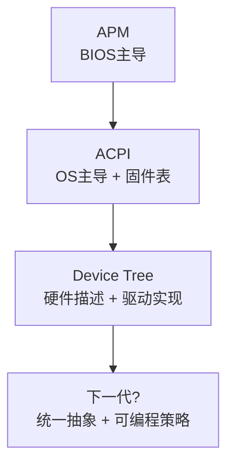
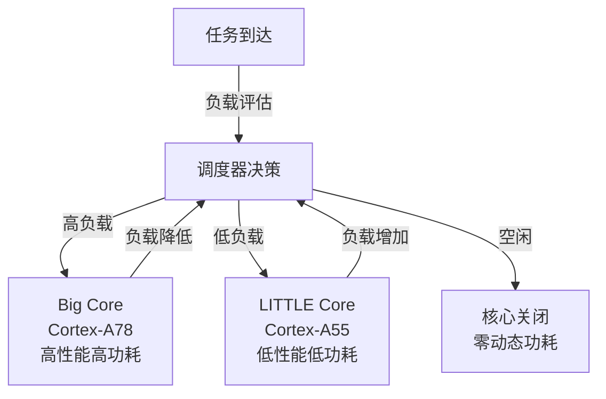

# 低功耗历史演进与前沿

> <span class="badge-e">**高级 (Expert)**</span> <span class="badge-m">**大师 (Master)**</span>
> 梳理从APM到ACPI到DT的电源管理演进，理解ARM big.LITTLE与DVFS、RISC-V低功耗扩展、能量收集与调度、AI辅助功耗预测。

---

## 从APM到ACPI到DT

---

### <strong>三代电源管理架构的适用域与局限</strong>

<span class="badge-e">E</span><br>
<span class="red">电源管理架构</span>的演进反映了计算平台从PC到服务器再到嵌入式设备的多元化需求。
<br>

| 架构 | 年代 | 主导平台 | 设计哲学 | 嵌入式适用性 |
|------|------|---------|---------|------------|
| APM | 1992 | x86笔记本 | BIOS主导，OS被动 | 不适用 |
| ACPI | 1996 | x86 PC/服务器 | OS主导，固件提供接口 | 不适用（ARM无统一BIOS） |
| Device Tree | 2005 | ARM/PowerPC | 开源硬件描述，驱动化 | 适用（但无统一电源标准） |
| Open Firmware | 1990s | PowerPC | 固件提供设备树 | 历史方案 |

<span class="orange"><strong>1. APM的被动模型：</strong></span><br>
APM时代电源管理由BIOS固件主导，操作系统只能被动请求状态转换。
<span class="green">固件决定"什么时候可以休眠"</span>，操作系统无权干涉。
这在移动场景（笔记本电脑合盖休眠）足够，但限制了操作系统的优化空间。<br>

<span class="orange"><strong>2. ACPI的主动模型：</strong></span><br>
ACPI将控制权交给操作系统，固件仅提供ACPI表（描述硬件能力和控制方法）。
操作系统可以自主决定何时进入何种休眠状态。
<span class="green">ACPI的成功依赖于x86生态的统一固件标准（BIOS/UEFI）</span>，这是ARM生态无法复制的。
<br>

<span class="orange"><strong>3. Device Tree的碎片化：</strong></span><br>
ARM Linux使用Device Tree描述硬件，但电源管理策略由内核子系统（cpufreq、cpuidle、Runtime PM）和驱动共同实现。
<span class="green">每个SoC厂商的电源管理方式不同</span>，缺乏跨平台的统一抽象。
<br>



<span class="blue">关键洞察：ARM嵌入式的电源管理碎片化是"开放生态"的代价——Device Tree提供了硬件描述的统一格式，但电源策略仍由每个SoC的驱动和内核子系统各自实现。
<br>

---

## ARM big.LITTLE与DVFS

---

### <strong>异构多核的功耗-性能调度</strong>

<span class="badge-e">E</span><br>
<span class="red">ARM big.LITTLE</span>架构将高性能核心（big）与高能效核心（LITTLE）集成在同一SoC中，通过调度器实现任务在两种核心间的动态迁移。
<br>



<span class="orange"><strong>1. big.LITTLE的调度策略：</strong></span><br>

| 策略 | 机制 | 功耗优化 | 实时性 |
|------|------|---------|--------|
| Cluster Migration | 整个cluster切换 | 好 | 差（迁移延迟大） |
| CPU Migration | 配对核心间迁移 | 中 | 中 |
| Global Task Scheduling | 任务级自由调度 | 最优 | 可配置 |

<span class="orange"><strong>2. DVFS与big.LITTLE的协同：</strong></span><br>
big.LITTLE解决"哪个核心执行任务"，DVFS解决"核心以什么频率执行"。
两者协同形成三维优化空间：核心选择 × 频率选择 × 电压选择。
<br>

<span class="orange"><strong>3. 嵌入式中的big.LITTLE限制：</strong></span><br>
- 芯片面积增加，小批量嵌入式SoC可能不采用
- 调度器开销在实时系统中不可接受
- 核心间迁移的缓存失效开销影响实时任务
- <span class="green">嵌入式更多采用单核或同构多核 + aggressive DVFS</span>
<br>

<span class="blue">关键洞察：big.LITTLE是"用硬件异构解决软件调度问题"——在服务器和高端移动设备中收益显著，但在资源受限的嵌入式中，DVFS的深度优化往往更具成本效益。
<br>

---

## RISC-V低功耗扩展

---

### <strong>开源架构的电源管理创新</strong>

<span class="badge-m">M</span><br>
<span class="red">RISC-V</span>作为开源ISA，其低功耗扩展正在重新定义嵌入式电源管理的软硬件边界。
<br>

<span class="orange"><strong>1. RISC-V特权架构中的电源管理：</strong></span><br>
RISC-V标准定义了多种特权模式（M-mode、S-mode、U-mode），电源管理指令在M-mode（机器模式）中执行。
<span class="green">WFI（Wait For Interrupt）指令是RISC-V进入低功耗状态的标准方式</span>。
<br>

```c
// 文件路径：riscv_wfi.s
// 功能：RISC-V WFI指令进入低功耗
// 行号：1-15
    .global enter_low_power
enter_low_power:
    // 保存状态（如果需要）
    // ...
    
    // 执行 WFI，CPU停止时钟直到中断到达
    wfi
    
    // 中断到达后在此恢复
    // 恢复状态
    // ...
    
    ret
```

<span class="orange"><strong>2. RISC-V自定义扩展：</strong></span><br>
RISC-V允许厂商定义自定义指令扩展。
低功耗相关的自定义扩展包括：<br>
- <span class="green">电源门控指令</span>：直接关闭特定功能单元的电源
- <span class="green">时钟门控指令</span>：精确控制各模块的时钟使能
- <span class="green">电压域控制</span>：支持多电压域的动态切换
<br>

<span class="orange"><strong>3. RISC-V生态现状：</strong></span><br>
RISC-V低功耗扩展仍处于早期阶段，各厂商实现不一。
SiFive、Andes、Codasip等厂商有不同的电源管理方案，尚未形成像ARM SCP（System Control Processor）那样的行业标准。
<br>

<span class="blue">关键洞察：RISC-V的低功耗优势不在标准本身，而在"开放性"——厂商可以自定义最适合目标应用的电源管理扩展，而不受ARM许可证的限制。
<br>

---

## 能量收集与调度

---

### <strong>无源设备的生命线管理</strong>

<span class="badge-m">M</span><br>
<span class="red">能量收集（Energy Harvesting）</span>从环境中获取微量能量（光能、热能、振动能、射频能），为无电池或免维护设备供电。
<br>

| 能量来源 | 典型功率密度 | 适用场景 | 关键挑战 |
|----------|------------|---------|---------|
| 太阳能（室内） | 10μW/cm² | 环境传感器 | 光照不稳定 |
| 太阳能（室外） | 10mW/cm² | 户外监控 | 昼夜/季节变化 |
| 热能（温差） | 10μW/K·cm² | 工业管道 | 温差有限 |
| 振动能 | 1-100μW/g | 桥梁/机械监测 | 振动不持续 |
| 射频（WiFi） | 0.1μW/cm² | 室内定位标签 | 功率极低 |

<span class="orange"><strong>1. 能量中性计算：</strong></span><br>
<span class="green">能量中性（Energy Neutral）</span>要求设备的平均功耗不超过平均采集功率。
系统必须根据当前可用能量动态调整工作强度，避免能量耗尽导致的死机。
<br>

<span class="orange"><strong>2. 能量调度算法：</strong></span><br>

```c
// 文件路径：energy_scheduler.c
// 功能：基于能量预算的任务调度
// 行号：1-35
#include <stdint.h>

#define E_STORAGE_MAX  1000   // 最大储能：1000mJ
#define E_STORAGE_MIN  100    // 最低保留：100mJ（防止过放）

typedef struct {
    uint32_t energy_stored;    // 当前储能 mJ
    uint32_t energy_income;    // 最近1小时平均采集功率 mW
    uint32_t energy_consumption; // 当前功耗 mW
} energy_context_t;

energy_context_t g_ec = {0};

void energy_scheduler_tick(void) {
    // 更新储能状态
    g_ec.energy_stored += g_ec.energy_income;
    g_ec.energy_stored -= g_ec.energy_consumption;
    
    if (g_ec.energy_stored > E_STORAGE_MAX) {
        g_ec.energy_stored = E_STORAGE_MAX;  // 防止过充
    }
    
    // 根据储能水平调整任务
    if (g_ec.energy_stored < E_STORAGE_MIN) {
        // 能量危急：只保留核心任务
        suspend_non_critical_tasks();
        extend_sleep_interval(10);  // 10倍睡眠间隔
    } else if (g_ec.energy_stored < E_STORAGE_MAX * 0.3) {
        // 能量偏低：降低采样频率
        reduce_sampling_rate(0.5);
    } else if (g_ec.energy_stored > E_STORAGE_MAX * 0.8) {
        // 能量充裕：增加边缘计算
        enable_edge_processing();
    }
}
```

<span class="blue">关键洞察：能量收集设备的功耗管理不是"尽可能低"，而是"与收入匹配"——系统必须像家庭理财一样量入为出，动态调整支出。
<br>

---

## AI辅助功耗预测

---

### <strong>从规则驱动到数据驱动的电源管理</strong>

<span class="badge-m">M</span><br>
<span class="red">AI辅助功耗预测</span>利用历史数据训练模型，预测未来负载和功耗，提前调整电源状态以避免响应延迟和能量浪费。
<br>

<span class="orange"><strong>1. 负载预测模型：</strong></span><br>
- <span class="green">LSTM</span>：学习时间序列的负载模式，预测下一个时间窗口的CPU利用率
- <span class="green">强化学习</span>：将DVFS决策建模为马尔可夫决策过程，通过试错学习最优策略
- <span class="green">在线学习</span>：设备运行中持续更新模型，适应用户行为变化
<br>

<span class="orange"><strong>2. 预测性调频：</strong></span><br>
传统DVFS是"负载发生后响应"，预测性调频是"负载发生前准备"。
如果模型预测10ms后将有高负载任务，可提前升频以避免任务执行时的调频延迟。
<br>

| 策略 | 响应延迟 | 能效 | 复杂度 |
|------|---------|------|--------|
| 传统ondemand | 高（事后响应） | 中 | 低 |
| schedutil | 中（即时响应） | 中高 | 中 |
| 预测性调频 | 低（事前准备） | 高 | 高 |

<span class="orange"><strong>3. 嵌入式中的AI功耗管理限制：</strong></span><br>
- 模型推理本身消耗能量，必须在推理开销和调频收益间权衡
- 模型存储占用Flash空间，小容量设备可能无法容纳
- <span class="green">当前主要应用于高端移动设备（智能手机），嵌入式普及仍需时间</span>
<br>

<span class="blue">关键洞察：AI辅助功耗管理是"用计算换能效"——模型推理消耗能量，只有当预测准确率足够高、调频收益足够大时，净收益才是正的。
<br>

---

## 小结

---

### <strong>本章核心要点</strong>

| 知识点 | 关键内容 | 难度 |
|--------|---------|------|
| APM-ACPI-DT | 被动→主动→碎片化，ARM无统一标准 | E |
| big.LITTLE | big高性能/LITTLE高能效，调度器迁移 | E |
| RISC-V低功耗 | WFI指令，自定义扩展，生态早期 | M |
| 能量收集 | 能量中性，动态调度，量入为出 | M |
| AI功耗预测 | 预测性调频，LSTM/RL，嵌入式限制 | M |

---

### <strong>本章练习题</strong>

<span class="badge-m">M</span>

1. 为什么ACPI在ARM生态中无法复制？Device Tree如何解决这个问题，又带来了什么新问题？
2. 比较big.LITTLE和DVFS的功耗优化原理，它们适合解决什么类型的问题？
3. 设计一个基于能量收集的环境传感器的能量调度算法，要求在无光照48小时后仍能维持核心功能。

---

> <span class="badge-m">M</span> <span class="blue">低功耗的未来是"自适应"——系统不仅响应当前负载，更预测未来需求，从"被动省电"进化为"主动节能"。
</span>
