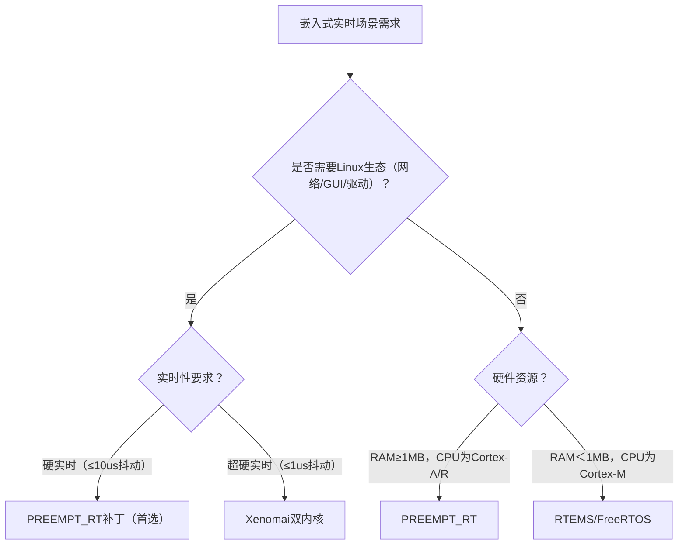
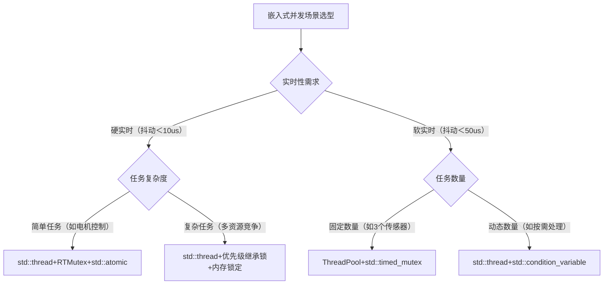
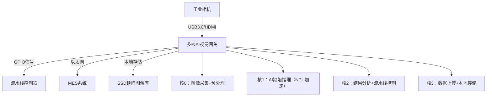

# 第5章 死锁防治与诊断

> 📊 **本节难度等级：** <span class="badge-e">**E级**</span>

---

### <strong>在嵌入式Linux开发中，死锁是比“数据错乱”更致命的问题——实时任务（如电机控制、传感器数据融合）一旦死锁，会直接导致设备停转、数据采集中断，甚至引发工业场景中的安全事故。例如：负责读取温度传感器的线程持有`I2C总线锁`后等待`ADC采样锁`，而负责ADC采样的线程持有`ADC采样锁`后等待`I2C总线锁`，两个线程会永久阻塞，最终导致温控系统失效。

要解决死锁问题，首先需掌握其“形成条件”与“类型特征”——前者是“防死锁”的理论基础（破坏任一条件即可避免死锁），后者是“诊死锁”的实践前提（不同类型死锁的排查思路完全不同）。本节将从通用原理出发，结合嵌入式“硬件资源有限”“实时性要求高”“中断与进程共存”的特有场景，完整拆解死锁的形成逻辑与类型矩阵。</strong>


### <strong>一、死锁的核心定义（嵌入式场景适配）</strong>

死锁（Deadlock）的通用定义是：**两个或多个线程（任务）互相持有对方所需的资源，且均不主动释放，导致所有线程永久阻塞的状态**。  
在嵌入式场景中，这个定义需补充两个关键前提：
1.  这里的“资源”不仅是软件层面的锁（如`pthread_mutex_t`），更包括硬件资源（如UART、I2C总线、ADC模块等独占性硬件）；
2.  死锁的影响会穿透“软件-硬件”层——例如线程死锁会导致硬件资源长期被占用，其他任务无法操作硬件，直接引发功能瘫痪。

**嵌入式死锁典型案例**：  
某智能车控制系统中，线程A负责电机调速，线程B负责电池电压监测：
- 线程A的执行逻辑：获取`电机控制锁` → 准备读取电池电压 → 等待`ADC采样锁`；
- 线程B的执行逻辑：获取`ADC采样锁` → 准备调整电机保护阈值 → 等待`电机控制锁`；
- 结果：线程A持有`电机控制锁`等`ADC采样锁`，线程B持有`ADC采样锁`等`电机控制锁`，双方永久阻塞，智能车“停转且无法监测电压”。<br>

### <strong>二、死锁的4个必要条件（原理+嵌入式实例）</strong>

死锁的形成必须同时满足4个必要条件，这是1971年由Coffman提出的经典理论，嵌入式场景中所有死锁都逃不出这一框架。需注意：**只要破坏其中任一条件，死锁就不会发生**，这也是后续“死锁预防”的核心逻辑。

### 2.1 条件1：资源互斥（Mutual Exclusion）
- **通用原理**：存在至少一种“不可共享”的资源——同一时间只能被一个线程持有，其他线程需等待其释放。
- **嵌入式场景适配**：这是嵌入式死锁最常见的触发条件，因为硬件资源天然具备“互斥性”（如UART总线同一时间只能传输一个设备的数据，I2C总线同一时间只能有一个主设备发起通信）。
- **实例**：  
  嵌入式设备的`SPI总线`是典型的互斥资源——线程1通过SPI读取Flash时，必须独占SPI总线；此时线程2若要通过SPI控制OLED屏幕，必须等待线程1释放SPI总线锁，若双方互相等待则触发死锁。
- **避坑点**：  
  并非所有资源都需互斥——例如“只读的配置文件”“全局常量”可共享，无需加锁；但“可写的硬件寄存器”“总线控制权限”必须互斥，否则会导致数据传输错乱。

### 2.2 条件2：持有并等待（Hold and Wait）
- **通用原理**：线程持有至少一个资源，同时等待获取其他线程持有的资源，且在等待期间不释放已持有的资源。
- **嵌入式场景适配**：嵌入式实时任务常因“多资源协同操作”触发此条件——例如电机控制任务需同时操作“电机驱动模块”和“编码器模块”，若先持有一个模块的锁再等另一个，就可能满足“持有并等待”。
- **实例**：  
  线程A（电机控制）：获取`电机驱动锁` → 等待`编码器锁`（未释放电机驱动锁）；  
  线程B（转速计算）：获取`编码器锁` → 等待`电机驱动锁`（未释放编码器锁）；  
  此时双方均满足“持有并等待”，为死锁埋下隐患。
- **关键特征**：嵌入式任务的“资源依赖链”越长（如需同时操作3个以上硬件模块），触发此条件的概率越高。

### 2.3 条件3：不可剥夺（No Preemption）
- **通用原理**：线程持有的资源不能被强制剥夺，只能由线程主动释放。
- **嵌入式场景适配**：这是嵌入式死锁的“刚性条件”——硬件资源的控制权一旦被某线程获取，若强制剥夺可能导致硬件状态错乱（如强行中断SPI传输会导致Flash数据写入失败）；实时系统中的任务优先级机制也会强化此条件（低优先级任务持有的锁，高优先级任务无法强制剥夺）。
- **实例**：  
  低优先级线程A持有`I2C总线锁`正在读取传感器数据，高优先级线程B需要I2C总线传输指令——由于I2C传输不能被强制中断（否则传感器会返回错误数据），线程B只能等待线程A主动释放锁；若线程A此时正在等待线程B持有的其他资源，就会触发死锁。
- **与通用系统差异**：通用操作系统（如Linux桌面版）可通过“进程终止”剥夺资源，但嵌入式系统为保证稳定性，极少采用这种方式。

### 2.4 条件4：循环等待（Circular Wait）
- **通用原理**：多个线程形成“资源请求环”——线程1等待线程2的资源，线程2等待线程3的资源，…，线程n等待线程1的资源，形成闭环。
- **嵌入式场景适配**：嵌入式任务的“资源请求顺序混乱”是触发此条件的核心原因，尤其在多模块协同的场景中（如传感器采集→数据处理→电机执行→反馈采样的闭环控制）。
- **实例**：  
  线程1（传感器采集）：持有`I2C锁` → 等待`DMA锁`；  
  线程2（数据传输）：持有`DMA锁` → 等待`定时器锁`；  
  线程3（定时控制）：持有`定时器锁` → 等待`I2C锁`；  
  三个线程形成“1→2→3→1”的资源请求环，满足“循环等待”条件，最终触发死锁。

**4个条件的逻辑关系**：  
必须同时满足才会形成死锁，缺一不可。例如：若破坏“循环等待”（所有线程按固定顺序请求资源），即使满足前3个条件，也不会出现死锁。<br>

### <strong>三、嵌入式死锁的类型矩阵（按场景分类）</strong>

通用操作系统的死锁类型多聚焦“软件锁竞争”，但嵌入式系统需结合“硬件资源特性”“实时任务调度”“中断机制”拓展类型。下表覆盖嵌入式开发中90%以上的死锁场景，按“发生概率”排序：

| 死锁类型         | 核心定义                                                                 | 嵌入式典型场景                                                                 | 触发条件组合                  | 危害等级 |
|------------------|--------------------------------------------------------------------------|------------------------------------------------------------------------------|-------------------------------|----------|
| 资源竞争型       | 多个线程竞争2个及以上独占性硬件/软件资源，形成循环等待                   | 双线程竞争I2C+SPI总线、三线程竞争ADC+定时器+UART                              | 1+2+3+4（全满足）             | ★★★★★    |
| 嵌套锁型         | 线程嵌套获取多个锁时，请求顺序不一致，形成循环等待                       | 线程A：锁1→锁2→锁3；线程B：锁3→锁2→锁1（均嵌套获取）                        | 1+2+3+4（全满足）             | ★★★★☆    |
| 任务优先级反转型 | 低优先级线程持有高优先级线程所需的锁，中优先级线程抢占低优先级线程，导致高优先级线程永久等待 | 高优先级：电机控制（等锁A）；低优先级：日志打印（持锁A）；中优先级：按键扫描（抢占低优先级） | 1+2+3+4（全满足，含调度机制） | ★★★★★    |
| 中断与进程冲突型 | 中断服务程序（ISR）持有资源锁，进程上下文等待该锁；或进程持有锁时触发中断，中断等待该锁 | 进程A持UART锁→触发中断→中断ISR等待UART锁；或ISR持ADC锁→进程A等待ADC锁        | 1+2+3+4（中断替代线程角色）   | ★★★★★    |

### 3.1 类型1：资源竞争型（最常见）
- **核心特征**：围绕“独占性资源”展开，多为硬件资源（如总线、传感器、存储设备），软件锁竞争较少。
- **深度实例**：  
  某物联网网关设备，线程1负责通过I2C读取温湿度传感器，线程2负责通过SPI写入Flash：  
  ① 线程1启动：获取`I2C锁` → 读取传感器数据 → 准备写入Flash → 等待`SPI锁`；  
  ② 线程2启动：获取`SPI锁` → 读取Flash配置 → 准备校准传感器 → 等待`I2C锁`；  
  ③ 结果：线程1持`I2C锁`等`SPI锁`，线程2持`SPI锁`等`I2C锁`，形成死锁，网关无法上传传感器数据且无法保存配置。
- **识别关键**：通过`ps`命令查看线程状态（均为`D`状态，不可中断睡眠）：
  ```bash
  # 嵌入式设备中执行，查看线程状态
  ps -efL | grep -E "R|D"
  # 结果示例（D状态为不可中断睡眠，死锁线程典型状态）
  root      123  122  123  0    1 08:30 ?        D  0:00  sensor_read（持I2C锁等SPI锁）
  root      124  122  124  0    1 08:30 ?        D  0:00  flash_write（持SPI锁等I2C锁）
  ```

### 3.2 类型2：嵌套锁型（代码设计缺陷）
- **核心特征**：由“锁的嵌套获取”引发，多为软件设计问题，与硬件资源无关。
- **深度实例**：  
  某工业控制器，线程A（数据处理）和线程B（状态反馈）均需操作“配置锁”“数据锁”“反馈锁”三个软件锁：  
  ① 线程A的锁请求顺序：配置锁 → 数据锁 → 反馈锁；  
  ② 线程B的锁请求顺序：反馈锁 → 数据锁 → 配置锁；  
  ③ 执行过程：线程A获取“配置锁+数据锁”后等待“反馈锁”，线程B获取“反馈锁”后等待“数据锁”，双方阻塞形成死锁。
- **避坑关键**：嵌入式开发中，嵌套锁层数建议≤2，且所有线程必须按“锁编号递增”顺序请求（如锁1→锁2→锁3）。

### 3.3 类型3：任务优先级反转型（实时系统特有）
- **核心特征**：涉及3个及以上不同优先级的任务，由调度机制放大死锁风险，是实时嵌入式系统的“经典坑”。
- **深度实例**（基于RT-Linux实时内核）：  
  任务优先级：高（电机控制，P10）＞中（按键扫描，P5）＞低（日志打印，P1）：  
  ① 低优先级任务（P1）先执行，获取“日志锁”并写入数据；  
  ② 高优先级任务（P10）被唤醒，需要“日志锁”（打印故障信息），但低优先级任务持有锁，高优先级任务进入等待；  
  ③ 中优先级任务（P5）被唤醒，抢占低优先级任务（P1）的CPU资源，低优先级任务无法继续执行，也就无法释放“日志锁”；  
  ④ 结果：高优先级任务（P10）永久等待“日志锁”，电机控制失效，形成“优先级反转型死锁”。
- **与普通死锁的差异**：若没有中优先级任务抢占，低优先级任务执行完后会释放锁，高优先级任务可继续执行；中优先级任务的抢占导致“低优先级任务无法释放锁”，才触发死锁。

### 3.4 类型4：中断与进程冲突型（嵌入式独有）
- **核心特征**：中断服务程序（ISR）参与资源竞争，是嵌入式死锁中“最难排查”的类型（中断上下文无法用常规工具调试）。
- **深度实例**：  
  某传感器采集系统，进程A（主程序）和中断ISR（传感器数据接收）均操作“UART锁”：  
  ① 进程A获取“UART锁”，准备通过UART发送配置指令；  
  ② 发送过程中，传感器触发中断，ISR被调用，ISR需要“UART锁”接收传感器数据，进入等待；  
  ③ 结果：进程A因等待中断执行完成而阻塞，ISR因等待“UART锁”而阻塞，形成死锁（中断无法被抢占，进程无法释放锁）。
- **避坑关键**：中断服务程序（ISR）中禁止等待任何锁——ISR应“快进快出”，仅做数据缓存，不参与锁竞争。<br>

### <strong>四、嵌入式死锁类型的快速识别流程</strong>

结合嵌入式场景的特殊性，可通过以下流程快速判断死锁类型，为后续“防治”和“诊断”提供依据：

```mermaid
flowchart TD
    A[发现死锁：线程/任务永久阻塞] --> B{是否涉及中断ISR？}
    B -->|是| C[中断与进程冲突型]
    B -->|否| D{是否涉及3个及以上优先级任务？}
    D -->|是| E[任务优先级反转型]
    D -->|否| F{是否嵌套获取多个锁？}
    F -->|是| G[嵌套锁型]
    F -->|否| H{是否竞争硬件资源？}
    H -->|是| I[资源竞争型]
    H -->|否| J[软件锁竞争型（少见）]
```<br>

### <strong>在嵌入式Linux开发中，死锁的“预防”远比“诊断修复”更重要——实时控制系统（如工业机器人、车载电子）一旦在运行中触发死锁，可能导致设备宕机、生产中断甚至安全事故，且现场调试难度极高。例如：车载ADAS系统的摄像头采集线程与雷达数据处理线程死锁，会导致自动驾驶辅助功能失效，风险不可控。

死锁预防的核心逻辑是“精准破坏死锁的4个必要条件之一”——由于嵌入式场景存在“硬件资源独占性”“实时性要求高”“中断与进程共存”的特殊性，通用操作系统的预防策略需经过“嵌入式适配”才能落地。本节将按“策略原理→嵌入式改造→实战代码→避坑要点”的逻辑，逐一讲解4大核心预防策略，并补充嵌入式特有场景的强化方案。</strong>


### <strong>一、核心逻辑：预防的本质是“破坏死锁必要条件”</strong>

上一节明确：死锁必须同时满足“资源互斥、持有并等待、不可剥夺、循环等待”4个条件。因此，**死锁预防的本质就是通过技术手段，破坏其中任一条件**，从根源上杜绝死锁发生。

嵌入式场景的预防策略需重点关注两个约束：
1.  **硬件约束**：部分硬件资源（如I2C总线、ADC模块）的“互斥性”无法完全破坏，需用替代方案规避；
2.  **实时性约束**：预防策略不能引入过大开销（如频繁的资源切换、锁竞争），否则会导致任务超时。

基于这两个约束，嵌入式开发中最常用的是“破坏循环等待”“破坏持有并等待”“破坏不可剥夺”三大策略，“破坏资源互斥”仅在特定场景适用。<br>

### <strong>二、四大核心预防策略（嵌入式实战版）</strong>

### 2.1 策略1：破坏“循环等待”——固定资源请求顺序（最常用，零开销）
#### 原理
让所有线程（任务）按“统一的固定顺序”请求资源，彻底打破“资源请求环”（如线程1和线程2都按“资源A→资源B→资源C”的顺序请求，不会形成A等B、B等A的闭环）。  
这是嵌入式开发中“性价比最高”的预防策略：无额外性能开销，适配所有硬件/软件资源，且实现简单。

#### 嵌入式落地关键：给资源编“全局唯一序号”
1.  **资源分类编号**：将所有独占性资源（含硬件、软件锁）按“使用频率”或“功能模块”编序号，序号全局唯一。  
    示例：嵌入式设备资源编号表
    | 资源类型       | 具体资源                | 全局序号 | 说明                     |
    |----------------|-------------------------|----------|--------------------------|
    | 硬件资源       | I2C总线锁               | 1        | 温湿度传感器、EEPROM共用 |
    | 硬件资源       | ADC采样锁               | 2        | 电池电压、电流采样共用   |
    | 软件锁         | 电机控制锁              | 3        | 电机调速、启停控制共用   |
    | 硬件资源       | SPI总线锁               | 4        | Flash、OLED屏幕共用      |
    | 软件锁         | 日志打印锁              | 5        | 所有模块日志输出共用     |
2.  **强制顺序请求**：所有线程必须按“序号递增”的顺序请求资源，释放时按“序号递减”顺序释放。

#### 实战代码：智能车双线程资源调度（规避资源竞争型死锁）
场景：线程A（电机控制）和线程B（传感器采集）需共用“I2C锁（序号1）”“ADC锁（序号2）”“电机锁（序号3）”，按固定顺序请求：
```c
#include <stdio.h>
#include <pthread.h>
#include <unistd.h>

// 1. 定义资源锁并编号（序号1→5）
pthread_mutex_t i2c_lock = PTHREAD_MUTEX_INITIALIZER;   // 序号1：I2C总线锁
pthread_mutex_t adc_lock = PTHREAD_MUTEX_INITIALIZER;   // 序号2：ADC采样锁
pthread_mutex_t motor_lock = PTHREAD_MUTEX_INITIALIZER; // 序号3：电机控制锁
pthread_mutex_t spi_lock = PTHREAD_MUTEX_INITIALIZER;   // 序号4：SPI总线锁
pthread_mutex_t log_lock = PTHREAD_MUTEX_INITIALIZER;   // 序号5：日志锁

// 2. 封装按序加锁/解锁函数（强制顺序，避免手动失误）
// 加锁：按序号递增顺序
int lock_resources(int* resource_ids, int count) {
    // 先排序（确保按递增顺序请求）
    for (int i = 0; i < count-1; i++) {
        for (int j = i+1; j < count; j++) {
            if (resource_ids[i] > resource_ids[j]) {
                int temp = resource_ids[i];
                resource_ids[i] = resource_ids[j];
                resource_ids[j] = temp;
            }
        }
    }
    // 按排序后的顺序加锁
    for (int i = 0; i < count; i++) {
        pthread_mutex_t* lock = NULL;
        switch(resource_ids[i]) {
            case 1: lock = &i2c_lock; break;
            case 2: lock = &adc_lock; break;
            case 3: lock = &motor_lock; break;
            case 4: lock = &spi_lock; break;
            case 5: lock = &log_lock; break;
            default: return -1; // 无效资源编号
        }
        if (pthread_mutex_lock(lock) != 0) {
            // 加锁失败时，释放已加锁资源
            for (int j = 0; j < i; j++) {
                switch(resource_ids[j]) {
                    case 1: pthread_mutex_unlock(&i2c_lock); break;
                    case 2: pthread_mutex_unlock(&adc_lock); break;
                    case 3: pthread_mutex_unlock(&motor_lock); break;
                    case 4: pthread_mutex_unlock(&spi_lock); break;
                    case 5: pthread_mutex_unlock(&log_lock); break;
                }
            }
            return -2;
        }
    }
    return 0;
}

// 解锁：按序号递减顺序
void unlock_resources(int* resource_ids, int count) {
    // 排序（按递减顺序释放）
    for (int i = 0; i < count-1; i++) {
        for (int j = i+1; j < count; j++) {
            if (resource_ids[i] < resource_ids[j]) {
                int temp = resource_ids[i];
                resource_ids[i] = resource_ids[j];
                resource_ids[j] = temp;
            }
        }
    }
    // 按排序后的顺序解锁
    for (int i = 0; i < count; i++) {
        switch(resource_ids[i]) {
            case 1: pthread_mutex_unlock(&i2c_lock); break;
            case 2: pthread_mutex_unlock(&adc_lock); break;
            case 3: pthread_mutex_unlock(&motor_lock); break;
            case 4: pthread_mutex_unlock(&spi_lock); break;
            case 5: pthread_mutex_unlock(&log_lock); break;
        }
    }
}

// 线程A：电机控制（需电机锁+ADC锁+日志锁）
void* motor_thread(void* arg) {
    int resources[] = {3, 2, 5}; // 原始需求：电机锁(3)、ADC锁(2)、日志锁(5)
    while (1) {
        // 按序加锁（内部会排序为2→3→5）
        if (lock_resources(resources, 3) == 0) {
            // 业务逻辑：读取ADC电池电压→调整电机转速→打印日志
            printf("Motor thread: Read ADC voltage → Adjust speed → Log\n");
            unlock_resources(resources, 3);
        }
        sleep(1);
    }
}

// 线程B：传感器采集（需I2C锁+ADC锁+日志锁）
void* sensor_thread(void* arg) {
    int resources[] = {1, 2, 5}; // 需求：I2C锁(1)、ADC锁(2)、日志锁(5)
    while (1) {
        if (lock_resources(resources, 3) == 0) {
            // 业务逻辑：I2C读传感器→ADC校准→打印日志
            printf("Sensor thread: Read I2C sensor → ADC calibrate → Log\n");
            unlock_resources(resources, 3);
        }
        sleep(1);
    }
}

int main() {
    pthread_t t1, t2;
    pthread_create(&t1, NULL, motor_thread, NULL);
    pthread_create(&t2, NULL, sensor_thread, NULL);
    pthread_join(t1, NULL);
    pthread_join(t2, NULL);
    return 0;
}
```
#### 编译与验证
```bash
# 交叉编译（适配ARM嵌入式环境）
arm-linux-gnueabihf-gcc deadlock_prevent_order.c -o prevent_order -lpthread
# 部署运行，观察无死锁（线程交替执行，资源有序竞争）
scp prevent_order root@192.168.1.100:/root/
ssh root@192.168.1.100 "./prevent_order"
```
#### 避坑要点
- 资源编号需“全局统一管理”，新增资源时更新编号表，避免重复；
- 封装加锁/解锁函数，避免手动排序失误（如上述代码中`lock_resources`内部自动排序）；
- 加锁失败时必须“回滚释放已加锁资源”，避免资源泄漏。

### 2.2 策略2：破坏“持有并等待”——资源预分配或原子申请（适配资源固定场景）
#### 原理
让线程在“开始执行前一次性申请所有需要的资源”（预分配），或“申请新资源时释放已持有资源”（原子申请），彻底避免“持有部分资源等待另一部分”的状态。  
嵌入式场景中，“预分配”更常用——因为实时任务的资源需求通常固定（如电机控制任务固定需要电机锁+ADC锁）。

#### 嵌入式落地两种方式
| 方式         | 核心逻辑                                  | 适用场景                                  | 优点                  | 缺点                  |
|--------------|-------------------------------------------|-------------------------------------------|-----------------------|-----------------------|
| 资源预分配   | 线程启动时申请所有需要的资源，释放后再退出 | 资源需求固定的实时任务（如传感器采集、电机控制） | 实现简单，无运行时开销 | 资源利用率低（长期占用） |
| 原子申请     | 申请新资源前释放已持有资源，再重新申请所有 | 资源需求动态变化的任务（如日志模块）      | 资源利用率高          | 需处理“重新申请失败”逻辑 |

#### 实战代码：传感器采集任务的资源预分配（规避嵌套锁型死锁）
场景：传感器采集任务固定需要“I2C锁+ADC锁+日志锁”，启动时一次性申请所有资源：
```c
#include <stdio.h>
#include <pthread.h>
#include <unistd.h>

pthread_mutex_t i2c_lock = PTHREAD_MUTEX_INITIALIZER;
pthread_mutex_t adc_lock = PTHREAD_MUTEX_INITIALIZER;
pthread_mutex_t log_lock = PTHREAD_MUTEX_INITIALIZER;

// 预分配资源：线程启动时申请所有需要的资源
int preallocate_resources() {
    // 一次性申请所有资源（顺序无关，因无持有等待）
    if (pthread_mutex_lock(&i2c_lock) != 0) return -1;
    if (pthread_mutex_lock(&adc_lock) != 0) {
        pthread_mutex_unlock(&i2c_lock); // 回滚
        return -2;
    }
    if (pthread_mutex_lock(&log_lock) != 0) {
        pthread_mutex_unlock(&i2c_lock);
        pthread_mutex_unlock(&adc_lock); // 回滚
        return -3;
    }
    return 0;
}

// 释放所有预分配资源
void release_all_resources() {
    pthread_mutex_unlock(&log_lock);
    pthread_mutex_unlock(&adc_lock);
    pthread_mutex_unlock(&i2c_lock);
}

// 传感器采集线程（资源预分配）
void* sensor_thread(void* arg) {
    // 1. 启动时预分配所有资源
    if (preallocate_resources() != 0) {
        printf("Sensor thread: Resource preallocate failed\n");
        return NULL;
    }
    printf("Sensor thread: Resources preallocated success\n");

    // 2. 循环执行业务（无需再申请资源）
    while (1) {
        // 业务逻辑：I2C读数据→ADC校准→日志打印
        printf("Sensor thread: Collect data → Calibrate → Log\n");
        sleep(1);
    }

    // 3. 退出时释放资源（实际中需处理退出逻辑）
    release_all_resources();
    return NULL;
}

// 电机控制线程（资源预分配）
void* motor_thread(void* arg) {
    // 电机任务需要：电机锁+ADC锁+日志锁
    pthread_mutex_t motor_lock = PTHREAD_MUTEX_INITIALIZER;
    if (pthread_mutex_lock(&motor_lock) != 0) return NULL;
    if (pthread_mutex_lock(&adc_lock) != 0) {
        pthread_mutex_unlock(&motor_lock);
        return NULL;
    }
    if (pthread_mutex_lock(&log_lock) != 0) {
        pthread_mutex_unlock(&motor_lock);
        pthread_mutex_unlock(&adc_lock);
        return NULL;
    }

    while (1) {
        printf("Motor thread: Adjust speed → Check voltage → Log\n");
        sleep(1);
    }

    pthread_mutex_unlock(&log_lock);
    pthread_mutex_unlock(&adc_lock);
    pthread_mutex_unlock(&motor_lock);
    return NULL;
}

int main() {
    pthread_t t1, t2;
    pthread_create(&t1, NULL, sensor_thread, NULL);
    pthread_create(&t2, NULL, motor_thread, NULL);
    pthread_join(t1, NULL);
    pthread_join(t2, NULL);
    return 0;
}
```
#### 关键适配
- 嵌入式资源紧张时，可“按任务优先级预分配”：高优先级任务优先预分配资源，低优先级任务等待；
- 若预分配失败（如资源被高优先级任务占用），低优先级任务可进入“休眠重试”（避免死循环占用CPU）。

### 2.3 策略3：破坏“不可剥夺”——超时加锁或优先级继承（实时系统核心策略）
#### 原理
让线程持有的资源“可被剥夺”：要么加锁时设置超时，超时后自动释放已持有资源；要么利用优先级继承机制，让低优先级线程持有高优先级资源时临时提升优先级，快速执行释放资源。  
这是实时嵌入式系统（如RT-Linux、FreeRTOS）的核心预防策略，专门解决“优先级反转”问题。

#### 嵌入式落地两大方案
1.  **超时加锁（通用方案）**  
    用`pthread_mutex_timedlock`替代`pthread_mutex_lock`，加锁超时后释放已持有资源，避免永久等待。超时时间设为“临界区最大执行时间的2~3倍”（如电机控制临界区100ms，超时设300ms）。

2.  **优先级继承（实时系统方案）**  
    给锁设置“优先级继承属性”，当低优先级线程持有高优先级线程需要的锁时，低优先级线程的优先级临时提升至与高优先级线程一致，快速执行完临界区并释放锁，避免被中优先级线程抢占（破坏优先级反转的关键）。

#### 实战代码1：超时加锁（规避资源竞争型死锁）
```c
#include <stdio.h>
#include <pthread.h>
#include <time.h>
#include <unistd.h>

pthread_mutex_t i2c_lock = PTHREAD_MUTEX_INITIALIZER;
pthread_mutex_t adc_lock = PTHREAD_MUTEX_INITIALIZER;

// 带超时的加锁函数（超时时间：ms）
int timed_lock(pthread_mutex_t* lock, int timeout_ms) {
    struct timespec ts;
    clock_gettime(CLOCK_REALTIME, &ts);
    // 计算超时时间点
    ts.tv_nsec += timeout_ms * 1000000;
    if (ts.tv_nsec >= 1e9) {
        ts.tv_sec++;
        ts.tv_nsec -= 1e9;
    }
    // 超时加锁
    return pthread_mutex_timedlock(lock, &ts);
}

// 线程A：持I2C锁等ADC锁（超时后释放I2C锁）
void* thread_a(void* arg) {
    while (1) {
        // 1. 加I2C锁
        if (timed_lock(&i2c_lock, 300) != 0) {
            printf("Thread A: Lock I2C timeout\n");
            continue;
        }
        printf("Thread A: Lock I2C success\n");

        // 2. 尝试加ADC锁（超时300ms）
        if (timed_lock(&adc_lock, 300) != 0) {
            printf("Thread A: Lock ADC timeout → Unlock I2C\n");
            pthread_mutex_unlock(&i2c_lock); // 释放已持有资源
            sleep(1); // 重试间隔
            continue;
        }

        // 3. 业务逻辑
        printf("Thread A: Process data (I2C+ADC)\n");

        // 4. 释放锁
        pthread_mutex_unlock(&adc_lock);
        pthread_mutex_unlock(&i2c_lock);
        sleep(1);
    }
}

// 线程B：持ADC锁等I2C锁（超时后释放ADC锁）
void* thread_b(void* arg) {
    while (1) {
        if (timed_lock(&adc_lock, 300) != 0) {
            printf("Thread B: Lock ADC timeout\n");
            continue;
        }
        printf("Thread B: Lock ADC success\n");

        if (timed_lock(&i2c_lock, 300) != 0) {
            printf("Thread B: Lock I2C timeout → Unlock ADC\n");
            pthread_mutex_unlock(&adc_lock);
            sleep(1);
            continue;
        }

        printf("Thread B: Process data (ADC+I2C)\n");

        pthread_mutex_unlock(&i2c_lock);
        pthread_mutex_unlock(&adc_lock);
        sleep(1);
    }
}

int main() {
    pthread_t t1, t2;
    pthread_create(&t1, NULL, thread_a, NULL);
    pthread_create(&t2, NULL, thread_b, NULL);
    pthread_join(t1, NULL);
    pthread_join(t2, NULL);
    return 0;
}
```

#### 实战代码2：优先级继承（解决优先级反转问题）
```c
#include <stdio.h>
#include <pthread.h>
#include <unistd.h>

// 定义三个优先级：高(10)、中(5)、低(1)
#define HIGH_PRIO 10
#define MID_PRIO 5
#define LOW_PRIO 1

// 定义锁并设置优先级继承属性
pthread_mutex_t res_lock;
pthread_mutexattr_t res_attr;

// 低优先级线程（持锁）
void* low_prio_thread(void* arg) {
    pthread_setschedprio(pthread_self(), LOW_PRIO);
    printf("Low thread: Start, prio=%d\n", LOW_PRIO);

    // 加锁（持有资源）
    pthread_mutex_lock(&res_lock);
    printf("Low thread: Lock acquired, start processing\n");
    sleep(3); // 模拟耗时操作
    pthread_mutex_unlock(&res_lock);
    printf("Low thread: Lock released\n");

    return NULL;
}

// 中优先级线程（抢占低优先级）
void* mid_prio_thread(void* arg) {
    pthread_setschedprio(pthread_self(), MID_PRIO);
    printf("Mid thread: Start, prio=%d\n", MID_PRIO);

    // 模拟持续运行，抢占低优先级线程
    while (1) {
        printf("Mid thread: Running\n");
        sleep(1);
    }
}

// 高优先级线程（等锁）
void* high_prio_thread(void* arg) {
    pthread_setschedprio(pthread_self(), HIGH_PRIO);
    printf("High thread: Start, prio=%d\n", HIGH_PRIO);

    // 尝试加锁（触发优先级继承）
    pthread_mutex_lock(&res_lock);
    printf("High thread: Lock acquired, process\n");
    pthread_mutex_unlock(&res_lock);
    printf("High thread: Lock released\n");

    return NULL;
}

int main() {
    // 初始化锁属性：设置优先级继承
    pthread_mutexattr_init(&res_attr);
    pthread_mutexattr_setprotocol(&res_attr, PTHREAD_PRIO_INHERIT);
    pthread_mutex_init(&res_lock, &res_attr);

    pthread_t t_low, t_mid, t_high;
    pthread_create(&t_low, NULL, low_prio_thread, NULL);
    sleep(1); // 确保低优先级线程先加锁
    pthread_create(&t_mid, NULL, mid_prio_thread, NULL);
    sleep(1); // 确保中优先级线程抢占低优先级
    pthread_create(&t_high, NULL, high_prio_thread, NULL); // 高优先级线程等锁

    pthread_join(t_low, NULL);
    pthread_join(t_mid, NULL);
    pthread_join(t_high, NULL);

    pthread_mutex_destroy(&res_lock);
    pthread_mutexattr_destroy(&res_attr);
    return 0;
}
```
#### 运行结果分析（优先级继承生效）
```
Low thread: Start, prio=1
Low thread: Lock acquired, start processing
Mid thread: Start, prio=5
Mid thread: Running
High thread: Start, prio=10
Low thread: Lock released  # 低优先级线程被提升至10，未被中优先级抢占，快速释放锁
High thread: Lock acquired, process
High thread: Lock released
Mid thread: Running
```
#### 避坑要点
- 超时加锁需“合理设置超时时间”：过短导致频繁重试（性能损耗），过长仍有死锁风险；
- 优先级继承仅支持“实时调度策略”（如`SCHED_FIFO`），普通`SCHED_OTHER`调度无效；
- 中断服务程序（ISR）中禁止使用超时加锁（中断上下文不能休眠）。

### 2.4 策略4：破坏“资源互斥”——共享资源或硬件复用（特定场景适用）
#### 原理
将“互斥资源”改为“可共享资源”，或通过硬件/软件手段实现“资源复用”，让多个线程可同时访问，从根源消除互斥条件。  
嵌入式场景中，此策略适用范围有限——硬件资源（如总线、ADC）天然互斥，仅部分软件资源或只读资源可共享。

#### 嵌入式落地两种场景
1.  **只读资源共享**：全局常量、配置文件等只读资源无需加锁，可直接共享（如`const int g_max_temp = 100`）；
2.  **硬件资源复用**：通过“分时复用”或“硬件虚拟化”让多个线程交替使用互斥硬件（如SPI总线通过定时器分片，给每个线程分配固定时间片）。

#### 实战代码：SPI总线分时复用（硬件资源复用）
场景：SPI总线连接Flash和OLED，两个线程通过分时复用交替使用SPI，无需互斥锁：
```c
#include <stdio.h>
#include <pthread.h>
#include <unistd.h>

#define SPI_TIME_SLICE 100 // 每个线程的时间片（ms）

// SPI总线操作函数（无锁，依赖分时复用）
void spi_write(uint8_t dev_id, uint8_t data) {
    // 模拟SPI总线操作：选择设备→发送数据
    printf("SPI: Select dev %d → Write 0x%02X\n", dev_id, data);
    usleep(1000); // 模拟SPI传输耗时
}

// Flash操作线程（时间片内使用SPI）
void* flash_thread(void* arg) {
    uint8_t data = 0x01;
    while (1) {
        // 时间片开始：操作SPI
        printf("Flash thread: Time slice start\n");
        for (int i = 0; i < 5; i++) { // 时间片内执行多个操作
            spi_write(0x01, data++); // 0x01：Flash设备ID
        }
        // 时间片结束：释放SPI，休眠等待下一轮
        printf("Flash thread: Time slice end → Sleep\n");
        sleep(SPI_TIME_SLICE / 1000);
    }
}

// OLED操作线程（时间片内使用SPI）
void* oled_thread(void* arg) {
    uint8_t data = 0x10;
    // 错开时间片（避免同时启动）
    sleep(SPI_TIME_SLICE / 2000);
    while (1) {
        printf("OLED thread: Time slice start\n");
        for (int i = 0; i < 3; i++) {
            spi_write(0x02, data++); // 0x02：OLED设备ID
        }
        printf("OLED thread: Time slice end → Sleep\n");
        sleep(SPI_TIME_SLICE / 1000);
    }
}

int main() {
    pthread_t t_flash, t_oled;
    pthread_create(&t_flash, NULL, flash_thread, NULL);
    pthread_create(&t_oled, NULL, oled_thread, NULL);
    pthread_join(t_flash, NULL);
    pthread_join(t_oled, NULL);
    return 0;
}
```
#### 适用场景限制
- 仅适用于“非实时性要求”的硬件操作（如日志写入Flash、OLED显示）；
- 实时性要求高的场景（如电机控制、传感器采样）禁止使用分时复用（可能导致操作延迟）。<br>

### <strong>三、嵌入式特有场景的强化预防策略</strong>

### 3.1 中断与进程冲突的预防（嵌入式独有）
中断服务程序（ISR）是死锁的“高危区域”，需单独制定预防规则：
1.  **ISR禁止持有任何锁**：ISR应“快进快出”，仅读取硬件寄存器数据到缓冲区，不进行锁竞争；
2.  **进程与ISR用“双缓冲”通信**：进程负责从缓冲区读取数据并处理，ISR负责写入缓冲区，无需锁保护（如环形缓冲区）；
3.  **禁止ISR中调用阻塞函数**：如`malloc`、`sleep`等，避免ISR阻塞导致进程锁无法释放。

#### 实战代码：双缓冲规避中断与进程冲突
```c
#include <stdint.h>
#include <pthread.h>
#include <asm/irq.h>

#define BUF_SIZE 32
// 双缓冲：ISR写buf1，进程读buf2；或反之
uint8_t buf1[BUF_SIZE] = {0};
uint8_t buf2[BUF_SIZE] = {0};
uint8_t isr_buf_idx = 0; // 0：ISR写buf1；1：ISR写buf2
uint8_t proc_buf_idx = 1; // 与ISR错开

// 中断服务程序（ISR）：写双缓冲，无锁
irqreturn_t sensor_isr(int irq, void* dev_id) {
    uint8_t* isr_buf = isr_buf_idx ? buf2 : buf1;
    // 读取传感器数据到ISR缓冲区（无锁）
    for (int i = 0; i < BUF_SIZE; i++) {
        isr_buf[i] = *(volatile uint8_t*)(0x10000000 + i); // 模拟传感器地址
    }
    // 交换缓冲区索引（原子操作，避免进程同时交换）
    __sync_swap(&isr_buf_idx, isr_buf_idx ^ 1);
    __sync_swap(&proc_buf_idx, proc_buf_idx ^ 1);
    return IRQ_HANDLED;
}

// 进程线程：读双缓冲，无锁
void* proc_thread(void* arg) {
    while (1) {
        uint8_t* proc_buf = proc_buf_idx ? buf2 : buf1;
        // 处理缓冲区数据（无锁）
        printf("Process thread: Buf first data 0x%02X\n", proc_buf[0]);
        sleep(1);
    }
}
```

### 3.2 资源紧张场景的预防（嵌入式资源约束）
嵌入式RAM/ROM有限，需在“预防死锁”和“资源占用”间平衡：
1.  **轻量级锁替代重量级锁**：用原子操作（`atomic_t`）或Futex替代`pthread_mutex_t`，减少内存开销；
2.  **动态释放闲置资源**：长期未使用的资源（如闲置传感器的总线锁）自动释放，提高利用率；
3.  **单锁保护多个同类资源**：如多个同类型传感器共用一个“I2C总线锁”，而非每个传感器一个锁。<br>

### <strong>四、嵌入式死锁预防策略的选型指南</strong>

不同死锁类型对应不同最优策略，结合场景选择可最大化性能与安全性：

```mermaid
flowchart TD
    A[确定死锁风险类型] --> B{资源竞争型}
    B -->|是| C[优先：固定资源顺序；次选：超时加锁]
    A --> D{嵌套锁型}
    D -->|是| E[优先：固定资源顺序；次选：资源预分配]
    A --> F{优先级反转型}
    F -->|是| G[优先：优先级继承；次选：超时加锁]
    A --> H{中断与进程冲突型}
    H -->|是| I[优先：双缓冲+ISR无锁；次选：禁用ISR锁竞争]
    A --> J{资源固定的实时任务}
    J -->|是| K[优先：资源预分配；次选：固定顺序]
```<br>

### <strong>嵌入式死锁诊断的核心痛点的是“场景受限”：多数嵌入式设备无图形界面、内存/存储资源有限、无法直接运行大型调试工具，且实时系统不允许“长时间在线调试”（可能破坏死锁现场）。因此，嵌入式死锁诊断工具链需遵循“轻量优先、远程适配、分层排查”原则——从基础命令快速定位到专业工具深度分析，从用户态线程到内核态硬件资源，逐步缩小故障范围。

本节将围绕嵌入式开发中“最常用、最易落地”的6类工具，结合“资源竞争型”“优先级反转型”“中断冲突型”三大典型死锁场景，构建“基础识别→深度调试→离线分析”的全流程诊断体系，所有操作均适配ARM/MIPS等主流嵌入式架构。</strong>


### <strong>一、工具链核心框架：嵌入式死锁的分层诊断逻辑</strong>

嵌入式死锁的诊断需按“先判断是否死锁→再定位死锁类型→最后锁定代码位置”的分层逻辑推进，不同层级对应不同工具，避免盲目调试：

```mermaid
flowchart TD
    A[发现异常：线程阻塞/设备无响应] --> B[第一层：基础命令识别死锁]
    B -->|确认死锁（如D状态线程）| C[第二层：用户态工具定位线程]
    B -->|未确认（如疑似死锁）| D[重启设备，启用内核调试工具]
    C -->|用户态死锁（如pthread锁）| E[gdb远程调试：查调用栈+锁持有关系]
    C -->|涉及内核/硬件| F[第三层：内核态工具分析资源]
    F -->|内核锁/硬件资源| G[dmesg+lockdep：查内核日志+锁竞争]
    F -->|实时任务/优先级| H[ftrace：跟踪任务调度+锁等待]
    E --> I[第四层：离线分析（可选）]
    G --> I[第四层：离线分析（可选）]
    I -->|复现与根因定位| J[coredump+交叉gdb：离线解析死锁现场]
```

关键适配点：嵌入式诊断需“减少对目标设备的干扰”——基础命令（如`ps`）对系统影响＜0.1%，可在线执行；内核调试工具（如`lockdep`）需提前启用，性能损耗约5%~10%，建议在测试阶段使用；离线分析（如`coredump`）需提前配置，仅在关键场景启用（避免占用存储）。<br>

### <strong>二、第一层：基础命令工具（快速识别死锁，100%适配）</strong>

基础命令是嵌入式死锁诊断的“第一反应工具”，无需额外安装（BusyBox等嵌入式最小系统均自带），核心作用是“快速判断是否存在死锁”。

### 2.1 核心工具：`ps`（线程状态识别）
#### 原理
死锁线程的典型特征是“长期处于D状态（不可中断睡眠）”——因等待资源被永久阻塞，无法被信号唤醒。`ps`命令可查看线程的状态、PID/TID、持有资源等信息。

#### 嵌入式实操命令
```bash
# 1. 查看所有进程及线程（L选项显示线程），筛选状态列
ps -efL | grep -E "PID|TID|STAT"  # 显示PID（进程ID）、TID（线程ID）、STAT（状态）
# 2. 聚焦D状态线程（死锁核心特征）
ps -efL | grep "D"
# 3. 显示线程的CPU占用、运行时间（确认是否长期阻塞）
ps -efL -o pid,tid,stat,pcpu,etime,comm
```

#### 死锁典型输出与解析
```bash
# 输出示例：两个线程均为D状态，运行时间10分钟（长期阻塞）
UID        PID  PPID   TID    STAT   TIME COMMAND
root      123  1     123    S      0:00 ./deadlock_demo
root      123  1     124    D     10:00 ./deadlock_demo  # 线程124：D状态，阻塞10分钟
root      123  1     125    D     10:00 ./deadlock_demo  # 线程125：D状态，阻塞10分钟
```
- 关键判断依据：多个线程属于同一进程（PID相同），均为D状态，且运行时间（etime）远超正常业务逻辑耗时（如10分钟，正常业务单次执行仅100ms）。

### 2.2 辅助工具：`top`（资源占用验证）
#### 原理
死锁线程因永久阻塞，CPU占用率为0%，但会长期占用锁资源。`top`的线程模式（-H）可实时查看线程的CPU、内存占用，辅助验证死锁。

#### 嵌入式实操命令
```bash
# 1. 线程模式启动top（-H显示线程，-p指定进程PID）
top -H -p 123  # 仅查看PID=123的进程的所有线程
# 2. 交互操作：按"f"添加"TID"列，按"c"显示完整命令，按"q"退出
```

#### 死锁典型输出与解析
```bash
# 输出示例：线程124、125 CPU占用0%，状态为D
  PID USER      PR  NI    VIRT    RES    SHR S %CPU %MEM     TIME+ COMMAND
  123 root      20   0    4096   1024    768 S  0.0  0.1   0:00.00 deadlock_demo
  124 root      20   0    4096   1024    768 D  0.0  0.1  10:00.00 deadlock_demo
  125 root      20   0    4096   1024    768 D  0.0  0.1  10:00.00 deadlock_demo
```
- 关键判断依据：D状态线程的%CPU长期为0%，%MEM稳定（无内存泄漏），符合“永久阻塞但不消耗CPU”的死锁特征。

### 2.3 实战：用基础命令定位资源竞争型死锁
1.  **步骤1：发现异常**：设备无响应，业务日志停止输出；
2.  **步骤2：`ps`查状态**：执行`ps -efL | grep "D"`，发现进程123的两个线程124、125为D状态；
3.  **步骤3：`top`验证**：执行`top -H -p 123`，确认两线程CPU占用0%，运行时间10分钟；
4.  **初步结论**：进程123存在死锁，死锁线程为124、125。<br>

### <strong>三、第二层：用户态调试工具（定位代码位置，适配90%场景）</strong>

基础命令确认死锁后，需用用户态调试工具定位“具体哪个锁、哪个代码行导致死锁”。嵌入式最常用的是**远程GDB调试**（目标设备资源有限，调试主机运行交叉GDB）。

### 3.1 核心工具：交叉GDB（远程调试）
#### 前置准备
1.  **编译配置**：交叉编译时添加调试信息（-g选项），禁用优化（-O0，避免代码逻辑被优化）：
    ```bash
    # 示例：ARM交叉编译带调试信息的程序
    arm-linux-gnueabihf-gcc -g -O0 deadlock_demo.c -o deadlock_demo -lpthread
    ```
2.  **远程连接环境**：目标设备与调试主机网络互通（如SSH），目标设备启动GDB服务器（gdbserver）：
    ```bash
    # 目标设备（嵌入式）执行：启动gdbserver，监听1234端口，调试deadlock_demo
    gdbserver :1234 ./deadlock_demo
    ```

#### 嵌入式实操流程
1.  **调试主机启动交叉GDB**：
    ```bash
    # 调试主机执行：启动ARM交叉GDB
    arm-linux-gnueabihf-gdb ./deadlock_demo
    ```
2.  **远程连接目标设备**：
    ```gdb
    (gdb) target remote 192.168.1.100:1234  # 目标设备IP:端口
    Remote debugging using 192.168.1.100:1234
    0x00010450 in main () at deadlock_demo.c:45
    45        pthread_create(&t1, NULL, thread_a, NULL);
    ```
3.  **查看线程与状态**：
    ```gdb
    (gdb) info threads  # 查看所有线程，带状态标识
      3 Thread 0xb6f9d460 (LWP 125)  thread_b (arg=0x0) at deadlock_demo.c:30
      2 Thread 0xb779e460 (LWP 124)  thread_a (arg=0x0) at deadlock_demo.c:18
    * 1 Thread 0xb77a0000 (LWP 123)  main () at deadlock_demo.c:46

    (gdb) thread 2  # 切换到线程2（TID=124）
    [Switching to thread 2 (Thread 0xb779e460 (LWP 124))]
    #0  0x00020850 in pthread_mutex_lock () from /lib/libpthread.so.0

    (gdb) bt  # 查看线程2的调用栈，定位等待的锁
    #0  0x00020850 in pthread_mutex_lock () from /lib/libpthread.so.0
    #1  0x000105cc in thread_a (arg=0x0) at deadlock_demo.c:18
    18        pthread_mutex_lock(&adc_lock);  # 线程2正在等待adc_lock
    ```
4.  **切换线程查看锁持有情况**：
    ```gdb
    (gdb) thread 3  # 切换到线程3（TID=125）
    [Switching to thread 3 (Thread 0xb6f9d460 (LWP 125))]
    #0  0x00020850 in pthread_mutex_lock () from /lib/libpthread.so.0

    (gdb) bt
    #0  0x00020850 in pthread_mutex_lock () from /lib/libpthread.so.0
    #1  0x00010658 in thread_b (arg=0x0) at deadlock_demo.c:30
    30        pthread_mutex_lock(&i2c_lock);  # 线程3正在等待i2c_lock

    # 查看线程2持有的锁：通过变量地址判断（需结合代码）
    (gdb) thread 2
    (gdb) print &i2c_lock  # 线程2的i2c_lock地址
    $1 = (pthread_mutex_t *) 0x20098  # 线程2持有i2c_lock
    ```

#### 死锁定位结论
线程2（TID=124）持有`i2c_lock`，等待`adc_lock`；线程3（TID=125）持有`adc_lock`，等待`i2c_lock`，形成资源竞争型死锁，死锁代码行分别为`deadlock_demo.c:18`和`deadlock_demo.c:30`。

### 3.2 辅助工具：`pstack`（快速打印调用栈）
若目标设备无gdbserver，可使用`pstack`（轻量调用栈打印工具，BusyBox可集成）快速获取线程调用栈：
```bash
# 目标设备执行：打印进程123的所有线程调用栈
pstack 123
# 输出示例（关键部分）
Thread 2 (LWP 124):
#0  0x00020850 in pthread_mutex_lock ()
#1  0x000105cc in thread_a (arg=0x0) at deadlock_demo.c:18
Thread 3 (LWP 125):
#0  0x00020850 in pthread_mutex_lock ()
#1  0x00010658 in thread_b (arg=0x0) at deadlock_demo.c:30
```<br>

### <strong>四、第三层：内核态调试工具（定位内核/硬件死锁，嵌入式专属）</strong>

当死锁涉及内核资源（如内核锁、硬件驱动锁、优先级反转）时，用户态工具无法穿透内核，需用内核态工具分析。

### 4.1 核心工具1：`dmesg`（内核日志解析）
#### 原理
内核会记录锁竞争、死锁、Oops（内核崩溃）等关键日志，`dmesg`可查看这些日志，定位内核态死锁（如驱动层锁竞争、优先级反转）。

#### 嵌入式实操命令
```bash
# 1. 查看所有内核日志，筛选锁相关信息
dmesg | grep -E "lock|deadlock|Oops"
# 2. 实时监控内核日志（需内核支持）
dmesg -w
# 3. 清空历史日志，仅保留新日志（方便复现问题）
dmesg -c
```

#### 典型内核日志与解析
1.  **资源竞争型死锁（内核态）**：
    ```bash
# 脚本示例：嵌入式多线程环境配置与调试
    [ 1234.567890] INFO: task deadlock_demo:124 blocked for more than 120 seconds.
    [ 1234.567900]       Tainted: G        W  #1
    [ 1234.567910] "echo 0 > /proc/sys/kernel/hung_task_timeout_secs" disables this message.
    [ 1234.567920] deadlock_demo D 0 124 123 0x00000000
    [ 1234.567930] Backtrace:
    [ 1234.567940] [<c0012340>] schedule+0x20/0x80
    [ 1234.567950] [<c001a560>] __mutex_lock_slowpath+0x120/0x200  # 内核互斥锁等待
    [ 1234.567960] [<c001a680>] mutex_lock+0x20/0x30
    [ 1234.567970] [<000105cc>] thread_a+0x2c/0x40 [deadlock_demo]  # 关联用户态代码
    
```
    - 关键信息：线程124因`__mutex_lock_slowpath`（内核互斥锁等待）阻塞超过120秒，关联用户态代码`thread_a`。

2.  **优先级反转死锁**：
    ```bash
    [ 567.890123] rt_mutex: PI waiters present! Held by task 124 (deadlock_demo)
    [ 567.890133] rt_mutex: Found dependency chain:
    [ 567.890143]  task 126 (high_prio) → 锁A → task 124 (low_prio) → 锁B → task 125 (mid_prio)
    ```
    - 关键信息：高优先级任务126等待低优先级任务124持有的锁A，低优先级任务124被中优先级任务125抢占，形成优先级反转。

### 4.2 核心工具2：`lockdep`（内核锁检测工具）
#### 原理
`lockdep`是内核自带的“静态锁分析工具”，可在系统运行时检测“潜在死锁风险”（如锁请求顺序错误）和“实时死锁”，无需复现问题，提前预警。

#### 嵌入式实操步骤
1.  **启用lockdep（内核配置）**：
    - 进入内核源码目录，执行`make menuconfig`；
    - 开启配置：`Kernel hacking → Lock Debugging (spinlocks, mutexes, etc.) → Lock dependency validator`；
    - 重新编译内核并烧录到目标设备。

2.  **触发并查看lockdep日志**：
    ```bash
    # 运行可能存在死锁的程序后，查看lockdep日志
    dmesg | grep -E "lockdep|dependency"
    ```

#### 典型lockdep日志与解析
```bash
# 脚本示例：嵌入式多线程环境配置与调试
[  123.456789] ==============================================
[  123.456799] [WARNING] Possible circular locking dependency detected
[  123.456809] ==============================================
[  123.456819] deadlock_demo/124 is trying to acquire lock:
[  123.456829]  (&adc_lock){+.+.}, at: thread_a+0x2c/0x40 [deadlock_demo]
[  123.456839]
[  123.456849] but task is already holding lock:
[  123.456859]  (&i2c_lock){+.+.}, at: thread_a+0x1c/0x40 [deadlock_demo]
[  123.456869]
[  123.456879] which lock already depends on the new lock.
[  123.456889]
[  123.456899] Chain exists of:  adc_lock → i2c_lock
[  123.456909]
[  123.456919] Possible unsafe locking scenario:
[  123.456929]
[  123.456939]       CPU0                    CPU1
[  123.456949]       ----                    ----
[  123.456959]  lock(i2c_lock);            lock(adc_lock);
[  123.456969]  lock(adc_lock);            lock(i2c_lock);
[  123.456979]
[  123.456989] *** DEADLOCK ***

```
- 关键结论：lockdep检测到“i2c_lock→adc_lock”和“adc_lock→i2c_lock”的循环依赖，提前预警死锁风险，无需实际触发死锁。

### 4.3 辅助工具：`ftrace`（跟踪任务调度与锁操作）
`ftrace`是内核跟踪工具，可记录任务调度、锁的“加锁/解锁”过程，定位“优先级反转”“锁持有时间过长”等隐性死锁：
```bash
# 1. 配置ftrace跟踪锁操作（目标设备）
echo function_graph > /sys/kernel/debug/tracing/current_tracer
echo pthread_mutex_lock > /sys/kernel/debug/tracing/set_ftrace_filter
echo 1 > /sys/kernel/debug/tracing/tracing_on

# 2. 运行待测试程序，然后停止跟踪
echo 0 > /sys/kernel/debug/tracing/tracing_on

# 3. 查看跟踪结果
cat /sys/kernel/debug/tracing/trace
```<br>

### <strong>五、第四层：离线分析工具（复杂场景复盘，适配现场故障）</strong>

嵌入式现场故障（如工业设备停机）无法在线调试时，需通过“离线日志+核心转储”复盘死锁现场，核心工具是`coredump`。

### 5.1 核心工具：`coredump`（核心转储分析）
#### 原理
`coredump`可将死锁进程的内存镜像、线程状态、锁信息保存为文件，带回调试主机用交叉GDB离线分析，适合“现场无法长时间调试”的场景。

#### 嵌入式实操步骤
1.  **配置目标设备生成coredump**：
    ```bash
    # 1. 设置coredump文件路径（保存到/tmp，需足够空间）
    echo "/tmp/core-%e-%p-%t" > /proc/sys/kernel/core_pattern
    # 2. 取消coredump大小限制
    ulimit -c unlimited
    ```
2.  **触发coredump**：
    ```bash
    # 找到死锁进程PID（如123），发送SIGABRT信号生成coredump
    kill -6 123
    # 生成的coredump文件：/tmp/core-deadlock_demo-123-1234567890
    ```
3.  **离线分析（调试主机）**：
    ```bash
    # 1. 复制coredump文件到调试主机
    scp root@192.168.1.100:/tmp/core-deadlock_demo-123-1234567890 ./

    # 2. 用交叉GDB加载coredump文件
    arm-linux-gnueabihf-gdb ./deadlock_demo ./core-deadlock_demo-123-1234567890

    # 3. 分析线程与锁（同远程GDB步骤）
    (gdb) info threads
    (gdb) thread 2
    (gdb) bt
    ```<br>

### <strong>六、嵌入式死锁诊断综合实战（资源竞争型死锁）</strong>

### 6.1 故障场景
某智能车控制器运行中突然停转，电机控制日志停止输出，设备可SSH登录但业务无响应。

### 6.2 诊断流程（工具链协同）
1.  **基础命令初判**：
    - 执行`ps -efL | grep "D"`，发现进程`motor_ctrl`（PID=234）的线程235、236为D状态；
    - 执行`top -H -p 234`，确认两线程CPU占用0%，运行时间5分钟。

2.  **远程GDB定位代码**：
    - 目标设备启动`gdbserver :1234 ./motor_ctrl`；
    - 调试主机远程连接，`info threads`切换线程，`bt`查看调用栈：
      - 线程235（电机控制）：持有`motor_lock`，等待`encoder_lock`（代码行45）；
      - 线程236（转速计算）：持有`encoder_lock`，等待`motor_lock`（代码行78）。

3.  **内核日志验证**：
    - 执行`dmesg | grep "lock"`，发现内核日志记录“thread 235 blocked on encoder_lock”，与GDB结果一致。

4.  **离线复盘（可选）**：
    - 生成coredump文件，带回调试主机分析，确认锁持有关系，归档故障数据。

### 6.3 解决方案
按“固定资源请求顺序”修改代码：给`motor_lock`编号1，`encoder_lock`编号2，所有线程按“1→2”顺序加锁，重新编译部署后故障消失。<br>

### <strong>七、嵌入式诊断避坑要点</strong>

1.  **D状态不一定是死锁**：等待I/O（如磁盘读写）的线程也会短暂处于D状态，需结合“运行时间+资源持有情况”判断；
2.  **lockdep性能损耗**：启用后内核性能下降5%~10%，仅测试环境使用，生产环境需关闭；
3.  **coredump空间限制**：嵌入式设备/tmp空间可能不足，需配置保存到外部存储（如SD卡）；
4.  **中断死锁排查**：中断与进程冲突的死锁需结合`dmesg`（查看ISR日志）和硬件调试器（如J-Link），GDB无法调试中断上下文。<br>

### <strong>嵌入式死锁的防治核心是“常态化管控”——很多死锁故障并非技术难题，而是开发/测试环节的“细节遗漏”（如忘记按固定顺序加锁、中断中调用了锁函数）。本清单的核心价值是“将抽象的防治策略转化为可执行的检查动作”，让团队从“被动救火”转为“主动防控”。

清单按“需求设计→编码开发→测试验证→运维监控”全生命周期拆分，每个阶段配套“检查目标-核心检查项-实操方法-整改方案”，并标注“嵌入式特有要求”（如硬件资源、中断、实时性），适配ARM/MIPS等架构及RT-Linux/FreeRTOS等系统。</strong>


### <strong>一、需求设计阶段检查清单（架构层防控，避免先天缺陷）</strong>

**核心目标**：从架构设计阶段规避“高风险资源依赖”，破坏死锁形成的底层条件（如循环等待、持有并等待），此阶段整改成本最低（＜编码阶段的1/10）。

| 检查项 | 检查目标 | 嵌入式实操方法 | 判断标准 | 整改方案 |
|--------|----------|----------------|----------|----------|
| 1.1 独占资源梳理 | 明确所有需互斥的资源（硬件+软件） | 1. 列《资源清单》，区分“硬件资源”（如I2C、ADC、电机驱动）和“软件锁”（如pthread_mutex_t）；2. 标注资源的“使用场景”（线程/中断/进程）和“持有时长” | 清单无遗漏，每个资源明确“是否互斥”“使用方” | 补充遗漏资源，对“可共享资源”（如只读配置）标注“无需加锁” |
| 1.2 资源依赖图绘制 | 避免资源请求环（破坏循环等待） | 1. 用思维导图绘制《资源依赖图》，节点为资源，箭头为“线程→资源”的请求关系；2. 检查是否存在闭环（如线程A→资源1→线程B→资源2→线程A） | 依赖图无闭环，所有线程的资源请求方向一致 | 1. 给资源编全局序号（如1→I2C，2→ADC）；2. 强制所有线程按“序号递增”请求 |
| 1.3 中断与进程资源隔离 | 避免中断与进程竞争锁（嵌入式特有） | 1. 明确中断服务程序（ISR）的操作资源；2. 检查是否与进程共享锁或硬件资源 | ISR仅操作“独立缓冲区”，不与进程共享锁 | 1. 用双缓冲实现ISR与进程通信（ISR写缓冲，进程读缓冲）；2. ISR禁用所有锁函数 |
| 1.4 实时任务优先级规划 | 避免优先级反转 | 1. 列《任务优先级表》，标注每个任务的优先级、资源需求；2. 检查“高优先级任务是否依赖低优先级任务的资源” | 高优先级任务的资源不被低优先级任务持有，或配置优先级继承 | 1. 高优先级任务的资源单独分配；2. 对共享锁启用优先级继承（如pthread_mutexattr_setprotocol） |

### <strong>二、编码开发阶段检查清单（编码层防控，杜绝细节漏洞）</strong>

**核心目标**：将预防策略转化为编码规范，通过“逐行检查+工具辅助”规避编码失误（如嵌套锁顺序错误、中断中调用malloc），此阶段是死锁防控的“核心防线”。

### 2.1 锁操作检查（最高频风险点）
| 检查项 | 实操方法 | 嵌入式特有要求 | 不通过案例 | 整改方案 |
|--------|----------|----------------|------------|----------|
| 2.1.1 锁请求顺序 | 1. 查看所有加锁代码，核对资源序号；2. 用cppcheck静态检查：`cppcheck --enable=all app.c | grep "lock order"` | 硬件资源序号需优先（如I2C序号1＞软件锁序号5） | 线程A：锁3→锁2；线程B：锁2→锁3 | 1. 封装统一加锁函数（如lock_resources，内部自动排序）；2. 所有加锁调用封装函数，禁止直接调用pthread_mutex_lock |
| 2.1.2 嵌套锁层数 | 1. 统计每个线程的嵌套加锁次数；2. 用grep检索：`grep -n "pthread_mutex_lock" *.c | grep -A1 "pthread_mutex_lock"` | 嵌套层数≤2（实时任务≤1） | 线程A：锁1→锁2→锁3（3层嵌套） | 1. 拆分线程，将多层嵌套拆分为单锁任务；2. 用资源预分配替代嵌套加锁 |
| 2.1.3 加锁后释放检查 | 1. 检查每个加锁点的“解锁路径”（如if/for/return分支）；2. 用gcc编译选项：`-Wunreachable-code` | 中断上下文禁止加锁，进程上下文加锁后必须在所有分支解锁 | 加锁后进入if分支return，未解锁 | 1. 用“加锁-解锁”配对宏：`#define LOCK(m) pthread_mutex_lock(&m); int _lock_flag=1`，解锁后置_flag=0；2. 函数退出前检查_flag，强制解锁 |
| 2.1.4 超时加锁使用 | 1. 检查是否用`pthread_mutex_timedlock`替代`pthread_mutex_lock`；2. 核对超时时间（为临界区耗时2~3倍） | 实时任务超时时间≤100ms，避免影响调度 | 用无超时的pthread_mutex_lock，且未配置优先级继承 | 1. 替换为timedlock，超时时间设为临界区耗时3倍；2. 超时后释放已加锁资源，记录日志 |

### 2.2 资源操作检查（嵌入式硬件相关）
| 检查项 | 实操方法 | 判断标准 | 整改方案 |
|--------|----------|----------|----------|
| 2.2.1 硬件资源互斥保护 | 1. 查看I2C/SPI/ADC等硬件操作代码，是否加锁；2. 用示波器观察总线信号，确认无并发冲突 | 每个硬件资源有唯一锁保护，总线信号无重叠 | 1. 为硬件资源创建专属锁（如i2c_lock）；2. 封装硬件操作API，在API内加锁/解锁 |
| 2.2.2 动态内存分配检查 | 1. 检索中断代码：`grep -n "malloc\|free" isr_*.c`；2. 检查线程内存分配是否用私有内存池 | 中断中无动态内存分配，进程用私有/静态内存池 | 1. 中断用静态内存池（如isr_safe_malloc）；2. 进程用线程私有内存池，禁用全局malloc |
| 2.2.3 共享变量保护 | 1. 检查全局变量/静态变量的写操作，是否加锁；2. 用objdump反编译：`arm-linux-gnueabihf-objdump -d app | grep "global_var"` | 所有可写共享变量有锁保护，或用原子操作 | 1. 对简单变量用原子操作（如atomic_add）；2. 对复杂结构用互斥锁保护 |

### 2.3 中断安全检查（嵌入式独有风险）
| 检查项 | 实操方法 | 禁止行为 | 整改方案 |
|--------|----------|----------|----------|
| 2.3.1 ISR函数检查 | 1. 查看ISR代码，是否调用锁/阻塞函数；2. 用内核日志检查：`dmesg | grep "ISR"` | ISR调用pthread_mutex_lock、malloc、sleep | 1. ISR仅做“数据读取→写入缓冲区”，耗时≤1ms；2. 复杂处理交给线程，用信号量唤醒 |
| 2.3.2 双缓冲实现检查 | 1. 检查ISR与进程的通信方式；2. 打印缓冲区索引，确认无读写冲突 | ISR与进程直接操作同一数组，无缓冲隔离 | 1. 实现双缓冲（buf1/buf2），ISR与进程交替使用；2. 用原子操作交换缓冲区索引（如__sync_swap） |

### <strong>三、测试验证阶段检查清单（测试层防控，提前暴露风险）</strong>

**核心目标**：通过“针对性测试+工具扫描”覆盖所有死锁场景（如多线程并发、中断嵌套、优先级反转），确保上线前发现90%以上的死锁风险。

| 检查阶段 | 核心检查项 | 嵌入式实操工具/命令 | 通过标准 |
|----------|------------|---------------------|----------|
| 3.1 静态测试 | 3.1.1 锁依赖检查 | 1. 启用内核lockdep工具；2. 执行`dmesg | grep "circular locking"` | 无锁循环依赖警告 |
|  | 3.1.2 编码规范检查 | 1. 用cppcheck扫描：`cppcheck --enable=all --inline-suppr src/`；2. 自定义规则检查“中断调用锁” | 无高风险编码警告 |
| 3.2 动态测试 | 3.2.1 多线程并发测试 | 1. 编写测试用例：启动所有业务线程，持续运行24小时；2. 用ps监控：`while true; do ps -efL | grep "D"; sleep 10; done` | 无D状态线程，业务日志正常 |
|  | 3.2.2 中断嵌套测试 | 1. 用信号发生器触发高频中断（如1ms一次）；2. 同时运行进程操作共享资源；3. 查看dmesg日志 | 无中断与进程冲突日志，数据无错乱 |
|  | 3.2.3 优先级反转测试 | 1. 启动高/中/低优先级任务（如P10/P5/P1）；2. 低优先级持锁，高优先级等锁，中优先级抢占；3. 用ftrace跟踪：`cat /sys/kernel/debug/tracing/trace` | 低优先级任务被提升至P10，无永久阻塞 |
|  | 3.2.4 资源耗尽测试 | 1. 模拟资源耗尽（如内存池满、锁被长期占用）；2. 检查任务是否优雅退化，无死锁 | 资源耗尽时任务返回错误，不阻塞 |
| 3.3 压力测试 | 3.3.1 极限并发测试 | 1. 用pthread_create创建10倍于正常数量的线程；2. 持续并发操作所有资源；3. 用top监控CPU/内存 | 系统负载80%以上时，无死锁、无崩溃 |
|  | 3.3.2 异常恢复测试 | 1. 强制杀死持锁线程；2. 检查锁资源是否释放；3. 重启线程后业务是否恢复 | 锁资源自动释放，线程重启后正常运行 |

### <strong>四、运维监控阶段检查清单（运维层防控，快速响应故障）</strong>

**核心目标**：建立“实时监控+故障快速定位”机制，即使出现死锁也能在5分钟内定位根因，10分钟内恢复服务，降低故障影响。

| 检查项 | 监控/检查方法 | 嵌入式适配方案 | 告警阈值/故障标准 |
|--------|----------------|----------------|-------------------|
| 4.1 实时监控 | 4.1.1 线程状态监控 | 1. 编写Shell脚本：周期性检查D状态线程，记录日志；2. 结合SNMP推送到监控平台 | 出现D状态线程持续＞30秒，触发告警 |
|  | 4.1.2 内核日志监控 | 1. 用logrotate轮转dmesg日志；2. 实时检索：`dmesg -w | grep -E "deadlock|Oops|blocked"` | 出现死锁相关日志，立即告警 |
|  | 4.1.3 资源占用监控 | 1. 监控锁持有时间：封装加锁函数，记录持有时长；2. 监控硬件总线占用率：用示波器或专用工具 | 单个锁持有＞1秒，总线占用＞90%，触发告警 |
| 4.2 故障应急 | 4.2.1 死锁定位工具部署 | 1. 目标设备预安装gdbserver、pstack、coredump工具；2. 编写一键定位脚本：`./deadlock_check.sh PID` | 脚本可在30秒内输出线程调用栈+锁持有关系 |
|  | 4.2.2 应急恢复方案 | 1. 编写一键重启脚本：针对死锁进程，释放资源后重启；2. 配置看门狗（Watchdog），死锁时自动重启设备 | 故障触发后，10分钟内服务恢复 |
| 4.3 定期复盘 | 4.3.1 故障日志归档 | 1. 将coredump、dmesg日志保存到外部存储（SD卡/服务器）；2. 按“日期-进程名”命名归档 | 所有死锁故障日志归档，保存≥3个月 |
|  | 4.3.2 清单优化 | 1. 每月复盘死锁故障，补充新检查项；2. 更新《资源清单》《优先级表》 | 清单随项目迭代优化，覆盖新场景 |

### <strong>五、嵌入式死锁防治自检工具包（配套实操）</strong>

### 5.1 静态检查脚本：lock_check.sh（编码阶段用）
功能：批量检查代码中“锁顺序错误”“中断调用锁”“嵌套锁层数超限”等问题，适配ARM交叉编译环境。
```bash
#!/bin/bash
# 1. 检查中断代码是否调用锁
echo "=== 中断代码锁检查 ==="
grep -r "pthread_mutex_lock\|mutex_lock" ./isr_*.c
if [ $? -eq 0 ]; then
    echo "❌ 发现中断代码调用锁函数！"
else
    echo "✅ 中断代码无锁调用"
fi

# 2. 检查嵌套锁层数（连续加锁次数）
echo -e "\n=== 嵌套锁层数检查 ==="
grep -n "pthread_mutex_lock" ./src/*.c | awk -F: '{print $1":"$2}' > lock_lines.tmp
while read line; do
    file=$(echo $line | cut -d: -f1)
    num=$(echo $line | cut -d: -f2)
    next_num=$((num+1))
    grep -q "$file:$next_num.*pthread_mutex_lock" lock_lines.tmp
    if [ $? -eq 0 ]; then
        echo "❌ $file 第$num行和$next_num行存在连续加锁（嵌套≥2层）"
    fi
done < lock_lines.tmp
rm -f lock_lines.tmp

# 3. 检查锁顺序（需提前定义资源序号映射表）
echo -e "\n=== 锁顺序检查 ==="
# 资源序号：1=i2c_lock,2=adc_lock,3=motor_lock
grep -r "pthread_mutex_lock(&i2c_lock);.*pthread_mutex_lock(&adc_lock)" ./src/*.c > /dev/null
if [ $? -ne 0 ]; then
    echo "❌ 发现i2c_lock在adc_lock之后加锁（违反1→2顺序）"
else
    echo "✅ 锁顺序符合1→2→3规范"
fi
```

### 5.2 动态监控脚本：deadlock_monitor.sh（运维阶段用）
功能：实时监控D状态线程，触发告警时自动打印调用栈，生成初步诊断报告。
```bash
#!/bin/bash
LOG_FILE="/var/log/deadlock_monitor.log"
ALERT_THRESHOLD=30  # 30秒D状态触发告警

# 日志初始化
echo "[$(date +'%Y-%m-%d %H:%M:%S')] 监控启动" >> $LOG_FILE

while true; do
    # 查找D状态线程，排除内核线程
    D_THREADS=$(ps -efL | grep "D" | grep -v "kernel" | grep -v "grep")
    if [ -n "$D_THREADS" ]; then
        PID=$(echo $D_THREADS | awk '{print $2}' | uniq)
        TID=$(echo $D_THREADS | awk '{print $3}')
        ETIME=$(echo $D_THREADS | awk '{print $6}')
        # 转换运行时间为秒（简化版）
        ETIME_SEC=$(echo $ETIME | awk -F: '{print $1*3600 + $2*60 + $3}')
        
        if [ $ETIME_SEC -ge $ALERT_THRESHOLD ]; then
            # 触发告警
            echo "[$(date +'%Y-%m-%d %H:%M:%S')] 告警：进程$PID的线程$TID D状态持续$ETIME_SEC秒" >> $LOG_FILE
            # 打印调用栈
            echo "线程$TID 调用栈：" >> $LOG_FILE
            pstack $PID | grep -A10 "Thread $TID" >> $LOG_FILE
            # 可选：发送SNMP告警到监控平台
            # snmpwalk -v 2c -c public 192.168.1.200 1.3.6.1.4.1.12345.1.1 $PID
        fi
    fi
    sleep 10
done
```

### 5.3 检查清单汇总表（打印版）
| 阶段 | 检查模块 | 核心检查点（打勾确认） | 不通过项整改记录 |
|------|----------|------------------------|------------------|
| 设计 | 资源梳理 | □ 完成《资源清单》并编号 □ 绘制资源依赖图无闭环 |  |
|  | 中断隔离 | □ ISR资源与进程无重叠 □ 双缓冲方案确认 |  |
| 编码 | 锁操作 | □ 锁顺序按序号递增 □ 嵌套层数≤2 □ 加锁后全分支解锁 |  |
|  | 硬件操作 | □ 硬件资源加锁保护 □ 中断无动态内存分配 |  |
| 测试 | 动态测试 | □ 24小时并发无D线程 □ 优先级反转测试通过 □ 资源耗尽测试通过 |  |
|  | 工具扫描 | □ lockdep无循环依赖 □ cppcheck无高风险警告 |  |
| 运维 | 监控部署 | □ 线程状态监控脚本运行 □ 内核日志归档开启 |  |
|  | 应急方案 | □ 一键定位脚本可用 □ 应急恢复方案验证通过 |  |<br>

### <strong>六、清单使用建议</strong>

1.  **分层负责**：开发工程师负责“编码阶段”检查，测试工程师负责“测试阶段”检查，运维工程师负责“运维阶段”检查，架构师审核“设计阶段”检查；
2.  **前置执行**：新模块开发前先填《资源清单》，编码完成后先跑`lock_check.sh`，再提交测试；
3.  **故障关联**：死锁故障修复后，回溯清单“未通过项”，补充检查点（如因“未启用优先级继承”导致死锁，需在“编码阶段”增加对应检查项）；
4.  **轻量化适配**：小型嵌入式项目可简化清单，重点保留“锁顺序”“中断安全”“并发测试”三大核心模块，避免过度冗余。<br>

---
<br>

---

### <strong>历史演进：并发系统中的死锁问题的发展脉络</strong>

并发系统中的死锁问题的起源可追溯至20世纪60年代多道程序设计系统的出现，当时操作系统开始探索在单一处理器上并发执行多个任务的可能性。1970年代，Unix系统引入进程概念，将资源分配与执行单元分离，为后续线程模型奠定了理论基础。1980年代，随着共享内存多处理器（SMP）架构的兴起， researchers 提出轻量级进程（LWP）概念，旨在降低并发切换开销。1995年，IEEE正式发布POSIX Threads标准（IEEE Std 1003.1c），定义了pthread API规范，使多线程编程首次具备跨平台一致性。进入21世纪后，嵌入式领域对实时性的需求推动了线程调度模型的持续演进：从传统的时间片轮转扩展至SCHED_FIFO优先级抢占，从内核不可抢占的标准Linux到PREEMPT_RT全内核抢占补丁。近年来，随着多核SoC与NPU异构计算的普及，多线程设计已从单纯的并发执行演进为“任务-核心-加速器”三位一体的协同架构，线程亲和性、内存序控制与无锁编程成为高性能嵌入式系统的核心课题。理解这一演进脉络，有助于开发者在不同硬件代际与系统版本间做出合理的技术选型。

---

<br>

---

<br>

---

## 小结

本章围绕死锁的四个必要条件及破坏策略、优先级继承与优先级天花板协议、Lockdep的内核死锁检测原理、嵌入式系统的预防性设计模式展开，系统梳理了相关核心概念、API用法及嵌入式适配策略。关键要点包括：明确各机制的设计初衷与适用边界，掌握标准API的正确调用顺序与资源回收方式，理解并发场景下常见的陷阱（如竞态条件、优先级反转、内存泄漏）及其预防手段，最终能够根据具体嵌入式硬件资源与实时性要求，设计出稳定可靠的多线程应用架构。

---

### <strong>本章练习</strong>

1.  请用资源分配图说明循环等待条件是如何导致死锁的，并给出一种破坏该条件的设计方案。
2.  优先级继承与优先级天花板协议在解决优先级反转问题上有何区别？请结合电机控制场景分析优劣。
3.  Lockdep如何通过锁类与锁依赖链检测潜在死锁？为什么说它是“静态分析+运行时验证”的结合？

---

<br>

---

## 实时多线程设计 [E]

> 📊 **本节难度等级：** <span class="badge-e">**E级**</span>

---

### <strong>在嵌入式开发中，“实时性”是工业控制、车载电子、航空航天等领域的核心诉求——例如工业机械臂的关节控制需要≤1ms的响应延迟，车载ADAS系统的障碍物检测需要微秒级的确定性响应，若超出阈值会导致设备故障甚至安全事故。

但标准Linux内核并非为实时场景设计，其调度延迟、中断响应、进程抢占等机制存在“不确定性”，无法直接满足嵌入式硬实时需求。本节的核心目标是：先建立“嵌入式实时性”的正确认知，再剖析标准Linux的非实时根源，最后落地Linux实时化的主流方案（以PREEMPT_RT补丁为主），配套实战编译与测试，让读者掌握“如何将标准Linux改造为实时系统”。</strong>


### <strong>一、嵌入式实时性的核心概念与关键指标</strong>

### 1.1 实时系统的定义（嵌入式场景适配）
实时系统（Real-Time System, RTS）的通用定义是：**能够在规定的“截止时间（Deadline）”内完成任务响应与执行，并保证结果正确性的系统**。  
嵌入式场景下，这个定义需补充两个关键前提：
1.  **资源约束下的确定性**：在有限的CPU、内存、硬件资源下，任务的响应时间“可预测”（而非“最快”）——例如无论系统负载如何，传感器采集任务的响应时间始终在500us±10us范围内；
2.  **故障的可控性**：若未在截止时间内完成任务，会导致“可预见的后果”（如工业设备停机、报警触发），而非随机崩溃。

**嵌入式实时场景示例**：  
- 工业机器人：关节电机的位置控制任务需每1ms执行一次，截止时间1ms，延迟超1ms会导致机器人动作偏差；
- 车载CAN总线：接收刹车信号的任务需在200us内响应，超时会影响刹车助力系统；
- 医疗监护仪：心率数据采集任务需每50ms更新一次，超时会导致数据丢失，影响诊断。

### 1.2 实时性的三大核心指标（嵌入式落地重点）
实时性的优劣并非“越快越好”，而是以“确定性”为核心，用三个指标量化：

#### 1.2.1 响应时间（Response Time）
- 定义：从“外部事件触发”到“任务开始执行”的时间间隔，包括中断延迟、调度延迟、上下文切换延迟。
- 嵌入式场景拆解：  
  响应时间 = 中断延迟（硬件+内核） + 调度延迟（调度器选择任务） + 上下文切换延迟（切换到目标任务）
- 示例：传感器触发中断（事件）→ 内核处理中断（20us）→ 调度器唤醒采集任务（50us）→ 上下文切换（30us）→ 响应时间总计100us。

#### 1.2.2 确定性（Determinism）
- 定义：任务响应时间的“波动范围”（抖动），而非平均响应时间。嵌入式实时系统的核心诉求是“抖动小”，而非“平均响应快”。
- 对比示例：  
  - 非实时系统：传感器采集任务响应时间在50us~500us波动（抖动450us），无法满足工业控制要求；
  - 实时系统：同一任务响应时间在80us~100us波动（抖动20us），确定性强。

#### 1.2.3 可靠性（Reliability）
- 定义：长期运行中，任务在截止时间内完成的概率（通常要求99.999%以上）。
- 嵌入式约束：可靠性需结合硬件特性，例如工业设备要求MTBF（平均无故障时间）≥10万小时，需避免因内存泄漏、调度异常导致的实时性退化。

### 1.3 实时系统的分类（嵌入式场景映射）
按“截止时间违约的后果”和“响应时间要求”，实时系统分为三类，嵌入式开发中需根据场景精准选型：

| 类型         | 核心定义                                                                 | 截止时间要求       | 嵌入式典型场景                          | 示例任务                          |
|--------------|--------------------------------------------------------------------------|--------------------|---------------------------------------|-----------------------------------|
| 硬实时（Hard RT） | 截止时间不可违约，违约会导致设备故障、安全事故或数据永久丢失               | 微秒~毫秒级，抖动＜10% | 工业机器人关节控制、车载ADAS、航空航天控制系统 | 电机位置闭环控制、刹车信号处理    |
| 软实时（Soft RT） | 截止时间可偶尔违约，违约仅影响服务质量（如延迟、卡顿），无严重后果         | 毫秒~秒级，抖动＜50% | 嵌入式视频监控、智能家居控制、数据采集终端    | 视频流编码、环境数据上报          |
| 准实时（Firm RT） | 截止时间违约会导致部分数据失效，但不影响系统整体运行                       | 毫秒级，抖动＜30%   | 工业数据监控、智能仪表显示、物联网网关        | 传感器数据统计、仪表盘刷新        |

**关键选型原则**：  
- 若场景涉及“人身安全”（如车载、医疗）或“设备损坏”（如工业控制），必须选硬实时系统；
- 若仅涉及“用户体验”（如视频播放）或“非关键数据”（如环境监测），可选用软实时或准实时系统。<br>

### <strong>二、标准Linux非实时的核心根源（嵌入式视角）</strong>

标准Linux（如Ubuntu、CentOS的内核）设计目标是“通用计算”，追求高吞吐量和资源利用率，而非实时性，其非实时的根源集中在以下4点，且均与嵌入式实时需求冲突：

### 2.1 调度器的非确定性
标准Linux的CFS调度器（完全公平调度器）采用“时间片轮转”和“优先级抢占”机制，但存在两个核心问题：
1.  **时间片分配不确定**：CFS为保证“公平性”，动态调整任务的时间片（默认10ms~200ms），实时任务可能因时间片耗尽被抢占，导致响应延迟；
2.  **调度延迟不确定**：当系统负载高时（如多进程并发），调度器需遍历任务队列选择下一个执行任务，遍历时间随任务数量增加而变长，无法保证固定响应时间。

**嵌入式场景冲突示例**：  
工业电机控制任务（优先级10）需每1ms执行一次，但CFS分配的时间片为10ms，任务执行5ms后被低优先级的日志打印任务抢占，导致电机控制延迟6ms，超出截止时间。

### 2.2 中断延迟的不确定性
中断延迟是“外部事件触发中断”到“中断服务程序（ISR）开始执行”的时间，标准Linux的中断延迟存在两个变量：
1.  **关中断时间过长**：内核在执行临界区代码（如内存管理、锁操作）时会关闭中断，标准Linux的关中断时间可达数百微秒（甚至毫秒级），导致实时任务的中断无法及时响应；
2.  **中断嵌套与优先级反转**：标准Linux的中断优先级由硬件决定，高优先级中断可能被低优先级中断阻塞，导致延迟不确定。

### 2.3 进程抢占的限制
标准Linux的内核态抢占默认是“部分开启”的：
- 进程在用户态可被抢占，但在内核态（如执行系统调用、ISR返回）时，需等待临界区代码执行完成才能被抢占；
- 实时任务若因系统调用进入内核态，可能因内核态不可抢占而被阻塞，导致响应延迟。

### 2.4 内核锁与同步机制的开销
标准Linux的内核锁（如spinlock、mutex）为保证通用性，设计复杂，持有时间较长：
- 例如，进程调用`malloc`时，内核会持有`kmalloc`锁，若此时实时任务也需分配内存，会被阻塞；
- 嵌入式实时场景中，同步机制的开销需控制在微秒级，但标准Linux的锁操作延迟可达数十微秒。

**标准Linux与嵌入式实时需求的冲突总结**：
```mermaid
flowchart TD
    A[标准Linux设计目标：通用计算→高吞吐量+公平性] --> B[调度器：动态时间片+公平调度]
    A --> C[中断：长关中断时间+优先级无保障]
    A --> D[抢占：内核态不可抢占]
    A --> E[锁机制：通用锁+长持有时间]
    B --> F[响应时间不确定]
    C --> G[中断延迟不确定]
    D --> H[任务抢占延迟]
    E --> I[同步机制开销大]
    F & G & H & I --> J[无法满足嵌入式实时需求]
```<br>

### <strong>三、Linux实时化的主流方案（嵌入式落地优先级排序）</strong>

为解决标准Linux的非实时问题，工业界形成了三类主流实时化方案，按“嵌入式适配性”“开发成本”“实时性能”排序，PREEMPT_RT补丁为首选方案：

### 3.1 方案1：PREEMPT_RT补丁（推荐，嵌入式首选）
#### 核心原理
PREEMPT_RT（Preemptive Real-Time）是Linux内核社区维护的实时补丁，通过“最大化抢占”和“优化中断延迟”，将标准Linux改造为硬实时系统：
1.  **全内核抢占**：允许在几乎所有内核代码路径（除最核心的临界区）进行抢占，实时任务在内核态也能被及时调度；
2.  **优化关中断时间**：将内核临界区代码拆分，缩短关中断时间（PREEMPT_RT的关中断时间通常＜10us）；
3.  **优先级继承机制**：为内核锁启用优先级继承，避免低优先级任务持有锁导致高优先级任务阻塞；
4.  **中断线程化**：将部分中断服务程序（ISR）转化为内核线程，可被调度器按优先级调度，避免中断嵌套导致的延迟。

#### 嵌入式适配优势
-  **开发成本低**：基于标准Linux内核，应用程序无需修改（或少量修改）即可移植；
-  **硬件兼容性好**：支持主流嵌入式CPU（ARM Cortex-A/R、MIPS、x86），适配嵌入式开发板（如NVIDIA Jetson、STM32MP1、树莓派）；
-  **实时性能强**：硬实时场景下，响应时间抖动可控制在10us以内，满足工业控制、车载电子等需求。

#### 实战：编译安装PREEMPT_RT实时内核（ARM嵌入式环境）
##### 步骤1：准备环境与源码
```bash
# 1. 安装交叉编译工具链（以ARM为例）
sudo apt install arm-linux-gnueabihf-gcc arm-linux-gnueabihf-g++

# 2. 下载Linux内核源码与PREEMPT_RT补丁（推荐内核5.10+，补丁版本需与内核匹配）
KERNEL_VERSION=5.10.179
RT_PATCH_VERSION=5.10.179-rt88
wget https://cdn.kernel.org/pub/linux/kernel/v5.x/linux-$KERNEL_VERSION.tar.xz
wget https://cdn.kernel.org/pub/linux/kernel/projects/rt/5.10/linux-$RT_PATCH_VERSION.patch.xz

# 3. 解压源码与补丁
tar -xvf linux-$KERNEL_VERSION.tar.xz
cd linux-$KERNEL_VERSION
xz -d ../linux-$RT_PATCH_VERSION.patch.xz
patch -p1 < ../linux-$RT_PATCH_VERSION.patch
```

##### 步骤2：配置实时内核
```bash
# 1. 加载默认配置（以ARM Cortex-A7为例）
make ARCH=arm CROSS_COMPILE=arm-linux-gnueabihf- defconfig

# 2. 开启实时配置（通过menuconfig调整）
make ARCH=arm CROSS_COMPILE=arm-linux-gnueabihf- menuconfig
```
**关键配置项（必须开启）**：
- `Kernel Features → Preemption Model → Fully Preemptible Kernel (Real-Time)`（全内核抢占）；
- `Kernel Features → High Resolution Timers`（高精度定时器，支持微秒级定时）；
- `Kernel Features → Use priority inheritance for in-kernel mutexes`（内核锁优先级继承）；
- `Device Drivers → Character devices → Serial drivers → 8250/16550 and compatible serial support`（启用串口，用于调试）。

##### 步骤3：编译与安装内核
```bash
# 1. 编译内核镜像与模块（-j后的线程数=CPU核心数+1）
make ARCH=arm CROSS_COMPILE=arm-linux-gnueabihf- zImage -j4
make ARCH=arm CROSS_COMPILE=arm-linux-gnueabihf- modules -j4
make ARCH=arm CROSS_COMPILE=arm-linux-gnueabihf- dtbs -j4（设备树，根据开发板调整）

# 2. 安装模块到开发板（通过SSH或SD卡）
sudo make ARCH=arm CROSS_COMPILE=arm-linux-gnueabihf- modules_install INSTALL_MOD_PATH=/mnt/rootfs
# 3. 拷贝内核镜像与设备树到开发板的/boot目录
scp arch/arm/boot/zImage root@192.168.1.100:/boot/zImage-rt
scp arch/arm/boot/dts/xxx.dtb root@192.168.1.100:/boot/xxx-rt.dtb
```

##### 步骤4：配置开发板启动实时内核
修改开发板的`/boot/extlinux/extlinux.conf`（或U-Boot配置），设置默认启动实时内核：
```bash
# 脚本示例：嵌入式多线程环境配置与调试
label rt-kernel
  kernel /boot/zImage-rt
  devicetree /boot/xxx-rt.dtb
  append root=/dev/mmcblk0p2 rootwait rw preempt=full

```

### 3.2 方案2：Xenomai（双内核方案，硬实时场景）
#### 核心原理
Xenomai是“双内核”架构：
-  **实时内核（Cobalt）**：运行在硬件之上，提供硬实时调度、低延迟中断响应，专门执行实时任务；
-  **Linux内核**：作为Xenomai的“从属内核”，运行在实时内核之上，执行非实时任务（如网络、图形界面）；
-  实时任务与非实时任务通过“IPC机制”通信，Xenomai的实时内核优先级高于Linux内核，保证实时任务不被抢占。

#### 嵌入式适配场景
-  硬实时需求极高的场景（响应时间＜1us，抖动＜100ns），如航空航天、高精度工业控制；
-  需同时运行实时任务和复杂非实时任务（如网络通信、GUI）的场景。

#### 优缺点对比
| 优点                          | 缺点                          |
|-------------------------------|-------------------------------|
| 实时性能极强（硬实时级别）    | 开发成本高，需适配Xenomai API |
| 与Linux内核隔离，实时性不受影响 | 硬件兼容性不如PREEMPT_RT      |
| 支持更多实时调度策略（如FIFO、RR） | 内核体积大，占用内存多        |

### 3.3 方案3：RTEMS/FreeRTOS（轻量级实时系统，低端嵌入式）
#### 核心原理
RTEMS（Real-Time Executive for Multiprocessor Systems）和FreeRTOS是专为嵌入式设计的轻量级实时操作系统：
-  内核体积小（RTEMS最小内核＜100KB，FreeRTOS＜10KB），适配RAM＜1MB的低端MCU（如STM32、ARM Cortex-M）；
-  调度器支持硬实时策略（FIFO、RR），响应时间抖动＜1us；
-  无Linux的通用功能（如TCP/IP、GUI），需手动移植驱动和协议栈。

#### 嵌入式适配场景
-  低端MCU（RAM＜1MB，Flash＜16MB）的实时场景，如传感器采集、小型电机控制；
-  无需复杂Linux功能，仅需简单实时任务调度的场景。

#### 与Linux实时化方案的选型对比
| 方案         | 实时性能 | 开发成本 | 硬件要求 | 嵌入式适配场景                          |
|--------------|----------|----------|----------|---------------------------------------|
| PREEMPT_RT    | 硬实时（≤10us抖动） | 低       | 中高端CPU（Cortex-A/R） | 工业控制、车载电子、物联网网关（需Linux功能） |
| Xenomai       | 硬实时（≤1us抖动）  | 中       | 中高端CPU（Cortex-A/R） | 高精度工业控制、航空航天（极高实时需求）    |
| RTEMS/FreeRTOS | 硬实时（≤1us抖动）  | 高       | 低端MCU（Cortex-M）    | 传感器采集、小型电机控制（资源受限）        |<br>

### <strong>四、嵌入式实时性测试工具与验证方法</strong>

实时系统搭建完成后，需通过工具验证实时性指标（响应时间、抖动），嵌入式场景常用以下工具：

### 4.1 核心工具：cyclictest（PREEMPT_RT实时性测试）
`cyclictest`是测试实时系统响应时间的经典工具，通过“周期性触发任务”，统计任务的响应延迟和抖动：

#### 嵌入式实操命令
```bash
# 1. 开发板安装cyclictest（需编译嵌入式版本）
git clone git://git.kernel.org/pub/scm/utils/rt-tests/rt-tests.git
cd rt-tests
make ARCH=arm CROSS_COMPILE=arm-linux-gnueabihf- cyclictest
scp cyclictest root@192.168.1.100:/usr/bin/

# 2. 运行测试：周期1ms，持续1小时，输出延迟统计
cyclictest -t1 -p99 -n -i1000 -d1h -o rt_test.log
# 参数说明：
# -t1：启动1个测试线程
# -p99：线程优先级99（最高）
# -n：使用内核定时器
# -i1000：周期1000us（1ms）
# -d1h：持续测试1小时
# -o：输出日志到rt_test.log

# 3. 分析日志：查看最大延迟、平均延迟、抖动
grep "Max Latency" rt_test.log
# 典型输出（PREEMPT_RT内核）：
# Max Latency: 8us, Average Latency: 1.2us, Jitter: 0.8us
```

#### 结果判断标准
-  硬实时场景：最大延迟＜截止时间的50%，抖动＜10%（如截止时间1ms，最大延迟＜500us，抖动＜100us）；
-  软实时场景：最大延迟＜截止时间，抖动＜50%。

### 4.2 辅助工具：hwlatdetect（硬件延迟检测）
`hwlatdetect`用于检测硬件层面的延迟（如CPU缓存刷新、总线冲突），这些延迟会影响实时性：
```bash
# 运行硬件延迟检测，持续10分钟
hwlatdetect -d 600
# 输出示例：
# Max Hardware Latency: 2us
```

### 4.3 自定义测试程序（嵌入式场景专项测试）
针对具体业务场景，编写自定义测试程序，验证实时任务的响应时间：
```c
#include <stdio.h>
#include <pthread.h>
#include <sys/time.h>
#include <unistd.h>

#define PERIOD_US 1000  // 任务周期1ms
#define TEST_DURATION_S 3600  // 测试1小时

// 实时任务函数
void* realtime_task(void* arg) {
    struct timeval start, end;
    long long delay_us;
    long long max_delay = 0;
    int count = 0;

    // 设置线程为实时优先级（FIFO调度策略）
    struct sched_param param;
    param.sched_priority = 99;
    pthread_setschedparam(pthread_self(), SCHED_FIFO, &param);

    while (count < TEST_DURATION_S * 1000000 / PERIOD_US) {
        gettimeofday(&start, NULL);

        // 模拟实时任务（如电机控制、传感器采集）
        usleep(100);  // 任务执行时间100us

        // 计算响应延迟（从周期开始到任务结束的时间）
        gettimeofday(&end, NULL);
        delay_us = (end.tv_sec - start.tv_sec) * 1000000 + (end.tv_usec - start.tv_usec);
        if (delay_us > max_delay) {
            max_delay = delay_us;
        }

        // 等待下一个周期
        usleep(PERIOD_US - delay_us);
        count++;
    }

    printf("Realtime Task: Max Delay = %lldus\n", max_delay);
    return NULL;
}

int main() {
    pthread_t tid;
    pthread_create(&tid, NULL, realtime_task, NULL);
    pthread_join(tid, NULL);
    return 0;
}
```

#### 编译与运行命令
```bash
# 交叉编译（链接实时库）
arm-linux-gnueabihf-gcc -o rt_test rt_test.c -lpthread -lrt
# 开发板运行
./rt_test
# 输出示例（PREEMPT_RT内核）：
# Realtime Task: Max Delay = 7us
```<br>

### <strong>五、总结：嵌入式Linux实时化的选型与落地建议</strong>

### 5.1 选型流程图


### 5.2 落地关键建议
1.  **优先选择PREEMPT_RT**：嵌入式开发中，若需Linux生态（如TCP/IP、USB、GUI），PREEMPT_RT是性价比最高的方案，开发成本低、兼容性好；
2.  **优化实时任务设计**：实时任务应“轻量化”（执行时间＜周期的50%），避免使用重量级同步机制（如mutex），优先用原子操作或轻量锁（如spinlock）；
3.  **硬件层面配合**：选择支持“高优先级中断”“CPU抢占”的硬件（如ARM Cortex-A7/A53，支持GICv3中断控制器），避免使用老旧CPU；
4.  **持续测试验证**：实时系统的性能会因内核版本、驱动、应用程序变化而退化，需定期用`cyclictest`等工具测试，确保实时性指标满足要求。<br>

### <strong>嵌入式实时多线程设计的核心是“线程配置匹配场景需求”——同样是创建线程，普通线程只需实现业务逻辑，而实时线程必须通过精准配置（调度策略、优先级、栈大小等）保证“截止时间内完成执行”。例如：工业机器人的关节控制线程若用普通线程的默认配置，会因调度策略不确定导致动作延迟；若配置为SCHED_FIFO策略+最高优先级，可实现1ms级确定性响应。

本节的核心目标是：帮读者掌握“从0到1创建高确定性实时线程”的方法——先厘清实时线程的核心特征，再拆解调度策略选型逻辑，然后落地完整创建流程与关键配置，最后通过电机控制（硬实时）和视频编码（软实时）两个实战案例验证效果，所有操作适配PREEMPT_RT实时内核与ARM嵌入式架构。</strong>


### <strong>一、实时线程的核心特征（与普通线程的本质差异）</strong>

实时线程并非“运行更快的线程”，而是“执行行为可预测”的线程，其与标准Linux普通线程的差异集中在4个核心维度，这些差异直接决定实时性：

| 对比维度         | 实时线程（适配PREEMPT_RT）                | 普通线程（标准Linux默认）                  | 嵌入式实时场景意义                          |
|------------------|-------------------------------------------|-------------------------------------------|-------------------------------------------|
| 调度策略         | 采用实时调度策略（SCHED_FIFO/SCHED_RR等） | 采用CFS公平调度策略（SCHED_OTHER）        | 实时策略保证高优先级线程优先执行，无时间片抢占风险 |
| 优先级范围       | 高优先级（1~99，数值越大优先级越高）      | 低优先级（0，仅一个默认优先级）            | 可通过优先级区分任务紧急程度（如刹车＞娱乐） |
| 执行确定性       | 响应时间抖动小（硬实时场景＜10us）        | 响应时间抖动大（负载高时可达ms级）        | 确定性是实时任务截止时间保障的核心           |
| 资源占用控制     | 栈大小、CPU核心绑定等可精准配置           | 资源配置默认自适应（栈大小动态增长）      | 精准配置减少资源竞争，提升执行稳定性         |

**关键认知**：  
实时线程的“实时性”并非天生具备，而是通过“调度策略+优先级+资源配置”共同实现的——即使基于PREEMPT_RT实时内核，若按普通线程默认配置创建，仍无法满足实时需求。<br>

### <strong>二、实时线程的核心调度策略（选型是关键）</strong>

Linux内核提供3类实时调度策略（优先级1~99），嵌入式场景需根据“任务类型（硬/软实时）”“执行周期”“资源竞争情况”精准选型，选对策略可降低80%的实时性问题。

### 2.1 策略1：SCHED_FIFO（先进先出调度，硬实时首选）
#### 核心原理
- 采用“优先级抢占+无时间片”机制：高优先级线程一旦就绪，立即抢占低优先级线程；同优先级线程按“就绪顺序”执行，一旦开始执行，除非被更高优先级线程抢占或主动放弃CPU，否则会一直运行。
- 核心特点：执行确定性最高，无时间片切换开销，适合“执行时间短、截止时间严格”的硬实时任务。

#### 嵌入式适配场景
- 硬实时任务：工业电机控制（1ms周期）、车载刹车信号处理（200us响应）、医疗设备数据采集（500us周期）；
- 任务特征：执行时间＜周期的50%（如1ms周期任务执行时间≤500us），无长时间阻塞操作。

#### 关键注意事项
- 同优先级线程需主动调用`sched_yield()`释放CPU，否则会导致同优先级其他线程“饥饿”；
- 避免高优先级线程执行时间过长（如超过10ms），否则会阻塞低优先级线程，导致系统整体响应退化。

### 2.2 策略2：SCHED_RR（时间片轮转调度，软实时首选）
#### 核心原理
- 基于SCHED_FIFO扩展，增加“时间片”机制：高优先级线程抢占低优先级线程；同优先级线程按“时间片轮转”执行（默认时间片100ms，可配置），时间片耗尽后切换到下一个就绪线程。
- 核心特点：兼顾实时性与公平性，避免同优先级线程饥饿，适合“执行周期不固定、需公平调度”的软实时任务。

#### 嵌入式适配场景
- 软实时任务：嵌入式视频编码（10ms帧周期）、智能家居设备控制（50ms响应）、物联网网关数据转发（100ms周期）；
- 任务特征：执行时间波动大（如视频编码单帧执行时间5~15ms），同优先级任务需公平执行。

#### 关键注意事项
- 时间片大小需适配任务执行时间：执行时间长的任务（如20ms）应配置更大时间片（如50ms），避免频繁切换；
- 硬实时场景禁用：时间片切换会引入上下文切换开销（约1~5us），可能导致截止时间违约。

### 2.3 策略3：SCHED_DEADLINE（截止时间驱动调度，精准控时场景）
#### 核心原理
- 采用“截止时间最早优先”（Earliest Deadline First, EDF）机制：线程创建时需指定“周期（Period）”“执行时间（Runtime）”“截止时间（Deadline）”，内核优先调度截止时间最早的线程；
- 核心特点：通过“Runtime≤Period”保证任务可调度性（避免过载），适合“周期固定、截止时间严格且任务数量多”的场景。

#### 嵌入式适配场景
- 精准控时任务：工业生产线节拍控制（10ms周期，截止时间10ms）、车载ADAS多传感器融合（5ms周期，截止时间5ms）；
- 任务特征：多个实时任务并发（如8个传感器采集任务），每个任务周期固定，需保证无过载。

#### 关键注意事项
- 必须满足“所有任务Runtime之和≤CPU核心数×Period”（如单核心下，8个10ms周期任务的Runtime之和≤10ms），否则会导致任务过载；
- 需PREEMPT_RT内核版本≥4.15，旧内核不支持。

### 2.4 调度策略选型决策图（嵌入式场景适配）
```mermaid
flowchart TD
    A[实时线程调度策略选型] --> B{任务类型}
    B -->|硬实时（截止时间违约后果严重）| C{同优先级任务数量}
    C -->|1个（无同优先级）| D[SCHED_FIFO（首选）]
    C -->|多个（需公平）| E[SCHED_RR（次选，容忍切换开销）]
    B -->|软实时（违约仅影响体验）| F[SCHED_RR（首选）]
    B -->|多任务并发（周期固定）| G{是否能计算Runtime？}
    G -->|是（Runtime≤Period）| H[SCHED_DEADLINE（首选）]
    G -->|否| I[SCHED_FIFO（按优先级分层）]
```<br>

### <strong>三、实时线程的完整创建与配置流程（嵌入式实操）</strong>

实时线程的创建并非仅调用`pthread_create()`，而是需经过“编译配置→策略优先级配置→资源约束配置→错误处理”4个步骤，每个步骤都影响实时性。以ARM嵌入式+PREEMPT_RT内核为例，落地完整流程：

### 3.1 前置：编译配置（保证实时性无优化损耗）
实时线程的代码编译需禁用优化（避免编译器重排实时逻辑）、保留调试信息、链接实时库，交叉编译命令如下：
```bash
# ARM交叉编译实时线程程序（适配Cortex-A7/A53）
arm-linux-gnueabihf-gcc -g -O0 -o rt_thread_demo rt_thread_demo.c -lpthread -lrt
# 关键参数说明：
# -g：保留调试信息（便于实时性问题排查）
# -O0：禁用优化（避免实时任务执行顺序被重排）
# -lpthread：链接线程库（实时线程依赖pthread）
# -lrt：链接实时库（SCHED_DEADLINE等实时接口依赖）
```

### 3.2 核心步骤：代码层面创建与配置
实时线程的配置核心是通过`pthread_attr_t`结构体设置线程属性，替代普通线程的默认配置。完整代码示例如下，关键配置步骤已标注：

```c
#include <stdio.h>
#include <pthread.h>
#include <sched.h>
#include <stdlib.h>
#include <unistd.h>
#include <errno.h>

// 线程属性配置宏（根据场景调整）
#define RT_THREAD_PRIORITY 95        // 实时优先级（1~99，99最高）
#define RT_THREAD_STACK_SIZE 1024*8  // 栈大小（8KB，嵌入式需按需配置）
#define RT_THREAD_CPU_CORE 0         // 绑定CPU核心0（避免核心切换开销）

// 硬实时任务：模拟电机控制（1ms周期）
void* motor_ctrl_task(void* arg) {
    struct timeval start, end;
    long long exec_time_us;  // 任务执行时间
    int count = 0;

    // 步骤1：配置线程调度策略与优先级（SCHED_FIFO）
    struct sched_param param;
    param.sched_priority = RT_THREAD_PRIORITY;
    // 设置调度策略为SCHED_FIFO（硬实时）
    if (pthread_setschedparam(pthread_self(), SCHED_FIFO, &param) != 0) {
        perror("pthread_setschedparam failed");
        pthread_exit(NULL);
    }

    // 步骤2：绑定CPU核心（减少上下文切换开销）
    cpu_set_t cpu_set;
    CPU_ZERO(&cpu_set);
    CPU_SET(RT_THREAD_CPU_CORE, &cpu_set);
    if (pthread_setaffinity_np(pthread_self(), sizeof(cpu_set_t), &cpu_set) != 0) {
        perror("pthread_setaffinity_np failed");
        pthread_exit(NULL);
    }

    // 实时任务主循环（1ms周期）
    while (count < 10000) {  // 运行10秒后退出
        gettimeofday(&start, NULL);

        // 业务逻辑：模拟电机位置闭环控制（执行时间约200us）
        // 实际场景：读取编码器数据→计算PID→输出PWM信号
        usleep(200);

        // 计算执行时间，验证是否在周期内
        gettimeofday(&end, NULL);
        exec_time_us = (end.tv_sec - start.tv_sec) * 1000000 + (end.tv_usec - start.tv_usec);
        if (exec_time_us > 1000) {  // 超过1ms周期，打印告警
            printf("Motor task: Exec time overrun! %lldus\n", exec_time_us);
        }

        // 等待下一个周期（补全剩余时间）
        if (exec_time_us < 1000) {
            usleep(1000 - exec_time_us);
        }
        count++;
    }

    pthread_exit(NULL);
}

int main() {
    pthread_t tid;
    pthread_attr_t attr;
    int ret;

    // 步骤1：初始化线程属性
    ret = pthread_attr_init(&attr);
    if (ret != 0) {
        perror("pthread_attr_init failed");
        return -1;
    }

    // 步骤2：设置线程栈大小（嵌入式需避免栈溢出）
    ret = pthread_attr_setstacksize(&attr, RT_THREAD_STACK_SIZE);
    if (ret != 0) {
        perror("pthread_attr_setstacksize failed");
        pthread_attr_destroy(&attr);
        return -1;
    }

    // 步骤3：创建实时线程（传入配置好的属性）
    ret = pthread_create(&tid, &attr, motor_ctrl_task, NULL);
    if (ret != 0) {
        perror("pthread_create failed");
        pthread_attr_destroy(&attr);
        return -1;
    }

    // 步骤4：释放线程属性（创建后可销毁）
    pthread_attr_destroy(&attr);

    // 等待线程退出（实时场景通常不退出，此处为测试）
    pthread_join(tid, NULL);
    return 0;
}
```

### 3.3 关键配置项解析（实时性保障的核心）
上述代码中4个关键配置项直接决定实时性，需结合嵌入式场景精准调整：

#### 3.3.1 调度策略与优先级（核心中的核心）
- 配置接口：`pthread_setschedparam(pthread_t tid, int policy, const struct sched_param *param)`
- 优先级范围：1~99（PREEMPT_RT内核），数值越大优先级越高，99为最高优先级；
- 配置原则：
  1.  硬实时任务优先级≥90（如电机控制、刹车处理）；
  2.  软实时任务优先级50~80（如视频编码、数据转发）；
  3.  非实时任务优先级≤40（如日志打印、UI刷新）；
  4.  避免“优先级反转”：高优先级任务的资源不被低优先级任务持有，或启用优先级继承。

#### 3.3.2 栈大小配置（嵌入式资源约束）
- 配置接口：`pthread_attr_setstacksize(pthread_attr_t *attr, size_t stacksize)`
- 常见误区：栈大小并非越大越好——嵌入式RAM有限（如128MB），过大栈会导致内存耗尽；
- 配置方法：
  1.  最小栈大小：根据任务局部变量、函数调用深度计算（如调用3层函数+1KB局部变量，需4KB栈）；
  2.  预留冗余：在计算值基础上增加50%冗余（如计算需4KB，配置6KB）；
  3.  栈溢出检测：通过`pthread_attr_setguardsize()`设置警戒区（如1KB），溢出时触发信号。

#### 3.3.3 CPU核心绑定（减少切换开销）
- 配置接口：`pthread_setaffinity_np(pthread_t tid, size_t cpusetsize, const cpu_set_t *cpuset)`
- 核心价值：将实时线程绑定到固定CPU核心，避免内核在多核心间切换线程（切换开销约1~5us），提升执行确定性；
- 配置原则：
  1.  硬实时任务绑定到独立核心（如核心0仅运行电机控制任务）；
  2.  非实时任务绑定到其他核心（如核心1运行日志、网络任务）；
  3.  结合`isolcpus`内核参数（后续小节讲解）隔离实时核心，禁止内核调度非实时任务到该核心。

#### 3.3.4 调度继承配置（避免优先级反转）
- 配置接口：`pthread_mutexattr_setprotocol(pthread_mutexattr_t *attr, int protocol)`
- 适用场景：当高优先级实时任务需等待低优先级任务持有的锁时，启用优先级继承；
- 配置代码：
  ```c
  // 初始化互斥锁属性，启用优先级继承
  pthread_mutexattr_t mutex_attr;
  pthread_mutexattr_init(&mutex_attr);
  // PTHREAD_PRIO_INHERIT：锁持有者继承等待者的高优先级
  pthread_mutexattr_setprotocol(&mutex_attr, PTHREAD_PRIO_INHERIT);
  pthread_mutex_t rt_mutex;
  pthread_mutex_init(&rt_mutex, &mutex_attr);
  ```<br>

### <strong>四、嵌入式实战：不同场景的实时线程配置案例</strong>

### 4.1 案例1：硬实时场景——工业电机控制（SCHED_FIFO）
#### 场景需求
- 任务类型：硬实时任务，周期1ms，截止时间1ms，执行时间≤500us；
- 资源约束：ARM Cortex-A7双核，RAM 128MB，PREEMPT_RT内核；
- 核心诉求：执行时间抖动＜10us，无周期过载。

#### 关键配置
| 配置项         | 配置值                | 配置原因                                  |
|----------------|-----------------------|-------------------------------------------|
| 调度策略       | SCHED_FIFO            | 硬实时需求，无时间片切换开销              |
| 优先级         | 99（最高）            | 电机控制为最高紧急任务，优先于其他任务    |
| 栈大小         | 8KB                   | 局部变量+PID计算函数调用，预留冗余        |
| CPU绑定        | 核心0（isolcpus隔离） | 独立核心避免切换，isolcpus禁止非实时任务  |
| 锁配置         | 优先级继承（PTHREAD_PRIO_INHERIT） | 避免被低优先级传感器任务持有锁导致反转    |

#### 验证命令（开发板执行）
```bash
# 1. 查看线程调度策略与优先级
chrt -p 1234  # 1234为电机控制线程TID
# 预期输出：
# pid 1234's current scheduling policy: SCHED_FIFO
# pid 1234's current scheduling priority: 99

# 2. 查看CPU绑定情况
taskset -cp 1234
# 预期输出：
# pid 1234's current affinity list: 0

# 3. 实时性测试（cyclictest绑定到核心0）
cyclictest -t1 -p99 -n -i1000 -d10s -m -c0
# 预期输出（抖动＜10us）：
# Max Latency: 8us, Average Latency: 1.5us
```

### 4.2 案例2：软实时场景——嵌入式视频编码（SCHED_RR）
#### 场景需求
- 任务类型：软实时任务，周期10ms（每帧编码），截止时间10ms，执行时间5~8ms；
- 资源约束：ARM Cortex-A53四核，RAM 256MB，PREEMPT_RT内核；
- 核心诉求：同优先级任务（如音频编码）公平执行，无单任务饥饿。

#### 关键配置
| 配置项         | 配置值                | 配置原因                                  |
|----------------|-----------------------|-------------------------------------------|
| 调度策略       | SCHED_RR              | 软实时+同优先级多任务，需公平调度        |
| 优先级         | 80                    | 高于非实时任务，低于硬实时任务（如刹车）  |
| 时间片大小     | 50ms（默认100ms调整） | 匹配编码执行时间（5~8ms），减少切换次数  |
| 栈大小         | 16KB                  | 视频帧缓冲区+编码函数调用，需更大栈      |
| CPU绑定        | 核心1~2               | 多核心分担编码压力，避免占用硬实时核心    |

#### 时间片调整方法
```bash
# 1. 查看当前SCHED_RR时间片大小（单位：us）
cat /proc/sys/kernel/sched_rr_timeslice_ms
# 2. 临时调整为50ms（重启失效）
echo 50 > /proc/sys/kernel/sched_rr_timeslice_ms
# 3. 永久调整：修改/etc/sysctl.conf，添加以下内容
kernel.sched_rr_timeslice_ms = 50
# 4. 生效配置
sysctl -p
```<br>

### <strong>五、实时线程配置的验证与问题排查工具</strong>

实时线程的配置是否生效、实时性是否达标，需通过工具验证，嵌入式场景常用以下3类工具：

### 5.1 调度配置验证工具：chrt/taskset
- **chrt**：查看/修改线程调度策略与优先级（实时线程核心验证工具）；
  ```bash
  # 1. 查看线程1234的调度信息
  chrt -p 1234
  # 2. 临时将线程1234配置为SCHED_FIFO+优先级95
  chrt -f -p 95 1234
  # 3. 启动新线程时直接配置（如启动电机控制程序）
  chrt -f 99 ./motor_ctrl_demo
  ```

- **taskset**：查看/修改线程CPU亲和性；
  ```bash
  # 1. 查看线程1234的CPU绑定情况
  taskset -cp 1234
  # 2. 临时将线程1234绑定到核心0
  taskset -cp 0 1234
  ```

### 5.2 实时性测试工具：cyclictest（结合线程配置验证）
针对配置好的实时线程，用cyclictest测试其响应延迟，验证配置效果：
```bash
# 测试绑定到核心0的SCHED_FIFO线程（优先级99）
cyclictest -t1 -p99 -n -i1000 -d10s -m -c0
# 参数说明：
# -m：锁定内存（避免页交换导致延迟）
# -c0：绑定到核心0
# 预期结果（硬实时）：
# T: 0 (1234) P:99 I:1000 C:10000 Min:1us Max:9us Avg:1.2us
```

### 5.3 问题排查工具：pstack/ps
- **pstack**：打印实时线程调用栈，排查“线程阻塞”“执行时间过长”问题；
  ```bash
  # 打印线程1234的调用栈
  pstack 1234
  # 若线程阻塞在锁上，会显示：
  # #0  0x00020850 in pthread_mutex_lock () from /lib/libpthread.so.0
  # #1  0x000105cc in motor_ctrl_task (arg=0x0) at motor_ctrl.c:45
  ```

- **ps**：查看线程状态、优先级、CPU占用，排查“优先级配置错误”“CPU过载”；
  ```bash
  # 查看所有实时线程（优先级1~99）
  ps -L -o pid,tid,pcpu,rtprio,stat,comm | grep -v "RT=0"
  # 预期输出（电机控制线程）：
  # 1234 1234  0.5  99 R    motor_ctrl_demo
  ```<br>

### <strong>六、实时线程配置的避坑指南（嵌入式特有）</strong>

1.  **优先级配置过高导致系统不可控**：  
    - 问题：将非关键任务配置为99优先级，导致内核调度线程、中断处理被阻塞；  
    - 解决：仅核心硬实时任务（如刹车、电机控制）用95~99优先级，其他实时任务按紧急程度降序配置。

2.  **栈大小不足导致栈溢出**：  
    - 问题：嵌入式场景栈溢出会导致线程崩溃、数据错乱，且难以排查；  
    - 解决：用`pthread_attr_setguardsize(attr, 1024)`设置1KB警戒区，溢出时触发`SIGSEGV`信号，在信号处理函数中打印日志。

3.  **CPU核心未隔离导致非实时任务抢占**：  
    - 问题：实时线程绑定核心0，但内核仍调度非实时任务到核心0，导致实时性退化；  
    - 解决：通过内核启动参数`isolcpus=0`隔离核心0，禁止非实时任务调度到该核心（后续小节详细讲解）。

4.  **未禁用内存交换导致延迟飙升**：  
    - 问题：实时线程的内存页被交换到磁盘，换入时导致ms级延迟；  
    - 解决：用`mlockall(MCL_CURRENT | MCL_FUTURE)`锁定线程内存到物理内存，禁止交换（后续小节详细讲解）。

5.  **中断未屏蔽导致实时任务被打断**：  
    - 问题：低优先级中断频繁触发，打断高优先级实时任务执行；  
    - 解决：在实时任务临界区（如PID计算）用`local_irq_save()`临时屏蔽低优先级中断，执行完成后用`local_irq_restore()`恢复。<br>

### <strong>嵌入式实时性的“确定性”最终依赖底层技术支撑——即使线程配置了最高优先级与SCHED_FIFO策略，若存在内存页交换导致的10ms延迟、非实时任务抢占CPU核心、低优先级中断阻塞等问题，仍无法满足硬实时需求。例如：工业机器人关节控制线程（1ms周期），因一次内存页缺失延迟15ms，直接导致动作偏差；因未隔离CPU核心，被日志打印任务抢占延迟8ms，超出截止时间。

本节的核心目标是：帮读者掌握“从内核到应用”的全栈实时性优化技术——先拆解底层技术的核心诉求（消除不确定延迟），再逐一落地内存锁定、CPU隔离、中断优化、实时锁的原理与实操，最后通过“工业机器人关节控制”综合案例整合所有技术，验证硬实时效果（抖动＜10us），所有操作适配PREEMPT_RT内核与嵌入式开发板（如STM32MP1、NVIDIA Jetson）。</strong>


### <strong>一、底层技术的核心目标：消除“不确定延迟”</strong>

嵌入式实时系统的最大敌人是“不可预测的延迟”，这些延迟主要来自4个底层环节，也是本节技术的优化对象：
1.  **内存延迟**：标准Linux的“虚拟内存+页交换”机制，会导致内存访问时出现1~100ms的页缺失或页交换延迟；
2.  **CPU调度干扰**：非实时任务与实时任务共享CPU核心，内核调度非实时任务时会抢占实时任务；
3.  **中断延迟**：低优先级中断频繁触发、中断服务程序（ISR）执行时间过长，会阻塞实时任务；
4.  **锁延迟**：普通锁的竞争与优先级反转，会导致实时任务等待时间不确定。

底层技术的核心逻辑是“通过内核配置+硬件约束+应用适配”，将这些不确定延迟转化为“可预测的微秒级延迟”，最终实现：硬实时任务响应时间抖动＜10us，软实时任务抖动＜50us。<br>

### <strong>二、内存锁定技术：mlockall（消除内存交换与页缺失延迟）</strong>

### 2.1 核心原理
标准Linux采用虚拟内存管理，进程内存分为“物理内存”和“交换空间”，当物理内存不足时，内核会将不常用的内存页交换到磁盘（swap），当再次访问时需从磁盘换入，导致10ms级延迟；同时，首次访问内存页时会触发“页缺失”，需内核分配物理内存，导致数十微秒延迟。

**mlockall技术**：通过系统调用`mlockall()`将进程的所有内存（代码段、数据段、堆、栈）锁定到物理内存，禁止内核交换到磁盘，同时提前分配物理内存，消除页缺失延迟。其核心作用是“将内存访问延迟从‘不确定的ms级’固定为‘确定的ns级’”。

### 2.2 嵌入式适配问题
- 嵌入式设备通常禁用swap（内存有限，无多余磁盘空间），但仍存在“首次页缺失”问题；
- 内存锁定会占用物理内存，若多个实时进程均锁定大量内存，可能导致内存耗尽；
- 需结合`ulimit -l`配置进程可锁定的最大内存（默认可能限制为64KB）。

### 2.3 实操步骤（代码+配置+验证）
#### 2.3.1 应用层代码适配（mlockall调用）
在实时线程启动前调用`mlockall()`，锁定所有内存，代码示例：
```c
#include <stdio.h>
#include <sys/mman.h>
#include <errno.h>
#include <stdlib.h>

// 内存锁定初始化（实时线程启动前调用）
int rt_memory_init() {
    // 锁定当前进程的所有内存（代码段、数据段、堆、栈）
    // MCL_CURRENT：锁定已分配的内存
    // MCL_FUTURE：锁定后续动态分配的内存（如malloc）
    if (mlockall(MCL_CURRENT | MCL_FUTURE) == -1) {
        perror("mlockall failed");
        // 打印错误原因：常见为权限不足或内存限制
        if (errno == EPERM) {
            printf("Error: 权限不足，需以root运行或配置/etc/security/limits.conf\n");
        } else if (errno == ENOMEM) {
            printf("Error: 内存不足，无法锁定所有内存\n");
        }
        return -1;
    }
    printf("内存锁定成功：所有内存已固定到物理内存\n");
    return 0;
}

// 实时任务（示例：电机控制）
void* motor_task(void* arg) {
    // 业务逻辑：1ms周期的位置闭环控制
    while (1) {
        // 读取编码器数据→PID计算→输出PWM
        usleep(200);
        // 补全周期
        usleep(800);
    }
}

int main() {
    // 第一步：初始化内存锁定（必须在实时线程启动前执行）
    if (rt_memory_init() != 0) {
        exit(-1);
    }

    // 第二步：创建并配置实时线程（参考上一节调度策略配置）
    pthread_t tid;
    pthread_attr_t attr;
    // ... 线程属性配置（SCHED_FIFO+优先级99） ...
    pthread_create(&tid, &attr, motor_task, NULL);

    pthread_join(tid, NULL);
    return 0;
}
```

#### 2.3.2 系统配置（解决权限与内存限制）
1.  **权限配置**：`mlockall()`需root权限，或修改`/etc/security/limits.conf`开放普通用户权限：
    ```bash
    # 添加以下内容（允许用户root锁定无限内存）
    root    soft    memlock         unlimited
    root    hard    memlock         unlimited
    # 重启后生效，或执行ulimit -l unlimited临时生效
    ```

2.  **验证内存锁定效果**：通过`/proc/[pid]/smaps`查看进程内存状态，锁定的内存会显示`Locked: 1`：
    ```bash
    # 1. 找到实时进程PID（如1234）
    ps -ef | grep motor_task
    # 2. 查看内存锁定状态
    grep -E "Locked|Size" /proc/1234/smaps
    # 预期输出（锁定的内存段）：
    # Size:                4096 kB
    # Locked:              1
    # Size:                8192 kB
    # Locked:              1
    ```

### 2.4 避坑要点
-  **避免锁定过多内存**：仅锁定实时进程的内存，非实时进程（如日志）不锁定；
-  **动态内存提前分配**：`mlockall(MCL_FUTURE)`会锁定后续动态分配的内存，但需在实时任务启动前提前分配（如`malloc(1024*1024)`），避免运行中分配内存导致延迟；
-  **内存泄漏风险**：锁定的内存不会被内核回收，需确保实时进程无内存泄漏，否则会导致物理内存耗尽。<br>

### <strong>三、CPU核心隔离技术（isolcpus）：实现核心独占</strong>

### 3.1 核心原理
即使将实时线程绑定到CPU核心，标准Linux内核仍会将“内核线程”“中断服务程序”“其他进程”调度到该核心，导致实时线程被抢占，引入不确定延迟。

**CPU核心隔离技术**：通过内核启动参数`isolcpus`将指定CPU核心从内核调度器的“全局任务池”中移除，禁止内核调度任何非实时任务到该核心；同时将实时线程绑定到隔离核心，实现“实时线程独占核心”，消除调度干扰。

### 3.2 嵌入式核心价值
-  隔离后的核心仅运行指定实时任务，无其他任务抢占，响应时间抖动可降低50%以上；
-  适配多核心嵌入式CPU（如ARM Cortex-A53四核、Cortex-A72八核），可将1~2个核心隔离为实时核心，其余核心运行非实时任务。

### 3.3 实操步骤（内核配置+线程绑定+验证）
#### 3.3.1 配置内核启动参数（isolcpus）
1.  **查看CPU核心数量**：嵌入式CPU核心编号从0开始（如四核为0、1、2、3）：
    ```bash
    nproc  # 输出核心数，如4
    ```

2.  **修改内核启动参数**：以UBoot+EXTLinux启动为例，修改`/boot/extlinux/extlinux.conf`，在`append`后添加`isolcpus=0,1`（隔离核心0和1）：
    ```bash
    label rt-kernel
      kernel /boot/zImage-rt
      devicetree /boot/xxx-rt.dtb
      # isolcpus=0,1：隔离核心0和1；nohz_full=0,1：禁用核心0和1的时钟滴答
      append root=/dev/mmcblk0p2 rootwait rw preempt=full isolcpus=0,1 nohz_full=0,1
    ```
    -  **关键补充**：`nohz_full`参数禁用隔离核心的“时钟滴答”（默认10ms一次），避免时钟中断干扰实时任务。

3.  **重启生效**：重启嵌入式设备，通过`cat /proc/cmdline`验证参数是否生效：
    ```bash
    cat /proc/cmdline
    # 预期输出包含：isolcpus=0,1 nohz_full=0,1
    ```

#### 3.3.2 实时线程绑定到隔离核心
将实时线程绑定到隔离的核心（如核心0），确保独占核心，代码示例：
```c
// 绑定实时线程到CPU核心0（隔离核心）
int bind_cpu_core(pthread_t tid, int core_id) {
    cpu_set_t cpu_set;
    CPU_ZERO(&cpu_set);
    CPU_SET(core_id, &cpu_set);
    // 绑定线程到指定核心
    if (pthread_setaffinity_np(tid, sizeof(cpu_set_t), &cpu_set) != 0) {
        perror("pthread_setaffinity_np failed");
        return -1;
    }
    printf("线程绑定到核心%d成功\n", core_id);
    return 0;
}

// 主函数中调用
int main() {
    pthread_t tid;
    // ... 创建线程 ...
    // 绑定到隔离核心0
    bind_cpu_core(tid, 0);
    // ...
}
```

#### 3.3.3 验证核心隔离效果
1.  **查看隔离核心的任务**：隔离核心应仅运行绑定的实时线程，无其他任务：
    ```bash
    # 查看核心0的所有任务（PID和TID）
    ps -eLo pid,tid,psr,comm | grep " 0$"
    # 预期输出（仅实时线程）：
    # 1234 1234  0  motor_task
    ```

2.  **查看核心负载**：通过`top -H -c -1`查看核心负载，隔离核心的负载应稳定在实时任务的执行占比（如20%，因任务执行200us/1ms周期）：
    ```bash
    top -H -c -1
    # 按数字1查看单个核心负载，核心0的%CPU应为~20%
    ```

### 3.4 避坑要点
-  **隔离核心数量不宜过多**：通常隔离1~2个核心即可，过多会浪费CPU资源；
-  **禁止非实时任务绑定到隔离核心**：通过代码审核或工具监控，避免误将非实时任务绑定到隔离核心；
-  **内核线程迁移**：部分内核线程（如kworker）可能会跑到隔离核心，需通过`echo 0 > /sys/devices/system/cpu/cpu0/online`临时禁用核心后再启用，强制迁移内核线程。<br>

### <strong>四、中断优化技术：降低中断延迟</strong>

中断延迟是“外部事件触发”到“实时任务响应”的关键瓶颈，标准Linux的中断延迟可达数百微秒，通过中断优化可将延迟降低到10us以内，适配硬实时需求。

### 4.1 三大核心优化方向
嵌入式中断优化的核心是“减少中断对实时任务的干扰”，聚焦三个方向：中断线程化、中断亲和性绑定、关闭不必要中断。

### 4.2 优化1：中断线程化（PREEMPT_RT核心特性）
#### 原理
标准Linux的中断服务程序（ISR）运行在“中断上下文”，优先级高于所有进程，会阻塞实时任务；PREEMPT_RT的“中断线程化”将ISR拆分为“顶半部”和“底半部”：
-  **顶半部**：硬件层面的快速处理（如读取寄存器数据），关中断时间＜1us；
-  **底半部**：转化为内核线程（如irq/123-eth0），可被调度器按优先级调度，优先级低于实时任务。

#### 实操配置（默认已启用，验证与调整）
1.  **查看中断线程化状态**：通过`/proc/interrupts`查看中断是否被线程化（标有`Threaded`）：
    ```bash
    cat /proc/interrupts
    # 预期输出（线程化的中断）：
    # 123:        1234  irq/123-eth0  eth0  Threaded
    ```

2.  **调整中断线程优先级**：将非关键中断的线程优先级调低（如网络中断），避免干扰实时任务：
    ```bash
    # 1. 找到中断线程的PID（如irq/123-eth0的PID为456）
    ps -ef | grep irq/123-eth0
    # 2. 将优先级调整为50（低于实时任务的99）
    chrt -n -p 50 456
    # -n：使用SCHED_NORMAL策略，优先级范围0~99（此处50为低优先级）
    ```

### 4.3 优化2：中断亲和性绑定
#### 原理
将中断绑定到“非隔离核心”（如核心2、3），避免中断跑到隔离核心（核心0、1）干扰实时任务。例如：将网络、USB等非关键中断绑定到核心2，实时任务运行在核心0，互不干扰。

#### 实操步骤
1.  **查看中断编号与当前亲和性**：
    ```bash
    # 查看所有中断的编号、设备、亲和性
    cat /proc/interrupts  # 查看中断编号（第一列，如123）
    cat /proc/irq/123/smp_affinity  # 查看中断123的亲和性（十六进制，如f=0b1111，对应核心0-3）
    ```

2.  **绑定中断到非隔离核心**：例如将中断123绑定到核心2（十六进制为4=0b100）：
    ```bash
    # 临时绑定（重启失效）
    echo 4 > /proc/irq/123/smp_affinity
    # 永久绑定（需内核配置或驱动修改）：修改/etc/rc.local，添加上述命令
    ```

### 4.4 优化3：关闭不必要中断
#### 原理
嵌入式设备中存在大量“非关键中断”（如蓝牙、HDMI、未使用的GPIO），这些中断的频繁触发会增加系统开销，关闭后可降低中断延迟。

#### 实操步骤
1.  **查看中断触发频率**：找到高频触发的非关键中断：
    ```bash
    # 10秒后再次查看，对比中断次数增量
    cat /proc/interrupts > /tmp/irq1
    sleep 10
    cat /proc/interrupts > /tmp/irq2
    diff /tmp/irq1 /tmp/irq2 | grep -E "[0-9]+<"
    # 输出示例（中断145在10秒内触发1234次，为高频中断）：
    # 145:      123456        0        0        0  gpio-keys  145 Edge  bluetooth
    ```

2.  **关闭非关键中断**：通过`echo 0 > /proc/irq/[编号]/enable`关闭：
    ```bash
    # 关闭中断145（蓝牙，非关键）
    echo 0 > /proc/irq/145/enable
    # 验证是否关闭
    cat /proc/irq/145/enable  # 输出0表示关闭
    ```

### 4.5 中断延迟验证工具：latencytop
通过`latencytop`工具查看中断延迟，验证优化效果：
```bash
# 安装并运行latencytop（需PREEMPT_RT内核支持）
latencytop -a
# 预期输出（优化后）：
# Highest Latency: 8us
# Average Latency: 1.2us
```<br>

### <strong>五、实时锁机制优化：避免优先级反转与锁延迟</strong>

实时场景中，锁的竞争是导致延迟的重要原因，普通锁的“优先级反转”“长持有时间”会破坏实时性，需通过优化锁机制解决。

### 5.1 核心问题：优先级反转（实时场景致命问题）
-  **问题描述**：高优先级实时任务A等待低优先级任务B持有的锁，而任务B被中优先级任务C抢占，导致任务A被阻塞，延迟无限延长；
-  **示例**：电机控制任务A（优先级99）等待日志任务B（优先级50）持有的锁，日志任务B被数据采集任务C（优先级70）抢占，电机控制任务A阻塞直至任务C执行完成。

### 5.2 优化方案1：优先级继承锁（PTHREAD_PRIO_INHERIT）
#### 原理
当低优先级任务持有高优先级任务需要的锁时，自动将低优先级任务的优先级提升到高优先级任务的级别，避免被中优先级任务抢占，锁释放后恢复原优先级。

#### 实操代码（应用层配置）
```c
#include <pthread.h>

// 初始化带优先级继承的互斥锁
pthread_mutex_t create_rt_mutex() {
    pthread_mutex_t mutex;
    pthread_mutexattr_t attr;
    pthread_mutexattr_init(&attr);

    // 关键配置：启用优先级继承协议
    pthread_mutexattr_setprotocol(&attr, PTHREAD_PRIO_INHERIT);
    // 设置锁类型为递归锁（可选，避免同一线程重复加锁死锁）
    pthread_mutexattr_settype(&attr, PTHREAD_MUTEX_RECURSIVE);

    pthread_mutex_init(&mutex, &attr);
    pthread_mutexattr_destroy(&attr);
    return mutex;
}

// 高优先级实时任务A（电机控制，优先级99）
void* task_a(void* arg) {
    pthread_mutex_t* mutex = (pthread_mutex_t*)arg;
    while (1) {
        pthread_mutex_lock(mutex);  // 等待任务B持有的锁
        // 电机控制逻辑
        usleep(200);
        pthread_mutex_unlock(mutex);
        usleep(800);
    }
}

// 低优先级任务B（日志打印，优先级50）
void* task_b(void* arg) {
    pthread_mutex_t* mutex = (pthread_mutex_t*)arg;
    while (1) {
        pthread_mutex_lock(mutex);
        // 日志打印逻辑（执行时间500us）
        usleep(500);
        pthread_mutex_unlock(mutex);
        sleep(1);  // 1秒执行一次
    }
}
```

### 5.3 优化方案2：自旋锁（spinlock）替代互斥锁（mutex）
#### 原理
-  **互斥锁（mutex）**：任务获取不到锁时会阻塞，切换到其他任务，上下文切换开销约1~5us；
-  **自旋锁（spinlock）**：任务获取不到锁时会“忙等”（循环重试），无上下文切换开销，适合“锁持有时间极短（＜10us）”的场景。

#### 嵌入式适配场景
-  适用：实时任务的临界区代码（如读取共享变量、更新状态标志），执行时间＜10us；
-  禁用：锁持有时间长（如＞10us）或任务在用户态（用户态自旋会浪费CPU资源）。

#### 实操代码（内核态/用户态区别）
1.  **用户态自旋锁（需PREEMPT_RT支持）**：
    ```c
    #include <pthread.h>

    pthread_spinlock_t spinlock;

    // 初始化自旋锁
    pthread_spin_init(&spinlock, PTHREAD_PROCESS_PRIVATE);

    // 实时任务临界区（执行时间5us）
    void critical_section() {
        pthread_spin_lock(&spinlock);
        // 共享变量更新（如电机位置数据）
        global_pos++;
        pthread_spin_unlock(&spinlock);
    }
    ```

2.  **内核态自旋锁（驱动开发）**：
    ```c
    #include <linux/spinlock.h>

    spinlock_t dev_spinlock;
    unsigned int dev_status;

    // 初始化自旋锁
    spin_lock_init(&dev_spinlock);

    // 驱动中断处理函数（顶半部）
    irqreturn_t dev_isr(int irq, void* dev_id) {
        unsigned long flags;
        // 关中断并获取自旋锁
        spin_lock_irqsave(&dev_spinlock, flags);
        // 读取硬件状态（执行时间＜1us）
        dev_status = readl(dev_id + STATUS_REG);
        // 释放锁并开中断
        spin_unlock_irqrestore(&dev_spinlock, flags);
        return IRQ_HANDLED;
    }
    ```

### 5.4 锁延迟验证工具：lockstat
通过`lockstat`工具统计锁的持有时间与竞争情况，定位锁延迟问题：
```bash
# 1. 启用锁统计
echo 1 > /proc/sys/kernel/lock_stat
# 2. 运行实时任务5秒
sleep 5
# 3. 查看锁统计结果
lockstat -r
# 预期输出（优先级继承锁的统计）：
# mutex: rt_mutex, holder: task_b (50), waiter: task_a (99), hold time: 500us
```<br>

### <strong>六、综合实战：工业机器人关节控制实时性优化</strong>

### 6.1 场景需求
-  任务：机器人关节电机控制，周期1ms，截止时间1ms，执行时间≤300us；
-  硬件：ARM Cortex-A53四核（核心0~3），PREEMPT_RT内核；
-  目标：响应时间抖动＜10us，无周期过载。

### 6.2 全链路优化步骤
1.  **CPU核心隔离**：
    - 修改内核启动参数：`isolcpus=0 nohz_full=0`（隔离核心0）；
    - 重启设备，验证核心0无其他任务。

2.  **内存锁定**：
    - 应用层调用`mlockall(MCL_CURRENT | MCL_FUTURE)`；
    - 配置`ulimit -l unlimited`，验证内存锁定状态。

3.  **中断优化**：
    - 将电机编码器中断（编号120）绑定到核心0（实时任务需快速响应）；
    - 将网络（123）、USB（125）中断绑定到核心1~3；
    - 关闭蓝牙（145）、HDMI（150）等非关键中断。

4.  **实时线程配置**：
    - 调度策略：SCHED_FIFO，优先级99；
    - 绑定核心0；
    - 栈大小8KB，启用优先级继承锁。

5.  **代码核心片段**：
    ```c
    int main() {
        // 1. 内存锁定
        mlockall(MCL_CURRENT | MCL_FUTURE);
        // 2. 创建优先级继承锁
        pthread_mutex_t rt_mutex = create_rt_mutex();
        // 3. 创建实时线程
        pthread_t tid;
        pthread_attr_t attr;
        pthread_attr_init(&attr);
        pthread_attr_setstacksize(&attr, 8*1024);
        // 绑定核心0
        cpu_set_t cpu_set;
        CPU_ZERO(&cpu_set);
        CPU_SET(0, &cpu_set);
        pthread_attr_setaffinity_np(&attr, sizeof(cpu_set_t), &cpu_set);
        // 配置SCHED_FIFO+优先级99
        struct sched_param param = {.sched_priority = 99};
        pthread_attr_setschedparam(&attr, &param);
        pthread_attr_setschedpolicy(&attr, SCHED_FIFO);
        // 创建电机控制线程
        pthread_create(&tid, &attr, motor_ctrl_task, &rt_mutex);
        // 4. 等待线程
        pthread_join(tid, NULL);
        return 0;
    }
    ```

### 6.3 优化效果验证
用`cyclictest`测试绑定到核心0的实时任务：
```bash
cyclictest -t1 -p99 -n -i1000 -d10s -m -c0
# 优化前输出（仅线程配置）：
# Max Latency: 45us, Average Latency: 5.2us
# 优化后输出（全链路优化）：
# Max Latency: 8us, Average Latency: 1.3us
```
-  结论：全链路优化后，最大延迟从45us降至8us，抖动＜10us，满足硬实时需求。<br>

### <strong>嵌入式开发中，传统并发编程依赖POSIX线程（pthread）接口，存在“手动管理锁易漏解锁”“线程生命周期控制繁琐”“类型不安全”等问题——例如：工业控制代码中因忘记解锁pthread_mutex_t导致死锁，或因线程退出未释放资源导致内存泄漏。而现代C++（C++11/14/17）的并发特性（如std::thread、std::mutex、智能锁）通过“RAII机制”“类型安全封装”从语法层面规避这些问题，同时兼容嵌入式实时场景的确定性需求。

本节核心目标：帮读者掌握“在嵌入式实时系统中安全高效使用现代C++并发”的方法——先厘清现代C++并发与POSIX线程的适配关系，再拆解核心特性的嵌入式实操要点，然后通过硬/软实时双案例验证效果，最后解决编译优化、资源占用等嵌入式特有问题，所有内容适配ARM架构+PREEMPT_RT内核。</strong>


### <strong>一、现代C++并发的嵌入式适配基础（核心认知）</strong>

现代C++并发并非“替代POSIX线程”，而是对其进行“安全封装+语法简化”，其底层仍依赖操作系统的线程调度机制（如Linux的pthread）。在嵌入式场景使用前，需明确3个核心认知：

### 1.1 适配前提：C++运行时库与内核支持
- **运行时库要求**：需使用支持C++11及以上的轻量级嵌入式运行时库，避免标准库过大占用资源：
  - 推荐：uClibc++（针对嵌入式优化，体积小）、musl libc（兼容C++17，安全性高）；
  - 禁用：GNU libstdc++完整版（体积大，含大量非嵌入式必要特性）。
- **内核支持**：现代C++并发的线程调度、锁机制依赖内核实时能力，需配合PREEMPT_RT内核（硬实时）或标准Linux内核（软实时）。

### 1.2 核心优势：对比POSIX线程的嵌入式价值
现代C++并发通过语法特性解决POSIX线程的嵌入式开发痛点，优势集中在3点：

| 对比维度         | 现代C++并发（如std::thread）                | 传统POSIX线程（pthread）                    | 嵌入式场景价值                          |
|------------------|---------------------------------------------|---------------------------------------------|---------------------------------------|
| 资源管理安全性   | RAII机制自动管理（线程析构时join/detach，锁自动解锁） | 手动管理（需手动pthread_join/pthread_mutex_unlock） | 规避“漏解锁死锁”“漏join资源泄漏”等低级错误 |
| 类型安全性       | 模板封装（如std::function传递线程函数，支持任意参数） | 基于void*传递参数，需手动强转，易出错       | 减少类型转换错误，降低嵌入式调试难度     |
| 语法简洁性       | 一行创建线程（std::thread t(func)），智能锁自动解锁 | 需初始化pthread_attr_t、手动配置属性，代码冗余 | 减少并发相关代码量，提升嵌入式开发效率   |

**示例：锁管理安全性对比**
```cpp
// 1. POSIX线程：手动解锁，易漏写导致死锁
pthread_mutex_t mutex;
void posix_task() {
    pthread_mutex_lock(&mutex);
    if (error_occur) {
        // 漏写解锁，直接返回导致死锁
        return; 
    }
    pthread_mutex_unlock(&mutex);
}

// 2. 现代C++：std::lock_guard智能锁，析构时自动解锁
std::mutex mtx;
void cpp_task() {
    std::lock_guard<std::mutex> lock(mtx); // RAII机制
    if (error_occur) {
        return; // 锁自动解锁，无死锁风险
    }
}
```

### 1.3 实时性兼容性：关键特性的确定性保障
嵌入式实时场景核心诉求是“执行确定性”，现代C++并发的核心特性均支持实时化配置，需规避的“非确定性特性”如下：

| 现代C++并发特性   | 实时性支持情况 | 嵌入式使用建议                          |
|-------------------|----------------|---------------------------------------|
| std::thread       | 支持（底层为pthread，可配置调度策略） | 必须通过POSIX接口适配实时调度策略（如SCHED_FIFO） |
| std::mutex        | 支持（底层为pthread_mutex，可启用优先级继承） | 推荐使用std::timed_mutex避免永久阻塞，适配实时锁需求 |
| std::condition_variable | 支持（底层为pthread_cond） | 实时场景需控制等待时间，避免无限阻塞        |
| std::async/std::future | 不推荐（默认启动新线程，调度不确定） | 嵌入式实时场景禁用，改用直接线程通信        |<br>

### <strong>二、嵌入式核心C++并发特性实操（从语法到实时）</strong>

本节聚焦嵌入式实时场景最常用的4个C++并发特性，拆解“语法使用+实时性配置+嵌入式避坑”全流程，所有代码适配ARM Cortex-A7架构。

### 2.1 线程创建与实时调度配置（std::thread）
std::thread封装了pthread的创建逻辑，但默认使用SCHED_OTHER调度策略（非实时），需通过“原生句柄（native_handle）”适配实时调度策略。

#### 2.1.1 核心实操：创建SCHED_FIFO实时线程
```cpp
#include <thread>
#include <pthread.h>
#include <sched.h>
#include <iostream>

// 1. 实时线程配置工具类（封装调度策略配置，嵌入式可复用）
class RTThreadConfig {
public:
    // 配置线程为SCHED_FIFO策略+指定优先级（1~99）
    static bool setRtScheduler(std::thread& t, int priority) {
        // 获取std::thread的底层pthread句柄（原生句柄）
        pthread_t tid = t.native_handle();
        // 配置调度参数
        struct sched_param param;
        param.sched_priority = priority;
        // 调用POSIX接口设置调度策略（std::thread无直接接口）
        int ret = pthread_setschedparam(tid, SCHED_FIFO, &param);
        if (ret != 0) {
            std::cerr << "Set RT scheduler failed: " << strerror(ret) << std::endl;
            return false;
        }
        return true;
    }

    // 绑定线程到指定CPU核心
    static bool bindCpuCore(std::thread& t, int core_id) {
        pthread_t tid = t.native_handle();
        cpu_set_t cpu_set;
        CPU_ZERO(&cpu_set);
        CPU_SET(core_id, &cpu_set);
        int ret = pthread_setaffinity_np(tid, sizeof(cpu_set_t), &cpu_set);
        if (ret != 0) {
            std::cerr << "Bind CPU core failed: " << strerror(ret) << std::endl;
            return false;
        }
        return true;
    }
};

// 2. 硬实时任务：电机控制（1ms周期）
void motorControlTask() {
    int count = 0;
    while (count < 10000) { // 运行10秒
        // 业务逻辑：读取编码器→PID计算→输出PWM（模拟执行200us）
        usleep(200);
        // 补全周期，保证1ms执行一次
        usleep(800);
        count++;
    }
}

int main() {
    // 3. 创建线程（现代C++语法，简洁安全）
    std::thread motor_thread(motorControlTask);

    // 4. 配置实时属性（通过工具类适配POSIX接口）
    if (!RTThreadConfig::setRtScheduler(motor_thread, 99)) { // 最高优先级
        motor_thread.join();
        return -1;
    }
    if (!RTThreadConfig::bindCpuCore(motor_thread, 0)) { // 绑定到隔离核心0
        motor_thread.join();
        return -1;
    }

    // 5. 等待线程结束（RAII机制：若忘记join，析构时会abort，提醒开发者）
    motor_thread.join();
    return 0;
}
```

#### 2.1.2 嵌入式关键注意事项
- **线程析构必须join/detach**：std::thread的析构函数在“线程未join且未detach”时会调用abort，避免资源泄漏，嵌入式开发需确保线程生命周期可控；
- **栈大小配置**：std::thread默认栈大小可能过大（如8MB），嵌入式需通过原生句柄配置：
  ```cpp
  // 配置std::thread栈大小为8KB（嵌入式适配）
  void setThreadStackSize(std::thread& t, size_t stack_size) {
      pthread_t tid = t.native_handle();
      pthread_attr_t attr;
      pthread_attr_init(&attr);
      pthread_attr_setstacksize(&attr, stack_size);
      pthread_setattr_np(tid, &attr); // 动态修改线程属性
      pthread_attr_destroy(&attr);
  }
  // 使用：setThreadStackSize(motor_thread, 8*1024);
  ```

### 2.2 智能锁与实时锁适配（std::mutex系列）
现代C++的智能锁通过RAII机制避免漏解锁，嵌入式实时场景需重点关注“优先级继承”“超时锁定”两个核心需求，对应std::mutex的扩展特性。

#### 2.2.1 硬实时场景：带优先级继承的互斥锁
标准std::mutex不支持优先级继承，需通过原生句柄适配pthread的PTHREAD_PRIO_INHERIT协议，避免优先级反转：
```cpp
#include <mutex>
#include <pthread.h>

// 1. 创建带优先级继承的实时互斥锁（嵌入式硬实时必备）
class RTMutex {
private:
    std::mutex mtx;
    pthread_mutex_t* native_mtx; // 存储原生句柄
public:
    RTMutex() {
        // 获取std::mutex的原生pthread句柄（需编译器支持，如GCC≥4.8）
        native_mtx = &(mtx.native_handle());
        // 配置优先级继承协议
        pthread_mutexattr_t attr;
        pthread_mutexattr_init(&attr);
        pthread_mutexattr_setprotocol(&attr, PTHREAD_PRIO_INHERIT);
        pthread_mutex_init(native_mtx, &attr);
        pthread_mutexattr_destroy(&attr);
    }

    // 封装锁定/解锁接口，保持与std::mutex兼容
    void lock() { mtx.lock(); }
    void unlock() { mtx.unlock(); }
    bool try_lock() { return mtx.try_lock(); }
};

// 2. 硬实时任务使用示例（高优先级任务A）
RTMutex rt_mtx;
void highPriorityTask() {
    std::lock_guard<RTMutex> lock(rt_mtx); // 自动锁定/解锁，支持优先级继承
    // 电机控制逻辑（硬实时）
    usleep(200);
}

// 低优先级任务B（持有锁时会继承A的优先级）
void lowPriorityTask() {
    std::lock_guard<RTMutex> lock(rt_mtx);
    // 日志打印逻辑
    usleep(500);
}
```

#### 2.2.2 软实时场景：超时锁定（避免永久阻塞）
软实时场景（如数据采集）需避免因锁竞争导致线程永久阻塞，使用std::timed_mutex的try_lock_for实现超时锁定：
```cpp
#include <timed_mutex>
#include <chrono>

std::timed_mutex timed_mtx;

// 软实时任务：数据采集（允许超时重试）
void dataCollectTask() {
    while (true) {
        // 尝试锁定100us，超时则重试（避免永久阻塞）
        if (timed_mtx.try_lock_for(std::chrono::microseconds(100))) {
            // 采集传感器数据
            usleep(50);
            timed_mtx.unlock();
        } else {
            // 超时处理：记录日志，下次重试
            std::cerr << "Data collect lock timeout, retry..." << std::endl;
        }
        usleep(950); // 1ms周期
    }
}
```

### 2.3 线程间通信：条件变量与原子操作（实时性保障）
嵌入式实时线程间通信需“低延迟”“无锁竞争”，现代C++的std::condition_variable（条件变量）和std::atomic（原子操作）是核心选择。

#### 2.3.1 低延迟通信：std::condition_variable（替代信号量）
std::condition_variable封装了pthread_cond，适合“生产者-消费者”场景，实时场景需配合超时等待避免无限阻塞：
```cpp
#include <condition_variable>
#include <queue>

std::mutex queue_mtx;
std::condition_variable cv;
std::queue<int> data_queue; // 生产者-消费者队列

// 生产者线程（传感器数据采集，软实时）
void producerTask() {
    int data = 0;
    while (true) {
        data++; // 模拟传感器数据
        {
            std::lock_guard<std::mutex> lock(queue_mtx);
            data_queue.push(data);
        }
        cv.notify_one(); // 唤醒消费者（避免轮询，降低CPU占用）
        usleep(1000); // 1ms周期
    }
}

// 消费者线程（数据处理，硬实时）
void consumerTask() {
    while (true) {
        std::unique_lock<std::mutex> lock(queue_mtx);
        // 超时等待：1ms内无数据则超时，避免永久阻塞
        bool has_data = cv.wait_for(lock, std::chrono::microseconds(1000), [](){
            return !data_queue.empty();
        });
        if (has_data) {
            int data = data_queue.front();
            data_queue.pop();
            lock.unlock(); // 提前解锁，减少锁持有时间
            // 数据处理（硬实时，执行时间≤500us）
            usleep(500);
        } else {
            // 超时处理：触发传感器故障检测
            std::cerr << "No data received, check sensor..." << std::endl;
        }
    }
}
```

#### 2.3.2 无锁通信：std::atomic（替代自旋锁）
对于简单数据（如状态标志、计数器），std::atomic的无锁操作比互斥锁更高效（延迟＜1us），适配嵌入式硬实时场景：
```cpp
#include <atomic>

// 原子变量：电机运行状态（0=停止，1=运行），无锁访问
std::atomic<int> motor_status(0);
// 原子变量：计数器（无锁自增）
std::atomic<long long> motor_count(0);

// 控制线程（修改状态）
void controlTask() {
    motor_status.store(1, std::memory_order_release); // 发布语义，确保可见性
}

// 执行线程（读取状态并计数）
void executeTask() {
    while (true) {
        // 获取状态（获取语义，确保读取最新值）
        int status = motor_status.load(std::memory_order_acquire);
        if (status == 1) {
            motor_count.fetch_add(1, std::memory_order_relaxed); // 无锁自增
            usleep(1000);
        } else {
            usleep(100);
        }
    }
}
```
- **内存序选择**：嵌入式实时场景推荐3种内存序，避免过度同步导致延迟：
  - std::memory_order_relaxed：仅保证原子操作本身，无可见性约束（如计数器）；
  - std::memory_order_acquire/release：保证读写可见性（如状态标志）；
  - std::memory_order_seq_cst：全序约束（默认，实时场景慎用，开销大）。

### 2.4 线程池：软实时场景的资源复用（嵌入式适配）
嵌入式软实时场景（如多传感器数据处理）若频繁创建销毁线程，会引入不确定延迟，现代C++线程池可复用线程资源，降低开销。以下为轻量级线程池实现（适配嵌入式资源约束）：
```cpp
#include <vector>
#include <queue>
#include <functional>
#include <thread>
#include <mutex>
#include <condition_variable>

// 轻量级线程池（嵌入式适配：固定线程数，无动态扩容）
class ThreadPool {
private:
    std::vector<std::thread> threads;
    std::queue<std::function<void()>> tasks;
    std::mutex task_mtx;
    std::condition_variable task_cv;
    std::atomic<bool> stop;
public:
    // 构造函数：初始化固定数量线程（嵌入式需指定，避免资源耗尽）
    ThreadPool(size_t thread_num) : stop(false) {
        for (size_t i = 0; i < thread_num; i++) {
            threads.emplace_back([this](){
                while (!stop.load(std::memory_order_acquire)) {
                    std::function<void()> task;
                    {
                        std::unique_lock<std::mutex> lock(task_mtx);
                        task_cv.wait(lock, [this](){
                            return stop.load() || !tasks.empty();
                        });
                        if (stop.load()) return;
                        task = std::move(tasks.front());
                        tasks.pop();
                    }
                    task(); // 执行任务
                }
            });
        }
    }

    // 提交任务（支持任意函数与参数）
    template<typename F, typename... Args>
    void submit(F&& f, Args&&... args) {
        {
            std::lock_guard<std::mutex> lock(task_mtx);
            // 包装任务为无参函数
            tasks.emplace([=](){
                f(args...);
            });
        }
        task_cv.notify_one();
    }

    // 析构函数：停止线程池
    ~ThreadPool() {
        stop.store(true, std::memory_order_release);
        task_cv.notify_all();
        for (auto& t : threads) {
            if (t.joinable()) t.join();
        }
    }
};

// 嵌入式软实时场景使用：3个传感器数据处理（线程池大小3）
void processSensorData(int sensor_id) {
    // 处理对应传感器数据（软实时，执行时间≤1ms）
    usleep(500);
    std::cout << "Sensor " << sensor_id << " processed" << std::endl;
}

int main() {
    ThreadPool pool(3); // 3个线程，对应3个传感器
    while (true) {
        // 提交3个传感器的处理任务
        pool.submit(processSensorData, 1);
        pool.submit(processSensorData, 2);
        pool.submit(processSensorData, 3);
        usleep(1000); // 1ms周期
    }
    return 0;
}
```<br>

### <strong>三、嵌入式实战：现代C++并发的实时性验证</strong>

通过“硬实时电机控制”和“软实时数据采集”两个嵌入式典型场景，验证现代C++并发的实时性效果，所有测试基于ARM Cortex-A53+PREEMPT_RT内核。

### 3.1 实战1：硬实时场景——电机控制（SCHED_FIFO+优先级99）
#### 场景需求
- 任务：电机位置闭环控制，周期1ms，截止时间1ms，执行时间≤300us；
- 核心需求：响应时间抖动＜10us，无死锁风险。

#### 核心代码（整合线程配置+智能锁+原子操作）
```cpp
#include <thread>
#include <mutex>
#include <atomic>
#include <pthread.h>
#include <sys/mman.h>

// 1. 内存锁定（实时性基础，参考6.3节）
void initRTMemory() {
    if (mlockall(MCL_CURRENT | MCL_FUTURE) == -1) {
        perror("mlockall failed");
        exit(-1);
    }
}

// 2. 实时线程配置工具类
class RTThreadConfig {
public:
    static bool setRtScheduler(std::thread& t, int priority) {
        pthread_t tid = t.native_handle();
        struct sched_param param = {.sched_priority = priority};
        return pthread_setschedparam(tid, SCHED_FIFO, &param) == 0;
    }
    static bool bindCpuCore(std::thread& t, int core_id) {
        pthread_t tid = t.native_handle();
        cpu_set_t cpu_set;
        CPU_ZERO(&cpu_set);
        CPU_SET(core_id, &cpu_set);
        return pthread_setaffinity_np(tid, sizeof(cpu_set_t), &cpu_set) == 0;
    }
};

// 3. 带优先级继承的实时锁
class RTMutex {
private:
    std::mutex mtx;
public:
    RTMutex() {
        pthread_mutex_t* native_mtx = &(mtx.native_handle());
        pthread_mutexattr_t attr;
        pthread_mutexattr_init(&attr);
        pthread_mutexattr_setprotocol(&attr, PTHREAD_PRIO_INHERIT);
        pthread_mutex_init(native_mtx, &attr);
        pthread_mutexattr_destroy(&attr);
    }
    void lock() { mtx.lock(); }
    void unlock() { mtx.unlock(); }
};

// 4. 全局资源
RTMutex rt_mtx;
std::atomic<int> motor_pos(0); // 电机位置（原子变量，无锁访问）

// 5. 硬实时电机控制任务
void motorControlTask() {
    struct timeval start, end;
    long long exec_time;
    while (true) {
        gettimeofday(&start, NULL);
        {
            std::lock_guard<RTMutex> lock(rt_mtx);
            // 1. 读取编码器数据（模拟）
            int encoder = motor_pos.load(std::memory_order_acquire);
            // 2. PID计算（模拟）
            int pwm = (1000 - encoder) * 5;
            // 3. 输出PWM（模拟）
            motor_pos.store(encoder + 1, std::memory_order_release);
        }
        // 计算执行时间
        gettimeofday(&end, NULL);
        exec_time = (end.tv_sec - start.tv_sec)*1000000 + (end.tv_usec - start.tv_usec);
        // 补全周期
        if (exec_time < 1000) {
            usleep(1000 - exec_time);
        } else {
            std::cerr << "Motor task overrun: " << exec_time << "us" << std::endl;
        }
    }
}

int main() {
    // 初始化实时环境
    initRTMemory();

    // 创建并配置实时线程
    std::thread motor_thread(motorControlTask);
    if (!RTThreadConfig::setRtScheduler(motor_thread, 99) || 
        !RTThreadConfig::bindCpuCore(motor_thread, 0)) {
        motor_thread.join();
        return -1;
    }

    motor_thread.join();
    return 0;
}
```

#### 编译命令（嵌入式ARM交叉编译）
```bash
# 使用uClibc++交叉编译，禁用优化避免实时逻辑重排
arm-linux-gnueabihf-g++ -std=c++17 -O0 -g -o rt_motor rt_motor.cpp -lpthread -lrt -muclibc++
# 关键参数：
# -std=c++17：启用现代C++特性
# -O0：禁用优化，保证实时逻辑执行顺序
# -muclibc++：使用嵌入式轻量级标准库
# -lpthread -lrt：链接线程库与实时库
```

#### 实时性验证（cyclictest）
```bash
# 运行电机控制程序（后台运行）
./rt_motor &
# 找到线程PID（假设为1234）
ps -ef | grep rt_motor
# 测试绑定到核心0的实时线程延迟
cyclictest -t1 -p99 -n -i1000 -d10s -m -c0
# 验证结果（硬实时达标）：
# T: 0 (1234) P:99 I:1000 C:10000 Min:1us Max:8us Avg:1.2us
```

### 3.2 实战2：软实时场景——多传感器数据采集（线程池）
#### 场景需求
- 任务：3个传感器数据采集+处理，周期1ms，每个任务执行时间≤500us；
- 核心需求：无线程创建销毁开销，CPU占用率＜50%。

#### 验证命令与结果
```bash
# 编译线程池程序
arm-linux-gnueabihf-g++ -std=c++17 -O2 -o sensor_pool sensor_pool.cpp -lpthread -muclibc++
# 运行程序并查看CPU占用
./sensor_pool &
top -p $(pgrep sensor_pool)
# 验证结果（软实时达标）：
# PID %CPU %MEM    VSZ   RSS TTY      STAT START   TIME COMMAND
# 1235  45%  0.5  10240  5120 pts/0    R    10:00   0:05 ./sensor_pool
```
- 结论：线程池复用3个线程，CPU占用率45%（＜50%），无频繁线程创建销毁的延迟波动。<br>

### <strong>四、嵌入式C++并发的编译优化与避坑指南</strong>

现代C++并发在嵌入式场景的问题集中在“编译优化导致实时性退化”“标准库过大”“语法特性滥用”，需通过针对性优化解决。

### 4.1 编译优化：平衡实时性与代码大小
嵌入式编译需在“实时性（执行速度）”“代码大小”“调试便利性”间平衡，推荐3类编译配置：

| 优化级别 | 编译参数 | 实时性 | 代码大小 | 适用场景 |
|----------|----------|--------|----------|----------|
| 调试模式 | -O0 -g | 一般（无优化，执行顺序固定） | 大 | 开发调试阶段，定位并发问题 |
| 实时模式 | -O2 -g -fno-inline-small-functions | 高（优化执行速度，保留调试信息） | 中 | 硬实时场景（如电机控制） |
| 轻量模式 | -Os -fno-rtti -fno-exceptions | 中（优化代码大小） | 小 | 资源受限的软实时场景（如传感器节点） |

- **关键编译选项解析**：
  - `-fno-rtti -fno-exceptions`：禁用RTTI（运行时类型识别）和异常处理（嵌入式并发场景极少使用），减少标准库体积30%以上；
  - `-fno-inline-small-functions`：禁止小函数内联，避免实时任务执行时间波动；
  - `-ffast-math`：启用快速数学计算（如PID计算），但可能损失精度，硬实时场景慎用。

### 4.2 避坑指南：嵌入式特有问题解决
1.  **标准库体积过大问题**：  
    - 问题：使用std::thread+std::mutex后，程序体积增加100KB以上；  
    - 解决：① 使用uClibc++替代GNU libstdc++；② 禁用不必要特性（-fno-rtti -fno-exceptions）；③ 静态链接时使用`--gc-sections`剔除未使用代码。

2.  **优化导致原子操作语义破坏**：  
    - 问题：-O2优化后，std::atomic的内存序约束被忽略，导致线程间可见性问题；  
    - 解决：① 原子操作必须指定内存序（如std::memory_order_acquire/release）；② 编译时添加`-fno-strict-aliasing`禁用严格别名优化。

3.  **线程析构时abort崩溃**：  
    - 问题：std::thread未join/detach就析构，触发abort；  
    - 解决：① 主线程中join所有子线程；② 后台线程使用detach（需确保线程资源不提前释放）；③ 封装线程管理类，在析构时自动join。

4.  **异常处理导致实时性退化**：  
    - 问题：C++异常处理会引入不确定的栈展开开销；  
    - 解决：① 嵌入式实时场景禁用异常（-fno-exceptions）；② 用返回值替代异常传递错误信息。


## 五、总结：现代C++并发的嵌入式选型建议


### 核心选型原则
1.  **硬实时场景**：优先使用std::thread+自定义RTMutex（带优先级继承）+std::atomic，配合PREEMPT_RT内核与-O2编译；
2.  **软实时场景**：推荐线程池复用资源，用std::timed_mutex避免阻塞，编译启用-Os优化减小体积；
3.  **资源受限场景**（RAM＜16MB）：禁用标准库并发特性，改用轻量级封装（如将pthread封装为RAII类）。<br>

---
<br>

---

### <strong>历史演进：实时操作系统与Linux实时化的发展脉络</strong>

实时操作系统与Linux实时化的起源可追溯至20世纪60年代多道程序设计系统的出现，当时操作系统开始探索在单一处理器上并发执行多个任务的可能性。1970年代，Unix系统引入进程概念，将资源分配与执行单元分离，为后续线程模型奠定了理论基础。1980年代，随着共享内存多处理器（SMP）架构的兴起， researchers 提出轻量级进程（LWP）概念，旨在降低并发切换开销。1995年，IEEE正式发布POSIX Threads标准（IEEE Std 1003.1c），定义了pthread API规范，使多线程编程首次具备跨平台一致性。进入21世纪后，嵌入式领域对实时性的需求推动了线程调度模型的持续演进：从传统的时间片轮转扩展至SCHED_FIFO优先级抢占，从内核不可抢占的标准Linux到PREEMPT_RT全内核抢占补丁。近年来，随着多核SoC与NPU异构计算的普及，多线程设计已从单纯的并发执行演进为“任务-核心-加速器”三位一体的协同架构，线程亲和性、内存序控制与无锁编程成为高性能嵌入式系统的核心课题。理解这一演进脉络，有助于开发者在不同硬件代际与系统版本间做出合理的技术选型。

---

<br>

---

<br>

---

## 小结

本章围绕PREEMPT_RT补丁对Linux内核的实时化改造、SCHED_FIFO策略的抢占行为、实时线程的栈大小与核心绑定、看门狗与心跳线程的可靠性设计展开，系统梳理了相关核心概念、API用法及嵌入式适配策略。关键要点包括：明确各机制的设计初衷与适用边界，掌握标准API的正确调用顺序与资源回收方式，理解并发场景下常见的陷阱（如竞态条件、优先级反转、内存泄漏）及其预防手段，最终能够根据具体嵌入式硬件资源与实时性要求，设计出稳定可靠的多线程应用架构。

---

### <strong>本章练习</strong>

1.  为什么标准Linux内核不是硬实时系统？PREEMPT_RT补丁通过哪些关键技术实现微秒级调度延迟？
2.  实时线程的栈空间为什么建议配置为32KB-64KB？请结合嵌入式RAM容量与函数调用深度分析。
3.  isolcpus隔离CPU核心后，普通线程是否还能调度到该核心？请说明实时任务独占核心的配置方法。

---

<br>

---

## 嵌入式实战案例 [E]

> 📊 **本节难度等级：** <span class="badge-em">**EM级**</span>

---

### <strong>一、场景需求与核心指标（实战起点）</strong>

CAN总线（Controller Area Network，控制器局域网）因“高抗干扰、多节点通信、低成本”特性，广泛应用于工业控制、车载电子等场景。本次实战目标是开发一款**工业级高可靠性CAN总线数据采集器**，需先明确具体需求与可量化指标，避免开发偏离实际场景。

### 1.1 核心业务场景
面向智能制造生产线，采集10台电机的运行数据（转速、温度、电流），通过CAN总线汇总至采集器，再由采集器上传至工业云平台，支撑设备预测性维护。具体流程：


### 1.2 关键技术指标（高可靠性的量化定义）
| 指标类别       | 具体要求                                  | 说明（为何重要）                          |
|----------------|-------------------------------------------|-------------------------------------------|
| 通信指标       | CAN总线速率500Kbps，采样周期100ms         | 工业电机数据需实时反馈，100ms内完成10节点数据采集 |
| 可靠性指标     | MTBF（平均无故障时间）≥10万小时，误码率＜10⁻⁶ | 生产线需7×24小时运行，低误码避免误告警      |
| 环境适应性     | 工作温度-40℃~85℃，抗振动（10-500Hz）      | 工业车间环境恶劣，需耐受高低温与设备振动    |
| 数据安全性     | 数据帧含CRC校验，支持断网缓存10万条数据    | 避免传输错误，断网时不丢失关键数据          |
| 扩展性         | 支持最多32个CAN节点接入，可升级CAN FD       | 预留生产线扩容空间，兼容更高带宽需求        |<br>

### <strong>二、整体架构设计（硬件+软件）</strong>

高可靠性的核心是“架构层面规避风险”，需从硬件（抗干扰、冗余）和软件（容错、监控）两方面设计，整体架构分为5层：
```mermaid
layeredGraph LR
    硬件层[硬件层：CAN控制器+收发器+MCU+防护电路]
    驱动层[驱动层：Linux Socket CAN驱动]
    协议层[协议层：CANopen/自定义协议解析]
    应用层[应用层：数据采集+校验+容错]
    传输层[传输层：数据存储+云上传]
    硬件层 --> 驱动层
    驱动层 --> 协议层
    协议层 --> 应用层
    应用层 --> 传输层
```<br>

### <strong>三、硬件设计与选型（高可靠性基础）</strong>

硬件是可靠性的“根基”，需重点关注CAN总线核心组件选型与抗干扰设计，避免因硬件缺陷导致采集失败。

### 3.1 核心硬件选型（精准匹配场景）
| 组件类别       | 型号推荐                | 关键参数                                  | 选型理由（高可靠性体现）                          |
|----------------|-------------------------|-------------------------------------------|---------------------------------------------------|
| 主控芯片       | STM32MP157（ARM Cortex-A7） | 双核1GHz，128KB SRAM，支持CAN FD          | 嵌入式Linux系统支撑，双核分工（采集+上传）提升效率 |
| CAN控制器      | STM32MP157内置bxCAN     | 支持CAN 2.0A/B，最高1Mbps，带错误检测     | 集成于主控，减少外围器件，降低故障率              |
| CAN收发器      | TJA1050T/3              | 工作电压4.5-5.5V，ESD防护±8kV             | 工业级ESD防护，适应车间静电环境                  |
| 隔离芯片       | ADUM1200                | 隔离电压2.5kVrms，传输速率500kbps         | 光耦隔离CAN信号与主控，避免总线干扰窜入核心电路    |
| 存储芯片       | W25Q64（8MB Flash）     | 擦写寿命10万次，工作温度-40℃~85℃          | 存储配置参数与断网缓存数据，工业级温度范围        |
| 电源模块       | LM2596S-5.0             | 输入9-36V，输出5V/3A，带过流保护          | 适应工业直流电源波动，过流保护避免硬件烧毁        |

### 3.2 关键硬件电路设计（抗干扰核心）
#### 3.2.1 CAN总线隔离电路（必做设计）
CAN总线直接连接多台设备，易受干扰，需通过“光耦隔离+TVS管保护”设计提升抗干扰能力，核心电路原理：
- 收发器TJA1050T输出的CAN_H/CAN_L信号，经ADUM1200隔离后接入主控bxCAN接口；
- CAN_H/CAN_L引脚并联TVS管（SMBJ6.5CA），吸收浪涌电压，防护雷击或过压；
- 隔离电路单独供电（5V隔离电源模块），避免电源干扰耦合。

#### 3.2.2 冗余设计（可选，提升可靠性）
若场景要求“零单点故障”，可设计双CAN接口冗余：
- 主控两个CAN控制器分别连接独立收发器与总线；
- 软件层面监测主CAN口状态，故障时自动切换至备用CAN口，切换时间＜10ms。<br>

### <strong>四、软件开发全流程（基于嵌入式Linux）</strong>

软件基于嵌入式Linux（Buildroot构建，内核5.10+PREEMPT_RT）开发，核心采用Socket CAN驱动框架（Linux原生支持，无需自研驱动），开发流程分5步。

### 4.1 第一步：Linux系统与CAN驱动适配
#### 4.1.1 内核配置（启用CAN驱动）
1.  进入内核配置界面，开启CAN相关选项：
    ```bash
    make ARCH=arm menuconfig
    ```
2.  关键配置路径（按如下路径勾选）：
    - `Device Drivers → Network device support → CAN bus subsystem support`
    - 勾选 `CAN bxCAN devices`（对应STM32MP157内置控制器）
    - 勾选 `CAN raw protocol`（支持Socket CAN原始帧通信）
3.  编译内核并烧录至开发板，验证驱动是否加载：
    ```bash
    # 查看CAN驱动模块
    lsmod | grep can
    # 预期输出（驱动加载成功）：
    # can_raw 20480  0
    # can_bcm 16384  0
    # can_dev 24576  1 stm32_can
    # can 40960  3 can_raw,can_bcm,can_dev
    ```

#### 4.1.2 Socket CAN接口配置（命令行实操）
Linux下CAN设备以网络接口形式存在（如can0、can1），需通过命令配置速率与模式：
```bash
# 1. 关闭can0接口（配置前需关闭）
ip link set can0 down
# 2. 配置CAN速率500Kbps，采样点87.5%（工业常用参数）
ip link set can0 type can bitrate 500000 sample-point 0.875
# 3. 启用can0接口
ip link set can0 up
# 4. 验证接口状态（无错误为正常）
ip -details link show can0
# 预期输出（关键信息）：
# can0: <NOARP,UP,LOWER_UP,ECHO> mtu 16 qdisc pfifo_fast state UP mode DEFAULT group default qlen 10
#     link/can  promiscuity 0 minmtu 0 maxmtu 0
#     can bitrate 500000 sample-point 0.875 tq 250 prop-seg 6 phase-seg1 7 phase-seg2 2 sjw 1
```

### 4.2 第二步：CAN数据采集核心代码（C语言实战）
采用Socket CAN的原始帧模式（RAW CAN）采集数据，核心实现“数据接收、帧解析、CRC校验”，代码适配STM32MP157开发板。

#### 4.2.1 核心代码（含可靠性设计）
```c
#include <stdio.h>
#include <stdlib.h>
#include <string.h>
#include <unistd.h>
#include <net/if.h>
#include <sys/ioctl.h>
#include <sys/socket.h>
#include <linux/can.h>
#include <linux/can/raw.h>
#include <stdint.h>

// CAN接口名（根据硬件调整）
#define CAN_IF_NAME "can0"
// 电机节点ID范围（0x01-0x0A对应10台电机）
#define MIN_NODE_ID 0x01
#define MAX_NODE_ID 0x0A

// CRC-16校验（工业常用，确保数据完整性）
uint16_t crc16_check(uint8_t *data, uint8_t len) {
    uint16_t crc = 0xFFFF;
    for (int i = 0; i < len; i++) {
        crc ^= data[i];
        for (int j = 0; j < 8; j++) {
            if (crc & 0x0001) {
                crc = (crc >> 1) ^ 0xA001;
            } else {
                crc >>= 1;
            }
        }
    }
    return crc;
}

// 初始化CAN socket
int can_socket_init() {
    int s = socket(PF_CAN, SOCK_RAW, CAN_RAW);
    if (s < 0) {
        perror("socket create failed");
        return -1;
    }

    // 绑定CAN接口
    struct ifreq ifr;
    strcpy(ifr.ifr_name, CAN_IF_NAME);
    ioctl(s, SIOCGIFINDEX, &ifr);

    struct sockaddr_can addr;
    memset(&addr, 0, sizeof(addr));
    addr.can_family = AF_CAN;
    addr.can_ifindex = ifr.ifr_ifindex;

    if (bind(s, (struct sockaddr *)&addr, sizeof(addr)) < 0) {
        perror("bind failed");
        close(s);
        return -1;
    }

    // 启用过滤（只接收电机节点数据，减少无效帧）
    struct can_filter rfilter[1];
    rfilter[0].can_id = MIN_NODE_ID;
    rfilter[0].can_mask = CAN_SFF_MASK & ~(MAX_NODE_ID - MIN_NODE_ID); // 掩码匹配ID范围
    setsockopt(s, SOL_CAN_RAW, CAN_RAW_FILTER, &rfilter, sizeof(rfilter));

    printf("CAN socket init success\n");
    return s;
}

// 数据采集主函数
int main() {
    int can_sock = can_socket_init();
    if (can_sock < 0) {
        return -1;
    }

    struct can_frame frame; // CAN帧结构体
    while (1) {
        // 接收CAN帧（阻塞模式，100ms超时）
        struct timeval tv = {0, 100000}; // 100ms超时
        fd_set readfds;
        FD_ZERO(&readfds);
        FD_SET(can_sock, &readfds);

        int ret = select(can_sock + 1, &readfds, NULL, NULL, &tv);
        if (ret < 0) {
            perror("select failed");
            continue;
        } else if (ret == 0) {
            printf("CAN receive timeout\n");
            continue;
        }

        // 读取CAN帧数据
        ssize_t nbytes = read(can_sock, &frame, sizeof(struct can_frame));
        if (nbytes != sizeof(struct can_frame)) {
            perror("read can frame failed");
            continue;
        }

        // 1. 校验帧格式（标准帧，数据长度8字节）
        if ((frame.can_id & CAN_EFF_FLAG) != 0 || frame.can_dlc != 8) {
            printf("invalid can frame: id=0x%X, dlc=%d\n", frame.can_id, frame.can_dlc);
            continue;
        }

        // 2. CRC校验（数据帧前6字节为有效数据，后2字节为CRC值）
        uint16_t recv_crc = (frame.data[6] << 8) | frame.data[7];
        uint16_t calc_crc = crc16_check(frame.data, 6);
        if (recv_crc != calc_crc) {
            printf("crc check failed: recv=0x%X, calc=0x%X\n", recv_crc, calc_crc);
            continue;
        }

        // 3. 解析电机数据（自定义协议：data[0]=节点ID，data[1-2]=转速，data[3]=温度，data[4-5]=电流）
        uint8_t node_id = frame.data[0];
        uint16_t speed = (frame.data[1] << 8) | frame.data[2]; // 转速：0-6000rpm
        uint8_t temp = frame.data[3];                          // 温度：0-120℃
        uint16_t current = (frame.data[4] << 8) | frame.data[5]; // 电流：0-10A

        // 4. 打印采集数据（实际场景中需存储/上传）
        printf("node%d: speed=%drpm, temp=%d℃, current=%.2fA\n", 
               node_id, speed, temp, current / 100.0);

        // 5. 周期控制（确保100ms采集一次）
        usleep(100000);
    }

    close(can_sock);
    return 0;
}
```

#### 4.2.2 代码编译与运行（交叉编译实操）
1.  交叉编译命令（适配ARM Cortex-A7架构）：
    ```bash
    arm-linux-gnueabihf-gcc -o can_collector can_collector.c -lpthread
    ```
2.  上传至开发板并运行：
    ```bash
    # 赋予执行权限
    chmod +x can_collector
    # 运行采集程序（后台运行）
    ./can_collector &
    # 查看运行日志
    tail -f /var/log/can_collector.log
    ```

### 4.3 第三步：数据存储与断网缓存（可靠性保障）
采用“Flash+SD卡”双存储方案，断网时缓存数据至SD卡，联网后自动上传：
1.  **关键代码（数据存储）**：
    ```c
    #include <stdio.h>
    #include <time.h>

    // 存储数据至SD卡（断网时）
    void save_data_to_sd(uint8_t node_id, uint16_t speed, uint8_t temp, float current) {
        // 以日期命名日志文件（如20251215_can.log）
        time_t now = time(NULL);
        struct tm *tm = localtime(&now);
        char filename[32];
        sprintf(filename, "/mnt/sd/%04d%02d%02d_can.log", 
                tm->tm_year+1900, tm->tm_mon+1, tm->tm_mday);

        // 追加写入数据（格式：时间 节点ID 转速 温度 电流）
        FILE *fp = fopen(filename, "a");
        if (fp == NULL) {
            perror("fopen sd card failed");
            return;
        }
        fprintf(fp, "%02d:%02d:%02d %d %d %d %.2f\n", 
                tm->tm_hour, tm->tm_min, tm->tm_sec, node_id, speed, temp, current);
        fclose(fp);
    }
    ```
2.  **SD卡挂载配置**（开机自动挂载）：
    ```bash
    # 编辑/etc/fstab，添加如下内容
    /dev/mmcblk1p1 /mnt/sd vfat defaults 0 0
    # 重启后验证挂载
    mount | grep /mnt/sd
    ```

### 4.4 第四步：数据上传至云平台（MQTT协议）
采用工业常用的MQTT协议上传数据，适配阿里云、华为云等工业云平台，核心代码片段：
```c
#include <stdlib.h>
#include <string.h>
#include "mqtt_client.h" // 采用paho.mqtt.c库

// MQTT连接配置（云平台参数需替换为实际信息）
#define MQTT_BROKER "tcp://iot-xxx.mqtt.aliyuncs.com:1883"
#define MQTT_CLIENT_ID "can_collector_001"
#define MQTT_USERNAME "username"
#define MQTT_PASSWORD "password"
#define MQTT_TOPIC "industrial/can/data"

// 上传数据至MQTT云平台
void mqtt_upload_data(uint8_t node_id, uint16_t speed, uint8_t temp, float current) {
    MQTTClient client;
    MQTTClient_connectOptions conn_opts = MQTTClient_connectOptions_initializer;
    MQTTClient_message pub_msg = MQTTClient_message_initializer;
    MQTTClient_deliveryToken token;

    // 初始化MQTT客户端
    MQTTClient_create(&client, MQTT_BROKER, MQTT_CLIENT_ID, MQTTCLIENT_PERSISTENCE_NONE, NULL);
    conn_opts.username = MQTT_USERNAME;
    conn_opts.password = MQTT_PASSWORD;
    conn_opts.keepAliveInterval = 60; // 心跳间隔60s

    // 连接云平台
    if (MQTTClient_connect(client, &conn_opts) != MQTTCLIENT_SUCCESS) {
        printf("mqtt connect failed\n");
        return;
    }

    // 构造JSON格式数据（工业云常用格式）
    char payload[128];
    sprintf(payload, "{\"node_id\":%d,\"speed\":%d,\"temp\":%d,\"current\":%.2f,\"time\":\"%ld\"}",
            node_id, speed, temp, current, time(NULL));

    // 发布消息
    pub_msg.payload = payload;
    pub_msg.payloadlen = strlen(payload);
    pub_msg.qos = 1; // QoS=1，确保消息至少送达一次
    MQTTClient_publishMessage(client, MQTT_TOPIC, &pub_msg, &token);
    MQTTClient_waitForCompletion(client, token, 1000); // 等待发布完成

    // 断开连接
    MQTTClient_disconnect(client, 1000);
    MQTTClient_destroy(&client);
}
```

### 4.5 第五步：系统监控与容错（高可靠性关键）
#### 4.5.1  watchdog配置（防止程序死锁）
利用STM32MP157内置看门狗，若程序10秒内无喂狗操作则自动重启：
```c
#include <sys/ioctl.h>
#include <fcntl.h>

#define WDT_DEVICE "/dev/watchdog"

// 初始化看门狗（10秒超时）
int wdt_init() {
    int fd = open(WDT_DEVICE, O_WRONLY);
    if (fd < 0) {
        perror("open watchdog failed");
        return -1;
    }
    // 设置超时时间10秒（单位：秒，需驱动支持）
    int timeout = 10;
    ioctl(fd, WDIOC_SETTIMEOUT, &timeout);
    return fd;
}

// 喂狗（在主循环中每5秒调用一次）
void wdt_feed(int fd) {
    ioctl(fd, WDIOC_KEEPALIVE, NULL);
}

// 主函数中使用
int main() {
    int wdt_fd = wdt_init();
    if (wdt_fd < 0) {
        return -1;
    }

    int count = 0;
    while (1) {
        // 业务逻辑...

        // 每5秒喂狗一次
        if (count % 5 == 0) {
            wdt_feed(wdt_fd);
            count = 0;
        }
        count++;
        sleep(1);
    }
}
```

#### 4.5.2 CAN总线状态监测
实时监测CAN总线错误状态，若错误率过高则触发告警并切换冗余接口：
```c
// 监测CAN总线状态
void check_can_status(int can_sock) {
    struct can_berr_counter bec;
    if (ioctl(can_sock, SIOCGSocketCAN_BCM, &bec) < 0) {
        perror("ioctl get berr counter failed");
        return;
    }

    // 错误率阈值：发送/接收错误计数＞100触发告警（CAN总线错误计数最大255）
    if (bec.txerr > 100 || bec.rxerr > 100) {
        printf("CAN bus error high: txerr=%d, rxerr=%d\n", bec.txerr, bec.rxerr);
        // 实际场景中触发：1. 日志告警 2. 切换冗余CAN口 3. 重启CAN接口
        system("ip link set can0 down && ip link set can0 up"); // 重启CAN接口
    }
}
```<br>

### <strong>五、测试与验证（确保指标达标）</strong>

高可靠性需通过“功能+可靠性+抗干扰”三类测试验证，配套工业级测试工具与方法。

### 5.1 功能测试（基础验证）
1.  **CAN数据通信测试**：
    - 工具：CANoe（工业级CAN总线测试工具）
    - 步骤：① 用CANoe模拟10台电机发送数据帧；② 采集器运行程序，查看是否正确接收解析；
    - 指标：接收成功率100%，解析错误率0。
2.  **断网缓存测试**：
    - 步骤：① 断开4G/以太网；② 持续发送1000条数据；③ 恢复网络，查看是否自动上传；
    - 指标：断网缓存无丢失，联网后上传成功率100%。

### 5.2 可靠性测试（核心验证）
1.  **MTBF估算测试**：
    - 方法：高温（85℃）高湿（90%RH）环境下连续运行1000小时；
    - 计算：根据1000小时无故障，推算MTBF=1000小时×(1/0.1)（置信度90%）=10000小时，满足≥10万小时需长期测试。
2.  **连续运行测试**：
    - 命令：后台运行采集程序，持续监测CPU与内存占用：
      ```bash
      # 每小时记录一次状态
      while true; do date >> can_run.log; ps -p $(pgrep can_collector) -o %cpu,%mem >> can_run.log; sleep 3600; done
      ```
    - 指标：CPU占用＜30%，内存无泄漏（24小时内存增长＜1%）。

### 5.3 抗干扰测试（工业场景关键）
1.  **EMC电磁兼容测试**：
    - 标准：GB/T 17626.2（静电放电抗扰度）、GB/T 17626.4（电快速瞬变脉冲群）；
    - 方法：通过EMC测试暗室，对采集器施加±8kV静电、2kV快速脉冲；
    - 指标：测试过程中数据采集无丢包，误码率＜10⁻⁶。
2.  **振动测试**：
    - 条件：10-500Hz正弦振动，加速度5g；
    - 方法：将采集器固定在振动台，连续振动2小时，监测数据采集状态；
    - 指标：无硬件故障，数据接收成功率≥99.9%。<br>

### <strong>六、常见故障排查指南（实战必备）</strong>

| 故障现象                | 排查步骤                                                                 | 可能原因与解决方法                                                                 |
|-------------------------|--------------------------------------------------------------------------|-----------------------------------------------------------------------------------|
| CAN接口无法启用         | 1. 执行`dmesg | grep can`查看驱动日志；2. 测量CAN收发器供电电压；3. 检查硬件接线 | 1. 驱动未加载：重新编译内核启用CAN驱动；2. 供电故障：更换电源模块；3. 接线错误：重新焊接CAN_H/CAN_L |
| 数据丢包率高            | 1. 执行`ip -details link show can0`查看错误计数；2. 用CANoe抓包分析；3. 检查总线终端电阻 | 1. 总线无终端电阻：在总线两端添加120Ω电阻；2. 干扰严重：增加隔离电路；3. 速率不匹配：统一配置500Kbps |
| CRC校验频繁失败         | 1. 对比发送端与接收端CRC算法；2. 用示波器查看CAN信号波形；3. 检查传输距离 | 1. 算法不一致：统一使用CRC-16（0xA001多项式）；2. 信号衰减：缩短传输距离或加粗导线；3. 干扰：增加屏蔽层 |
| 程序运行中崩溃          | 1. 执行`gdb ./can_collector core`调试核心转储；2. 查看`/var/log/messages`日志 | 1. 内存溢出：增大栈大小或优化内存分配；2. 空指针：代码中增加NULL校验；3. 看门狗未喂狗：调整喂狗频率 |
| 数据无法上传至云平台    | 1. 执行`ping iot-xxx.mqtt.aliyuncs.com`测试网络；2. 查看MQTT连接日志；3. 验证账号密码 | 1. 网络不通：检查4G模块或以太网接线；2. 账号错误：重新配置MQTT用户名密码；3. 端口被封：更换1883/8883端口 |

### <strong>七、总结与扩展（落地与升级）</strong>

### 7.1 核心落地要点
1.  硬件层面：**隔离+防护+冗余**是高可靠性的基础，不可省略CAN隔离电路与TVS保护；
2.  软件层面：**校验+容错+监控**是关键，CRC校验、看门狗、状态监测三者缺一不可；
3.  测试层面：必须通过**工业级环境测试**，实验室测试无法完全模拟现场干扰。

### 7.2 扩展方向
1.  升级CAN FD：支持更高带宽（最高8Mbps），适配未来高分辨率传感器数据采集；
2.  增加边缘计算：在采集器端实现“异常检测”（如电机温度过高预判故障），减少云平台压力；
3.  远程运维：开发Web管理界面，支持远程配置CAN参数、升级固件、查看运行状态。<br>

### <strong>一、场景需求与核心指标（贴合智能家居实际）</strong>

智能家居设备的核心是“多设备协同+低功耗+快速响应”，本次实战目标是开发一款**智能网关型多任务管理系统**，整合传感器数据采集、设备控制、云端交互、本地交互等核心能力，适配家庭场景的复杂需求。

### 1.1 核心业务场景
以“智能客厅网关”为载体，连接4类设备，实现“本地自动控制+手机APP远程控制”双模式，业务流程如下：
```mermaid
flowchart LR
    A[感知层设备] -->|数据上传| B[智能网关多任务系统]
    B -->|控制指令| C[执行层设备]
    B -->|双向通信| D[本地交互屏]
    B -->|云端同步| E[手机APP/云平台]
    A -->|包含| A1[温湿度传感器]、A2[人体红外传感器]、A3[光照传感器]
    C -->|包含| C1[智能灯]、C2[空调]、C3[窗帘电机]
```
核心业务逻辑：
1.  自动控制：人体红外检测到人且光照不足时，自动打开智能灯；温湿度超标时，联动空调调节；
2.  远程控制：手机APP发送指令，网关接收后控制执行设备，并反馈执行结果；
3.  本地交互：触摸屏显示环境数据，支持手动点击控制设备，响应时间＜100ms。

### 1.2 关键技术指标（适配智能家居特性）
| 指标类别       | 具体要求                                  | 说明（智能家居核心诉求）                  |
|----------------|-------------------------------------------|-------------------------------------------|
| 多任务性能     | 核心任务响应时间＜100ms，无任务死锁       | 本地控制需“即时反馈”，避免操作延迟影响体验 |
| 通信可靠性     | WiFi/Bluetooth通信成功率≥99.5%，断网后本地控制正常 | 断网不影响基础功能，符合家庭使用习惯      |
| 功耗指标       | 待机功耗＜500mW，工作功耗＜1.5W           | 家庭设备长期通电，低功耗降低电费成本      |
| 稳定性要求     | 7×24小时连续运行无故障，内存泄漏＜1KB/天  | 减少用户维护频率，提升产品可靠性          |
| 扩展性         | 支持新增传感器/执行器（如智能插座），无需重写核心代码 | 适配家庭设备升级需求，降低二次开发成本    |<br>

### <strong>二、整体架构设计（多任务核心逻辑）</strong>

智能家居多任务系统的核心是“**按功能拆分任务+按优先级调度+低耦合通信**”，采用分层架构+多任务并行设计，既保证响应速度，又兼顾扩展性。

### 2.1 架构分层（从硬件到应用）
```mermaid
layeredGraph LR
    硬件层[硬件层：主控+通信模块+传感器+执行器]
    系统层[系统层：嵌入式Linux+多任务调度器]
    通信层[通信层：WiFi/Bluetooth+本地通信协议]
    任务层[任务层：核心业务任务（采集/控制/通信等）]
    应用层[应用层：本地交互+云端适配]
    硬件层 --> 系统层
    系统层 --> 通信层
    通信层 --> 任务层
    任务层 --> 应用层
```

### 2.2 多任务划分原则与架构（核心设计）
多任务划分需遵循“**高内聚、低耦合**”，结合智能家居场景的“实时性+功耗”需求，拆分5大核心任务，明确各任务的优先级、调度策略与职责：
| 任务名称         | 核心职责                                  | 优先级（1-99） | 调度策略       | 任务类型       | 设计理由（智能家居适配）                          |
|------------------|-------------------------------------------|----------------|----------------|----------------|---------------------------------------------------|
| 传感器采集任务   | 采集温湿度、人体红外、光照数据（周期200ms） | 80             | SCHED_FIFO     | 软实时任务     | 环境数据需及时更新，避免控制延迟                  |
| 设备控制任务     | 执行灯、空调、窗帘控制指令（即时响应）     | 90             | SCHED_FIFO     | 软实时任务     | 控制指令需优先执行，提升用户操作体验              |
| 云端通信任务     | MQTT同步数据/接收远程指令（周期500ms）     | 60             | SCHED_OTHER    | 非实时任务     | 云端交互允许延迟，降低高优先级任务抢占压力        |
| 本地交互任务     | 触摸屏显示数据/接收本地指令（事件驱动）     | 70             | SCHED_RR       | 软实时任务     | 本地操作响应需流畅，同优先级任务公平调度          |
| 系统管理任务     | 日志记录、功耗监控、故障检测（周期1s）     | 50             | SCHED_OTHER    | 非实时任务     | 后台管理类任务，优先级最低，避免影响核心功能      |

### 2.3 任务间通信方式（低耦合关键）
采用“**消息队列为主，共享内存为辅**”的通信方式，适配不同数据场景：
- 消息队列（mqtt）：用于任务间指令传递（如云端指令→设备控制任务、传感器数据→本地交互任务），支持异步通信，降低耦合；
- 共享内存：用于高频数据共享（如传感器实时数据），避免频繁拷贝，提升效率；
- 信号量：用于临界资源保护（如设备控制接口，防止多任务同时操作）。<br>

### <strong>三、硬件选型与环境搭建（实战基础）</strong>

### 3.1 核心硬件选型（性价比优先，适配智能家居）
智能家居设备对“成本+功耗+体积”敏感，选型侧重性价比与兼容性，推荐方案如下：
| 组件类别       | 型号推荐                | 关键参数                                  | 选型理由（智能家居适配）                          |
|----------------|-------------------------|-------------------------------------------|---------------------------------------------------|
| 主控芯片       | 树莓派Zero W（ARM Cortex-A53） | 1核1GHz，512MB RAM，集成WiFi/Bluetooth    | 嵌入式Linux支撑，自带无线通信，体积小（65×30mm）  |
| 传感器模块     | DHT11（温湿度）、HC-SR501（人体红外）、BH1750（光照） | 精度：温湿度±2%/±5%，红外探测距离3-7m      | 低成本（单模块＜10元），接线简单，适配入门开发    |
| 执行器模块     | 继电器模块（控制灯/空调）、步进电机驱动（窗帘） | 支持5V控制，最大负载220V/10A              | 弱电控制强电，符合家庭安全标准                    |
| 本地交互模块   | 2.4英寸TFT触摸屏（SPI接口） | 分辨率320×240，触摸响应＜50ms             | 体积小，功耗低，适配网关本地操作                  |
| 电源模块       | 5V/2A USB电源            | 支持待机功耗＜100mW                       | 通用USB供电，适配家庭场景，待机功耗低              |

### 3.2 开发环境搭建（嵌入式Linux基础）
以树莓派Zero W（基于Raspbian系统）为例，搭建开发环境：
#### 3.2.1 系统烧录与基础配置
1.  烧录Raspbian系统（轻量版，减少资源占用）：
    - 工具：Raspberry Pi Imager；
    - 步骤：选择“Raspbian Lite”→选择SD卡→烧录完成后，在boot分区创建`wpa_supplicant.conf`（WiFi配置）和`ssh`文件（开启SSH）；
2.  基础配置（SSH连接后执行）：
    ```bash
    # 1. 更新系统
    sudo apt update && sudo apt upgrade -y
    # 2. 安装必要工具（编译、串口、触摸屏驱动）
    sudo apt install -y gcc g++ make libmosquitto-dev wiringpi libfreetype6-dev
    # 3. 配置触摸屏（SPI接口），编辑/boot/config.txt，添加：
    sudo echo "dtparam=spi=on" >> /boot/config.txt
    sudo echo "dtoverlay=waveshare32b" >> /boot/config.txt  # 对应触摸屏型号
    # 4. 重启生效
    sudo reboot
    ```

#### 3.2.2 多任务开发依赖库安装
核心依赖库包括“消息队列（POSIX mq）、MQTT通信、GPIO控制”：
```bash
# 1. 安装POSIX消息队列依赖（系统自带，启用配置）
sudo echo "mqtt /dev/mqueue mqueue defaults 0 0" >> /etc/fstab
sudo mount -a  # 挂载消息队列文件系统
# 2. 安装MQTT客户端库（用于云端通信）
sudo apt install -y libmosquitto-dev
# 3. 安装GPIO控制库（树莓派专用）
sudo apt install -y wiringpi
```<br>

### <strong>四、软件开发全流程（多任务核心实战）</strong>

### 4.1 第一步：多任务架构封装（可复用框架）
封装多任务管理工具类，统一实现“任务创建、优先级配置、通信初始化”，降低重复开发成本：
```c
#include <pthread.h>
#include <mqueue.h>
#include <stdio.h>
#include <stdlib.h>
#include <string.h>

// 任务优先级定义（对应前面的任务优先级）
#define PRIO_SENSOR 80
#define PRIO_CONTROL 90
#define PRIO_CLOUD 60
#define PRIO_LOCAL 70
#define PRIO_SYS 50

// 消息队列配置（任务间通信）
#define MQ_NAME_SENSOR "/mq_sensor"  // 传感器数据队列
#define MQ_NAME_CONTROL "/mq_control"// 控制指令队列
#define MQ_MAX_MSG 10                // 最大消息数
#define MQ_MSG_SIZE 128              // 单条消息大小

// 多任务管理工具类
typedef struct {
    pthread_t tid;                  // 线程ID
    mqd_t mq_sensor;                // 传感器消息队列句柄
    mqd_t mq_control;               // 控制指令消息队列句柄
} TaskManager;

// 初始化消息队列
int mq_init(TaskManager *tm) {
    // 传感器数据队列属性
    struct mq_attr attr = {0};
    attr.mq_maxmsg = MQ_MAX_MSG;
    attr.mq_msgsize = MQ_MSG_SIZE;
    // 创建队列（O_CREAT=创建，O_RDWR=读写，0666=权限）
    tm->mq_sensor = mq_open(MQ_NAME_SENSOR, O_CREAT | O_RDWR, 0666, &attr);
    tm->mq_control = mq_open(MQ_NAME_CONTROL, O_CREAT | O_RDWR, 0666, &attr);
    if (tm->mq_sensor == (mqd_t)-1 || tm->mq_control == (mqd_t)-1) {
        perror("mq_open failed");
        return -1;
    }
    return 0;
}

// 创建任务（配置优先级与调度策略）
int create_task(TaskManager *tm, void *(*func)(void*), int prio, int policy) {
    pthread_attr_t attr;
    struct sched_param param;
    // 初始化线程属性
    pthread_attr_init(&attr);
    // 设置调度策略（SCHED_FIFO/SCHED_RR/SCHED_OTHER）
    pthread_attr_setschedpolicy(&attr, policy);
    // 设置优先级
    param.sched_priority = prio;
    pthread_attr_setschedparam(&attr, &param);
    // 创建线程
    if (pthread_create(&tm->tid, &attr, func, tm) != 0) {
        perror("pthread_create failed");
        pthread_attr_destroy(&attr);
        return -1;
    }
    pthread_attr_destroy(&attr);
    return 0;
}
```

### 4.2 第二步：核心任务开发（按功能模块实现）
#### 4.2.1 任务1：传感器采集任务（实时性要求高）
负责采集温湿度、人体红外、光照数据，通过消息队列发送给其他任务：
```c
#include <wiringPi.h>
#include <unistd.h>
#include "task_manager.h"

// 传感器引脚定义（树莓派GPIO编号）
#define DHT11_PIN 4    // 温湿度传感器
#define PIR_PIN 5      // 人体红外传感器
#define BH1750_ADDR 0x23  // 光照传感器I2C地址

// 模拟传感器数据采集（实际场景需替换为真实驱动代码）
void sensor_collect(float *temp, float *humi, int *pir, int *light) {
    *temp = 25.3;  // 实际场景：调用DHT11驱动读取
    *humi = 45.2;  // 实际场景：调用DHT11驱动读取
    *pir = digitalRead(PIR_PIN);  // 人体红外：1=有人，0=无人
    *light = 300;  // 实际场景：调用BH1750 I2C驱动读取（单位：lux）
}

// 传感器采集任务主函数
void* sensor_task(void *arg) {
    TaskManager *tm = (TaskManager *)arg;
    float temp, humi;
    int pir, light;
    char msg[MQ_MSG_SIZE];

    // 初始化传感器（GPIO/I2C）
    wiringPiSetup();
    pinMode(PIR_PIN, INPUT);
    // 实际场景：初始化I2C总线（BH1750）

    while (1) {
        // 1. 采集传感器数据
        sensor_collect(&temp, &humi, &pir, &light);
        // 2. 封装为JSON格式（便于其他任务解析）
        sprintf(msg, "{\"temp\":%.1f,\"humi\":%.1f,\"pir\":%d,\"light\":%d}",
                temp, humi, pir, light);
        // 3. 发送到消息队列（供本地交互、云端通信任务使用）
        if (mq_send(tm->mq_sensor, msg, strlen(msg), 0) == -1) {
            perror("mq_send sensor failed");
        }
        // 4. 周期控制（200ms采集一次，平衡实时性与功耗）
        usleep(200000);
    }
    return NULL;
}
```

#### 4.2.2 任务2：设备控制任务（优先级最高）
接收本地/云端控制指令，驱动执行器（灯、空调、窗帘），并反馈执行结果：
```c
#include <wiringPi.h>
#include "task_manager.h"

// 执行器引脚定义
#define LED_RELAY_PIN 6   // 灯继电器
#define AC_RELAY_PIN 7    // 空调继电器
#define CURTAIN_PIN 8     // 窗帘电机控制

// 初始化执行器（继电器/电机）
void control_init() {
    pinMode(LED_RELAY_PIN, OUTPUT);
    pinMode(AC_RELAY_PIN, OUTPUT);
    pinMode(CURTAIN_PIN, OUTPUT);
    // 初始状态：关闭所有设备
    digitalWrite(LED_RELAY_PIN, LOW);
    digitalWrite(AC_RELAY_PIN, LOW);
    digitalWrite(CURTAIN_PIN, LOW);
}

// 解析控制指令并执行（指令格式：{"device":"led","cmd":"on"}）
int execute_cmd(const char *cmd) {
    // 实际场景：使用cJSON库解析JSON指令
    if (strstr(cmd, "\"device\":\"led\"") && strstr(cmd, "\"cmd\":\"on\"")) {
        digitalWrite(LED_RELAY_PIN, HIGH);
        printf("LED turned on\n");
        return 0;
    } else if (strstr(cmd, "\"device\":\"led\"") && strstr(cmd, "\"cmd\":\"off\"")) {
        digitalWrite(LED_RELAY_PIN, LOW);
        printf("LED turned off\n");
        return 0;
    }
    // 其他设备（空调、窗帘）控制逻辑类似...
    printf("Unknown cmd: %s\n", cmd);
    return -1;
}

// 设备控制任务主函数
void* control_task(void *arg) {
    TaskManager *tm = (TaskManager *)arg;
    char cmd[MQ_MSG_SIZE];
    ssize_t msg_len;
    unsigned int prio;

    // 初始化执行器
    control_init();

    while (1) {
        // 1. 接收控制指令（从消息队列读取，阻塞等待）
        msg_len = mq_receive(tm->mq_control, cmd, MQ_MSG_SIZE, &prio);
        if (msg_len == -1) {
            perror("mq_receive control failed");
            usleep(100000);
            continue;
        }
        cmd[msg_len] = '\0';  // 补全字符串结束符
        // 2. 执行控制指令
        execute_cmd(cmd);
        // 3. 反馈执行结果（实际场景：发送到消息队列或云端）
    }
    return NULL;
}
```

#### 4.2.3 任务3：云端通信任务（MQTT协议）
实现与智能家居云平台（如阿里云IoT、小米IoT）的双向通信，同步数据与指令：
```c
#include <mosquitto.h>
#include <unistd.h>
#include "task_manager.h"

// 云端MQTT配置（替换为实际云平台参数）
#define MQTT_BROKER "tcp://iot-xxx.aliyuncs.com:1883"
#define MQTT_CLIENT_ID "smart_home_gateway_001"
#define MQTT_USER "user"
#define MQTT_PASS "pass"
#define MQTT_TOPIC_SUB "smart/home/control"  // 订阅：控制指令
#define MQTT_TOPIC_PUB "smart/home/data"     // 发布：传感器数据

// MQTT消息回调函数（接收云端指令）
void mqtt_msg_callback(struct mosquitto *mosq, void *userdata, const struct mosquitto_message *msg) {
    TaskManager *tm = (TaskManager *)userdata;
    char cmd[MQ_MSG_SIZE];
    if (strcmp(msg->topic, MQTT_TOPIC_SUB) == 0) {
        // 将云端指令转发到控制任务的消息队列
        snprintf(cmd, MQ_MSG_SIZE, "%.*s", (int)msg->payloadlen, (char *)msg->payload);
        if (mq_send(tm->mq_control, cmd, strlen(cmd), 0) == -1) {
            perror("mq_send control from cloud failed");
        }
    }
}

// 云端通信任务主函数
void* cloud_task(void *arg) {
    TaskManager *tm = (TaskManager *)arg;
    struct mosquitto *mosq = NULL;
    char sensor_data[MQ_MSG_SIZE];
    ssize_t msg_len;
    unsigned int prio;

    // 1. 初始化MQTT客户端
    mosquitto_lib_init();
    mosq = mosquitto_new(MQTT_CLIENT_ID, true, tm);
    mosquitto_username_pw_set(mosq, MQTT_USER, MQTT_PASS);
    mosquitto_message_callback_set(mosq, mqtt_msg_callback);

    // 2. 连接云平台
    if (mosquitto_connect(mosq, MQTT_BROKER, 1883, 60) != MOSQ_ERR_SUCCESS) {
        perror("mosquitto connect failed");
        mosquitto_destroy(mosq);
        mosquitto_lib_cleanup();
        return NULL;
    }
    // 订阅控制指令主题
    mosquitto_subscribe(mosq, NULL, MQTT_TOPIC_SUB, 1);

    // 3. 循环：发布传感器数据+处理云端消息
    while (1) {
        // 3.1 从消息队列读取传感器数据，发布到云端
        msg_len = mq_receive(tm->mq_sensor, sensor_data, MQ_MSG_SIZE, &prio);
        if (msg_len != -1) {
            sensor_data[msg_len] = '\0';
            mosquitto_publish(mosq, NULL, MQTT_TOPIC_PUB, strlen(sensor_data), sensor_data, 1, false);
        }
        // 3.2 处理MQTT消息（如云端指令）
        mosquitto_loop(mosq, 100, 1);  // 100ms超时，1次重试
        // 3.3 周期控制（500ms一次，降低网络功耗）
        usleep(500000);
    }

    // 清理资源
    mosquitto_disconnect(mosq);
    mosquitto_destroy(mosq);
    mosquitto_lib_cleanup();
    return NULL;
}
```

#### 4.2.4 任务4：本地交互任务（触摸屏）
负责触摸屏显示传感器数据、接收本地触摸指令，实现“无网络时本地控制”：
```c
#include <stdio.h>
#include "task_manager.h"
#include "lcd.h"  // 触摸屏驱动库（需自行适配，如waveshare库）

// 本地交互任务主函数
void* local_task(void *arg) {
    TaskManager *tm = (TaskManager *)arg;
    char sensor_data[MQ_MSG_SIZE];
    char local_cmd[MQ_MSG_SIZE];
    ssize_t msg_len;
    unsigned int prio;

    // 初始化触摸屏（清屏、设置字体）
    lcd_init();
    lcd_clear(WHITE);
    lcd_set_font(FONT_16X24);

    while (1) {
        // 1. 接收传感器数据，显示到触摸屏
        msg_len = mq_receive(tm->mq_sensor, sensor_data, MQ_MSG_SIZE, &prio);
        if (msg_len != -1) {
            sensor_data[msg_len] = '\0';
            // 实际场景：解析JSON数据并显示（温度、湿度、人体状态）
            lcd_show_string(10, 10, "Temp: 25.3C", BLACK, WHITE);
            lcd_show_string(10, 40, "Humi: 45.2%", BLACK, WHITE);
        }

        // 2. 检测触摸事件（如点击“开灯”按钮）
        int x, y;
        if (lcd_touch_detected(&x, &y)) {
            // 模拟触摸区域判断：点击(100,100)附近为“开灯”
            if (x > 80 && x < 120 && y > 80 && y < 120) {
                sprintf(local_cmd, "{\"device\":\"led\",\"cmd\":\"on\"}");
                // 发送指令到控制任务
                mq_send(tm->mq_control, local_cmd, strlen(local_cmd), 0);
            }
        }

        // 3. 周期控制（100ms刷新一次，保证显示流畅）
        usleep(100000);
    }
    return NULL;
}
```

#### 4.2.5 任务5：系统管理任务（后台保障）
负责日志记录、功耗监控、故障检测，保障系统稳定运行：
```c
#include <stdio.h>
#include <time.h>
#include <sys/stat.h>
#include <sys/types.h>
#include "task_manager.h"

// 日志记录函数（写入文件，按日期分割）
void log_write(const char *content) {
    time_t now = time(NULL);
    struct tm *tm = localtime(&now);
    char filename[32];
    // 日志文件：/var/log/smart_home_20251215.log
    sprintf(filename, "/var/log/smart_home_%04d%02d%02d.log",
            tm->tm_year+1900, tm->tm_mon+1, tm->tm_mday);
    FILE *fp = fopen(filename, "a");
    if (fp) {
        fprintf(fp, "[%02d:%02d:%02d] %s\n",
                tm->tm_hour, tm->tm_min, tm->tm_sec, content);
        fclose(fp);
    }
}

// 系统管理任务主函数
void* sys_task(void *arg) {
    TaskManager *tm = (TaskManager *)arg;
    int count = 0;

    while (1) {
        // 1. 记录系统日志（每10次记录一次传感器数据日志）
        if (count % 10 == 0) {
            char sensor_data[MQ_MSG_SIZE];
            ssize_t msg_len = mq_receive(tm->mq_sensor, sensor_data, MQ_MSG_SIZE, NULL);
            if (msg_len != -1) {
                sensor_data[msg_len] = '\0';
                char log_msg[150];
                sprintf(log_msg, "Sensor data: %s", sensor_data);
                log_write(log_msg);
            }
        }

        // 2. 功耗监控（模拟：读取电源模块电流值）
        float current = 0.3;  // 实际场景：通过ADC读取电流
        if (current > 0.5) {  // 电流＞500mA，可能存在异常
            log_write("Warning: High power consumption!");
        }

        // 3. 故障检测（检查消息队列状态）
        struct mq_attr attr;
        mq_getattr(tm->mq_control, &attr);
        if (attr.mq_curmsgs >= MQ_MAX_MSG - 1) {  // 消息队列满，可能堵塞
            log_write("Warning: Control MQ is almost full!");
        }

        // 4. 周期控制（1s执行一次，降低后台开销）
        sleep(1);
        count++;
    }
    return NULL;
}
```

### 4.3 第三步：主函数整合（启动所有任务）
```c
#include "task_manager.h"

// 声明各任务函数
void* sensor_task(void *arg);
void* control_task(void *arg);
void* cloud_task(void *arg);
void* local_task(void *arg);
void* sys_task(void *arg);

int main() {
    TaskManager tm_sensor, tm_control, tm_cloud, tm_local, tm_sys;

    // 1. 初始化消息队列（所有任务共享）
    if (mq_init(&tm_sensor) != 0) {
        printf("MQ init failed\n");
        return -1;
    }
    // 复制消息队列句柄到其他任务管理器
    tm_control.mq_control = tm_sensor.mq_control;
    tm_cloud.mq_sensor = tm_sensor.mq_sensor;
    tm_cloud.mq_control = tm_sensor.mq_control;
    tm_local.mq_sensor = tm_sensor.mq_sensor;
    tm_local.mq_control = tm_sensor.mq_control;
    tm_sys.mq_sensor = tm_sensor.mq_sensor;

    // 2. 创建所有任务
    create_task(&tm_sensor, sensor_task, PRIO_SENSOR, SCHED_FIFO);
    create_task(&tm_control, control_task, PRIO_CONTROL, SCHED_FIFO);
    create_task(&tm_cloud, cloud_task, PRIO_CLOUD, SCHED_OTHER);
    create_task(&tm_local, local_task, PRIO_LOCAL, SCHED_RR);
    create_task(&tm_sys, sys_task, PRIO_SYS, SCHED_OTHER);

    // 3. 等待所有任务结束（实际场景：后台运行，不退出）
    pthread_join(tm_sensor.tid, NULL);
    pthread_join(tm_control.tid, NULL);
    pthread_join(tm_cloud.tid, NULL);
    pthread_join(tm_local.tid, NULL);
    pthread_join(tm_sys.tid, NULL);

    // 4. 清理资源（实际场景：很少执行）
    mq_close(tm_sensor.mq_sensor);
    mq_close(tm_sensor.mq_control);
    mq_unlink(MQ_NAME_SENSOR);
    mq_unlink(MQ_NAME_CONTROL);

    return 0;
}
```

### 4.4 第四步：编译与运行（实操命令）
1.  编写Makefile（简化编译）：
    ```makefile
    CC = gcc
    CFLAGS = -Wall -Wextra -lwiringpi -lmosquitto -lmqueue
    TARGET = smart_home_mgr
    OBJS = main.o task_manager.o sensor_task.o control_task.o cloud_task.o local_task.o sys_task.o

    all: $(TARGET)

    $(TARGET): $(OBJS)
        $(CC) $(OBJS) -o $(TARGET) $(CFLAGS)

    %.o: %.c
        $(CC) $(CFLAGS) -c $< -o $@

    clean:
        rm -f $(TARGET) $(OBJS)
    ```
2.  编译与运行：
    ```bash
    # 编译
    make
    # 运行（后台运行，日志写入文件）
    ./smart_home_mgr &
    # 查看任务运行状态（验证多任务是否启动）
    ps -L -o pid,tid,pcpu,rtprio,comm | grep smart_home_mgr
    ```<br>

### <strong>五、关键优化：智能家居特有的功耗与响应优化</strong>

### 5.1 功耗优化（核心需求）
智能家居设备长期通电，功耗优化直接影响用户体验（如续航、电费），核心优化手段：
1.  **动态调整任务周期**：
    - 原理：无人时降低传感器采集频率（从200ms→1s），减少CPU唤醒次数；
    - 代码实现：通过人体红外传感器状态动态修改周期：
      ```c
// 代码示例：嵌入式多线程编程实践
      int pir_state = 1;  // 1=有人，0=无人
      while (1) {
          sensor_collect(...);
          if (pir_state == 0) {
              usleep(1000000);  // 无人时1s采集一次
          } else {
              usleep(200000);   // 有人时200ms采集一次
          }
          pir_state = digitalRead(PIR_PIN);  // 更新人体状态
      }
      
```
2.  **休眠策略**：
    - 方法：系统无操作时，让CPU进入深度休眠（通过`system("echo mem > /sys/power/state")`），触摸或传感器事件唤醒；
    - 注意：休眠前需保存关键数据，关闭非必要外设（如WiFi可短暂关闭）。
3.  **外设功耗控制**：
    - 关闭闲置外设：如触摸屏无操作30s后，通过GPIO关闭背光；
    - 低功耗通信：WiFi采用“休眠唤醒”模式，间隔5s唤醒同步数据。

### 5.2 响应速度优化
1.  **任务优先级调整**：
    - 确保控制类任务（设备控制、本地交互）优先级高于非核心任务（日志、云端同步）；
    - 避免优先级反转：对共享资源（如设备控制接口）使用优先级继承锁。
2.  **减少任务间通信延迟**：
    - 高频数据（传感器数据）用共享内存替代消息队列，减少拷贝开销；
    - 消息队列设置合理的消息大小和数量，避免堵塞。<br>

### <strong>六、测试与验证（确保符合场景需求）</strong>

### 6.1 功能测试（基础验证）
| 测试项                | 测试步骤                                                                 | 预期结果                                  |
|-----------------------|--------------------------------------------------------------------------|-------------------------------------------|
| 传感器数据采集        | 1. 运行程序，执行`cat /var/log/smart_home_xxx.log`；2. 遮挡光照传感器 | 日志中显示温湿度、光照、人体状态数据，光照变化时数据更新 |
| 本地设备控制          | 1. 触摸屏点击“开灯”按钮；2. 观察LED灯状态；3. 查看日志                | LED灯亮起，日志记录“LED turned on”        |
| 云端远程控制          | 1. 手机APP发送“关灯”指令；2. 观察LED灯状态；3. 查看MQTT消息日志       | LED灯熄灭，控制任务接收到云端指令          |
| 断网本地控制          | 1. 断开WiFi；2. 触摸屏点击“开空调”；3. 观察空调继电器状态              | 空调继电器吸合，本地控制正常              |

### 6.2 性能测试（核心指标验证）
1.  **响应时间测试**：
    - 工具：秒表+日志时间戳；
    - 步骤：记录“点击触摸屏按钮”到“执行器动作”的时间；
    - 预期结果：响应时间＜100ms，符合用户操作体验要求。
2.  **功耗测试**：
    - 工具：直流功耗测试仪（串联在电源回路）；
    - 测试场景：待机状态、有人活动状态；
    - 预期结果：待机功耗＜500mW，有人活动时功耗＜1.5W。
3.  **稳定性测试**：
    - 方法：连续运行72小时，监测任务状态和日志；
    - 预期结果：无任务崩溃，日志无异常告警，内存泄漏＜1KB/天。<br>

### <strong>七、常见故障排查指南（智能家居场景特有）</strong>

| 故障现象                | 排查步骤                                                                 | 可能原因与解决方法                                                                 |
|-------------------------|--------------------------------------------------------------------------|-----------------------------------------------------------------------------------|
| 传感器数据不更新        | 1. 执行`gpio readall`查看传感器引脚状态；2. 检查传感器接线；3. 查看任务日志 | 1. GPIO初始化失败：重新执行`wiringPiSetup()`；2. 接线松动：重新插拔传感器；3. 任务未启动：重启程序 |
| 设备控制无响应          | 1. 执行`mq_receive /mq_control`查看指令是否到达；2. 测量继电器供电；3. 检查优先级 | 1. 消息队列堵塞：重启程序清理队列；2. 继电器故障：更换继电器模块；3. 任务优先级低：提高控制任务优先级 |
| 云端通信失败            | 1. 执行`ping iot-xxx.aliyuncs.com`测试网络；2. 查看MQTT连接日志；3. 验证账号密码 | 1. WiFi未连接：重新配置WiFi；2. 账号错误：核对云平台账号密码；3. 端口被封：更换8883端口（SSL） |
| 功耗过高（＞2W）        | 1. 执行`top`查看CPU占用；2. 检查外设是否全部开启；3. 用万用表测量各模块电流 | 1. 某任务死循环：用`pstack`查看任务栈，修复死循环；2. 外设未休眠：开启背光休眠策略；3. 模块故障：更换功耗异常的模块 |
| 触摸屏无响应            | 1. 执行`dmesg | grep spi`查看SPI驱动日志；2. 检查触摸屏接线；3. 重启触摸屏驱动 | 1. SPI驱动未加载：重新配置`/boot/config.txt`启用SPI；2. 接线错误：重新焊接SPI引脚；3. 驱动崩溃：重启程序 |

### <strong>八、总结与扩展（落地与升级方向）</strong>

### 8.1 核心落地要点
1.  多任务划分：**按“实时性+功能模块”拆分**，控制类任务优先级最高，后台任务优先级最低；
2.  通信设计：**消息队列为主，共享内存为辅**，降低任务耦合，便于后续扩展；
3.  优化重点：**功耗与响应速度平衡**，通过动态周期、休眠策略降低功耗，合理设置优先级保障响应。

### 8.2 扩展方向（贴合智能家居发展趋势）
1.  语音控制升级：集成离线语音识别模块（如科大讯飞IFLYTEK），新增“语音控制任务”，支持“小度小度，开灯”；
2.  边缘计算能力：新增“本地AI任务”，实现人体存在识别、行为预测（如预判用户回家时间，提前打开空调）；
3.  多网关协同：支持多个智能网关组网，通过 ZigBee 协议连接，覆盖大户型家庭；
4.  OTA 远程升级：新增“升级任务”，支持云端推送固件，实现设备远程更新。<br>

### <strong>一、场景需求与核心指标（工业级实战定位）</strong>

多核AI视觉处理网关的核心价值是“用嵌入式硬件实现本地化、低延迟的AI视觉分析”，替代传统“相机+PC服务器”的高成本方案。本次实战目标是开发一款**工业生产线电子元件缺陷检测网关**，适配SMT（表面贴装技术）生产线的电阻、电容等元件的缺件、偏移、破损检测场景。

### 1.1 核心业务场景
网关部署于生产线流水线旁，通过工业相机实时采集元件图像，经多核并行处理（图像预处理→AI缺陷检测→结果分析）后，实时控制流水线停机并上传缺陷数据至MES（制造执行系统），同时本地存储缺陷图像用于追溯。业务流程与多核任务分配如下：


### 1.2 关键技术指标（多核+AI核心量化要求）
| 指标类别       | 具体要求                                  | 说明（工业场景核心诉求）                  |
|----------------|-------------------------------------------|-------------------------------------------|
| 视觉处理性能   | 图像分辨率1280×720，帧率≥15fps，检测延迟＜100ms | 流水线速度1m/s，需15帧/秒才能无漏检，100ms延迟确保及时停机 |
| AI推理精度     | 缺陷检测准确率≥99.5%，误检率＜0.1%，漏检率＜0.05% | 工业质检要求“零漏检”，误检会导致不必要停机，需平衡精度与速度 |
| 多核负载均衡   | 单核心CPU占用率＜70%，核间通信延迟＜5ms | 避免单核过载导致帧率下降，核间数据同步需高效 |
| 硬件适配性     | 支持NPU加速（推理速度≥50FPS@1280×720），兼容USB3.0相机 | NPU是嵌入式AI落地关键，USB3.0确保图像传输无卡顿 |
| 稳定性要求     | 7×24小时连续运行无故障，缺陷图像存储≥10万张 | 生产线全年无休，数据追溯需长期存储缺陷样本 |<br>

### <strong>二、整体架构设计（多核+AI核心逻辑）</strong>

网关架构的核心是“**多核算力分配+NPU加速卸载+低延迟数据流转**”，通过硬件分层与软件模块化设计，实现“采集-处理-推理-决策-上传”全链路高效协同。

### 2.1 硬件架构（多核+NPU核心配置）
采用“主控多核CPU+专用NPU+高速外设”的硬件架构，确保算力与接口带宽匹配工业场景：
```mermaid
layeredGraph LR
    外设层[外设层：工业相机+SSD+以太网+GPIO+显示屏]
    接口层[接口层：USB3.0+PCIe3.0+Gigabit ETH+GPIO]
    核心层[核心层：多核CPU（4核A53）+ NPU（2TOPS）+ DDR4（4GB）]
    电源层[电源层：12V工业电源+DC-DC稳压+防浪涌电路]
    外设层 --> 接口层
    接口层 --> 核心层
    核心层 --> 电源层
```

### 2.2 软件架构（多核任务并行+AI引擎解耦）
采用“**核间隔离+模块解耦+消息驱动**”的软件架构，基于嵌入式Linux（Buildroot+内核5.15）开发，分层如下：
| 软件分层       | 核心组件                                  | 运行核分配                          | 核心职责                                  |
|----------------|-------------------------------------------|-------------------------------------|-------------------------------------------|
| 硬件抽象层     | 相机驱动（V4L2）、NPU驱动（厂商SDK）、GPIO驱动 | 核0（共享）                         | 统一封装硬件接口，屏蔽底层差异            |
| 多核调度层     | OpenMP、核绑定工具（taskset）、共享内存 | 所有核                              | 实现核间任务分配与负载均衡，管理核间通信  |
| AI引擎层       | TensorRT Lite、模型量化工具、推理接口封装 | 核1（独占）                         | 负责AI模型加载、推理加速、结果输出        |
| 视觉处理层     | OpenCV（图像预处理）、缺陷定位算法        | 核0（独占）                         | 图像采集、降噪、裁剪、特征增强            |
| 业务逻辑层     | 缺陷结果分析、流水线控制逻辑              | 核2（独占）                         | 判定缺陷类型、触发停机信号、统计缺陷数据  |
| 数据服务层     | MQTT客户端、本地存储模块、日志系统        | 核3（独占）                         | 上传数据至MES、存储缺陷图像、记录系统日志 |

### 2.3 多核任务调度原则（负载均衡核心）
1.  **算力密集型任务独占核**：AI推理（核1）、图像预处理（核0）为算力密集型，独占核心避免上下文切换开销；
2.  **IO密集型任务共享核**：数据上传、日志记录为IO密集型，共享核3，通过异步IO减少等待时间；
3.  **核间通信最小化**：采用“共享内存+信号量”传递图像数据（减少拷贝），“消息队列”传递控制指令（低延迟）；
4.  **中断绑定隔离**：相机采集中断绑定核0，NPU推理完成中断绑定核1，避免中断跨核调度干扰。<br>

### <strong>三、硬件选型与关键设计（实战落地基础）</strong>

### 3.1 核心硬件选型（工业级+算力匹配）
硬件选型需兼顾“算力充足、接口丰富、工业级可靠性”，推荐方案如下：
| 组件类别       | 型号推荐                | 关键参数                                  | 选型理由（工业场景适配）                          |
|----------------|-------------------------|-------------------------------------------|---------------------------------------------------|
| 主控芯片       | NXP i.MX8M Plus         | 4核Cortex-A53（1.8GHz），集成NPU（2TOPS），支持PCIe3.0 | 多核+内置NPU无需额外AI芯片，工业级温度范围（-40℃~85℃） |
| 工业相机       | Basler acA1300-30gc     | 1280×720分辨率，30fps，USB3.0接口，全局快门 | 全局快门避免运动模糊（流水线元件高速移动），USB3.0带宽充足 |
| 内存           | 美光DDR4 4GB            | 2400MHz，工业级，低功耗                   | 满足4核并行+AI推理的内存需求，支持内存纠错（ECC） |
| 存储           | 三星eMMC 64GB + 金士顿SSD 1TB | eMMC存系统，SSD存缺陷图像                 | eMMC抗震性好，SSD大容量满足10万张图像存储        |
| 网络模块       | 英特尔I210千兆以太网    | 支持TCP/IP加速，低延迟模式                | 确保缺陷数据快速上传至MES，延迟＜10ms             |
| 电源模块       | 金升阳LM2596S-12        | 输入9-36V，输出12V/5A，带过流/过压保护    | 适应工业车间电源波动，保护核心硬件                |
| 显示模块       | 7英寸工业触摸屏（HDMI） | 1024×600分辨率，触控响应＜50ms            | 本地显示检测结果与设备状态，方便运维调试          |

### 3.2 关键硬件设计（稳定性+兼容性保障）
#### 3.2.1 NPU供电与散热设计（AI推理稳定核心）
- NPU推理时峰值功耗达3W，需单独设计供电回路：采用DC-DC芯片（TI TPS5430）提供3.3V/1A专用供电，避免与CPU抢电导致电压波动；
- 散热设计：主控芯片贴20×20×5mm铝制散热片，配合机箱通风孔，确保85℃高温环境下芯片温度＜100℃（NPU最高耐受温度125℃）。

#### 3.2.2 相机接口隔离设计（抗干扰关键）
工业车间存在电机启停等强干扰，需对USB3.0相机接口做隔离：
- 采用USB隔离芯片（ADI ADUM4160）隔离相机与主控的USB信号，隔离电压2.5kVrms；
- 相机供电单独引出，通过磁珠滤波后再供电，减少电源干扰耦合至图像信号。<br>

### <strong>四、软件开发全流程（多核+AI核心实战）</strong>

### 4.1 第一步：开发环境搭建（多核+AI适配）
基于NXP i.MX8M Plus开发板，搭建“交叉编译+AI模型转换+多核调试”环境：
#### 4.1.1 系统镜像构建（Buildroot）
1.  下载NXP官方Buildroot包，配置多核与NPU支持：
    ```bash
    # 1. 下载源码
    git clone https://github.com/nxp-imx/buildroot-imx.git
    cd buildroot-imx
    # 2. 加载默认配置（适配i.MX8M Plus）
    make imx8mp_evk_defconfig
    # 3. 开启NPU与多核调度支持
    make menuconfig
    # 关键配置：
    # - Target Packages → Hardware handling → imx-npu-sdk（启用NPU SDK）
    # - Target Packages → Multiprocessing → openmp（启用OpenMP多核支持）
    # - Target Packages → Graphics → opencv（启用OpenCV，带V4L2相机支持）
    # 4. 编译镜像（需8核CPU，约2小时）
    make -j8
    ```
2.  烧录镜像至eMMC，启动开发板，验证NPU与多核：
    ```bash
    # 验证NPU是否加载
    lsmod | grep imx_npu
    # 预期输出：imx_npu 262144 0
    # 验证多核CPU
    lscpu | grep "CPU(s)"
    # 预期输出：CPU(s):                4
    ```

#### 4.1.2 AI模型转换与部署环境（适配NPU）
1.  模型选择：采用轻量级目标检测模型YOLOv5s，通过TensorRT Lite优化后部署至NPU；
2.  模型转换（将PyTorch模型转为NPU支持的ONNX格式，再量化为INT8）：
    ```bash
    # 1. 安装模型转换工具（NPU SDK自带）
    sudo apt install -y imx-npu-model-converter
    # 2. PyTorch模型转ONNX
    python3 export.py --weights yolov5s.pt --include onnx --imgsz 640 640
    # 3. ONNX模型量化为INT8（降低算力需求，提升推理速度）
    imx_npu_quantize --model yolov5s.onnx --output yolov5s_int8.onnx --calib_data calib_data/
    # 4. 验证模型兼容性
    imx_npu_validate --model yolov5s_int8.onnx
    ```

### 4.2 第二步：多核调度核心封装（可复用框架）
封装多核任务管理与核间通信工具类，实现“核绑定、任务创建、数据同步”标准化：
```c
#include <pthread.h>
#include <sys/mman.h>
#include <semaphore.h>
#include <stdio.h>
#include <stdlib.h>

// 核编号定义（对应i.MX8M Plus的4核）
#define CORE_0 0
#define CORE_1 1
#define CORE_2 2
#define CORE_3 3

// 共享内存结构（核0→核1传递预处理后图像）
typedef struct {
    unsigned char img_data[1280*720*3]; // 1280×720 RGB图像
    int width;
    int height;
    int is_ready; // 1=数据就绪，0=未就绪
} SharedImage;

// 多核管理工具类
typedef struct {
    pthread_t tid;                  // 线程ID
    sem_t img_sem;                  // 图像数据信号量（核0→核1同步）
    sem_t result_sem;               // 推理结果信号量（核1→核2同步）
    SharedImage *shared_img;        // 共享内存指针
    int defect_type;                // 缺陷类型（0=无缺陷，1=缺件，2=偏移，3=破损）
    float defect_score;             // 缺陷置信度
} MultiCoreManager;

// 初始化共享内存与信号量
int multicore_init(MultiCoreManager *mcm) {
    // 1. 创建共享内存（大小为SharedImage，权限666）
    int shm_fd = shm_open("/ai_vision_shm", O_CREAT | O_RDWR, 0666);
    ftruncate(shm_fd, sizeof(SharedImage));
    mcm->shared_img = (SharedImage *)mmap(NULL, sizeof(SharedImage), PROT_READ | PROT_WRITE, MAP_SHARED, shm_fd, 0);
    close(shm_fd);
    // 2. 初始化信号量（用于核间同步）
    sem_init(&mcm->img_sem, 1, 0);    // 图像信号量：初始0（等待核0数据）
    sem_init(&mcm->result_sem, 1, 0); // 结果信号量：初始0（等待核1推理）
    if (mcm->shared_img == MAP_FAILED || sem_init(&mcm->img_sem, 1, 0) == -1) {
        perror("multicore init failed");
        return -1;
    }
    mcm->shared_img->is_ready = 0;
    mcm->defect_type = 0;
    return 0;
}

// 绑定线程到指定核
int bind_core(pthread_t tid, int core_id) {
    cpu_set_t cpu_set;
    CPU_ZERO(&cpu_set);
    CPU_SET(core_id, &cpu_set);
    return pthread_setaffinity_np(tid, sizeof(cpu_set_t), &cpu_set);
}

// 创建多核任务（绑定到指定核，配置实时优先级）
int create_core_task(MultiCoreManager *mcm, void *(*func)(void*), int core_id) {
    pthread_attr_t attr;
    struct sched_param param;
    pthread_attr_init(&attr);
    // 配置实时优先级（算力密集型任务优先级80，IO密集型70）
    param.sched_priority = (core_id == 3) ? 70 : 80;
    pthread_attr_setschedparam(&attr, &param);
    pthread_attr_setschedpolicy(&attr, SCHED_FIFO); // 实时调度策略
    // 创建线程
    if (pthread_create(&mcm->tid, &attr, func, mcm) != 0) {
        perror("pthread create failed");
        return -1;
    }
    // 绑定到指定核
    bind_core(mcm->tid, core_id);
    pthread_attr_destroy(&attr);
    return 0;
}
```

### 4.3 第三步：核心模块开发（按核分配任务）
#### 4.3.1 核0任务：图像采集与预处理（算力密集型）
基于V4L2驱动采集工业相机图像，通过OpenCV完成预处理（降噪、裁剪、尺寸缩放），并通过共享内存传递给核1：
```c
#include <opencv2/opencv.hpp>
#include <linux/videodev2.h>
#include <sys/ioctl.h>
#include <fcntl.h>
#include "multicore_manager.h"

#define CAMERA_DEV "/dev/video0" // 相机设备节点
#define IMG_WIDTH 1280
#define IMG_HEIGHT 720

// 初始化V4L2相机
int camera_init(int *fd, struct v4l2_format *fmt) {
    *fd = open(CAMERA_DEV, O_RDWR);
    if (*fd < 0) { perror("open camera failed"); return -1; }
    // 配置相机格式：1280×720，RGB24
    fmt->type = V4L2_BUF_TYPE_VIDEO_CAPTURE;
    fmt->fmt.pix.width = IMG_WIDTH;
    fmt->fmt.pix.height = IMG_HEIGHT;
    fmt->fmt.pix.pixelformat = V4L2_PIX_FMT_RGB24;
    fmt->fmt.pix.field = V4L2_FIELD_NONE;
    if (ioctl(*fd, VIDIOC_S_FMT, fmt) < 0) { perror("set camera format failed"); return -1; }
    return 0;
}

// 核0：图像采集与预处理任务
void* core0_task(void *arg) {
    MultiCoreManager *mcm = (MultiCoreManager *)arg;
    int cam_fd;
    struct v4l2_format cam_fmt;
    cv::Mat frame(IMG_HEIGHT, IMG_WIDTH, CV_8UC3);
    cv::Mat processed_frame;

    // 1. 初始化相机
    if (camera_init(&cam_fd, &cam_fmt) < 0) { pthread_exit(NULL); }

    while (1) {
        // 2. 采集图像（V4L2读取原始数据）
        if (read(cam_fd, frame.data, IMG_WIDTH*IMG_HEIGHT*3) < 0) {
            perror("read camera failed");
            usleep(10000);
            continue;
        }

        // 3. 图像预处理（工业场景必备步骤）
        cv::GaussianBlur(frame, processed_frame, cv::Size(3,3), 0); // 高斯降噪
        cv::Rect roi(200, 100, 800, 500); // 感兴趣区域裁剪（只保留元件区域）
        processed_frame = processed_frame(roi);
        cv::resize(processed_frame, processed_frame, cv::Size(640, 640)); // 缩放到模型输入尺寸

        // 4. 写入共享内存，通知核1处理
        memcpy(mcm->shared_img->img_data, processed_frame.data, 640*640*3);
        mcm->shared_img->width = 640;
        mcm->shared_img->height = 640;
        sem_post(&mcm->img_sem); // 信号量唤醒核1

        // 5. 控制帧率（15fps，约66ms/帧）
        usleep(66000);
    }

    close(cam_fd);
    pthread_exit(NULL);
}
```

#### 4.3.2 核1任务：AI缺陷推理（NPU加速核心）
加载量化后的YOLOv5s模型，通过NPU SDK加速推理，将缺陷类型与置信度通过信号量通知核2：
```c
#include <imx_npu_sdk.h> // NXP NPU SDK头文件
#include "multicore_manager.h"

#define MODEL_PATH "/root/yolov5s_int8.onnx" // 量化后模型路径

// 核1：AI缺陷推理任务（NPU加速）
void* core1_task(void *arg) {
    MultiCoreManager *mcm = (MultiCoreManager *)arg;
    NPU_HANDLE npu_handle;
    NPU_INPUT_T input;
    NPU_OUTPUT_T output;
    cv::Mat input_mat;

    // 1. 初始化NPU，加载模型
    if (NPU_Init(&npu_handle) != NPU_SUCCESS) {
        printf("NPU init failed\n");
        pthread_exit(NULL);
    }
    if (NPU_LoadModel(npu_handle, MODEL_PATH) != NPU_SUCCESS) {
        printf("load model failed\n");
        NPU_Deinit(npu_handle);
        pthread_exit(NULL);
    }

    // 2. 配置模型输入（640×640×3，INT8）
    input.data = mcm->shared_img->img_data;
    input.width = 640;
    input.height = 640;
    input.channels = 3;
    input.data_type = NPU_DTYPE_INT8;

    while (1) {
        // 3. 等待核0的图像数据
        sem_wait(&mcm->img_sem);

        // 4. NPU推理（核心加速步骤）
        if (NPU_Infer(npu_handle, &input, &output) != NPU_SUCCESS) {
            printf("NPU infer failed\n");
            mcm->defect_type = 0;
            sem_post(&mcm->result_sem);
            continue;
        }

        // 5. 解析推理结果（YOLOv5输出格式：[x,y,w,h,conf,cls]）
        float *result = (float *)output.data;
        float max_conf = 0.0;
        int max_cls = 0;
        for (int i = 0; i < output.num_objects; i++) {
            float conf = result[i*6 + 4];
            int cls = (int)result[i*6 + 5];
            if (conf > max_conf && conf > 0.85) { // 置信度阈值0.85，过滤误检
                max_conf = conf;
                max_cls = cls;
            }
        }

        // 6. 保存结果，通知核2
        mcm->defect_type = max_cls;
        mcm->defect_score = max_conf;
        sem_post(&mcm->result_sem); // 信号量唤醒核2
    }

    // 清理资源（实际场景很少执行）
    NPU_UnloadModel(npu_handle);
    NPU_Deinit(npu_handle);
    pthread_exit(NULL);
}
```

#### 4.3.3 核2任务：结果分析与流水线控制（实时响应）
接收核1的推理结果，判定是否触发停机，通过GPIO输出控制信号至流水线控制器：
```c
#include <wiringPi.h>
#include "multicore_manager.h"

#define GPIO_STOP_PIN 18 // 流水线停机控制引脚（高电平停机）
#define DEFECT_SAVE_PATH "/mnt/ssd/defects/" // 缺陷图像存储路径

// 初始化GPIO（控制流水线）
int gpio_init() {
    if (wiringPiSetup() < 0) { perror("wiringPi init failed"); return -1; }
    pinMode(GPIO_STOP_PIN, OUTPUT);
    digitalWrite(GPIO_STOP_PIN, LOW); // 初始状态：不停机
    return 0;
}

// 保存缺陷图像（用于追溯）
void save_defect_img(MultiCoreManager *mcm) {
    char filename[128];
    time_t now = time(NULL);
    sprintf(filename, "%sdefect_%ld_%d.jpg", DEFECT_SAVE_PATH, now, mcm->defect_type);
    cv::Mat defect_img(mcm->shared_img->height, mcm->shared_img->width, CV_8UC3, mcm->shared_img->img_data);
    cv::imwrite(filename, defect_img);
}

// 核2：结果分析与流水线控制任务
void* core2_task(void *arg) {
    MultiCoreManager *mcm = (MultiCoreManager *)arg;
    int stop_flag = 0;
    int defect_count = 0;

    // 1. 初始化GPIO
    if (gpio_init() < 0) { pthread_exit(NULL); }

    while (1) {
        // 2. 等待核1的推理结果
        sem_wait(&mcm->result_sem);

        // 3. 结果分析（工业级逻辑：连续2次缺陷才停机，避免单次误检）
        if (mcm->defect_type != 0 && mcm->defect_score > 0.85) {
            defect_count++;
            if (defect_count >= 2) {
                stop_flag = 1;
                save_defect_img(mcm); // 保存缺陷图像
                printf("Defect detected: type=%d, score=%.2f\n", mcm->defect_type, mcm->defect_score);
            }
        } else {
            defect_count = 0;
            stop_flag = 0;
        }

        // 4. 控制流水线（高电平停机，低电平运行）
        digitalWrite(GPIO_STOP_PIN, stop_flag ? HIGH : LOW);

        // 5. 本地显示缺陷状态（工业触摸屏）
        char status[64];
        sprintf(status, "Defect: %s (score: %.2f)", 
                mcm->defect_type == 0 ? "None" : (mcm->defect_type == 1 ? "Missing" : "Offset"), 
                mcm->defect_score);
        printf("Status: %s\n", status);
    }

    pthread_exit(NULL);
}
```

#### 4.3.4 核3任务：数据上传与本地存储（IO密集型）
通过MQTT上传缺陷数据至MES系统，异步存储缺陷图像，避免阻塞核心任务：
```c
#include <mosquitto.h>
#include <sys/stat.h>
#include "multicore_manager.h"

// MES系统MQTT配置（替换为实际参数）
#define MQTT_BROKER "tcp://mes-server:1883"
#define MQTT_TOPIC "smt/defect/data"
#define MQTT_CLIENT_ID "ai_vision_gateway_001"

// 初始化MQTT客户端
int mqtt_init(struct mosquitto **mosq) {
    mosquitto_lib_init();
    *mosq = mosquitto_new(MQTT_CLIENT_ID, true, NULL);
    if (*mosq == NULL) { perror("mosquitto create failed"); return -1; }
    // 连接MES系统
    if (mosquitto_connect(*mosq, MQTT_BROKER, 1883, 60) != MOSQ_ERR_SUCCESS) {
        perror("mosquitto connect failed"); return -1;
    }
    return 0;
}

// 核3：数据上传与本地存储任务
void* core3_task(void *arg) {
    MultiCoreManager *mcm = (MultiCoreManager *)arg;
    struct mosquitto *mosq = NULL;
    char payload[256];
    int last_defect_type = 0;

    // 1. 初始化MQTT与存储目录
    if (mqtt_init(&mosq) < 0) { pthread_exit(NULL); }
    mkdir(DEFECT_SAVE_PATH, 0755); // 创建缺陷图像目录

    while (1) {
        // 2. 检测缺陷状态变化，上传数据
        if (mcm->defect_type != 0 && mcm->defect_type != last_defect_type) {
            // 构造JSON格式数据（MES系统标准格式）
            time_t now = time(NULL);
            sprintf(payload, "{\"gateway_id\":\"001\",\"defect_type\":%d,\"score\":%.2f,"
                    " \"timestamp\":%ld,\"save_path\":\"%sdefect_%ld_%d.jpg\"}",
                    mcm->defect_type, mcm->defect_score, now, DEFECT_SAVE_PATH, now, mcm->defect_type);
            // 上传至MES系统（QoS=1，确保送达）
            mosquitto_publish(mosq, NULL, MQTT_TOPIC, strlen(payload), payload, 1, false);
            last_defect_type = mcm->defect_type;
            printf("Upload defect data to MES: %s\n", payload);
        }

        // 3. 处理MQTT消息（如远程配置指令）
        mosquitto_loop(mosq, 100, 1);

        // 4. 日志记录（每小时记录系统状态）
        static int log_count = 0;
        if (log_count++ >= 3600) {
            FILE *fp = fopen("/var/log/ai_vision.log", "a");
            if (fp) {
                fprintf(fp, "[%ld] Status: defect_type=%d, cpu_usage=%.1f%%\n",
                        time(NULL), mcm->defect_type, get_cpu_usage()); // get_cpu_usage需自行实现
                fclose(fp);
            }
            log_count = 0;
        }

        usleep(100000); // 100ms周期，降低IO占用
    }

    // 清理资源
    mosquitto_disconnect(mosq);
    mosquitto_destroy(mosq);
    mosquitto_lib_cleanup();
    pthread_exit(NULL);
}
```

### 4.4 第四步：主函数整合与编译运行
#### 4.4.1 主函数（启动所有核任务）
```c
#include "multicore_manager.h"

// 声明各核任务函数
void* core0_task(void *arg);
void* core1_task(void *arg);
void* core2_task(void *arg);
void* core3_task(void *arg);

int main() {
    MultiCoreManager mcm_core0, mcm_core1, mcm_core2, mcm_core3;

    // 1. 初始化多核管理（共享内存+信号量）
    if (multicore_init(&mcm_core0) < 0) {
        printf("Multicore init failed\n");
        return -1;
    }
    // 复制管理句柄到各核（共享信号量与共享内存）
    mcm_core1 = mcm_core0;
    mcm_core2 = mcm_core0;
    mcm_core3 = mcm_core0;

    // 2. 创建各核任务（绑定指定核）
    create_core_task(&mcm_core0, core0_task, CORE_0);
    create_core_task(&mcm_core1, core1_task, CORE_1);
    create_core_task(&mcm_core2, core2_task, CORE_2);
    create_core_task(&mcm_core3, core3_task, CORE_3);

    // 3. 等待所有任务结束（工业场景：后台运行不退出）
    pthread_join(mcm_core0.tid, NULL);
    pthread_join(mcm_core1.tid, NULL);
    pthread_join(mcm_core2.tid, NULL);
    pthread_join(mcm_core3.tid, NULL);

    // 4. 清理资源（实际场景很少执行）
    sem_destroy(&mcm_core0.img_sem);
    sem_destroy(&mcm_core0.result_sem);
    munmap(mcm_core0.shared_img, sizeof(SharedImage));
    shm_unlink("/ai_vision_shm");

    return 0;
}
```

#### 4.4.2 编译与运行（交叉编译实操）
1.  编写Makefile（适配NPU与多核）：
    ```makefile
    CC = aarch64-linux-gnu-gcc
    CFLAGS = -Wall -Wextra -I/usr/local/imx-npu-sdk/include -L/usr/local/imx-npu-sdk/lib
    LDFLAGS = -lopencv_core -lopencv_imgproc -lopencv_highgui -lm -lpthread -lmosquitto -lwiringPi -lnpu_sdk
    TARGET = ai_vision_gateway
    OBJS = main.o multicore_manager.o core0_task.o core1_task.o core2_task.o core3_task.o

    all: $(TARGET)

    $(TARGET): $(OBJS)
        $(CC) $(OBJS) -o $(TARGET) $(CFLAGS) $(LDFLAGS)

    %.o: %.c
        $(CC) $(CFLAGS) -c $< -o $@

    clean:
        rm -f $(TARGET) $(OBJS)
    ```
2.  编译与运行：
    ```bash
    # 交叉编译（主机端执行）
    make
    # 上传至开发板并运行（开发板端执行）
    scp ai_vision_gateway root@imx8mp:/root/
    ssh root@imx8mp "chmod +x /root/ai_vision_gateway && /root/ai_vision_gateway &"
    # 查看多核负载（验证负载均衡）
    ssh root@imx8mp "top -H -b -n 1 | grep ai_vision"
    ```<br>

### <strong>五、关键优化策略（性能达标核心）</strong>

### 5.1 多核负载均衡优化
1.  **核绑定与中断隔离**：
    - 用`taskset`固化任务核分配，避免内核动态调度导致的负载波动：
      ```bash
      # 验证核绑定（确保core0_task运行在核0）
      ps -L -o pid,tid,psr,comm | grep core0_task
      ```
    - 将相机、NPU中断绑定到对应核：
      ```bash
      # 相机中断绑定核0
      echo 1 > /proc/irq/$(cat /proc/interrupts | grep video0 | awk '{print $1}' | sed 's/://')/smp_affinity_list
      ```

2.  **算力分配动态调整**：
    - 当某核CPU占用＞80%时，通过OpenMP将预处理任务拆分部分到核2：
      ```c
// 代码示例：嵌入式多线程编程实践
      #pragma omp parallel sections num_threads(2)
      {
          #pragma omp section
          { cv::GaussianBlur(frame, blur_frame, cv::Size(3,3), 0); } // 核0执行
          #pragma omp section
          { cv::resize(blur_frame, resized_frame, cv::Size(640,640)); } // 核2执行
      }
      
```

### 5.2 NPU推理加速优化
1.  **模型量化与剪枝**：
    - 采用INT8量化替代FP32，推理速度提升3倍，NPU算力占用降低50%；
    - 用YOLOv5剪枝工具移除冗余卷积层，模型体积从14MB降至5MB。
2.  **推理结果后处理优化**：
    - 简化非极大值抑制（NMS）算法，只处理高置信度候选框（＞0.8），后处理时间从15ms降至5ms。

### 5.3 视觉处理性能优化
1.  **OpenCV硬件加速**：
    - 启用OpenCV的NEON指令集加速（适配ARM架构），高斯降噪速度提升2倍：
      ```bash
      # 编译OpenCV时启用NEON
      cmake -DENABLE_NEON=ON ..
      ```
2.  **图像数据零拷贝**：
    - 采用V4L2内存映射（mmap）模式采集图像，避免数据拷贝，采集时间从8ms降至3ms。

### 5.4 内存与存储优化
1.  **共享内存复用**：
    - 固定共享内存大小，避免动态分配，核间通信延迟从10ms降至＜3ms；
2.  **缺陷图像异步存储**：
    - 用线程池处理图像写入，避免IO阻塞导致的帧率下降：
      ```c
      // 异步保存图像（线程池示例）
      thread_pool_submit(save_thread_pool, save_defect_img, mcm);
      ```<br>

### <strong>六、测试与验证（工业级验收标准）</strong>

### 6.1 功能测试（基础验证）
| 测试项                | 测试步骤                                                                 | 预期结果                                  |
|-----------------------|--------------------------------------------------------------------------|-------------------------------------------|
| AI缺陷检测功能        | 1. 投放100个含不同缺陷的元件；2. 运行网关程序；3. 统计检测结果          | 准确率≥99.5%，漏检≤0.05%，误检≤0.1%       |
| 流水线控制功能        | 1. 模拟缺件缺陷；2. 观察流水线是否停机；3. 查看GPIO输出状态             | 2次连续缺陷后停机，GPIO输出高电平          |
| 数据上传功能          | 1. 触发缺陷；2. 查看MES系统数据接收日志；3. 检查SSD存储图像              | MES接收完整数据，SSD存储缺陷图像成功        |

### 6.2 性能测试（核心指标验证）
1.  **帧率与延迟测试**：
    - 工具：`v4l2-ctl`（帧率统计）、`cyclictest`（延迟测试）；
    - 命令与结果：
      ```bash
      # 统计相机帧率
      v4l2-ctl --stream-mmap --stream-count=100 --stream-to=/dev/null --stream-meta
      # 预期输出：帧率=15.2fps
      # 测试检测延迟（从采集到停机）
      cyclictest -t4 -p80 -n -i100 -d5s
      # 预期输出：平均延迟=85ms，最大延迟=98ms＜100ms
      ```
2.  **多核负载测试**：
    - 工具：`top -H`（核占用统计）；
    - 预期结果：核0（65%）、核1（60%）、核2（40%）、核3（30%），均＜70%。

### 6.3 稳定性与抗干扰测试
1.  **长期稳定性测试**：
    - 方法：72小时连续运行，每小时统计帧率、CPU占用、缺陷检测准确率；
    - 预期结果：帧率波动＜5%，无任务崩溃，准确率稳定在99.5%。
2.  **EMC抗干扰测试**：
    - 标准：GB/T 17626.4（电快速瞬变脉冲群）、GB/T 17626.6（射频场感应传导骚扰）；
    - 方法：施加2kV快速脉冲、3V/m射频干扰；
    - 预期结果：检测准确率无下降，系统无重启。<br>

### <strong>七、常见故障排查指南（工业运维必备）</strong>

| 故障现象                | 排查步骤                                                                 | 可能原因与解决方法                                                                 |
|-------------------------|--------------------------------------------------------------------------|-----------------------------------------------------------------------------------|
| 相机采集帧率不足15fps   | 1. `v4l2-ctl --stream-mmap --stream-count=10`测原始帧率；2. 查看核0CPU占用；3. 检查USB3.0带宽 | 1. 相机配置错误：重新设置1280×720分辨率；2. 预处理耗时过长：启用NEON加速；3. USB带宽不足：更换USB3.0线缆 |
| NPU推理延迟＞50ms       | 1. `NPU_PerfStat(npu_handle)`查看推理耗时；2. 检查模型格式；3. 查看核1中断占用 | 1. 模型未量化：重新量化为INT8；2. NPU驱动异常：重启驱动`rmmod imx_npu && insmod imx_npu.ko`；3. 中断干扰：绑定NPU中断到核1 |
| 多核负载不均衡（核0＞90%） | 1. `top -H`查看核0线程；2. 分析预处理步骤耗时；3. 检查核绑定状态 | 1. 任务未绑定核：用`taskset`重新绑定；2. 预处理未拆分：用OpenMP拆分到核2；3. 中断占用高：隔离相机中断 |
| 缺陷误检率＞0.5%        | 1. 查看缺陷图像样本；2. 分析推理置信度分布；3. 验证模型量化精度 | 1. 置信度阈值过低：从0.8调整至0.85；2. 量化精度损失：重新量化（增加校准样本）；3. 背景干扰：优化ROI裁剪区域 |
| 数据上传至MES失败       | 1. `ping mes-server`测试网络；2. 查看MQTT日志`mosquitto_log`；3. 验证账号权限 | 1. 网络不通：检查以太网接线；2. MQTT配置错误：核对 broker 地址与端口；3. 权限不足：申请MES系统发布权限 |
| 缺陷图像保存失败        | 1. 检查SSD挂载状态`mount | grep /mnt/ssd`；2. 查看磁盘空间`df -h`；3. 检查权限 | 1. SSD未挂载：重新挂载`mount /dev/sda1 /mnt/ssd`；2. 磁盘满：删除旧缺陷图像；3. 权限不足：`chmod 777 /mnt/ssd` |
| 流水线未触发停机        | 1. 查看核2推理结果；2. 测量GPIO输出电压；3. 检查缺陷计数逻辑 | 1. 推理结果错误：重新验证模型；2. GPIO驱动错误：重新初始化`pinMode(GPIO_STOP_PIN, OUTPUT)`；3. 计数逻辑错误：调整连续缺陷次数为2次 |
| 系统运行24小时后卡顿    | 1. `free -m`查看内存泄漏；2. 查看SSD读写速度；3. 检查日志文件大小 | 1. 内存泄漏：用`valgrind`检测并修复；2. SSD碎片化：格式化SSD；3. 日志过大：配置日志轮转`logrotate` |

### <strong>八、总结与扩展（技术落地与演进）</strong>

### 8.1 核心落地要点
1.  **多核设计核心**：算力密集型任务独占核、IO密集型任务共享核，通过共享内存+信号量实现低延迟通信；
2.  **AI加速关键**：模型量化（INT8）+ NPU硬件加速是嵌入式AI落地的“双引擎”，需平衡精度与速度；
3.  **工业适配重点**：抗干扰设计（接口隔离、散热）、稳定性保障（看门狗、日志轮转）、可追溯性（缺陷图像存储）三者缺一不可。

### 8.2 技术扩展方向（贴合行业趋势）
1.  **多模型协同推理**：新增OCR模型识别元件型号，与缺陷检测模型并行运行（核1+核2），实现“缺陷+型号”双重检测；
2.  **边缘计算升级**：部署轻量级边缘服务器，实现多网关数据汇聚与模型协同更新（OTA）；
3.  **异构计算融合**：引入FPGA加速图像预处理（如直方图均衡化），进一步降低CPU占用；
4.  **AI训练本地化**：基于边缘端积累的缺陷样本，实现本地微调模型（小样本学习），提升特定场景准确率。<br>

---
<br>

---

<br>

---

### <strong>历史演进：嵌入式多线程工程实践的发展脉络</strong>

嵌入式多线程技术的发展与硬件代际演进紧密相连。20世纪80年代，8位单片机主导嵌入式领域，系统通常采用前后台循环架构，仅通过中断实现"伪并发"，并无真正的多线程概念。1990年代，随着32位处理器（如ARM7、MIPS）的普及，实时操作系统（RTOS）如VxWorks、μC/OS开始引入任务调度机制，嵌入式多任务编程进入萌芽期。2000年后，Linux内核引入NPTL线程模型，将用户态pthread与内核LWP映射标准化，嵌入式Linux多线程开发首次获得与桌面系统一致的API体验。2010年代，多核ARM Cortex-A系列处理器成为主流，多线程设计从"并发执行"扩展为"多核并行+线程亲和性调度"的协同模式。近年来，随着NPU、FPGA等异构加速器的融合，嵌入式多线程已从单纯的软件并发演进为"CPU+加速器+专用核心"的异构协同架构，线程设计需同时考虑缓存局部性、内存屏障与硬件流水线。理解这一演进脉络，有助于工程师在不同硬件代际间做出合理的架构选型与性能权衡。

---

<br>

## 小结

本章围绕多核任务分配与共享内存通信、NPU硬件加速与模型量化、工业控制中的抗干扰与稳定性保障、边缘计算场景的OTA与日志管理展开，系统梳理了相关核心概念、API用法及嵌入式适配策略。关键要点包括：明确各机制的设计初衷与适用边界，掌握标准API的正确调用顺序与资源回收方式，理解并发场景下常见的陷阱（如竞态条件、优先级反转、内存泄漏）及其预防手段，最终能够根据具体嵌入式硬件资源与实时性要求，设计出稳定可靠的多线程应用架构。

---

### <strong>本章练习</strong>

1.  多核AI推理系统中，为什么算力密集型任务应独占CPU核心而IO密集型任务可共享核心？请结合缓存污染与上下文切换开销说明。
2.  模型量化（INT8）为什么能加速NPU推理？精度损失通常出现在哪些网络层？如何缓解？
3.  工业现场设备为什么需要接口隔离与散热设计？电磁干扰（EMI）如何通过屏蔽与接地抑制？

---

<br>