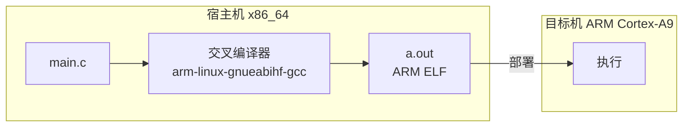

# 嵌入式开发工具链基础认知

> 📊 **本章难度等级：** <span class="badge-b">**B级 (Beginner)**</span>

---

## 工具链定义与组成

---

### <strong>什么是嵌入式工具链</strong>

<span class="badge-b">B</span><br>
<span class="red">嵌入式开发工具链</span>是一组将高级语言源代码转换为可在目标嵌入式设备上运行的二进制程序的软件工具集合。
<br>
与通用PC开发不同，嵌入式工具链需要为目标处理器架构（ARM、RISC-V、MIPS等）生成机器码，而非x86。
<br>

| 工具组件 | 功能 | 典型可执行文件名 |
|---------|------|-----------------|
| 编译器前端 | 预处理、词法/语法分析、生成中间表示 | cc1、cc1plus |
| 编译器后端 | 中间表示优化、生成目标汇编 | cc1（后端阶段） |
| 汇编器 | 汇编代码转机器码 | as、arm-linux-gnueabihf-as |
| 链接器 | 符号解析、重定位、生成可执行文件 | ld、arm-linux-gnueabihf-ld |
| 调试器 | 断点、单步、查看寄存器/内存 | gdb、arm-linux-gnueabihf-gdb |
| 工具库 | C运行时库、数学库、线程库 | libc.so、libm.so、libpthread.so |

<span class="orange"><strong>1. 前端：</strong></span>处理源代码，生成与目标无关的中间表示（如GIMPLE、LLVM IR）。
<br>
<span class="orange"><strong>2. 后端：</strong></span>针对特定架构优化并生成汇编指令。
<br>
<span class="orange"><strong>3. binutils：</strong></span>addr2line、objdump、readelf等辅助工具，用于分析二进制文件。
<br>

<span class="blue">核心认知：工具链不是"一个程序"，而是"一条流水线"——源码经前端、后端、汇编器、链接器逐阶段转换，最终成为可执行文件。</span><br>

---

## 交叉编译概念

---

### <strong>为什么需要交叉编译</strong>

<span class="badge-b">B</span><br>
<span class="red">交叉编译（Cross Compilation）</span>指在宿主机（通常为x86 PC）上生成目标机（嵌入式设备）可执行代码的过程。
<br>
嵌入式设备通常资源受限（CPU弱、内存小、无图形界面），无法在其上直接运行完整的编译环境。
<br>



| 对比维度 | 本地编译（Native） | 交叉编译（Cross） |
|---------|-----------------|-----------------|
| 构建主机 | 与目标机相同架构 | 与目标机不同架构 |
| 编译速度 | 快（直接使用硬件） | 快（宿主机性能强） |
| 调试便捷性 | 直接运行调试 | 需远程调试或仿真 |
| 目标机资源要求 | 高（需完整开发环境） | 低（仅需运行环境） |
| 适用场景 | 服务器/PC开发 | 嵌入式/移动开发 |

<span class="blue">推导逻辑：交叉编译的本质是"用强大的机器为弱小的机器生产程序"，这是嵌入式开发不可回避的基础范式。</span><br>

---

### <strong>交叉编译器命名规范</strong>

<span class="badge-b">B</span><br>
<span class="red">GNU交叉编译器</span>遵循三元组命名规范：<span class="green">[架构]-[供应商]-[操作系统]-[ABI]</span>。
<br>

| 三元组示例 | 含义 |
|-----------|------|
| arm-linux-gnueabihf | ARM架构、Linux系统、GNU EABI、硬浮点 |
| aarch64-linux-gnu | ARM64架构、Linux系统、GNU ABI |
| riscv64-unknown-elf | RISC-V 64位、裸机环境、ELF格式 |
| arm-none-eabi | ARM架构、无OS（裸机）、EABI |

<span class="orange"><strong>1. ABI差异：</strong></span>gnueabi（软浮点）与gnueabihf（硬浮点）的函数调用约定不同，混合使用会导致链接错误。
<br>
<span class="orange"><strong>2. 裸机vs Linux：</strong></span>arm-none-eabi没有系统调用接口，不支持fork/exec/pthread；arm-linux-gnueabihf依赖Linux内核服务。
<br>

---

## sysroot与multilib

---

### <strong>sysroot：模拟目标机根文件系统</strong>

<span class="badge-i">I</span><br>
<span class="red">sysroot</span>是交叉编译器用于查找头文件和库文件的目录树，模拟目标机的根文件系统布局。
<br>
交叉编译器在搜索标准头文件（如stdio.h）和链接库（如libc.so）时，以sysroot为基准而非宿主机系统目录。
<br>

```bash
# 查看交叉编译器的默认sysroot
$ arm-linux-gnueabihf-gcc -print-sysroot
/usr/arm-linux-gnueabihf

# 显式指定sysroot（用于自定义SDK）
$ arm-linux-gnueabihf-gcc --sysroot=/opt/my-sdk/sysroot \
    -o hello hello.c
```

```
sysroot目录结构示例：
/opt/my-sdk/sysroot/
├── usr/
│   ├── include/          # 目标机头文件（stdio.h等）
│   └── lib/              # 目标机共享库（libc.so等）
├── lib/                  # 启动文件（crt1.o、Scrt1.o）
└── usr/lib/              # 数学库、线程库等
```

<span class="blue">配置原则：sysroot必须与目标机实际运行的根文件系统版本一致，否则会导致链接时符号未定义或运行时库版本不匹配。</span><br>

---

### <strong>multilib：多ABI/架构变体支持</strong>

<span class="badge-i">I</span><br>
<span class="red">multilib</span>允许单一编译器同时支持多种ABI或架构变体（如ARM hard-float与soft-float、thumb与ARM模式）。
<br>
编译器根据-mfloat-abi、-mthumb等标志自动选择对应的库路径。
<br>

| multilib变体 | 标志 | 用途 |
|-------------|------|------|
| 硬浮点 | -mfloat-abi=hard | 带FPU的ARMv7+ |
| 软浮点 | -mfloat-abi=soft | 无FPU的旧ARM |
| softfp | -mfloat-abi=softfp | 使用FPU但兼容软浮点ABI |
| ARM模式 | -marm | 32位ARM指令 |
| Thumb模式 | -mthumb | 16/32位混合Thumb指令 |

```bash
# 查看gcc支持的multilib配置
$ arm-linux-gnueabihf-gcc -print-multi-lib
.
thumb;@mthumb
armv7-a;@march=armv7-a
fpuv2;@mfpu=vfpv2
```

<span class="blue">工程注意：multilib路径由gcc自动搜索，不需要手动指定库路径；但链接自定义库时，需确保库ABI与编译器multilib变体匹配。</span><br>

---

## 裸机vs Linux工具链

---

### <strong>两种运行环境的根本差异</strong>

<span class="badge-b">B</span><br>
<span class="red">裸机工具链</span>（如arm-none-eabi-gcc）与<span class="red">Linux工具链</span>（如arm-linux-gnueabihf-gcc）的核心差异在于是否假设操作系统存在。
<br>

| 维度 | 裸机工具链 | Linux工具链 |
|------|-----------|-------------|
| C库 | newlib/nano-newlib（极简） | glibc（完整POSIX） |
| 启动代码 | 自行实现_reset/_start | 由glibc/crt提供 |
| 系统调用 | 不存在（直接操作寄存器） | 通过svc指令陷入内核 |
| 线程支持 | 无（或RTOS调度） | pthread原生支持 |
| 动态链接 | 仅静态链接 | 静态/动态均可 |
| 标准头文件 | 极简集 | 完整POSIX集 |

<span class="blue">选型原则：运行Linux的系统必须使用Linux工具链；裸机/RTOS系统使用裸机工具链；混合系统（如U-Boot）需根据运行阶段选择。</span><br>

---

## 嵌入式选型决策

---

### <strong>工具链选型的系统化方法</strong>

<span class="badge-i">I</span><br>
<span class="red">嵌入式工具链选型</span>应从目标架构、运行环境、功能需求和商业约束四个维度综合评估。
<br>

| 决策维度 | 关键问题 | 典型选择 |
|---------|---------|---------|
| 目标架构 | ARMv7/ARMv8/RISC-V/MIPS? | Linaro/gcc-arm/<br>crosstool-ng |
| 运行环境 | Linux/RTOS/裸机? | Linux工具链/裸机工具链 |
| ABI需求 | 硬浮点/软浮点/多库? | multilib支持 |
| 商业约束 | 是否需商业支持? | Linaro免费/ARM Compiler付费 |
| 构建方式 | 自编译/预编译/云构建? | crosstool-ng/buildroot/Yocto |

```bash
# 验证工具链是否匹配目标板的快速方法
$ echo 'int main(){}' | arm-linux-gnueabihf-gcc -x c - -o /dev/null \
    -march=armv7-a -mtune=cortex-a9 -mfpu=vfpv3-d16 -mfloat-abi=hard
# 无报错即表示该工具链支持目标处理器
```

<span class="blue">选型建议：新手项目从Linaro或ARM官方预编译工具链入手；深度定制项目使用crosstool-ng自行构建；大规模产品线使用Yocto SDK统一管控。</span><br>

---

## 历史演进与小结

---

### <strong>嵌入式工具链演进</strong>

<span class="badge-b">B</span><br>

| 年代 | 事件 | 意义 |
|------|------|------|
| 1987 | GNU GCC 1.0发布 | 自由软件编译器时代开启 |
| 1997 | egcs分支合并回GCC | GCC成为Linux默认编译器 |
| 2005 | CodeSourcery ARM工具链 | 首个高质量ARM Linux工具链 |
| 2010 | Linaro成立 | ARM生态工具链标准化 |
| 2013 | crosstool-ng成熟 | 自定义工具链构建标准化 |
| 2017 | ARM GCC 7 ARMv8支持 | ARM64交叉编译进入主流 |
| 2020 | LLVM/Clang嵌入式支持 | 替代GCC成为可能 |

---

## 本章小结

| 要点 | 核心结论 |
|------|---------|
| 工具链组成 | 前端+后端+汇编器+链接器+调试器+库 |
| 交叉编译 | 宿主机编译，目标机运行 |
| sysroot | 模拟目标机根文件系统的头文件/库路径 |
| multilib | 单一编译器支持多ABI变体 |
| 裸机vs Linux | 有无OS是核心分界线 |
| 选型方法 | 架构+环境+ABI+商业四维度评估 |

---

## 课后练习

1. **实验验证**：在x86 Linux宿主机上安装arm-linux-gnueabihf-gcc，编译一个"Hello, ARM"程序，用readelf确认其ARM架构属性。<br>
2. **概念辨析**：解释为什么arm-none-eabi-gcc不能编译使用pthread_create()的程序，而arm-linux-gnueabihf-gcc可以。<br>
3. **工程配置**：一个项目需要同时支持Cortex-A9（硬浮点）和Cortex-M4（软浮点）。设计一套multilib或双工具链的构建方案。<br>
