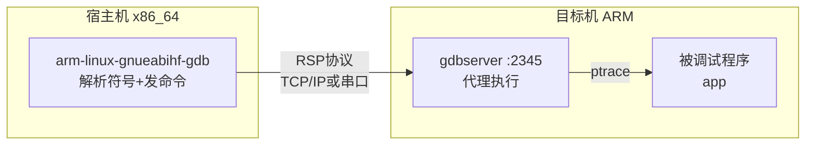

# 调试工具链与远程GDB

> 📊 **本章难度等级：** <span class="badge-i">**I级 (Intermediate)**</span>

---

## 本地与交叉GDB

---

### <strong>GDB的双版本体系</strong>

<span class="badge-i">I</span><br>
<span class="red">GDB（GNU Debugger）</span>在嵌入式开发中有两个版本：本地GDB（x86调试x86程序）和交叉GDB（x86调试ARM程序）。
<;br>
交叉GDB的命名与交叉编译器一致（如arm-linux-gnueabihf-gdb），能够解析ARM ELF文件的调试符号，但无法直接执行ARM指令。
<;br>

| 维度 | 本地GDB | 交叉GDB |
|------|--------|---------|
| 可执行文件名 | gdb | arm-linux-gnueabihf-gdb |
| 调试目标 | 与宿主机同架构 | 与宿主机不同架构 |
| 执行方式 | 直接加载运行 | 必须远程执行 |
| 符号解析 | 本地即可 | 需ELF文件（含debug信息） |
| 典型用法 | PC端程序调试 | 嵌入式目标机调试 |

```bash
# 交叉GDB加载嵌入式程序（不直接运行）
$ arm-linux-gnueabihf-gdb ./app_arm
(gdb) target remote 192.168.1.100:2345
(gdb) break main
(gdb) continue
```

<span class="blue">核心认知：交叉GDB本身不运行目标程序，它解析调试符号并通过远程协议控制目标机上的程序执行。</span><;br>

---

## gdbserver远程调试

---

### <strong>gdbserver的代理模式</strong>

<span class="badge-i">I</span><br>
<span class="red">gdbserver</span>是运行在目标机上的轻量代理，接收来自交叉GDB的远程调试命令，实际控制被调试进程的执行。
<;br>
gdbserver占用的内存仅数百KB，适合资源受限的嵌入式设备。
<;br>



```bash
# 目标机启动gdbserver（附加到已有进程）
$ gdbserver :2345 --attach $(pidof app)
# 或启动新进程
$ gdbserver :2345 /usr/bin/app

# 宿主机连接
$ arm-linux-gnueabihf-gdb ./app
(gdb) target remote 192.168.1.100:2345
(gdb) info registers          # 查看ARM寄存器
(gdb) x/10wx $sp              # 查看栈顶数据
```

<span class="orange"><strong>1. RSP协议：</strong></span>GDB Remote Serial Protocol，基于文本的调试命令协议，可在TCP或串口上传输。
<;br>
<span class="orange"><strong>2. ptrace系统调用：</strong></span>gdbserver通过ptrace控制被调试进程的单步、断点和信号传递。
<;br>
<span class="orange"><strong>3. 多进程调试：</strong></span>使用<span class="green">set follow-fork-mode child</span>跟踪子进程。
<;br>

<span class="blue">调试效率：gdbserver+网络调试避免了串口调试的低带宽限制，适合大型程序和复杂数据结构的查看。</span><;br>

---

## JTAG/SWD连接

---

### <strong>硬件调试接口的原理与选择</strong>

<span class="badge-i">I</span><br>
<span class="red">JTAG（Joint Test Action Group）</span>和<span class="red">SWD（Serial Wire Debug）</span>是嵌入式处理器上用于调试和边界扫描的硬件接口。
<;br>
JTAG使用4~5根信号线（TCK/TMS/TDI/TDO/TRST），SWD仅需2根（SWDIO/SWCLK），是ARM Cortex-M系列的首选。
<;br>

| 特性 | JTAG | SWD |
|------|------|-----|
| 信号线数 | 4~5 | 2 |
| 调试功能 | 完整（含边界扫描） | 基本调试 |
| 速度 | 受TCK限制 | 通常更快 |
| 典型芯片 | 传统ARM、FPGA | Cortex-M系列 |
| 调试器价格 | 高（专业JTAG仿真器） | 低（ST-Link等） |

```bash
# OpenOCD连接STM32（SWD接口）
$ openocd -f interface/stlink.cfg \
          -f target/stm32f4x.cfg \
          -c "init" \
          -c "halt" \
          -c "flash write_image build/app.bin 0x8000000" \
          -c "reset run" \
          -c "shutdown"
```

<span class="blue">硬件调试价值：当目标机尚未启动Linux或gdbserver无法运行时，JTAG/SWD是唯一可用的调试手段，可调试bootloader、内核 panic 和裸机程序。</span><;br>

---

## Core dump分析

---

### <strong>崩溃现场的离线分析</strong>

<span class="badge-i">I</span><;br>
<span class="red">Core dump</span>是程序崩溃时由内核生成的内存快照文件，包含崩溃瞬间的寄存器状态、栈回溯和全局数据。
<;br>
嵌入式系统通常将core dump写入持久化存储或通过串口输出，事后在宿主机上用交叉GDB分析。
<;br>

```bash
# 配置嵌入式系统生成core dump
$ echo "core" > /proc/sys/kernel/core_pattern
$ ulimit -c unlimited

# 崩溃后获取core文件到宿主机
$ scp root@target:/root/core ./core_app

# 交叉GDB分析core dump
$ arm-linux-gnueabihf-gdb ./app ./core_app
(gdb) bt                     # 查看崩溃栈回溯
(gdb) info registers         # 查看崩溃时寄存器
(gdb) x/20wx $sp            # 查看栈内容
(gdb) list *$pc             # 查看崩溃代码位置
```

<span class="orange"><strong>1. core_pattern：</strong></span>通过管道可将core dump直接发送到远程服务器，避免占用本地存储。
<;br>
<span class="orange"><strong>2. 调试符号：</strong></span>分析core dump时，宿主机上必须有与崩溃程序完全相同的带符号ELF文件。
<;br>
<span class="orange"><strong>3. strip分离：</strong></span>发布用strip去掉符号的ELF，同时保留未strip版本用于调试。
<;br>

<span class="blue">工程实践：在嵌入式系统中部署<span class="green">coredumpctl</span>或自定义崩溃处理程序，实现崩溃现场的自动收集和上报。</span><;br>

---

## printk vs gdb策略

---

### <strong>调试策略的两分法</strong>

<span class="badge-i">I</span><;br>
<span class="red">printk（或用户态printf）</span>和<span class="red">GDB</span>是嵌入式调试的两种基本策略，各有不可替代的应用场景。
<;br>

| 场景 | 推荐策略 | 理由 |
|------|---------|------|
| 启动时序问题 | printk | GDB无法在bootloader阶段介入 |
| 竞态条件 | printk+时间戳 | GDB的单步会改变时序 |
| 数据流追踪 | printk+环形日志 | 不中断程序执行 |
| 段错误定位 | GDB+core dump | 精确栈回溯和寄存器 |
| 内存泄漏 | valgrind/ASan | 动态分析工具比手动高效 |
| 性能热点 | perf采样 | GDB断点会严重扭曲性能 |

```c
// 带时间戳的printk宏（内核态）
// 文件路径：include/debug.h
#define pr_debug_ts(fmt, ...) \
    printk(KERN_DEBUG "[%llu] " fmt, \
           ktime_get_ns(), ##__VA_ARGS__)

// 用户态环形日志（无锁单消费者）
// 文件路径：utils/ring_log.c
static inline void ring_log(const char *fmt, ...) {
    uint32_t w = __atomic_load_n(&log_buf.write_idx, __ATOMIC_RELAXED);
    // 格式化到共享内存环形缓冲区
    // 消费者进程异步读取并输出到串口/文件
}
```

<span class="blue">策略原则：时序敏感类bug用printk/日志，崩溃类bug用GDB/core dump，性能类bug用perf/profile，内存类bug用sanitizer。</span><;br>

---

## 多线程调试

---

### <strong>pthread程序在GDB中的调试技巧</strong>

<span class="badge-i">I</span><;br>
<span class="red">多线程调试</span>的难点在于：断点触发时所有线程停止，单步执行时其他线程被冻结，这会掩盖真实的并发问题。
<;br>
GDB提供线程切换、条件断点和non-stop模式来缓解这些问题。
<;br>

```bash
# GDB多线程调试常用命令
(gdb) info threads                    # 列出所有线程
  Id   Target Id         Frame
  1    Thread 0x7f...   main () at app.c:45
  2    Thread 0x7f...   worker_thread at worker.c:20
  3    Thread 0x7f...   monitor_thread at monitor.c:30

(gdb) thread 2                        # 切换到线程2
(gdb) bt                              # 查看线程2的栈回溯
(gdb) break worker.c:25 thread 2      # 仅在线程2上设置断点
(gdb) set scheduler-locking on        # 仅当前线程运行，其他冻结
(gdb) set scheduler-locking off       # 恢复所有线程调度
```

```bash
# non-stop模式：单个线程断点不冻结其他线程
(gdb) set pagination off
(gdb) set target-async on
(gdb) set non-stop on
(gdb) continue -a  # 仅继续当前线程，其他线程不受影响
```

<span class="blue">调试建议：多线程死锁问题优先用<span class="green">info locks</span>和<span class="green">thread apply all bt</span>分析所有线程的锁持有状态；竞态问题优先用ThreadSanitizer而非GDB。</span><;br>

---

## 历史演进与小结

---

### <strong>嵌入式调试演进</strong>

<span class="badge-i">I</span><;br>

| 年代 | 事件 | 意义 |
|------|------|------|
| 1986 | GDB 1.0发布 | 自由软件调试器诞生 |
| 1999 | gdbserver引入 | 嵌入式远程调试标准化 |
| 2005 | OpenOCD项目启动 | 开源JTAG/SWD调试 |
| 2010 | KGDB进入主线 | Linux内核源码级调试 |
| 2012 | LLDB发布 | Clang生态调试器 |
| 2018 | Core dump改进 | systemd-coredump管理 |

---

## 本章小结

| 要点 | 核心结论 |
|------|---------|
| 交叉GDB | 解析ARM符号，通过网络/串口远程控制 |
| gdbserver | 目标机代理，轻量数百KB |
| JTAG/SWD | 硬件级调试，bootloader/裸机必备 |
| Core dump | 崩溃现场离线分析，保留符号ELF是关键 |
| 调试策略 | printk用于时序，GDB用于崩溃，perf用于性能 |
| 多线程 | scheduler-locking和non-stop模式 |

---

## 课后练习

1. **实操演练**：在ARM开发板上部署gdbserver，通过宿主机交叉GDB完成断点设置、单步执行、变量查看和栈回溯。<;br>
2. **问题诊断**：某嵌入式程序随机崩溃，dmesg显示"Segmentation fault"但无core dump。设计完整的排查和收集core dump的流程。<;br>
3. **场景选择**：分析以下三种场景应选用的调试工具组合：（a）Linux内核启动死机；（b）多线程程序偶现死锁；（c）用户态程序性能劣化50%。<;br>
