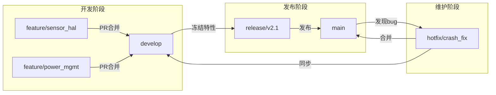

# 版本控制与代码审查

> 📊 **本章难度等级：** <span class="badge-i">**I级 (Intermediate)**</span>

---

## Git嵌入式工作流

---

### <strong>面向嵌入式团队的Git分支模型</strong>

<span class="badge-i">I</span><br>
<span class="red">嵌入式项目</span>的Git工作流需要在"快速迭代"与"稳定发布"之间取得平衡。
<br>
推荐采用简化版Git Flow：长期维护<span class="green">main</span>和<span class="green">develop</span>分支，功能开发用feature分支，版本发布用release分支，紧急修复用hotfix分支。
<;br>



| 分支 | 生命周期 | 来源 | 合并目标 | 规则 |
|------|---------|------|---------|------|
| main | 永久 | - | - | 仅接受release和hotfix合并 |
| develop | 永久 | - | - | 功能集成的每日构建基础 |
| feature/* | 临时 | develop | develop | 每个功能独立分支 |
| release/* | 临时 | develop | main + develop | 仅bug修复，不新增特性 |
| hotfix/* | 临时 | main | main + develop | 生产环境紧急修复 |

<span class="blue">嵌入式特殊性：固件发布后无法OTA回退时，main分支的每次合并都需经过完整的回归测试和签名流程。</span><;br>

---

## 分支策略

---

### <strong>多产品线并行开发的分支管理</strong>

<span class="badge-i">I</span><;br>
<span class="red">嵌入式产品</span>常面临多硬件平台、多客户定制的并行开发需求，分支策略需要支撑代码复用与差异隔离。
<;br>

```bash
# 多平台分支命名规范
platform/stm32f4xx        # ST平台
platform/nxp_i.mx6        # NXP平台
platform/rockchip_rk3568  # 瑞芯微平台

customer/a_industrial     # A客户工业定制
customer/b_consumer     # B客户消费级定制

# 特性分支与平台分支组合
feature/usb_hal__stm32f4xx   # 平台相关特性
driver/canfd__all            # 跨平台通用驱动
```

<span class="orange"><strong>1. 平台层分支：</strong></span>硬件抽象层（HAL）和板级支持包（BSP）按平台隔离。
<;br>
<span class="orange"><strong>2. 客户层分支：</strong></span>应用层配置和UI定制按客户隔离，通过cherry-pick合并公共改进。
<;br>
<span class="orange"><strong>3. 合并策略：</strong></span>公共代码修改先在develop验证，再通过cherry-pick同步到各平台分支。
<;br>

<span class="blue">分支管理原则：平台分支数量控制在可维护范围内（建议<10个活跃平台），定期清理EOL产品的分支。</span><;br>

---

## Submodule管理

---

### <strong>Git Submodule在嵌入式项目中的应用</strong>

<span class="badge-i">I</span><;br>
<span class="red">Git Submodule</span>允许将一个Git仓库作为另一个仓库的子目录管理，保持独立的提交历史。
<;br>
在嵌入式中常用于管理：内核源码、第三方库（如mbedtls、lvgl）、硬件抽象层和SDK。
<;br>

```bash
# 添加内核源码为Submodule
$ git submodule add \
    https://github.com/torvalds/linux.git \
    kernel/linux-stable
$ git submodule update --init --recursive

# 锁定到特定版本（重要！）
$ cd kernel/linux-stable
$ git checkout v5.15.89
$ cd ../..
$ git add kernel/linux-stable
$ git commit -m "Lock kernel to v5.15.89"

# 团队成员克隆
$ git clone --recursive https://git.example.com/firmware.git
# 或已有仓库：
$ git submodule update --init --recursive
```

<span class="orange"><strong>1. 版本锁定：</strong></span>主仓库记录Submodule的精确commit hash，确保所有开发者使用相同的库版本。
<;br>
<span class="orange"><strong>2. 递归更新：</strong></span>使用<span class="green">--recursive</span>确保子模块的子模块也被拉取。
<;br>
<span class="orange"><strong>3. CI集成：</strong></span>CI/CD流水线必须执行<span class="green">git submodule update --init</span>，否则构建会失败。
<;br>

<span class="blue">替代方案：对于频繁更新的子模块，考虑使用Git Subtree或包管理器（conan、yocto recipe）替代Submodule，减少版本同步的复杂度。</span><;br>

---

## 代码审查checklist

---

### <strong>嵌入式代码审查的关键检查项</strong>

<span class="badge-i">I</span><;br>
<span class="red">代码审查（Code Review）</span>是嵌入式软件质量保障的核心环节，需要针对资源受限、实时性和可靠性要求设计专用检查清单。
<;br>

| 类别 | 检查项 | 说明 |
|------|--------|------|
| 资源安全 | 内存分配有对应释放 | 检查malloc/free、kmalloc/kfree配对 |
| 资源安全 | 无缓冲区溢出 | 检查strcpy、memcpy长度参数 |
| 并发安全 | 共享资源有互斥保护 | 检查全局变量、硬件寄存器访问 |
| 并发安全 | 无死锁风险 | 检查锁获取顺序一致性 |
| 实时性 | 无阻塞操作于中断上下文 | 检查ISR中的sleep/alloc/printf |
| 实时性 | 锁持有时间最小化 | 检查mutex持有区间代码长度 |
| 可移植性 | 不使用硬编码地址 | 检查内存映射I/O地址定义方式 |
| 可移植性 | 字节序和位宽显式处理 | 检查ntohs/htonl、stdint类型 |
| 可靠性 | 错误路径有处理 | 检查所有返回值是否被使用 |
| 可靠性 | 日志有上下文信息 | 检查printk/日志是否包含足够诊断信息 |

```bash
# 代码审查自动化辅助：git diff统计
$ git diff --stat develop
# 检查提交范围是否合理

# 静态扫描集成到PR检查
$ cppcheck --enable=all --inconclusive src/
$ scan-build make
```

<span class="blue">审查原则：审查不是挑错，而是共同提升代码质量；每个PR至少需要一个熟悉该模块的工程师 approve。</span><;br>

---

## 静态分析工具

---

### <strong>嵌入式静态分析工具链</strong>

<span class="badge-i">I</span><;br>
<span class="red">静态分析</span>在不执行代码的情况下发现潜在缺陷，是嵌入式开发中成本效益最高的质量保障手段。
<;br>

| 工具 | 类型 | 检测能力 | 适用场景 |
|------|------|---------|---------|
| cppcheck | 开源 | 缓冲区溢出、空指针、内存泄漏 | 日常CI集成 |
| Clang Static Analyzer | 开源 | 路径敏感分析、资源泄漏 | 深度分析 |
| Coverity | 商业 | 全面的C/C++缺陷检测 | 高可靠性产品 |
| PC-lint / FlexeLint | 商业 | MISRA-C规则检查 | 汽车/航空合规 |
| sparse | 开源（内核专用） | 内核类型系统检查 | Linux驱动开发 |

```bash
# cppcheck嵌入式项目扫描
$ cppcheck --enable=all \
           --std=c11 \
           --platform=unix32 \
           --suppress=missingInclude \
           -I include/ \
           src/ 2> cppcheck_report.xml

# Clang Static Analyzer（scan-build）
$ scan-build -o scan-report make
# 生成HTML报告，可视化缺陷路径
```

<span class="blue">工具链建议：开源项目使用cppcheck+scan-build作为CI门禁；汽车电子等对合规有要求的领域必须使用PC-lint进行MISRA-C检查。</span><;br>

---

## 二进制diff

---

### <strong>固件二进制差异分析</strong>

<span class="badge-i">I</span><;br>
<span class="red">固件二进制diff</span>用于验证两次编译之间二进制的一致性，或分析补丁对二进制的影响范围。
<;br>
交叉编译环境的微小差异（如gcc版本、编译时间戳）会导致二进制变化，需要结构化工具过滤噪声。
<;br>

```bash
# 使用hexdump+diff进行基础二进制比较
$ hexdump -C firmware_v1.bin > v1.hex
$ hexdump -C firmware_v2.bin > v2.hex
$ diff -u v1.hex v2.hex | head -50

# 使用bloaty分析二进制体积变化来源
$ bloaty firmware_v2.bin -- firmware_v1.bin \
    -d compileunits,symbols
# 输出按编译单元和符号分解的体积差异

# 使用readelf对比ELF结构差异
$ diff <(arm-linux-gnueabihf-readelf -a v1.elf) \
       <(arm-linux-gnueabihf-readelf -a v2.elf)
```

<span class="orange"><strong>1. 构建可复现性：</strong></span>使用SOURCE_DATE_EPOCH消除编译时间戳差异，确保同一代码树生成相同二进制。
<;br>
<span class="orange"><strong>2. 符号级diff：</strong></span>比纯二进制diff更有价值，可精确定位哪个函数发生变化。
<;br>
<span class="orange"><strong>3. 哈希签名：</strong></span>对固件计算SHA-256，在发布流程中作为完整性校验依据。
<;br>

<span class="blue">工程实践：在CI流程中加入二进制签名和diff报告，使任何固件变更都可追溯到具体的源代码修改。</span><;br>

---

## 历史演进与小结

---

### <strong>版本控制与代码质量演进</strong>

<span class="badge-i">I</span><;br>

| 年代 | 事件 | 意义 |
|------|------|------|
| 2005 | Git发布 | 分布式版本控制成为主流 |
| 2008 | GitHub上线 | 基于PR的协作模式标准化 |
| 2010 | cppcheck成熟 | 开源C/C++静态分析可用 |
| 2012 | Clang SA发布 | 路径敏感分析进入开源 |
| 2015 | Git Flow规范 | 嵌入式团队分支策略参考 |
| 2020 | Git Submodule改进 | 子模块管理体验提升 |

---

## 本章小结

| 要点 | 核心结论 |
|------|---------|
| Git工作流 | 简化Git Flow，main/develop/feature/release/hotfix |
| 分支策略 | 平台分支+客户分支，公共代码cherry-pick同步 |
| Submodule | 版本锁定，递归更新，CI集成 |
| 代码审查 | 资源安全、并发安全、实时性、可移植性、可靠性五维度 |
| 静态分析 | cppcheck日常+scan-build深度+PC-lint合规 |
| 二进制diff | 可复现构建+符号级diff+哈希签名 |

---

## 课后练习

1. **分支设计**：为一个同时支持STM32F4和RK3568双平台的固件项目设计Git分支策略，画出分支关系图并说明合并规则。<;br>
2. **静态分析集成**：将cppcheck集成到CMake构建中，实现每次编译后自动扫描，错误即阻断构建。<;br>
3. **可复现构建**：配置Docker化交叉编译环境，证明同一git commit在不同时间、不同机器上生成相同的固件SHA-256哈希。<;br>
