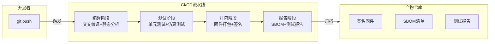

# CI/CD与自动化构建

> 📊 **本章难度等级：** <span class="badge-i">**I级 (Intermediate)**</span> → <span class="badge-e">**E级 (Expert)**</span>

---

## GitLab CI/Jenkins Pipeline

---

### <strong>嵌入式CI/CD流水线的架构</strong>

<span class="badge-i">I</span><;br>
<span class="red">CI/CD（Continuous Integration/Continuous Deployment）</span>在嵌入式中的核心价值是：每次代码提交自动触发编译、测试和报告，尽早发现集成问题。
<;br>



| 阶段 | 任务 | 工具 | 失败策略 |
|------|------|------|---------|
| 编译 | 交叉编译、静态分析、代码风格检查 | gcc、cppcheck、clang-format | 阻断 |
| 单元测试 | x86模拟运行gtest/unity测试 | qemu-user、valgrind | 阻断 |
| 集成测试 | 硬件在环仿真、逻辑验证 | renode、qemu-system | 阻断 |
| 打包 | 生成固件镜像、压缩、哈希 | objcopy、sha256sum | 阻断 |
| 签名 | 固件加密签名 | openssl、HSM | 阻断 |
| 报告 | 生成SBOM、覆盖率、体积报告 | cyclonedx、gcov、bloaty | 提醒 |

<span class="blue">流水线设计原则：编译和静态分析必须"快速失败"（<5分钟），集成测试可异步执行，签名阶段严格控制密钥访问权限。</span><;br>

---

### <strong>GitLab CI配置示例</strong>

<span class="badge-i">I</span><;br>

```yaml
# .gitlab-ci.yml 嵌入式项目配置
# 文件路径：.gitlab-ci.yml
# 行号：1-50
stages:
  - build
  - test
  - package
  - report

variables:
  CROSS_COMPILE: "arm-linux-gnueabihf-"
  SYSROOT: "/opt/sdk/sysroot"

build:
  stage: build
  image: registry.example.com/builder:arm-v2.1
  script:
    - cmake -B build -DCMAKE_TOOLCHAIN_FILE=cmake/arm.cmake -S .
    - cmake --build build -j$(nproc)
    - cppcheck --enable=all --xml --xml-version=2 src/ 2> cppcheck.xml
  artifacts:
    paths:
      - build/
    reports:
      codequality: cppcheck.xml

unit_test:
  stage: test
  image: registry.example.com/builder:arm-v2.1
  script:
    - cmake -B build-test -DENABLE_TEST=ON -S .
    - cmake --build build-test -j$(nproc)
    - ctest --test-dir build-test --output-junit junit.xml
  artifacts:
    reports:
      junit: junit.xml

package:
  stage: package
  dependencies:
    - build
  script:
    - objcopy -O binary build/app app.bin
    - sha256sum app.bin > app.bin.sha256
    - openssl dgst -sha256 -sign private.pem app.bin > app.bin.sig
  artifacts:
    paths:
      - app.bin
      - app.bin.sha256
      - app.bin.sig
```

<span class="orange"><strong>1. 专用构建镜像：</strong></span>registry.example.com/builder:arm-v2.1是预装交叉工具链和依赖的Docker镜像，保证环境一致性。
<;br>
<span class="orange"><strong>2. 产物传递：</strong></span>artifacts机制将build阶段的输出传递给package阶段，避免重复编译。
<;br>
<span class="orange"><strong>3. 报告集成：</strong></span>junit.xml和cppcheck.xml被GitLab解析为可视化报告，直接在MR页面展示。
<;br>

---

## Docker化构建环境

---

### <strong>Docker作为构建环境的标准化手段</strong>

<span class="badge-i">I</span><;br>
<span class="red">Docker化构建环境</span>消除了"在我机器上可以编译"的问题，将工具链、库依赖和系统配置封装为可版本化的镜像。
<;br>

```dockerfile
# 嵌入式ARM交叉编译Dockerfile
# 文件路径：docker/Dockerfile.builder
# 行号：1-30
FROM ubuntu:22.04

# 安装基础依赖
RUN apt-get update && apt-get install -y \
    build-essential cmake git \
    python3 python3-pip \
    wget curl \
    && rm -rf /var/lib/apt/lists/*

# 安装Linaro ARM工具链
ARG TOOLCHAIN_URL="https://releases.linaro.org/.../gcc-linaro-...tar.xz"
RUN wget -q ${TOOLCHAIN_URL} -O /tmp/toolchain.tar.xz \
    && tar xf /tmp/toolchain.tar.xz -C /opt/ \
    && rm /tmp/toolchain.tar.xz

ENV PATH="/opt/gcc-linaro/bin:${PATH}"
ENV CROSS_COMPILE="arm-linux-gnueabihf-"

# 安装额外工具
RUN pip3 install cppcheck-junit bloaty

WORKDIR /workspace
```

```bash
# 构建和使用Docker镜像
$ docker build -f docker/Dockerfile.builder \
               -t registry.example.com/builder:arm-v2.1 .

$ docker run --rm -v $(pwd):/workspace \
    registry.example.com/builder:arm-v2.1 \
    bash -c "cmake -B build && cmake --build build"
```

<span class="blue">Docker化价值：构建环境版本化（Dockerfile即配置）、本地与CI环境一致、新成员 onboarding 时间从数天缩短到数分钟。</span><;br>

---

## 交叉编译CI流程

---

### <strong>多平台CI构建矩阵</strong>

<span class="badge-i">I</span><;br>
<span class="red">嵌入式CI</span>常需同时构建多个目标平台，CI系统通过矩阵（matrix）配置并行化不同平台的编译。
<;br>

```yaml
# GitLab CI多平台矩阵构建
# 文件路径：.gitlab-ci.yml（矩阵配置段）
build:
  stage: build
  parallel:
    matrix:
      - PLATFORM: stm32f4
        TOOLCHAIN: arm-none-eabi
        ARCH_FLAGS: "-mcpu=cortex-m4 -mthumb -mfloat-abi=hard"
      - PLATFORM: imx6
        TOOLCHAIN: arm-linux-gnueabihf
        ARCH_FLAGS: "-march=armv7-a -mtune=cortex-a9"
      - PLATFORM: rk3568
        TOOLCHAIN: aarch64-linux-gnu
        ARCH_FLAGS: "-march=armv8-a"
  image: registry.example.com/builder:${TOOLCHAIN}
  script:
    - export CROSS_COMPILE="${TOOLCHAIN}-"
    - cmake -B build-${PLATFORM} \
            -DCMAKE_TOOLCHAIN_FILE=cmake/${PLATFORM}.cmake \
            -DCMAKE_C_FLAGS="${ARCH_FLAGS}" \
            -S .
    - cmake --build build-${PLATFORM} -j$(nproc)
  artifacts:
    paths:
      - build-${PLATFORM}/
```

<span class="blue">矩阵构建优势：单一.gitlab-ci.yml定义所有平台，减少配置重复，确保各平台构建规则一致。</span><;br>

---

## 固件签名与校验

---

### <strong>安全启动链的签名机制</strong>

<span class="badge-e">E</span><;br>
<span class="red">固件签名</span>是防止未授权固件刷入设备的关键安全机制，通常采用非对称加密（RSA/ECC）对固件哈希进行签名。
<;br>
设备启动时用公钥验证签名，只有验证通过才执行固件。
<;br>

```bash
# 固件签名流程（OpenSSL RSA）
# 1. 生成密钥对（一次性）
$ openssl genpkey -algorithm RSA -out private.pem -pkeyopt rsa_keygen_bits:2048
$ openssl rsa -in private.pem -pubout -out public.pem

# 2. 编译固件
$ arm-linux-gnueabihf-gcc -o app app.c

# 3. 计算哈希并签名
$ sha256sum app.bin > app.bin.sha256
$ openssl dgst -sha256 -sign private.pem -out app.bin.sig app.bin

# 4. 验证签名（设备端启动时执行类似逻辑）
$ openssl dgst -sha256 -verify public.pem \
    -signature app.bin.sig app.bin
# 输出：Verified OK
```

| 安全层级 | 签名方案 | 密钥存储 | 适用场景 |
|---------|---------|---------|---------|
| 基础 | OpenSSL RSA | 设备flash（只读分区） | 消费级设备 |
| 增强 | ECC P-256 | OTP熔丝（一次性写入） | 工业控制 |
| 高安全 | RSA-4096 | 专用HSM/TPM | 金融/汽车 |

<span class="blue">安全原则：私钥必须存储在HSM或离线安全环境中，CI/CD仅持有签名接口调用权限，不接触私钥明文。</span><;br>

---

## SBOM生成

---

### <strong>软件物料清单的自动化生成</strong>

<span class="badge-i">I</span><;br>
<span class="red">SBOM（Software Bill of Materials）</span>是固件的"成分表"，列出所有开源组件、许可证和版本信息。
<;br>
SBOM是供应链安全和合规审计的基础文档，欧盟Cyber Resilience Act和美国EO 14028已将其纳入法律要求。
<;br>

```bash
# 使用cyclonedx生成SBOM
$ cyclonedx-linux-x64 add files \
    --no-input-guess \
    --output-format json \
    --output-file sbom.json \
    --recurse \
    src/

# 扫描依赖库并合并到SBOM
$ cyclonedx-linux-x64 analyze \
    --input-file sbom.json \
    --output-file sbom-enriched.json

# 验证许可证合规性
$ fossology-nomos sbom-enriched.json
```

| SBOM字段 | 含义 | 示例 |
|---------|------|------|
| component name | 组件名称 | mbedtls |
| version | 版本号 | 2.28.0 |
| supplier | 供应商 | ARMmbed |
| licenses | 许可证 | Apache-2.0 |
| checksum | 哈希校验 | SHA-256: a1b2c3... |
| purl | 包URL | pkg:github/ARMmbed/mbedtls@2.28.0 |

<span class="blue">合规要求：每个发布的固件版本必须附带SBOM文件，在CI流程中自动生成并归档到产物仓库。</span><;br>

---

## 回归测试集成

---

### <strong>嵌入式回归测试的分层策略</strong>

<span class="badge-e">E</span><;br>
<span class="red">嵌入式回归测试</span>面临硬件依赖和执行环境受限的挑战，通常采用三层策略：模拟层、仿真层和硬件层。
<;br>

| 层级 | 方法 | 速度 | 精度 | 适用场景 |
|------|------|------|------|---------|
| 模拟层 | x86编译+mock HAL | 最快（秒级） | 低 | 算法逻辑验证 |
| 仿真层 | QEMU/renode仿真 | 中等（分钟级） | 中高 | 驱动/协议验证 |
| 硬件层 | 真实目标板 | 慢（小时级） | 最高 | 集成/压力测试 |

```bash
# QEMU用户态模拟运行ARM单元测试
$ qemu-arm -L /opt/arm-sysroot ./build-test/test_sensor
# 在x86宿主机上直接运行ARM ELF测试程序

# QEMU系统态仿真完整嵌入式Linux
$ qemu-system-arm \
    -M versatilepb \
    -kernel build/zImage \
    -dtb build/versatile-pb.dtb \
    -drive file=build/rootfs.ext2,format=raw \
    -append "root=/dev/sda console=ttyAMA0" \
    -nographic

# renode仿真（支持外设建模）
$ renode scripts/stm32f4.resc
# 在仿真中运行固件，可以钩挂GPIO、UART等行为
```

<span class="blue">测试金字塔原则：70%模拟层单元测试 + 20%仿真层集成测试 + 10%硬件层系统测试，以最小成本覆盖最大风险面。</span><;br>

---

## 历史演进与小结

---

### <strong>CI/CD在嵌入式领域的演进</strong>

<span class="badge-i">I</span><;br>

| 年代 | 事件 | 意义 |
|------|------|------|
| 2006 | Jenkins（Hudson）发布 | 开源CI服务器标准化 |
| 2011 | GitLab CI | 代码仓库与CI深度集成 |
| 2013 | Docker发布 | 构建环境容器化 |
| 2015 | GitLab CI/CD Pipeline | 多阶段流水线成熟 |
| 2018 | SBOM概念普及 | 供应链安全受关注 |
| 2021 | 欧盟Cyber Resilience Act草案 | SBOM成为法律要求 |
| 2023 | HSM签名集成CI | 安全启动链自动化 |

---

## 本章小结

| 要点 | 核心结论 |
|------|---------|
| CI流水线 | 编译→测试→打包→签名→报告五阶段 |
| Docker化 | 构建环境版本化，消除本地差异 |
| 多平台矩阵 | 单一配置定义多平台并行构建 |
| 固件签名 | 非对称加密+安全密钥存储 |
| SBOM | 供应链透明化，法规合规必备 |
| 回归测试 | 模拟70%+仿真20%+硬件10%金字塔 |

---

## 课后练习

1. **CI配置**：为一个ARM Linux项目编写完整的.gitlab-ci.yml，包含编译、cppcheck静态分析、单元测试和固件签名四个阶段。<;br>
2. **Docker构建**：编写一个包含arm-linux-gnueabihf-gcc、CMake和cppcheck的Dockerfile，验证本地构建与CI构建输出一致。<;br>
3. **安全设计**：设计一套固件签名CI流程，要求私钥存储在HSM中，CI仅通过API调用签名服务，给出流程图和密钥管控方案。<;br>
