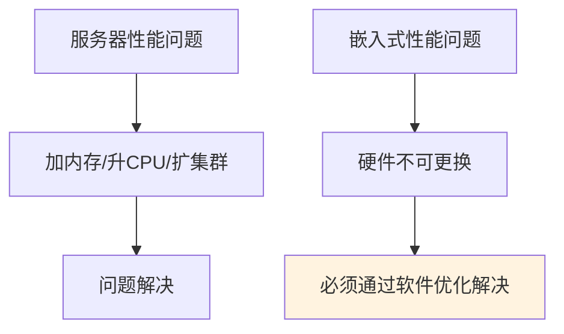
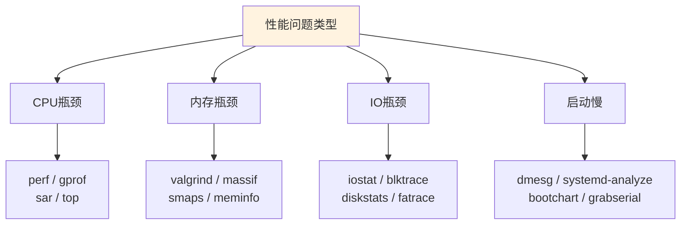

# 性能分析基础认知

> <span class="badge-b">**入门 (Beginner)**</span>
> 建立性能分析的四维认知框架，掌握CPU、内存、IO、启动时间的评估方法，理解采样、追踪、剖析三种分析范式的适用边界。

---

## 为什么需要性能分析 [B]

---

### <strong>嵌入式性能问题的特殊性</strong>

<span class="badge-b">B</span><br>
<span class="red">嵌入式性能分析</span>与服务器性能分析存在本质差异：服务器可以通过水平扩展缓解性能问题，嵌入式设备的硬件资源是固定的——CPU频率、内存大小、Flash容量在出厂时即已锁定。<br>



<span class="blue">核心矛盾：嵌入式性能问题没有"硬件升级"这一退路，必须在现有约束内通过算法优化、资源配置和代码重构解决。</span><br>

---

### <strong>性能问题的隐性成本</strong>

<span class="badge-b">B</span><br>
<span class="red">性能退化</span>在嵌入式系统中往往表现为间接症状，而非直接的性能报警。开发者容易误判问题根源。<br>

<span class="orange"><strong>1. 电池寿命缩短：</strong></span><br>
CPU持续高负载导致DVFS无法降频，功耗曲线呈线性增长而非预期的阶梯式下降。<br>

<span class="orange"><strong>2. 响应延迟抖动：</strong></span><br>
任务调度器在高负载下无法保证实时任务的截止时间（deadline），导致传感器数据采集时序混乱。<br>

<span class="orange"><strong>3. 存储寿命提前耗尽：</strong></span><br>
频繁的日志写入和临时文件创建导致Flash的擦写次数（P/E cycle）在数月内达到设计上限。<br>

<span class="blue">关键洞察：性能问题在嵌入式中往往是"生存问题"而非"体验问题"——电池、存储、散热都直接关联设备可用寿命。</span><br>

---

## CPU-内存-IO-启动时间四维度 [B→I]

---

### <strong>CPU维度：利用率与调度延迟</strong>

<span class="badge-b">B</span><br>
<span class="red">CPU性能分析</span>的核心指标是利用率（utilization）和调度延迟（scheduling latency）。前者衡量忙碌程度，后者衡量响应及时性。<br>

```bash
# 文件路径：/proc/stat
# 功能：内核CPU时间片统计
# 行号：1（伪文件，无固定行号）
$ cat /proc/stat | head -n 1
cpu  10234 0 5678 89012 123 45 678 0 0 0
# 字段：user nice system idle iowait irq softirq steal guest guest_nice

# 利用率计算（两次采样求差值）
$ top -bn1 | grep "Cpu(s)"
%Cpu(s):  15.3 us,  5.2 sy,  0.0 ni, 78.5 id,  0.0 wa,  0.8 hi,  0.2 si
```

<span class="orange"><strong>1. user + system 占比：</strong></span><br>
user（用户态）+ system（内核态）合计利用率反映CPU的真实忙碌程度。idle（空闲）+ iowait（IO等待）是优化空间。<br>

<span class="orange"><strong>2. 调度延迟的测量：</strong></span><br>

```bash
# 文件路径：/proc/sched_debug
# 功能：调度器调试信息，含每个CPU的运行队列
$ grep -A5 "cpu#0" /proc/sched_debug
```

<span class="blue">关键洞察：CPU利用率超过80%时，调度延迟通常呈指数增长。嵌入式实时系统应将平均利用率控制在60%以下，为突发负载预留余量。</span><br>

---

### <strong>内存维度： footprint 与压力</strong>

<span class="badge-i">I</span><br>
<span class="red">内存分析</span>关注三个层次：静态占用（footprint）、动态分配速率和回收压力（memory pressure）。<br>

```bash
# 文件路径：/proc/meminfo
# 功能：物理内存全景统计
# 行号：1（伪文件）
$ cat /proc/meminfo
MemTotal:        2048000 kB
MemFree:          123456 kB
MemAvailable:     567890 kB
Buffers:           23456 kB
Cached:           345678 kB
Slab:              45678 kB
SReclaimable:      34567 kB
```

<span class="orange"><strong>1. 静态 footprint 评估：</strong></span><br>
进程启动后通过 <span class="green">/proc/PID/status</span> 中的VmRSS字段测量常驻内存。嵌入式设备通常要求单个进程footprint低于数MB。<br>

<span class="orange"><strong>2. 动态分配分析：</strong></span><br>

```bash
# 文件路径：/proc/PID/smaps
# 功能：进程内存映射详细信息
$ cat /proc/1234/smaps | grep -E "Size|Rss|Pss|Shared_Clean|Shared_Dirty"
# PSS（Proportional Set Size）是最准确的共享内存计算指标
```

<span class="orange"><strong>3. 内存压力指标：</strong></span><br>
<span class="green">/proc/pressure/memory</span>（内核5.2+）提供PSI（Pressure Stall Information）数据，量化内存压力导致的任务停滞时间。<br>

<span class="blue">关键洞察：MemFree低不等于内存不足——真正危险的是MemAvailable低和Slab不可回收部分膨胀。嵌入式系统应监控MemAvailable而非MemFree。</span><br>

---

### <strong>IO维度：吞吐、延迟与寿命</strong>

<span class="badge-i">I</span><br>
<span class="red">嵌入式IO分析</span>的独特之处在于Flash介质的寿命约束。服务器关注吞吐量和延迟，嵌入式还关注擦写次数。<br>

```bash
# 文件路径：/proc/diskstats
# 功能：块设备IO统计
# 行号：1（每设备一行）
$ cat /proc/diskstats | grep mmcblk0
 179       0 mmcblk0 12345 0 567890 2345 6789 0 901234 5678 0 3456 8021
# 字段：major minor name reads merged_reads sectors_read ms_reading
#       writes merged_writes sectors_written ms_writing inflight ms_io ms_weighted_io
```

<span class="orange"><strong>1. 吞吐量计算：</strong></span><br>
sectors_written × 512 bytes = 写入字节数。两次采样求差值得到区间吞吐量。<br>

<span class="orange"><strong>2. Flash寿命估算：</strong></span><br>

| 参数 | 典型值 | 计算 |
|------|--------|------|
| Flash容量 | 8GB eMMC | — |
| P/E cycle | 3000次 | 制造商规格 |
| 日均写入量 | 500MB | 实测 |
| 理论寿命 | 3000 × 8GB / 500MB = 48,000天 ≈ 131年 | 理想情况 |
| 实际寿命（考虑磨损均衡效率80%） | ~105年 | 含冗余 |

<span class="orange"><strong>3. IO延迟分析：</strong></span><br>

```bash
# 文件路径：/sys/block/mmcblk0/stat
# 功能：块设备状态统计（更简洁的IO数据）
$ cat /sys/block/mmcblk0/stat
 12345 0 567890 2345 6789 0 901234 5678 0 3456 8021
```

<span class="blue">关键洞察：嵌入式IO优化的首要目标不是提升吞吐量，而是降低写入频率——每一次写入都在消耗Flash的有限寿命。</span><br>

---

### <strong>启动时间维度：从复位到就绪</strong>

<span class="badge-i">I</span><br>
<span class="red">启动时间分析</span>衡量从复位信号到应用程序就绪的时间。嵌入式设备常要求"秒级启动"甚至"毫秒级启动"。<br>

```bash
# 文件路径：dmesg输出
# 功能：内核启动日志，含时间戳
$ dmesg | head -n 20
[    0.000000] Booting Linux on physical CPU 0x0
[    0.001234] Initializing cgroup subsys cpu
[    0.456789] mmc0: new high speed SDHC card at address 0001
[    2.345678] VFS: Mounted root (ext4 filesystem) readonly
[    3.456789] systemd[1]: Starting kernel...
```

<span class="orange"><strong>1. 启动阶段分解：</strong></span><br>

| 阶段 | 典型耗时 | 优化方向 |
|------|---------|----------|
| Bootloader | 100-500ms | 裁剪功能、减少延时等待 |
| 内核解压+初始化 | 200-1000ms | 裁剪驱动、禁用调试 |
| 根文件系统挂载 | 100-500ms | 选用ext4/squashfs |
| init进程+服务启动 | 500ms-数秒 | 并行启动、延迟加载 |
| 应用初始化 | 100ms-数秒 | 懒加载、预编译数据 |

<span class="orange"><strong>2. init进程并行化：</strong></span><br>

```bash
# 文件路径：/etc/systemd/system/early-app.service
# 功能：systemd服务单元，优先启动关键应用
# 行号：1-15
[Unit]
Description=Early Sensor Application
DefaultDependencies=no
After=systemd-remount-fs.service

[Service]
Type=simple
ExecStart=/usr/bin/sensor_daemon
CPUSchedulingPolicy=fifo
CPUSchedulingPriority=80

[Install]
WantedBy=sysinit.target
```

<span class="blue">关键洞察：启动时间优化的本质是"延迟一切非必要操作"——不阻塞启动路径的功能（如网络服务、日志初始化）应延后到后台线程。</span><br>

---

## 工具链全景图 [B→I]

---

### <strong>性能工具的分类与选型</strong>

<span class="badge-i">I</span><br>
<span class="red">嵌入式性能工具链</span>按测量方式分为计数器型、采样型和追踪型三类。不同场景需要不同的工具组合。<br>



<span class="orange"><strong>1. 计数器型工具（低开销）：</strong></span><br>

| 工具 | 数据源 | 开销 | 适用场景 |
|------|--------|------|----------|
| top | /proc/stat | 极低 | 实时CPU/内存概览 |
| vmstat | /proc/meminfo | 极低 | 内存和调度概览 |
| iostat | /proc/diskstats | 极低 | 块设备IO统计 |
| sar | /proc各类节点 | 低 | 历史趋势采集 |

<span class="orange"><strong>2. 采样型工具（中等开销）：</strong></span><br>

| 工具 | 原理 | 开销 | 适用场景 |
|------|------|------|----------|
| perf | PMU硬件计数器+内核采样 | 1-5% | CPU热点分析 |
| gprof | 编译插桩+采样 | 5-20% | 函数级调用图 |
| OProfile | 硬件计数器 | 1-3% | 内核级热点 |

<span class="orange"><strong>3. 追踪型工具（较高开销）：</strong></span><br>

| 工具 | 原理 | 开销 | 适用场景 |
|------|------|------|----------|
| strace | ptrace系统调用拦截 | 10-50% | 系统调用分析 |
| ltrace | LD_PRELOAD库调用拦截 | 10-30% | 库函数调用分析 |
| ftrace | 内核函数追踪 | 可变 | 内核执行路径 |
| eBPF/BCC | 内核动态插桩 | 1-10% | 任意内核/用户态事件 |

<span class="blue">关键洞察：工具选型的首要原则是"从低开销工具开始，仅在必要时引入高开销工具"。计数器型工具足以定位80%的性能问题。</span><br>

---

## 采样vs追踪vs剖析 [I]

---

### <strong>三种分析范式的原理与边界</strong>

<span class="badge-i">I</span><br>
<span class="red">采样（Sampling）、追踪（Tracing）和剖析（Profiling）</span>是性能分析的三种核心方法，各有适用场景和精度特性。<br>

<span class="orange"><strong>1. 采样（Sampling）：统计近似</strong></span><br>

```bash
# 文件路径：perf采样示例
# 功能：以99Hz频率采样CPU热点
# 行号：1-10
$ perf record -F 99 -a -g -- sleep 30
# -F 99: 每秒99次采样（避免与定时器中断共振）
# -a: 所有CPU
# -g: 记录调用栈
# 产出：perf.data文件

$ perf report --sort=dso,symbol
# 输出按模块和符号排序的热点分布
```

采样通过周期性中断记录程序计数器（PC）位置，统计每个函数的出现频率。采样不修改被测程序，开销低，但精度受采样频率限制。<br>

<span class="orange"><strong>2. 追踪（Tracing）：事件精确记录</strong></span><br>

```bash
# 文件路径：ftrace函数追踪示例
# 功能：追踪sys_enter和sys_exit事件
# 行号：1-15
$ echo 0 > /sys/kernel/debug/tracing/tracing_on
$ echo function_graph > /sys/kernel/debug/tracing/current_tracer
$ echo sys_read sys_write > /sys/kernel/debug/tracing/set_ftrace_filter
$ echo 1 > /sys/kernel/debug/tracing/tracing_on
# 运行被测程序...
$ cat /sys/kernel/debug/tracing/trace
# 输出每个函数的进入/退出时间戳和耗时
```

追踪记录每个事件的发生时刻和上下文，精度最高但数据量巨大。适用于分析函数调用链和时序问题。<br>

<span class="orange"><strong>3. 剖析（Profiling）：综合分析报告</strong></span><br>

```bash
# 文件路径：gprof编译与运行
# 功能：编译插桩后运行，生成调用图和耗时报告
# 行号：1-10
$ gcc -pg -o myapp main.c utils.c
# -pg: 插入gprof桩代码
$ ./myapp
# 运行后生成 gmon.out
$ gprof myapp gmon.out > profile.txt
# 输出：flat profile（函数耗时排名）+ call graph（调用关系）
```

剖析通过编译时插桩或运行时代理收集完整的调用关系和耗时数据，生成综合报告。gprof等传统剖析器精度高但开销大。<br>

---

### <strong>嵌入式场景的选型决策树</strong>

<span class="badge-i">I</span><br>

| 场景 | 推荐方法 | 推荐工具 | 理由 |
|------|---------|---------|------|
| CPU热点定位 | 采样 | perf top / perf record | 不插桩，生产环境可用 |
| 内存泄漏排查 | 剖析 | valgrind --tool=memcheck | 精确记录每次分配 |
| 启动流程分析 | 追踪 | ftrace + bootchart | 精确时序记录 |
| 系统调用审计 | 追踪 | strace | 完整syscall记录 |
| 内核驱动调试 | 追踪 | ftrace / dynamic debug | 内核级事件 |
| 生产环境监控 | 采样 | sar / perf stat | 持续低开销采集 |

<span class="blue">关键洞察：采样适合"发现热点"，追踪适合"理解流程"，剖析适合"精确量化"。嵌入式生产环境优先采样，调试环境可组合使用三种方法。</span><br>

---

## 嵌入式性能基准 [I→E]

---

### <strong>建立可复现的性能基线</strong>

<span class="badge-i">I</span><br>
<span class="red">性能基准（Benchmark）</span>是在可控条件下测量的性能指标集合，用于回归测试和优化效果验证。没有基准，优化就无从衡量。<br>

```bash
# 文件路径：scripts/benchmark.sh
# 功能：嵌入式性能基准测试脚本
# 行号：1-40
#!/bin/bash
RESULTS="benchmark_$(date +%Y%m%d_%H%M%S).txt"
LOOPS=1000

echo "=== Embedded Performance Benchmark ===" > "$RESULTS"
echo "Date: $(date)" >> "$RESULTS"
echo "Device: $(cat /proc/device-tree/model)" >> "$RESULTS"

# 1. CPU基准：计算密集型任务耗时
START=$(date +%s%N)
for i in $(seq 1 $LOOPS); do
    echo "scale=1000; 4*a(1)" | bc -l > /dev/null
done
END=$(date +%s%N)
CPU_MS=$(( (END - START) / 1000000 ))
echo "CPU (bc pi calc x$LOOPS): ${CPU_MS}ms" >> "$RESULTS"

# 2. 内存基准：分配/释放速度
START=$(date +%s%N)
for i in $(seq 1 $LOOPS); do
    M=$(python3 -c "print('x'*1024*1024)")
    unset M
done
END=$(date +%s%N)
MEM_MS=$(( (END - START) / 1000000 ))
echo "MEM (1MB alloc/free x$LOOPS): ${MEM_MS}ms" >> "$RESULTS"

# 3. IO基准：1MB顺序写入
START=$(date +%s%N)
dd if=/dev/zero of=/tmp/io_test bs=1M count=10 conv=fsync 2>/dev/null
END=$(date +%s%N)
IO_MS=$(( (END - START) / 1000000 ))
echo "IO (10MB write fsync): ${IO_MS}ms" >> "$RESULTS"
rm -f /tmp/io_test

cat "$RESULTS"
```

<span class="orange"><strong>1. 基准测试的黄金法则：</strong></span><br>
- 每项测试至少运行10次，取中位数（排除异常值）<br>
- 测试前清空缓存（echo 3 > /proc/sys/vm/drop_caches）<br>
- 关闭无关服务，减少干扰<br>
- 记录内核版本、编译器版本和优化等级<br>

<span class="orange"><strong>2. 嵌入式基准工具集：</strong></span><br>

| 工具 | 测试维度 | 适用场景 |
|------|---------|----------|
| lmbench | 上下文切换、内存延迟、IO延迟 | 内核级微基准 |
| sysbench | CPU、内存、线程、IO | 综合基准 |
| iozone | 文件系统吞吐 | 存储性能 |
| cyclictest | 实时延迟 | RT-PREEMPT内核 |
| coremark / coremark-pro | CPU核心性能 | 嵌入式MCU |

---

### <strong>性能回归测试的自动化 [E]</strong>

<span class="badge-e">E</span><br>
<span class="red">性能回归测试</span>将基准测试集成到CI流水线中，每次代码提交自动运行，防止性能退化进入主分支。<br>

```yaml
# 文件路径：.github/workflows/perf-regression.yml
# 功能：GitHub Actions性能回归测试
# 行号：1-30
name: Performance Regression
on: [push]
jobs:
  benchmark:
    runs-on: self-hosted  # 必须使用真实嵌入式硬件
    steps:
      - uses: actions/checkout@v4
      - name: Build
        run: make clean && make -j$(nproc)
      - name: Run Benchmark
        run: |
          ./scripts/benchmark.sh > results_new.txt
          echo "## Performance Results" >> $GITHUB_STEP_SUMMARY
          cat results_new.txt >> $GITHUB_STEP_SUMMARY
      - name: Compare with Baseline
        run: |
          ./scripts/compare_baseline.sh results_new.txt baseline.txt
          # 如果任一指标退化>10%，构建失败
        continue-on-error: false
```

<span class="blue">关键洞察：性能基准不是一次性工作，而是持续过程。每次优化都应留下"before/after"对比数据，形成可追溯的性能演进历史。</span><br>

---

## 历史演进：从printf到eBPF的性能工具史 [I]

---

### <strong>嵌入式性能工具的四十年</strong>

<span class="badge-i">I</span><br>

| 年代 | 工具 | 方法 | 关键特征 | 嵌入式适用性 |
|------|------|------|----------|-------------|
| 1980s | printf计时 | 手动插桩 | 精确到代码行，但侵入性强 | 始终可用 |
| 1990s | gprof | 编译插桩 | 函数级调用图，开销20%+ | 调试用 |
| 2000s | OProfile | 硬件PMU采样 | 内核+用户态，低开销 | 生产环境 |
| 2007 | perf（Linux 2.6.31） | 统一perf_event_open | 硬件计数器+软件事件 | 首选工具 |
| 2010s | ftrace | 内核动态追踪 | 零开销（未启用时），启用后低开销 | 内核调试 |
| 2014 | eBPF/BCC | 内核虚拟机 | 可编程、安全、高效 | 现代首选 |
| 2020s | bpftrace | eBPF高级封装 | 类awk语法，快速脚本 | 快速诊断 |

<span class="orange"><strong>1. 从侵入式到非侵入式的演进逻辑：</strong></span><br>
早期工具（gprof）需要修改编译选项和代码结构，现代工具（perf、eBPF）基于内核事件和硬件计数器，无需重新编译被测程序。<br>

<span class="orange"><strong>2. eBPF的革命性意义：</strong></span><br>
<span class="green">eBPF</span>允许在内核态安全地运行用户定义的分析逻辑，将"追踪什么"和"怎么追踪"解耦。用户不再需要等待内核支持新的事件类型。<br>

<span class="blue">演进逻辑：性能工具的发展始终沿着"更低开销、更少侵入、更高精度"的方向。eBPF是目前三者的最佳平衡点。</span><br>

---

## 小结

---

### <strong>本章核心要点</strong>

| 知识点 | 关键内容 | 难度 |
|--------|---------|------|
| 为什么分析 | 嵌入式硬件不可升级，性能是生存问题 | B |
| 四维度框架 | CPU利用率+调度延迟、内存footprint+压力、IO吞吐+寿命、启动阶段分解 | B→I |
| 工具链全景 | 计数器型（top/vmstat）、采样型（perf）、追踪型（strace/ftrace/eBPF） | I |
| 三种范式 | 采样（统计近似）、追踪（精确事件）、剖析（综合报告） | I |
| 基准测试 | 可复现条件、多次测量、自动化回归 | I→E |
| 工具演进 | 从printf到gprof到perf到eBPF的低开销趋势 | I |

---

### <strong>本章练习题</strong>

<span class="badge-b">B</span>

1. 为什么嵌入式性能问题不能像服务器那样通过"加硬件"解决？列举至少三个嵌入式场景的硬件约束。
2. 比较/proc/stat和/proc/meminfo在性能分析中的互补关系：分别适合回答什么问题？为什么不能只用其中一个？
3. 设计一个针对128MB RAM嵌入式设备的性能监控脚本，要求内存占用不超过1MB，输出CPU利用率和MemAvailable。

---

> <span class="badge-b">B</span> <span class="blue">性能分析不是调试的延伸，而是工程决策的基础——它回答"是否值得优化"和"从哪里开始优化"这两个战略问题。</span>
