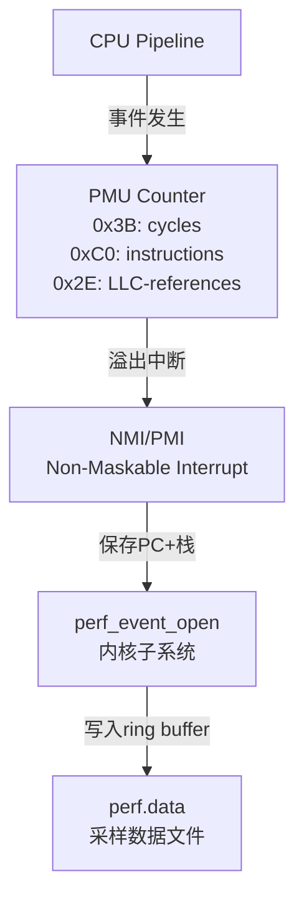
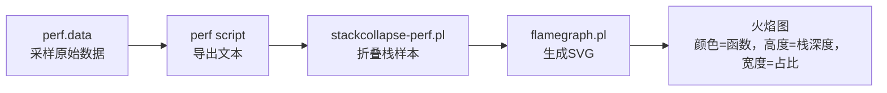

# perf事件采样与火焰图

> <span class="badge-i">**中级 (Intermediate)**</span> <span class="badge-e">**高级 (Expert)**</span>
> 深入理解PMU硬件事件原理，掌握 perf 工具的采样与报告，学会生成和阅读火焰图。

---

## PMU硬件事件原理

---

### <strong>Performance Monitoring Unit 的工作机制</strong>

<span class="badge-i">I</span><br>
<span class="red">PMU（Performance Monitoring Unit）</span>是CPU内置的硬件计数器，以极低开销记录微架构级事件。<br>



<span class="orange"><strong>1. 硬件计数器：</strong></span><br>
现代ARMv8 CPU通常配备 <span class="green">6-8个通用计数器</span> + <span class="green">1个固定周期计数器</span>。计数器溢出时触发PMI（Performance Monitoring Interrupt）。<br>

<span class="orange"><strong>2. 事件分类：</strong></span><br>

| 事件类型 | 示例 | 诊断价值 |
|---------|------|---------|
| 通用硬件 | cycles, instructions | CPI计算、指令效率 |
| 缓存 | L1-dcache-loads, LLC-load-misses | 缓存局部性、内存压力 |
| 分支 | branch-instructions, branch-misses | 预测失败惩罚 |
| 总线 | bus-cycles, bus-lock | 多核竞争、原子操作开销 |
| 软件 | context-switches, page-faults | 调度开销、内存映射 |

<span class="orange"><strong>3. 采样频率：</strong></span><br>
<span class="green">perf record -F 1000</span>表示每秒采样1000次。频率过高导致采样抖动（skid），频率过低丢失短事件。嵌入式一般保持1000-4000Hz。<br>

<span class="blue">关键洞察：PMU是CPU自带的"黑匣子"，不需要代码插桩即可观察微架构行为——这是perf低开销的根本原因。</span><br>

---

## perf record-report-stat

---

### <strong>perf 三板斧：统计、采样、报告</strong>

<span class="badge-i">I</span><br>
<span class="red">perf</span>是Linux内核自带的性能分析工具，直接对接PMU硬件，无需额外驱动。<br>

<span class="orange"><strong>1. perf stat：计数模式</strong></span><br>
统计整个程序运行期间的PMU事件总数，适合宏观评估。<br>

```bash
# 统计 CPI 和缓存行为
$ perf stat -e cycles,instructions,cache-references,cache-misses ./my_app

# 结果解读：
#   5,000,000,000  cycles              # 总周期数
#   2,000,000,000  instructions        # 总指令数
#   CPI = 2.5                         # 每指令2.5周期，偏高
#   50,000,000     cache-misses        # 缓存未命中
#   Miss Rate = 10%                   # 缓存未命中率
```

<span class="orange"><strong>2. perf record：采样模式</strong></span><br>
按频率采样并记录调用栈，生成 <span class="green">perf.data</span> 供后续分析。<br>

```bash
# 全系统采样，包含调用图，持续30秒
$ perf record -a -g -- sleep 30

# 针对特定进程采样
$ perf record -g -p $(pidof my_daemon) -- sleep 60

# 事件定向采样：只采样缓存未命中
$ perf record -e cache-misses -g ./my_app
```

<span class="orange"><strong>3. perf report：交互报告</strong></span><br>
解析 perf.data 并按热点排序。<br>

```bash
# 文本模式输出前20热点
$ perf report --stdio | head -n 40

# 按符号粒度聚合
$ perf report --sort=symbol,dso

# 只看用户态热点（过滤内核）
$ perf report --stdio --dsos=my_app
```

<span class="blue">关键洞察：perf stat 看宏观趋势，perf record 定位微观热点——两者结合形成从全局到局部的分析链路。</span><br>

---

## 调用栈回溯

---

### <strong>栈回溯的三种实现机制</strong>

<span class="badge-e">E</span><br>
<span class="red">调用栈回溯</span>是火焰图的基础数据来源，不同机制在精度、开销和兼容性上差异显著。<br>

| 机制 | 原理 | 精度 | 开销 | 兼容性 |
|------|------|------|------|--------|
| Frame Pointer | 编译时保留 %rbp 链 | 中 | 低（寄存器占用） | 需 -fno-omit-frame-pointer |
| DWARF unwind | 解析 .eh_frame 调试信息 | 高 | 中（内存访问） | 需编译保留调试信息 |
| LBR (Last Branch Record) | 硬件记录最近分支 | 极高 | 极低 | 需Intel/ARMv8.2+硬件支持 |
| ORC (x86_64) | 内核专用 unwind 表 | 高 | 低 | x86_64 内核态专用 |

```bash
# 使用 DWARF unwind（ARM默认，精度高但略慢）
$ perf record -g --call-graph=dwarf ./my_app

# 使用 Frame Pointer（x86_64常用，低开销）
$ perf record -g --call-graph=fp ./my_app

# 使用 LBR（硬件级，开销最小，深度受限）
$ perf record -g --call-graph=lbr ./my_app
```

<span class="blue">关键洞察：嵌入式ARM默认使用DWARF，编译时加 -fno-omit-frame-pointer 可切换到fp模式降低perf解析开销。</span><br>

---

## 火焰图生成与阅读

---

### <strong>从 perf.data 到可视化热点</strong>

<span class="badge-e">E</span><br>
<span class="red">火焰图（FlameGraph）</span>由 Brendan Gregg 发明，将调用栈采样数据转化为直观的可交互SVG。<br>



```bash
# 火焰图生成完整流程
# 1. 采样
$ perf record -F 1000 -g -- ./my_app

# 2. 导出
$ perf script > out.perf

# 3. 折叠（需 FlameGraph 仓库）
$ git clone https://github.com/brendangregg/FlameGraph.git
$ ./FlameGraph/stackcollapse-perf.pl out.perf > out.folded

# 4. 生成SVG
$ ./FlameGraph/flamegraph.pl out.folded > flamegraph.svg
```

<span class="orange"><strong>阅读火焰图：</strong></span><br>
- 每一层是一个函数，宽度 = 该函数在采样中的出现比例<br>
- 从下往上是调用方向：底层调用上层<br>
- 最宽且最高的" plateau "是优化首选目标<br>
- 相同颜色的函数属于同一源码文件或共享库<br>

<span class="blue">关键洞察：火焰图不是"时间轴"——宽度不代表时间先后，而是统计占比。一个窄但深的栈可能是偶发阻塞的元凶。</span><br>

---

## 行级热点定位

---

### <strong>perf annotate 与源码关联</strong>

<span class="badge-e">E</span><br>
<span class="red">行级热点定位</span>将采样精确到源代码行号，指导具体的优化位置。<br>

```bash
# 需要编译时保留调试信息
$ gcc -g -O2 -fno-omit-frame-pointer my_app.c -o my_app

# 采样并关联源码
$ perf record -g ./my_app
$ perf annotate --stdio --symbol=hot_function

# 输出示例（每行前是采样命中次数）：
#  15.23 :        if (unlikely(ptr == NULL)) {
#  32.45 :            process_data(ptr->buf, ptr->len);
#   8.12 :        }
```

<span class="blue">关键洞察：行级热点往往出现在循环体、缓存未对齐的内存访问或分支预测失败的代码路径上。</span><br>

---

## 交叉编译场景

---

### <strong>嵌入式 perf 的构建与使用</strong>

<span class="badge-e">E</span><br>
<span class="red">嵌入式 perf</span>需要在宿主机交叉编译，或从SDK获取预编译版本，分析时通常采用"目标采样+宿主机解析"的分离模式。<br>

```bash
# 宿主机交叉编译 perf（Linux源码树内）
$ cd linux-source/tools/perf
$ make CROSS_COMPILE=arm-linux-gnueabihf- ARCH=arm WERROR=0

# 目标设备采样
$ ./perf record -e cycles -g -- sleep 10
$ tar czvf perf.data.tar.gz perf.data

# 传输到宿主机解析（需要目标程序的符号和调试信息）
$ scp perf.data.tar.gz host:~/
$ scp my_app host:~/  # 带调试信息的版本
$ perf report --symfs=. --vmlinux=vmlinux
```

| 问题 | 解决方案 |
|------|---------|
| 目标内核无 CONFIG_PERF_EVENTS | 重新编译内核开启该选项 |
| 符号解析失败 | 确保宿主机有带调试信息的ELF文件 |
| 调用栈不完整 | 检查是否编译时保留了帧指针或DWARF信息 |
| PMU事件不可用 | 核对目标CPU的PMU事件编码 |

<span class="blue">关键洞察：交叉编译场景的perf使用难点不在工具本身，而在"符号一致性"——宿主机和目标机的ELF文件必须严格对应。</span><br>

---

## 历史演进：从 oprofile 到 perf 到 eBPF

---

### <strong>Linux采样工具的三代迭代</strong>

<span class="badge-e">E</span><br>

| 工具 | 年代 | 机制 | 现状 |
|------|------|------|------|
| oprofile | 2000s | 内核驱动 + 硬件计数器 | 已废弃，被perf取代 |
| perf | 2009+ | 内核原生 perf_event 子系统 | 标准工具，持续演进 |
| eBPF + perf | 2020s+ | 可编程内核态采样 | 前沿方向，灵活性最高 |

<span class="blue">演进逻辑：从"内核驱动+用户工具"到"内核原生子系统"再到"可编程内核态分析"，趋势是更深的集成和更强的灵活性。</span><br>

---

## 小结

---

### <strong>本章核心要点</strong>

| 知识点 | 关键内容 | 难度 |
|--------|---------|------|
| PMU原理 | 硬件计数器、溢出中断、PMI | I |
| perf三板斧 | stat计数、record采样、report报告 | I |
| 栈回溯机制 | fp/dwarf/lbr三种实现 | E |
| 火焰图 | 生成流程、阅读方法 | E |
| 交叉编译 | 采样与解析分离、符号一致性 | E |

---

### <strong>本章练习题</strong>

<span class="badge-e">E</span>

1. 为什么 perf 采样需要使用 -fno-omit-frame-pointer？如果不加这个编译选项，调用图会发生什么变化？
2. 火焰图的"宽度"和"高度"分别代表什么含义？为什么一个窄但深的栈可能值得优化？
3. 在ARM嵌入式交叉编译环境中，如何在宿主机正确解析目标设备采集的 perf.data？

---

> <span class="badge-e">E</span> <span class="blue">perf 是嵌入式性能分析的主力武器——理解PMU是理解perf的根基，掌握火焰图是perf价值的放大器。</span>
