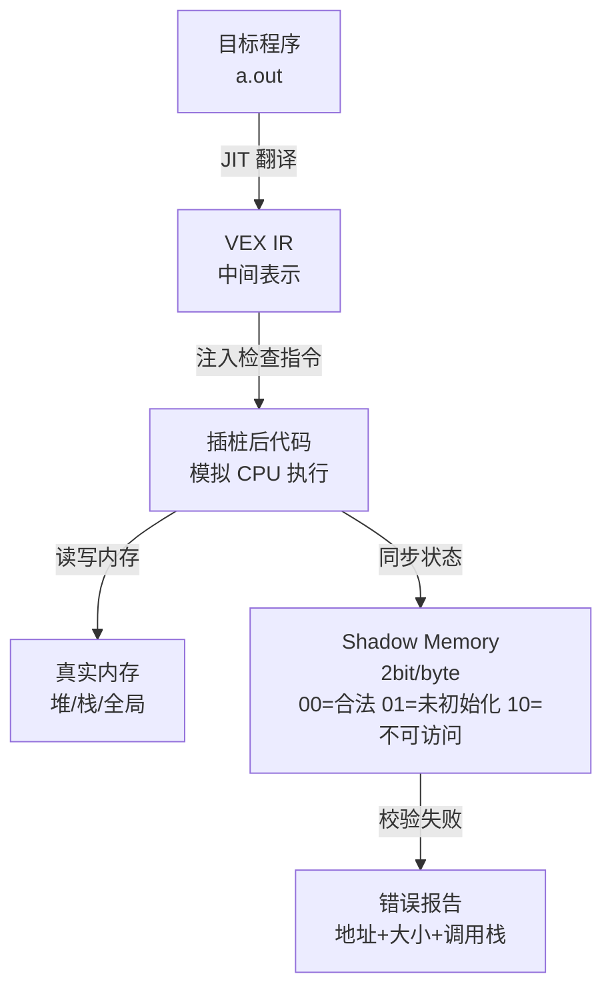

# 内存诊断与Valgrind

> <span class="badge-i">**中级 (Intermediate)**</span> <span class="badge-e">**高级 (Expert)**</span>
> 理解Valgrind的Shadow Memory模型，掌握内存泄漏检测、缓存分析和堆分析，了解嵌入式替代方案。

---

## Memcheck阴影内存模型

---

### <strong>Valgrind 的核心机制</strong>

<span class="badge-i">I</span><br>
<span class="red">Valgrind</span>不是传统调试器，而是动态二进制插桩框架，通过JIT将目标程序指令翻译成中间表示（VEX IR），在模拟执行的同时维护精确的内存状态。<br>



<span class="orange"><strong>1. VEX IR 翻译：</strong></span><br>
Valgrind将x86/ARM指令翻译成平台无关的VEX IR，然后在IR层面插入检查逻辑。<span class="green">这意味着Valgrind能检测任何指令级别的内存访问</span>，而不依赖源码级插桩。<br>

<span class="orange"><strong>2. Shadow Memory 状态：</strong></span><br>
每个真实字节对应2位阴影状态：<br>

| 阴影值 | 含义 | 触发行为 |
|--------|------|---------|
| 00 | 合法（已分配+已初始化） | 正常读写 |
| 01 | 未初始化 | 条件跳转/系统调用时报警 |
| 10 | 不可访问（未分配/已释放） | 任何访问报警 |

<span class="blue">关键洞察：Shadow Memory模型是Valgrind低开销检测内存错误的根基——2bit的元数据就能区分"合法/未初始化/不可访问"三种状态。</span><br>

---

## 泄漏检测与分类

---

### <strong>Memcheck 的泄漏报告解读</strong>

<span class="badge-i">I</span><br>
<span class="red">Memcheck</span>在程序退出时扫描堆，根据指针可达性将泄漏分为四类。<br>

```bash
# 完整泄漏检测命令
$ valgrind --tool=memcheck --leak-check=full --show-leak-kinds=all \
           --track-origins=yes ./my_program

# 输出示例：
# ==1234== LEAK SUMMARY:
# ==1234==    definitely lost: 1,024 bytes in 1 blocks
# ==1234==    indirectly lost: 512 bytes in 2 blocks
# ==1234==      possibly lost: 0 bytes in 0 blocks
# ==1234==    still reachable: 4,096 bytes in 1 blocks
```

| 泄漏类型 | 定义 | 严重程度 | 处理策略 |
|---------|------|---------|---------|
| definitely lost | 无任何指针指向该块 | 高 | 必须修复 |
| indirectly lost | 仅通过已丢失块可达 | 高 | 随definitely lost修复而消失 |
| possibly lost | 存在内部指针但无法确认 | 中 | 需人工确认是否为合法设计 |
| still reachable | 全局/静态指针仍持有引用 | 低 | 建议修复，程序退出时操作系统回收 |

<span class="orange"><strong>跟踪起源：</strong></span><br>
<span class="green">--track-origins=yes</span>追踪未初始化值的传播路径，精确定位"污染源头"。该选项使Memcheck速度再降30%，但诊断价值极高。<br>

<span class="blue">关键洞察："still reachable"在单次运行的程序中危害有限，但在长期运行的守护进程中会累积为实质泄漏。</span><br>

---

## Cachegrind缓存分析

---

### <strong>缓存行为模拟与优化指导</strong>

<span class="badge-e">E</span><br>
<span class="red">Cachegrind</span>模拟CPU缓存层级（L1-I、L1-D、L2、LLC），精确统计缓存命中/未命中行为，指导数据结构和访问模式的优化。<br>

```bash
# Cachegrind 分析
$ valgrind --tool=cachegrind ./my_program

# 生成报告
$ cg_annotate cachegrind.out.1234

# 输出示例：
# -- I1 cache:         32768 B, 64 B lines, 8-way
# -- D1 cache:         32768 B, 64 B lines, 8-way
# -- LL cache:        4194304 B, 64 B lines, 16-way
#
# Ir          I1mr   ILmr   Dr          D1mr   DLmr   Dw          D1mw   DLmw   file:function
# 100,000     1,000  50     50,000      5,000  200    10,000      500    50     main:process_matrix
```

<span class="orange"><strong>关键指标：</strong></span><br>

| 指标 | 全称 | 含义 | 优化方向 |
|------|------|------|---------|
| I1mr | L1 Instruction miss | L1指令缓存未命中 | 代码局部性，减少函数分散 |
| D1mr | L1 Data read miss | L1数据读未命中 | 数据预取、结构体对齐 |
| D1mw | L1 Data write miss | L1数据写未命中 | 写合并、减少伪共享 |
| LLmr | Last Level read miss | LLC读未命中 | 数据分块、缓存友好算法 |

```c
// 优化前：按列访问（缓存不友好）
// 文件路径：matrix_slow.c
for (int j = 0; j < N; j++)
    for (int i = 0; i < N; i++)
        sum += matrix[i][j];   // 跨行跳跃，缓存行利用率低

// 优化后：按行访问（缓存友好）
// 文件路径：matrix_fast.c
for (int i = 0; i < N; i++)
    for (int j = 0; j < N; j++)
        sum += matrix[i][j];   // 顺序访问，充分利用缓存行
```

<span class="blue">关键洞察：Cachegrind的模拟精度依赖于目标CPU的缓存参数配置，ARM嵌入式需要手动指定--I1、--D1、--LL参数以匹配真实硬件。</span><br>

---

## Massif堆分析

---

### <strong>堆内存使用的时间线追踪</strong>

<span class="badge-e">E</span><br>
<span class="red">Massif</span>记录程序运行期间堆内存分配的完整时间线，帮助识别峰值内存使用、分配热点和碎片模式。<br>

```bash
# Massif 堆分析
$ valgrind --tool=massif ./my_program

# 生成报告
$ ms_print massif.out.1234 > massif_report.txt

# 输出关键片段：
# --
# 0   1,024,000           0           0   1,024,000   0            0            0
# 1   1,536,000     512,000     512,000   1,536,000   0            0            0
#     -> 100.00% (512,000)  0x401234: allocate_buffer (buffer.c:45)
```

<span class="orange"><strong>Massif 报告结构：</strong></span><br>

| 列 | 含义 | 用途 |
|----|------|------|
| n | 快照编号 | 按时间排序 |
| time(B) | 已分配字节 | 当前堆大小 |
| total(B) | 累计分配 | 分配速率 |
| useful-heap | 有效堆 | 排除allocator开销 |
| extra-heap | allocator开销 | glibc malloc的元数据 |

<span class="blue">关键洞察：Massif的"峰值"数据对嵌入式至关重要——决定了系统需要预留的最小RAM。"extra-heap"过高意味着allocator开销大，可能需要替换为jemalloc或tcmalloc。</span><br>

---

## 嵌入式替代工具

---

### <strong>Valgrind 的嵌入式困境与替代方案</strong>

<span class="badge-e">E</span><br>
<span class="red">Valgrind在嵌入式中的核心障碍</span>是性能开销（10-30倍减速）和内存占用（Shadow Memory使RAM需求翻倍）。<br>

| 工具 | 功能 | 开销 | 适用场景 |
|------|------|------|---------|
| Valgrind/Memcheck | 内存错误全检测 | 10-30x | 开发机单元测试 |
| ASan (AddressSanitizer) | 内存错误检测 | 2-3x | 开发机/仿真器 |
| MSan (MemorySanitizer) | 未初始化检测 | 3-5x | 开发机/仿真器 |
| dmalloc | 调试malloc包装 | 1.5-2x | 目标设备轻量检测 |
| mtrace (glibc内置) | 泄漏追踪 | 极低 | 仅追踪malloc/free |
| 自定义allocator | 边界标记+统计 | 低 | 极端受限系统 |

```c
// 文件路径：custom_alloc.c
// 功能：嵌入式轻量内存调试allocator
// 行号：1-35
#include <stdlib.h>
#include <string.h>

#define MAGIC_HEAD 0xDEADBEEF
#define MAGIC_TAIL 0xCAFEBABE

typedef struct {
    unsigned int magic_head;
    size_t size;
    const char *file;
    int line;
} alloc_header_t;

void *dbg_malloc(size_t size, const char *file, int line) {
    size_t total = sizeof(alloc_header_t) + size + sizeof(unsigned int);
    alloc_header_t *h = malloc(total);
    h->magic_head = MAGIC_HEAD;
    h->size = size;
    h->file = file;
    h->line = line;
    unsigned int *tail = (unsigned int *)((char *)h + sizeof(alloc_header_t) + size);
    *tail = MAGIC_TAIL;
    return (char *)h + sizeof(alloc_header_t);
}

#define DEBUG_MALLOC(size) dbg_malloc(size, __FILE__, __LINE__)

// 检查边界是否被破坏
void dbg_check(void *ptr) {
    alloc_header_t *h = (alloc_header_t *)((char *)ptr - sizeof(alloc_header_t));
    unsigned int *tail = (unsigned int *)((char *)ptr + h->size);
    if (h->magic_head != MAGIC_HEAD || *tail != MAGIC_TAIL) {
        fprintf(stderr, "CORRUPTION at %s:%d (size=%zu)\n", h->file, h->line, h->size);
    }
}
```

<span class="blue">关键洞察：嵌入式内存调试的核心 trade-off 是"检测能力 vs 运行时开销"——极端受限系统需要自定义轻量方案，而非直接移植Valgrind。</span><br>

---

## 历史演进：从 Purify 到 Valgrind 到 Sanitizer

---

### <strong>内存调试工具的三十年演进</strong>

<span class="badge-e">E</span><br>

| 工具 | 年代 | 机制 | 定位 |
|------|------|------|------|
| Purify | 1990s | 链接时插桩 | 商业工具，已退出 |
| Valgrind | 2002+ | JIT动态翻译 | 开源标准，功能最全 |
| ASan/MSan | 2011+ | 编译时插桩 | 现代首选，开销更低 |
| HWASan | 2019+ | 硬件辅助标记 | ARM64前沿，接近零开销 |

<span class="blue">演进逻辑：从"链接时插桩"到"运行时翻译"再到"编译时插桩+硬件辅助"，趋势是更低的开销和更早的错误检测。</span><br>

---

## 小结

---

### <strong>本章核心要点</strong>

| 知识点 | 关键内容 | 难度 |
|--------|---------|------|
| Shadow Memory | 2bit/byte，三种状态 | I |
| 泄漏分类 | definitely/indirectly/possibly/reachable | I |
| Cachegrind | 缓存层级模拟，命中/未命中统计 | E |
| Massif | 堆时间线，峰值分析 | E |
| 嵌入式替代 | ASan、自定义allocator | E |

---

### <strong>本章练习题</strong>

<span class="badge-e">E</span>

1. 为什么Valgrind的Shadow Memory只需要2bit/byte就能区分三种状态？
2. "possibly lost"和"definitely lost"的本质区别是什么？为什么前者不一定是bug？
3. 在只有64MB RAM的ARM嵌入式设备上，如何设计一个低开销的内存泄漏检测方案？

---

> <span class="badge-e">E</span> <span class="blue">内存错误是嵌入式系统的沉默杀手——Valgrind在开发阶段消灭它们，自定义方案在运行阶段监测它们。</span>
