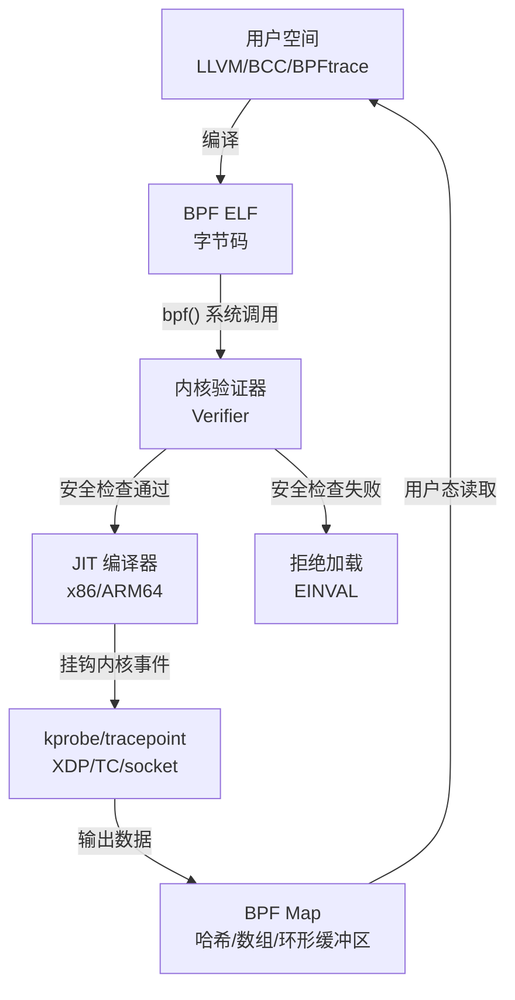
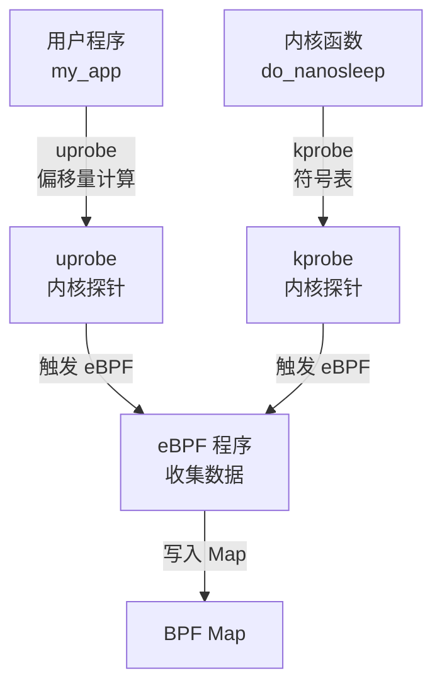

# eBPF与动态追踪

> <span class="badge-e">**高级 (Expert)**</span>
> 理解eBPF架构与安全模型，掌握BCC和BPFtrace工具，了解嵌入式eBPF的限制与实战方案。

---

## eBPF架构与验证器

---

### <strong>eBPF 的革命性定位</strong>

<span class="badge-e">E</span><br>
<span class="red">eBPF（Extended Berkeley Packet Filter）</span>是Linux内核的可编程接口，允许用户态程序安全地在内核态运行自定义逻辑，无需修改内核源码或加载内核模块。<br>



<span class="orange"><strong>1. 验证器安全模型：</strong></span><br>
内核验证器在加载eBPF程序时执行静态分析：<br>
- 禁止循环和无限递归（确保终止性）<br>
- 禁止空指针解引用（边界检查）<br>
- 禁止写入用户态指针（隔离性）<br>
- 限制指令数量（默认100万条）<br>

<span class="orange"><strong>2. JIT 编译：</strong></span><br>
验证通过的字节码被JIT编译为目标CPU原生指令，<span class="green">执行效率接近原生内核代码</span>。<br>

<span class="orange"><strong>3. BPF Map：</strong></span><br>
Map是内核与用户空间共享的数据结构，支持<span class="green">哈希表、数组、环形缓冲区、栈追踪</span>等多种类型。<br>

<span class="blue">关键洞察：eBPF的"安全可编程"是通过验证器实现的——它在加载时拒绝一切危险操作，而非运行时检查，因此运行开销极低。</span><br>

---

## BCC工具集

---

### <strong>BPF Compiler Collection 实战</strong>

<span class="badge-e">E</span><br>
<span class="red">BCC</span>是eBPF的高级前端框架，提供Python/C++ API和大量现成工具，隐藏了LLVM编译和Map管理的细节。<br>

```bash
# BCC 常用工具清单
$ ls /usr/share/bcc/tools/

# 文件系统分析
$ execsnoop          # 跟踪新进程创建
$ opensnoop          # 跟踪文件打开
$ ext4slower         # 跟踪慢于阈值的ext4操作

# CPU/调度分析
$ profile            # CPU采样火焰图
$ runqlat            # 调度队列延迟分布
$ offcputime         # 离CPU时间火焰图

# 内存分析
$ memleak            # 跟踪内存分配和泄漏
$ oomkill            # 跟踪OOM killer事件

# 网络分析
$ tcplife            # TCP连接生命周期
$ tcpretrans         # TCP重传追踪
```

```python
# 文件路径：hello_bcc.py
# 功能：BCC入门示例，跟踪clone系统调用
# 行号：1-15
from bcc import BPF

# eBPF C程序
prog = """
int hello(void *ctx) {
    bpf_trace_printk("Hello, eBPF!\\n");
    return 0;
}
"""

b = BPF(text=prog)
b.attach_kprobe(event="__x64_sys_clone", fn_name="hello")

print("Tracing... Ctrl-C to exit")
try:
    while True:
        b.trace_print()
except KeyboardInterrupt:
    pass
```

<span class="blue">关键洞察：BCC工具链在服务器环境中开箱即用，但在嵌入式中需要完整的Python+LLVM+内核头文件支持，部署成本较高。</span><br>

---

## BPFtrace语法

---

### <strong>类awk的eBPF脚本语言</strong>

<span class="badge-e">E</span><br>
<span class="red">BPFtrace</span>是为eBPF设计的高级脚本语言，语法类似awk/DTrace，单行命令即可实现复杂追踪逻辑。<br>

```bash
# 跟踪所有 openat 系统调用，打印进程名和文件名
$ bpftrace -e 'tracepoint:syscalls:sys_enter_openat { printf("%s: %s\n", comm, str(args->filename)); }'

# 统计每个进程的 CPU 时间片（按PID分组）
$ bpftrace -e 'tracepoint:sched:sched_switch { @[args->next_pid] = count(); }'

# 跟踪函数延迟分布（直方图）
$ bpftrace -e 'kprobe:do_nanosleep { @start[tid] = nsecs; }
               kretprobe:do_nanosleep /@start[tid]/ {
                   @latency = hist(nsecs - @start[tid]);
                   delete(@start[tid]);
               }'
```

| BPFtrace语法 | 含义 | 示例 |
|-------------|------|------|
| `kprobe:func` | 内核函数入口挂钩 | `kprobe:tcp_sendmsg` |
| `kretprobe:func` | 内核函数返回挂钩 | `kretprobe:tcp_sendmsg` |
| `tracepoint:subsys:event` | 内核追踪点 | `tracepoint:syscalls:sys_enter_open` |
| `uprobe:path:func` | 用户态函数入口 | `uprobe:/lib/libc.so.6:malloc` |
| `@name[key]` | 关联数组Map | `@[pid] = count()` |
| `@name = hist()` | 直方图Map | `@latency = hist(nsecs)` |
| `comm` / `pid` / `tid` | 内置变量 | 当前进程名/PID/TID |

<span class="blue">关键洞察：BPFtrace的"单行命令"能力使其成为嵌入式快速诊断的首选——比BCC更轻量，比perf更灵活。</span><br>

---

## 嵌入式eBPF限制

---

### <strong>资源受限环境下的eBPF部署</strong>

<span class="badge-e">E</span><br>
<span class="red">嵌入式eBPF</span>面临的限制不仅是资源，还包括内核版本、工具链和验证器行为的差异。<br>

| 限制维度 | 服务器环境 | 嵌入式环境 | 影响 |
|---------|----------|----------|------|
| 内核版本 | 5.10+ | 4.19/5.4 | 部分eBPF特性不可用（如CO-RE） |
| 内核配置 | CONFIG_BPF=y | 可能缺失 | eBPF子系统未编译 |
| LLVM/BCC | 完整安装 | 通常无 | 需交叉编译或libbpf方案 |
| 内存限制 | 无压力 | 32-256MB | Map大小和程序数量受限 |
| CPU | 多核高频 | 单核/双核低频 | JIT编译和运行时开销占比大 |

```bash
# 检查嵌入式内核是否支持eBPF
$ zgrep CONFIG_BPF /proc/config.gz
CONFIG_BPF=y
CONFIG_BPF_SYSCALL=y
CONFIG_BPF_EVENTS=y

# 检查可用eBPF程序类型
$ ls /sys/kernel/debug/tracing/ 2>/dev/null | head
```

<span class="blue">关键洞察：嵌入式eBPF的务实方案是"宿主机编译+目标机运行"——用libbpf+CO-RE（Compile Once Run Everywhere）避免目标机依赖LLVM。</span><br>

---

## uprobes-kprobes实战

---

### <strong>用户态与内核态的动态探针</strong>

<span class="badge-e">E</span><br>
<span class="red">uprobes</span>和<span class="red">kprobes</span>是eBPF的挂钩机制，分别用于用户态和内核态函数的动态插桩。<br>



```bash
# kprobe：跟踪内核函数 do_sys_open 的入参
$ bpftrace -e 'kprobe:do_sys_open { printf("PID=%d flags=%d\n", pid, arg2); }'

# uprobe：跟踪用户态 malloc 调用
$ bpftrace -e 'uprobe:/lib/libc.so.6:malloc { @calls[comm] = count(); }'

# uretprobe：跟踪函数返回结果
$ bpftrace -e 'uretprobe:/lib/libc.so.6:malloc { @[retval] = count(); }'
```

<span class="orange"><strong>1. uprobe 的偏移量计算：</strong></span><br>
uprobe需要知道函数在用户态ELF中的偏移地址。如果程序开启PIE（位置无关可执行文件），偏移量是运行时计算的。<br>

<span class="orange"><strong>2. 嵌入式 uprobes 的特殊性：</strong></span><br>
嵌入式系统常使用<span class="green">strip过的二进制</span>（去除符号表），导致uprobe无法通过函数名定位，需要<span class="green">手动计算偏移量</span>或使用<span class="green">未strip的调试版本</span>。<br>

```bash
# 手动计算函数偏移（strip过的二进制）
$ readelf -s my_app_unstripped | grep my_function
    123: 0000000000001a40    42 FUNC    GLOBAL DEFAULT   14 my_function

# 在目标机挂载uprobe（使用地址而非符号名）
$ bpftrace -e 'uprobe:/usr/bin/my_app:0x1a40 { printf("hit\n"); }'
```

<span class="blue">关键洞察：kprobes在内核中无条件可用，但uprobes需要符号信息或手动偏移——这是嵌入式用户态追踪的主要障碍。</span><br>

---

## 历史演进：从 BPF 到 eBPF

---

### <strong>内核可编程性的二十年演进</strong>

<span class="badge-e">E</span><br>

| 年代 | 里程碑 | 意义 |
|------|--------|------|
| 1992 | 经典BPF（cBPF） | tcpdump的包过滤引擎 |
| 2014 | eBPF 进入内核（3.18） | 从包过滤扩展到通用内核编程 |
| 2015 | kprobes + eBPF | 内核函数级动态追踪 |
| 2016 | BCC 发布 | eBPF的高级前端框架 |
| 2018 | BPFtrace 发布 | 类DTrace的脚本语言 |
| 2020 | libbpf + CO-RE | 编译一次到处运行 |
| 2022+ | eBPF 内核子系统成熟 | 网络、安全、可观测三大支柱 |

<span class="blue">演进逻辑：从"包过滤专用"到"通用内核编程"再到"标准化应用框架"，eBPF已成为Linux内核的"JavaScript"。</span><br>

---

## 小结

---

### <strong>本章核心要点</strong>

| 知识点 | 关键内容 | 难度 |
|--------|---------|------|
| 验证器 | 静态分析，禁止循环/空指针/越界 | E |
| BCC | Python前端，现成工具集 | E |
| BPFtrace | 类awk脚本，单行追踪 | E |
| 嵌入式限制 | 内核版本、内存、工具链 | E |
| uprobes/kprobes | 用户态/内核态动态探针 | E |

---

### <strong>本章练习题</strong>

<span class="badge-e">E</span>

1. eBPF验证器如何保证加载的程序不会导致内核崩溃？列举至少三条安全检查规则。
2. 为什么BCC在嵌入式中部署困难？libbpf+CO-RE方案如何解决这一问题？
3. 设计一个eBPF程序，追踪嵌入式设备中某个守护进程的malloc/free调用频率，输出到BPF Map。

---

> <span class="badge-e">E</span> <span class="blue">eBPF将内核从"黑箱"变为"可编程平台"——这是Linux观测性的范式转移，嵌入式领域正在快速跟进。</span>
