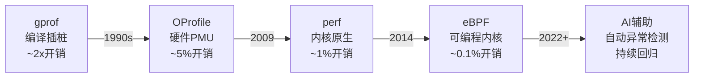
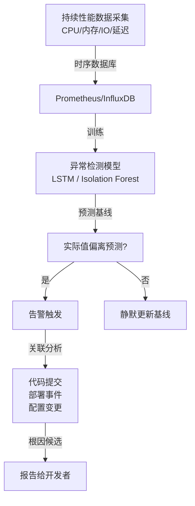

# 性能优化历史演进与前沿

> <span class="badge-e">**高级 (Expert)**</span> <span class="badge-m">**大师 (Master)**</span>
> 梳理性能分析技术从gprof到eBPF的演进脉络，了解AI辅助性能分析和持续性能回归的前沿方向。

---

## 从gprof到perf到eBPF

---

### <strong>三代性能分析范式的对比</strong>

<span class="badge-e">E</span><br>
<span class="red">性能分析工具</span>的演进遵循"更低开销、更强能力、更少侵入"的技术趋势。<br>



| 工具 | 年代 | 机制 | 开销 | 能力 | 局限性 |
|------|------|------|------|------|--------|
| gprof | 1980s | 编译插桩，函数级计数 | 2x | 调用图 | 函数粒度粗，无法分析内核 |
| OProfile | 2000s | 硬件PMU采样 | 5% | 系统级热点 | 已废弃 |
| perf | 2009+ | 内核perf_event子系统 | 1% | 系统级+调用栈 | 静态预设事件 |
| eBPF | 2014+ | 内核可编程探针 | 0.1% | 任意内核行为 | 验证器限制 |
| AI辅助 | 2020+ | 异常检测+根因分析 | 极低 | 预测性分析 | 数据依赖 |

<span class="blue">关键洞察：每一代工具的跃迁都对应底层技术突破——perf依赖内核perf_event子系统，eBPF依赖BPF虚拟机，AI辅助依赖大数据和模型训练。</span><br>

---

## 内核追踪技术演进

---

### <strong>从 printk 到 ftrace 到 eBPF 的追踪史</strong>

<span class="badge-e">E</span><br>

<span class="orange"><strong>1. printk时代（1991-2005）：</strong></span><br>
最原始的调试手段，<span class="green">printk("here\n")</span>散布在代码中。问题是输出刷屏、影响时序、生产环境无法使用。<br>

<span class="orange"><strong>2. ftrace时代（2008+）：</strong></span><br>
内核内置的动态追踪框架，通过<span class="green">function tracer</span>和<span class="green">tracepoint</span>实现低开销内核追踪，无需重启或重新编译。<br>

```bash
# ftrace 快速启用函数图追踪
$ echo function_graph > /sys/kernel/debug/tracing/current_tracer
$ echo __x64_sys_open > /sys/kernel/debug/tracing/set_graph_function
$ cat /sys/kernel/debug/tracing/trace
```

<span class="orange"><strong>3. eBPF时代（2014+）：</strong></span><br>
将追踪从"记录"升级为"可编程分析"——在数据离开内核前完成聚合、过滤和统计，大幅减少用户态数据搬运。<br>

| 阶段 | 机制 | 开销 | 灵活性 | 典型工具 |
|------|------|------|--------|---------|
| printk | 静态插桩 | 中（输出瓶颈） | 极低 | printk |
| ftrace | 动态插桩 | 低 | 中 | trace-cmd, kernelshark |
| eBPF | 可编程内核 | 极低 | 极高 | BCC, BPFtrace |

<span class="blue">关键洞察：追踪技术的演进本质是"把分析逻辑推入内核"——从内核输出原始事件到内核输出聚合结果，带宽和开销都大幅降低。</span><br>

---

## AI辅助性能分析

---

### <strong>机器学习驱动的异常检测与根因分析</strong>

<span class="badge-m">M</span><br>
<span class="red">AI辅助性能分析</span>利用历史性能数据训练模型，自动识别偏离基线的异常行为，并尝试关联到代码变更或环境变化。<br>



<span class="orange"><strong>1. 异常检测模型：</strong></span><br>
- <span class="green">Isolation Forest</span>：基于随机划分的无监督异常检测，适合多维度性能指标<br>
- <span class="green">LSTM</span>：长短期记忆网络学习性能指标的时间序列模式，预测未来值<br>
- <span class="green">Prophet</span>：Facebook开源的时序预测工具，自动处理季节性和趋势<br>

<span class="orange"><strong>2. 根因分析挑战：</strong></span><br>
性能退化的根因往往不在单一指标，而是多指标的关联模式。<span class="green">因果推断（Causal Inference）</span>和<span class="green">贝叶斯网络</span>是当前研究热点。<br>

<span class="blue">关键洞察：AI辅助分析目前最适合"检测已知模式中的异常"，对于从未见过的性能退化模式仍依赖人工根因分析。</span><br>

---

## 持续性能回归

---

### <strong>将性能测试纳入CI/CD流水线</strong>

<span class="badge-m">M</span><br>
<span class="red">持续性能回归</span>（Continuous Performance Regression）将性能基准测试嵌入每次代码提交，确保性能退化在第一时间被发现。<br>

| CI/CD阶段 | 性能测试类型 | 工具 | 阈值策略 |
|----------|-------------|------|---------|
| 提交前 | 单元级微基准 | Google Benchmark, Catch2 | 硬阈值（不可退化） |
| 合并前 | 集成级基准 | sysbench, fio | 相对阈值（<5%退化） |
| 部署前 | 端到端基准 | 自定义场景测试 | 绝对阈值（满足SLA） |
| 生产环境 | 持续采样 | eBPF + Prometheus | 动态基线（3-sigma） |

```yaml
# GitHub Actions 性能回归检查示例
# 文件路径：.github/workflows/perf.yml
name: Performance Regression
on: [pull_request]
jobs:
  benchmark:
    runs-on: ubuntu-latest
    steps:
      - uses: actions/checkout@v4
      - name: Build
        run: make
      - name: Run Benchmark
        run: ./run_benchmark.sh > benchmark.json
      - name: Compare with Main
        uses: benchmark-action/github-action-benchmark@v1
        with:
          tool: 'customSmallerIsBetter'
          output-file-path: benchmark.json
          alert-threshold: '150%'
          fail-on-alert: true
```

<span class="blue">关键洞察：性能回归的难点不在技术而在组织——需要定义可接受的退化阈值，并建立"性能退化即bug"的文化。</span><br>

---

## 硬件PMU+AI融合

---

### <strong>下一代性能分析的技术展望</strong>

<span class="badge-m">M</span><br>
<span class="red">硬件PMU与AI的融合</span>是性能分析的前沿方向——利用硬件计数器的细粒度数据训练模型，实现指令级精度的性能预测。<br>

<span class="orange"><strong>1. ARM PMU扩展：</strong></span><br>
ARMv8.2+引入<span class="green">Statistical Profiling Extension（SPE）</span>，以极低采样率记录每条指令的PC、缓存行为、分支结果，数据粒度远超传统perf。<br>

<span class="orange"><strong>2. Intel PT（Processor Trace）：</strong></span><br>
Intel PT以<span class="green">硬件压缩格式</span>记录完整的程序执行流，解码后可获得指令级时序信息，是分析微架构行为的终极工具。<br>

<span class="orange"><strong>3. AI模型在性能预测中的应用：</strong></span><br>
- 编译器优化决策：LLVM的<span class="green">MLGO</span>用强化学习替代传统启发式<br>
- 缓存预取：CPU内部的<span class="green">预取器</span>正在从规则驱动转向神经网络驱动<br>
- 功耗预测：基于PMU事件预测未来功耗，指导DVFS决策<br>

<span class="blue">关键洞察：PMU+AI的融合正在模糊"性能分析"和"性能优化"的边界——从"测量后优化"演变为"预测中优化"。</span><br>

---

## 小结

---

### <strong>本章核心要点</strong>

| 知识点 | 关键内容 | 难度 |
|--------|---------|------|
| 三代工具 | gprof→perf→eBPF，开销递减能力递增 | E |
| 内核追踪演进 | printk→ftrace→eBPF，从记录到可编程 | E |
| AI辅助分析 | 异常检测、根因分析、持续回归 | M |
| PMU+AI融合 | SPE、Intel PT、编译器ML优化 | M |

---

### <strong>本章练习题</strong>

<span class="badge-m">M</span>

1. 为什么eBPF的运行开销远低于ftrace？从数据路径和在内核中的处理逻辑角度分析。
2. 设计一个嵌入式设备的持续性能回归方案，需要哪些数据采集点和告警策略？
3. ARM SPE 与传统 perf 采样的本质区别是什么？SPE数据如何用于微架构优化指导？

---

> <span class="badge-m">M</span> <span class="blue">性能分析的未来是"预测先于测量"——当AI模型能准确预测代码变更的性能影响时，优化将从被动响应转向主动设计。</span>
