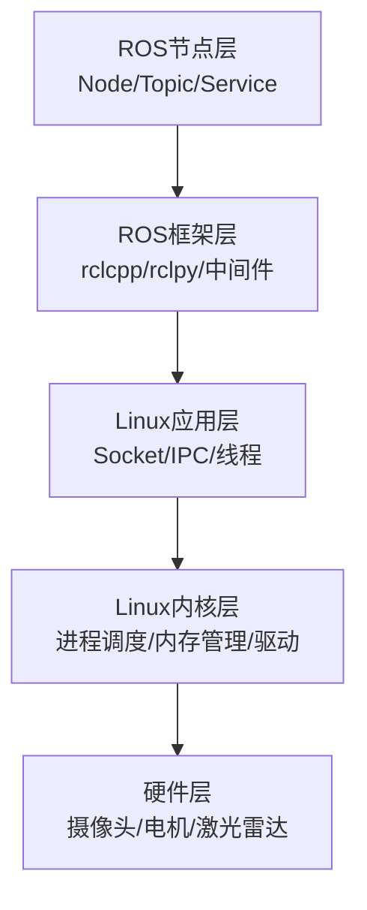

# ROS定位与嵌入式机器人生态

> <span class="badge-b">**入门 (Beginner)**</span> → <span class="badge-i">**中级 (Intermediate)**</span>
> 建立ROS在嵌入式Linux知识体系中的正确坐标，厘清"框架"与"操作系统"的本质区别。

---

## 核心定义与价值

---

### <strong>ROS不是OS是框架</strong>

<span class="badge-b">B</span><br>
<span class="red">ROS（Robot Operating System）</span>是一个极易被误解的命名——它并非独立的操作系统，而是运行在Linux应用层之上的分布式协同框架。<br>
操作系统的核心职责是管理硬件资源（CPU调度、内存分配、设备驱动），而ROS完全不具备这些底层能力。<br>

<span class="blue">关键洞察：Linux是"地基"，ROS是"机器人专用的上层建筑"。</span><br>

<span class="red">ROS节点</span>的本质是Linux进程，每个节点对应独立的PID，节点的创建与销毁完全依赖Linux的进程管理机制。<br>
ROS的通信、存储等操作最终调用Linux系统调用（Socket、文件I/O），硬件访问则依赖Linux已适配的驱动（V4L2摄像头驱动、CAN总线驱动等）。<br>



---

### <strong>分布式协同核心价值</strong>

<span class="badge-i">I</span><br>
<span class="red">分布式协同</span>是ROS的设计原点。机器人的工作逻辑天然需要多模块协作：激光雷达采集环境数据、摄像头识别障碍物、IMU提供姿态信息、算法模块做路径规划、电机执行运动指令——这些模块可能是独立硬件、独立进程，甚至分布在不同设备上。<br>

ROS的核心价值体现在两个层面：<br>

<span class="orange"><strong>1. 跨进程/跨设备通信：</strong></span><br>
无需开发者关注底层Socket或共享内存细节，ROS通过封装的话题（Topic）、服务（Service）等机制，让不同模块像"发消息"一样简单交互。<br>

<span class="orange"><strong>2. 模块解耦：</strong></span><br>
每个功能模块封装为独立的ROS节点，节点间通过标准化接口通信。替换激光雷达品牌时，只需修改雷达数据发布节点，路径规划节点无需改动。<br>

<span class="blue">本质逻辑：没有统一框架时，开发会陷入接口混乱、模块耦合、通信复杂三大困境；ROS通过解耦、通信封装、标准化接口，将"复杂的系统集成"转变为"高效的模块组合"。</span><br>

---

### <strong>Linux依赖关系</strong>

<span class="badge-i">I</span><br>
<span class="red">ROS与Linux的依赖关系</span>不是简单的"运行在系统上"，而是深度绑定Linux的内核机制、工具链与硬件适配能力。<br>

| 依赖维度 | Linux提供的底层能力 | ROS的上层封装 |
|----------|---------------------|---------------|
| 进程管理 | PID分配、fork/exec、信号机制 | Node生命周期管理 |
| IPC通信 | Socket（TCP/UDP）、共享内存 | Topic/Service/Action抽象 |
| 硬件驱动 | V4L2、CAN子系统、I2C/SPI驱动 | sensor_msgs、硬件适配层 |
| 包管理 | apt/deb包管理系统 | ros-humble-desktop等元包 |
| 网络栈 | TCP/IP协议栈、网卡驱动 | 分布式节点发现与数据路由 |

<span class="blue">调用链逻辑：ROS节点→Linux驱动→硬件，ROS所有核心功能的底层支撑最终都指向Linux内核。</span><br>

```c
// ROS 2节点本质是Linux进程
// 文件：rclcpp/src/rclcpp/executors/single_threaded_executor.cpp
// 行号：~80
void SingleThreadedExecutor::spin() {
    while (rclcpp::ok()) {           // 检查Linux信号SIGINT
        spin_once();                  // 从DDS层取消息
    }
}
```

**代码带读：** `rclcpp::ok()` 底层调用 `rcl_context_is_valid()`，检测Linux进程是否收到SIGINT/SIGTERM信号。节点的生命周期完全由Linux进程管理机制支配。

---

### <strong>ROS 1 vs ROS 2对比</strong>

<span class="badge-i">I</span><br>
<span class="red">ROS 2并非ROS 1的简单升级</span>，而是针对"分布式、实时性、嵌入式适配"三大痛点的重构设计。<br>
两者的核心差异源于定位不同：ROS 1聚焦桌面级单主机开发与教学，ROS 2瞄准工业级分布式部署与嵌入式场景落地。<br>

| 对比维度 | ROS 1 | ROS 2 | 嵌入式场景关键影响 |
|----------|-------|-------|--------------------|
| 核心架构 | 集中式（依赖Master节点） | 分布式（无Master，基于DDS） | ROS 1单点故障风险高，ROS 2支持多设备协同 |
| 实时性 | 软实时（依赖Linux原生IPC） | 准硬实时（DDS + PREEMPT_RT） | ROS 2适配电机控制等准实时场景 |
| 嵌入式适配 | 资源占用高，仅支持Linux | 资源可裁剪，支持Linux/QNX | ROS 2更适合资源受限嵌入式硬件 |
| 通信机制 | 自定义IPC（TCP/UDP/共享内存） | 标准化DDS（数据分发服务） | DDS支持QoS配置，适配复杂通信场景 |
| 生态兼容 | 功能包丰富（GMapping、MoveIt 1） | 生态逐步完善（Nav2、MoveIt 2） | 新项目优先ROS 2，旧项目通过桥接过渡 |

<span class="orange"><strong>1. 架构差异——集中式vs分布式：</strong></span><br>
ROS 1的Master节点是单点故障源，崩溃会导致整个系统瘫痪。ROS 2基于DDS的分布式发现机制，节点间直接协商通信参数，无需中央协调器。<br>

<span class="orange"><strong>2. 实时性差异——软实时vs准硬实时：</strong></span><br>
ROS 1基于Linux原生IPC，默认内核非实时，调度延迟不稳定。ROS 2通过DDS中间件优化通信延迟，结合PREEMPT_RT内核补丁可达微秒级延迟。<br>

<span class="orange"><strong>3. 选型建议：</strong></span><br>

| 场景类型 | 推荐选型 | 核心原因 |
|----------|----------|----------|
| 教学/原型验证 | ROS 1或ROS 2 | ROS 1部署简单；ROS 2可提前适配工程化 |
| 工业级机器人 | 强制ROS 2 | 分布式架构、实时性优化、可靠性高 |
| 资源受限设备 | 强制ROS 2 | 轻量化可裁剪，支持交叉编译 |
| 旧项目迁移 | ROS 2 + ros1_bridge | 桥接实现平滑过渡 |

<span class="blue">结论：嵌入式Linux场景下，ROS 2已成为事实标准，ROS 1仅保留教学与维护价值。</span><br>

---

## 技术教学与实战

---

### <strong>学习前置要求</strong>

<span class="badge-b">B</span><br>
<span class="red">学习ROS的嵌入式前置知识</span>需要Linux应用层、系统层与驱动层的基础支撑，避免学习断层。<br>

| 知识域 | 前置内容 | ROS中的直接应用 |
|--------|----------|-----------------|
| 应用层 | 多线程编程（pthread） | 理解Node的进程/线程模型 |
| 应用层 | 网络编程（Socket） | 理解DDS通信的底层逻辑 |
| 系统层 | 包管理（apt）、CMake/gcc | 功能包安装与节点编译 |
| 系统层 | systemd服务管理 | ROS节点自启动配置 |
| 驱动层 | V4L2、CAN总线驱动认知 | 硬件接入ROS的数据链路 |

<span class="blue">分层路径建议：新手先完成环境搭建+节点通信基础，中级结合IPC/网络编程学习分布式部署，高级聚焦实时性优化与交叉编译。</span><br>

---

### <strong>环境搭建</strong>

<span class="badge-i">I</span><br>
<span class="red">ROS 2 Humble + Ubuntu 22.04</span>是嵌入式Linux场景最稳定的搭配。Humble是ROS 2的长期支持（LTS）版本，维护期至2027年。<br>

<span class="orange"><strong>1. 系统准备：</strong></span><br>

```bash
# 更新系统包索引
$ sudo apt update && sudo apt upgrade -y

# 安装必要依赖
$ sudo apt install -y software-properties-common curl gnupg lsb-release

# 添加ROS 2官方GPG密钥
$ sudo curl -sSL https://raw.githubusercontent.com/ros/rosdistro/master/ros.key \
    -o /usr/share/keyrings/ros-archive-keyring.gpg

# 添加软件源
$ echo "deb [arch=$(dpkg --print-architecture) signed-by=/usr/share/keyrings/ros-archive-keyring.gpg] \
    http://packages.ros.org/ros2/ubuntu $(lsb_release -cs) main" \
    | sudo tee /etc/apt/sources.list.d/ros2.list > /dev/null
```

<span class="orange"><strong>2. 安装ROS 2核心：</strong></span><br>

```bash
# 更新索引并安装
$ sudo apt update
$ sudo apt install -y ros-humble-desktop ros-humble-ros-base

# 安装构建工具
$ sudo apt install -y python3-colcon-common-extensions python3-rosdep

# 初始化rosdep（依赖解析工具）
$ sudo rosdep init
$ rosdep update
```

<span class="orange"><strong>3. 环境配置：</strong></span><br>

```bash
# 将环境变量写入bashrc，每次终端自动生效
$ echo "source /opt/ros/humble/setup.bash" >> ~/.bashrc
$ source ~/.bashrc

# 验证安装——运行Talker-Listener示例
$ ros2 run demo_nodes_cpp talker     # 终端A：发布者
$ ros2 run demo_nodes_cpp listener   # 终端B：订阅者
```

<span class="blue">验证逻辑：talker节点发布字符串消息到 /chatter 话题，listener节点订阅并打印。若终端B持续输出消息，则ROS 2通信链路正常。</span><br>

---

## 历史演进与前沿

---

### <strong>从Shane到Humble的架构蜕变</strong>

<span class="badge-i">I</span><br>
<span class="red">ROS的历史演进</span>映射了机器人开发从学术研究到工业落地的全链路变迁。<br>

| 时间节点 | 版本/事件 | 核心意义 |
|----------|-----------|----------|
| 2007年 | ROS 1诞生（斯坦福/Willow Garage） | 首次提供标准化的机器人进程间通信框架 |
| 2010年 | ROS 1正式开源 | 学术界快速采纳，成为机器人研究的事实标准 |
| 2014年 | ROS 2设计启动（Open Robotics） | 针对嵌入式、实时性、分布式痛点的架构重构 |
| 2017年 | ROS 2 Ardent发布 | 首个正式版，引入DDS中间件 |
| 2020年 | ROS 2 Foxy Fitzroy（LTS） | 第一个长期支持版本，生态开始成熟 |
| 2022年 | ROS 2 Humble Hawksbill（LTS） | 当前嵌入式场景最稳定版本，维护至2027年 |
| 2024年 | ROS 2 Jazzy Jalisco | 最新版本，优化实时性与AI集成 |

<span class="blue">演进逻辑：ROS 1解决"有没有"的问题，ROS 2解决"好不好用"的问题——从桌面教学工具进化为工业级嵌入式框架。</span><br>

---

## 本章小结

| 知识点 | 核心结论 | 难度 |
|--------|----------|------|
| ROS定位 | 框架而非OS，依赖Linux全栈能力 | B |
| 核心价值 | 分布式协同 = 解耦 + 通信封装 + 标准化接口 | I |
| Linux依赖 | 进程/IPC/驱动/包管理/网络五维绑定 | I |
| ROS 1 vs 2 | 集中式vs分布式，教学vs工业 | I |
| 环境搭建 | Humble + Ubuntu 22.04，apt一键安装 | B→I |

---

## 课后练习

1. **推导题**：为什么ROS不能独立运行在裸机MCU上？从进程管理、内存分配、网络栈三个维度推导。
2. **对比题**：设计一个表格，对比ROS 1 Master节点与ROS 2 DDS发现机制在"单点故障"、"网络分区容错"、"启动时延"三个维度的差异。
3. **实操题**：在Ubuntu 22.04上完成ROS 2 Humble安装，运行talker-listener示例后，使用 `ros2 topic list` 和 `ros2 node list` 命令观察系统状态，截图记录输出。
