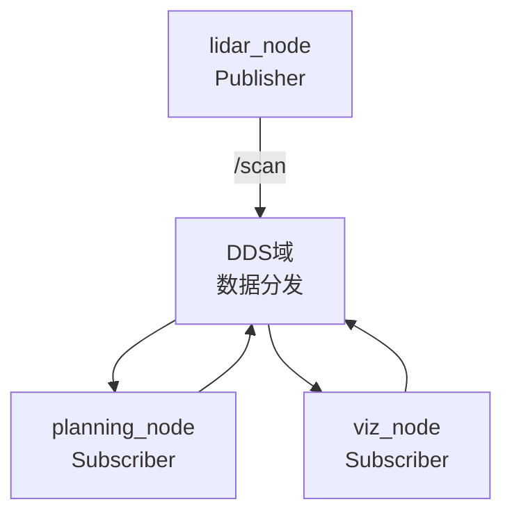
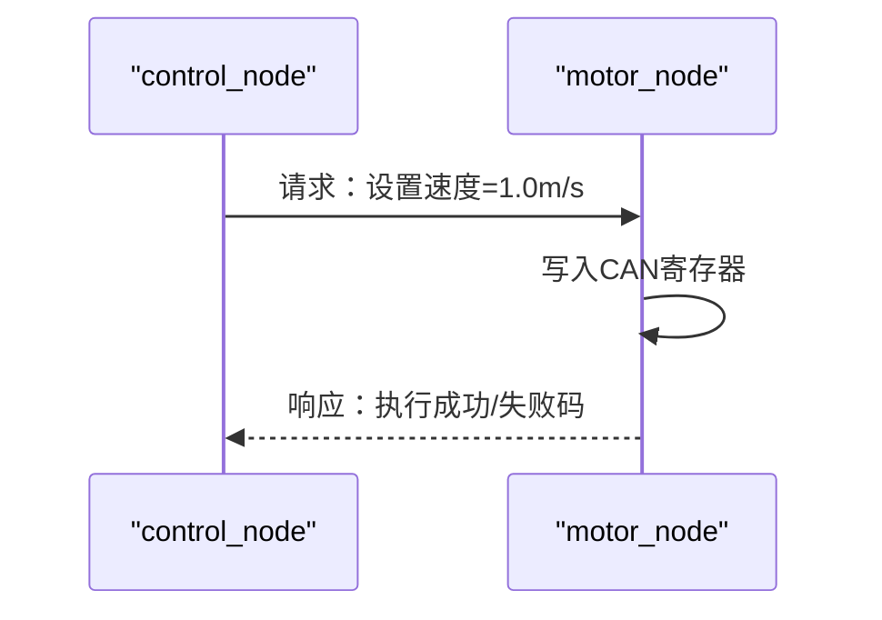
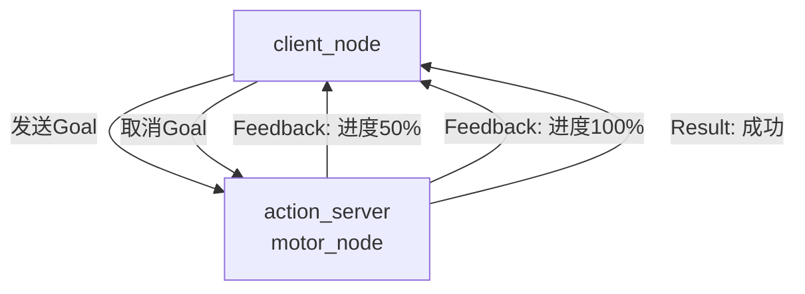

# ROS节点与通信机制

> <span class="badge-i">**中级 (Intermediate)**</span>
> 掌握ROS 2的节点模型与四种核心通信机制，理解每种机制的适用边界与底层差异。

---

## 核心定义与机制

---

### <strong>节点生命周期</strong>

<span class="badge-i">I</span><br>
<span class="red">ROS节点（Node）</span>是ROS计算图（Computation Graph）中最小的功能单元，每个节点对应Linux中一个独立的进程，拥有独立的PID、内存空间与线程调度上下文。<br>
节点的生命周期由 <span class="green">rclcpp::Node</span> 类管理，核心阶段包括：初始化→运行→销毁。<br>

```mermaid
stateDiagram-v2
    [*] --> 初始化 : rclcpp::init()
    初始化 --> 运行 : spin()
    运行 --> 运行 : 消息回调
    运行 --> 销毁 : rclcpp::shutdown()
    销毁 --> [*]
```

<span class="orange"><strong>1. 初始化阶段：</strong></span><br>
调用 <span class="green">rclcpp::init()</span> 解析命令行参数，创建全局上下文（Context），初始化DDS参与者。一个进程内只能有一个Context，但可创建多个Node实例。<br>

<span class="orange"><strong>2. 运行阶段：</strong></span><br>
调用 <span class="green">spin()</span> 进入事件循环，从DDS层取消息并分发到对应的回调函数。<span class="green">spin()</span> 是阻塞调用，直到收到SIGINT信号。<br>

<span class="orange"><strong>3. 销毁阶段：</strong></span><br>
调用 <span class="green">rclcpp::shutdown()</span> 释放DDS参与者、销毁Publisher/Subscription句柄，触发节点的析构函数。<br>

```cpp
// 文件：src/minimal_node.cpp
// 最小ROS 2节点示例
#include "rclcpp/rclcpp.hpp"

// 行号：5
class MinimalNode : public rclcpp::Node {
public:
    MinimalNode() : Node("minimal_node") {
        RCLCPP_INFO(this->get_logger(), "节点初始化完成");
    }
    // 析构时自动清理DDS资源
    ~MinimalNode() {
        RCLCPP_INFO(this->get_logger(), "节点销毁");
    }
};

// 行号：18
int main(int argc, char **argv) {
    rclcpp::init(argc, argv);              // 初始化阶段
    auto node = std::make_shared<MinimalNode>();
    rclcpp::spin(node);                     // 运行阶段（阻塞）
    rclcpp::shutdown();                     // 销毁阶段
    return 0;
}
```

**代码带读：** 第5行继承 <span class="green">rclcpp::Node</span>，构造函数中Node名称注册到DDS域。第18行 <span class="green">rclcpp::init()</span> 初始化全局Context，第20行 <span class="green">spin()</span> 启动事件循环。节点的生命周期严格对齐Linux进程生命周期。

<span class="blue">关键结论：节点是ROS计算图的原子单位，理解生命周期是编写可靠节点的前提——资源必须在析构中释放，否则DDS句柄泄漏会导致内存持续增长。</span><br>

---

### <strong>Topic发布订阅</strong>

<span class="badge-i">I</span><br>
<span class="red">话题（Topic）</span>是ROS中最基础的异步通信机制，采用发布-订阅（Pub-Sub）模型，支持多对多通信，无返回值，适合高频数据流场景。<br>
传感器数据（激光雷达点云、摄像头图像、IMU姿态）的传输是Topic的典型应用场景。<br>



<span class="orange"><strong>1. Publisher创建：</strong></span><br>

```cpp
// 文件：src/talker.cpp
// 行号：10
auto publisher = node->create_publisher<sensor_msgs::msg::LaserScan>(
    "/scan",                    // 话题名称
    rclcpp::QoS(10).reliable()  // QoS：队列深度10，可靠传输
);
```

**代码带读：** <span class="green">create_publisher</span> 的第二个参数是QoS配置。此处 <span class="green">rclcpp::QoS(10)</span> 设置历史缓存队列深度为10，<span class="green">.reliable()</span> 启用TCP-like可靠传输。QoS决定了DDS层的通信行为，后文深入解析。
<br>

<span class="orange"><strong>2. Subscriber创建：</strong></span><br>

```cpp
// 文件：src/listener.cpp
// 行号：12
auto subscription = node->create_subscription<sensor_msgs::msg::LaserScan>(
    "/scan",
    rclcpp::QoS(10).best_effort(),  // 传感器场景优先best_effort
    &callback_function             // 消息到达时触发
);
```

**代码带读：** 传感器数据流通常采用 <span class="green">best_effort()</span> QoS——丢包不重传，避免缓存旧数据造成延迟累积。回调函数在 <span class="green">spin()</span> 的线程中被调用。<br>

<span class="orange"><strong>3. 话题的通信特性：</strong></span><br>

| 特性 | Topic行为 | 适用场景 |
|------|-----------|----------|
| 方向 | 单向（发布→订阅） | 传感器数据广播 |
| 耦合 | 发布者与订阅者解耦 | 动态增删节点 |
| 实时性 | 取决于QoS与网络 | 高频流数据 |
| 持久化 | 无（除非配置Durability） | 实时显示 |

<span class="blue">核心边界：Topic适合"持续流式数据"，不适合"请求-响应"或"需要确认结果"的场景——后者应使用Service或Action。</span><br>

---

### <strong>Service请求响应</strong>

<span class="badge-i">I</span><br>
<span class="red">服务（Service）</span>采用同步的请求-响应（Request-Response）模型，一对一通信，客户端发送请求后阻塞等待服务端返回结果。<br>
适合电机状态查询、参数设置、即时计算等"需要确认结果"的短交互场景。<br>



<span class="orange"><strong>1. Service定义文件：</strong></span><br>

```srv
# 文件：srv/SetMotorSpeed.srv
# 服务的数据格式定义
float64 target_speed        # 请求：目标速度
---
bool success                # 响应：是否执行成功
string message              # 响应：状态描述
```

**代码带读：** <span class="green">---</span> 分隔线上方是请求字段，下方是响应字段。编译时 <span class="green">rosidl</span> 自动生成C++结构体与序列化代码。<br>

<span class="orange"><strong>2. 服务端实现：</strong></span><br>

```cpp
// 文件：src/motor_service.cpp
// 行号：15
auto service = node->create_service<my_pkg::srv::SetMotorSpeed>(
    "/set_motor_speed",
    [](const std::shared_ptr<my_pkg::srv::SetMotorSpeed::Request> request,
       std::shared_ptr<my_pkg::srv::SetMotorSpeed::Response> response) {
        // 调用Linux CAN驱动写入速度
        int ret = can_write_speed(request->target_speed);
        response->success = (ret == 0);
        response->message = (ret == 0) ? "OK" : "CAN bus error";
    }
);
```

**代码带读：** 回调函数内直接调用底层Linux CAN接口 <span class="green">can_write_speed()</span>。服务回调在 <span class="green">spin()</span> 线程中执行，若耗时过长会阻塞其他回调——长时任务应改用Action。<br>

<span class="orange"><strong>3. 客户端实现：</strong></span><br>

```cpp
// 文件：src/control_client.cpp
// 行号：20
auto client = node->create_client<my_pkg::srv::SetMotorSpeed>("/set_motor_speed");
auto request = std::make_shared<my_pkg::srv::SetMotorSpeed::Request>();
request->target_speed = 1.0;

// 行号：25
auto future = client->async_send_request(request);
// 阻塞等待响应（可设置超时）
auto result = future.get();
RCLCPP_INFO(node->get_logger(), "结果：%s", result->message.c_str());
```

**代码带读：** <span class="green">async_send_request()</span> 返回 <span class="green">std::future</span>，<span class="green">future.get()</span> 阻塞等待服务端响应。在嵌入式场景中，超时机制必须配置，防止服务节点离线时无限阻塞。<br>

<span class="blue">关键边界：Service是同步阻塞模型，服务端回调执行期间不能处理新请求——高并发场景需改用异步Service或多线程Executor。</span><br>

---

### <strong>Action异步任务</strong>

<span class="badge-i">I</span><br>
<span class="red">动作（Action）</span>是ROS 2专为"长时任务"设计的通信机制，本质上是Topic+Service的组合：客户端发送目标（Goal），服务端持续反馈进度（Feedback），最终返回结果（Result），且支持任务取消。<br>
典型场景：机器人导航到目标位置、机械臂执行抓取轨迹、底盘旋转指定角度。<br>



<span class="orange"><strong>1. Action定义文件：</strong></span><br>

```action
# 文件：action/NavigateToPose.action
# 目标
geometry_msgs/Pose target_pose
---
# 结果
bool success
string message
---
# 反馈
float32 distance_remaining
float32 percent_complete
```

**代码带读：** Action定义文件包含三个部分：Goal（目标）、Result（最终结果）、Feedback（过程反馈），由 <span class="green">---</span> 分隔。<span class="green">rosidl</span> 编译后生成三组Topic（Goal、Result、Feedback）+ 一组Service（Cancel）。<br>

<span class="orange"><strong>2. Action服务端核心逻辑：</strong></span><br>

```cpp
// 文件：src/navigation_action_server.cpp
// 行号：30
class NavigateActionServer : public rclcpp::Node {
    rclcpp_action::Server<my_pkg::action::NavigateToPose>::SharedPtr action_server_;

    rclcpp_action::GoalResponse handle_goal(
        const rclcpp_action::GoalUUID & uuid,
        std::shared_ptr<const my_pkg::action::NavigateToPose::Goal> goal) {
        // 行号：36
        RCLCPP_INFO(this->get_logger(), "收到导航目标");
        return rclcpp_action::GoalResponse::ACCEPT_AND_EXECUTE;
    }

    rclcpp_action::CancelResponse handle_cancel(
        const std::shared_ptr<GoalHandle> goal_handle) {
        // 行号：42
        RCLCPP_INFO(this->get_logger(), "取消导航任务");
        return rclcpp_action::CancelResponse::ACCEPT;
    }

    void handle_accepted(const std::shared_ptr<GoalHandle> goal_handle) {
        // 行号：47
        std::thread{[this, goal_handle]() {
            auto feedback = std::make_shared<my_pkg::action::NavigateToPose::Feedback>();
            auto result = std::make_shared<my_pkg::action::NavigateToPose::Result>();
            // 模拟导航过程，持续发布Feedback
            for (int i = 0; i <= 10; ++i) {
                feedback->percent_complete = i * 10.0;
                goal_handle->publish_feedback(feedback);
                std::this_thread::sleep_for(std::chrono::milliseconds(500));
            }
            result->success = true;
            goal_handle->succeed(result);
        }}.detach();
    }
};
```

**代码带读：** 第47行将任务执行放到独立线程中，避免阻塞 <span class="green">spin()</span> 主线程。第56行 <span class="green">publish_feedback()</span> 通过Topic持续发布进度，第60行 <span class="green">succeed()</span> 发送最终结果。Action的Cancel机制由DDS层的Cancel服务处理。<br>

<span class="blue">为什么需要Action而非Service+Topic手动组合？因为Action内置了目标ID追踪、取消语义、状态机管理——手动组合容易在"多客户端并发请求"时丢失状态同步，Action将这些复杂性封装到框架中。</span><br>

---

### <strong>数据格式Msg-Srv-Action</strong>

<span class="badge-i">I</span><br>
<span class="red">ROS接口定义语言（IDL）</span>为所有模块定义统一的"通信语言"，解决传感器输出二进制流、算法需要结构化数据、执行器需要特定指令的格式冲突问题。<br>
三种数据格式对应三种通信场景：<br>

| 格式类型 | 文件后缀 | 通信机制 | 数据流向 |
|----------|----------|----------|----------|
| Message | .msg | Topic | 单向发布 |
| Service | .srv | Service | 请求-响应 |
| Action | .action | Action | 目标-反馈-结果 |

<span class="orange"><strong>1. Message定义示例：</strong></span><br>

```msg
# 文件：msg/EnvData.msg
# 环境传感器数据的标准化格式
float32 temperature       # 温度，单位摄氏度
float32 humidity          # 湿度，单位百分比
builtin_interfaces/Time stamp  # 时间戳，用于同步
```

<span class="orange"><strong>2. 代码生成流程：</strong></span><br>

```bash
# CMakeLists.txt中配置rosidl生成
# 文件：CMakeLists.txt
rosidl_generate_interfaces(${PROJECT_NAME}
  "msg/EnvData.msg"
  "srv/SetMotorSpeed.srv"
  "action/NavigateToPose.action"
)
```

**代码带读：** <span class="green">rosidl_generate_interfaces</span> 宏调用 <span class="green">rosidl</span> 代码生成器，将.msg/.srv/.action 转换为C++头文件、Python模块与DDS序列化代码。编译后，其他功能包可通过 `#include "my_pkg/msg/env_data.hpp"` 引用。<br>

<span class="orange"><strong>3. 标准消息类型复用：</strong></span><br>
ROS提供大量标准消息包（<span class="green">std_msgs</span>、<span class="green">sensor_msgs</span>、<span class="green">geometry_msgs</span>等），嵌入式开发应优先复用标准类型而非自定义：<br>

| 标准包 | 典型消息类型 | 适用硬件 |
|--------|-------------|----------|
| sensor_msgs | LaserScan、Image、Imu | 激光雷达、摄像头、IMU |
| geometry_msgs | Twist、Pose、Point | 速度指令、位姿、坐标 |
| std_msgs | String、Float32、Bool | 通用数据包装 |

<span class="blue">设计原则：自定义消息仅在标准类型无法表达语义时创建。复用标准消息的最大好处是RViz、rosbag等工具链原生支持解析与可视化。</span><br>

---

### <strong>参数服务器</strong>

<span class="badge-i">I</span><br>
<span class="red">参数服务器（Parameter Server）</span>是ROS 2中每个节点自带的键值对存储，用于运行时配置（如PID参数、传感器标定值、调试开关），替代硬编码常量。<br>
ROS 2的参数是节点私有的（不同于ROS 1的全局参数服务器），通过 <span class="green">rclcpp::Node</span> 的 <span class="green">decare_parameter()</span> 和 <span class="green">get_parameter()</span> 管理。<br>

<span class="orange"><strong>1. 声明与读取参数：</strong></span><br>

```cpp
// 文件：src/param_node.cpp
// 行号：10
class ParamNode : public rclcpp::Node {
public:
    ParamNode() : Node("param_node") {
        // 声明参数并指定默认值
        this->declare_parameter<float>("kp", 0.5);    // PID比例系数
        this->declare_parameter<float>("ki", 0.01);   // PID积分系数
        this->declare_parameter<float>("kd", 0.1);   // PID微分系数

        // 行号：17
        float kp = this->get_parameter("kp").as_double();
        RCLCPP_INFO(this->get_logger(), "当前kp=%f", kp);
    }
};
```

**代码带读：** 第10行 <span class="green">declare_parameter()</span> 注册参数名与类型到DDS参数服务，第17行 <span class="green">get_parameter()</span> 读取当前值。参数支持动态更新——外部通过 <span class="green">ros2 param set /param_node kp 0.8</span> 实时修改。<br>

<span class="orange"><strong>2. 参数变更回调：</strong></span><br>

```cpp
// 文件：src/param_callback_node.cpp
// 行号：22
auto param_sub = this->add_on_set_parameters_callback(
    [this](const std::vector<rclcpp::Parameter> &params) {
        for (const auto &param : params) {
            if (param.get_name() == "kp") {
                // 实时更新PID控制器参数
                pid_controller_.set_kp(param.as_double());
                RCLCPP_INFO(this->get_logger(), "kp已更新为%f", param.as_double());
            }
        }
        return rcl_interfaces::msg::SetParametersResult{true};
    }
);
```

**代码带读：** 第22行注册参数变更回调函数，当外部通过CLI或GUI修改参数时，回调被触发。返回 <span class="green">SetParametersResult{true}</span> 表示接受变更，返回false则拒绝。<br>

<span class="blue">参数服务器的核心价值：将运行时配置与编译时逻辑分离。嵌入式调试时，无需重新编译即可调整PID系数、传感器阈值等关键参数，缩短调参周期。</span><br>

---

## 历史演进与前沿

---

### <strong>通信机制的设计演进</strong>

<span class="badge-i">I</span><br>
<span class="red">ROS通信机制</span>的演进反映了机器人应用从简单演示到复杂系统的需求变化。<br>

| 阶段 | 时间 | 关键变化 |
|------|------|----------|
| ROS 1早期 | 2007-2010 | 仅Topic，无Service/Action |
| ROS 1成熟 | 2010-2014 | 引入Service、Actionlib、参数服务器 |
| ROS 2设计 | 2014-2017 | Action标准化为IDL，取消全局参数服务器 |
| ROS 2成熟 | 2017至今 | DDS替代自定义IPC，QoS成为核心概念 |

<span class="blue">演进逻辑：通信机制从"够用就行"进化为"场景精确匹配"——Topic/Service/Action各司其职，QoS细化控制，确保嵌入式场景的可靠性与实时性。</span><br>

---

## 本章小结

| 知识点 | 核心结论 | 适用场景 |
|--------|----------|----------|
| 节点生命周期 | init→spin→shutdown，对齐Linux进程 | 所有节点必备 |
| Topic | 异步Pub-Sub，多对多，无返回值 | 传感器数据流 |
| Service | 同步Request-Response，一对一 | 状态查询/参数设置 |
| Action | 目标+反馈+结果，支持取消 | 导航/抓取等长时任务 |
| Msg/Srv/Action | rosidl自动生成序列化代码 | 标准化通信格式 |
| 参数服务器 | 节点私有键值对，支持动态更新 | 运行时调参 |

---

## 课后练习

1. **推导题**：为什么传感器数据流（激光雷达/摄像头）必须用Topic而非Service？从"数据频率"、"耦合度"、"实时性"三个维度推导。
2. **设计题**：设计一个"电池管理"模块，需要支持：电量查询（即时响应）、低电量预警（持续广播）、充电控制（长时任务带进度）。请用表格说明为每个功能选择Topic/Service/Action的理由。
3. **实操题**：编写一个ROS 2节点，声明3个参数（`max_speed`、`sensor_rate`、`debug_mode`），实现参数变更回调打印日志，并用 `ros2 param list` 和 `ros2 param set` 命令验证动态更新功能。
