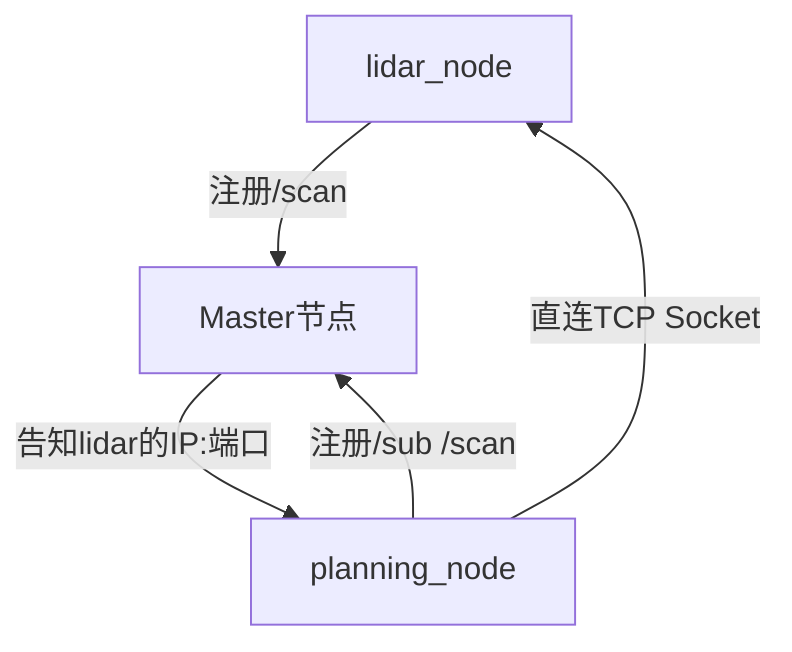
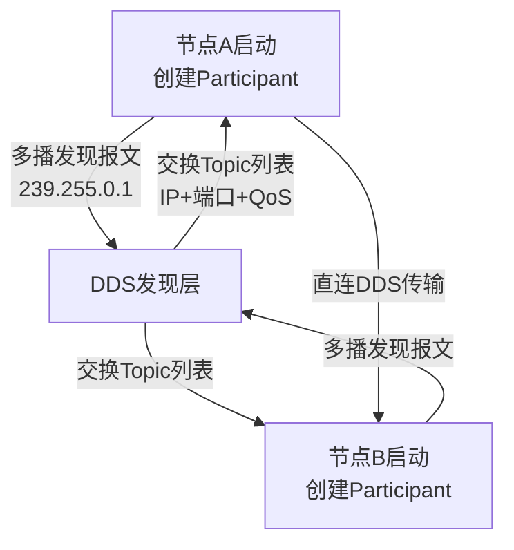

# ROS通信底层与DDS原理

> <span class="badge-i">**中级 (Intermediate)**</span> → <span class="badge-e">**高级 (Expert)**</span>
> 穿透ROS 2的通信抽象层，理解DDS中间件的参与者模型、发现机制与QoS策略在嵌入式场景中的配置逻辑。

---

## 核心定义与机制

---

### <strong>ROS 1集中式Master</strong>

<span class="badge-i">I</span><br>
<span class="red">ROS 1的集中式通信</span>依赖单一Master节点作为"中央注册表"，所有节点启动后必须向Master注册自身提供的话题与服务地址，节点间通信前需通过Master查询目标节点的网络地址。<br>



<span class="orange"><strong>1. Master的核心职责：</strong></span><br>
- 维护话题注册表（哪个节点发布哪个Topic）<br>
- 维护服务注册表（哪个节点提供哪个Service）<br>
- 协调节点间的地址交换（IP+端口号）<br>

<span class="orange"><strong>2. 嵌入式场景的三大痛点：</strong></span><br>

| 痛点 | 根因 | 后果 |
|------|------|------|
| 单点故障 | Master崩溃导致注册表丢失 | 全系统通信瘫痪 |
| 网络分区 | 嵌入式WiFi/以太网不稳定 | 节点离线后无法重新发现 |
| 启动时序 | 节点必须先启动Master | 分布式设备启动顺序强耦合 |

<span class="blue">本质局限：集中式架构的可靠性上限等于Master节点的可靠性。嵌入式场景的网络抖动、电源波动、资源受限都使Master成为系统性风险源。</span><br>

---

### <strong>ROS 2分布式DDS</strong>

<span class="badge-e">E</span><br>
<span class="red">ROS 2的分布式通信</span>基于DDS（Data Distribution Service，数据分发服务）标准，彻底废除Master节点，采用"完全去中心化"的对等发现模型。<br>
DDS是OMG（对象管理组织）发布的工业级通信中间件标准，广泛应用于航空、汽车、国防等对实时性与可靠性要求极高的领域。<br>

<span class="orange"><strong>1. DDS的核心抽象：</strong></span><br>

| DDS概念 | ROS 2映射 | 语义解释 |
|---------|-----------|----------|
| Domain | ROS_DOMAIN_ID | 逻辑隔离域，同域节点才可通信 |
| Participant | rclcpp::Context | DDS进程级实体，管理所有通信端点 |
| Topic | ros2 topic | 发布-订阅的数据通道 |
| Publisher | rclcpp::Publisher | 数据生产者 |
| Subscriber | rclcpp::Subscription | 数据消费者 |
| DataWriter | 内部封装 | 负责数据序列化与传输 |
| DataReader | 内部封装 | 负责数据反序列化与接收 |

<span class="orange"><strong>2. 去中心化发现流程：</strong></span><br>



**流程说明：** 节点启动时，DDS层通过UDP多播（默认地址239.255.0.1）发送发现报文，广播自身支持的Topic列表与通信地址。其他节点收到后建立本地拓扑缓存，后续数据直接通过单播UDP/TCP传输，无需中央协调器。<br>

<span class="blue">关键跃迁：从"查询-注册"模式变为"广播-缓存"模式。每个节点持有完整的通信拓扑副本，任意节点离线不影响其他节点的继续通信——这是分布式系统从"可用性"到"分区容错性"的本质提升。</span><br>

---

### <strong>DDS参与者与发现</strong>

<span class="badge-e">E</span><br>
<span class="red">DDS参与者（Participant）</span>是DDS进程级实体，每个ROS 2进程对应一个Participant，Participant内部包含Publisher、Subscriber、Topic等通信端点的管理器。<br>
DDS发现协议分为"简单发现"（Simple Discovery）与"静态发现"（Static Discovery）两种模式，嵌入式场景需根据网络条件选择。<br>

<span class="orange"><strong>1. 简单发现协议（SDP）：</strong></span><br>
默认模式，依赖UDP多播自动发现。流程分为两个阶段：<br>
- **Participant Discovery Phase（PDP）**：交换Participant的GUID、IP、端口等元信息<br>
- **Endpoint Discovery Phase（EDP）**：交换Topic名称、数据类型、QoS配置等端点信息<br>

```c
// 文件：rmw_fastrtps_cpp/src/participant.cpp（Fast DDS实现）
// 行号：~120
DomainParticipantQos participant_qos;
participant_qos.wire_protocol().builtin.discovery_config.discoveryProtocol =
    DiscoveryProtocol_t::SIMPLE;              // 启用简单发现
participant_qos.wire_protocol().builtin.discovery_config.use_SIMPLE_EndpointDiscoveryProtocol = true;
participant_qos.wire_protocol().builtin.discovery_config.m_simpleEDP.use_PublicationWriterANDSubscriptionReader = true;
```

**代码带读：** Fast DDS是ROS 2 Humble的默认DDS实现（Ubuntu 22.04）。第120行配置Participant使用简单发现协议，第122行启用EDP的PublicationWriter与SubscriptionReader通道——这是DDS发现阶段交换Topic信息的核心通道。<br>

<span class="orange"><strong>2. 静态发现（Static Discovery）：</strong></span><br>
<span class="green">**[M]**</span> 在嵌入式场景（如无法使用多播的封闭网络、MCU资源受限），静态发现通过预配置的XML文件描述所有Topic与端点信息，跳过广播发现阶段，降低启动时延与网络负载。<br>

```xml
<!-- 文件：static_discovery.xml -->
<!-- 静态发现配置示例 -->
<staticdiscovery>
    <participant profile_name="robot_participant">
        <rtps>
            <builtin>
                <discovery_config>
                    <EDP>STATIC</EDP>            <!-- 关闭动态EDP -->
                </discovery_config>
            </builtin>
        </rtps>
    </participant>
</staticdiscovery>
```

<span class="blue">为什么需要静态发现？嵌入式机器人的CAN总线网络或某些工业以太网交换机默认关闭多播；静态发现通过预配置消除多播依赖，同时减少Participant的内存占用（无需维护动态发现缓存）。</span><br>

<span class="orange"><strong>3. ROS_DOMAIN_ID隔离：</strong></span><br>

```bash
# 终端A：在域ID=5运行节点
$ export ROS_DOMAIN_ID=5
$ ros2 run my_pkg talker

# 终端B：同域ID才可通信
$ export ROS_DOMAIN_ID=5
$ ros2 run my_pkg listener
```

**说明：** 不同ROS_DOMAIN_ID的节点处于不同的DDS域，完全隔离。嵌入式场景常用此特性在同一物理网络中隔离多台机器人（如域ID=1分配给AGV-A，域ID=2分配给AGV-B）。<br>

---

### <strong>QoS配置实战</strong>

<span class="badge-e">E</span><br>
<span class="red">QoS（Quality of Service，服务质量）</span>是DDS的核心配置机制，通过10余种策略精确控制通信的可靠性、实时性与资源占用。ROS 2将DDS QoS映射为rclcpp的QoS类，使开发者无需直接操作底层DDS API。<br>

<span class="orange"><strong>1. 核心QoS策略：</strong></span><br>

| QoS策略 | ROS 2配置方法 | 语义说明 | 典型取值 |
|---------|---------------|----------|----------|
| Reliability | `.reliable()` / `.best_effort()` | 可靠传输（重传）vs尽力传输 | 控制指令=reliable，传感器=best_effort |
| Durability | `.transient_local()` / `.volatile()` | 新订阅者是否接收历史数据 | 参数配置=transient_local |
| History | `.keep_last(N)` / `.keep_all()` | 缓存N条或全部历史消息 | 图像流=keep_last(1) |
| Deadline | `.deadline(ms)` | 消息发布周期承诺 | 100Hz传感器=10ms |
| Liveliness | `.automatic()` / `.manual_by_topic()` | 节点存活检测机制 | 默认automatic |
| Lifespan | `.lifespan(ms)` | 消息有效时长 | 实时控制=短lifespan |

<span class="orange"><strong>2. 传感器数据流的QoS配置：</strong></span><br>

```cpp
// 文件：src/sensor_qos_node.cpp
// 行号：15
// 激光雷达数据流：best_effort + keep_last(10) + volatile
auto lidar_qos = rclcpp::QoS(10)
    .best_effort()                           // 丢包不重传，降低延迟
    .durability_volatile()                   // 不缓存历史数据
    .deadline(rclcpp::Duration::from_seconds(0.1));  // 100Hz承诺

auto pub = node->create_publisher<sensor_msgs::msg::LaserScan>("/scan", lidar_qos);
```

**代码带读：** 第15行构建QoS配置链。传感器数据流的核心诉求是"低延迟"而非"零丢包"——最新数据永远比旧数据更有价值。`best_effort()` 避免TCP重传引入的抖动，`volatile` 不缓存历史数据减少内存占用，`deadline` 承诺发布频率帮助订阅者检测传感器掉线。<br>

<span class="orange"><strong>3. 控制指令的QoS配置：</strong></span><br>

```cpp
// 文件：src/control_qos_node.cpp
// 行号：20
// 电机控制指令：reliable + transient_local + keep_last(1)
auto motor_qos = rclcpp::QoS(1)
    .reliable()                              // 确保指令送达
    .transient_local()                       // 新节点启动时接收最新指令
    .keep_last(1);                           // 只缓存最新一条

auto pub = node->create_publisher<geometry_msgs::msg::Twist>("/cmd_vel", motor_qos);
```

**代码带读：** 控制指令的诉求是"可靠性与即时性"。`reliable()` 启用TCP-like重传确保送达，`transient_local()` 使新启动的控制节点立即收到最新指令（避免启动后无指令的真空期），`keep_last(1)` 只保留最新一条——控制指令不需要历史队列。<br>

<span class="blue">QoS匹配规则：发布者与订阅者的QoS必须"兼容"才能建立连接。若发布者是reliable而订阅者是best_effort，DDS降级为best_effort传输；反之则拒绝连接。配置前务必确认通信双方的需求对称性。</span><br>

---

### <strong>嵌入式QoS优化</strong>

<span class="badge-e">E</span><br>
<span class="red">嵌入式场景的QoS优化</span>核心目标是"在带宽受限、内存受限、实时性敏感的约束下，保证通信的确定性与可靠性"。<br>

<span class="orange"><strong>1. 带宽受限优化：</strong></span><br>

| 优化策略 | 具体做法 | 效果 |
|----------|----------|------|
| 降低发布频率 | 摄像头从30Hz降到10Hz | 带宽降低66% |
| 压缩数据 | 图像JPEG压缩后传输 | 典型压缩比10:1 |
| 选择性传输 | 只发送ROI（感兴趣区域） | 减少无效数据 |
| 共享内存 | intra-process零拷贝 | 同进程节点间零序列化开销 |

<span class="orange"><strong>2. 内存受限优化：</strong></span><br>

```cpp
// 文件：src/memory_optimized_qos.cpp
// 行号：25
// 嵌入式Linux设备（如STM32MP1，内存512MB）优化配置
auto embedded_qos = rclcpp::QoS(1)           // 队列深度=1，最小缓存
    .best_effort()
    .durability_volatile()
    .lifespan(rclcpp::Duration::from_seconds(0.5)); // 消息0.5秒过期
```

**代码带读：** 嵌入式设备内存紧张，QoS队列深度应设置为能满足实时性的最小值。`lifespan` 设置消息过期时间，确保DDS层自动清理过期消息，防止内存泄漏式累积。<br>

<span class="orange"><strong>3. intra-process零拷贝：</strong></span><br>

```cpp
// 文件：src/zero_copy_node.cpp
// 行号：30
// 同进程内的Publisher与Subscriber启用零拷贝
auto pub = node->create_publisher<sensor_msgs::msg::Image>("/image", 10);
auto sub = node->create_subscription<sensor_msgs::msg::Image>(
    "/image",
    10,
    [](const sensor_msgs::msg::Image::SharedPtr msg) {
        // 若pub与sub在同一进程，msg指向共享内存，无拷贝
        process_image(msg);
    }
);
```

**代码带读：** ROS 2自动检测同进程内的Topic通信，启用共享指针零拷贝。对于图像类大数据消息（典型大小1~4MB），零拷贝可避免每帧的内存分配与数据复制，显著降低CPU负载与延迟。<br>

<span class="blue">嵌入式QoS的黄金法则：队列深度 = 最小够用（通常为1~5），durability = volatile（除非参数配置），reliability按场景区分（传感器best_effort，控制指令reliable）。</span><br>

---

### <strong>Linux Socket链路</strong>

<span class="badge-e">E</span><br>
<span class="red">DDS的底层传输</span>最终依赖Linux的Socket API实现。理解这一映射关系，有助于排查嵌入式场景中的通信故障。<br>

<span class="orange"><strong>1. DDS到Linux Socket的映射：</strong></span><br>

| DDS传输层 | Linux系统调用 | 适用场景 |
|-----------|---------------|----------|
| UDPv4传输 | socket(AF_INET, SOCK_DGRAM, 0) | 发现阶段多播、传感器best_effort |
| TCPv4传输 | socket(AF_INET, SOCK_STREAM, 0) | reliable QoS的数据传输 |
| 共享内存 | shm_open() + mmap() | intra-process零拷贝 |

<span class="orange"><strong>2. 发现阶段的UDP多播：</strong></span><br>

```bash
# 查看DDS发现阶段的网络流量
$ sudo tcpdump -i eth0 udp port 7400 -n
# 输出：IP 192.168.1.100.7412 > 239.255.0.1.7400: UDP, length 256
```

**说明：** Fast DDS默认使用7400端口进行Participant Discovery。嵌入式场景中，若防火墙或交换机阻止UDP多播，节点间无法发现彼此——这是最常见的"ros2 topic list为空"故障根因。<br>

<span class="orange"><strong>3. 可靠传输的TCP连接：</strong></span><br>

```bash
# 查看DDS建立的TCP连接
$ ss -tnp | grep 7410
# 输出：ESTAB 0 0 192.168.1.100:7410 192.168.1.101:54123 users:("my_node",pid=1234,fd=12)
```

**说明：** reliable QoS的数据传输在Fast DDS中默认使用TCP。端口分配由DDS层动态协商。嵌入式多设备场景下，可通过 `/proc/[pid]/fd/` 检查节点的Socket句柄，辅助排查连接泄漏。<br>

<span class="blue">故障排查链：ros2 topic list为空 → 检查ROS_DOMAIN_ID一致性 → 检查防火墙是否放行UDP多播 → 检查网络是否支持多播（某些嵌入式网桥不支持）→ 考虑切换为静态发现。</span><br>

---

## 历史演进与前沿

---

### <strong>从Master到DDS的架构革命</strong>

<span class="badge-e">E</span><br>
<span class="red">ROS通信架构</span>的演进映射了机器人系统从实验室原型到工业产品的可靠性跃迁。<br>

| 阶段 | 时间 | 通信机制 | 适用场景 |
|------|------|----------|----------|
| ROS 1早期 | 2007-2012 | XML-RPC + TCPROS | 单主机教学演示 |
| ROS 1中期 | 2012-2015 | 引入UDPROS（UDP传输） | 传感器数据优化 |
| ROS 2设计 | 2015-2017 | DDS标准评估与选型 | 工业级需求驱动 |
| ROS 2早期 | 2017-2020 | Fast DDS / Cyclone DDS | 去中心化发现 |
| ROS 2成熟 | 2020至今 | DDS + QoS精细化 | 嵌入式实时场景 |

<span class="blue">演进逻辑：通信架构从"中心化可控"走向"分布式自治"——不是设计偏好，而是工业场景对分区容错与实时性的刚性要求倒逼的技术跃迁。</span><br>

---

## 本章小结

| 知识点 | 核心结论 | 难度 |
|--------|----------|------|
| ROS 1 Master | 集中式注册表，单点故障风险 | I |
| DDS分布式 | 去中心化发现，Participant对等通信 | E |
| 发现机制 | PDP+EDP两阶段，支持静态发现 | E |
| QoS策略 | Reliability/Durability/History/Deadline/Lifespan | E |
| 嵌入式优化 | 队列深度最小化、零拷贝、 lifespan过期 | E |
| Linux Socket | DDS底层映射UDP多播/TCP可靠传输 | E |

---

## 课后练习

1. **推导题**：为什么ROS 2废除Master节点后，系统的"分区容错性"（Partition Tolerance）显著提升？从CAP定理的视角分析。
2. **设计题**：为"工业AGV"设计一套QoS策略表，包含：激光雷达（10Hz）、摄像头（5Hz）、电机控制指令（实时）、电池状态（1Hz）。为每个Topic选择合适的Reliability/Durability/History配置，并说明理由。
3. **实操题**：在两台嵌入式设备上配置不同的ROS_DOMAIN_ID，验证节点隔离；然后切换为相同ID，使用 `ros2 topic echo` 和 `tcpdump` 观察DDS发现流量（UDP多播）与数据传输流量（TCP单播）。
