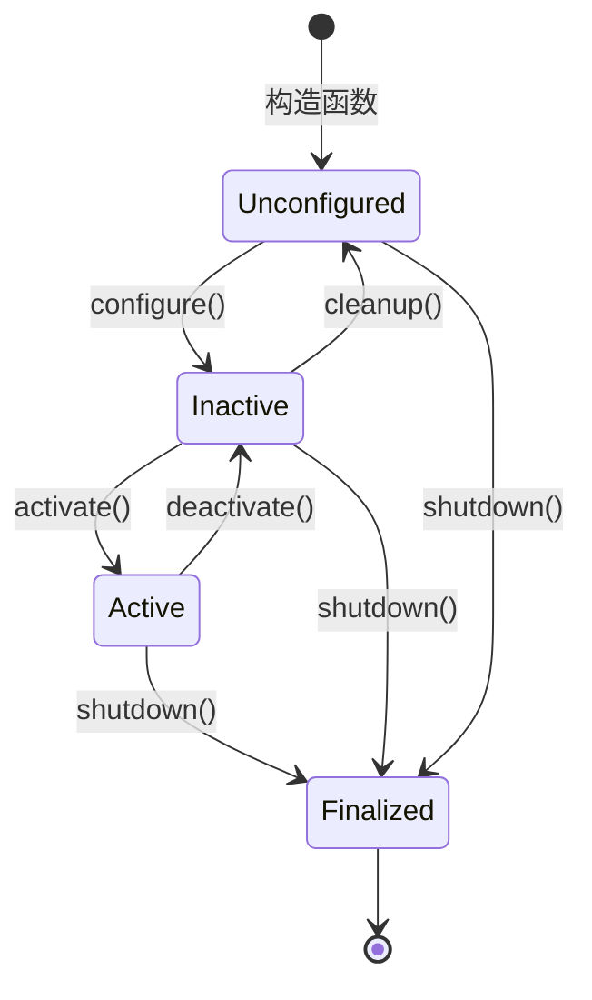
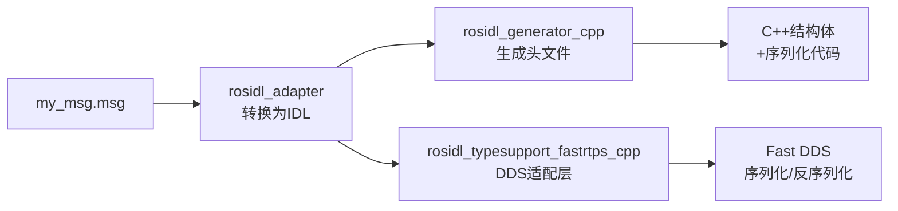
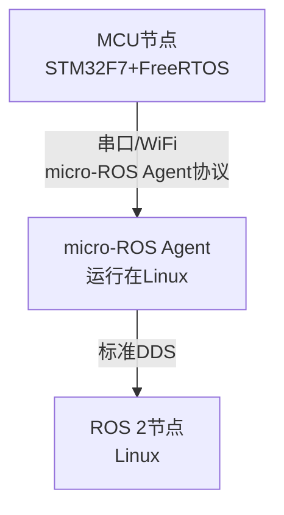

# ROS2嵌入式适配与裁剪

> <span class="badge-e">**高级 (Expert)**</span>
> 掌握ROS 2在资源受限嵌入式平台上的裁剪策略，从生命周期管理到组件瘦身，实现"最小可运行ROS系统"。

---

## 核心定义与机制

---

### <strong>生命周期管理</strong>

<span class="badge-e">E</span><br>
<span class="red">ROS 2生命周期（Lifecycle）</span>是专为嵌入式场景设计的节点状态机，将节点从"初始化完成即运行"变为"分阶段激活"——未激活的节点不占用CPU执行时间，显著降低资源消耗。<br>

标准生命周期定义了4个主状态：Unconfigured → Inactive → Active → Finalized，以及6个过渡事件。<br>



<span class="orange"><strong>1. 状态语义：</strong></span><br>

| 状态 | 行为特征 | 资源占用 |
|------|----------|----------|
| Unconfigured | 节点已创建，等待参数配置 | 最小（仅对象内存） |
| Inactive | 参数已加载，Publisher/Subscriber已创建但不收发 | 中（无执行开销） |
| Active | 消息收发、回调执行完全启用 | 最大（CPU+内存） |
| Finalized | 资源释放完成，等待析构 | 最小 |

<span class="orange"><strong>2. 生命周期节点实现：</strong></span><br>

```cpp
// 文件：src/lifecycle_sensor_node.cpp
// 行号：15
class LifecycleSensorNode : public rclcpp_lifecycle::LifecycleNode {
public:
    LifecycleSensorNode() : LifecycleNode("lifecycle_sensor") {}

    // 行号：20
    rclcpp_lifecycle::node_interfaces::LifecycleNodeInterface::CallbackReturn
    on_configure(const rclcpp_lifecycle::State & previous_state) {
        // 配置阶段：加载参数、初始化硬件
        pub_ = this->create_publisher<sensor_msgs::msg::LaserScan>("scan", 10);
        return CallbackReturn::SUCCESS;   // 进入Inactive状态
    }

    // 行号：28
    rclcpp_lifecycle::node_interfaces::LifecycleNodeInterface::CallbackReturn
    on_activate(const rclcpp_lifecycle::State & previous_state) {
        // 激活阶段：启动定时器，开始发布
        timer_ = this->create_wall_timer(
            std::chrono::milliseconds(100),
            [this]() { publish_scan(); }
        );
        pub_->on_activate();                // 启用Publisher
        return CallbackReturn::SUCCESS;     // 进入Active状态
    }

    // 行号：39
    rclcpp_lifecycle::node_interfaces::LifecycleNodeInterface::CallbackReturn
    on_deactivate(const rclcpp_lifecycle::State & previous_state) {
        timer_->cancel();                   // 停止定时器
        pub_->on_deactivate();              // 禁用Publisher
        return CallbackReturn::SUCCESS;     // 回到Inactive状态
    }
};
```

**代码带读：** 第15行继承 `rclcpp_lifecycle::LifecycleNode` 替代普通 `rclcpp::Node`。第20行 `on_configure()` 完成硬件初始化与Publisher创建，但此时Publisher不传输数据。第28行 `on_activate()` 启动定时器并激活Publisher，节点进入全功能状态。第39行 `on_deactivate()` 是嵌入式节能的关键——停止定时器与Publisher，CPU负载降至零。

<span class="blue">嵌入式价值：电池供电的移动机器人可通过生命周期管理实现"按需激活"——检测到运动需求时activate()传感器节点，静止时deactivate()，延长续航。</span><br>

---

### <strong>rosidl代码生成</strong>

<span class="badge-e">E</span><br>
<span class="red">rosidl（ROS Interface Definition Language）</span>是ROS 2的接口定义与代码生成框架，将.msg/.srv/.action文件编译为多语言绑定（C++/Python/C）。嵌入式场景需理解其生成产物，以控制二进制体积。<br>

<span class="orange"><strong>1. 代码生成链路：</strong></span><br>



<span class="orange"><strong>2. 生成产物体积分析：</strong></span><br>

| 生成组件 | 体积贡献 | 裁剪策略 |
|----------|----------|----------|
| C++结构体 | 小（仅字段定义） | 不可裁剪 |
| 序列化代码 | 中（每个字段的序列化函数） | 减少字段数 |
| DDS TypeSupport | 大（Fast DDS专用适配） | 单DDS实现时只保留一种 |
| Python绑定 | 大 | 嵌入式裁剪Python |

<span class="orange"><strong>3. 自定义消息优化示例：</strong></span><br>

```msg
# 文件：msg/CompactSensor.msg
# 嵌入式优化：只保留必要字段，避免嵌套标准消息
uint16 distance_mm      # 距离，毫米（uint16替代float32节省4字节）
int16 temperature_c       # 温度，摄氏度（有符号）
uint8 battery_pct         # 电量百分比
builtin_interfaces/Time stamp
```

**代码带读：** 嵌入式场景的消息设计应遵循"字段最小化"原则。`uint16` 替代 `float32` 在距离测量中足够表达65米范围，节省50%序列化数据量。避免嵌套复杂标准消息（如 `geometry_msgs/Pose` 包含四元数，共56字节），自定义紧凑格式可降至12字节。

<span class="blue">为什么需要关注rosidl产物体积？因为嵌入式设备的存储（eMMC/NAND Flash）通常为4~16GB，且ROS 2节点的交叉编译产物需通过OTA更新——二进制越小，更新越快，可靠性越高。</span><br>

---

### <strong>组件裁剪（关闭可视化）</strong>

<span class="badge-e">E</span><br>
<span class="red">ROS 2桌面版安装</span>包含大量嵌入式场景不需要的组件：RViz（3D可视化）、Gazebo（仿真）、rqt（GUI调试工具）。在STM32MP1等嵌入式Linux设备上，这些组件占用数百MB存储且无法运行（无显示输出）。<br>

<span class="orange"><strong>1. 最小安装策略：</strong></span><br>

```bash
# 嵌入式场景只安装ros-base（不含GUI工具）
$ sudo apt install ros-humble-ros-base

# 单独安装必要组件
$ sudo apt install ros-humble-rclcpp ros-humble-rclpy
$ sudo apt install ros-humble-sensor-msgs ros-humble-geometry-msgs
$ sudo apt install ros-humble-std-msgs
```

<span class="orange"><strong>2. 编译期裁剪（colcon build参数）：</strong></span><br>

```bash
# 文件：build.sh
# 裁剪CMake选项，禁用可视化与测试
$ colcon build \
    --cmake-args \
        -DBUILD_TESTING=OFF \             # 禁用单元测试编译
        -DCMAKE_BUILD_TYPE=MinSizeRel \   # 最小体积优化
    --packages-select my_pkg sensor_pkg    # 只编译必要包
```

**代码带读：** `MinSizeRel` 编译优化模式启用 `-Os` 标志，GCC优先减小代码体积而非提升速度。`BUILD_TESTING=OFF` 跳过gtest等测试框架编译，通常节省20~30%构建时间。`--packages-select` 限制编译范围，避免依赖树中的无用包。

<span class="orange"><strong>3. 运行时裁剪（禁用默认插件）：</strong></span><br>

```bash
# 禁用默认的Connext DDS（仅保留Fast DDS）
$ export RMW_IMPLEMENTATION=rmw_fastrtps_cpp

# 启动时指定最小化DDS配置
$ ros2 run my_pkg node --ros-args \
    --param use_sim_time:=false \          # 禁用仿真时钟
    --param enable_rosout:=false           # 禁用/rosout日志话题
```

<span class="blue">裁剪原则：嵌入式ROS 2的"最小可运行集合" = rclcpp + rosidl + 标准消息包 + 一个DDS实现（Fast DDS）。其余组件按需追加，而非默认全装。</span><br>

---

### <strong>节点轻量化优化</strong>

<span class="badge-e">E</span><br>
<span class="red">节点轻量化</span>是嵌入式ROS 2的核心优化方向，目标是在保证功能的前提下最小化内存占用与CPU负载。<br>

<span class="orange"><strong>1. Executor选型：</strong></span><br>

| Executor类型 | 线程数 | 适用场景 | 内存占用 |
|-------------|--------|----------|----------|
| SingleThreadedExecutor | 1 | 单节点、低并发 | 最小 |
| MultiThreadedExecutor | N | 多节点、高并发 | 中 |
| StaticSingleThreadedExecutor | 1（预分配） | 确定性调度 | 小且稳定 |

```cpp
// 文件：src/lightweight_executor.cpp
// 行号：10
// 嵌入式场景优先使用单线程Executor
rclcpp::executors::SingleThreadedExecutor executor;
executor.add_node(node);
executor.spin();  // 阻塞执行，无额外线程开销
```

**代码带读：** `SingleThreadedExecutor` 在单一线程中顺序处理所有回调，无线程切换开销。嵌入式场景通常节点数量少、回调频率可控，单线程足以满足需求。`MultiThreadedExecutor` 引入线程池，内存与调度开销成倍增长。

<span class="orange"><strong>2. 定时器精度优化：</strong></span><br>

```cpp
// 文件：src/timer_optimization.cpp
// 行号：15
// 避免过高频率的定时器——按需设置最小频率
auto timer = node->create_wall_timer(
    std::chrono::milliseconds(100),       // 10Hz，而非默认100Hz
    &publish_callback
);
```

**代码带读：** 传感器数据的发布频率应与实际需求匹配。激光雷达标称10Hz时，定时器周期应为100ms；若设为50ms（20Hz），则50%的发布周期无新数据，造成CPU空转与DDS层无效传输。

<span class="orange"><strong>3. 日志级别控制：</strong></span><br>

```cpp
// 文件：src/log_control.cpp
// 行号：5
// 发布版关闭DEBUG/INFO日志，只保留WARN/ERROR
rcutils_logging_set_logger_level("my_node", RCUTILS_LOG_SEVERITY_WARN);
```

**代码带读：** `RCUTILS_LOG_SEVERITY_WARN` 将日志输出阈值设为WARN级别，DEBUG和INFO日志被静默丢弃。嵌入式场景中，频繁的RCLCPP_INFO输出会通过/rosout话题广播到全网——即使无人订阅，Publisher的构造与内存分配依然存在。

<span class="blue">轻量化核心公式：内存占用 = 节点对象 + Publisher/Subscription句柄 × 数量 + QoS队列缓存 × 消息大小。嵌入式优化应逐因子削减。</span><br>

---

### <strong>数据传输优化</strong>

<span class="badge-e">E</span><br>
<span class="red">数据传输优化</span>聚焦降低DDS层的序列化开销与网络带宽占用，是嵌入式多节点协同的关键瓶颈。<br>

<span class="orange"><strong>1. 消息字段裁剪：</strong></span><br>

```msg
# 文件：msg/MinimalTwist.msg
# 差速底盘只需线速度x与角速度z
float32 linear_x
float32 angular_z
# 省略：linear_y, linear_z, angular_x, angular_y（共20字节）
```

**代码带读：** 标准 `geometry_msgs/Twist` 包含6个float32字段（24字节）。差速底盘只需2个字段（8字节），裁剪后序列化数据量降低66%，DDS层带宽占用同步下降。

<span class="orange"><strong>2. 共享内存传输（shm）：</strong></span><br>

```xml
<!-- 文件：fastdds_shm.xml -->
<!-- Fast DDS共享内存传输配置 -->
<profiles>
    <transport_descriptors>
        <transport_descriptor>
            <transport_id>shm_transport</transport_id>
            <type>SHM</type>                    <!-- 启用共享内存 -->
            <segment_size>1048576</segment_size>  <!-- 1MB段 -->
        </transport_descriptor>
    </transport_descriptors>
</profiles>
```

**代码带读：** Fast DDS支持共享内存传输层（SHM），同主机内的节点通过 `shm_open()` + `mmap()` 直接交换数据，完全绕过TCP/IP协议栈。1MB的segment_size足够容纳一帧1280×720的图像（约0.9MB）。

<span class="orange"><strong>3. 数据压缩传输：</strong></span><br>

```cpp
// 文件：src/compressed_image_pub.cpp
// 行号：25
// 使用sensor_msgs/CompressedImage替代原始Image
sensor_msgs::msg::CompressedImage compressed;
compressed.format = "jpeg";
compressed.data = compress_jpeg(raw_image.data, quality=75);
// 典型压缩比：4MB原始图像 → 200KB JPEG
```

**代码带读：** 嵌入式摄像头节点在Publisher层执行JPEG压缩，订阅者接收后解压。压缩引入CPU开销（STM32MP1的Cortex-A7约消耗5ms/帧），但带宽降低95%，适合WiFi等受限链路。

<span class="blue">传输优化的决策树：同进程 → intra-process零拷贝；同主机 → SHM共享内存；跨主机 → 消息裁剪+压缩+QoS队列最小化。</span><br>

---

### <strong>micro-ROS入门</strong>

<span class="badge-e">E</span><br>
<span class="red">micro-ROS</span>是ROS 2向MCU（微控制器）的扩展，支持STM32F7、ESP32、NXP等RTOS平台通过串口/WiFi与ROS 2网关通信。<span class="green">**[M]**</span> 对于运行完整Linux的STM32MP1，micro-ROS并非必需，但理解其架构有助于异构系统设计。<br>



<span class="orange"><strong>1. micro-ROS架构：</strong></span><br>

| 组件 | 运行位置 | 职责 |
|------|----------|------|
| micro-ROS Client | MCU（FreeRTOS/Zephyr） | 运行精简版rcl，发布Topic |
| micro-ROS Agent | Linux网关（STM32MP1） | 协议转换：串口 ↔ DDS |
| ROS 2节点 | Linux或PC | 接收MCU数据，与普通节点无差异 |

<span class="orange"><strong>2. Agent启动示例：</strong></span><br>

```bash
# 在STM32MP1上启动micro-ROS Agent（串口/dev/ttyACM0）
$ ros2 run micro_ros_agent micro_ros_agent serial --dev /dev/ttyACM0 -b 115200

# MCU节点发布的数据会自动出现在Linux端的DDS域
$ ros2 topic echo /mcu_sensor_data
```

<span class="blue">异构场景价值：电机控制闭环放在MCU（硬实时），SLAM建图放在Linux（高算力），两者通过micro-ROS Agent在ROS 2层面统一通信——开发者无需关心底层是CAN还是串口。</span><br>

---

## 历史演进与前沿

---

### <strong>从桌面到嵌入式的适配演进</strong>

<span class="badge-e">E</span><br>
<span class="red">ROS 2嵌入式适配</span>的演进映射了机器人硬件平台从x86服务器到ARM SoC的算力下沉历程。<br>

| 阶段 | 时间 | 关键进展 |
|------|------|----------|
| ROS 2桌面期 | 2017-2019 | 仅支持x86 Ubuntu，资源无约束 |
| ARM适配启动 | 2019-2021 | 支持Jetson Nano/树莓派，引入交叉编译 |
| 裁剪优化期 | 2021-2023 | micro-ROS发布，rmw实现可替换，QoS精细化 |
| 工业落地期 | 2023至今 | STM32MP1/NXP i.MX主流化，生命周期管理成熟 |

<span class="blue">演进逻辑：嵌入式ROS 2不是"降级版"，而是"定向优化版"——去掉桌面场景的冗余功能，保留并强化实时性、资源控制、生命周期管理。</span><br>

---

## 本章小结

| 知识点 | 核心结论 | 优化效果 |
|--------|----------|----------|
| 生命周期 | Unconfigured→Inactive→Active分阶段激活 | 静止时CPU负载归零 |
| rosidl裁剪 | 字段最小化+TypeSupport单实现 | 减小序列化体积 |
| 组件裁剪 | ros-base安装+BUILD_TESTING=OFF | 存储减少数百MB |
| 节点轻量化 | 单线程Executor+低频率定时器+日志阈值 | 内存/CPU双降 |
| 数据传输 | 消息裁剪+SHM+压缩 | 带宽降低50~95% |
| micro-ROS | MCU↔Linux网关协议转换 | 异构实时协同 |

---

## 课后练习

1. **推导题**：为什么LifecycleNode的on_deactivate()能实现"零CPU占用"？从定时器cancel()、Publisher deactivate()、spin()的事件循环机制三个层面推导。
2. **设计题**：为STM32MP1（512MB内存）设计一套ROS 2裁剪方案，列出：安装包清单、CMake编译参数、运行时环境变量、DDS配置选择。目标：最小可运行集支持激光雷达+电机控制。
3. **实操题**：编写一个自定义紧凑消息（3个字段以内），对比标准geometry_msgs/Twist的序列化后字节数，使用 `ros2 topic hz` 观察发布频率对CPU占用的影响。
