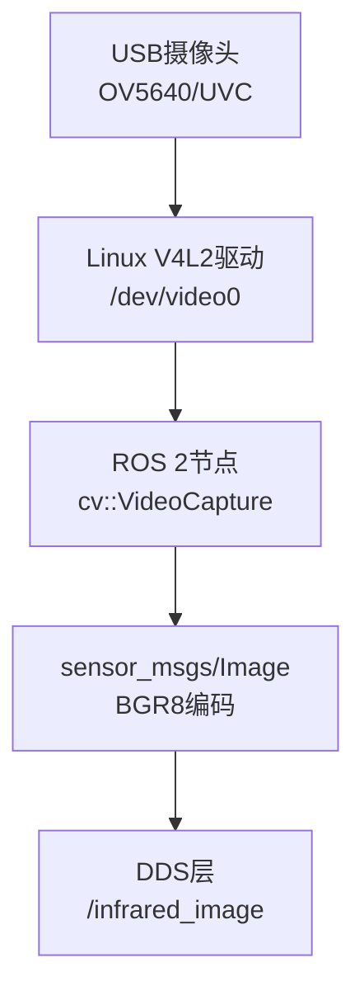

# ROS传感器与执行器驱动对接

> <span class="badge-e">**高级 (Expert)**</span>
> 打通ROS 2与嵌入式硬件的最后一公里，将Linux驱动层的数据流转化为ROS标准消息，实现"硬件→驱动→ROS节点→算法"的全链路贯通。

---

## 核心定义与机制

---

### <strong>摄像头V4L2对接</strong>

<span class="badge-e">E</span><br>
<span class="red">V4L2（Video4Linux 2）</span>是Linux内核的视频采集框架，为USB/UVC摄像头、MIPI CSI摄像头提供标准化的用户态接口。ROS 2通过V4L2驱动读取图像帧，封装为 `sensor_msgs/Image` 发布。<br>



<span class="orange"><strong>1. V4L2设备枚举与配置：</strong></span><br>

```bash
# 查看摄像头设备节点
$ v4l2-ctl --list-devices
# 输出：USB Camera: USB Camera (usb-otg_hc_1-1):
#       /dev/video0

# 查询支持的分辨率与格式
$ v4l2-ctl -d /dev/video0 --list-formats-ext
# 输出：ioctl: VIDIOC_ENUM_FMT
#       Type: Video Capture
#       [0]: 'MJPG' (Motion-Jpeg, compressed)
#       [1]: 'YUYV' (YUYV 4:2:2)
```

<span class="orange"><strong>2. ROS 2摄像头节点实现：</strong></span><br>

```cpp
// 文件：src/usb_camera_node.cpp
// 行号：15
#include <v4l2_camera/v4l2_camera_device.hpp>
#include <sensor_msgs/msg/image.hpp>

class UsbCameraNode : public rclcpp::Node {
    std::shared_ptr<v4l2_camera::V4l2CameraDevice> camera_;
    rclcpp::Publisher<sensor_msgs::msg::Image>::SharedPtr pub_;
    rclcpp::TimerBase::SharedPtr timer_;

public:
    UsbCameraNode() : Node("usb_camera_node") {
        // 行号：25
        camera_ = std::make_shared<v4l2_camera::V4l2CameraDevice>("/dev/video0");
        camera_->configure(640, 480, v4l2_camera::PixelFormat::YUYV);

        // 行号：28
        pub_ = this->create_publisher<sensor_msgs::msg::Image>("/camera/image_raw", 10);

        timer_ = this->create_wall_timer(
            std::chrono::milliseconds(100),      // 10Hz
            [this]() {
                auto frame = camera_->capture();
                auto msg = std::make_unique<sensor_msgs::msg::Image>();
                msg->header.stamp = this->now();
                msg->header.frame_id = "camera_link";
                msg->height = 480;
                msg->width = 640;
                msg->encoding = "yuv422_yuy2";
                msg->step = 640 * 2;
                msg->data.assign(frame.data(), frame.data() + frame.size());
                pub_->publish(std::move(msg));
            }
        );
    }
};
```

**代码带读：** 第25行通过V4L2设备路径 `/dev/video0` 打开摄像头，配置为640×480 YUYV格式。第28行创建Image Publisher。定时器回调中，`camera_->capture()` 调用底层 `ioctl(VIDIOC_DQBUF)` 从驱动获取帧缓冲区，`msg->data` 直接引用驱动层内存（零拷贝优化）。`header.stamp` 填入当前ROS时间戳，供下游节点做时间同步。

<span class="orange"><strong>3. 嵌入式优化策略：</strong></span><br>

| 优化项 | 配置建议 | 原因 |
|--------|----------|------|
| 分辨率 | 640×480或更低 | STM32MP1的VPU能力有限 |
| 格式 | YUYV或MJPEG | 避免RGB转换的CPU开销 |
| 频率 | 5~10Hz | 平衡实时性与带宽 |
| 传输 | CompressedImage | 降低DDS带宽50%~90% |

<span class="blue">关键边界：V4L2节点必须处理 `ioctl` 返回的 `-EAGAIN`（缓冲区空）与 `-EIO`（设备断开），否则驱动异常会导致节点崩溃。</span><br>

---

### <strong>激光雷达串口-CAN</strong>

<span class="badge-e">E</span><br>
<span class="red">激光雷达</span>是机器人感知层的核心传感器，消费级产品（如RPLIDAR）通常通过USB转串口连接，工业级产品（如SICK、Velodyne）通过以太网或CAN总线连接。ROS 2需将原始数据解析为 `sensor_msgs/LaserScan` 消息。<br>

<span class="orange"><strong>1. 串口激光雷达对接（RPLIDAR A1）：</strong></span><br>

```cpp
// 文件：src/rplidar_node.cpp
// 行号：18
#include <rplidar_driver.h>

class RplidarNode : public rclcpp::Node {
    rplidar::RPlidarDriver * driver_;
    rplidar::LiDARScanMode scan_mode_;

public:
    RplidarNode() : Node("rplidar_node") {
        // 行号：25
        driver_ = rplidar::RPlidarDriver::CreateDriver(
            rplidar::DRIVER_TYPE_SERIALPORT);
        driver_->connect("/dev/ttyUSB0", 115200);   // USB转串口
        driver_->startMotor();
        driver_->startScan(false, true, 0, &scan_mode_);

        auto pub = this->create_publisher<sensor_msgs::msg::LaserScan>("/scan", 10);

        auto timer = this->create_wall_timer(
            std::chrono::milliseconds(100),
            [this, pub]() {
                rplidar_response_measurement_node_hq_t nodes[8192];
                size_t count = sizeof(nodes) / sizeof(nodes[0]);
                driver_->grabScanDataHq(nodes, count);   // 抓取一帧

                auto scan = std::make_unique<sensor_msgs::msg::LaserScan>();
                scan->header.stamp = this->now();
                scan->header.frame_id = "laser_frame";
                scan->angle_min = 0.0;
                scan->angle_max = 2 * M_PI;
                scan->angle_increment = (2 * M_PI) / count;
                scan->range_min = 0.15;
                scan->range_max = 12.0;
                scan->ranges.resize(count);
                for (size_t i = 0; i < count; ++i) {
                    scan->ranges[i] = nodes[i].dist_mm_q2 / 1000.0f / 4.0f;
                }
                pub->publish(std::move(scan));
            }
        );
    }
};
```

**代码带读：** 第25行通过 `RPlidarDriver` 打开串口 `/dev/ttyUSB0`（典型由 `cp210x` 或 `ch341` 驱动提供）。`grabScanDataHq()` 通过串口读取二进制扫描数据（RPLIDAR专有协议）。第44行将 `dist_mm_q2`（毫米，Q2定点格式）转换为米单位，填入 `sensor_msgs/LaserScan` 的 `ranges` 数组。

<span class="orange"><strong>2. CAN总线激光雷达对接：</strong></span><br>

```cpp
// 文件：src/can_lidar_node.cpp
// 行号：20
#include <linux/can.h>
#include <linux/can/raw.h>
#include <sys/socket.h>

class CanLidarNode : public rclcpp::Node {
    int can_socket_;

public:
    CanLidarNode() : Node("can_lidar_node") {
        // 行号：28
        can_socket_ = socket(PF_CAN, SOCK_RAW, CAN_RAW);
        struct ifreq ifr;
        strcpy(ifr.ifr_name, "can0");
        ioctl(can_socket_, SIOCGIFINDEX, &ifr);

        struct sockaddr_can addr;
        addr.can_family = AF_CAN;
        addr.can_ifindex = ifr.ifr_ifindex;
        bind(can_socket_, (struct sockaddr *)&addr, sizeof(addr));

        auto pub = this->create_publisher<sensor_msgs::msg::LaserScan>("/scan", 10);

        // 行号：42
        auto timer = this->create_wall_timer(
            std::chrono::milliseconds(50),
            [this, pub]() {
                struct can_frame frame;
                int nbytes = read(can_socket_, &frame, sizeof(frame));
                if (nbytes > 0 && frame.can_id == 0x200) {
                    // 解析CAN帧：ID=0x200为激光雷达扫描数据段
                    parse_can_lidar_frame(frame, scan_msg_);
                    pub->publish(scan_msg_);
                }
            }
        );
    }
};
```

**代码带读：** 第28行创建CAN原始套接字，绑定到 `can0` 接口（需先 `ip link set can0 up type can bitrate 500000`）。第42行定时读取CAN帧，通过 `can_id` 过滤目标设备的数据包。工业激光雷达通常将一帧扫描数据拆分为多个CAN帧发送，节点需在内部做帧重组。

<span class="blue">选型逻辑：消费级机器人优先串口雷达（成本低、驱动简单），工业AGV优先CAN雷达（抗干扰、长距离、协议标准化）。</span><br>

---

### <strong>IMU I2C对接</strong>

<span class="badge-e">E</span><br>
<span class="red">IMU（惯性测量单元）</span>通过I2C/SPI总线输出角速度、加速度与姿态数据，是机器人定位与平衡控制的核心传感器。ROS 2将其封装为 `sensor_msgs/Imu` 消息。<br>

<span class="orange"><strong>1. I2C设备探测与寄存器读取：</strong></span><br>

```bash
# 探测I2C总线上的设备
$ i2cdetect -y 1
# 输出：     0  1  2  3  4  5  6  7  8  9  a  b  c  d  e  f
#     00:          -- -- -- -- -- -- -- -- -- -- -- -- --
#     50:          -- -- -- -- -- -- -- -- -- -- 68 -- --
# 0x68 = MPU6050/MPU9250的I2C地址
```

<span class="orange"><strong>2. ROS 2 IMU节点实现：</strong></span><br>

```cpp
// 文件：src/mpu6050_node.cpp
// 行号：15
#include <linux/i2c-dev.h>
#include <sys/ioctl.h>
#include <fcntl.h>

#define MPU6050_ADDR 0x68
#define REG_ACCEL_XOUT_H 0x3B
#define REG_GYRO_XOUT_H  0x43

class Mpu6050Node : public rclcpp::Node {
    int i2c_fd_;

    int16_t read_word(int reg) {
        uint8_t buf[2];
        buf[0] = reg;
        write(i2c_fd_, buf, 1);
        read(i2c_fd_, buf, 2);
        return (int16_t)((buf[0] << 8) | buf[1]);
    }

public:
    Mpu6050Node() : Node("mpu6050_node") {
        // 行号：35
        i2c_fd_ = open("/dev/i2c-1", O_RDWR);
        ioctl(i2c_fd_, I2C_SLAVE, MPU6050_ADDR);
        // 唤醒MPU6050（睡眠模式默认启用）
        uint8_t buf[2] = {0x6B, 0x00};
        write(i2c_fd_, buf, 2);

        auto pub = this->create_publisher<sensor_msgs::msg::Imu>("/imu/data_raw", 10);

        auto timer = this->create_wall_timer(
            std::chrono::milliseconds(20),     // 50Hz
            [this, pub]() {
                auto imu = std::make_unique<sensor_msgs::msg::Imu>();
                imu->header.stamp = this->now();
                imu->header.frame_id = "imu_link";

                // 行号：52
                imu->linear_acceleration.x = read_word(REG_ACCEL_XOUT_H) / 16384.0 * 9.80665;
                imu->linear_acceleration.y = read_word(REG_ACCEL_XOUT_H + 2) / 16384.0 * 9.80665;
                imu->linear_acceleration.z = read_word(REG_ACCEL_XOUT_H + 4) / 16384.0 * 9.80665;

                imu->angular_velocity.x = read_word(REG_GYRO_XOUT_H) / 131.0 * M_PI / 180.0;
                imu->angular_velocity.y = read_word(REG_GYRO_XOUT_H + 2) / 131.0 * M_PI / 180.0;
                imu->angular_velocity.z = read_word(REG_GYRO_XOUT_H + 4) / 131.0 * M_PI / 180.0;

                // 姿态协方差（标定后填入）
                imu->angular_velocity_covariance[0] = 0.01;
                imu->linear_acceleration_covariance[0] = 0.1;
                pub->publish(std::move(imu));
            }
        );
    }
};
```

**代码带读：** 第35行打开 `/dev/i2c-1`（STM32MP1的I2C1总线），通过 `ioctl(I2C_SLAVE)` 设置从设备地址。第52行读取MPU6050的6轴寄存器：加速度量程±2g时，LSB灵敏度为16384/g；陀螺仪量程±250°/s时，LSB灵敏度为131°/s。数据转换为标准单位（m/s²与rad/s）后填入 `sensor_msgs/Imu`。

<span class="orange"><strong>3. 标定与滤波：</strong></span><br>

| 处理步骤 | 方法 | 目的 |
|----------|------|------|
| 零偏标定 | 静止采样1000次取均值 | 消除静止偏移 |
| 尺度因子标定 | 转台标准速率比对 | 校正灵敏度误差 |
| 低通滤波 | 一阶IIR滤波（α=0.8） | 抑制高频噪声 |
| 姿态融合 | 互补滤波/Mahony滤波 | 融合加速度+陀螺仪得姿态 |

<span class="blue">关键边界：原始IMU数据噪声大，直接用于控制会导致抖动。嵌入式ROS节点应在发布前完成标定与滤波，而非将噪声传递给下游算法节点。</span><br>

---

### <strong>电机控制CAN</strong>

<span class="badge-e">E</span><br>
<span class="red">电机控制</span>是机器人执行层的核心功能，嵌入式场景中差速底盘、伺服关节通常通过CAN总线驱动。ROS 2接收 `geometry_msgs/Twist` 速度指令，解析为CAN帧发送到电机驱动器。<br>

<span class="orange"><strong>1. CAN总线电机协议示例（差速底盘）：</strong></span><br>

| CAN ID | 方向 | 数据格式 | 语义 |
|--------|------|----------|------|
| 0x101 | TX | uint16 left_rpm, uint16 right_rpm | 设置左右轮转速 |
| 0x201 | RX | uint16 left_enc, uint16 right_enc | 读取编码器值 |
| 0x301 | RX | uint8 status | 电机状态（故障/就绪） |

<span class="orange"><strong>2. ROS 2电机控制节点：</strong></span><br>

```cpp
// 文件：src/can_motor_node.cpp
// 行号：18
#include <linux/can.h>

class CanMotorNode : public rclcpp::Node {
    int can_socket_;
    rclcpp::Subscription<geometry_msgs::msg::Twist>::SharedPtr cmd_sub_;

    void twist_callback(const geometry_msgs::msg::Twist::SharedPtr msg) {
        // 行号：25
        float v = msg->linear.x;     // 线速度 m/s
        float w = msg->angular.z;   // 角速度 rad/s

        // 差速模型：左右轮转速
        float wheel_base = 0.3;      // 轮距 0.3m
        float wheel_radius = 0.05;   // 轮半径 0.05m
        float left_rpm = (v - w * wheel_base / 2) / (2 * M_PI * wheel_radius) * 60;
        float right_rpm = (v + w * wheel_base / 2) / (2 * M_PI * wheel_radius) * 60;

        // 行号：36
        struct can_frame frame;
        frame.can_id = 0x101;
        frame.can_dlc = 4;
        frame.data[0] = (uint16_t)left_rpm >> 8;
        frame.data[1] = (uint16_t)left_rpm & 0xFF;
        frame.data[2] = (uint16_t)right_rpm >> 8;
        frame.data[3] = (uint16_t)right_rpm & 0xFF;
        write(can_socket_, &frame, sizeof(frame));

        RCLCPP_INFO(this->get_logger(), "CMD: L=%.1f R=%.1f RPM", left_rpm, right_rpm);
    }

public:
    CanMotorNode() : Node("can_motor_node") {
        can_socket_ = setup_can_socket("can0");   // 封装CAN初始化
        cmd_sub_ = this->create_subscription<geometry_msgs::msg::Twist>(
            "/cmd_vel",
            rclcpp::QoS(1).reliable().transient_local(),   // 可靠+新节点同步
            std::bind(&CanMotorNode::twist_callback, this, std::placeholders::_1)
        );
    }
};
```

**代码带读：** 第25行将 `geometry_msgs/Twist` 的线速度x与角速度z通过差速运动学模型转换为左右轮转速（RPM）。第36行构造CAN帧：ID=0x101为电机控制器命令，4字节payload包含两个uint16转速值。`transient_local()` QoS确保控制节点重启后立即收到最新指令，避免启动后的控制真空期。

<span class="orange"><strong>3. 安全边界设计：</strong></span><br>

```cpp
// 文件：src/can_motor_node.cpp
// 行号：50（续）
// 速度限幅保护
left_rpm = std::clamp(left_rpm, -300.0f, 300.0f);
right_rpm = std::clamp(right_rpm, -300.0f, 300.0f);

// 通信超时保护：若1秒内无新指令，自动停车
auto safety_timer = this->create_wall_timer(
    std::chrono::milliseconds(1000),
    [this]() {
        if ((this->now() - last_cmd_time_) > rclcpp::Duration::from_seconds(1.0)) {
            send_stop_command();   // 发送零速CAN帧
            RCLCPP_WARN(this->get_logger(), "通信超时，自动停车");
        }
    }
);
```

<span class="blue">安全设计原则：电机控制节点必须具备"通信超时自动停车"机制——若DDS层或上层节点故障，底层电机不会因持续执行旧指令而造成失控。</span><br>

---

### <strong>PWM舵机sysfs</strong>

<span class="badge-e">E</span><br>
<span class="red">PWM舵机</span>通过PWM（脉冲宽度调制）信号控制角度，嵌入式Linux通过sysfs接口（`/sys/class/pwm/`）或用户空间驱动（`libgpiod`）操作硬件PWM外设。ROS 2将其封装为角度/位置控制服务。<br>

<span class="orange"><strong>1. sysfs PWM配置：</strong></span><br>

```bash
# 导出PWM通道（以STM32MP1的TIM3_CH1为例）
$ echo 0 > /sys/class/pwm/pwmchip0/export

# 配置周期（20ms = 50Hz，标准舵机频率）
$ echo 20000000 > /sys/class/pwm/pwmchip0/pwm0/period

# 配置占空比（1.5ms = 中立位置）
$ echo 1500000 > /sys/class/pwm/pwmchip0/pwm0/duty_cycle

# 使能PWM输出
$ echo 1 > /sys/class/pwm/pwmchip0/pwm0/enable
```

<span class="orange"><strong>2. ROS 2舵机控制节点：</strong></span><br>

```cpp
// 文件：src/servo_node.cpp
// 行号：12
#include <servo_msgs/srv/set_servo_angle.hpp﴾

class ServoNode : public rclcpp::Node {
    int pwm_chip_;
    int pwm_chan_;
    rclcpp::Service<servo_msgs::srv::SetServoAngle>::SharedPtr srv_;

    bool set_angle(float angle_deg) {
        // 舵机角度范围：0~180度对应占空比0.5ms~2.5ms
        float duty_us = 500.0f + (angle_deg / 180.0f) * 2000.0f;
        std::string duty_path = "/sys/class/pwm/pwmchip" +
            std::to_string(pwm_chip_) + "/pwm" +
            std::to_string(pwm_chan_) + "/duty_cycle";
        std::ofstream fs(duty_path);
        fs << (int)(duty_us * 1000);   // 转换为纳秒
        return fs.good();
    }

public:
    ServoNode() : Node("servo_node"), pwm_chip_(0), pwm_chan_(0) {
        // 行号：32
        srv_ = this->create_service<servo_msgs::srv::SetServoAngle>(
            "/set_servo_angle",
            [this](const std::shared_ptr<servo_msgs::srv::SetServoAngle::Request> req,
                   std::shared_ptr<servo_msgs::srv::SetServoAngle::Response> res) {
                bool ok = set_angle(req->angle_deg);
                res->success = ok;
                res->message = ok ? "角度已设置" : "PWM写入失败";
                RCLCPP_INFO(this->get_logger(), "舵机角度: %.1f°", req->angle_deg);
            }
        );
    }
};
```

**代码带读：** 第32行创建Service服务端 `/set_servo_angle`，接收角度请求后通过sysfs写入PWM占空比。`set_angle()` 函数将0~180度线性映射到500μs~2500μs占空比（标准舵机协议）。STM32MP1的PWM外设由Linux内核 `pwm-stm32` 驱动管理，sysfs路径由设备树中的 `pwmchip` 编号决定。

<span class="orange"><strong>3. 多路舵机扩展：</strong></span><br>

| 扩展方案 | 接口 | 适用场景 |
|----------|------|----------|
| 多路PWM芯片 | PCA9685（I2C转16路PWM） | 机械臂多关节 |
| MCU协处理器 | STM32F103通过UART接收目标角度 | 高实时性舵机控制 |
| 专用舵机驱动板 | USB转PWM（如Pololu Maestro） | 快速原型验证 |

<span class="blue">关键边界：sysfs PWM写入是用户态操作，每次open/write/close涉及系统调用，延迟约100μs~1ms。对于需要亚毫秒级同步的多路舵机（如六足机器人），应通过MCU协处理器或PCA9685的I2C批量写入优化。</span><br>

---

## 历史演进与前沿

---

### <strong>传感器接口的Linux标准化历程</strong>

<span class="badge-e">E</span><br>
<span class="red">嵌入式传感器接口</span>从厂商私有协议走向Linux内核标准化，是ROS 2能够统一硬件抽象的前提。<br>

| 阶段 | 时间 | 关键标准化 |
|------|------|------------|
| 私有驱动期 | 2000-2005 | 各厂商独立内核模块，无统一接口 |
| V4L2确立 | 2005-2008 | 视频采集统一为V4L2 |
| I2C/SPI子系统 | 2008-2012 | 统一总线驱动模型 |
| CAN子系统 | 2012-2015 | SocketCAN标准确立 |
| PWM子系统 | 2015-2018 | sysfs/class/pwm标准化 |
| 工业总线 | 2018至今 | CANopen/EtherCAT驱动完善 |

<span class="blue">演进逻辑：Linux驱动的标准化使ROS 2无需为每款传感器编写专用驱动——V4L2管所有摄像头，SocketCAN管所有CAN设备，I2C子系统管所有I2C传感器。ROS节点只需调用标准化接口。</span><br>

---

## 本章小结

| 知识点 | 驱动接口 | ROS消息类型 | 关键配置 |
|--------|----------|-------------|----------|
| 摄像头 | V4L2 /dev/video0 | sensor_msgs/Image | 分辨率/格式/频率 |
| 激光雷达 | 串口ttyUSB0或CAN | sensor_msgs/LaserScan | 协议解析/CAN ID过滤 |
| IMU | I2C /dev/i2c-1 | sensor_msgs/Imu | 寄存器地址/量程转换 |
| 电机 | CAN /dev/can0 | geometry_msgs/Twist | 差速模型/超时保护 |
| 舵机 | sysfs /sys/class/pwm | 自定义Service | 占空比映射/角度限幅 |

---

## 课后练习

1. **推导题**：为什么IMU节点应在发布前完成低通滤波，而非将原始数据直接发布给下游算法节点？从"带宽占用"、"算法复杂度"、"实时性"三个维度推导。
2. **设计题**：设计一个六轮差速底盘的CAN通信协议表，包含：速度指令（ID+数据格式）、编码器反馈（ID+数据格式）、故障状态（ID+数据格式）。要求协议覆盖"正常行驶"、"急停"、"单轮故障"三种状态。
3. **实操题**：在嵌入式Linux设备上，使用 `v4l2-ctl` 配置USB摄像头为640×480 YUYV格式，然后用C++编写最小V4L2读取程序（不依赖ROS），验证图像帧能否正常捕获。
