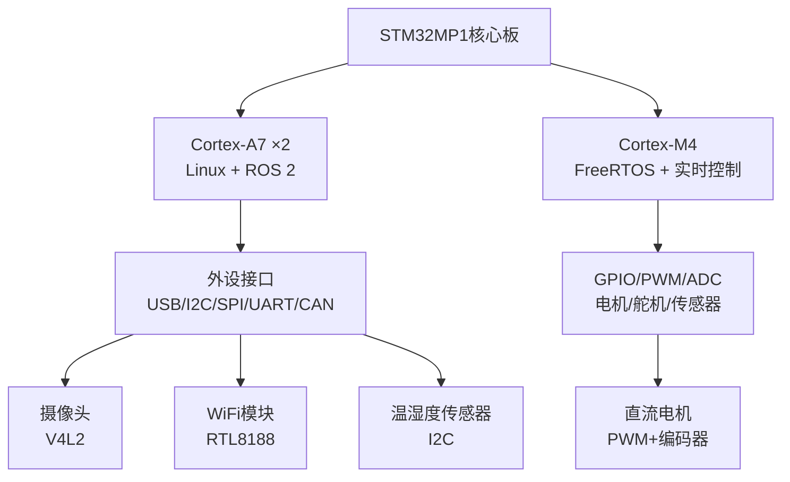
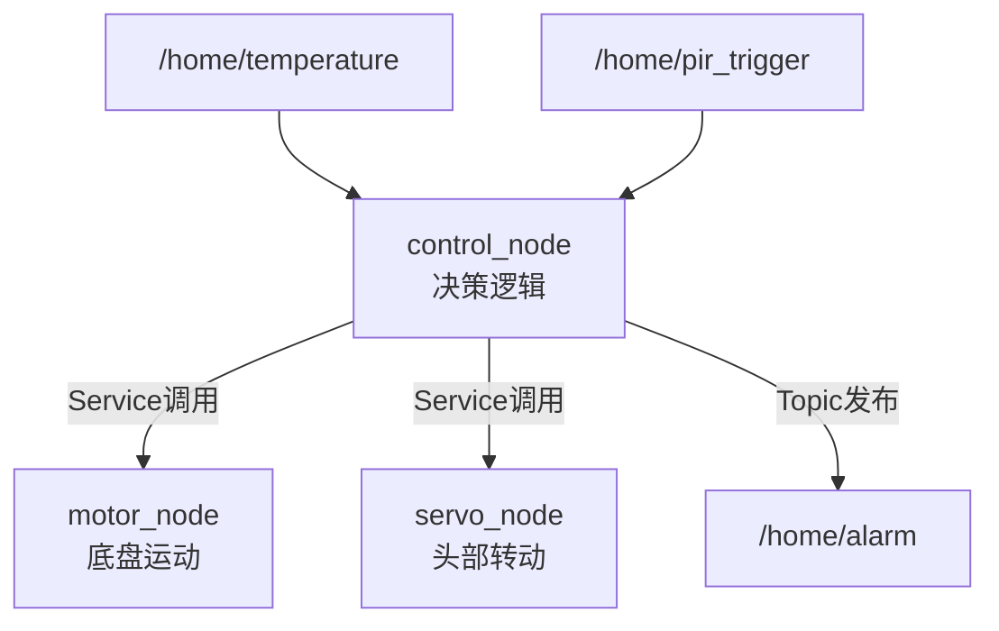
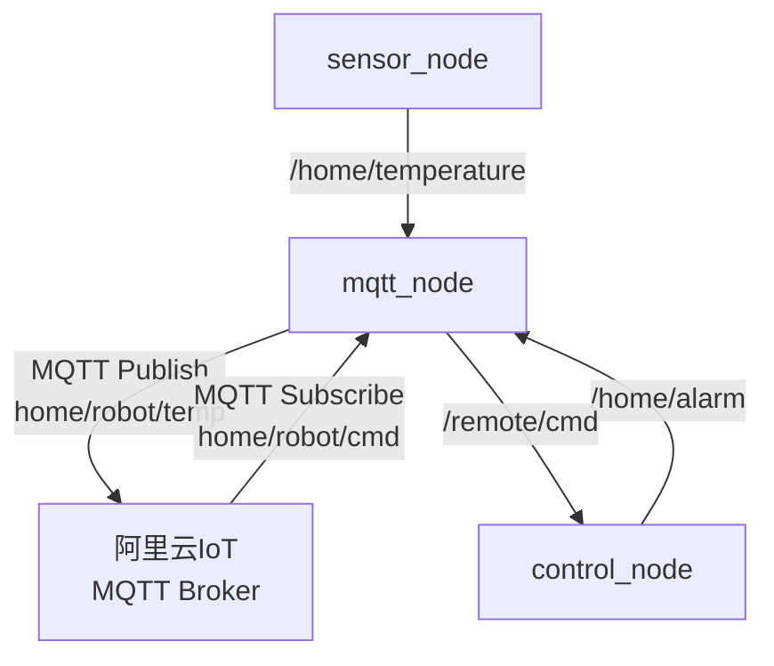

# ROS嵌入式实战：智能家居机器人

> <span class="badge-e">**高级 (Expert)**</span>
> 以智能家居机器人为完整项目载体，串联"硬件选型→传感器节点→控制节点→云端上传→系统集成"的全链路工程化实践。

---

## 核心定义与机制

---

### <strong>STM32MP1硬件选型</strong>

<span class="badge-e">E</span><br>
<span class="red">STM32MP1</span>是意法半导体推出的 heterogeneous MPU，集成双核Cortex-A7（运行Linux）+ 单核Cortex-M4（运行RTOS），是嵌入式ROS 2机器人的高性价比平台。<br>



<span class="orange"><strong>1. 核心板选型要素：</strong></span><br>

| 选型维度 | 配置建议 | 依据 |
|----------|----------|------|
| 处理器 | STM32MP157D（800MHz双核A7） | ROS 2最小可运行配置 |
| 内存 | 512MB DDR3 | 多节点并行所需 |
| 存储 | 8GB eMMC + SD卡扩展 | 系统镜像+日志空间 |
| 网络 | 100M以太网 + WiFi（AP6236） | 分布式通信与OTA更新 |
| 扩展 | 40Pin GPIO + I2C + SPI + UART | 传感器与执行器接入 |

<span class="orange"><strong>2. 智能家居机器人硬件清单：</strong></span><br>

| 模块 | 硬件型号 | 接口 | ROS节点 |
|------|----------|------|---------|
| 主控 | STM32MP157D-DK1 | - | 系统主节点 |
| 摄像头 | USB OV5640 | USB2.0 | camera_node |
| 温湿度 | SHT30 | I2C1 | env_sensor_node |
| 人体红外 | HC-SR501 | GPIO | pir_node |
| 底盘电机 | JGA25-370 + 驱动板 | PWM/GPIO | motor_node |
| 网络 | 板载RTL8188 WiFi | SDIO | network_bridge |
| 显示 | ILI9341 2.4寸LCD | SPI | display_node |

<span class="blue">选型逻辑：STM32MP1的Cortex-A7运行ROS 2节点，Cortex-M4可运行实时电机控制（通过RPMsg与A7通信）。单A7方案已足够驱动传感器采集、云端上传、简单控制逻辑。</span><br>

---

### <strong>sensor_node开发</strong>

<span class="badge-e">E</span><br>
<span class="red">sensor_node</span>负责采集所有环境传感器数据，封装为ROS标准消息后统一发布。智能家居场景通常包含温湿度、人体检测、光照度等多源数据。<br>

<span class="orange"><strong>1. 多传感器数据聚合节点：</strong></span><br>

```cpp
// 文件：src/home_sensor_node.cpp
// 行号：20
class HomeSensorNode : public rclcpp::Node {
    rclcpp::Publisher<sensor_msgs::msg::Temperature>::SharedPtr temp_pub_;
    rclcpp::Publisher<sensor_msgs::msg::RelativeHumidity>::SharedPtr humid_pub_;
    rclcpp::Publisher<std_msgs::msg::Bool>::SharedPtr pir_pub_;
    rclcpp::TimerBase::SharedPtr timer_;

    // SHT30 I2C读取
    float read_temperature() {
        uint8_t cmd[2] = {0x2C, 0x06};   // 单次测量命令
        write(i2c_fd_, cmd, 2);
        usleep(15000);                     // 15ms等待转换
        uint8_t data[6];
        read(i2c_fd_, data, 6);
        uint16_t raw = (data[0] << 8) | data[1];
        return -45.0f + 175.0f * raw / 65535.0f;   // SHT30公式
    }

    float read_humidity() {
        uint8_t data[6];
        read(i2c_fd_, data, 6);
        uint16_t raw = (data[3] << 8) | data[4];
        return 100.0f * raw / 65535.0f;
    }

    bool read_pir() {
        return gpio_read(pir_gpio_fd_) == 1;   // 读取GPIO电平
    }

public:
    HomeSensorNode() : Node("home_sensor_node") {
        // 行号：52
        temp_pub_ = this->create_publisher<sensor_msgs::msg::Temperature>("/home/temperature", 10);
        humid_pub_ = this->create_publisher<sensor_msgs::msg::RelativeHumidity>("/home/humidity", 10);
        pir_pub_ = this->create_publisher<std_msgs::msg::Bool>("/home/pir_trigger", 10);

        timer_ = this->create_wall_timer(
            std::chrono::seconds(5),           // 5秒采样周期
            [this]() {
                auto temp = std::make_unique<sensor_msgs::msg::Temperature>();
                temp->header.stamp = this->now();
                temp->temperature = read_temperature();
                temp_pub_->publish(std::move(temp));

                auto humid = std::make_unique<sensor_msgs::msg::RelativeHumidity>();
                humid->header.stamp = this->now();
                humid->relative_humidity = read_humidity();
                humid_pub_->publish(std::move(humid));

                auto pir = std::make_unique<std_msgs::msg::Bool>();
                pir->data = read_pir();
                pir_pub_->publish(std::move(pir));
            }
        );
    }
};
```

**代码带读：** 第52行创建三个Publisher，分别发布温度、湿度、人体检测数据。定时器周期5秒——环境数据变化缓慢，过高频率浪费带宽。第20~35行封装SHT30的I2C读取逻辑：发送0x2C06启动单次高精度测量，等待15ms后读取6字节（2字节温度+CRC + 2字节湿度+CRC）。`gpio_read()` 读取HC-SR501的GPIO输出（高电平=检测到人体）。

<span class="orange"><strong>2. 摄像头图像节点：</strong></span><br>

```cpp
// 文件：src/home_camera_node.cpp
// 行号：15
class HomeCameraNode : public rclcpp::Node {
    cv::VideoCapture cap_;
    rclcpp::Publisher<sensor_msgs::msg::Image>::SharedPtr pub_;
    rclcpp::TimerBase::SharedPtr timer_;

public:
    HomeCameraNode() : Node("home_camera_node") {
        cap_.open(0);                         // /dev/video0
        cap_.set(cv::CAP_PROP_FRAME_WIDTH, 640);
        cap_.set(cv::CAP_PROP_FRAME_HEIGHT, 480);
        cap_.set(cv::CAP_PROP_FPS, 5);        // 5Hz降低带宽

        pub_ = this->create_publisher<sensor_msgs::msg::Image>("/home/camera/image_raw", 5);

        timer_ = this->create_wall_timer(
            std::chrono::milliseconds(200),
            [this]() {
                cv::Mat frame;
                if (cap_.read(frame)) {
                    auto msg = cv_bridge::CvImage(
                        std_msgs::msg::Header(), "bgr8", frame
                    ).toImageMsg();
                    msg->header.stamp = this->now();
                    msg->header.frame_id = "camera_link";
                    pub_->publish(*msg);
                }
            }
        );
    }
};
```

**代码带读：** 第15行使用OpenCV的 `cv::VideoCapture` 封装V4L2驱动，无需直接操作 `ioctl`。`cv_bridge` 库将 `cv::Mat` 转换为 `sensor_msgs/Image`。帧率设为5Hz——智能家居场景不需要高帧率视频流。

<span class="blue">传感器节点的设计原则：单节点聚合同类低速传感器（温度/湿度/PIR），图像单独节点（高带宽隔离），每个Publisher的频率与消息大小严格匹配场景需求。</span><br>

---

### <strong>control_node服务调用</strong>

<span class="badge-e">E</span><br>
<span class="red">control_node</span>是智能家居机器人的决策中枢，订阅传感器数据，执行控制逻辑，通过Service调用motor_node与servo_node。<br>

<span class="orange"><strong>1. 控制逻辑架构：</strong></span><br>



<span class="orange"><strong>2. control_node实现：</strong></span><br>

```cpp
// 文件：src/home_control_node.cpp
// 行号：18
class HomeControlNode : public rclcpp::Node {
    float current_temp_ = 25.0;
    bool pir_triggered_ = false;

    rclcpp::Subscription<sensor_msgs::msg::Temperature>::SharedPtr temp_sub_;
    rclcpp::Subscription<std_msgs::msg::Bool>::SharedPtr pir_sub_;
    rclcpp::Client<my_msgs::srv::SetMotorSpeed>::SharedPtr motor_client_;
    rclcpp::Client<my_msgs::srv::SetServoAngle>::SharedPtr servo_client_;
    rclcpp::Publisher<std_msgs::msg::Bool>::SharedPtr alarm_pub_;

    void temp_callback(const sensor_msgs::msg::Temperature::SharedPtr msg) {
        current_temp_ = msg->temperature;
        if (current_temp_ > 35.0) {
            // 高温警报：停止运动，触发蜂鸣器
            auto req = std::make_shared<my_msgs::srv::SetMotorSpeed::Request>();
            req->target_speed = 0.0;
            motor_client_->async_send_request(req);

            auto alarm = std::make_unique<std_msgs::msg::Bool>();
            alarm->data = true;
            alarm_pub_->publish(std::move(alarm));
            RCLCPP_WARN(this->get_logger(), "高温警报: %.1f°C", current_temp_);
        }
    }

    void pir_callback(const std_msgs::msg::Bool::SharedPtr msg) {
        pir_triggered_ = msg->data;
        if (pir_triggered_) {
            // 检测到人体：头部转向，底盘低速巡逻
            auto servo_req = std::make_shared<my_msgs::srv::SetServoAngle::Request>();
            servo_req->angle_deg = 90.0;     // 头部居中
            servo_client_->async_send_request(servo_req);

            auto motor_req = std::make_shared<my_msgs::srv::SetMotorSpeed::Request>();
            motor_req->target_speed = 0.2;   // 0.2m/s低速巡逻
            motor_client_->async_send_request(motor_req);

            RCLCPP_INFO(this->get_logger(), "人体检测，启动巡逻");
        }
    }

public:
    HomeControlNode() : Node("home_control_node") {
        // 行号：68
        temp_sub_ = this->create_subscription<sensor_msgs::msg::Temperature>(
            "/home/temperature", 10,
            std::bind(&HomeControlNode::temp_callback, this, std::placeholders::_1));
        pir_sub_ = this->create_subscription<std_msgs::msg::Bool>(
            "/home/pir_trigger", 10,
            std::bind(&HomeControlNode::pir_callback, this, std::placeholders::_1));

        motor_client_ = this->create_client<my_msgs::srv::SetMotorSpeed>("/set_motor_speed");
        servo_client_ = this->create_client<my_msgs::srv::SetServoAngle>("/set_servo_angle");
        alarm_pub_ = this->create_publisher<std_msgs::msg::Bool>("/home/alarm", 10);
    }
};
```

**代码带读：** 第68行创建温度与PIR订阅者，分别绑定回调函数。`temp_callback()` 中，当温度超过35°C时通过Service发送停车指令，并发布 `/home/alarm` 话题。`pir_callback()` 中，人体检测触发后通过异步Service调用头部舵机居中与底盘低速巡逻。使用 `async_send_request()` 避免阻塞主线程。

<span class="blue">为什么用Service而非Topic控制电机？因为Service提供即时响应（执行成功/失败），Topic是"发完即走"。安全关键控制（如高温停车）需要确认执行结果。</span><br>

---

### <strong>mqtt_node云端上传</strong>

<span class="badge-e">E</span><br>
<span class="red">mqtt_node</span>负责将ROS话题数据桥接到MQTT协议，上传至云平台（如阿里云IoT、AWS IoT Core），实现远程监控与指令下发。<br>

<span class="orange"><strong>1. MQTT桥接架构：</strong></span><br>



<span class="orange"><strong>2. mqtt_node实现：</strong></span><br>

```cpp
// 文件：src/mqtt_bridge_node.cpp
// 行号：15
#include <mqtt/async_client.h>

class MqttBridgeNode : public rclcpp::Node {
    mqtt::async_client mqtt_client_;
    rclcpp::Subscription<sensor_msgs::msg::Temperature>::SharedPtr temp_sub_;
    rclcpp::Subscription<std_msgs::msg::Bool>::SharedPtr alarm_sub_;
    rclcpp::Publisher<std_msgs::msg::String>::SharedPtr cmd_pub_;

    void publish_to_cloud(const std::string &topic, const std::string &payload) {
        mqtt::message_ptr msg = mqtt::make_message(topic, payload);
        msg->_set_qos(1);                    // QoS=1，至少送达一次
        mqtt_client_.publish(msg);
    }

    void temp_callback(const sensor_msgs::msg::Temperature::SharedPtr msg) {
        json j;
        j["device_id"] = "home_robot_01";
        j["timestamp"] = this->now().seconds();
        j["temperature"] = msg->temperature;
        publish_to_cloud("home/robot/temperature", j.dump());
    }

    void alarm_callback(const std_msgs::msg::Bool::SharedPtr msg) {
        if (msg->data) {
            publish_to_cloud("home/robot/alarm", "{\"type\":\"high_temp\"}");
        }
    }

    void on_mqtt_message(mqtt::const_message_ptr msg) {
        if (msg->get_topic() == "home/robot/cmd") {
            auto ros_msg = std::make_unique<std_msgs::msg::String>();
            ros_msg->data = msg->to_string();
            cmd_pub_->publish(std::move(ros_msg));
        }
    }

public:
    MqttBridgeNode() : Node("mqtt_bridge_node"),
        mqtt_client_("tcp://a1b2c3d4.iot.aliyuncs.com:1883", "home_robot_01") {
        // 行号：55
        mqtt::connect_options conn_opts;
        conn_opts.set_keep_alive_interval(60);
        conn_opts.set_clean_session(true);
        conn_opts.set_user_name("home_robot_01&a1b2c3d4");
        conn_opts.set_password("MQTT签名密码");
        mqtt_client_.connect(conn_opts)->wait();

        mqtt_client_.subscribe("home/robot/cmd", 1);
        mqtt_client_.set_callback(
            [this](mqtt::const_message_ptr msg) { on_mqtt_message(msg); });

        temp_sub_ = this->create_subscription<sensor_msgs::msg::Temperature>(
            "/home/temperature", 10,
            std::bind(&MqttBridgeNode::temp_callback, this, std::placeholders::_1));
        alarm_sub_ = this->create_subscription<std_msgs::msg::Bool>(
            "/home/alarm", 10,
            std::bind(&MqttBridgeNode::alarm_callback, this, std::placeholders::_1));
        cmd_pub_ = this->create_publisher<std_msgs::msg::String>("/remote/cmd", 10);
    }
};
```

**代码带读：** 第55行使用Paho MQTT C++客户端连接阿里云IoT Broker。`keep_alive_interval(60)` 每60秒发送心跳包，维持NAT穿透后的连接。`temp_callback()` 将温度数据序列化为JSON，通过 `home/robot/temperature` 主题上传。`on_mqtt_message()` 接收云端下发的 `home/robot/cmd` 指令，转换为ROS话题 `/remote/cmd` 供control_node消费。

<span class="blue">桥接价值：MQTT是IoT领域的事实标准协议，ROS 2通过桥接节点融入现有云架构，无需重构整个通信体系。</span><br>

---

### <strong>launch文件与调试</strong>

<span class="badge-e">E</span><br>
<span class="red">Launch文件</span>是ROS 2的系统集成工具，通过Python API描述多节点的启动顺序、参数配置与命名空间隔离。<br>

<span class="orange"><strong>1. 智能家居机器人Launch文件：</strong></span><br>

```python
# 文件：launch/home_robot.launch.py
# 行号：1
from launch import LaunchDescription
from launch_ros.actions import Node

def generate_launch_description():
    return LaunchDescription([
        # 行号：8
        Node(
            package='home_robot',
            executable='sensor_node',
            name='sensor_node',
            parameters=[{'sampling_rate': 0.2}],   # 5秒采样
            output='screen'
        ),
        Node(
            package='home_robot',
            executable='camera_node',
            name='camera_node',
            parameters=[{'fps': 5}],
            output='screen'
        ),
        # 行号：22
        Node(
            package='home_robot',
            executable='control_node',
            name='control_node',
            parameters=[
                {'temp_threshold': 35.0},
                {'patrol_speed': 0.2}
            ],
            output='screen'
        ),
        Node(
            package='home_robot',
            executable='motor_node',
            name='motor_node',
            parameters=[{'max_speed': 1.0}],
            output='screen'
        ),
        # 行号：38
        Node(
            package='home_robot',
            executable='mqtt_node',
            name='mqtt_node',
            parameters=[
                {'broker_host': 'a1b2c3d4.iot.aliyuncs.com'},
                {'broker_port': 1883}
            ],
            output='screen'
        ),
    ])
```

**代码带读：** 第8~15行定义sensor_node与camera_node，参数通过 `parameters` 字典注入。第22~35行定义control_node与motor_node， `temp_threshold` 控制高温警报阈值，`max_speed` 限制电机最大速度。第38~48行定义mqtt_node，Broker地址作为启动参数传入。所有节点 `output='screen'` 将日志打印到终端，调试完成后可改为 `log` 写入文件。

<span class="orange"><strong>2. 调试工具链：</strong></span><br>

| 工具 | 命令 | 用途 |
|------|------|------|
| topic监控 | `ros2 topic echo /home/temperature` | 查看传感器数据 |
| hz检测 | `ros2 topic hz /home/camera/image_raw` | 测量实际发布频率 |
| 节点图 | `ros2 run rqt_graph rqt_graph` | 可视化节点拓扑 |
| 服务调用 | `ros2 service call /set_motor_speed ...` | 手动测试电机 |
| 参数查看 | `ros2 param list /control_node` | 查看节点参数 |
| 日志过滤 | `ros2 topic echo /rosout` | 聚合查看全系统日志 |

<span class="orange"><strong>3. 自启动配置（systemd）：</strong></span><br>

```ini
# 文件：/etc/systemd/system/home_robot.service
[Unit]
Description=Home Robot ROS 2 System
After=network.target

[Service]
Type=simple
User=robot
Environment="ROS_DOMAIN_ID=10"
ExecStart=/bin/bash -c 'source /opt/ros/humble/setup.bash && \
    source /home/robot/home_robot/install/setup.bash && \
    ros2 launch home_robot home_robot.launch.py'
Restart=always
RestartSec=5

[Install]
WantedBy=multi-user.target
```

**代码带读：** `Restart=always` 确保节点崩溃后5秒内自动重启。`ROS_DOMAIN_ID=10` 隔离测试环境，避免与开发机上的其他ROS节点冲突。启动前必须source两个setup.bash：系统级ROS 2环境 + 工作空间的本地构建产物。

<span class="blue">工程化结论：Launch文件是多节点系统的"编排脚本"，systemd服务是生产环境的"守护机制"。两者结合实现"开机即运行"的嵌入式机器人产品体验。</span><br>

---

## 历史演进与前沿

---

### <strong>智能家居机器人的ROS工程化演进</strong>

<span class="badge-e">E</span><br>
<span class="red">智能家居机器人</span>的ROS工程化从"Demo原型"走向"量产产品"，经历了三个阶段的可靠性跃迁。<br>

| 阶段 | 特征 | 技术重点 |
|------|------|----------|
| 原型期 | USB摄像头+树莓派+ROS 1 | 快速验证算法 |
| 工程期 | STM32MP1+ROS 2+Launch | 系统集成与稳定性 |
| 产品期 | 定制化PCB+OTA+云服务 | 量产与运维 |

<span class="blue">演进逻辑：原型期追求"功能有无"，工程期追求"系统稳定"，产品期追求"可运维"。STM32MP1+ROS 2的组合正好覆盖了从工程期到产品期的过渡需求。</span><br>

---

## 本章小结

| 知识点 | 核心内容 | 技术要点 |
|--------|----------|----------|
| 硬件选型 | STM32MP1+传感器+执行器 | Cortex-A7运行ROS 2，外设接口匹配 |
| sensor_node | 多传感器聚合+图像采集 | 5Hz采样，cv_bridge图像转换 |
| control_node | 决策逻辑+Service调用 | 高温保护+人体检测巡逻 |
| mqtt_node | ROS↔MQTT桥接 | JSON序列化+QoS=1+双向通信 |
| launch调试 | Python launch+systemd自启动 | 参数注入+日志+自动重启 |

---

## 课后练习

1. **推导题**：为什么control_node对电机控制使用Service而非Topic？从"安全性"、"响应确认"、"超时处理"三个角度推导Service在此场景的不可替代性。
2. **设计题**：为智能家居机器人设计一个OTA更新方案，要求：通过MQTT接收更新指令→下载新镜像→验证校验和→重启切换。用流程图描述各节点的交互关系。
3. **实操题**：编写一个完整的Launch文件，启动3个节点（sensor_node、control_node、mqtt_node），为每个节点配置至少2个参数，使用 `ros2 launch` 验证启动后 `ros2 node list` 输出包含全部节点。
