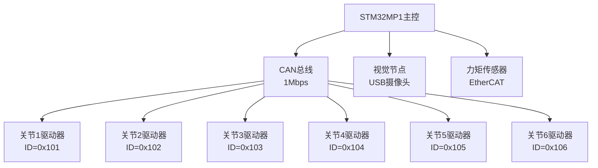
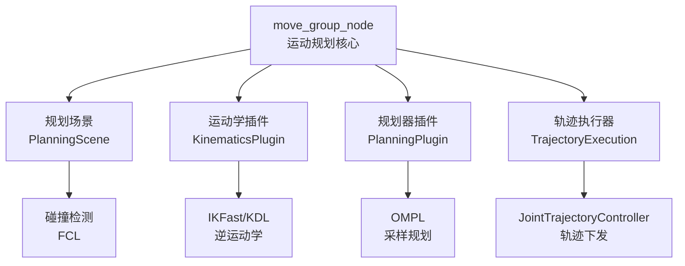
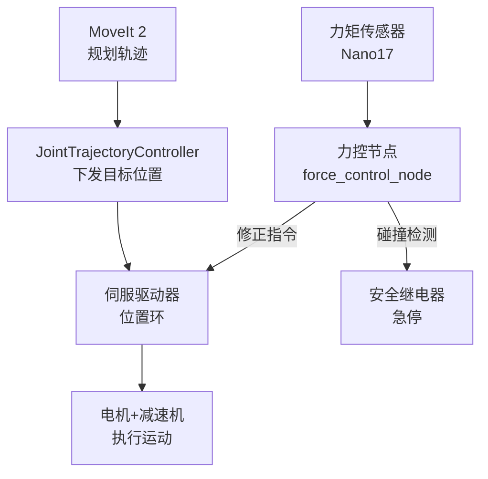
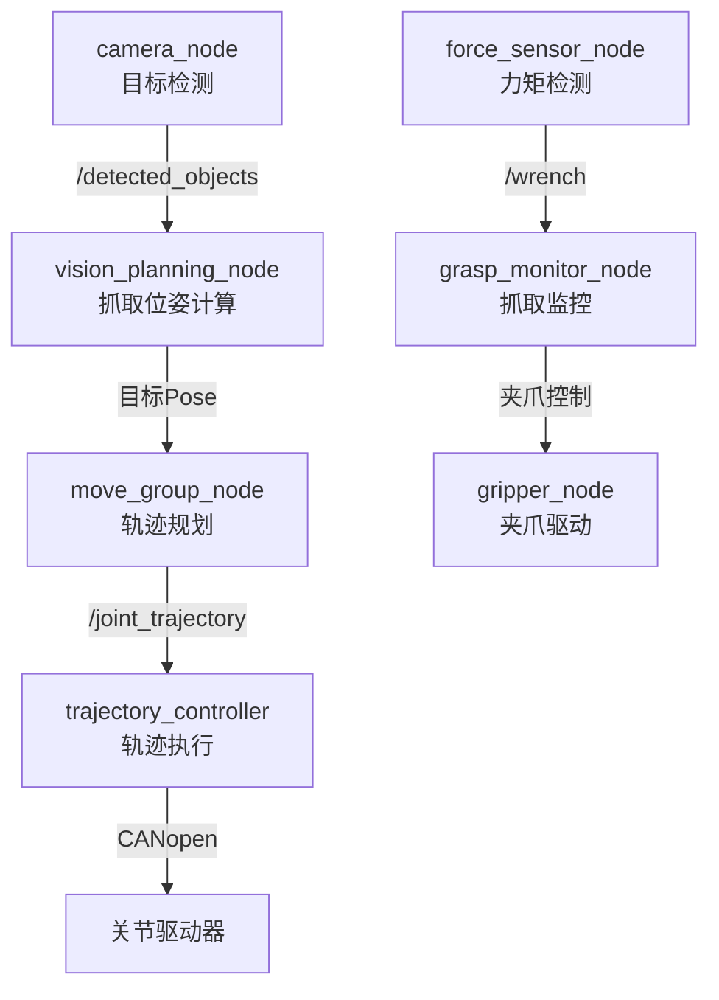

# ROS嵌入式实战：工业机械臂

> <span class="badge-e">**高级 (Expert)**</span> → <span class="badge-m">**大师 (Master)**</span>
> 以工业六轴机械臂为完整项目载体，贯通运动学解算、力控反馈、视觉抓取与交叉编译部署的工程化全链路。

---

## 核心定义与机制

---

### <strong>STM32MP1加6轴机械臂</strong>

<span class="badge-e">E</span><br>
<span class="red">工业六轴机械臂</span>是ROS 2在嵌入式场景中最具代表性的高复杂度应用。每个关节由伺服电机驱动，通过CAN总线或EtherCAT与主控通信，主控运行ROS 2节点完成运动规划与实时控制。
<br>



<span class="orange"><strong>1. 硬件架构设计：</strong></span><br>

| 组件 | 型号/规格 | 接口 | ROS节点 |
|------|-----------|------|---------|
| 主控 | STM32MP157D | - | motion_control_node |
| 关节驱动 | 汇川SV660N | CANopen | canopen_motor_node |
| 末端视觉 | HIKVISION MV-CA013-20GM | GigE | camera_node |
| 力矩传感器 | ATI Nano17 | EtherCAT | force_sensor_node |
| 安全模块 | 安全继电器+急停按钮 | GPIO | safety_monitor_node |

<span class="orange"><strong>2. CANopen关节通信协议：</strong></span><br>

| CAN ID | 类型 | 数据内容 | 语义 |
|--------|------|----------|------|
| 0x601 | SDO写 | 目标位置（32bit） | 设置关节目标角度 |
| 0x581 | SDO读 | 当前位置（32bit） | 读取关节实际角度 |
| 0x181 | PDO1 | 状态字+实际转矩 | 周期性状态反馈 |
| 0x701 | NMT | 节点控制命令 | 启动/停止/复位 |

<span class="blue">架构逻辑：CANopen是工业伺服的标准协议（CiA 301/402），ROS 2通过 `ros2_canopen` 功能包实现CANopen主站，将关节控制抽象为标准的 `JointState` 与 `JointTrajectory` 消息。</span><br>

---

### <strong>MoveIt 2运动学解算</strong>

<span class="badge-e">E</span><br>
<span class="red">MoveIt 2</span>是ROS 2官方的运动规划框架，提供正运动学（FK）、逆运动学（IK）、碰撞检测、轨迹规划与执行监控。嵌入式场景中，MoveIt 2运行在STM32MP1的A7核心上，解算后的关节轨迹通过CAN总线下发。
<br>

<span class="orange"><strong>1. MoveIt 2核心组件：</strong></span><br>



<span class="orange"><strong>2. 机械臂URDF与SRDF配置：</strong></span><br>

```xml
<!-- 文件：urdf/industrial_arm.urdf -->
<!-- 行号：1 -->
<robot name="industrial_arm">
  <link name="base_link">
    <visual>
      <geometry><cylinder radius="0.1" length="0.05"/></geometry>
    </visual>
  </link>
  
  <!-- 行号：10 -->
  <joint name="joint1" type="revolute">
    <parent link="base_link"/>
    <child link="link1"/>
    <origin xyz="0 0 0.05" rpy="0 0 0"/>
    <axis xyz="0 0 1"/>
    <limit lower="-3.14" upper="3.14" effort="100" velocity="3.0"/>
  </joint>
  
  <!-- 省略 joint2~joint6 -->
</robot>
```

**代码带读：** URDF定义机械臂的连杆几何与关节约束。`joint1` 为旋转关节，绕Z轴转动，范围±180度，最大扭矩100N·m，最大速度3rad/s。MoveIt 2读取URDF后自动生成运动学模型。SRDF（Semantic Robot Description Format）在此基础上定义规划组（Planning Group）、末端执行器与自碰撞矩阵。

<span class="orange"><strong>3. 逆运动学调用：</strong></span><br>

```cpp
// 文件：src/motion_planning_node.cpp
// 行号：20
#include <moveit/move_group_interface/move_group_interface.hpp>

class MotionPlanningNode : public rclcpp::Node {
    moveit::planning_interface::MoveGroupInterface move_group_;

public:
    MotionPlanningNode() : Node("motion_planning_node"),
        move_group_(std::shared_ptr<rclcpp::Node>(this), "manipulator") {
        
        // 行号：28
        move_group_.setPlanningTime(5.0);     // 规划超时5秒
        move_group_.setMaxVelocityScalingFactor(0.3);  // 速度限制30%
        move_group_.setMaxAccelerationScalingFactor(0.3);
    }

    bool move_to_pose(const geometry_msgs::msg::Pose &target_pose) {
        // 行号：35
        move_group_.setPoseTarget(target_pose, "end_effector_link");
        
        moveit::planning_interface::MoveGroupInterface::Plan plan;
        bool success = (move_group_.plan(plan) == 
            moveit::core::MoveItErrorCode::SUCCESS);
        
        if (success) {
            // 行号：42
            move_group_.execute(plan);         // 执行轨迹
            RCLCPP_INFO(this->get_logger(), "轨迹执行完成");
        }
        return success;
    }
};
```

**代码带读：** 第28行配置规划参数：`PlanningTime` 限制IK搜索时间，防止无限循环。`MaxVelocityScalingFactor` 限制关节速度——嵌入式场景中伺服响应能力有限，速度过高会导致跟踪误差。第35行设置末端执行器的目标位姿（位置+四元数姿态），第42行 `execute()` 将解算后的轨迹通过 `JointTrajectory` Action发送给关节控制器。

<span class="blue">MoveIt 2的嵌入式适配要点：IK解算在A7上运行（约50~200ms），解算后的轨迹通过CAN总线分段下发。轨迹点间隔通常为10~50ms，控制器做样条插值填充中间点。</span><br>

---

### <strong>力控反馈实时修正</strong>

<span class="badge-m">M</span><br>
<span class="red">力控（Force Control）</span>是工业机械臂区别于示教机械臂的核心能力——通过末端力矩传感器实时检测接触力，在检测到碰撞或过载时修正轨迹，实现"柔性接触"与"安全交互"。
<span class="green">**[M]**</span> 此节标记为扩展阅读，聚焦实时性与嵌入式实现的工程边界。<br>

<span class="orange"><strong>1. 力控闭环架构：</strong></span><br>



<span class="orange"><strong>2. 力矩读取与导纳控制：</strong></span><br>

```cpp
// 文件：src/force_control_node.cpp
// 行号：25
class ForceControlNode : public rclcpp::Node {
    rclcpp::Subscription<geometry_msgs::msg::WrenchStamped>::SharedPtr force_sub_;
    rclcpp::Publisher<trajectory_msgs::msg::JointTrajectory>::SharedPtr traj_pub_;
    
    Eigen::Vector3d current_force_;
    double force_threshold_ = 50.0;   // 力阈值50N

    void force_callback(const geometry_msgs::msg::WrenchStamped::SharedPtr msg) {
        current_force_ << msg->wrench.force.x,
                          msg->wrench.force.y,
                          msg->wrench.force.z;
        double force_mag = current_force_.norm();

        if (force_mag > force_threshold_) {
            // 行号：40
            // 导纳控制：力偏差→位置修正
            Eigen::Vector3d delta_x = (force_mag - force_threshold_) * 
                                      0.001 * current_force_.normalized();
            
            auto traj = std::make_unique<trajectory_msgs::msg::JointTrajectory>();
            traj->joint_names = {"joint1", "joint2", "joint3", 
                                 "joint4", "joint5", "joint6"};
            
            trajectory_msgs::msg::JointTrajectoryPoint point;
            // 通过IK将delta_x转换为关节角修正量
            // 此处省略IK调用代码
            point.positions = ik_solve(delta_x);
            point.time_from_start = rclcpp::Duration::from_seconds(0.01);
            traj->points.push_back(point);
            
            traj_pub_->publish(std::move(traj));
            RCLCPP_WARN(this->get_logger(), "力超限: %.1fN，执行修正", force_mag);
        }
    }
};
```

**代码带读：** 第40行实现导纳控制（Admittance Control）的核心逻辑：当末端受力超过阈值时，根据力偏差量计算位置修正量 `delta_x`，通过IK解算为关节角修正指令，实时下发给伺服。`0.001` 是导纳增益，决定机械臂的"柔顺度"。

<span class="orange"><strong>3. 实时性边界：</strong></span><br>

| 环节 | 时延要求 | 嵌入式实现 |
|------|----------|------------|
| 力矩采样 | <1ms | EtherCAT周期1ms |
| 力控计算 | <5ms | Cortex-A7单核处理 |
| 轨迹下发 | <10ms | CAN总线1Mbps |
| 伺服响应 | <1ms | 驱动器位置环1kHz |

<span class="blue">力控的实时性瓶颈不在ROS 2层，而在Linux内核的调度抖动。工业级力控通常将实时闭环放在MCU或FPGA中，ROS 2层负责"规划与监控"而非"实时控制"。</span><br>

---

### <strong>视觉抓取多节点协同</strong>

<span class="badge-e">E</span><br>
<span class="red">视觉抓取</span>是机械臂与视觉传感器协同的经典场景：摄像头识别目标物体位姿，MoveIt 2规划抓取轨迹，关节控制器执行运动，力传感器检测抓取力。
<br>

<span class="orange"><strong>1. 多节点协同架构：</strong></span><br>



<span class="orange"><strong>2. 目标检测与位姿计算节点：</strong></span><br>

```cpp
// 文件：src/vision_planning_node.cpp
// 行号：20
class VisionPlanningNode : public rclcpp::Node {
    rclcpp::Subscription<vision_msgs::msg::Detection3DArray>::SharedPtr detect_sub_;
    rclcpp::Publisher<geometry_msgs::msg::PoseStamped>::SharedPtr grasp_pub_;

    void detection_callback(const vision_msgs::msg::Detection3DArray::SharedPtr msg) {
        if (msg->detections.empty()) return;
        
        // 行号：28
        // 选择置信度最高的目标
        auto best = *std::max_element(msg->detections.begin(), 
                                      msg->detections.end(),
            [](const auto &a, const auto &b) {
                return a.results[0].hypothesis.score < b.results[0].hypothesis.score;
            });

        // 计算抓取位姿（目标上方10cm，垂直向下）
        auto grasp_pose = std::make_unique<geometry_msgs::msg::PoseStamped>();
        grasp_pose->header = msg->header;
        grasp_pose->pose.position.x = best.bbox.center.position.x;
        grasp_pose->pose.position.y = best.bbox.center.position.y;
        grasp_pose->pose.position.z = best.bbox.center.position.z + 0.1;  // 上方10cm
        grasp_pose->pose.orientation.w = 0.707;
        grasp_pose->pose.orientation.x = 0.707;   // 垂直向下
        grasp_pose->pose.orientation.y = 0;
        grasp_pose->pose.orientation.z = 0;

        grasp_pub_->publish(std::move(grasp_pose));
        RCLCPP_INFO(this->get_logger(), "目标位姿: x=%.3f y=%.3f z=%.3f",
                    grasp_pose->pose.position.x, grasp_pose->pose.position.y,
                    grasp_pose->pose.position.z);
    }
};
```

**代码带读：** 第28行从Detection3DArray中选择置信度最高的检测目标。抓取位姿设计为"目标上方10cm垂直向下"——这是两指夹爪的标准抓取预置位姿。`pose.orientation` 使用四元数表示末端姿态，`w=0.707, x=0.707` 表示绕X轴旋转90度（垂直向下）。

<span class="orange"><strong>3. 抓取状态机：</strong></span><br>

```cpp
// 文件：src/grasp_monitor_node.cpp
// 行号：15
enum class GraspState { IDLE, APPROACH, GRASP, LIFT, PLACE };

class GraspMonitorNode : public rclcpp::Node {
    GraspState state_ = GraspState::IDLE;
    
    void wrench_callback(const geometry_msgs::msg::WrenchStamped::SharedPtr msg) {
        switch (state_) {
            case GraspState::APPROACH:
                if (std::abs(msg->wrench.force.z) > 5.0) {
                    // 接触检测：Z向力>5N表示已接触物体
                    state_ = GraspState::GRASP;
                    send_gripper_command(true);    // 关闭夹爪
                    RCLCPP_INFO(this->get_logger(), "接触检测，关闭夹爪");
                }
                break;
            case GraspState::GRASP:
                if (std::abs(msg->wrench.force.z) > 20.0) {
                    // 抓取确认：夹紧力>20N
                    state_ = GraspState::LIFT;
                    send_lift_command();
                }
                break;
            // 省略 LIFT / PLACE
        }
    }
};
```

**代码带读：** 抓取流程按状态机顺序执行：接近（APPROACH）→力传感器检测到接触后转入抓取（GRASP）→夹爪关闭→检测夹紧力→转入提升（LIFT）。每个状态转换由力反馈触发，确保"感知-决策-执行"闭环。

<span class="blue">多节点协同的核心挑战：时间同步。摄像头的图像时间戳、机械臂的关节状态时间戳、力传感器的时间戳必须使用同一时钟源（推荐 `use_sim_time=false` 时的系统时钟），否则位姿计算会产生时空错位。</span><br>

---

### <strong>交叉编译与部署</strong>

<span class="badge-e">E</span><br>
<span class="red">交叉编译</span>是将ROS 2节点从x86开发机编译为ARM（STM32MP1）可执行文件的必要步骤。STM32MP1资源有限，不适合在设备本地编译。
<br>

<span class="orange"><strong>1. 交叉编译工具链准备：</strong></span><br>

```bash
# 安装ARM64交叉编译器（Ubuntu开发机）
$ sudo apt install gcc-aarch64-linux-gnu g++-aarch64-linux-gnu

# 下载STM32MP1的SDK（包含sysroot与CMake工具链文件）
$ wget https://wiki.st.com/stm32mpu/.../sdk-stm32mp1.sh
$ ./sdk-stm32mp1.sh

# 初始化SDK环境
$ source /opt/st/stm32mp1/3.1-openstlinux/environment-setup-cortexa7t2hf-neon-vfpv4-ostl-linux-gnueabi
```

<span class="orange"><strong>2. 交叉编译CMake配置：</strong></span><br>

```cmake
# 文件：CMakeLists.txt（交叉编译适配）
# 行号：1
cmake_minimum_required(VERSION 3.8)
project(industrial_arm)

# 行号：5
if(CMAKE_CROSSCOMPILING)
    # 使用工具链的sysroot
    set(CMAKE_SYSROOT $ENV{SDKTARGETSYSROOT})
    set(CMAKE_FIND_ROOT_PATH ${CMAKE_SYSROOT})
    set(CMAKE_FIND_ROOT_PATH_MODE_PROGRAM NEVER)
    set(CMAKE_FIND_ROOT_PATH_MODE_LIBRARY ONLY)
    set(CMAKE_FIND_ROOT_PATH_MODE_INCLUDE ONLY)
endif()

# 行号：14
find_package(ament_cmake REQUIRED)
find_package(rclcpp REQUIRED)
find_package(moveit_ros_planning_interface REQUIRED)
find_package(trajectory_msgs REQUIRED)

# 省略：add_executable、target_link_libraries、ament_package
```

**代码带读：** 第5行检测交叉编译标志，若启用则配置sysroot路径——sysroot包含STM32MP1的库文件与头文件，确保编译时链接的库版本与目标设备一致。`CMAKE_FIND_ROOT_PATH_MODE_LIBRARY ONLY` 强制CMake只在sysroot中搜索库文件，避免链接开发机的x86库。

<span class="orange"><strong>3. Colcon交叉编译命令：</strong></span><br>

```bash
# 文件：build_cross.sh
# 行号：1
#!/bin/bash
source /opt/ros/humble/setup.bash
source /opt/st/stm32mp1/3.1-openstlinux/environment-setup-cortexa7t2hf-neon-vfpv4-ostl-linux-gnueabi

# 行号：6
colcon build \
    --merge-install \
    --cmake-args \
        -DCMAKE_TOOLCHAIN_FILE=$OECORE_NATIVE_SYSROOT/usr/share/cmake/OEToolchainConfig.cmake \
        -DCMAKE_BUILD_TYPE=Release \
        -DBUILD_TESTING=OFF \
    --packages-select industrial_arm canopen_driver vision_planning

# 行号：15
# 打包部署产物
rsync -avz install/ robot@192.168.1.100:/home/robot/ws/
```

**代码带读：** 第6行指定 `OEToolchainConfig.cmake` 为工具链文件，这是Yocto/OpenEmbedded SDK生成的标准CMake配置文件，自动设置编译器、链接器标志与sysroot。`--merge-install` 将所有包的install目录合并，简化部署。第15行通过rsync将编译产物同步到STM32MP1的 `/home/robot/ws/` 目录。

<span class="orange"><strong>4. 目标设备运行配置：</strong></span><br>

```bash
# STM32MP1上source环境并启动
$ source /home/robot/ws/install/setup.bash
$ export ROS_DOMAIN_ID=20
$ ros2 launch industrial_arm arm_bringup.launch.py
```

<span class="blue">交叉编译的工程要点：开发机编译速度比STM32MP1快10~50倍；sysroot必须与目标设备的根文件系统版本一致；Release模式比Debug模式体积小50%以上，且运行速度快2~3倍。</span><br>

---

## 历史演进与前沿

---

### <strong>工业机械臂的ROS化历程</strong>

<span class="badge-m">M</span><br>
<span class="red">工业机械臂</span>从封闭式专用控制器走向开放式ROS生态，经历了三个阶段的架构变革。
<br>

| 阶段 | 时间 | 控制器特征 | ROS角色 |
|------|------|-----------|---------|
| 专用控制器期 | 2000-2010 | 封闭式PLC/专用芯片 | 无，仅仿真 |
| PC-based期 | 2010-2018 | x86工控机+实时补丁 | ROS 1运行轨迹规划 |
| 嵌入式融合期 | 2018至今 | ARM SoC+ROS 2+实时内核 | 全栈运行，边缘计算 |

<span class="blue">演进逻辑：专用控制器可靠性高但封闭；PC-based开放但体积大、功耗高；ARM SoC+ROS 2的方案在"开放性"与"嵌入性"之间取得平衡，是当前工业协作机器人的主流架构。</span><br>

---

## 本章小结

| 知识点 | 核心内容 | 难度 |
|--------|----------|------|
| 硬件架构 | STM32MP1+CANopen六轴+EtherCAT力矩 | E |
| MoveIt 2 | URDF/SRDF配置+IK+轨迹规划执行 | E |
| 力控反馈 | 导纳控制+实时修正+安全边界 | M |
| 视觉抓取 | 目标检测→位姿计算→轨迹执行→力监控 | E |
| 交叉编译 | SDK工具链+sysroot+rsync部署 | E |

---

## 课后练习

1. **推导题**：为什么力控的实时闭环不适合放在ROS 2节点中？从Linux内核调度延迟（CFS调度器）、ROS 2 Executor回调抖动、CAN总线传输时延三个维度推导。
2. **设计题**：设计一个六轴机械臂的URDF关节表，包含每个关节的DH参数（a, alpha, d, theta）、限位角度、最大速度与扭矩。要求覆盖典型的"垂直串联"构型。
3. **实操题**：在x86开发机上配置交叉编译环境，将一个最小ROS 2节点（Hello World级）编译为ARM可执行文件，通过 `file` 命令验证输出格式为ARM ELF，然后rsync到目标设备运行。
