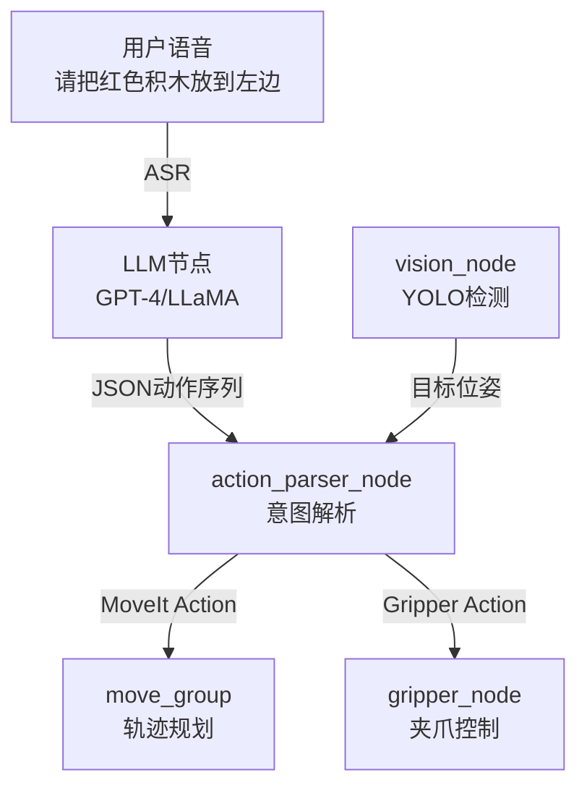

# ROS工程化与前沿趋势

> <span class="badge-e">**高级 (Expert)**</span> → <span class="badge-m">**大师 (Master)**</span>
> 从单体节点开发走向工程化交付，掌握构建、调试、实时性、插件与AI融合的全栈能力，洞察技术演进方向。

---

## 核心定义与机制

---

### <strong>Colcon构建与CI-CD</strong>

<span class="badge-e">E</span><br>
<span class="red">Colcon</span>是ROS 2的标准构建工具，替代了ROS 1的catkin_make，提供并行编译、增量构建与多包依赖解析能力。工程化场景下，Colcon与CI-CD（持续集成/持续部署）流水线结合，实现代码提交后的自动构建、测试与部署。<br>

<span class="orange"><strong>1. Colcon核心命令：</strong></span><br>

| 命令 | 作用 | 工程化场景 |
|------|------|------------|
| `colcon build` | 编译工作空间全部包 | 日常开发 |
| `colcon build --packages-select pkg` | 只编译指定包 | 增量开发 |
| `colcon build --cmake-args -DCMAKE_BUILD_TYPE=Release` | Release优化 | 生产部署 |
| `colcon test` | 运行单元测试 | 质量门禁 |
| `colcon test-result --verbose` | 查看测试结果 | 故障定位 |

<span class="orange"><strong>2. 工作空间结构设计：</strong></span><br>

```bash
# 文件：目录结构
# 行号：参考
robot_ws/
├── src/
│   ├── robot_description/          # URDF/SRDF/Rviz配置
│   ├── robot_bringup/              # Launch文件与系统启动
│   ├── sensor_drivers/             # 传感器驱动节点
│   ├── motion_control/             # 运动控制节点
│   ├── planning/                   # MoveIt配置与规划插件
│   └── utils/                      # 公共库与消息定义
├── build/                          # 编译中间产物
├── install/                        # 安装产物
└── log/                            # 编译日志
```

**结构逻辑：** `robot_bringup` 包依赖所有其他包，作为系统集成入口；`sensor_drivers` 与 `motion_control` 按硬件域分离；`planning` 包包含MoveIt配置与自定义规划器插件。`utils` 包存放公共消息定义与工具函数，被多个包共享。

<span class="orange"><strong>3. GitHub Actions CI-CD流水线：</strong></span><br>

```yaml
# 文件：.github/workflows/ros2-ci.yml
# 行号：1
name: ROS 2 CI

on:
  push:
    branches: [ main, develop ]
  pull_request:
    branches: [ main ]

jobs:
  build:
    runs-on: ubuntu-22.04
    container:
      image: ros:humble-ros-base
    
    # 行号：15
    steps:
      - uses: actions/checkout@v4
      
      - name: Setup ROS 2
        run: |
          apt-get update
          rosdep update
          rosdep install --from-paths src --ignore-src -y
      
      # 行号：23
      - name: Build
        run: |
          source /opt/ros/humble/setup.bash
          colcon build --cmake-args -DCMAKE_BUILD_TYPE=Release
      
      - name: Test
        run: |
          source /opt/ros/humble/setup.bash
          colcon test
          colcon test-result --verbose
      
      # 行号：34
      - name: Deploy to Artifacts
        uses: actions/upload-artifact@v4
        with:
          name: install
          path: install/
```

**代码带读：** 第15行基于 `ros:humble-ros-base` 容器镜像，确保构建环境与目标设备一致。第23行 `rosdep install` 自动解析并安装功能包的系统依赖。第34行将编译产物 `install/` 上传为CI Artifact，供后续部署阶段下载。

<span class="blue">CI-CD的工程价值：代码提交即触发构建，问题在合并前暴露；Release模式构建产物可直接用于嵌入式部署；测试门禁确保质量不随迭代退化。</span><br>

---

### <strong>调试工具链</strong>

<span class="badge-e">E</span><br>
<span class="red">ROS 2调试工具链</span>覆盖日志、话题监控、节点拓扑可视化、性能剖析与远程调试五个维度，是嵌入式场景故障排查的核心能力。<br>

<span class="orange"><strong>1. 日志与话题监控：</strong></span><br>

| 工具 | 命令 | 用途 |
|------|------|------|
| rqt_console | `ros2 run rqt_console rqt_console` | GUI日志查看与过滤 |
| topic_echo | `ros2 topic echo /topic` | 实时打印消息内容 |
| topic_hz | `ros2 topic hz /topic` | 测量实际发布频率 |
| topic_bw | `ros2 topic bw /topic` | 测量话题带宽占用 |
| node_info | `ros2 node info /node` | 查看节点的Pub/Sub/Service |

<span class="orange"><strong>2. 节点拓扑可视化：</strong></span><br>

```bash
# 生成节点拓扑图（Graphviz DOT格式）
$ ros2 run rqt_graph rqt_graph

# 命令行查看节点关系
$ ros2 node list
$ ros2 topic list -t   # 显示话题类型
```

<span class="orange"><strong>3. 性能剖析（perf + ROS 2）：</strong></span><br>

```bash
# 1. 记录节点的CPU热点
$ sudo perf record -p $(pgrep -f my_node) -g -- sleep 30

# 2. 生成火焰图
$ sudo perf script | stackcollapse-perf.pl | flamegraph.pl > node_flame.svg

# 3. 查看ROS 2回调延迟统计
$ ros2 topic echo /statistics   # 开启ros2_tracing后
```

**说明：** `perf` 是Linux内核的性能剖析工具，通过采样调用栈定位CPU热点。嵌入式场景中，ROS节点CPU占用过高通常由三个根因导致：回调函数执行耗时过长、消息序列化开销过大、定时器频率设置不合理。火焰图可直观呈现时间消耗的函数分布。

<span class="orange"><strong>4. 远程GDB调试：</strong></span><br>

```bash
# STM32MP1上启动gdbserver
$ gdbserver :2345 ./my_node

# 开发机上连接远程调试
$ aarch64-linux-gnu-gdb ./my_node
(gdb) target remote 192.168.1.100:2345
(gdb) continue
```

<span class="blue">调试优先级：日志定位"发生了什么问题"，话题监控定位"数据是否流动"，perf定位"哪里消耗了资源"，GDB定位"为什么崩溃"。嵌入式场景优先使用命令行工具而非GUI（节省目标设备资源）。</span><br>

---

### <strong>实时性优化（PREEMPT_RT+QoS）</strong>

<span class="badge-m">M</span><br>
<span class="red">实时性优化</span>是工业级ROS 2部署的核心门槛。Linux默认的CFS调度器无法保证任务的确定性执行时延，需通过PREEMPT_RT内核补丁将Linux改造为软实时操作系统，再结合ROS 2的QoS策略实现端到端的时延控制。
<span class="green">**[M]**</span> 此节标记为扩展阅读，聚焦实时内核与调度理论。<br>

<span class="orange"><strong>1. PREEMPT_RT内核补丁原理：</strong></span><br>

| 内核类型 | 调度特性 | 最大调度延迟 | 适用场景 |
|----------|----------|--------------|----------|
| 通用内核（CFS） | 公平调度，任务可抢占 | 1~10ms | 通用应用 |
| PREEMPT_VOLUNTARY | 自愿抢占点 | 1~5ms | 桌面响应 |
| PREEMPT | 全内核抢占 | 100μs~1ms | 低延迟应用 |
| PREEMPT_RT | 线程化中断+优先级继承 | 10~100μs | 硬实时控制 |

<span class="orange"><strong>2. PREEMPT_RT内核编译与部署：</strong></span><br>

```bash
# 文件：build_rt_kernel.sh
# 行号：1
#!/bin/bash
# 下载主线内核与PREEMPT_RT补丁
wget https://cdn.kernel.org/pub/linux/kernel/v6.x/linux-6.1.tar.xz
wget https://mirrors.edge.kernel.org/pub/linux/kernel/projects/rt/6.1/patch-6.1-rt1.patch.xz

# 行号：7
tar xf linux-6.1.tar.xz
cd linux-6.1
xzcat ../patch-6.1-rt1.patch.xz | patch -p1

# 配置实时内核选项
make ARCH=arm stm32mp1_defconfig
# 行号：13
./scripts/config --enable CONFIG_PREEMPT_RT
./scripts/config --enable CONFIG_HIGH_RES_TIMERS
make ARCH=arm CROSS_COMPILE=arm-linux-gnueabihf- -j$(nproc)
```

**代码带读：** 第7行将PREEMPT_RT补丁应用到主线内核。第13行启用 `CONFIG_PREEMPT_RT` 与 `CONFIG_HIGH_RES_TIMERS`——前者将中断处理线程化并引入优先级继承机制，后者提供微秒级定时器分辨率。

<span class="orange"><strong>3. ROS 2节点实时调度配置：</strong></span><br>

```cpp
// 文件：src/rt_node.cpp
// 行号：15
#include <pthread.h>

class RealtimeNode : public rclcpp::Node {
    void setup_realtime_scheduling() {
        // 行号：20
        struct sched_param param;
        param.sched_priority = 80;           // 实时优先级80（SCHED_FIFO）
        int ret = pthread_setschedparam(pthread_self(), SCHED_FIFO, &param);
        if (ret != 0) {
            RCLCPP_ERROR(this->get_logger(), "设置实时调度失败: %d", ret);
        }

        // 内存锁定，防止缺页中断
        // 行号：28
        if (mlockall(MCL_CURRENT | MCL_FUTURE) == -1) {
            RCLCPP_ERROR(this->get_logger(), "内存锁定失败");
        }
    }
};
```

**代码带读：** 第20行将节点主线程设置为 `SCHED_FIFO` 实时调度策略，优先级80（范围1~99，越高越优先）。`SCHED_FIFO` 的任务一旦获得CPU不会被同优先级或更低优先级的任务抢占。第28行 `mlockall()` 将进程的当前与未来内存页锁定在物理内存中，防止运行时缺页中断引入的不可预测延迟。

<span class="orange"><strong>4. 实时QoS配置策略：</strong></span><br>

| 场景 | QoS配置 | 时延目标 |
|------|---------|----------|
| 电机控制指令 | reliable + deadline(10ms) + keep_last(1) | <10ms |
| 关节状态反馈 | best_effort + deadline(5ms) + keep_last(1) | <5ms |
| 传感器数据 | best_effort + lifespan(50ms) + keep_last(1) | <50ms |
| 规划轨迹点 | reliable + deadline(100ms) + keep_last(5) | <100ms |

<span class="blue">实时性的本质约束：PREEMPT_RT使Linux调度延迟从毫秒级降至微秒级，但ROS 2的DDS通信层仍有不可忽略的开销（序列化、网络传输）。"硬实时控制"应放在MCU/FPGA中，ROS 2层负责"准实时规划与监控"。</span><br>

---

### <strong>插件机制</strong>

<span class="badge-e">E</span><br>
<span class="red">ROS 2插件（Plugin）机制</span>基于 `pluginlib` 库实现运行时动态加载，允许在不重新编译主程序的前提下替换算法实现。MoveIt 2的运动学插件、规划器插件、传感器插件均基于此架构。<br>

<span class="orange"><strong>1. 插件接口定义：</strong></span><br>

```cpp
// 文件：include/my_planner/planner_interface.hpp
// 行号：1
#ifndef MY_PLANNER__PLANNER_INTERFACE_HPP_
#define MY_PLANNER__PLANNER_INTERFACE_HPP_

#include <rclcpp/rclcpp.hpp>
#include <geometry_msgs/msg/pose.hpp>
#include <trajectory_msgs/msg/joint_trajectory.hpp>

namespace my_planner {

// 行号：10
class PlannerInterface {
public:
    virtual ~PlannerInterface() = default;
    
    virtual bool initialize(const rclcpp::Node::SharedPtr &node) = 0;
    virtual bool plan(const geometry_msgs::msg::Pose &target,
                      trajectory_msgs::msg::JointTrajectory &trajectory) = 0;
};

}  // namespace my_planner

#endif
```

<span class="orange"><strong>2. 插件实现与注册：</strong></span><br>

```cpp
// 文件：src/rrt_planner.cpp
// 行号：15
#include "my_planner/planner_interface.hpp"
#include <pluginlib/class_list_macros.hpp>

namespace my_planner {

class RRTPlanner : public PlannerInterface {
    rclcpp::Node::SharedPtr node_;
public:
    bool initialize(const rclcpp::Node::SharedPtr &node) override {
        node_ = node;
        RCLCPP_INFO(node_->get_logger(), "RRT规划器初始化");
        return true;
    }

    bool plan(const geometry_msgs::msg::Pose &target,
              trajectory_msgs::msg::JointTrajectory &trajectory) override {
        // 此处省略RRT算法实现
        return true;
    }
};

}  // namespace my_planner

// 行号：40
PLUGINLIB_EXPORT_CLASS(my_planner::RRTPlanner, my_planner::PlannerInterface)
```

**代码带读：** 第40行 `PLUGINLIB_EXPORT_CLASS` 宏将 `RRTPlanner` 类注册为 `PlannerInterface` 接口的实现。编译后生成 `.so` 动态库，运行时通过 `pluginlib::ClassLoader` 加载。

<span class="orange"><strong>3. 插件加载与使用：</strong></span><br>

```cpp
// 文件：src/planner_loader.cpp
// 行号：20
#include <pluginlib/class_loader.hpp>
#include "my_planner/planner_interface.hpp"

pluginlib::ClassLoader<my_planner::PlannerInterface> loader(
    "my_planner", "my_planner::PlannerInterface"
);

// 行号：26
auto planner = loader.createSharedInstance("my_planner::RRTPlanner");
planner->initialize(node);
planner->plan(target_pose, trajectory);
```

**代码带读：** 第20行创建 `ClassLoader`，指定基类与包名。第26行通过类名字符串动态创建实例——类名在XML插件描述文件中注册。这种"按名加载"机制使规划器可在配置文件中切换（如从RRT换为A*），无需重新编译。

<span class="orange"><strong>4. 插件描述文件（XML）：</strong></span><br>

```xml
<!-- 文件：my_planner_plugin.xml -->
<library path="my_planner_plugins">
  <class name="my_planner::RRTPlanner" 
         type="my_planner::RRTPlanner" 
         base_class_type="my_planner::PlannerInterface">
    <description>RRT路径规划器实现</description>
  </class>
  <class name="my_planner::AStarPlanner" 
         type="my_planner::AStarPlanner" 
         base_class_type="my_planner::PlannerInterface">
    <description>A*路径规划器实现</description>
  </class>
</library>
```

<span class="blue">插件的工程价值：算法迭代与主程序解耦。规划团队持续优化RRT变体，控制团队无需修改调用代码——只需替换.so文件并更新XML配置。</span><br>

---

### <strong>AI融合（YOLO+SLAM）</strong>

<span class="badge-m">M</span><br>
<span class="red">AI与ROS 2的融合</span>是当前机器人领域最具活力的技术方向。YOLO（目标检测）与SLAM（同步定位与建图）是两大代表性应用场景，分别解决"看得清"与"知道在哪"的问题。
<span class="green">**[M]**</span> 此节标记为扩展阅读，聚焦模型部署与推理优化。<br>

<span class="orange"><strong>1. YOLO目标检测节点架构：</strong></span><br>

```mermaid
flowchart TD
    A["camera_node\nUSB摄像头"] --|"/camera/image_raw"| B["yolo_detect_node\nTensorRT推理"]
    B --|"/detections"| C["tracking_node\n多目标跟踪"]
    C --|"/tracked_objects"| D["planning_node\n避障/抓取"]
    B --|"渲染结果"| E["compressed_image_pub\n远程监控"]
```

<span class="orange"><strong>2. TensorRT推理节点实现：</strong></span><br>

```cpp
// 文件：src/yolo_tensorrt_node.cpp
// 行号：20
#include <NvInfer.h>
#include <cuda_runtime_api.h>

class YoloTensorRTNode : public rclcpp::Node {
    nvinfer1::ICudaEngine *engine_;
    nvinfer1::IExecutionContext *context_;
    void *buffers_[2];   // GPU缓冲区
    cudaStream_t stream_;

    rclcpp::Subscription<sensor_msgs::msg::Image>::SharedPtr img_sub_;
    rclcpp::Publisher<vision_msgs::msg::Detection2DArray>::SharedPtr detect_pub_;

    void image_callback(const sensor_msgs::msg::Image::SharedPtr msg) {
        // 行号：35
        // ROS Image → GPU预处理（BGR→RGB，归一化，letterbox）
        preprocess(msg->data, buffers_[0], stream_);
        
        // 异步推理
        context_->enqueueV3(stream_);
        cudaStreamSynchronize(stream_);
        
        // 后处理：NMS + 阈值过滤
        auto detections = postprocess(buffers_[1], msg->header);
        detect_pub_->publish(detections);
    }

public:
    YoloTensorRTNode() : Node("yolo_tensorrt_node") {
        // 行号：48
        // 加载TensorRT引擎（.plan文件由onnx导出）
        std::ifstream engine_file("yolov8n.plan", std::ios::binary);
        // 省略引擎反序列化代码
        
        img_sub_ = this->create_subscription<sensor_msgs::msg::Image>(
            "/camera/image_raw", 1,
            std::bind(&YoloTensorRTNode::image_callback, this, std::placeholders::_1));
        detect_pub_ = this->create_publisher<vision_msgs::msg::Detection2DArray>(
            "/detections", 10);
    }
};
```

**代码带读：** 第35行 `preprocess()` 将ROS图像消息上传到GPU，执行颜色空间转换与张量归一化。`enqueueV3()` 是TensorRT的异步推理API，推理完成后通过 `cudaStreamSynchronize()` 等待结果。第48行从 `.plan` 文件加载预编译的TensorRT引擎——该文件由ONNX模型通过 `trtexec` 工具导出，包含针对目标GPU（如Jetson Nano的Maxwell架构）优化的算子融合与量化策略。

<span class="orange"><strong>3. SLAM建图节点集成：</strong></span><br>

| SLAM方案 | 传感器需求 | ROS 2状态 | 嵌入式适配 |
|----------|------------|-----------|------------|
| Cartographer | 激光雷达+IMU | 官方ROS 2支持 | 中等算力 |
| ORB-SLAM3 | 单目/双目+IMU | 社区移植中 | 高算力（GPU加速） |
| LIO-SAM | 激光雷达+IMU | ROS 2 Fork | 中等算力 |
| RTAB-Map | RGB-D/双目 | 官方ROS 2支持 | 可调参数适配嵌入式 |

<span class="orange"><strong>4. AI推理的嵌入式优化：</strong></span><br>

| 优化手段 | 方法 | 效果 |
|----------|------|------|
| 模型量化 | FP32→INT8 | 体积减75%，速度提升2~4倍 |
| 算子融合 | Conv+BN+ReLU合并 | 减少内存搬运 |
| 动态批处理 | batch=1固定 | 降低延迟 |
| 推理异步化 | enqueue + callback | 不阻塞ROS回调 |
| 分辨率降级 | 640×640→320×320 | 速度提升4倍，精度微降 |

<span class="blue">AI融合的嵌入式边界：YOLO在Jetson Nano上可达30FPS（YOLOv8n），在STM32MP1上仅2~5FPS——需降级模型或外接NPU。SLAM建图建议在边缘侧（Jetson/NX）运行，STM32MP1只做定位结果订阅与执行。</span><br>

---

### <strong>技术趋势：大模型+ROS</strong>

<span class="badge-m">M</span><br>
<span class="red">大语言模型（LLM）与ROS 2的融合</span>是2024年以来的新兴方向，核心思路是将自然语言指令转化为ROS动作序列，实现"说人话"控制机器人。
<span class="green">**[M]**</span> 此节标记为扩展阅读，聚焦技术可行性与工程边界。<br>

<span class="orange"><strong>1. LLM→ROS的指令解析架构：</strong></span><br>



<span class="orange"><strong>2. LLM提示工程（Prompt Engineering）：</strong></span><br>

```python
# 文件：src/llm_ros_bridge.py
# 行号：15
SYSTEM_PROMPT = """
你是一个机器人控制系统。将用户的自然语言指令转换为JSON动作序列。
可用动作：move(x, y, z), grasp(), release(), scan()

示例：
用户："把桌子上的苹果拿起来"
输出：[
    {"action": "scan", "target": "apple"},
    {"action": "move", "x": 0.5, "y": 0.2, "z": 0.1},
    {"action": "grasp"},
    {"action": "move", "x": 0.5, "y": 0.2, "z": 0.3}
]
"""

def parse_instruction(instruction: str) -> list:
    response = openai.ChatCompletion.create(
        model="gpt-4",
        messages=[
            {"role": "system", "content": SYSTEM_PROMPT},
            {"role": "user", "content": instruction}
        ],
        temperature=0.2   # 低温度，输出更确定
    )
    return json.loads(response.choices[0].message.content)
```

**代码带读：** 第15行定义系统提示词，约束LLM的输出格式为JSON动作数组。`temperature=0.2` 降低模型输出的随机性，确保相同输入产生确定性动作序列。`parse_instruction()` 调用OpenAI API将语音指令转化为结构化动作，下游节点解析JSON后调用对应ROS Action。

<span class="orange"><strong>3. 技术可行性与边界：</strong></span><br>

| 维度 | 当前状态 | 工程挑战 |
|------|----------|----------|
| 指令解析 | GPT-4准确率>90% | 延迟2~5秒，不适合实时控制 |
| 场景泛化 | 训练内场景稳定 | 新场景需微调（少样本学习） |
| 安全约束 | 需人工审核动作序列 | LLM幻觉可能生成危险指令 |
| 离线部署 | LLaMA-7B可在Jetson运行 | 推理速度10 token/s，体验受限 |

<span class="blue">趋势判断：2024-2026年，大模型+ROS将停留在"人机交互层"（语音指令→动作规划），不会替代底层的实时控制。关键安全操作（急停、力超限）仍需硬编码规则，LLM只负责"意图理解"与"高层规划"。</span><br>

---

## 历史演进与前沿

---

### <strong>ROS工程化的技术演进</strong>

<span class="badge-m">M</span><br>
<span class="red">ROS工程化</span>的演进映射了机器人开发从"黑客式原型"到"产品级交付"的成熟度跃迁。<br>

| 阶段 | 时间 | 工程特征 | 技术标志 |
|------|------|----------|----------|
| 脚本化期 | 2007-2012 | shell脚本启动，无版本管理 | roslaunch XML |
| 模块化期 | 2012-2018 | catkin构建，功能包拆分 | catkin_make |
| 工程化期 | 2018-2022 | colcon构建，CI/CD引入 | colcon + Jenkins |
| 智能化期 | 2022至今 | AI模型集成，大模型交互 | TensorRT + LLM |

<span class="blue">演进逻辑：工程化水平决定机器人产品能否走出实验室。构建工具、测试门禁、实时内核、插件架构——每一项都是产品化的必要基础设施。</span><br>

---

## 本章小结

| 知识点 | 核心内容 | 难度 |
|--------|----------|------|
| Colcon构建 | 并行编译、增量构建、CI/CD流水线 | E |
| 调试工具链 | 日志/话题/perf/GDB四层定位 | E |
| 实时性优化 | PREEMPT_RT内核+SCHED_FIFO+内存锁定 | M |
| 插件机制 | pluginlib动态加载+运行时切换 | E |
| AI融合 | TensorRT推理+SLAM建图+分辨率降级 | M |
| 大模型趋势 | LLM意图解析+JSON动作序列+安全边界 | M |

---

## 课后练习

1. **推导题**：为什么PREEMPT_RT内核的"线程化中断"机制能将调度延迟从毫秒级降至微秒级？从"中断上下文"与"任务上下文"的切换开销差异推导。
2. **设计题**：为一个工业检测机器人设计CI-CD流水线，包含：代码提交触发→静态检查（clang-tidy）→交叉编译（ARM64）→单元测试→生成部署包（deb）。用GitHub Actions YAML描述完整流程。
3. **实操题**：在开发机上使用TensorRT的 `trtexec` 工具将一个ONNX模型（如YOLOv8n）导出为 `.plan` 引擎文件，用 `perf` 对比FP32与INT8模式的推理延迟，记录火焰图中的热点函数。
