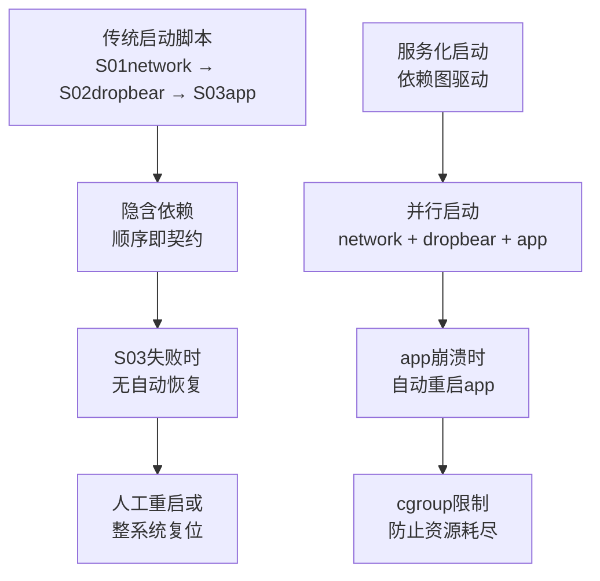
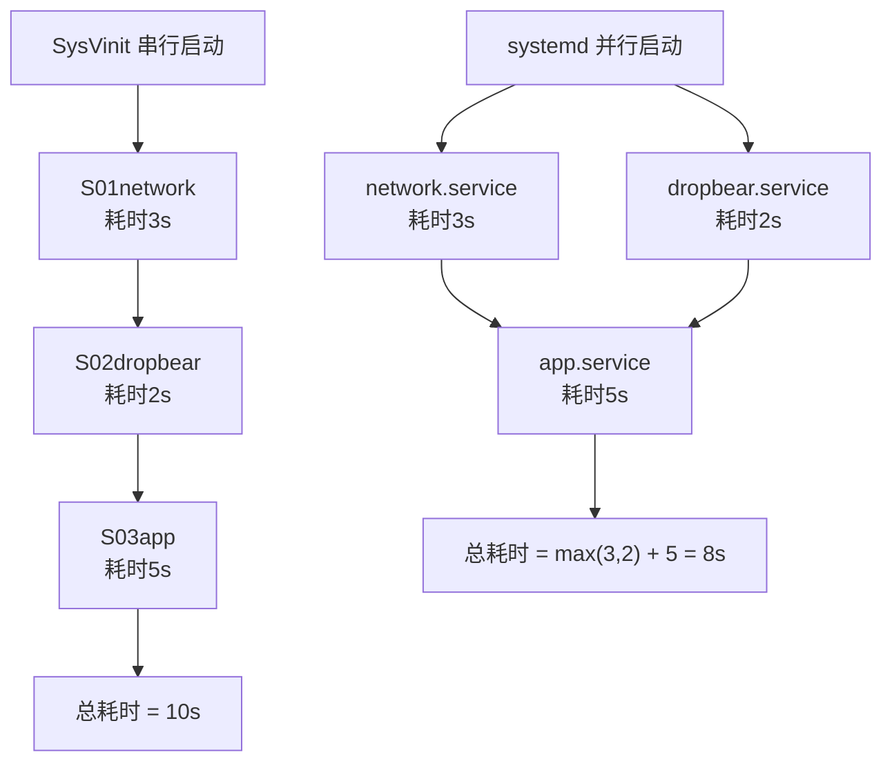

# 系统服务化基础认知

> <span class="badge-b">**入门 (Beginner)**</span>
> 理解为什么嵌入式系统需要服务化，掌握守护进程与普通进程的区别，了解SysVinit、systemd、upstart的演化历程。

---

## 为什么需要服务化

---

### <strong>嵌入式系统的进程管理困境</strong>

<span class="badge-b">B</span><br>
<span class="red">系统服务化</span>是将系统功能拆分为独立、可管理、可恢复的守护进程集合的过程。<br>
嵌入式设备不是运行单一程序，而是协调传感器采集、网络通信、日志存储、远程升级等多个生命周期不同的任务。<br>

<span class="orange"><strong>1. 无序启动的混乱：</strong></span><br>
没有服务框架时，各模块通过脚本顺序启动，依赖关系隐含在启动顺序中。<span class="green">网络服务先于依赖它的应用启动</span>会导致应用崩溃重试，浪费时间。<br>

<span class="orange"><strong>2. 故障的级联传播：</strong></span><br>
一个关键模块崩溃无人处理，可能导致整个系统功能丧失。<span class="green">看门狗只能重启整台设备</span>，无法单独恢复单个服务。<br>

<span class="orange"><strong>3. 资源竞争与隔离缺失：</strong></span><br>
所有进程平等竞争CPU和内存，恶意或故障进程可能耗尽资源导致系统瘫痪。<br>



<span class="blue">关键洞察：服务化不是增加复杂度，而是将隐含的启动顺序和恢复逻辑显式化、自动化。</span><br>

---

## 守护进程vs普通进程

---

### <strong>守护进程的五大特征</strong>

<span class="badge-b">B</span><br>
<span class="red">守护进程（Daemon）</span>是在后台持续运行、不与控制终端交互的系统服务进程。<br>

| 特征 | 普通进程 | 守护进程 |
|------|---------|---------|
| 终端关联 | 绑定stdin/stdout/stderr | 脱离终端，重定向到/dev/null或日志 |
| 父进程 | 通常是shell | 通常是init（PID=1）或systemd |
| 工作目录 | 继承启动目录 | 切换至根目录或专用目录 |
| 会话归属 | 继承shell会话 | 创建新会话（setsid），成为会话首进程 |
| 重启策略 | 无 | 崩溃自动重启、依赖就绪后启动 |

<span class="orange"><strong>1. 脱离终端：</strong></span><br>
守护进程必须调用<span class="green">setsid()</span>创建新会话，使控制终端信号（SIGHUP等）不影响自身。<br>

<span class="orange"><strong>2. 关闭标准文件描述符：</strong></span><br>
标准输入输出重定向到<span class="green">/dev/null</span>，避免终端断开导致SIGPIPE或输出阻塞。<br>

```c
// 文件路径：daemonize.c
// 功能：经典守护进程化流程
// 行号：1-25
#include <unistd.h>
#include <fcntl.h>

void daemonize(void) {
    pid_t pid = fork();
    if (pid < 0) exit(EXIT_FAILURE);
    if (pid > 0) exit(EXIT_SUCCESS);  // 父进程退出
    
    if (setsid() < 0) exit(EXIT_FAILURE);  // 创建新会话
    
    signal(SIGHUP, SIG_IGN);
    pid = fork();  // 第二次fork防止获取控制终端
    if (pid < 0) exit(EXIT_FAILURE);
    if (pid > 0) exit(EXIT_SUCCESS);
    
    chdir("/var/run");  // 切换工作目录
    umask(0);           // 重置文件权限掩码
    
    // 重定向标准文件描述符
    int fd = open("/dev/null", O_RDWR);
    dup2(fd, STDIN_FILENO);
    dup2(fd, STDOUT_FILENO);
    dup2(fd, STDERR_FILENO);
    if (fd > 2) close(fd);
}
```

<span class="blue">关键洞察：两次fork是经典守护进程化的标准做法——第一次脱离终端，第二次防止会话首进程意外重新获取控制终端。</span><br>

---

## SysVinit vs systemd vs upstart

---

### <strong>三代初始化系统的演化</strong>

<span class="badge-i">I</span><br>
<span class="red">初始化系统</span>是Linux启动后执行的第一个用户态进程（PID=1），负责拉起所有其他系统服务。<br>

| 维度 | SysVinit | Upstart | systemd |
|------|----------|---------|---------|
| 设计年代 | 1980s | 2006 | 2010 |
| 并行启动 | 否（顺序执行Shell脚本） | 是（基于事件） | 是（依赖图） |
| 服务依赖 | 脚本文件名前缀（S01, S02） | 显式事件声明 | Unit文件依赖 |
| 进程监控 | 无（依赖外部看门狗） | 内置重启 | cgroup + 自动重启 |
| 日志系统 | syslog/rsyslog | syslog | journald（结构化日志） |
| 资源控制 | 无 | 有限 | cgroup完整支持 |
| 嵌入式裁剪 | BusyBox init | 不适用 | systemd-boot/systemd-mini |

<span class="orange"><strong>1. SysVinit 的局限：</strong></span><br>
/etc/init.d/目录中的脚本按Sxx编号顺序执行，<span class="green">所有服务的启动时间累加</span>，无法并行化。<br>

<span class="orange"><strong>2. Upstart 的事件驱动：</strong></span><br>
Ubuntu曾用Upstart替代SysVinit，以<span class="green">事件驱动</span>替代顺序启动，但生态和社区支持最终不及systemd。<br>

<span class="orange"><strong>3. systemd 的依赖图：</strong></span><br>
systemd将服务描述为<span class="green">Unit文件</span>，通过After、Wants、Requires等依赖声明构建启动图，支持并行启动和资源限制。<br>



<span class="blue">关键洞察：systemd的并行启动能力在依赖关系简单的嵌入式系统中收益有限，但其资源控制（cgroup）和自动恢复（Restart=）对可靠性提升显著。</span><br>

---

## 嵌入式服务化挑战

---

### <strong>资源约束下的服务化权衡</strong>

<span class="badge-i">I</span><br>
<span class="red">嵌入式服务化</span>面临内存、启动时间和可靠性的三重约束，不能简单复制服务器方案。<br>

| 挑战 | 服务器方案 | 嵌入式约束 | 应对策略 |
|------|-----------|-----------|---------|
| 内存 | systemd完整版~10MB | 总RAM仅32-256MB | systemd-mini或自研轻量方案 |
| 启动时间 | 并行启动足够快 | 要求<1s | 关键路径预加载，非关键服务延后 |
| 可靠性 | 自动重启+cgroup | 崩溃必须快速恢复 | 多级看门狗+状态机 |
| 调试 | journald完整日志 | 存储空间有限 | 内存环形缓冲区+关键事件持久化 |

<span class="blue">关键洞察：嵌入式服务化的核心矛盾是"功能完整性 vs 资源占用"——必须根据产品定位选择服务管理器的裁剪深度。</span><br>

---

## Unit概念入门

---

### <strong>systemd 的核心抽象</strong>

<span class="badge-i">I</span><br>
<span class="red">Unit</span>是systemd管理一切系统资源的基本单元，不仅包含服务，还涵盖挂载点、设备、定时器等。<br>

| Unit类型 | 后缀 | 管理对象 | 嵌入式常用度 |
|---------|------|---------|------------|
| service | .service | 守护进程 | 高 |
| socket | .socket | 套接字激活 | 中 |
| target | .target | 服务组合/启动阶段 | 高 |
| device | .device | udev设备 | 中 |
| mount | .mount | 文件系统挂载 | 高 |
| timer | .timer | 定时任务 | 中 |
| path | .path | 文件路径监控 | 低 |

```ini
# 文件路径：/etc/systemd/system/sensor-daemon.service
# 功能：最小化service unit示例
# 行号：1-15
[Unit]
Description=Environmental Sensor Daemon
After=network-online.target
Wants=network-online.target

[Service]
Type=simple
ExecStart=/usr/bin/sensor-daemon
Restart=on-failure
RestartSec=5

[Install]
WantedBy=multi-user.target
```

<span class="orange"><strong>1. [Unit] 段：</strong></span><br>
描述服务元数据和依赖关系。After表示启动顺序，Wants表示弱依赖（对方失败不影响自身）。<br>

<span class="orange"><strong>2. [Service] 段：</strong></span><br>
定义服务执行方式。Type=simple表示前台进程（systemd自动后台化），Type=notify要求服务主动发送READY信号。<br>

<span class="orange"><strong>3. [Install] 段：</strong></span><br>
定义启用时的目标（target）关联。<span class="green">systemctl enable sensor-daemon.service</span>会创建符号链接到multi-user.target.wants目录。<br>

<span class="blue">关键洞察：Unit文件将"一个服务该怎么运行"从隐含在启动脚本中的知识显式化、声明化，是服务管理的核心创新。</span><br>

---

## 历史演进：从 init 到 systemd

---

### <strong>初始化系统的四十年</strong>

<span class="badge-i">I</span><br>

| 年代 | 系统 | 特点 | 现状 |
|------|------|------|------|
| 1980s | SysVinit | 顺序Shell脚本，简单可靠 | 仍用于极简嵌入式（BusyBox） |
| 2006 | Upstart | 事件驱动，Ubuntu采用 | 已停止维护 |
| 2010 | systemd | 依赖图并行，完整生态 | 现代Linux标准 |
| 2015+ | systemd-boot | UEFI轻量init | 嵌入式裁剪方向 |

<span class="blue">演进逻辑：从"顺序脚本"到"事件驱动"再到"依赖图并行+cgroup控制"，趋势是更精确的依赖管理和更强的运行时控制。</span><br>

---

## 小结

---

### <strong>本章核心要点</strong>

| 知识点 | 关键内容 | 难度 |
|--------|---------|------|
| 服务化价值 | 依赖显式化、自动恢复、资源隔离 | B |
| 守护进程 | 脱离终端、setsid、工作目录切换 | B |
| 三代init | SysVinit顺序、Upstart事件、systemd依赖图 | I |
| 嵌入式挑战 | 内存、启动时间、可靠性的权衡 | I |
| Unit概念 | service/socket/target/mount | I |

---

### <strong>本章练习题</strong>

<span class="badge-i">I</span>

1. 为什么守护进程化需要两次fork？如果只fork一次会有什么风险？
2. SysVinit的S01/S02命名约定有什么问题？systemd如何解决这个问题？
3. 在只有64MB RAM的嵌入式设备上，你会选择systemd-mini、supervisord还是自研轻量方案？列出决策依据。

---

> <span class="badge-b">B</span> <span class="blue">服务化是将"系统能启动"升级为"系统能可靠地持续运行"的关键跃迁。</span>
