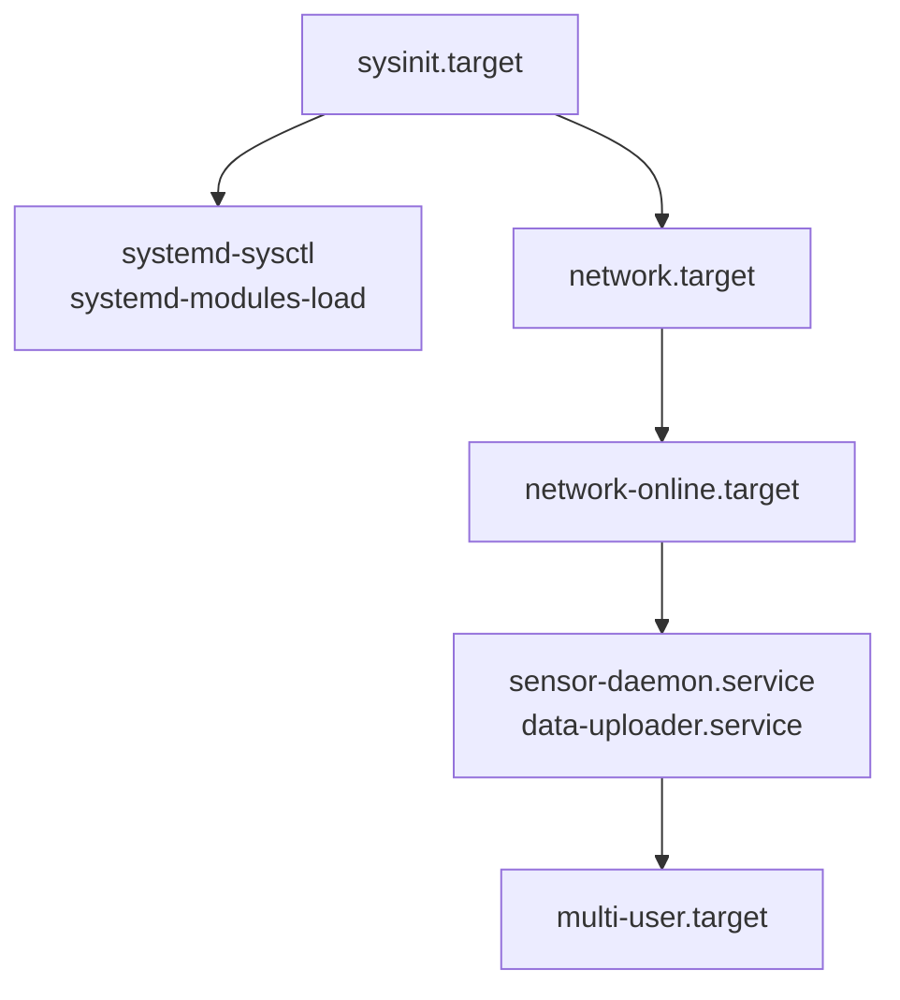
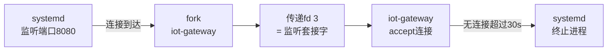

# systemd守护进程管理

> <span class="badge-i">**中级 (Intermediate)**</span>
> 掌握systemd的Unit类型矩阵，编写完整的service unit，理解socket激活模型和定时任务，了解嵌入式systemd的裁剪方法。

---

## Unit类型矩阵

---

### <strong>systemd 管理的资源全景</strong>

<span class="badge-i">I</span><br>
<span class="red">systemd Unit</span>不仅管理守护进程，还统一管理套接字、设备、挂载点、定时器等系统资源。<br>

| Unit类型 | 后缀 | 用途 | 嵌入式场景 |
|----------|------|------|----------|
| service | .service | 守护进程 | 传感器采集、网络代理、OTA服务 |
| socket | .socket | 套接字监听 | 按需启动服务，节省内存 |
| target | .target | 阶段/组合目标 | multi-user.target、custom-boot.target |
| device | .device | udev设备 | 外设就绪后启动依赖服务 |
| mount | .mount | 文件系统挂载 | /data分区自动挂载 |
| automount | .automount | 自动挂载触发 | 访问时挂载外部存储 |
| timer | .timer | 定时触发 | 日志轮转、数据采集 |
| path | .path | 文件监控 | 配置文件变更后重载 |
| scope | .scope | 外部创建的进程组 | 容器运行时 |
| slice | .slice | 资源配额分组 | cgroup层级管理 |

<span class="orange"><strong>1. service unit：</strong></span><br>
最常见的Unit类型，定义守护进程的启动、停止、重启行为。<br>

<span class="orange"><strong>2. socket unit：</strong></span><br>
与同名service配对，由systemd监听套接字，连接到达时才启动服务。
<span class="green">嵌入式中可节省"始终监听"进程的内存</span>。<br>

<span class="orange"><strong>3. target unit：</strong></span><br>
类似于SysVinit的runlevel，但支持依赖图。嵌入式常用target：<br>
- <span class="green">sysinit.target</span>：基础系统初始化完成<br>
- <span class="green">network-online.target</span>：网络就绪<br>
- <span class="green">multi-user.target</span>：多用户模式（无图形）<br>



<span class="blue">关键洞察：Unit类型的矩阵设计使systemd成为"系统资源总线"——任何需要管理的资源都有对应的Unit抽象。</span><br>

---

## service unit完整示例

---

### <strong>从简单到完整的嵌入式service配置</strong>

<span class="badge-i">I</span><br>
<span class="red">service unit</span>的配置从最小可用到生产完备，需要覆盖依赖、资源、安全、日志和恢复策略。<br>

```ini
# 文件路径：/etc/systemd/system/iot-gateway.service
# 功能：工业物联网网关服务（完整配置）
# 行号：1-40
[Unit]
Description=Industrial IoT Gateway Service
Documentation=https://docs.example.com/iot-gateway
After=network-online.target time-sync.target
Wants=network-online.target
Requires=mqtt-broker.service

[Service]
Type=notify
NotifyAccess=main
ExecStart=/usr/bin/iot-gateway --config /etc/iot-gateway.conf
ExecReload=/bin/kill -HUP $MAINPID
ExecStop=/usr/bin/iot-gateway-shutdown
Restart=on-failure
RestartSec=10
StartLimitInterval=60
StartLimitBurst=3

# 资源限制
CPUQuota=50%
MemoryMax=128M
MemorySwapMax=0
TasksMax=50

# 安全加固
PrivateTmp=yes
ProtectSystem=strict
ProtectHome=yes
NoNewPrivileges=yes

# 日志
StandardOutput=journal
StandardError=journal
SyslogIdentifier=iot-gateway

[Install]
WantedBy=multi-user.target
```

<span class="orange"><strong>1. Type=notify：</strong></span><br>
服务启动完成后主动调用<span class="green">sd_notify("READY=1")</span>通知systemd，避免"进程已存在但初始化未完成"的假就绪。<br>

<span class="orange"><strong>2. 重启策略：</strong></span><br>
<span class="green">Restart=on-failure</span>仅在非零退出码时重启，避免配置错误导致的无限重启循环。
<span class="green">StartLimitBurst=3</span>限制60秒内最多重启3次，超限后标记为失败。<br>

<span class="orange"><strong>3. 资源限制：</strong></span><br>
<span class="green">CPUQuota</span>限制CPU使用比例，<span class="green">MemoryMax</span>限制物理内存，<span class="green">TasksMax</span>限制线程数——
这些是嵌入式防止资源耗尽的关键防线。<br>

<span class="blue">关键洞察：一个完整的嵌入式service unit不只是"启动命令"，而是包含依赖契约、资源边界、故障恢复和安全加固的完整运行契约。</span><br>

---

## socket激活模型

---

### <strong>按需启动的内存优化策略</strong>

<span class="badge-i">I</span><br>
<span class="red">socket激活（Socket Activation）</span>是systemd的内存优化特性：由systemd监听套接字，首个连接到达时才启动服务进程。<br>



```ini
# 文件路径：/etc/systemd/system/iot-gateway.socket
[Socket]
ListenStream=0.0.0.0:8080
Accept=no

[Install]
WantedBy=sockets.target
```

```ini
# 文件路径：/etc/systemd/system/iot-gateway.service
[Service]
ExecStart=/usr/bin/iot-gateway
# 继承systemd传递的fd
StandardInput=socket
StandardOutput=journal
StandardError=journal
```

<span class="orange"><strong>1. Accept=no vs Accept=yes：</strong></span><br>
<span class="green">Accept=no</span>传递整个监听套接字，服务自己accept；<span class="green">Accept=yes</span>为每个连接创建独立实例。
嵌入式中Accept=no更高效。<br>

<span class="orange"><strong>2. 内存节省计算：</strong></span><br>
一个常驻监听进程占用~5MB RSS，通过socket激活仅在连接期间存在。
嵌入式设备24小时无连接时可节省全部内存。<br>

<span class="blue">关键洞察：socket激活是嵌入式"内存预算管理"的关键工具——不常用的服务不应该常驻内存。</span><br>

---

## timer定时任务

---

### <strong>cron 的现代化替代</strong>

<span class="badge-i">I</span><br>
<span class="red">systemd timer</span>替代传统的cron，提供更精确的时间控制、依赖管理和日志集成。<br>

```ini
# 文件路径：/etc/systemd/system/data-upload.timer
[Unit]
Description=Upload collected data every 15 minutes

[Timer]
OnBootSec=5min          # 启动后5分钟首次执行
OnUnitActiveSec=15min   # 上次执行完成后15分钟再次执行
RandomizedDelaySec=30   # 随机延迟0-30秒，避免集群设备同时上报
Persistent=true         # 如果错过执行（关机期间），启动后补偿执行

[Install]
WantedBy=timers.target
```

```ini
# 文件路径：/etc/systemd/system/data-upload.service
[Service]
Type=oneshot            # 执行一次即退出
ExecStart=/usr/bin/data-upload
```

| timer指令 | 含义 | 对比cron |
|-----------|------|---------|
| OnCalendar=*-*-* 03:00:00 | 每天凌晨3点 | 0 3 * * * |
| OnBootSec=10min | 启动后10分钟 | @reboot + sleep |
| OnUnitActiveSec=1h | 上次完成后1小时 | 无法用cron实现 |
| RandomizedDelaySec | 随机抖动 | 无原生支持 |
| Persistent=true | 补偿错过 | 无原生支持 |

<span class="blue">关键洞察：timer相比cron的核心优势不是语法，而是"服务化"——定时任务也是Unit，享有依赖管理、日志和自动恢复的同等能力。</span><br>

---

## 嵌入式systemd裁剪

---

### <strong>从完整版到嵌入式适配</strong>

<span class="badge-i">I</span><br>
<span class="red">完整版systemd</span>包含数百个组件，总大小超过10MB，需要针对嵌入式环境裁剪。<br>

| 组件 | 功能 | 嵌入式必要性 | 节省空间 |
|------|------|------------|---------|
| systemd-logind | 用户会话管理 | 无头设备不需要 | ~500KB |
| systemd-networkd | 网络管理 | 可用ifupdown替代 | ~1MB |
| systemd-resolved | DNS解析 | 可用musl内置 | ~300KB |
| systemd-timesyncd | NTP客户端 | 可用ntpdate | ~200KB |
| systemd-homed | 用户家目录 | 不需要 | ~1MB |
| systemd-portabled | 可移植服务 | 不需要 | ~500KB |

```bash
# Buildroot/systemd-mini 裁剪配置
# 文件路径：.config 或 menuconfig
CONFIG_SYSTEMD=y
CONFIG_SYSTEMD_LOGIND=n
CONFIG_SYSTEMD_NETWORKD=n
CONFIG_SYSTEMD_RESOLVED=n
CONFIG_SYSTEMD_TIMESYNCD=y   # 保留时间同步
CONFIG_SYSTEMD_JOURNALD=y    # 保留日志
```

<span class="orange"><strong>1. systemd-mini 项目：</strong></span><br>
社区维护的systemd裁剪版本，移除非必要组件，目标大小控制在2-3MB。<br>

<span class="orange"><strong>2. 替代方案：</strong></span><br>
- <span class="green">s6</span>：轻量进程监督框架，总大小~500KB<br>
- <span class="green">runit</span>：极简init替代，适合极端受限系统<br>
- <span class="green">自研C框架</span>：基于epoll+状态机的最小化方案<br>

<span class="blue">关键洞察：systemd裁剪的本质是"功能-空间"权衡，当裁剪后仍超过内存预算时，应考虑更轻量的替代方案而非继续裁剪。</span><br>

---

## 历史演进：从 inetd 到 socket 激活

---

### <strong>按需启动思想的二十年传承</strong>

<span class="badge-i">I</span><br>

| 系统 | 年代 | 机制 | 局限 |
|------|------|------|------|
| inetd | 1980s | 超级守护进程监听多端口 | 单进程串行处理，无并发 |
| xinetd | 1998 | inetd增强版，支持访问控制 | 配置复杂，已被systemd替代 |
| systemd socket | 2010+ | 原生集成socket激活 | 现代标准 |

<span class="blue">演进逻辑："按需启动"从inetd的"外部超级守护进程"演变为systemd的"原生资源管理"——集成度更高，开销更低。</span><br>

---

## 小结

---

### <strong>本章核心要点</strong>

| 知识点 | 关键内容 | 难度 |
|--------|---------|------|
| Unit矩阵 | service/socket/target/timer等10种类型 | I |
| service配置 | Type/Restart/资源限制/安全加固 | I |
| socket激活 | systemd监听→连接到达→服务启动 | I |
| timer | OnBootSec/OnUnitActiveSec/补偿执行 | I |
| 嵌入式裁剪 | 移除logind/networkd等，或选s6替代 | I |

---

### <strong>本章练习题</strong>

<span class="badge-i">I</span>

1. Type=notify和Type=simple的本质区别是什么？为什么嵌入式关键服务应该用notify？
2. socket激活如何节省内存？计算一个8080端口监听服务通过socket激活节省的RSS。
3. 比较systemd timer和cron的优劣，在什么场景下cron仍然更合适？

---

> <span class="badge-i">I</span> <span class="blue">systemd不是嵌入式的天敌——裁剪后的systemd-mini提供了服务器级功能与嵌入式级资源的平衡。</span>
