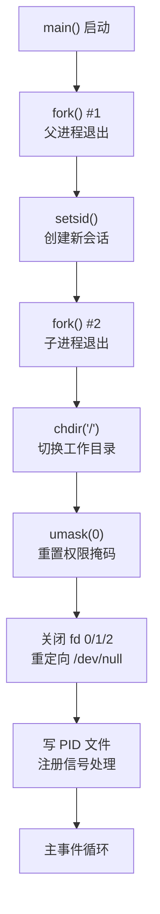
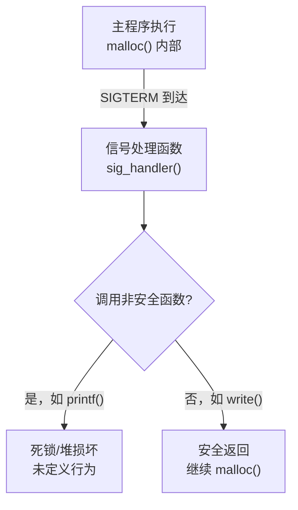
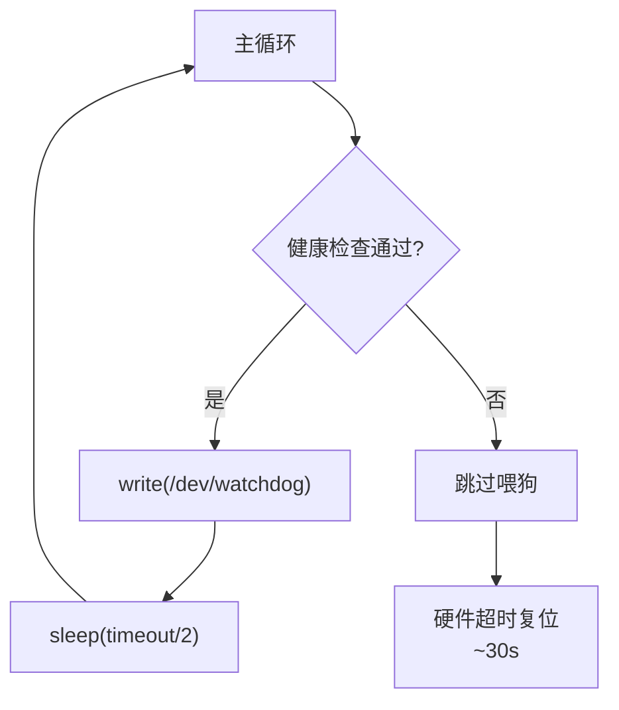

# 嵌入式服务化设计

> <span class="badge-i">**中级 (Intermediate)**</span> <span class="badge-e">**高级 (Expert)**</span>
> 掌握经典守护进程化流程，编写最小化守护进程骨架，实现异步信号安全处理，配置自启动，集成看门狗。

---

## 经典守护进程化流程

---

### <strong>Unix 经典 double-fork 机制</strong>

<span class="badge-i">I</span><br>
<span class="red">经典守护进程化</span>遵循 Stevens《Advanced Programming in the UNIX Environment》定义的五步流程。
<br>



<span class="orange"><strong>1. 第一次 fork：</strong></span><br>
父进程退出使子进程成为孤儿，被 init 收养。此时子进程不是进程组长，为 setsid 创造条件。<br>

<span class="orange"><strong>2. setsid：</strong></span><br>
创建新会话，当前进程成为会话首进程和进程组长，脱离控制终端。<br>

<span class="orange"><strong>3. 第二次 fork：</strong></span><br>
会话首进程若打开终端设备会自动获得控制终端。第二次 fork 后，孙进程不是会话首进程，<span class="green">永远无法意外获取控制终端</span>。<br>

<span class="orange"><strong>4. 关闭标准 fd：</strong></span><br>
将 stdin/stdout/stderr 重定向到 /dev/null，避免终端 I/O 阻塞或 SIGPIPE。<br>

<span class="blue">关键洞察：两次 fork 的第二次经常被忽略，但它是守护进程"永远不被终端信号干扰"的关键保险。<br>

---

## 最小化守护进程骨架

---

### <strong>嵌入式 C 实现的最小可用模板</strong>

<span class="badge-e">E</span><br>
<span class="red">最小化守护进程骨架</span>在经典流程基础上增加信号处理、PID文件和看门狗喂狗逻辑，形成可直接用于产品的工程模板。<br>

```c
// 文件路径：embed_daemon.c
// 功能：嵌入式最小化守护进程完整骨架
// 行号：1-80
#include <stdio.h>
#include <stdlib.h>
#include <unistd.h>
#include <signal.h>
#include <sys/types.h>
#include <sys/stat.h>
#include <fcntl.h>
#include <string.h>
#include <errno.h>

#define PIDFILE "/var/run/embed_daemon.pid"
#define WATCHDOG_DEV "/dev/watchdog"

static volatile int g_running = 1;
static volatile int g_reload = 0;
static int g_wdt_fd = -1;

static void signal_handler(int sig) {
    if (sig == SIGTERM || sig == SIGINT) {
        g_running = 0;
    } else if (sig == SIGHUP) {
        g_reload = 1;
    }
}

static int write_pidfile(const char *path, pid_t pid) {
    int fd = open(path, O_WRONLY | O_CREAT | O_TRUNC, 0644);
    if (fd < 0) return -1;
    char buf[32];
    int n = snprintf(buf, sizeof(buf), "%d\n", (int)pid);
    if (write(fd, buf, n) != n) { close(fd); return -1; }
    close(fd);
    return 0;
}

static void daemonize(void) {
    pid_t pid = fork();
    if (pid < 0) exit(EXIT_FAILURE);
    if (pid > 0) exit(EXIT_SUCCESS);

    if (setsid() < 0) exit(EXIT_FAILURE);

    signal(SIGHUP, SIG_IGN);
    pid = fork();
    if (pid < 0) exit(EXIT_FAILURE);
    if (pid > 0) exit(EXIT_SUCCESS);

    chdir("/var/run");
    umask(0);

    int devnull = open("/dev/null", O_RDWR);
    dup2(devnull, STDIN_FILENO);
    dup2(devnull, STDOUT_FILENO);
    dup2(devnull, STDERR_FILENO);
    if (devnull > 2) close(devnull);
}

static void setup_signals(void) {
    struct sigaction sa;
    memset(&sa, 0, sizeof(sa));
    sa.sa_handler = signal_handler;
    sigaction(SIGTERM, &sa, NULL);
    sigaction(SIGINT, &sa, NULL);
    sigaction(SIGHUP, &sa, NULL);
    signal(SIGPIPE, SIG_IGN);
}

static void wdt_init(void) {
    g_wdt_fd = open(WATCHDOG_DEV, O_WRONLY | O_CLOEXEC);
    if (g_wdt_fd < 0) {
        fprintf(stderr, "WARN: watchdog not available\n");
    }
}

static void wdt_feed(void) {
    if (g_wdt_fd >= 0) {
        write(g_wdt_fd, "\0", 1);
    }
}

int main(int argc, char **argv) {
    daemonize();
    setup_signals();

    if (write_pidfile(PIDFILE, getpid()) < 0) {
        fprintf(stderr, "Failed to write pidfile\n");
        exit(EXIT_FAILURE);
    }

    wdt_init();

    while (g_running) {
        if (g_reload) {
            g_reload = 0;
            // 重载配置文件逻辑
        }

        // 主业务逻辑
        // ...

        wdt_feed();
        usleep(100000);  // 100ms
    }

    // 清理
    if (g_wdt_fd >= 0) close(g_wdt_fd);
    unlink(PIDFILE);
    return 0;
}
```

<span class="blue">关键洞察：骨架代码的可复用性在于"信号-状态-循环"三元结构：信号修改状态标志，主循环检测状态执行相应逻辑，看门狗保证循环持续运转。<br>

---

## 异步信号安全处理

---

### <strong>信号处理函数的可重入约束</strong>

<span class="badge-e">E</span><br>
<span class="red">异步信号安全（Async-Signal-Safe）</span>指函数在信号处理函数中调用时，即使主程序中断在任意位置也能正确执行。<br>



<span class="orange"><strong>1. POSIX 信号安全函数清单：</strong></span><br>
安全函数仅限：write、read、_exit、kill、sigaction、open/close（有限制）、原子变量操作。<br>

<span class="orange"><strong>2. 绝对禁止在信号处理中调用：</strong></span><br>
- malloc/free（堆锁可能被主程序持有）<br>
- printf/sprintf（依赖malloc和stdio锁）<br>
- pthread_mutex_lock（可能死锁）<br>
- 任何可能触发段错误的长跳转<br>

```c
// 文件路径：signal_safe.c
// 功能：信号安全的写法——只修改volatile sig_atomic_t标志
// 行号：1-20
#include <signal.h>
#include <unistd.h>

static volatile sig_atomic_t g_stop = 0;
static volatile sig_atomic_t g_reload = 0;

static void handler(int sig) {
    const char msg_term[] = "SIGTERM received\n";
    const char msg_hup[]  = "SIGHUP received\n";

    if (sig == SIGTERM) {
        g_stop = 1;
        write(STDERR_FILENO, msg_term, sizeof(msg_term)-1);  // write 是安全的
    } else if (sig == SIGHUP) {
        g_reload = 1;
        write(STDERR_FILENO, msg_hup, sizeof(msg_hup)-1);
    }
}

// 主循环中处理（安全上下文）
void main_loop(void) {
    while (!g_stop) {
        if (g_reload) {
            g_reload = 0;
            reload_config();  // 安全：不在信号处理中调用
        }
        do_work();
    }
}
```

<span class="blue">关键洞察：信号处理函数只做一件事——设置标志。所有实际工作（包括日志输出）延迟到主循环的安全上下文中执行。<br>

---

## 自启动配置

---

### <strong>systemd 与 SysVinit 的自启动方式</strong>

<span class="badge-i">I</span><br>
<span class="red">自启动配置</span>确保设备上电后守护进程自动进入运行状态，无需人工干预。<br>

```bash
# === systemd 方式 ===
# 创建 service unit
# 文件路径：/etc/systemd/system/myapp.service
[Service]
ExecStart=/usr/bin/myapp
[Install]
WantedBy=multi-user.target

# 启用自启动
$ systemctl enable myapp.service
# 实际创建符号链接：/etc/systemd/system/multi-user.target.wants/myapp.service

# === SysVinit / BusyBox 方式 ===
# 文件路径：/etc/init.d/myapp
#!/bin/sh
# 行号：1-25
case "$1" in
    start)
        echo "Starting myapp..."
        start-stop-daemon --start --quiet --pidfile /var/run/myapp.pid \
                          --exec /usr/bin/myapp --background
        ;;
    stop)
        echo "Stopping myapp..."
        start-stop-daemon --stop --quiet --pidfile /var/run/myapp.pid
        ;;
    restart)
        $0 stop
        $0 start
        ;;
    *)
        echo "Usage: $0 {start|stop|restart}"
        exit 1
        ;;
esac

# 启用自启动（创建 rc 链接）
$ ln -s /etc/init.d/myapp /etc/rc5.d/S99myapp
```

| 方式 | 机制 | 适用场景 |
|------|------|---------|
| systemd enable | 符号链接到 target.wants | 使用 systemd 的系统 |
| SysVinit rc 链接 | S/K 前缀脚本顺序执行 | 传统系统、BusyBox |
| inittab respawn | init 直接管理进程 | 极端极简系统 |
| 自 fork | 程序自己守护进程化 | 无 init 框架的裸系统 |

<span class="blue">关键洞察：自启动的本质是"将进程生命周期托管给 init 系统"——托管的层级越高（systemd > SysVinit > inittab），可获得的监控和恢复能力越强。<br>

---

## 看门狗集成

---

### <strong>用户空间喂狗与多级心跳</strong>

<span class="badge-e">E</span><br>
<span class="red">看门狗集成</span>将守护进程的健康状态与硬件看门狗绑定，进程卡死时触发系统复位。<br>



```c
// 文件路径：wdt_integrate.c
// 功能：看门狗与用户态健康检查集成
// 行号：1-45
#include <fcntl.h>
#include <unistd.h>
#include <sys/ioctl.h>
#include <linux/watchdog.h>

#define WDT_DEV "/dev/watchdog"
#define WDT_TIMEOUT 30  // 看门狗超时时间（秒）

static int wdt_fd = -1;
static unsigned int health_flags = 0;

#define HEALTH_NET   0x01
#define HEALTH_DISK  0x02
#define HEALTH_TEMP  0x04
#define HEALTH_ALL   0x07

int wdt_init(void) {
    wdt_fd = open(WDT_DEV, O_WRONLY | O_CLOEXEC);
    if (wdt_fd < 0) return -1;
    int timeout = WDT_TIMEOUT;
    ioctl(wdt_fd, WDIOC_SETTIMEOUT, &timeout);
    return 0;
}

void health_set(unsigned int flag) {
    health_flags |= flag;
}

void health_clear(unsigned int flag) {
    health_flags &= ~flag;
}

void wdt_feed_cycle(void) {
    if (wdt_fd < 0) return;

    // 只有所有健康标志都置位才喂狗
    if ((health_flags & HEALTH_ALL) == HEALTH_ALL) {
        write(wdt_fd, "\0", 1);
    } else {
        // 不喂狗，等待超时复位
        // 可在此记录临终日志
    }

    // 周期性地清零健康标志，要求各子系统每周期重新置位
    health_flags = 0;
}

// 子系统在各自线程中置位
void *network_thread(void *arg) {
    while (1) {
        if (poll_network() == OK)
            health_set(HEALTH_NET);
        sleep(1);
    }
}
```

<span class="orange"><strong>1. 多级心跳：</strong></span><br>
看门狗喂狗不仅依赖主循环存活，还依赖各子系统（网络、磁盘、温度）的健康状态。<span class="green">任一子系统故障即停止喂狗</span>，比单纯检测主循环更可靠。<br>

<span class="orange"><strong>2. 关闭看门狗的策略：</strong></span><br>
正常关机时必须先关闭看门狗，否则init停止后看门狗无人喂养将触发复位。
<span class="green">ioctl(wdt_fd, WDIOC_SETOPTIONS, WDIOS_DISABLECARD)</span>或简单关闭 fd 即可（取决于驱动实现）。<br>

<span class="blue">关键洞察：看门狗不是"程序跑得快"的保证，而是"程序不卡住"的底线——多级心跳使看门狗从"进程存活检测"升级为"系统健康检测"。<br>

---

## 历史演进：从 inetd 到 systemd

---

### <strong>守护进程管理的四十年</strong>

<span class="badge-i">I</span><br>

| 年代 | 方案 | 特点 |
|------|------|------|
| 1980s | SysVinit + rc 脚本 | 顺序启动，无监控 |
| 1998 | daemontools | 进程监督，自动重启 |
| 2006 | Upstart | 事件驱动启动 |
| 2010 | systemd | 依赖图+cgroup+日志统一 |
| 2014+ | s6/runit | 极简监督，嵌入式回归 |

<span class="blue">演进逻辑：从"启动脚本"到"进程监督"再到"完整生命周期管理"，趋势是更强的故障恢复和更细的资源控制。<br>

---

## 小结

---

### <strong>本章核心要点</strong>

| 知识点 | 关键内容 | 难度 |
|--------|---------|------|
| 守护进程化 | double-fork, setsid, chdir, dup2 | I |
| 最小骨架 | 信号-状态-循环 + PID文件 + 看门狗 | E |
| 信号安全 | volatile sig_atomic_t, write-only | E |
| 自启动 | systemctl enable / rc 链接 / inittab | I |
| 看门狗集成 | 多级心跳、健康标志位、关闭策略 | E |

---

### <strong>本章练习题</strong>

<span class="badge-e">E</span>

1. 为什么在守护进程化中第二次 fork 是必要的？哪些情况下可以省略？
2. 为什么信号处理函数中不能调用 printf？设计一个信号安全的日志机制。
3. 多级看门狗心跳中，如果网络线程崩溃但主循环仍在运行，系统会怎样？如何改进？

---

> <span class="badge-e">E</span> <span class="blue">一个健壮的嵌入式守护进程 = 经典守护进程化 + 信号安全处理 + 看门狗绑定 + 自启动托管。</span>
