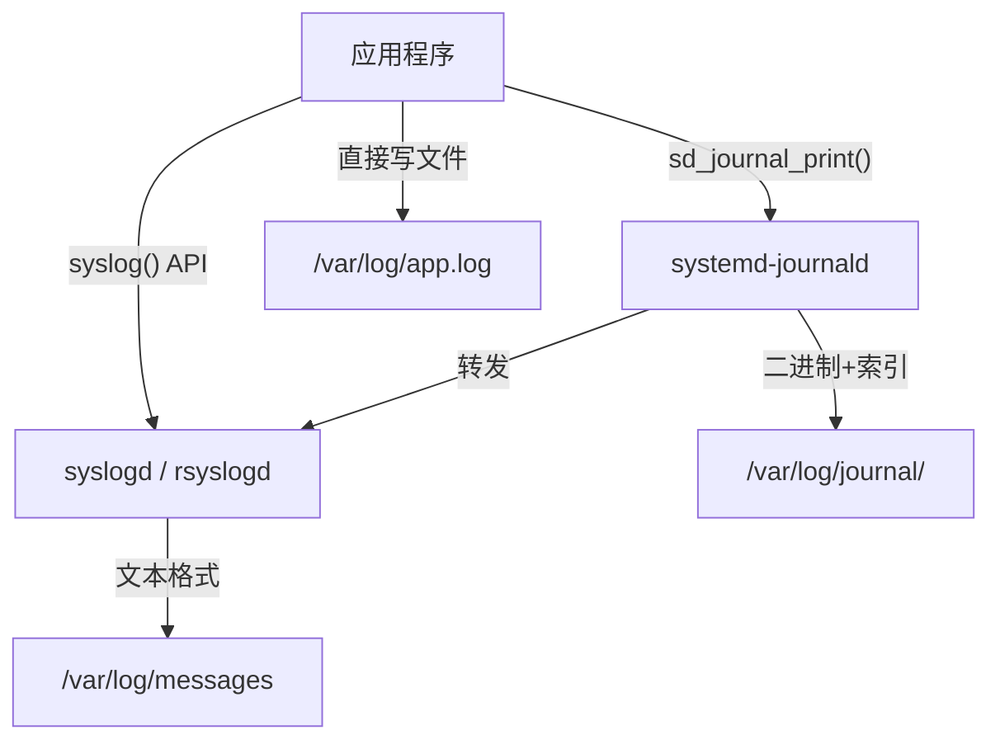
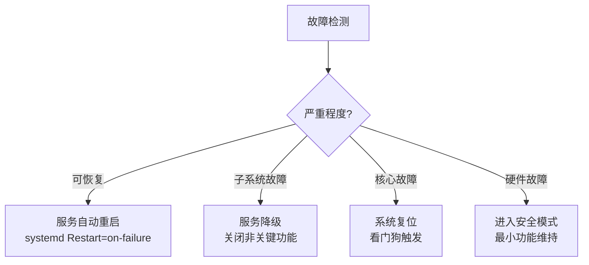
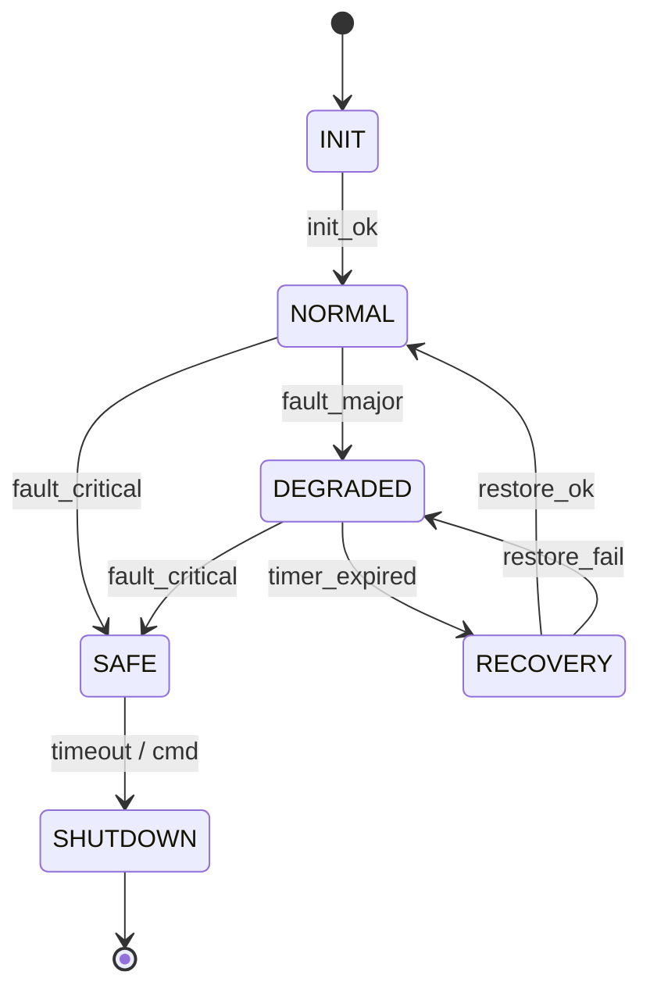

# 日志系统与故障恢复

> <span class="badge-i">**中级 (Intermediate)**</span> <span class="badge-e">**高级 (Expert)**</span>
> 理解日志分级模型，掌握syslog与journald的集成方式，实现轻量级日志轮转，设计故障恢复策略和状态机。

---

## 日志分级模型

---

### <strong>从 DEBUG 到 EMERG 的七级体系</strong>

<span class="badge-i">I</span><br>
<span class="red">日志分级</span>是日志系统的基石，统一的级别语义确保开发者和运维人员对日志含义有一致理解。<br>

| 级别 | 数值 | 含义 | 嵌入式典型输出位置 |
|------|------|------|-------------------|
| DEBUG | 7 | 开发调试信息 | 开发阶段串口输出 |
| INFO | 6 | 正常运行信息 | 生产环境持久化日志 |
| NOTICE | 5 | 正常但重要的事件 | 生产环境持久化日志 |
| WARNING | 4 | 警告，非致命异常 | 生产环境持久化日志 |
| ERR | 3 | 错误，功能受影响 | 告警+日志 |
| CRIT | 2 | 严重错误，子系统不可用 | 告警+日志+看门狗 |
| ALERT | 1 | 必须立即采取行动 | 告警+日志+系统保护 |
| EMERG | 0 | 系统不可用 | 告警+复位 |

<span class="orange"><strong>1. 嵌入式分级策略：</strong></span><br>
生产环境通常设置 <span class="green">LOG_LEVEL=INFO</span>，过滤DEBUG级别以减少存储和带宽开销。ERROR及以上级别触发告警通知。<br>

<span class="orange"><strong>2. 分级一致性：</strong></span><br>
Linux syslog使用0-7数值，Android Logcat使用V/D/I/W/E，定义自定义日志系统时应映射到标准语义。<br>

```c
// 文件路径：log_level.h
// 功能：嵌入式日志级别宏定义
// 行号：1-20
#ifndef LOG_LEVEL_H
#define LOG_LEVEL_H

#define LL_DEBUG   7
#define LL_INFO    6
#define LL_NOTICE  5
#define LL_WARNING 4
#define LL_ERR     3
#define LL_CRIT    2
#define LL_ALERT   1
#define LL_EMERG   0

#define LOG(level, fmt, ...) \
    do { \
        if (level <= g_log_level) { \
            log_output(level, __FILE__, __LINE__, fmt, ##__VA_ARGS__); \
        } \
    } while(0)

#endif
```

<span class="blue">关键洞察：日志分级的核心不是"打印什么"，而是"在什么情况下打印什么"——生产环境DEBUG日志的噪音会淹没真正的异常信号。<br>

---

## syslog-journald集成

---

### <strong>从传统syslog到结构化journald</strong>

<span class="badge-i">I</span><br>
<span class="red">syslog</span>是Unix日志的传统标准，<span class="red">journald</span>是systemd提供的结构化日志服务，两者可通过 <span class="green">/run/systemd/journal/syslog</span> 兼容共存。<br>



<span class="orange"><strong>1. syslog 协议：</strong></span><br>
syslog消息格式：`<priority>timestamp host tag: message`。priority = facility * 8 + severity。<br>

<span class="orange"><strong>2. journald 结构化字段：</strong></span><br>
journald不仅存储消息文本，还存储 <span class="green">_PID</span>、<span class="green">_COMM</span>、<span class="green">_SYSTEMD_UNIT</span>、自定义字段等元数据，支持高效过滤和查询。<br>

```bash
# journalctl 查询示例
$ journalctl -u sensor-daemon.service --since "1 hour ago"
$ journalctl -p err                        # 只显示ERROR及以上
$ journalctl --field=_PID=1234             # 按PID过滤
$ journalctl -o json                       # JSON格式输出
```

<span class="blue">关键洞察：journald的结构化存储在嵌入式中的代价是存储空间（二进制格式比文本大），收益是查询效率——在存储充裕的工业网关中推荐journald，在极简设备中推荐syslog或自研文本日志。<br>

---

## 轻量级日志轮转

---

### <strong>嵌入式存储约束下的日志管理</strong>

<span class="badge-e">E</span><br>
<span class="red">日志轮转</span>防止日志文件无限增长撑满存储，嵌入式中需要定制化的轻量方案。<br>


<span class="orange"><strong>1. logrotate 替代方案：</strong></span><br>
标准logrotate依赖cron，在嵌入式中可替换为自定义轻量实现。<br>

```c
// 文件路径：logrotate.c
// 功能：嵌入式轻量日志轮转
// 行号：1-40
#include <stdio.h>
#include <unistd.h>
#include <sys/stat.h>
#include <string.h>

#define LOG_FILE     "/var/log/app.log"
#define MAX_SIZE     (1024 * 1024)    // 1MB
#define MAX_BACKUPS  3

static void rotate_logs(void) {
    char old_path[128], new_path[128];
    
    // 删除最旧的
    snprintf(old_path, sizeof(old_path), "%s.%d", LOG_FILE, MAX_BACKUPS);
    unlink(old_path);
    
    // 依次重命名
    for (int i = MAX_BACKUPS - 1; i >= 1; i--) {
        snprintf(old_path, sizeof(old_path), "%s.%d", LOG_FILE, i);
        snprintf(new_path, sizeof(new_path), "%s.%d", LOG_FILE, i + 1);
        rename(old_path, new_path);
    }
    
    // 当前日志变为 .1
    rename(LOG_FILE, old_path);  // old_path 此时是 LOG_FILE.1
}

void log_write(const char *msg) {
    struct stat st;
    if (stat(LOG_FILE, &st) == 0 && st.st_size >= MAX_SIZE) {
        rotate_logs();
    }
    
    FILE *fp = fopen(LOG_FILE, "a");
    if (fp) {
        fprintf(fp, "%s\n", msg);
        fclose(fp);
    }
}
```

<span class="orange"><strong>2. 内存日志缓冲区：</strong></span><br>
极端受限设备可先写入 <span class="green">内存环形缓冲区</span>（如4MB），仅在异常时刷写到Flash，平衡存储寿命和日志完整性。<br>

| 方案 | 存储占用 | 持久性 | 适用场景 |
|------|---------|--------|---------|
| 直接写Flash | 低 | 高 | 工业设备，容忍磨损 |
| 内存缓冲+异常刷写 | 中 | 中 | 消费电子，Flash寿命敏感 |
| tmpfs + 定期归档 | 低 | 低 | 调试阶段 |
| 远程syslog | 极低 | 高 | 联网设备，中心化管理 |

<span class="blue">关键洞察：嵌入式日志管理的核心矛盾是"存储寿命（Flash写入次数有限）vs 诊断价值（需要完整日志）"——内存缓冲+异常刷写是常见的折中方案。<br>

---

## 故障恢复策略

---

### <strong>从崩溃到自愈的恢复层次</strong>

<span class="badge-e">E</span><br>
<span class="red">故障恢复策略</span>定义系统在检测到异常后如何恢复功能，从自动重启到降级运行形成完整层次。<br>



<span class="orange"><strong>1. 自动重启：</strong></span><br>
systemd的 <span class="green">Restart=on-failure</span> 实现服务级自动恢复，配合 <span class="green">RestartSec</span> 避免重启风暴。<br>

<span class="orange"><strong>2. 降级运行：</strong></span><br>
当非核心子系统（如数据上传）故障时，关闭该子系统但维持核心功能（如传感器采集）。
<span class="green">Graceful degradation</span> 是嵌入式可靠性的重要设计模式。<br>

<span class="orange"><strong>3. 安全模式：</strong></span><br>
检测到硬件故障（如温度超限、电源异常）时，系统进入最小功能的安全模式，
仅保留监控和告警能力，等待人工干预。<br>

```c
// 文件路径：fault_recovery.c
// 功能：多级故障恢复状态机
// 行号：1-50
typedef enum {
    STATE_NORMAL = 0,     // 正常运行
    STATE_DEGRADED,       // 降级运行（部分功能关闭）
    STATE_RECOVERY,       // 尝试恢复
    STATE_SAFE,           // 安全模式
    STATE_SHUTDOWN        // 安全关机
} system_state_t;

static system_state_t g_state = STATE_NORMAL;
static int g_fault_count = 0;
static time_t g_last_fault = 0;

void handle_fault(int severity) {
    time_t now = time(NULL);
    
    if (now - g_last_fault < 60) {
        g_fault_count++;
    } else {
        g_fault_count = 1;
    }
    g_last_fault = now;
    
    switch (severity) {
        case FAULT_MINOR:
            if (g_state == STATE_NORMAL) {
                log_warning("Minor fault, continuing");
            }
            break;
            
        case FAULT_MAJOR:
            if (g_fault_count >= 3) {
                g_state = STATE_DEGRADED;
                shutdown_non_critical();
                log_error("Entering degraded mode");
            }
            break;
            
        case FAULT_CRITICAL:
            g_state = STATE_SAFE;
            enter_safe_mode();
            log_alert("Entering safe mode");
            break;
    }
}

void state_machine_tick(void) {
    switch (g_state) {
        case STATE_NORMAL:
            perform_full_operation();
            break;
        case STATE_DEGRADED:
            perform_core_only();
            if (health_check_passed()) {
                g_state = STATE_RECOVERY;
            }
            break;
        case STATE_RECOVERY:
            if (attempt_restore()) {
                g_state = STATE_NORMAL;
                g_fault_count = 0;
                log_info("Recovered to normal");
            } else {
                g_state = STATE_DEGRADED;
            }
            break;
        case STATE_SAFE:
            maintain_minimal();
            break;
        case STATE_SHUTDOWN:
            graceful_shutdown();
            break;
    }
}
```

<span class="blue">关键洞察：故障恢复不是"尽可能恢复"，而是"在恢复成本和功能降级之间找到最优平衡点"。<br>

---

## 状态机设计

---

### <strong>系统生命周期管理的显式建模</strong>

<span class="badge-e">E</span><br>
<span class="red">状态机</span>将系统的生命周期和故障响应显式建模，避免隐含在代码中的复杂条件判断。<br>

| 状态 | 进入条件 | 退出条件 | 行为 |
|------|---------|---------|------|
| INIT | 启动 | 初始化完成 | 加载配置，初始化硬件 |
| NORMAL | 初始化完成 | 故障检测 | 全功能运行 |
| DEGRADED | 非致命故障 | 恢复成功/故障升级 | 核心功能运行，非关键功能关闭 |
| RECOVERY | 降级模式+定时触发 | 恢复成功/恢复失败 | 尝试重启故障子系统 |
| SAFE | 致命故障 | 人工干预 | 最小功能，告警 |
| SHUTDOWN | 安全模式超时/指令 | 电源断开 | 安全关机序列 |



<span class="orange"><strong>1. 状态转换约束：</strong></span><br>
不是所有状态间都能直接转换。例如从NORMAL到SHUTDOWN必须经过SAFE，防止误触发关机。<br>

<span class="orange"><strong>2. 状态持久化：</strong></span><br>
关键状态转换应写入持久存储（如Flash或EEPROM），下次启动时读取以决定初始化路径。
<span class="green">崩溃后的状态恢复</span>避免了反复进入错误状态。<br>

<span class="blue">关键洞察：状态机是嵌入式系统可靠性的"形式化保险"——将"如果A就B否则C"的嵌套条件转化为清晰的转换表，降低逻辑遗漏风险。<br>

---

## 历史演进：从 printf 到结构化日志

---

### <strong>日志系统的三十年演进</strong>

<span class="badge-i">I</span><br>

| 年代 | 系统 | 特点 |
|------|------|------|
| 1980s | syslog | 网络日志协议，文本格式 |
| 2000s | rsyslog | 高性能syslog替代，模块化 |
| 2012+ | journald | 二进制结构化日志，systemd原生 |
| 2015+ | Fluentd/Fluent Bit | 统一日志收集，云原生 |
| 2020+ | eBPF 日志 | 内核态结构化事件输出 |

<span class="blue">演进逻辑：从"文本流"到"结构化记录"再到"可编程采集"，趋势是更强的查询能力和更低的采集开销。<br>

---

## 小结

---

### <strong>本章核心要点</strong>

| 知识点 | 关键内容 | 难度 |
|--------|---------|------|
| 日志分级 | DEBUG到EMERG七级，生产环境INFO过滤 | I |
| syslog/journald | 文本vs结构化，兼容共存 | I |
| 日志轮转 | 轻量C实现、内存缓冲、远程syslog | E |
| 故障恢复 | 自动重启、降级运行、安全模式 | E |
| 状态机 | 状态-转换-约束-持久化 | E |

---

### <strong>本章练习题</strong>

<span class="badge-e">E</span>

1. 为什么journald的二进制格式在嵌入式中可能不是最佳选择？什么场景下它比syslog更合适？
2. 设计一个基于内存环形缓冲区的日志系统，描述刷写到Flash的触发条件和数据一致性保证。
3. 在状态机中，为什么NORMAL到SHUTDOWN不能直接转换？举例说明跳过中间状态的风险。

---

> <span class="badge-e">E</span> <span class="blue">日志是系统的"黑匣子"，状态机是系统的"自动驾驶仪"——两者结合才能从故障中学习和恢复。</span>
