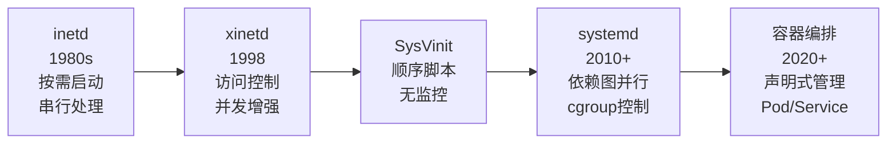
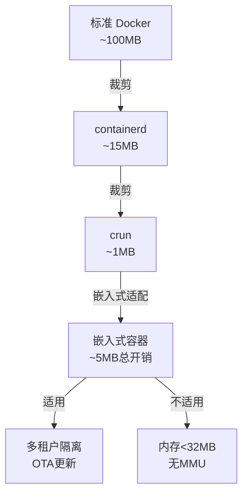

# 服务化历史演进与前沿

> <span class="badge-e">**高级 (Expert)**</span>
> 梳理从inetd到systemd的服务管理演进，理解容器化服务在嵌入式中的边界，对比supervisor方案，了解声明式服务管理。

---

## 从inetd到systemd

---

### <strong>服务管理范式的四代跃迁</strong>

<span class="badge-e">E</span><br>
<span class="red">服务管理</span>从"超级守护进程"到"依赖图并行调度"再到"容器化编排"，经历了四次范式转换。<br>



| 系统 | 年代 | 启动机制 | 监控能力 | 资源控制 | 嵌入式适配 |
|------|------|---------|---------|---------|-----------|
| inetd | 1980s | 连接触发 | 无 | 无 | 不适用 |
| xinetd | 1998 | 连接触发+ACL | 无 | 无 | 不适用 |
| SysVinit | 1980s | 顺序脚本 | 无 | 无 | BusyBox init |
| Upstart | 2006 | 事件驱动 | 有限 | 无 | 不适用 |
| systemd | 2010+ | 依赖图并行 | 完整 | cgroup | systemd-mini |
| OpenRC | 2007 | 并行依赖 | 有限 | 无 | Gentoo嵌入式 |
| s6 | 2014+ | 进程监督 | 完整 | 有限 | 嵌入式主流 |

<span class="orange"><strong>1. inetd 的历史意义：</strong></span><br>
inetd首创了"按需启动"思想，将多个服务的监听套接字集中管理。虽然因串行处理被淘汰，
<span class="green">其按需启动思想被systemd socket激活继承</span>。<br>

<span class="orange"><strong>2. systemd 的整合性：</strong></span><br>
systemd不仅是init，还整合了日志（journald）、网络（networkd）、时间同步（timesyncd）、
容器（nspawn）等，形成"系统管理总线"。<br>

<span class="blue">关键洞察：systemd的成功不是因为它"最好"，而是因为它"最整合"——一个工具链覆盖系统管理的全部需求。<br>

---

## 容器化服务

---

### <strong>Docker 在嵌入式中的可行性边界</strong>

<span class="badge-e">E</span><br>
<span class="red">容器化服务</span>将应用打包为自包含的镜像，在服务器领域已成标准，但在嵌入式中面临资源约束。<br>

| 维度 | 服务器 Docker | 嵌入式容器 |
|------|-------------|-----------|
| 运行时 | containerd + runc (~100MB) | crun + skopeo (~5MB) |
| 镜像大小 | GB级 | 10-50MB |
| 启动时间 | 秒级 | 亚秒级 |
| 内存占用 | 无约束 | 共享内核，额外开销~2MB |
| 存储 | overlay2 | vfs / tmpfs（无写时复制） |
| 网络 | bridge/NAT | host模式（无NAT开销） |



<span class="orange"><strong>1. 嵌入式容器裁剪：</strong></span><br>
- 用 <span class="green">crun</span> 替代 runc（C实现，体积更小）<br>
- 用 <span class="green">vfs</span> 驱动替代 overlay2（无内核依赖，但性能差）<br>
- 用 <span class="green">host网络模式</span> 替代 bridge（无NAT和veth开销）<br>

<span class="orange"><strong>2. 适用场景：</strong></span><br>
- OTA更新：新镜像原子替换，失败回滚<br>
- 多租户隔离：网关设备运行客户应用+厂商应用<br>
- 开发环境：容器化Buildroot/Yocto构建环境<br>

<span class="blue">关键洞察：容器化在嵌入式中的边界是"资源预算"——当容器运行时开销超过应用本身的价值时，应回归传统进程管理。<br>

---

## supervisor对比

---

### <strong>s6、supervisord与systemd的选型</strong>

<span class="badge-e">E</span><br>
<span class="red">进程监督工具</span>的选择是嵌入式架构的关键决策，不同工具在复杂度、功能和资源占用上有显著差异。<br>

| 工具 | 大小 | 依赖 | 功能 | 适用场景 |
|------|------|------|------|---------|
| systemd | 2-10MB | glibc, dbus | 完整（依赖图+cgroup+日志） | 中等资源设备（RAM>128MB） |
| systemd-mini | ~2MB | musl | 基础（启动+重启+简单日志） | 低资源设备（RAM>64MB） |
| supervisord | ~5MB | Python | 进程监督+日志 | 有Python运行时的设备 |
| s6 | ~500KB | musl | 进程监督 | 极简设备（RAM<64MB） |
| s6-rc | ~1MB | s6 | 依赖图+监督 | 需要依赖管理的极简设备 |
| runit | ~100KB | musl | 基础监督 | 极端受限设备 |
| 自研C | ~50KB | 无 | 定制功能 | 特定需求、无通用工具适配 |

```bash
# s6 监督示例（嵌入式轻量方案）
# 文件路径：/etc/s6/sensor-daemon/run
#!/bin/sh
exec 2>&1
exec /usr/bin/sensor-daemon

# 文件路径：/etc/s6/sensor-daemon/finish
#!/bin/sh
# 退出码非0时自动重启
if test "$1" -ne 0; then
    sleep 5
    s6-svc -u /run/s6/sensor-daemon
fi
```

<span class="orange"><strong>1. s6 的设计理念：</strong></span><br>
s6遵循<span class="green">Unix哲学</span>——每个工具只做一件事，通过管道和脚本组合。监督、日志、依赖管理是独立的可组合组件。<br>

<span class="orange"><strong>2. supervisord 的嵌入式困境：</strong></span><br>
supervisord依赖Python运行时，在嵌入式中若已安装Python则可用，否则为supervisord单独引入Python得不偿失。<br>

<span class="blue">关键洞察：选型决策的核心不是"哪个最好"，而是"哪个最匹配当前系统的约束和未来演进方向"。<br>

---

## 微服务嵌入式边界

---

### <strong>微服务架构在资源受限环境中的可行性</strong>

<span class="badge-e">E</span><br>
<span class="red">微服务嵌入式边界</span>探讨将服务器微服务思想（服务拆分、独立部署、自治团队）应用于嵌入式设备的可行性与陷阱。<br>

| 微服务原则 | 服务器实践 | 嵌入式适配 | 风险 |
|-----------|-----------|-----------|------|
| 服务拆分 | 数十个微服务 | 3-5个核心进程 | 通信开销不可接受 |
| 独立部署 | CI/CD流水线 | OTA原子更新 | 回滚复杂 |
| 自治团队 | 独立代码库 | 模块边界清晰 | 库重复链接 |
| 去中心化治理 | 各自选择技术栈 | 统一RTOS/Linux | 异构不现实 |
| 容错设计 | 熔断降级 | 看门狗复位 | 重启粒度粗 |

<span class="orange"><strong>1. 嵌入式微服务的务实形态：</strong></span><br>
不是"数十个服务"，而是<span class="green">"3-5个核心进程+共享库"</span>。进程边界对应故障域，而非组织边界。<br>

<span class="orange"><strong>2. 进程间通信成为瓶颈：</strong></span><br>
微服务假设网络通信（REST/gRPC），嵌入式中进程间通信（D-Bus/UDS/共享内存）的延迟和吞吐量限制成为架构约束。<br>

<span class="blue">关键洞察：嵌入式不是"小型的服务器"——微服务思想的适配需要重新理解"服务边界"的定义，从网络边界转向进程边界。<br>

---

## 声明式服务管理

---

### <strong>从命令式配置到声明式意图</strong>

<span class="badge-e">E</span><br>
<span class="red">声明式服务管理</span>不描述"如何做"，而是描述"期望达到什么状态"，由系统自动推导执行路径。<br>

```yaml
# 文件路径：/etc/services.d/gateway.yaml
# 声明式服务配置示例
services:
  - name: sensor-daemon
    image: /usr/bin/sensor-daemon
    state: running
    restart: on-failure
    max-restarts: 3
    resources:
      memory: 64M
      cpu: 30%
    dependencies:
      - network-online
    health-check:
      type: file
      path: /var/run/sensor-daemon.pid
      interval: 10s
```

| 范式 | 示例 | 特点 |
|------|------|------|
| 命令式 | shell脚本启动服务 | 描述执行步骤，易出错 |
| 配置式 | systemd unit文件 | 描述服务属性，依赖顺序隐含 |
| 声明式 | YAML/JSON意图描述 | 描述期望状态，系统自动 reconcile |

<span class="orange"><strong>1. systemd 的声明式本质：</strong></span>
systemd Unit文件是声明式的早期实践——开发者声明"这个服务需要网络"和"崩溃后重启"，
systemd负责在运行时维护这些声明。<br>

<span class="orange"><strong>2. 嵌入式声明式管理的前沿：</strong></span>
- <span class="green">NixOS</span>：纯函数式配置管理，系统状态完全由声明文件决定<br>
- <span class="green">K3s/EdgeX Foundry</span>：将K8s声明式思想下沉到边缘设备<br>
- <span class="green">WebAssembly</span>：声明式模块加载，安全沙箱化执行<br>

<span class="blue">关键洞察：声明式管理的终极价值是"可预测性"——给定相同的声明，系统总是收敛到相同的状态，这是可靠性的数学基础。<br>

---

## 历史演进：从守护进程到声明式系统

---

### <strong>服务管理思想的三十年</strong>

<span class="badge-e">E</span><br>

| 年代 | 范式 | 代表 | 核心思想 |
|------|------|------|---------|
| 1980s | 超级守护进程 | inetd | 集中监听，按需启动 |
| 1990s | 顺序启动 | SysVinit | 编号脚本，线性执行 |
| 2000s | 进程监督 | daemontools | 持续监控，自动重启 |
| 2010s | 依赖图并行 | systemd | 声明式依赖，cgroup控制 |
| 2020s | 容器化编排 | Kubernetes | 声明式意图，自动恢复 |
| 2025+ | 边缘声明式 | K3s/EdgeX | K8s思想下沉到嵌入式 |

<span class="blue">演进逻辑：从"集中控制"到"顺序脚本"到"监督守护"再到"声明式系统"，趋势是更强的自动化和更弱的人工干预。<br>

---

## 小结

---

### <strong>本章核心要点</strong>

| 知识点 | 关键内容 | 难度 |
|--------|---------|------|
| 四代跃迁 | inetd→xinetd→SysVinit→systemd | E |
| 容器化边界 | crun裁剪、host网络、适用场景 | E |
| supervisor对比 | systemd/s6/supervisord选型 | E |
| 微服务边界 | 3-5进程+共享库、IPC瓶颈 | E |
| 声明式管理 | 意图描述、自动reconcile | E |

---

### <strong>本章练习题</strong>

<span class="badge-e">E</span>

1. 为什么systemd能替代inetd/xinetd的按需启动功能？socket激活相比原始inetd有什么改进？
2. 在RAM 128MB的嵌入式设备上，比较systemd-mini和s6-rc的优劣，给出选型建议。
3. 声明式服务管理和命令式配置管理的本质区别是什么？为什么声明式更适合嵌入式可靠性？

---

> <span class="badge-e">E</span> <span class="blue">服务管理的终极目标是"系统自愈合"——从人工启动到自动监督，再到声明式意图管理，每一步都在减少人类干预的必要性。</span>
