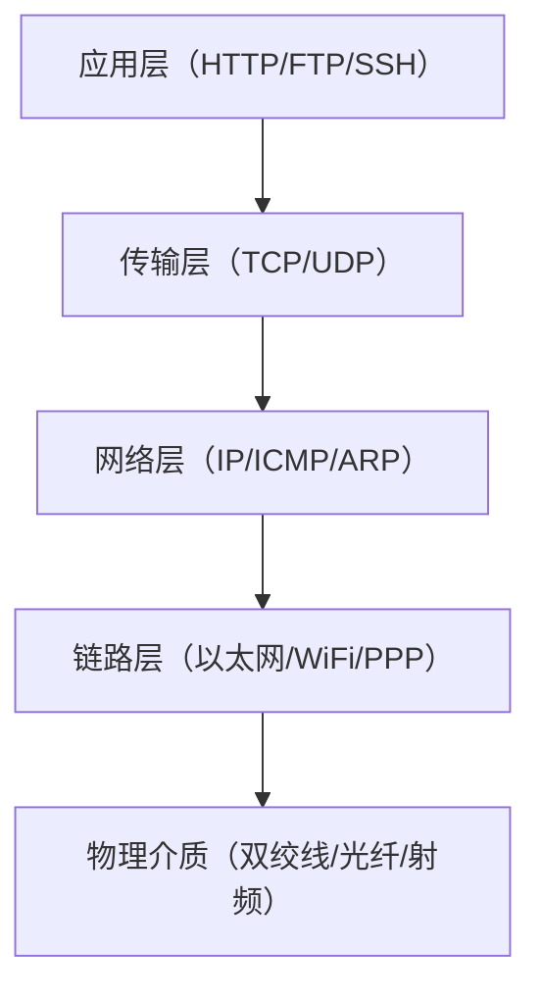

# 网络编程基础认知

> 📊 **本章难度等级：** <span class="badge-b">**入门 (Beginner)**</span> → <span class="badge-i">**中级 (Intermediate)**</span>

---

## <strong>核心定义与价值</strong>

### <strong>嵌入式网络定位</strong>

<span class="badge-b">B</span><br>
<span class="red">嵌入式网络编程</span>是连接物理设备与数字世界的核心桥梁。与通用计算不同，嵌入式网络面临资源受限、实时性要求高、可靠性严苛三重约束。<br>
工业网关、智能传感器、车载T-Box等场景均依赖稳定的网络通信栈实现数据上报与远程控制。<br>

<span class="blue">网络能力是现代嵌入式系统从孤立节点进化为智能物联网终端的决定性分水岭。</span><br>

---

### <strong>TCP-IP四层模型</strong>

<span class="badge-b">B</span><br>
<span class="red">TCP-IP协议栈</span>采用四层架构，与OSI七层模型相比更贴近工程实现。每一层向上层提供抽象服务，向下层屏蔽物理细节。<br>



<span class="orange"><strong>1. 链路层：</strong></span><br>
* <span class="green">以太网帧</span>通过MAC地址完成局域网寻址，<span class="green">MTU</span>（最大传输单元）典型值为1500字节。<br>

<span class="orange"><strong>2. 网络层：</strong></span><br>
* <span class="green">IP协议</span>负责跨网段逻辑寻址，IPv4地址32位，IPv6地址128位。<span class="green">ICMP</span>用于诊断与差错报告。<br>

<span class="orange"><strong>3. 传输层：</strong></span><br>
* <span class="green">TCP</span>提供面向连接、可靠的字节流服务；<span class="green">UDP</span>提供无连接、尽力而为的数据报服务。<br>

<span class="orange"><strong>4. 应用层：</strong></span><br>
* <span class="green">HTTP</span>、<span class="green">MQTT</span>、<span class="green">CoAP</span>等协议定义特定应用场景的数据格式与交互语义。<br>

<span class="blue">四层模型是理解嵌入式网络调试与性能优化的基础坐标系。</span><br>

---

### <strong>关键协议速览</strong>

<span class="badge-b">B</span><br>
嵌入式开发中高频接触的网络协议可分为基础通信协议与物联网应用协议两大类。<br>

| 协议 | 层级 | 核心功能 | 嵌入式典型场景 |
|------|------|----------|----------------|
| TCP | 传输层 | 可靠字节流传输 | 远程固件升级、日志上传 |
| UDP | 传输层 | 低延迟数据报 | 实时音视频、传感器广播 |
| ICMP | 网络层 | 诊断与差错 | ping连通性测试 |
| ARP | 网络层 | MAC地址解析 | 局域网设备发现 |
| DHCP | 应用层 | 动态IP分配 | 设备即插即用联网 |
| DNS | 应用层 | 域名转IP | 连接云服务平台 |
| MQTT | 应用层 | 发布订阅消息 | IoT设备上报状态 |
| CoAP | 应用层 | 受限RESTful | 低功耗传感器 |

<span class="blue">协议选型直接影响功耗、带宽与实时性，是嵌入式网络设计的首要考虑。</span><br>

---

## <strong>嵌入式场景特点</strong>

### <strong>资源受限下的网络栈</strong>

<span class="badge-i">I</span><br>
<span class="red">嵌入式网络栈</span>必须在RAM、ROM、CPU算力三重约束下运行。典型MCU（如STM32F4）仅有192KB SRAM，无法容纳完整的Linux网络栈。<br>
lwIP协议栈仅需约40KB ROM与10KB RAM即可运行，是资源受限场景的首选。<br>

<span class="orange"><strong>1. 内存约束：</strong></span><br>
* 发送缓冲区通常限制在1-4个MSS（最大段大小），无法利用大型滑动窗口。<br>

<span class="orange"><strong>2. 功耗约束：</strong></span><br>
* 蜂窝模组（如NB-IoT）在发送时功耗可达100mA以上，必须采用批量上报与休眠策略。<br>

<span class="orange"><strong>3. 实时约束：</strong></span><br>
* 工业控制网络要求确定性延迟，TCP重传机制可能破坏实时性，需改用UDP加应用层确认。<br>

---

### <strong>实战场景：智能电表的数据上报</strong>

<span class="badge-i">I</span><br>
智能电表每日需上报用电量至云平台。采用NB-IoT模组，每次建立TCP连接耗时3-5秒，发送数据仅100字节。<br>
若每15分钟上报一次，模组全年累计在线时间约2190小时，电费成本显著。<br>

<span class="blue">优化策略：采用UDP加CoAP协议，本地缓存后批量上报，将连接频率降至每小时1次。</span><br>

---

## <strong>字节序与MTU基础</strong>

### <strong>为什么需要统一字节序</strong>

<span class="badge-b">B</span><br>
<span class="red">字节序</span>指多字节数据在内存中的存放顺序。大端（Big-Endian）将高位字节存于低地址，小端（Little-Endian）反之。<br>
ARM与x86处理器默认采用小端，网络协议统一采用大端。<br>

为什么网络协议选择大端？因为早期协议设计者（BBN、UCLA）使用的PDP-11与IBM主机均为大端，为兼容历史设备，<span class="green">RFC 1700</span>规定网络字节序为大端。<br>

```c
// 示例：字节序转换
// 文件路径：include/linux/byteorder/generic.h
// 行号：内核标准接口
#include <arpa/inet.h>

uint32_t host_val = 0x12345678;
uint32_t net_val  = htonl(host_val);  /* host to network long */
uint16_t net_s    = htons(0xABCD);    /* host to network short */
```

<span class="blue">忘记字节序转换是嵌入式网络数据解析中最隐蔽的Bug来源。</span><br>

---

### <strong>MTU与分片机制</strong>

<span class="badge-i">I</span><br>
<span class="red">MTU</span>（Maximum Transmission Unit）定义链路层单帧的最大 payload 长度。以太网默认MTU为1500字节，不含帧头。<br>
当IP包大于MTU时，路由器执行分片；目标主机重组。分片增加处理开销且易被防火墙丢弃。<br>

```
# 查看本机MTU
$ ip link show eth0
2: eth0: <BROADCAST,MULTICAST,UP,LOWER_UP> mtu 1500 ...
```

<span class="orange"><strong>1. 路径MTU发现（PMTUD）：</strong></span><br>
* 发送方设置<span class="green">DF</span>（Don't Fragment）标志，探测整条路径的最小MTU，避免中间分片。<br>

<span class="orange"><strong>2. 嵌入式启示：</strong></span><br>
* 传感器上报数据应控制在1400字节以内，为IP与传输层头部预留空间，避免分片带来的延迟与丢包风险。<br>

---

## <strong>ping-netstat-ss实战</strong>

### <strong>ping：连通性诊断</strong>

<span class="badge-b">B</span><br>
<span class="green">ping</span>通过发送ICMP Echo Request并等待Reply，验证端到端连通性与往返时延（RTT）。<br>

```bash
# 发送4个ICMP包，间隔1秒
$ ping -c 4 -i 1 8.8.8.8
PING 8.8.8.8 (8.8.8.8) 56(84) bytes of data.
64 bytes from 8.8.8.8: icmp_seq=1 ttl=117 time=23.4 ms
64 bytes from 8.8.8.8: icmp_seq=2 ttl=117 time=22.9 ms
64 bytes from 8.8.8.8: icmp_seq=3 ttl=117 time=23.1 ms
64 bytes from 8.8.8.8: icmp_seq=4 ttl=117 time=22.8 ms

--- 8.8.8.8 ping statistics ---
4 packets transmitted, 4 received, 0% packet loss, time 3004ms
rtt min/avg/max/mdev = 22.812/23.050/23.412/0.216 ms
```

<span class="orange"><strong>输出解读：</strong></span><br>
* <strong>ttl=117</strong>：目标TTL初始值为128（Windows），经过11跳路由器递减至117。<br>
* <strong>time=23.4ms</strong>：RTT反映链路质量，嵌入式设备若RTT>500ms需检查蜂窝信号强度。<br>
* <strong>0% packet loss</strong>：丢包率0%为理想状态，>5%表明链路不稳定。<br>

---

### <strong>ss：Socket状态速查</strong>

<span class="badge-i">I</span><br>
<span class="green">ss</span>（Socket Statistics）是netstat的现代替代，直接从内核获取Socket信息，无需遍历/proc/net，速度更快。<br>

```bash
# 查看所有TCP连接及其状态
$ ss -tan
State      Recv-Q  Send-Q  Local Address:Port   Peer Address:Port   Process
LISTEN     0       128     0.0.0.0:22           0.0.0.0:*
ESTAB      0       0       192.168.1.10:54322   172.217.160.78:443
TIME-WAIT  0       0       192.168.1.10:54320   172.217.160.78:443
```

<span class="orange"><strong>关键字段：</strong></span><br>
* <strong>State</strong>：LISTEN/ESTAB/TIME-WAIT/CLOSE-WAIT等，反映TCP连接生命周期阶段。<br>
* <strong>Recv-Q/Send-Q</strong>：非零且持续增长表明接收/发送缓冲区积压，可能存在应用层读取缓慢或对端接收窗口过小。<br>

---

### <strong>实战场景：排查嵌入式网关连接泄漏</strong>

<span class="badge-i">I</span><br>
某工业网关运行一周后无法建立新连接。通过<span class="green">ss -tan | grep TIME-WAIT | wc -l</span>发现TIME-WAIT状态超过3万个。<br>
根因：网关作为TCP客户端频繁短连接云平台，每次断开都进入TIME-WAIT（2MSL约120秒），端口耗尽。<br>

<span class="blue">修复方案：启用SO_REUSEADDR复用端口，或改为长连接加心跳保活。</span><br>

---

## <strong>历史演进</strong>

### <strong>从ARPANET到物联网</strong>

<span class="badge-i">I</span><br>
1969年，<span class="green">ARPANET</span>首次实现4节点互联，采用NCP协议。1983年TCP-IP成为标准协议，奠定现代互联网基础。<br>
1990年代，嵌入式设备通过串口PPP拨号接入网络，<span class="green">uIP</span>协议栈（2001年）首次将TCP-IP带入8位MCU。<br>
2000年代，<span class="green">lwIP</span>（Adam Dunkels，2001年）提供事件驱动API，仅需几十KB内存，成为嵌入式领域事实标准。<br>
2010年代，<span class="green">MQTT</span>（IBM，1999年设计，2013年OASIS标准化）与<span class="green">CoAP</span>（IETF RFC 7252，2014年）专为低功耗广域网设计，推动IoT爆发。<br>
2020年代，<span class="green">io_uring</span>（Linux 5.1，2019年）与eBPF为嵌入式Linux带来零拷贝与可编程网络能力，边缘计算节点性能逼近服务器。<br>

<span class="blue">嵌入式网络的发展史，本质上是一部在资源约束下不断逼近通用计算网络能力的压缩史。</span><br>

---

## <strong>本章小结</strong>

| 知识点 | 核心要点 | 难度 |
|--------|----------|------|
| TCP-IP四层模型 | 链路-网络-传输-应用，各层职责分明 | B |
| 字节序 | 网络统一大端，htonl/htons必调 | B |
| MTU与分片 | 控制包长<1400，避免中间分片 | I |
| ping/ss诊断 | TTL解读、RTT阈值、Socket状态排查 | I |
| 嵌入式约束 | 内存/功耗/实时三重限制影响协议选型 | I |

---

## <strong>课后练习</strong>

<span class="orange"><strong>练习1：</strong></span><br>
在32位小端ARM平台上，执行 `htonl(0x01020304)` 的返回值是多少？请画出内存布局图。<br>

<span class="orange"><strong>练习2：</strong></span><br>
某传感器每分钟上报一次数据，每次100字节。分别计算使用TCP（含三次握手+挥手）和UDP在该周期内的额外协议开销比例。<br>

<span class="orange"><strong>练习3：</strong></span><br>
使用 `ss -tan` 抓取本机所有处于TIME-WAIT状态的连接，分析其本地端口分布规律，并解释为什么端口范围是32768-60999。<br>
