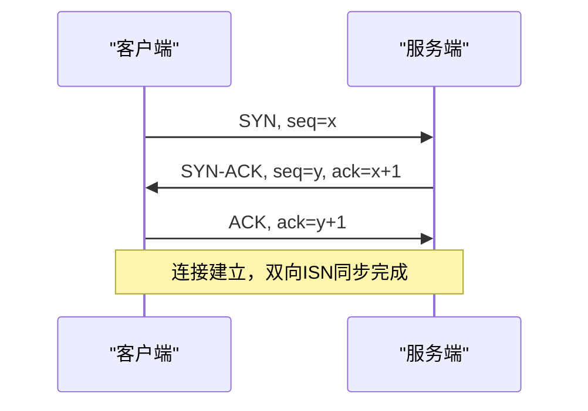
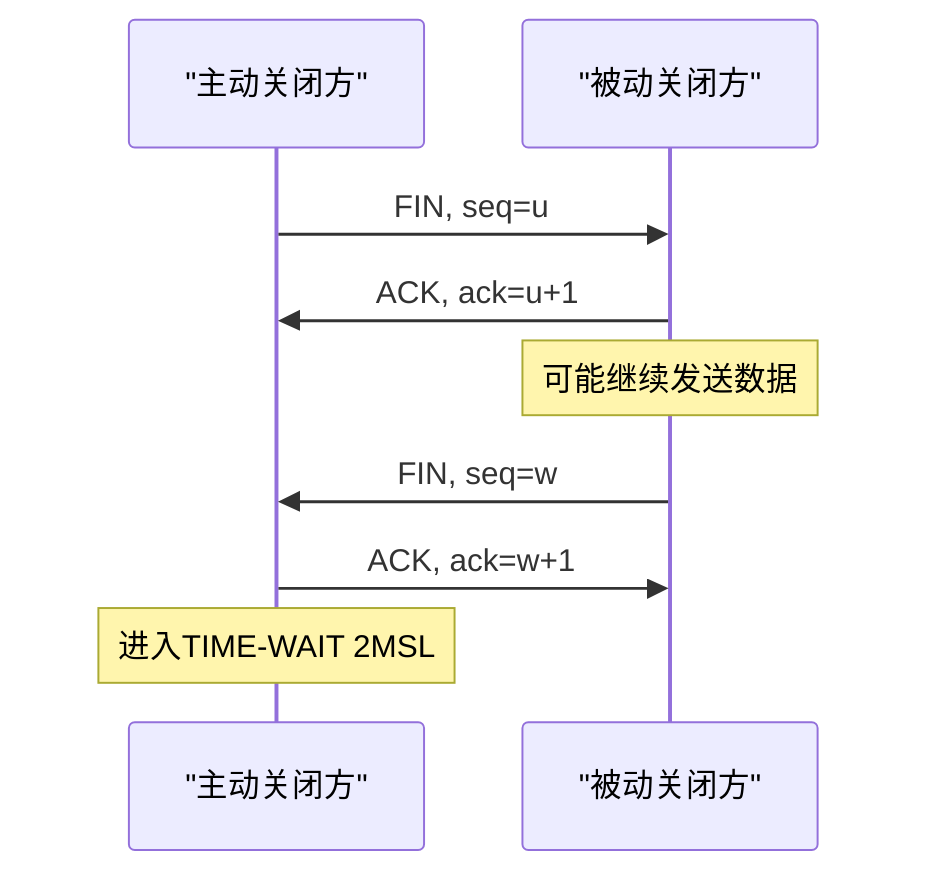
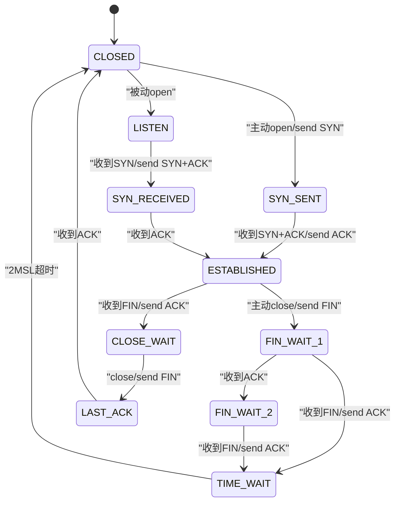

# TCP协议深度解析

> 📊 **本章难度等级：** <span class="badge-i">**中级 (Intermediate)**</span> → <span class="badge-e">**高级 (Expert)**</span>

---

## <strong>核心定义与价值</strong>

### <strong>为什么需要三次握手</strong>

<span class="badge-i">I</span><br>
<span class="red">TCP三次握手</span>的本质是同步双方初始序列号（ISN），并确认双向信道可达。两次握手无法解决"已失效的连接请求报文突然到达"的异常。



<span class="orange"><strong>1. 第一次握手（SYN）：</strong></span><br>
* 客户端发送 <span class="green">SYN</span> 包，携带初始序列号 x，进入 <span class="green">SYN-SENT</span> 状态。

<span class="orange"><strong>2. 第二次握手（SYN-ACK）：</strong></span><br>
* 服务端回复 <span class="green">SYN-ACK</span>，携带自身ISN y 并确认 x+1，进入 <span class="green">SYN-RECEIVED</span> 状态。

<span class="orange"><strong>3. 第三次握手（ACK）：</strong></span><br>
* 客户端确认 y+1，双方进入 <span class="green">ESTABLISHED</span> 状态。此时全双工通道就绪。

<span class="blue">三次握手是TCP可靠性的第一道防线，缺任何一次都可能导致"半开连接"或序列号不同步。</span><br>

---

### <strong>为什么需要四次挥手</strong>

<span class="badge-i">I</span><br>
<span class="red">TCP四次挥手</span>允许连接双方独立关闭各自的发送通道。全双工模式下，一方发送完毕不代表另一方也发送完毕。



<span class="orange"><strong>1. 第一次（FIN）：</strong></span><br>
* 主动方发送 <span class="green">FIN</span> 表示不再发送数据，但仍可接收。

<span class="orange"><strong>2. 第二次（ACK）：</strong></span><br>
* 被动方确认FIN，进入 <span class="green">CLOSE-WAIT</span> 状态，继续处理未发完的数据。

<span class="orange"><strong>3. 第三次（FIN）：</strong></span><br>
* 被动方数据发完，发送自己的 <span class="green">FIN</span>，进入 <span class="green">LAST-ACK</span> 状态。

<span class="orange"><strong>4. 第四次（ACK）：</strong></span><br>
* 主动方确认后进入 <span class="green">TIME-WAIT</span>，等待2MSL确保对方收到ACK。

<span class="blue">TIME-WAIT（2MSL ≈ 120秒）存在的原因是：如果最后的ACK丢失，被动方会重发FIN，主动方需要有能力重发ACK。</span><br>

---

## <strong>滑动窗口与流量控制</strong>

### <strong>窗口机制的原理</strong>

<span class="badge-i">I</span><br>
<span class="red">滑动窗口</span>是TCP实现流水线传输的核心机制。发送方无需等待每个ACK即可连续发送多个段，窗口大小由接收方通告的 <span class="green">rwnd</span>（receive window）决定。

```
发送缓冲区示意：

| 已发送已确认 | 已发送未确认 | 可发送（窗口内） | 不可发送 |
|<---ACKed--->|<---等待ACK-->|<---rwnd允许--->|<-超出窗口->|
              ^             ^
           发送窗口左沿   发送窗口右沿
```

<span class="orange"><strong>1. 为什么要动态调整：</strong></span><br>
* 接收方处理速度可能慢于发送方，若不限制流量，缓冲区溢出将导致丢包。

<span class="orange"><strong>2. 零窗口探测：</strong></span><br>
* 当 <span class="green">rwnd=0</span> 时，发送方启动 <span class="green"> persist timer </span>，定期发送1字节探测报文，防止死锁。

<span class="blue">滑动窗口将"停等协议"的利用率从1/RTT提升至接近100%，是TCP高效传输的基石。</span><br>

---

### <strong>嵌入式窗口限制</strong>

<span class="badge-e">E</span><br>
嵌入式设备内存有限，TCP接收缓冲区通常配置为8-32KB，远小于服务器默认值（约200KB）。

```bash
# 查看Linux默认TCP缓冲区
$ cat /proc/sys/net/ipv4/tcp_rmem
4096    131072    6291456
# min    default    max
```

在RAM仅128KB的MCU上运行lwIP时，TCP_SND_BUF常设为4×MSS（约5840字节），窗口缩放选项关闭。

<span class="blue">小窗口导致长距离高带宽链路无法填满管道，嵌入式设备跨洲际通信时吞吐量大幅下降。</span><br>

---

## <strong>拥塞控制算法对比</strong>

### <strong>从 Tahoe 到 BBR</strong>

<span class="badge-e">E</span><br>
<span class="red">拥塞控制</span>防止发送方压垮网络中间设备。不同算法在探测带宽、响应丢包的策略上差异显著。

| 算法 | 探测方式 | 丢包响应 | 适用场景 |
|------|----------|----------|----------|
| Reno | 慢启动+拥塞避免 | 拥塞窗口减半 | 通用场景，经典实现 |
| CUBIC | 三次函数窗口增长 | 乘法减小 | Linux默认，高带宽网络 |
| BBR | 测量RTT与投递率 | 不依赖丢包 | 高丢包链路（WiFi/蜂窝） |

<span class="orange"><strong>1. 慢启动（Slow Start）：</strong></span><br>
* 初始 <span class="green">cwnd=1 MSS</span>，每收到一个ACK窗口翻倍，指数增长直至阈值 <span class="green">ssthresh</span>。

<span class="orange"><strong>2. 拥塞避免（Congestion Avoidance）：</strong></span><br>
* 超过ssthresh后，每RTT窗口仅增加1 MSS，线性增长。

<span class="orange"><strong>3. BBR 的嵌入式价值：</strong></span><br>
* BBR通过测量实际带宽而非丢包判断拥塞，在无线链路（丢包率高但非拥塞导致）上吞吐量提升2-10倍。

<span class="blue">Linux 4.9+ 默认启用CUBIC；嵌入式设备若内核较旧（如3.x），手动切换至BBR可显著改善蜂窝网络体验。</span><br>

---

## <strong>TCP状态机</strong>

### <strong>完整状态转换图</strong>

<span class="badge-i">I</span><br>
<span class="red">TCP状态机</span>定义了连接从建立到关闭的全部生命周期。理解状态转换是排查"连接挂死"问题的核心。



<span class="orange"><strong>1. LISTEN：</strong></span><br>
* 服务端等待SYN，无超时限制。

<span class="orange"><strong>2. CLOSE-WAIT：</strong></span><br>
* 已收到对方FIN，等待应用层调用close。大量CLOSE-WAIT表明应用未释放连接句柄。

<span class="orange"><strong>3. TIME-WAIT：</strong></span><br>
* 主动关闭方最终状态，占用端口和内存。高并发短连接场景下可能成为瓶颈。

---

## <strong>Keepalive机制</strong>

### <strong>检测死连接</strong>

<span class="badge-i">I</span><br>
<span class="red">TCP Keepalive</span>用于检测对端是否异常断开（如断电、网线拔出）。与HTTP Keep-Alive不同，TCP层Keepalive由内核自动发送探测包。

```bash
# Linux默认Keepalive参数
$ cat /proc/sys/net/ipv4/tcp_keepalive_time
7200      # 空闲7200秒后开始探测
$ cat /proc/sys/net/ipv4/tcp_keepalive_intvl
75        # 探测间隔75秒
$ cat /proc/sys/net/ipv4/tcp_keepalive_probes
9         # 最多9次无响应则断开
```

<span class="blue">默认参数下，检测死连接需2小时+，嵌入式长连接场景必须调优至秒级。</span><br>

---

### <strong>嵌入式调优示例</strong>

<span class="badge-e">E</span><br>
工业网关通过4G连接云平台，需在网络闪断时60秒内感知并重连。

```c
// 文件路径：embedded_tcp_keepalive.c
// 行号：示例代码
int enable = 1;
int idle   = 30;   /* 30秒空闲即探测 */
int intvl  = 5;    /* 每5秒发一次 */
int probes = 3;    /* 3次无响应断开 */

setsockopt(sock, SOL_SOCKET, SO_KEEPALIVE, &enable, sizeof(enable));
setsockopt(sock, IPPROTO_TCP, TCP_KEEPIDLE,  &idle,   sizeof(idle));
setsockopt(sock, IPPROTO_TCP, TCP_KEEPINTVL, &intvl,  sizeof(intvl));
setsockopt(sock, IPPROTO_TCP, TCP_KEEPCNT,   &probes, sizeof(probes));
```

<span class="blue">调优后45秒内即可确认死连接，避免应用层阻塞在无效Socket上。</span><br>

---

## <strong>Nagle算法</strong>

### <strong>减少小包发送</strong>

<span class="badge-i">I</span><br>
<span class="red">Nagle算法</span>（RFC 896）规定：发送方在收到前一个段的ACK之前，不发送小于MSS的小包。其目标是减少网络中微小数据包的比例，降低路由器处理开销。

<span class="orange"><strong>1. 与延迟ACK的交互陷阱：</strong></span><br>
* 延迟ACK将确认推迟40ms，Nagle等待ACK再发下一个小包，两者叠加导致请求-响应型应用（如Telnet）延迟显著增加。

<span class="orange"><strong>2. 嵌入式场景禁用：</strong></span><br>
* 实时控制指令通常仅几十字节，Nagle会累积指令导致响应延迟。通过 <span class="green">TCP_NODELAY</span> 关闭。

```c
// 文件路径：realtime_control.c
// 行号：Nagle禁用
int nodelay = 1;
setsockopt(sock, IPPROTO_TCP, TCP_NODELAY, &nodelay, sizeof(nodelay));
// 代码带读：实时工控指令必须立即发出，禁止内核缓冲合并
```

<span class="blue">Nagle对吞吐有益，对延迟有害。嵌入式实时控制默认禁用，日志上传等批处理场景默认启用。</span><br>

---

## <strong>嵌入式TCP调优参数</strong>

### <strong>内核参数速查</strong>

<span class="badge-e">E</span><br>
嵌入式Linux的TCP默认参数面向通用服务器，针对资源受限设备需系统调优。

| 参数路径 | 默认值 | 建议值 | 调优理由 |
|----------|--------|--------|----------|
| tcp_rmem | 4096 131072 6291456 | 4096 16384 87380 | 减少内存峰值 |
| tcp_wmem | 同上 | 同上 | 同上 |
| tcp_timestamps | 1 | 1 | 保留，防序列号回绕 |
| tcp_sack | 1 | 1 | 选择性确认，减少重传 |
| tcp_tw_reuse | 0 | 1 | 客户端复用TIME-WAIT端口 |
| tcp_fin_timeout | 60 | 10 | 缩短孤儿连接回收 |

```bash
# 运行时临时生效
$ sysctl -w net.ipv4.tcp_rmem="4096 16384 87380"

# 永久生效写入 /etc/sysctl.conf
# 文件路径：/etc/sysctl.conf（嵌入式场景）
net.ipv4.tcp_rmem = 4096 16384 87380
net.ipv4.tcp_wmem = 4096 16384 87380
net.ipv4.tcp_fin_timeout = 10
```

---

## <strong>Wireshark抓包实战</strong>

### <strong>过滤表达式与解读</strong>

<span class="badge-i">I</span><br>
<span class="green">Wireshark</span>（或嵌入式等效工具tcpdump）是诊断网络问题的显微镜。

```bash
# 仅抓取与192.168.1.100的TCP 8080端口流量
$ tcpdump -i eth0 host 192.168.1.100 and port 8080 -w capture.pcap
```

<span class="orange"><strong>1. 过滤SYN洪泛攻击：</strong></span><br>
* 表达式 <span class="green">tcp.flags.syn==1 and tcp.flags.ack==0</span> 显示所有SYN包，短时间内大量此类包且源IP分散即为攻击。

<span class="orange"><strong>2. 定位重传风暴：</strong></span><br>
* 表达式 <span class="green">tcp.analysis.retransmission</span> 标记重传段，连续重传表明链路丢包或对端窗口死锁。

<span class="orange"><strong>3. 嵌入式实战：分析lwIP异常断开：</strong></span><br>
* 抓取目标设备IP的流量，检查是否存在"服务端发FIN后设备不回复ACK"——常见于应用层未读取close事件。

---

## <strong>历史演进</strong>

### <strong>从可靠性到效率的进化</strong>

<span class="badge-e">E</span><br>
1974年，Vint Cerf与Bob Kahn在论文中首次描述TCP。1981年RFC 793标准化基础协议，仅含停等机制与固定窗口。

1987年，Van Jacobson提出拥塞控制（慢启动+拥塞避免），解决早期ARPANET崩溃问题，代码仅数百行却拯救了整个互联网。

1990年代，<span class="green">SACK</span>（RFC 2018）与<span class="green">窗口缩放</span>（RFC 1323）适配高速网络。

2000年代，<span class="green">CUBIC</span>成为Linux默认算法，优化高带宽延迟积（BDP）网络。

2016年，Google发布<span class="green">BBR</span>，从"丢包=拥塞"模型转向"带宽=投递率/RTT"模型，在高丢包无线网络中实现吞吐量翻倍。

2020年代，<span class="green">QUIC</span>（基于UDP）在应用层重建TCP语义，减少握手延迟，成为HTTP/3基础。嵌入式领域也开始探索lwIP-QUIC移植。

<span class="blue">TCP四十年的演进证明：网络协议的终极优化目标，是在可靠性、吞吐量与延迟之间找到不断动态平衡的支点。</span><br>

---

## <strong>本章小结</strong>

| 知识点 | 核心要点 | 难度 |
|--------|----------|------|
| 三次握手 | SYN-SYN/ACK-ACK，同步ISN | I |
| 四次挥手 | FIN-ACK-FIN-ACK，TIME-WAIT=2MSL | I |
| 滑动窗口 | rwnd控制发送速率，零窗口探测防死锁 | I |
| 拥塞控制 | 慢启动-拥塞避免，BBR优于Reno/CUBIC | E |
| Keepalive | 检测死连接，嵌入式调优至秒级 | I |
| Nagle | 小包合并，实时场景禁用 | I |
| 调优参数 | tcp_rmem/tcp_fin_timeout/tcp_tw_reuse | E |
| Wireshark | 过滤表达式定位SYN洪泛与重传风暴 | I |

---

## <strong>课后练习</strong>

<span class="orange"><strong>练习1：</strong></span><br>
画出一个"同时打开"（两端同时主动connect）的TCP状态转换序列图，标注每一步的序列号交换逻辑。<br>

<span class="orange"><strong>练习2：</strong></span><br>
某嵌入式设备TCP接收缓冲区仅8KB，服务器发送窗口64KB。计算该设备在RTT=200ms链路上的理论最大吞吐量，并给出窗口缩放之外的其他优化建议。<br>

<span class="orange"><strong>练习3：</strong></span><br>
使用tcpdump抓取一次完整的TCP连接建立与关闭过程，写出对应的十六进制原始帧，并标注SYN/ACK/FIN标志位在TCP头部的偏移位置。<br>
