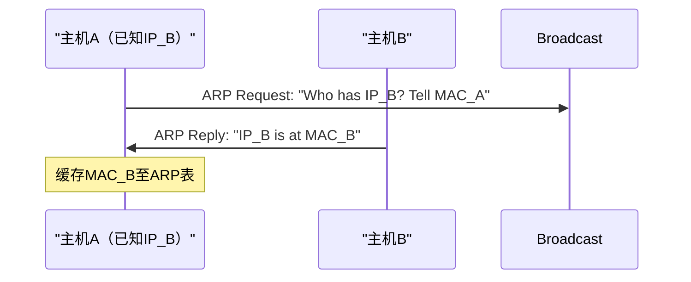
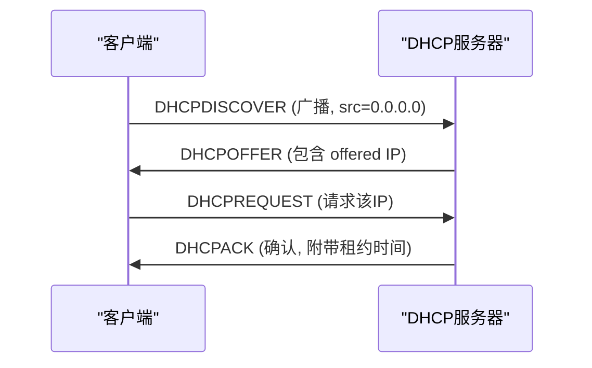
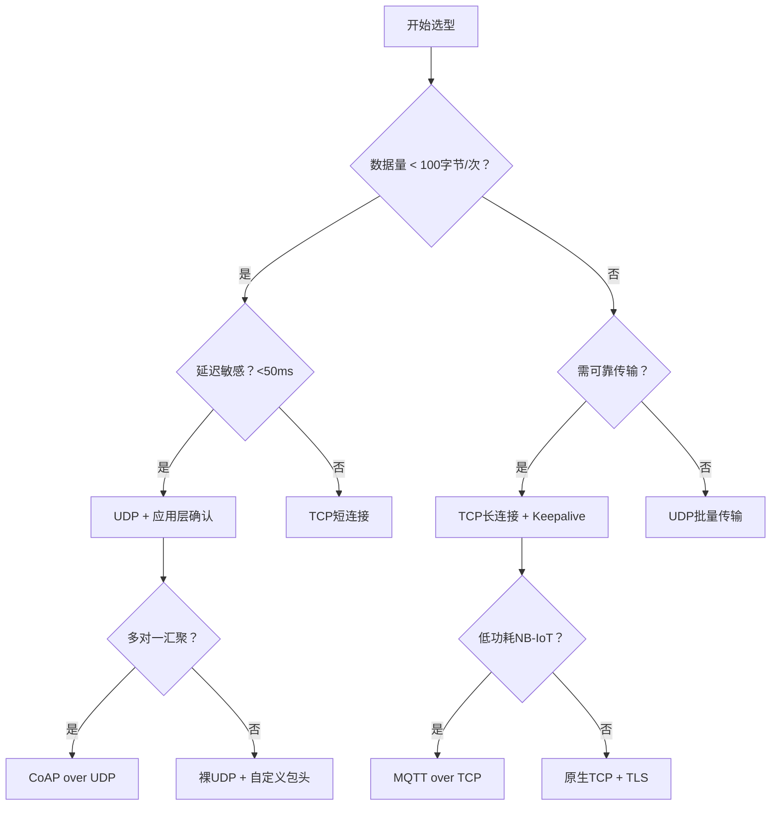

# UDP与关键协议详解

> 📊 **本章难度等级：** <span class="badge-i">**中级 (Intermediate)**</span>

---

## <strong>核心定义与价值</strong>

### <strong>UDP无连接特性</strong>

<span class="badge-i">I</span><br>
<span class="red">UDP</span>（User Datagram Protocol）在传输层提供最简单的尽力而为服务：不建立连接、不保证送达、不保证顺序。其头部仅8字节，远小于TCP的20字节。

```
UDP头部结构（8字节）：

 0      7 8     15 16    23 24    31
+--------+--------+--------+--------+
|     Source Port     |   Dest Port     |
+--------+--------+--------+--------+
|     Length        |    Checksum     |
+--------+--------+--------+--------+
```

<span class="orange"><strong>1. 为什么需要UDP：</strong></span><br>
* 实时音视频、在线游戏、DNS查询等场景对延迟极度敏感，TCP重传引入的抖动不可接受。

<span class="orange"><strong>2. 头部解读：</strong></span><br>
* <span class="green">Length</span> 包含头部+数据总长度，最小值为8（空数据报）。<span class="green">Checksum</span> 覆盖头部+数据+伪头部，可选字段（IPv4允许校验和为零）。

<span class="blue">UDP的简洁使其成为嵌入式传感器上报的理想选择：协议开销低，内存占用小，无需维护连接状态。</span><br>

---

### <strong>实战场景：传感器数据广播</strong>

<span class="badge-i">I</span><br>
温湿度传感器集群每秒采集一次数据。采用UDP广播至网关，单个包仅32字节（含4字节温度+4字节湿度+8字节时间戳+16字节设备ID）。

```c
// 文件路径：sensor_udp_broadcast.c
// 行号：1-30
#include <sys/socket.h>
#include <netinet/in.h>
#include <string.h>

int sock = socket(AF_INET, SOCK_DGRAM, 0);
struct sockaddr_in addr;
memset(&addr, 0, sizeof(addr));
addr.sin_family = AF_INET;
addr.sin_port   = htons(5005);
addr.sin_addr.s_addr = inet_addr("192.168.1.255"); /* 子网广播地址 */

uint8_t payload[32] = { /* 填充传感器数据 */ };
sendto(sock, payload, 32, 0, (struct sockaddr *)&addr, sizeof(addr));
// 代码带读：SOCK_DGRAM指定UDP，目标地址末尾255实现子网广播
```

<span class="blue">丢包1%不影响整体趋势分析；若需可靠性，可在应用层实现选择性重传，保留UDP低延迟优势。</span><br>

---

## <strong>ICMP诊断应用</strong>

### <strong>差错报告与探测</strong>

<span class="badge-i">I</span><br>
<span class="red">ICMP</span>（Internet Control Message Protocol）位于网络层，与IP同层而非其上。负责传递诊断信息与差错报告，不承载用户数据。

| 类型 | 代码 | 用途 |
|------|------|------|
| 8 | 0 | Echo Request（ping请求） |
| 0 | 0 | Echo Reply（ping响应） |
| 3 | 0-15 | Destination Unreachable（网络/主机/端口不可达） |
| 11 | 0 | Time Exceeded（TTL归零，traceroute原理） |
| 12 | 0 | Parameter Problem（IP头部参数错误） |

<span class="orange"><strong>1. traceroute原理：</strong></span><br>
* 发送UDP至目标高端口，TTL从1递增。每经过一个路由器TTL减为零，路由器返回ICMP Time Exceeded，从而探测路径节点。

```bash
# 观察traceroute发送的UDP端口
$ traceroute -n 8.8.8.8
traceroute to 8.8.8.8 (8.8.8.8), 30 hops max
 1  192.168.1.1   1.2 ms
 2  10.10.0.1     5.4 ms
 3  * * *         # 某节点丢弃ICMP或UDP
```

<span class="blue">嵌入式设备防火墙常默认丢弃ICMP，导致ping不通但TCP/UDP正常——排查时需同步测试应用层连通性。</span><br>

---

## <strong>ARP地址解析</strong>

### <strong>IP到MAC的映射</strong>

<span class="badge-i">I</span><br>
<span class="red">ARP</span>（Address Resolution Protocol）解决"已知目标IP，如何获取其MAC地址以填充以太网帧"的问题。局域网内所有通信最终依赖MAC地址完成物理投递。



<span class="orange"><strong>1. ARP表：</strong></span><br>
* 内核维护 <span class="green">/proc/net/arp</span>，老化时间默认60秒（可通过 <span class="green">sysctl net.ipv4.neigh.default.base_reachable_time_ms</span> 调整）。

<span class="orange"><strong>2. 免费ARP（Gratuitous ARP）：</strong></span><br>
* 主机上线时广播ARP请求询问自身IP，用于检测IP冲突并更新其他主机的ARP缓存。嵌入式设备DHCP获取IP后应主动发送。

```bash
# 查看ARP缓存
$ ip neigh show
192.168.1.1 dev eth0 lladdr 00:11:22:33:44:55 REACHABLE
192.168.1.10 dev eth0 lladdr aa:bb:cc:dd:ee:ff STALE
```

<span class="blue">ARP欺骗是局域网常见攻击手段。嵌入式工业网关应启用静态ARP绑定或ARP Inspection保护关键设备通信。</span><br>

---

## <strong>DHCP动态分配</strong>

### <strong>即插即用联网</strong>

<span class="badge-i">I</span><br>
<span class="red">DHCP</span>（Dynamic Host Configuration Protocol）使设备无需手动配置即可获得IP地址、子网掩码、网关与DNS服务器。嵌入式设备出厂后首次上电即依赖DHCP接入网络。



<span class="orange"><strong>1. 租约周期：</strong></span><br>
* 租期过半（T1）客户端主动续租；租期7/8（T2）若未成功则广播重新发现。嵌入式设备应监听DHCPNAK并立即重启发现流程。

<span class="orange"><strong>2. 嵌入式轻量实现：</strong></span><br>
* lwIP内置DHCP客户端仅需约2KB RAM。某些RTOS提供精简版uDHCP，支持最小功能子集。

<span class="blue">DHCP失败是嵌入式设备"无法联网"的首要根因。现场调试应首先确认DHCP服务器可达性与租约有效性。</span><br>

---

## <strong>DNS域名解析</strong>

### <strong>名字到地址的翻译</strong>

<span class="badge-i">I</span><br>
<span class="red">DNS</span>（Domain Name System）是互联网的分布式电话簿。嵌入式设备连接云平台时通常配置域名而非硬编码IP，以应对后端迁移。

<span class="orange"><strong>1. 解析流程：</strong></span><br>
* 客户端向 <span class="green">/etc/resolv.conf</span> 中指定的DNS服务器（通常是网关或8.8.8.8）发送UDP查询。响应包含A记录（IPv4）或AAAA记录（IPv6）。

<span class="orange"><strong>2. 嵌入式缓存策略：</strong></span><br>
* 无本地DNS缓存的嵌入式设备每次连接都发起查询，增加延迟与功耗。可集成 <span class="green">c-ares</span> 或实现简易TTL缓存。

```bash
# 嵌入式设备手动解析测试
$ nslookup mqtt.example.com 8.8.8.8
Server:  8.8.8.8
Address: 8.8.8.8#53

Name:   mqtt.example.com
Address: 34.102.136.180
```

<span class="blue">DNS解析失败是"域名通IP不通"的典型表现。嵌入式OTA升级前应优先解析域名并验证IP可达性。</span><br>

---

## <strong>组播与广播</strong>

### <strong>一对多通信模型</strong>

<span class="badge-i">I</span><br>
<span class="red">组播</span>（Multicast）与<span class="red">广播</span>（Broadcast）均实现单发多收，但适用域与效率不同。

| 特性 | 广播 | 组播 |
|------|------|------|
| 目标地址 | 子网广播地址（如x.x.x.255） | D类地址（224.0.0.0-239.255.255.255） |
| 路由器转发 | 不跨路由器 | 可跨路由器（需IGMP/MLD） |
| 接收方 | 子网内所有主机 | 仅加入该组的主机 |
| 嵌入式场景 | 局域网设备发现 | 视频监控流分发 |

<span class="orange"><strong>1. IGMP协议：</strong></span><br>
* 主机通过 <span class="green">IGMP</span> 向路由器报告加入/离开组播组。IPv6对应 <span class="green">MLD</span>。嵌入式设备若需接收组播流，必须正确实现IGMPv2/v3。

<span class="orange"><strong>2. 组播MAC映射：</strong></span><br>
* IPv4组播地址低23位直接映射到MAC地址前缀 <span class="green">01:00:5E</span>。例如 239.255.0.1 对应 01:00:5E:7F:00:01。交换机根据此MAC进行泛洪或IGMP Snooping转发。

```c
// 文件路径：multicast_join.c
// 行号：组播加入示例
struct ip_mreq mreq;
mreq.imr_multiaddr.s_addr = inet_addr("239.255.0.1");
mreq.imr_interface.s_addr = INADDR_ANY;
setsockopt(sock, IPPROTO_IP, IP_ADD_MEMBERSHIP, &mreq, sizeof(mreq));
// 代码带读：IP_ADD_MEMBERSHIP触发内核发送IGMP Report，路由器记录该接口需接收此组播流
```

<span class="blue">组播是嵌入式视频监控与工业同步协议（如PTP）的核心传输方式，理解IGMP与二层映射是排查组播不通的关键。</span><br>

---

## <strong>嵌入式协议选择决策树</strong>

### <strong>场景驱动的选型逻辑</strong>

<span class="badge-i">I</span><br>
嵌入式网络开发没有"最好"的协议，只有"最适合当前约束"的协议。以下决策树基于延迟、可靠性、功耗、复杂度四维度构建。



| 场景 | 推荐协议 | 理由 |
|------|----------|------|
| 传感器周期性上报 | UDP + CoAP | 低功耗、头部压缩、支持确认 |
| 远程固件升级 | TCP + TLS | 可靠性要求100%，文件完整性校验 |
| 实时控制指令 | UDP + 冗余双发 | 延迟优先，50ms超时切换 |
| 视频监控流 | UDP组播 + RTP | 带宽效率高，容忍帧丢失 |
| 设备配置管理 | TCP + SSH/TLS | 安全交互，命令响应需可靠 |

<span class="blue">协议选型的本质是工程权衡。在嵌入式领域，资源约束将通用方案压缩至极致，每一个字节和每一毫瓦都需要被精确计算。</span><br>

---

## <strong>历史演进</strong>

### <strong>从简单到适配受限环境</strong>

<span class="badge-i">I</span><br>
1980年，UDP随TCP-IP suite一同标准化（RFC 768），Jon Postel以极简哲学定义其头部。ARP于1982年标准化（RFC 826），奠定局域网通信基础。

1984年，BOOTP（RFC 951）首次实现无盘工作站自动配置IP，但仅能分配地址。1993年DHCP（RFC 2131）扩展为全面配置协议，支持租约与续租。

1983年，DNS（RFC 882/883）随ARPANET NCP向TCP-IP迁移而诞生。Paul Mockapetris设计其分布式架构，至今仍是互联网核心基础设施。

1989年，Steve Deering提出IP组播（RFC 1112），将"一对多"通信引入互联网。IGMP随后标准化，使路由器能够智能转发组播流量。

2014年，CoAP（RFC 7252）专为受限节点设计，将HTTP语义映射至UDP之上，头部开销压缩至4字节。lwIP与Contiki等嵌入式协议栈迅速集成，成为IoT标准选择之一。

<span class="blue">关键协议的设计哲学殊途同归：在资源受限与功能完备之间寻找最小可行边界。</span><br>

---

## <strong>本章小结</strong>

| 知识点 | 核心要点 | 难度 |
|--------|----------|------|
| UDP | 无连接、8字节头、低延迟、不保证送达 | I |
| ICMP | 诊断与差错、ping/traceroute依赖 | I |
| ARP | IP转MAC、免费ARP检测冲突 | I |
| DHCP | DORA流程、租约续租、嵌入式轻量实现 | I |
| DNS | A/AAAA记录解析、嵌入式需本地缓存 | I |
| 组播 | IGMP加入、D类地址、MAC映射 | I |
| 决策树 | 延迟/可靠性/功耗/复杂度四维度权衡 | I |

---

## <strong>课后练习</strong>

<span class="orange"><strong>练习1：</strong></span><br>
某传感器通过UDP每10秒上报一次数据，报文100字节。计算以太网帧总长度（含ETH头+IP头+UDP头），并比较若改用TCP短连接时的额外开销比例。<br>

<span class="orange"><strong>练习2：</strong></span><br>
使用tcpdump抓取一次完整的DHCP DORA交互过程，标注每一步的源IP、目的IP、源端口、目的端口，并解释为什么DHCPDISCOVER使用0.0.0.0作为源地址。<br>

<span class="orange"><strong>练习3：</strong></span><br>
设计一个嵌入式场景（至少三个设备角色：传感器、网关、云），为该场景中每种通信流选择协议并论证，要求同时涵盖UDP、TCP、组播三种传输方式。<br>
