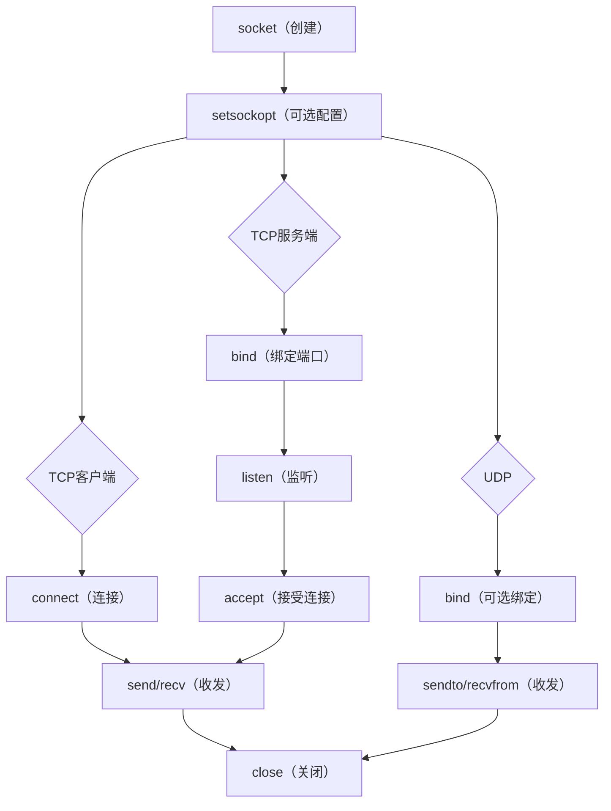

# Socket编程基础与实战

> 📊 **本章难度等级：** <span class="badge-i">**中级 (Intermediate)**</span>

---

## <strong>核心定义与价值</strong>

### <strong>Socket API完整步骤</strong>

<span class="badge-i">I</span><br>
<span class="red">Socket</span>是操作系统向应用层暴露网络通信能力的统一抽象。无论是TCP还是UDP，POSIX Socket API均遵循"创建-配置-连接/绑定-收发-关闭"五阶段模型。



<span class="orange"><strong>1. 创建阶段：</strong></span><br>
* <span class="green">AF_INET</span> 指定IPv4，<span class="green">SOCK_STREAM</span> 指定TCP字节流，<span class="green">SOCK_DGRAM</span> 指定UDP数据报。

<span class="orange"><strong>2. 地址填充：</strong></span><br>
* <span class="green">sockaddr_in</span> 结构体必须清零后填充，<span class="green">htonl/ntohl</span> 处理地址与端口的字节序。

<span class="blue">Socket API是嵌入式网络编程的唯一入口。掌握其调用顺序与错误处理，是写出稳定网络应用的前提。</span><br>

---

## <strong>TCP客户端代码带读</strong>

### <strong>最小可运行示例</strong>

<span class="badge-i">I</span><br>
以下代码展示嵌入式TCP客户端的完整生命周期，包含健壮性处理。

```c
/* 文件路径：tcp_client.c */
/* 行号：1-60 */
#include <sys/socket.h>
#include <netinet/in.h>
#include <arpa/inet.h>
#include <unistd.h>
#include <string.h>
#include <errno.h>
#include <stdio.h>

#define SERVER_IP   "192.168.1.100"
#define SERVER_PORT 8080
#define RECV_BUF_SIZE 1024

int tcp_client_connect(void)
{
    int sock;
    struct sockaddr_in srv_addr;
    char recv_buf[RECV_BUF_SIZE];
    ssize_t n;

    /* 1. 创建IPv4 TCP Socket */
    sock = socket(AF_INET, SOCK_STREAM, 0);
    if (sock < 0) {
        perror("socket failed");          /* 打印errno对应文本 */
        return -1;
    }

    /* 2. 填充服务器地址结构体 */
    memset(&srv_addr, 0, sizeof(srv_addr));
    srv_addr.sin_family = AF_INET;
    srv_addr.sin_port   = htons(SERVER_PORT);         /* 端口转网络字节序 */
    if (inet_pton(AF_INET, SERVER_IP, &srv_addr.sin_addr) <= 0) {
        perror("inet_pton failed");       /* IP字符串转二进制地址 */
        close(sock);
        return -1;
    }

    /* 3. 发起连接 */
    if (connect(sock, (struct sockaddr *)&srv_addr, sizeof(srv_addr)) < 0) {
        perror("connect failed");         /* 对端拒绝或网络不可达 */
        close(sock);
        return -1;
    }

    /* 4. 发送数据 */
    const char *msg = "GET /status HTTP/1.0\r\n\r\n";
    if (send(sock, msg, strlen(msg), 0) < 0) {
        perror("send failed");
        close(sock);
        return -1;
    }

    /* 5. 接收响应（循环处理EINTR） */
    while ((n = recv(sock, recv_buf, sizeof(recv_buf) - 1, 0)) > 0) {
        recv_buf[n] = '\0';
        printf("%s", recv_buf);
    }
    if (n < 0 && errno != EINTR) {
        perror("recv failed");
    }

    /* 6. 关闭连接 */
    close(sock);
    return 0;
}
```

<span class="orange"><strong>代码带读要点：</strong></span><br>
* 第9-11行：<span class="green">inet_pton</span> 替代已废弃的 <span class="green">inet_addr</span>，支持IPv4/IPv6且可检测无效地址。<br>
* 第21行：<span class="green">memset</span> 清零 sockaddr_in 避免填充杂散数据导致connect行为异常。<br>
* 第37-39行：<span class="green">recv</span> 返回0表示对端正常关闭；<span class="green">EINTR</span> 表示被信号中断，应重试而非报错。

---

## <strong>TCP服务端代码带读</strong>

### <strong>迭代式服务端</strong>

<span class="badge-i">I</span><br>
嵌入式设备充当服务端（如配置Web服务器、Modbus网关）时，通常采用单线程迭代模型。

```c
/* 文件路径：tcp_server_iterative.c */
/* 行号：1-55 */
#include <sys/socket.h>
#include <netinet/in.h>
#include <unistd.h>
#include <string.h>
#include <errno.h>
#include <stdio.h>

#define LISTEN_PORT 8080
#define LISTEN_BACKLOG 5
#define RECV_BUF_SIZE 256

int tcp_server_run(void)
{
    int listen_fd, conn_fd;
    struct sockaddr_in srv_addr, cli_addr;
    socklen_t cli_len = sizeof(cli_addr);
    char buf[RECV_BUF_SIZE];
    ssize_t n;

    /* 1. 创建监听Socket */
    listen_fd = socket(AF_INET, SOCK_STREAM, 0);
    if (listen_fd < 0) {
        perror("socket failed");
        return -1;
    }

    /* 2. SO_REUSEADDR：快速重启时可立即复用端口 */
    int reuse = 1;
    setsockopt(listen_fd, SOL_SOCKET, SO_REUSEADDR, &reuse, sizeof(reuse));

    /* 3. 绑定本机所有IP的LISTEN_PORT */
    memset(&srv_addr, 0, sizeof(srv_addr));
    srv_addr.sin_family = AF_INET;
    srv_addr.sin_addr.s_addr = htonl(INADDR_ANY); /* 0.0.0.0 */
    srv_addr.sin_port = htons(LISTEN_PORT);

    if (bind(listen_fd, (struct sockaddr *)&srv_addr, sizeof(srv_addr)) < 0) {
        perror("bind failed");
        close(listen_fd);
        return -1;
    }

    /* 4. 进入监听状态 */
    if (listen(listen_fd, LISTEN_BACKLOG) < 0) {
        perror("listen failed");
        close(listen_fd);
        return -1;
    }

    printf("Server listening on port %d\n", LISTEN_PORT);

    /* 5. 迭代接受连接并处理 */
    while (1) {
        conn_fd = accept(listen_fd, (struct sockaddr *)&cli_addr, &cli_len);
        if (conn_fd < 0) {
            if (errno == EINTR)
                continue;                 /* 信号中断，重试accept */
            perror("accept failed");
            continue;
        }

        /* 6. 简单回显 */
        while ((n = recv(conn_fd, buf, sizeof(buf), 0)) > 0) {
            send(conn_fd, buf, n, 0);   /* 回写客户端 */
        }
        close(conn_fd);                   /* 7. 关闭连接 */
    }

    close(listen_fd);
    return 0;
}
```

<span class="orange"><strong>代码带读要点：</strong></span><br>
* 第18-19行：<span class="green">SO_REUSEADDR</span> 允许重启进程后立即绑定同一端口，否则需等待TIME-WAIT（2MSL）结束。<br>
* 第24行：<span class="green">INADDR_ANY</span> 使服务端监听所有接口（eth0/wlan0/lo），嵌入式多网卡场景必备。<br>
* 第42行：<span class="green">accept</span> 阻塞直至新连接到达，返回新描述符用于与客户端通信，原listen_fd继续监听。

---

### <strong>实战场景：嵌入式HTTP配置接口</strong>

<span class="badge-i">I</span><br>
工业控制器内置微型HTTP服务端（端口80），允许工程师通过浏览器修改参数。采用迭代模型处理单次GET请求，响应后立即关闭。

```bash
# 测试服务端连通性
$ curl http://192.168.1.50/api/config
{"temp_threshold":85,"fan_mode":"auto"}
```

<span class="blue">迭代服务端在单客户端场景足够高效，多客户端并发时accept队列会溢出，应切换至多路复用或线程池模型。</span><br>

---

## <strong>UDP编程</strong>

### <strong>无连接收发模型</strong>

<span class="badge-i">I</span><br>
UDP不使用connect/bind建立通道，直接通过 <span class="green">sendto</span> / <span class="green">recvfrom</span> 指定每次通信的对端地址。

```c
/* 文件路径：udp_echo.c */
/* 行号：1-40 */
#include <sys/socket.h>
#include <netinet/in.h>
#include <unistd.h>
#include <string.h>
#include <stdio.h>

#define UDP_PORT 5005
#define BUF_SIZE 256

int udp_echo_server(void)
{
    int sock;
    struct sockaddr_in srv_addr, cli_addr;
    socklen_t cli_len = sizeof(cli_addr);
    char buf[BUF_SIZE];
    ssize_t n;

    sock = socket(AF_INET, SOCK_DGRAM, 0);
    if (sock < 0) {
        perror("socket failed");
        return -1;
    }

    memset(&srv_addr, 0, sizeof(srv_addr));
    srv_addr.sin_family = AF_INET;
    srv_addr.sin_addr.s_addr = htonl(INADDR_ANY);
    srv_addr.sin_port = htons(UDP_PORT);

    if (bind(sock, (struct sockaddr *)&srv_addr, sizeof(srv_addr)) < 0) {
        perror("bind failed");
        close(sock);
        return -1;
    }

    while (1) {
        n = recvfrom(sock, buf, sizeof(buf), 0,
                     (struct sockaddr *)&cli_addr, &cli_len);
        if (n < 0) {
            if (errno == EINTR) continue;
            perror("recvfrom failed");
            break;
        }
        /* 从recvfrom获取的cli_addr直接用于回发 */
        sendto(sock, buf, n, 0,
               (struct sockaddr *)&cli_addr, cli_len);
    }

    close(sock);
    return 0;
}
```

<span class="orange"><strong>关键差异：</strong></span><br>
* UDP <span class="green">accept</span> 不需要，bind后直接收发。每个recvfrom携带对端地址，天然支持"一socket多客户端"。<br>
* UDP recvfrom可能截断超长数据报（>缓冲区大小），剩余部分丢弃且无通知。

---

## <strong>错误处理与errno</strong>

### <strong>常见错误码与对策</strong>

<span class="badge-i">I</span><br>
网络API调用失败时，<span class="green">errno</span> 记录具体错误原因。嵌入式资源受限场景下，精确的错误分支处理决定系统稳定性。

| errno | 触发场景 | 嵌入式对策 |
|-------|----------|------------|
| ECONNREFUSED | connect时目标端口未监听 | 重试+指数退避，或服务发现 |
| ETIMEDOUT | connect超时无响应 | 检查路由/防火墙，缩短超时 |
| EINTR | 慢系统调用被信号中断 | 必须重试，不能当 fatal error |
| ENOBUFS | 内核Socket缓冲区耗尽 | 降低并发数，减少窗口大小 |
| EAGAIN | 非阻塞Socket暂无数据 | 注册至epoll/select等待 |
| EADDRINUSE | bind端口已被占用 | SO_REUSEADDR 或更换端口 |

```c
/* 文件路径：robust_connect.c */
/* 行号：指数退避重连 */
#include <unistd.h>
#include <errno.h>

int robust_connect(int sock, struct sockaddr *addr, socklen_t len)
{
    int retries = 0;
    int max_retry = 5;
    int delay_ms = 1000;

    while (retries < max_retry) {
        if (connect(sock, addr, len) == 0)
            return 0;                       /* 成功 */

        if (errno == ECONNREFUSED || errno == ETIMEDOUT) {
            usleep(delay_ms * 1000);      /* 毫秒转微秒 */
            delay_ms *= 2;                /* 指数退避 */
            retries++;
            continue;
        }
        return -1;                          /* 不可恢复错误 */
    }
    return -1;                              /* 重试耗尽 */
}
```

<span class="blue">嵌入式网络编程中，EINTR的处理率直接决定系统在信号环境（如看门狗喂狗、定时采样）下的可用性。</span><br>

---

## <strong>非阻塞模式与SO_REUSEADDR</strong>

### <strong>非阻塞I-O的必然性</strong>

<span class="badge-i">I</span><br>
<span class="red">阻塞Socket</span>在connect/accept/recv期间挂起整个线程。嵌入式单线程主循环中，阻塞意味着传感器采样、看门狗喂狗全部停滞。

```c
/* 文件路径：nonblock.c */
/* 行号：设置非阻塞 */
#include <fcntl.h>

int set_nonblocking(int fd)
{
    int flags = fcntl(fd, F_GETFL, 0);
    if (flags < 0) return -1;
    return fcntl(fd, F_SETFL, flags | O_NONBLOCK);
}

/* 非阻塞connect后判断完成状态 */
int connect_in_progress(int sock)
{
    int err = 0;
    socklen_t len = sizeof(err);
    if (getsockopt(sock, SOL_SOCKET, SO_ERROR, &err, &len) < 0)
        return -1;
    return err;                             /* 0=成功，否则错误码 */
}
```

<span class="orange"><strong>非阻塞connect流程：</strong></span><br>
* connect立即返回 <span class="green">EINPROGRESS</span>，注册sock到 <span class="green">epoll/select</span> 等待可写事件，再通过 <span class="green">SO_ERROR</span> 判断实际结果。

---

### <strong>SO_REUSEADDR与SO_REUSEPORT</strong>

<span class="badge-i">I</span><br>
<span class="red">SO_REUSEADDR</span> 允许复用处于TIME-WAIT状态的端口，解决服务端重启后bind失败的问题。

```c
/* 文件路径：server_reuse.c */
/* 行号：端口复用配置 */
int reuse = 1;
setsockopt(sock, SOL_SOCKET, SO_REUSEADDR, &reuse, sizeof(reuse));

/* Linux 3.9+ 支持SO_REUSEPORT实现内核级负载均衡 */
int reuseport = 1;
setsockopt(sock, SOL_SOCKET, SO_REUSEPORT, &reuseport, sizeof(reuseport));
```

<span class="orange"><strong>嵌入式应用：</strong></span><br>
* 固件OTA升级后进程重启，SO_REUSEADDR确保新进程立即恢复监听，避免端口不可用窗口。<br>
* 多核嵌入式处理器上，SO_REUSEPORT让内核将新连接均匀分发至多个监听进程，减少锁竞争。

---

## <strong>嵌入式Socket调优</strong>

### <strong>内核参数与Socket选项矩阵</strong>

<span class="badge-e">E</span><br>
嵌入式设备的Socket调优目标是"在有限内存下最大化吞吐量并最小化延迟"。

| Socket选项 | 作用 | 嵌入式建议值 |
|------------|------|--------------|
| SO_RCVBUF | 接收缓冲区 | 8-32KB（内存紧张时取下限） |
| SO_SNDBUF | 发送缓冲区 | 8-32KB |
| TCP_NODELAY | 禁用Nagle | 实时控制启用，日志传输禁用 |
| TCP_QUICKACK | 禁用延迟ACK | 低延迟交互启用 |
| SO_RCVTIMEO | 接收超时 | 5-30秒，防永久阻塞 |
| SO_SNDTIMEO | 发送超时 | 5-30秒 |
| SO_KEEPALIVE | TCP保活探测 | 长连接启用，调优至秒级 |

```bash
# 查看某Socket的实际缓冲区大小（内核可能翻倍）
$ cat /proc/self/net/sockstat
sockets: used 12
TCP: inuse 8, orphan 0, tw 2, alloc 10, mem 2
```

<span class="blue">调优顺序：先Socket选项，后内核参数。Socket选项仅影响单个fd，内核参数影响全局。</span><br>

---

### <strong>实战场景：电池供电设备的Socket休眠策略</strong>

<span class="badge-e">E</span><br>
NB-IoT水表每24小时上报一次。为最大化电池寿命，Socket连接应仅在传输窗口打开。

```c
/* 文件路径：lowpower_socket.c */
/* 行号：按需连接 */
int send_batched_data(uint8_t *data, size_t len)
{
    int sock = socket(AF_INET, SOCK_STREAM, 0);
    struct timeval tv = { .tv_sec = 10, .tv_usec = 0 };
    setsockopt(sock, SOL_SOCKET, SO_SNDTIMEO, &tv, sizeof(tv));
    setsockopt(sock, SOL_SOCKET, SO_RCVTIMEO, &tv, sizeof(tv));

    if (connect(sock, ... ) < 0) {
        close(sock);
        return -1;
    }
    send(sock, data, len, 0);
    /* 等待ACK或超时 */
    char ack_buf[4];
    recv(sock, ack_buf, sizeof(ack_buf), 0);
    close(sock);
    return 0;
}
```

<span class="blue">短连接+超时控制+立即关闭，将模组在线时间压缩至最低，是低功耗嵌入式网络的黄金法则。</span><br>

---

## <strong>历史演进</strong>

### <strong>从Berkeley Socket到io_uring</strong>

<span class="badge-i">I</span><br>
1983年，<span class="green">4.2BSD</span> 引入Berkeley Socket API，成为事实标准。其设计哲学"一切皆文件"使网络fd与文件fd共享read/write接口。

1990年代，<span class="green">Winsock</span> 将Socket引入Windows，但引入WSA前缀与异步模型差异，跨平台兼容性至今仍是痛点。

2002年，<span class="green">POSIX.1-2001</span> 标准化Socket API，统一 <span class="green">socklen_t</span>、<span class="green">getaddrinfo</span> 等接口。

2010年代，<span class="green">Netlink</span> 与 <span class="green">AF_PACKET</span> 扩展Socket至内核配置与原始链路层访问。

2019年，Linux 5.1引入 <span class="green">io_uring</span>，提供基于环形缓冲的异步I/O接口。相比epoll+非阻塞Socket，io_uring减少两次用户态-内核态切换，在高频小包场景（如IoT网关）降低CPU占用30%以上。

<span class="blue">Socket API四十年未变的是抽象哲学，持续进化的是性能边界。嵌入式开发者需在传统POSIX与新兴异步模型之间做出符合硬件代际的选择。</span><br>

---

## <strong>本章小结</strong>

| 知识点 | 核心要点 | 难度 |
|--------|----------|------|
| Socket五阶段 | 创建-配置-连接/绑定-收发-关闭 | I |
| TCP客户端 | connect+send+recv，EINTR重试 | I |
| TCP服务端 | bind+listen+accept，SO_REUSEADDR必备 | I |
| UDP | sendto/recvfrom，一socket多客户端 | I |
| errno处理 | EINTR重试、ECONNREFUSED退避、EAGAIN注册 | I |
| 非阻塞 | O_NONBLOCK+SO_ERROR判断connect结果 | I |
| 调优矩阵 | 缓冲区/Nagle/ACK/超时/Keepalive组合配置 | E |

---

## <strong>课后练习</strong>

<span class="orange"><strong>练习1：</strong></span><br>
将迭代式TCP服务端改造为支持10个并发连接的形式，不使用线程/进程，仅用非阻塞Socket+select实现。写出核心accept与收发循环。<br>

<span class="orange"><strong>练习2：</strong></span><br>
编写一个健壮的非阻塞connect函数，支持自定义超时（3秒），在超时后返回错误且关闭Socket。要求正确处理EINPROGRESS和EAGAIN。<br>

<span class="orange"><strong>练习3：</strong></span><br>
在树莓派或嵌入式Linux上实测SO_RCVBUF=8192与SO_RCVBUF=65535对iperf吞吐量的影响，绘制RTT=10ms与RTT=100ms两条曲线。<br>
