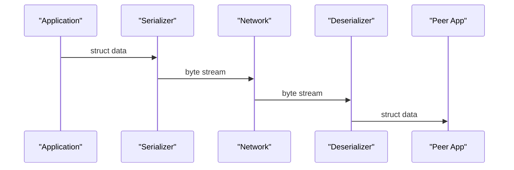

# 嵌入式数据表示与序列化

> 📊 **本章难度等级：** <span class="badge-i">**中级 (Intermediate)**</span>

---

## <strong>核心定义与价值</strong>

### <strong>为什么数据表示是嵌入式网络的基础</strong>

<span class="badge-i">I</span><br>
<span class="red">数据序列化</span>将内存中的结构化数据转换为可通过网络传输的字节流。嵌入式设备与服务器、设备与设备之间的每一次通信，本质上都涉及“发送端编码→网络传输→接收端解码”的循环。

不同架构的设备（ARM小端、MIPS大端、x86小端）对同一结构体的内存布局理解可能完全不同。忽略数据表示的一致性，将导致“程序不崩溃但数据全错”的隐蔽缺陷。

<span class="blue">数据序列化是嵌入式网络中最容易被忽视、但影响最深远的底层能力。</span><br>

---

## <strong>字节序转换实战</strong>

### <strong>htonl/htons/ntohl/ntohs 的完整语义</strong>

<span class="badge-i">I</span><br>
<span class="red">字节序</span>（Endianness）决定多字节数值在内存中的排列顺序。网络协议统一采用大端（Big-Endian），主机字节序取决于处理器架构。

```c
/* 文件路径：byteorder_demo.c */
/* 行号：1-30 */
#include <arpa/inet.h>
#include <stdint.h>
#include <stdio.h>

void byteorder_demo(void)
{
    uint32_t host_val = 0x12345678;
    uint32_t net_val  = htonl(host_val);

    printf("Host: 0x%08X\n", host_val);
    printf("Net:  0x%08X\n", net_val);

    /* 小端主机内存布局：78 56 34 12 */
    /* 网络字节序布局：    12 34 56 78 */

    uint16_t port = 8080;
    uint16_t net_port = htons(port);
    printf("Port host: %d\n", port);
    printf("Port net:  0x%04X\n", net_port);  /* 0x1F90 */
}
```

<span class="orange"><strong>1. 为什么 htons(8080) 返回 0x1F90：</strong></span><br>
* 8080 = 0x1F90。大端存储时高字节 0x1F 在前，低字节 0x90 在后，与小端主机的 0x901F 互为镜像。

<span class="orange"><strong>2. 转换规则：</strong></span><br>
* <span class="green">hton*</span>：Host to Network，发送前调用。<br>
* <span class="green">ntoh*</span>：Network to Host，接收后调用。<br>
* 大端主机上两者为空操作，小端主机上执行字节交换。

<span class="blue">在发送任何多字节数值（端口号、长度字段、协议版本）前调用hton*，是嵌入式网络编程的绝对铁律。</span><br>

---

### <strong>手动字节序转换实现</strong>

<span class="badge-i">I</span><br>
在lwIP或裸机环境中，标准库可能不可用，需手动实现。

```c
/* 文件路径：manual_swap.h */
/* 行号：1-20 */
#ifndef MANUAL_SWAP_H
#define MANUAL_SWAP_H

#include <stdint.h>

static inline uint16_t swap16(uint16_t val)
{
    return ((val & 0xFF) << 8) | ((val >> 8) & 0xFF);
}

static inline uint32_t swap32(uint32_t val)
{
    return ((val & 0x000000FF) << 24) |
           ((val & 0x0000FF00) << 8)  |
           ((val & 0x00FF0000) >> 8)  |
           ((val & 0xFF000000) >> 24);
}

#if __BYTE_ORDER__ == __ORDER_LITTLE_ENDIAN__
#define htonl_manual(x) swap32(x)
#define htons_manual(x) swap16(x)
#define ntohl_manual(x) swap32(x)
#define ntohs_manual(x) swap16(x)
#else
#define htonl_manual(x) (x)
#define htons_manual(x) (x)
#define ntohl_manual(x) (x)
#define ntohs_manual(x) (x)
#endif

#endif
```

<span class="blue">手动实现依赖编译器预定义宏判断主机字节序，在无标准库的深度嵌入式环境中是唯一可行方案。</span><br>

---

## <strong>结构体对齐与__packed</strong>

### <strong>为什么默认对齐会引入填充</strong>

<span class="badge-i">I</span><br>
<span class="red">结构体对齐</span>是编译器为提升内存访问效率而插入的填充字节。对齐边界取决于架构（ARM通常为4字节），但不同编译器、不同优化级别可能产生差异。

```c
/* 文件路径：struct_align_demo.c */
/* 行号：1-20 */
#include <stdio.h>

struct sensor_packet {
    uint8_t  type;      /* 1字节 */
    uint32_t timestamp; /* 4字节，编译器在type后插入3字节填充 */
    uint16_t value;     /* 2字节，后跟2字节填充使整体4字节对齐 */
};

/* 实际内存布局（ARM GCC -O2）：
 * type(1) + pad(3) + timestamp(4) + value(2) + pad(2) = 12字节
 * 而非直观的 1+4+2=7字节
 */

int main(void) {
    printf("sizeof(struct sensor_packet) = %zu\n", sizeof(struct sensor_packet));
    return 0;
}
```

<span class="orange"><strong>1. 网络传输的陷阱：</strong></span><br>
* 发送端按12字节发送，接收端若编译器不同可能按8字节或16字节解析，字段全部错位。

<span class="orange"><strong>2. __packed 的代价：</strong></span><br>
* <span class="green">__attribute__((packed))</span> 禁止填充，确保布局一致，但可能触发非对齐访问异常（ARMv5未对齐访问将导致总线错误）。

---

### <strong>嵌入式结构体设计规范</strong>

<span class="badge-e">E</span><br>
跨平台传输的结构体应遵循“大字段在前、按大小降序排列”原则，最小化填充。

```c
/* 文件路径：sensor_packet_packed.h */
/* 行号：1-25 */
#ifndef SENSOR_PACKET_H
#define SENSOR_PACKET_H

#include <stdint.h>

/* 按字段大小降序排列，ARM上自然对齐无填充 */
struct sensor_packet_aligned {
    uint32_t timestamp; /* offset 0 */
    uint16_t value;     /* offset 4 */
    uint8_t  type;      /* offset 6 */
    uint8_t  reserved;  /* offset 7，显式填充 */
};

/* 强制紧凑布局（用于已知支持非对齐访问的ARM Cortex-M） */
struct __attribute__((packed)) sensor_packet_packed {
    uint32_t timestamp; /* offset 0 */
    uint16_t value;     /* offset 4 */
    uint8_t  type;      /* offset 6 */
};

#endif
```

| 布局方式 | 大小 | 兼容性 | 性能 | 适用场景 |
|----------|------|--------|------|----------|
| 自然对齐 | 8字节 | 差（编译器依赖） | 最优 | 单机内存访问 |
| 手动排序 | 8字节 | 优 | 优 | 跨平台网络传输 |
| __packed | 7字节 | 最优 | 降速 | 带宽极度受限 |

<span class="blue">嵌入式网络结构体设计的黄金法则：宁可在代码中多写1字节显式保留字段，也不要依赖编译器的默认对齐。</span><br>

---

## <strong>网络字节序实战</strong>

### <strong>协议帧的手动编解码</strong>

<span class="badge-i">I</span><br>
嵌入式自定义协议通常定义固定格式的二进制帧。发送端严格按网络字节序编码，接收端逐字段解析。

```c
/* 文件路径：protocol_codec.c */
/* 行号：1-50 */
#include <stdint.h>
#include <arpa/inet.h>
#include <string.h>

#define FRAME_MAGIC  0xA55A
#define FRAME_VER    0x01

struct __attribute__((packed)) frame_header {
    uint16_t magic;     /* 帧头标识 */
    uint8_t  version;   /* 协议版本 */
    uint16_t length;    /* payload长度 */
    uint32_t seq;       /* 序列号 */
};

/* 编码：结构体 -> 字节流 */
int frame_encode(const struct frame_header *hdr, uint8_t *out, size_t maxlen)
{
    if (maxlen < sizeof(struct frame_header))
        return -1;

    uint16_t magic  = htons(hdr->magic);
    uint16_t length = htons(hdr->length);
    uint32_t seq    = htonl(hdr->seq);

    out[0] = (magic >> 8) & 0xFF;   /* 大端：高字节在前 */
    out[1] = magic & 0xFF;
    out[2] = hdr->version;
    out[3] = (length >> 8) & 0xFF;
    out[4] = length & 0xFF;
    out[5] = (seq >> 24) & 0xFF;
    out[6] = (seq >> 16) & 0xFF;
    out[7] = (seq >> 8) & 0xFF;
    out[8] = seq & 0xFF;
    return sizeof(struct frame_header);
}

/* 解码：字节流 -> 结构体 */
int frame_decode(const uint8_t *in, struct frame_header *hdr)
{
    if (in[0] != 0xA5 || in[1] != 0x5A)
        return -1;                      /* 帧头校验失败 */

    hdr->magic   = (in[0] << 8) | in[1];
    hdr->version = in[2];
    hdr->length  = (in[3] << 8) | in[4];
    hdr->seq     = ((uint32_t)in[5] << 24) |
                   ((uint32_t)in[6] << 16) |
                   ((uint32_t)in[7] << 8)  |
                   (uint32_t)in[8];
    return 0;
}
```

<span class="orange"><strong>代码带读：</strong></span><br>
* 第28-36行：不直接memcpy结构体，而是逐字段按大端顺序写入，彻底消除对齐与字节序差异。
* 第42行：帧头魔数校验是接收端的第一道防线，防止解析随机噪音。

<span class="blue">memcpy结构体到Socket是嵌入式网络中最危险的习惯。逐字段编码虽繁琐，但保证跨平台100%兼容。</span><br>

---

## <strong>Protobuf嵌入式适配</strong>

### <strong>为什么选Protobuf</strong>

<span class="badge-i">I</span><br>
<span class="red">Protocol Buffers</span>是Google设计的二进制序列化格式。相比JSON，其编码紧凑、解析快速；相比手动二进制帧，其自动生成编解码代码且具备前向兼容能力。

```protobuf
/* 文件路径：sensor.proto */
/* 行号：1-15 */
syntax = "proto3";

message SensorReading {
    uint32 device_id  = 1;
    uint64 timestamp  = 2;
    float  temperature = 3;
    float  humidity    = 4;
    bytes  raw_adc     = 5;
}
```

<span class="orange"><strong>1. 嵌入式轻量运行时：</strong></span><br>
* <span class="green">nanopb</span> 是Protobuf的C语言实现，仅需数KB ROM与几百字节RAM，支持Arduino与裸机ARM。

<span class="orange"><strong>2. 前向兼容机制：</strong></span><br>
* 字段编号机制允许接收端忽略未知字段。服务端新增字段后，旧设备仍可正常解析已知部分。

```bash
# 生成C编解码代码
$ python nanopb_generator.py sensor.proto
# 输出：sensor.pb.c / sensor.pb.h
```

<span class="blue">Protobuf在“向后兼容”与“紧凑编码”之间取得最佳平衡，是嵌入式设备与云端长期演进的首选格式。</span><br>

---

## <strong>JSON-XML轻量替代</strong>

### <strong>受限节点的文本序列化</strong>

<span class="badge-i">I</span><br>
文本格式（JSON/XML）调试友好但体积膨胀。在带宽充裕或人可读性优先的场景下，嵌入式设备仍需支持。

| 格式 | 典型膨胀率 | 解析库 | 嵌入式适用性 |
|------|------------|--------|--------------|
| JSON | 2-5x | cJSON/jsmn | 中（RAM敏感） |
| XML  | 5-10x | TinyXML-2 | 低 |
| CBOR | 1-1.5x | tinycbor | 高（二进制JSON） |

<span class="orange"><strong>1. cJSON最小集成：</strong></span><br>
* <span class="green">cJSON</span> 单头单文件实现，仅3KB代码。适用于配置下发、调试接口等人机交互场景。

```c
/* 文件路径：json_sensor.c */
/* 行号：1-20 */
#include "cJSON.h"
#include <stdio.h>

void json_pack_sensor(float temp, float hum)
{
    cJSON *root = cJSON_CreateObject();
    cJSON_AddNumberToObject(root, "temperature", temp);
    cJSON_AddNumberToObject(root, "humidity", hum);
    char *str = cJSON_PrintUnformatted(root);  /* 紧凑输出，无换行 */
    printf("%s\n", str);                       /* {"temperature":23.5,"humidity":60.2} */
    free(str);
    cJSON_Delete(root);
}
```

<span class="orange"><strong>2. CBOR：二进制JSON：</strong></span><br>
* <span class="green">CBOR</span>（RFC 8949）将JSON语义映射至紧凑二进制，头部仅1字节，无需转义字符串。适合JSON语义习惯但带宽受限的嵌入式场景。

<span class="blue">JSON是调试的拐杖，Protobuf/CBOR是量产的引擎。开发阶段用JSON，部署阶段切二进制格式。</span><br>

---

## <strong>数据序列化性能对比</strong>

### <strong>嵌入式实测基准</strong>

<span class="badge-e">E</span><br>
以下数据基于STM32F429（180MHz Cortex-M4）实测，帧大小约64字节。

| 格式 | 编码耗时(us) | 解码耗时(us) | 帧大小(字节) | 代码占用(ROM) |
|------|--------------|--------------|--------------|---------------|
| 手动二进制 | 8 | 6 | 64 | 0.5KB |
| Protobuf(nanopb) | 45 | 38 | 72 | 8KB |
| CBOR | 120 | 95 | 68 | 6KB |
| JSON(cJSON) | 850 | 720 | 180 | 12KB |
| XML | 2000+ | 1500+ | 350+ | 25KB+ |

<span class="orange"><strong>1. 高频率传感器场景：</strong></span><br>
* 100Hz采样频率下，手动二进制编码+解码共14us，占CPU 0.14%，可忽略。JSON编码850us占8.5%，接近不可接受。

<span class="orange"><strong>2. 间歇性大数据场景：</strong></span><br>
* 每小时上报一次日志（10KB），JSON的可读性收益超过性能损失，且云端无需专用解码库。

<span class="blue">性能数据揭示核心决策逻辑：采样频率与数据体积决定格式选择，而非主观偏好。</span><br>

---

## <strong>历史演进</strong>

### <strong>从自定义二进制到标准化序列化</strong>

<span class="badge-i">I</span><br>
1980年代，嵌入式系统使用纯自定义二进制帧（如Modbus RTU），无标准可言，每套系统独立设计。

1990年代末，<span class="green">XML</span>（W3C，1998）引入自描述文本格式，但解析开销与体积使嵌入式设备难以承受。

2000年代，<span class="green">JSON</span>（Douglas Crockford，2001）以JavaScript子集形态出现，文本可读且解析简单，迅速替代XML成为Web API标准。但JSON的字符串解析仍需堆分配，在KB级RAM设备上无法运行。

2008年，Google发布<span class="green">Protocol Buffers</span>，将schema编译为高效编解码代码。2011年，nanopb项目将其带入MCU领域。

2013年，<span class="green">CBOR</span>（IETF RFC 7049）标准化，兼顾JSON语义与二进制紧凑。2016年，IoTivity与Thread协议栈采用CBOR作为数据格式。

2020年代，<span class="green">FlatBuffers</span>与<span class="green">Cap'n Proto</span>提出零拷贝序列化，跳过编码/解码阶段直接内存映射。但在32位嵌入式设备上，其内存对齐要求与指针宽度限制使实际收益有限。

<span class="blue">序列化格式的演进史，本质上是“人类可读性”与“机器效率”之间的持续博弈。嵌入式领域的天平始终倾向于后者。</span><br>

---

## <strong>本章小结</strong>

| 知识点 | 核心要点 | 难度 |
|--------|----------|------|
| 字节序转换 | htonl/htons，手动swap实现 | I |
| 结构体对齐 | 编译器填充差异，手动排序优于__packed | I |
| 协议帧编码 | 逐字段写入，魔数校验 | I |
| Protobuf | nanopb轻量实现，前向兼容 | I |
| JSON/CBOR | 调试友好vs二进制紧凑 | I |
| 性能对比 | 手动二进制>Protobuf>CBOR>JSON | E |

---

## <strong>课后练习</strong>

<span class="orange"><strong>练习1：</strong></span><br>
定义一个包含uint16_t cmd、uint32_t addr、uint8_t data[8]的帧结构。分别用自然对齐、手动排序、__packed三种方式计算sizeof，并验证ARM GCC的输出。
<br>

<span class="orange"><strong>练习2：</strong></span><br>
用nanopb编译一个包含3个字段的.proto文件，编写C代码完成一次encode→网络字节序发送→接收→decode的完整流程，输出前后数据一致性验证结果。
<br>

<span class="orange"><strong>练习3：</strong></span><br>
在同一ARM平台上实测手动二进制编码与cJSON编码的CPU周期数（使用DWT_CYCCNT），计算两者在1% CPU预算下支持的最大帧率。
<br>




