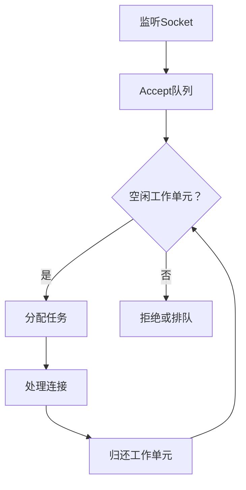
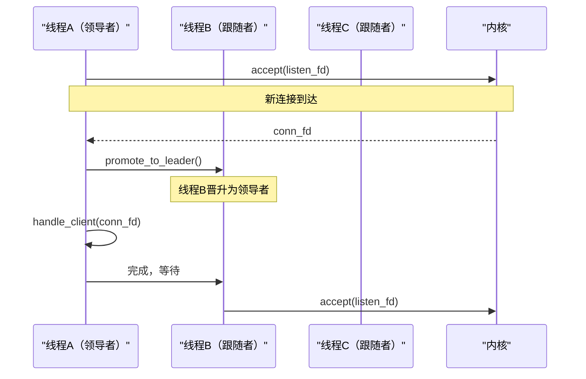
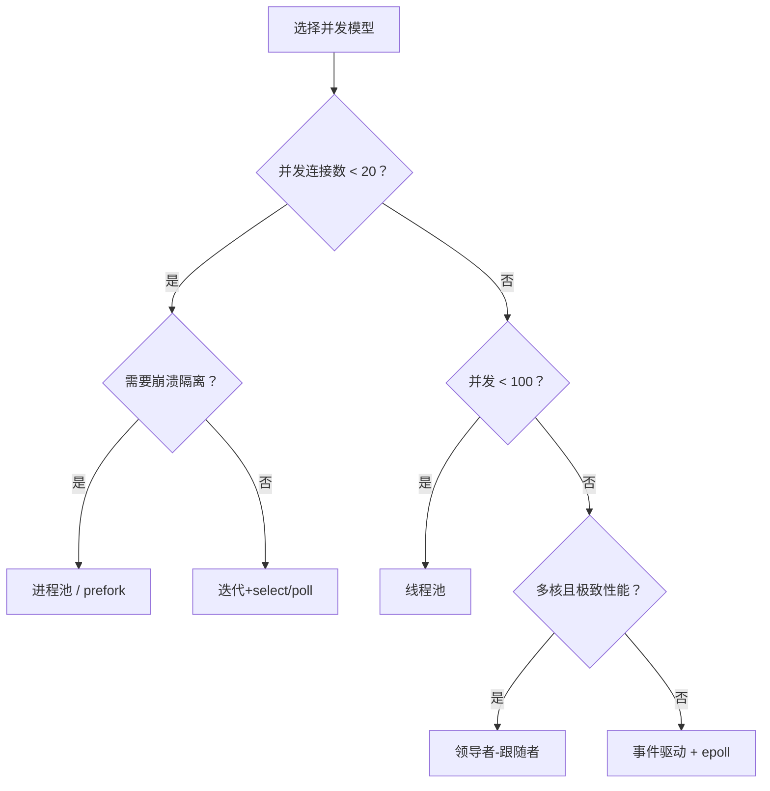

# 并发模型：多进程与多线程

> 📊 **本章难度等级：** <span class="badge-i">**中级 (Intermediate)**</span> → <span class="badge-e">**高级 (Expert)**</span>

---

## <strong>核心定义与价值</strong>

### <strong>为什么嵌入式需要并发</strong>

<span class="badge-i">I</span><br>
<span class="red">并发</span>使嵌入式服务端能够同时处理多个客户端连接。工业网关可能同时对接数十个传感器、维护Web配置界面、上传数据至云端——所有任务共享CPU但需独立I/O上下文。

并发不等于并行：单核CPU上多线程交替执行（并发），多核CPU上可同时运行（并行）。嵌入式网络编程首要解决的是<span class="green">并发I/O multiplexing</span>问题，其次才是多核并行。

<span class="blue">选择错误的并发模型会导致内存耗尽、上下文切换开销超过处理时间、或竞态条件引发随机崩溃。</span><br>

---

## <strong>fork加Socket模型</strong>

### <strong>一连接一进程</strong>

<span class="badge-i">I</span><br>
<span class="red">fork模型</span>在accept新连接后调用<span class="green">fork()</span>创建子进程，子进程继承父进程的文件描述符表，独立处理该连接。

```c
/* 文件路径：fork_server.c */
/* 行号：1-45 */
#include <sys/socket.h>
#include <sys/wait.h>
#include <unistd.h>
#include <signal.h>
#include <stdio.h>
#include <errno.h>

static void sigchld_handler(int sig)
{
    int status;
    while (waitpid(-1, &status, WNOHANG) > 0)  /* 收割僵尸进程 */
        ;
}

int fork_server_main(int listen_fd)
{
    struct sockaddr_in cli_addr;
    socklen_t cli_len = sizeof(cli_addr);
    int conn_fd;
    pid_t pid;

    signal(SIGCHLD, sigchld_handler);          /* 注册SIGCHLD处理器 */

    while (1) {
        conn_fd = accept(listen_fd, (struct sockaddr *)&cli_addr, &cli_len);
        if (conn_fd < 0) {
            if (errno == EINTR)
                continue;                        /* 被信号中断 */
            perror("accept");
            continue;
        }

        pid = fork();
        if (pid < 0) {
            perror("fork");
            close(conn_fd);
            continue;
        } else if (pid == 0) {
            /* 子进程 */
            close(listen_fd);                    /* 子进程无需监听fd */
            handle_client(conn_fd);              /* 处理连接 */
            close(conn_fd);
            _exit(0);                            /* 避免刷新stdio缓冲 */
        } else {
            /* 父进程 */
            close(conn_fd);                      /* 父进程不处理该连接 */
        }
    }
    return 0;
}
```

<span class="orange"><strong>1. 为什么子进程要关闭listen_fd：</strong></span><br>
* 子进程继承父进程fd表，不关闭则该fd在子进程中保持打开。即使子进程退出，若父进程仍在运行，内核不会真正释放该socket资源。

<span class="orange"><strong>2. _exit vs exit：</strong></span><br>
* <span class="green">_exit()</span> 直接终止进程，不调用atexit处理器，不刷新stdio缓冲区。多进程并发场景下，exit可能导致缓冲区内容重复输出。

<span class="blue">fork模型隔离性最强，单个客户端崩溃不影响其他连接，但进程创建开销（约1ms）使高并发短连接场景性能急剧下降。</span><br>

---

### <strong>实战场景：隔离关键任务</strong>

<span class="badge-i">I</span><br>
安全网关为每个远程SSH会话fork独立进程。若某会话执行危险操作（如rm -rf），崩溃仅限于该子进程，不影响主进程与其他会话。

```bash
# 观察fork服务器的进程树
$ pstree -p sshd
sshd(1234)─┬─sshd(2345)───bash(2346)
           ├─sshd(3456)───bash(3457)
           └─sshd(4567)───bash(4568)
```

<span class="blue">fork模型是安全关键嵌入式系统的默认选择，崩溃隔离的代价是可接受的资源开销。</span><br>

---

## <strong>pthread加Socket模型</strong>

### <strong>一连接一线程</strong>

<span class="badge-i">I</span><br>
<span class="red">pthread模型</span>为每个新连接创建独立线程。线程共享进程地址空间，上下文切换开销（约1-10us）远小于进程（约100us-1ms）。

```c
/* 文件路径：thread_server.c */
/* 行号：1-45 */
#include <sys/socket.h>
#include <pthread.h>
#include <unistd.h>
#include <stdio.h>
#include <stdlib.h>

struct conn_ctx {
    int conn_fd;
    struct sockaddr_in cli_addr;
};

static void *client_thread(void *arg)
{
    struct conn_ctx *ctx = (struct conn_ctx *)arg;
    int fd = ctx->conn_fd;

    handle_client(fd);                           /* 线程内处理 */
    close(fd);
    free(ctx);                                   /* 释放传入参数 */
    return NULL;
}

int thread_server_main(int listen_fd)
{
    struct sockaddr_in cli_addr;
    socklen_t cli_len = sizeof(cli_addr);
    int conn_fd;
    pthread_t tid;
    struct conn_ctx *ctx;

    while (1) {
        conn_fd = accept(listen_fd, (struct sockaddr *)&cli_addr, &cli_len);
        if (conn_fd < 0) {
            if (errno == EINTR) continue;
            perror("accept");
            continue;
        }

        ctx = malloc(sizeof(struct conn_ctx));
        if (!ctx) {
            close(conn_fd);                      /* 内存不足，拒绝连接 */
            continue;
        }
        ctx->conn_fd = conn_fd;
        ctx->cli_addr = cli_addr;

        /* 分离线程，退出后自动回收资源 */
        pthread_create(&tid, NULL, client_thread, ctx);
        pthread_detach(tid);
    }
    return 0;
}
```

<span class="orange"><strong>1. 为什么用pthread_detach：</strong></span><br>
* 不分离的线程退出后变为"僵尸线程"，保留资源直至主线程调用<span class="green">pthread_join</span>。高并发场景下僵尸线程将耗尽线程描述符。

<span class="orange"><strong>2. 共享内存的陷阱：</strong></span><br>
* 线程共享全局变量与堆内存。handle_client若访问全局状态（如设备寄存器映射），必须加<span class="green">pthread_mutex_t</span>保护，否则并发修改导致数据竞争。

<span class="blue">pthread模型在并发数<100时效率优秀，是嵌入式Linux网关的主流选择。线程数超过CPU核数后，调度开销将吃掉吞吐量增益。</span><br>

---

## <strong>进程池vs线程池</strong>

### <strong>预先创建与复用</strong>

<span class="badge-i">I</span><br>
<span class="red">进程池/线程池</span>在启动时预先创建工作单元，避免accept后再创建的开销。连接结束时工作单元不销毁，而是等待下一个任务。



| 特性 | 进程池 | 线程池 |
|------|--------|--------|
| 创建开销 | 高（fork+地址空间复制） | 低（共享地址空间） |
| 崩溃隔离 | 完全隔离 | 整个进程崩溃 |
| 全局状态共享 | 需IPC | 直接共享（需锁） |
| 内存占用 | 每个进程独立 | 线程栈（默认8MB可调） |
| 适用并发数 | <50 | <200 |

<span class="blue">嵌入式场景资源有限，线程池优于进程池；安全关键场景（如金融终端）进程池的隔离性不可替代。</span><br>

---

## <strong>预派生prefork模式</strong>

### <strong>Nginx的经典架构</strong>

<span class="badge-e">E</span><br>
<span class="red">prefork</span>在启动时创建固定数量子进程，所有子进程阻塞在同一listen_fd的accept上。内核负载均衡将新连接分发至任一子进程。

```c
/* 文件路径：prefork_server.c */
/* 行号：1-40 */
#include <sys/socket.h>
#include <unistd.h>
#include <stdio.h>
#include <sys/types.h>
#include <sys/wait.h>

#define WORKER_COUNT 4

static void worker_loop(int listen_fd)
{
    int conn_fd;
    struct sockaddr_in cli_addr;
    socklen_t cli_len = sizeof(cli_addr);

    while (1) {
        conn_fd = accept(listen_fd, (struct sockaddr *)&cli_addr, &cli_len);
        if (conn_fd < 0) {
            if (errno == EINTR) continue;
            perror("worker accept");
            continue;
        }
        handle_client(conn_fd);
        close(conn_fd);
    }
}

int prefork_server_main(int listen_fd)
{
    int i;
    pid_t pid;

    for (i = 0; i < WORKER_COUNT; i++) {
        pid = fork();
        if (pid < 0) {
            perror("fork");
            return -1;
        } else if (pid == 0) {
            /* 子进程工作循环 */
            worker_loop(listen_fd);
            _exit(0);
        }
    }

    /* 主进程仅监控，不处理连接 */
    for (i = 0; i < WORKER_COUNT; i++)
        waitpid(-1, NULL, 0);
    return 0;
}
```

<span class="orange"><strong>1. 惊群问题（Thundering Herd）：</strong></span><br>
* Linux 2.6.30+ 的accept已在内核层面解决惊群——仅唤醒一个阻塞在accept的进程，无需额外处理。

<span class="orange"><strong>2. 嵌入式启示：</strong></span><br>
* 工作进程数应等于CPU核数。多核ARM网关配置4个worker，避免调度开销与CPU争抢。

<span class="blue">prefork是嵌入式Linux网络服务的黄金架构：启动时完成全部进程创建，运行时零动态分配，稳定性极高。</span><br>

---

## <strong>领导者-跟随者模式</strong>

### <strong>自组织的线程池</strong>

<span class="badge-e">E</span><br>
<span class="red">领导者-跟随者模式</span>（Leader-Follower）中，线程池中的某一个线程担任"领导者"，负责监听accept；其他线程为"跟随者"，等待成为领导者。



<span class="orange"><strong>1. 为什么减少上下文切换：</strong></span><br>
* 传统线程池中，accept线程将连接移交给工作线程，涉及两次线程切换。领导者-跟随者模式下，原领导者直接处理连接，处理完毕后再晋升新领导者，减少一次切换。

<span class="orange"><strong>2. 嵌入式实现要点：</strong></span><br>
* 使用<span class="green">pthread_cond_t</span>实现领导者选举。晋升操作必须原子完成，防止多线程同时accept导致竞争。

<span class="blue">领导者-跟随者是性能极致场景的选择。在嵌入式ARM Cortex-A53上，该模式比传统线程池提升15%-25%吞吐量。</span><br>

---

## <strong>嵌入式并发选型矩阵</strong>

### <strong>四维度决策模型</strong>

<span class="badge-e">E</span><br>
嵌入式设备的并发模型选择需综合评估并发数、稳定性、实时性与开发复杂度。

| 场景 | 并发数 | 推荐模型 | 理由 |
|------|--------|----------|------|
| 工业Modbus网关 | <10 | 迭代+select | 简单稳定，单线程无锁 |
| Web配置服务器 | <50 | prefork | 崩溃隔离，资源可控 |
| 边缘计算节点 | <100 | 线程池 | 共享状态，低延迟 |
| 高并发API网关 | <500 | 领导者-跟随者 | 极致性能，多核利用 |
| 安全终端 | <20 | 进程池 | 完全沙箱隔离 |



<span class="blue">并发模型的选型本质是"在确定性、性能与复杂度之间分配预算"。嵌入式领域的第一原则永远是确定性优先于峰值性能。</span><br>

---

## <strong>历史演进</strong>

### <strong>从进程到事件驱动的范式迁移</strong>

<span class="badge-e">E</span><br>
1960年代，操作系统仅支持批处理，无并发概念。1970年代，Unix引入fork与pipe，首次在操作系统层面支持多进程并发。

1991年，POSIX线程标准（IEEE Std 1003.1c）发布，将线程抽象引入Unix。Solaris与Linux迅速实现，使多线程网络服务成为可能。

1995年，Apache HTTP Server采用prefork模型，成为Web服务器黄金标准，证明进程级并发在稳定性上的优势。

2004年，Nginx采用事件驱动+线程池混合架构，单进程处理数万并发连接，彻底颠覆"一连接一进程"的传统认知。

2010年代，<span class="green">io_uring</span>与异步编程语言（Rust async/await）推动"用户态调度"概念。但嵌入式领域因确定性要求，仍以线程池与prefork为主流，事件驱动仅用于I/O密集型网关。

<span class="blue">并发模型的演进并非线性替代，而是场景分化。嵌入式领域同时存在从迭代模型到线程池到事件驱动的全谱系选择，不存在唯一的"正确答案"。</span><br>

---

## <strong>本章小结</strong>

| 知识点 | 核心要点 | 难度 |
|--------|----------|------|
| fork模型 | 一连接一进程，崩溃隔离，SIGCHLD收割 | I |
| pthread模型 | 一连接一线程，pthread_detach防僵尸 | I |
| 进程/线程池 | 预先创建，避免动态分配开销 | I |
| prefork | 启动时创建worker，内核负载均衡accept | E |
| 领导者-跟随者 | 自组织线程池，减少切换 | E |
| 选型矩阵 | 并发数/稳定性/实时性/复杂度四维度 | E |

---

## <strong>课后练习</strong>

<span class="orange"><strong>练习1：</strong></span><br>
编写一个prefork服务端，创建8个工作进程。使用`pstree`验证进程结构，并通过`kill -9`随机终止一个worker，观察主进程是否自动补充新worker。
<br>

<span class="orange"><strong>练习2：</strong></span><br>
比较线程池与迭代select模型在100并发短连接下的内存占用（通过`/proc/[pid]/status`的VmRSS字段），解释两者差异的来源。
<br>

<span class="orange"><strong>练习3：</strong></span><br>
在双核ARM设备上实测领导者-跟随者模式与传统线程池的吞吐量差异（使用iperf或自定义并发测试工具），分析差异是否与核数相关。
<br>
