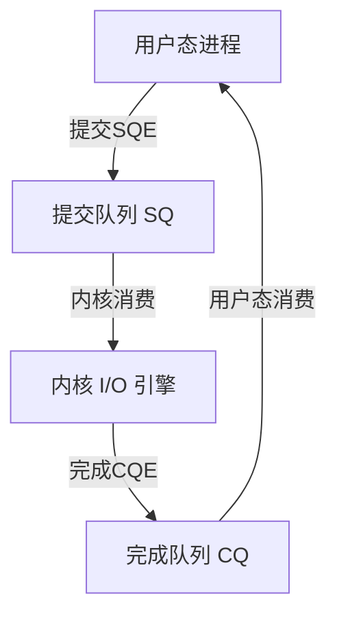

# I-O多路复用与事件驱动

> 📊 **本章难度等级：** <span class="badge-e">**高级 (Expert)**</span>

---

## <strong>核心定义与价值</strong>

### <strong>为什么需要多路复用</strong>

<span class="badge-e">E</span><br>
<span class="red">I/O多路复用</span>允许单个线程同时监视多个文件描述符的可读、可写与异常事件。在嵌入式设备上，线程资源昂贵，多路复用是支撑高并发连接的唯一可行路径。

传统阻塞模型为每个连接创建独立线程，100个连接即100个线程栈（约800MB内存）。多路复用模型下，单个线程通过内核通知机制感知所有连接的I/O就绪状态，内存占用降至数MB。

<span class="blue">多路复用不是优化选项，而是嵌入式高并发网络的必要架构。</span><br>

---

## <strong>select-poll-epoll原理对比</strong>

### <strong>三代API的演进逻辑</strong>

<span class="badge-e">E</span><br>
<span class="red">select、poll、epoll</span>是Linux三代I/O多路复用API。每一代都在解决前一代的规模化瓶颈。

| 特性 | select | poll | epoll |
|------|--------|------|-------|
| 监视fd上限 | 1024（FD_SETSIZE） | 无限制（内存限制） | 无限制 |
| 时间复杂度 | O(n) 遍历所有fd | O(n) 遍历整个数组 | O(1) 事件触发 |
| 内核-用户数据拷贝 | 每次调用全量拷贝 | 每次调用全量拷贝 | epoll_ctl注册时一次性拷贝 |
| 触发方式 | 水平触发（LT） | 水平触发（LT） | 支持LT与ET |
| 适用场景 | <100 fd的兼容性代码 | 任意fd数但低频率 | >100 fd的高并发 |

<span class="orange"><strong>1. select的致命缺陷：</strong></span><br>
* 每次调用需将fd_set从用户态拷贝至内核态，返回后再拷贝回来。fd数增加时，拷贝开销线性增长，且1024上限无法突破。

<span class="orange"><strong>2. poll的改进与局限：</strong></span><br>
* <span class="green">pollfd</span> 数组替代位图，突破1024限制。但返回后仍需遍历全部数组检查revents，O(n)遍历开销未解决。

<span class="orange"><strong>3. epoll的革命性：</strong></span><br>
* <span class="green">epoll_ctl</span> 将fd注册至内核红黑树，仅需一次。后续 <span class="green">epoll_wait</span> 仅返回就绪fd列表，无遍历开销。

```c
/* 文件路径：epoll_server.c */
/* 行号：1-60 */
#include <sys/epoll.h>
#include <sys/socket.h>
#include <unistd.h>
#include <stdio.h>
#include <errno.h>

#define MAX_EVENTS 64
#define LISTEN_PORT 8080

int epoll_server_main(int listen_fd)
{
    int epfd, nfds, i, conn_fd;
    struct epoll_event ev, events[MAX_EVENTS];

    /* 1. 创建epoll实例 */
    epfd = epoll_create1(EPOLL_CLOEXEC);
    if (epfd < 0) {
        perror("epoll_create1");
        return -1;
    }

    /* 2. 将监听fd加入epoll，关注可读事件（LT模式） */
    ev.events = EPOLLIN;
    ev.data.fd = listen_fd;
    if (epoll_ctl(epfd, EPOLL_CTL_ADD, listen_fd, &ev) < 0) {
        perror("epoll_ctl ADD listen_fd");
        close(epfd);
        return -1;
    }

    while (1) {
        /* 3. 等待事件，-1表示无限阻塞 */
        nfds = epoll_wait(epfd, events, MAX_EVENTS, -1);
        if (nfds < 0) {
            if (errno == EINTR) continue;
            perror("epoll_wait");
            break;
        }

        for (i = 0; i < nfds; i++) {
            if (events[i].data.fd == listen_fd) {
                /* 4. 监听fd可读 = 新连接到达 */
                conn_fd = accept(listen_fd, NULL, NULL);
                if (conn_fd < 0) {
                    perror("accept");
                    continue;
                }
                ev.events = EPOLLIN | EPOLLET;  /* ET模式 */
                ev.data.fd = conn_fd;
                epoll_ctl(epfd, EPOLL_CTL_ADD, conn_fd, &ev);
            } else {
                /* 5. 客户端fd可读 = 数据到达 */
                handle_client_data(events[i].data.fd);
            }
        }
    }

    close(epfd);
    return 0;
}
```

<span class="orange"><strong>代码带读：</strong></span><br>
* 第14行：<span class="green">epoll_create1(EPOLL_CLOEXEC)</span> 创建epoll实例并设置close-on-exec，避免fork后子进程继承该fd。<br>
* 第27行：<span class="green">epoll_wait</span> 返回仅包含就绪fd的数组，无需遍历全部fd。<br>
* 第38行：<span class="green">EPOLLET</span> 启用边缘触发，新连接使用ET以减少事件通知次数。

<span class="blue">epoll是嵌入式Linux高并发服务的核心基础设施。理解其红黑树+就绪链表的内核实现，是调优的前提。</span><br>

---

## <strong>ET vs LT模式</strong>

### <strong>边缘触发与水平触发</strong>

<span class="badge-e">E</span><br>
<span class="red">LT</span>（Level-Triggered，水平触发）与 <span class="red">ET</span>（Edge-Triggered，边缘触发）定义了epoll在何种条件下重复通知同一fd的就绪状态。

| 模式 | 触发条件 | 编程要求 | 性能 | 适用场景 |
|------|----------|----------|------|----------|
| LT | fd可读/可写时持续通知 | 简单，可部分读取 | 稍低（重复通知） | 通用场景，开发效率高 |
| ET | fd状态变化时仅通知一次 | 必须一次性读完/写完 | 更高（减少通知） | 高性能网关，短连接 |

<span class="orange"><strong>1. LT的陷阱：</strong></span><br>
* 若应用层仅读取部分数据，epoll下次wait仍返回该fd可读。优点是容错性强，缺点是高频小数据场景下epoll_wait返回大量重复事件。

<span class="orange"><strong>2. ET的严格契约：</strong></span><br>
* ET模式下，内核仅在fd从"不可读"变为"可读"时通知一次。若应用层未将数据全部读完，剩余数据将沉默至下一次新数据到达。

```c
/* 文件路径：et_read.c */
/* 行号：ET模式下必须循环读至EAGAIN */
ssize_t n;
while ((n = read(fd, buf, sizeof(buf))) > 0) {
    process_buffer(buf, n);
}
if (n < 0 && errno != EAGAIN) {
    perror("read");       /* 真错误 */
    close(fd);
}
/* n == 0：对端关闭 */
/* errno == EAGAIN：缓冲区已读完，符合预期 */
```

<span class="blue">ET模式要求非阻塞fd配合循环读取，任何遗漏都会导致数据饥饿。初学者应先用LT，熟练后切换至ET获取性能增益。</span><br>

---

## <strong>epoll嵌入式实战</strong>

### <strong>实战场景：低功耗网关的事件循环</strong>

<span class="badge-e">E</span><br>
某智能网关通过epoll同时管理：蜂窝模组AT指令串口、本地WiFi AP连接、Web配置页面、MQTT云端连接。单线程事件循环替代4个独立线程，节省80%线程栈内存。

```c
/* 文件路径：gateway_event_loop.c */
/* 行号：1-50 */
#include <sys/epoll.h>
#include <fcntl.h>
#include <unistd.h>
#include <stdio.h>

#define MAX_FDS 16

struct fd_handler {
    int fd;
    void (*on_read)(int fd);
    void (*on_write)(int fd);
};

struct fd_handler handlers[MAX_FDS];

int gateway_event_loop(void)
{
    int epfd, nfds, i;
    struct epoll_event ev, events[MAX_FDS];

    epfd = epoll_create1(EPOLL_CLOEXEC);

    /* 注册所有fd及其handler */
    for (i = 0; i < MAX_FDS; i++) {
        if (handlers[i].fd < 0) continue;
        set_nonblocking(handlers[i].fd);
        ev.events = EPOLLIN;
        ev.data.ptr = &handlers[i];   /* 携带自定义结构体指针 */
        epoll_ctl(epfd, EPOLL_CTL_ADD, handlers[i].fd, &ev);
    }

    while (1) {
        nfds = epoll_wait(epfd, events, MAX_FDS, 5000); /* 5秒超时 */
        if (nfds == 0) {
            watchdog_feed();           /* 无事件时喂狗 */
            power_manager_check();     /* 评估是否进入休眠 */
            continue;
        }

        for (i = 0; i < nfds; i++) {
            struct fd_handler *h = (struct fd_handler *)events[i].data.ptr;
            if (events[i].events & EPOLLIN) {
                h->on_read(h->fd);
            }
            if (events[i].events & EPOLLOUT) {
                h->on_write(h->fd);
            }
            if (events[i].events & (EPOLLERR | EPOLLHUP)) {
                close(h->fd);
                h->fd = -1;              /* 标记为待重建 */
            }
        }
    }
    return 0;
}
```

<span class="orange"><strong>代码带读：</strong></span><br>
* 第22行：<span class="green">ev.data.ptr</span> 替代ev.data.fd，可携带任意用户态指针，实现fd与回调函数的绑定。<br>
* 第29行：epoll_wait设置5秒超时，使事件循环在无网络活动时仍可执行喂狗与功耗管理。<br>
* 第41行：EPOLLERR/EPOLLHUP合并处理，统一执行连接清理与状态重置。

<span class="blue">epoll_wait的超时参数是嵌入式事件循环的"呼吸节拍"——必须设置合理值，在无事件时让出CPU执行系统维护任务。</span><br>

---

## <strong>io_uring原理</strong>

### <strong>超越epoll的下一代异步I-O</strong>

<span class="badge-e">E</span><br>
<span class="red">io_uring</span>（Linux 5.1+）通过共享内存环形队列（Ring Buffer）实现用户态与内核态的零拷贝交互。相比epoll，io_uring将系统调用次数从"每个I/O两次（注册+等待）"压缩至"一批I/O零次或一次"。



<span class="orange"><strong>1. SQ与CQ：</strong></span><br>
* <span class="green">SQ</span>（Submission Queue）存放待执行的I/O请求（读、写、accept）。<span class="green">CQ</span>（Completion Queue）存放已完成的结果。两者均为无锁环形缓冲区。

<span class="orange"><strong>2. 嵌入式启示：</strong></span><br>
* io_uring在批量I/O场景（如网关同时转发100个传感器数据）中降低CPU占用30%-50%。但内核版本要求5.1+，旧嵌入式系统（如Yocto based on 4.19）无法使用。

```c
/* 文件路径：io_uring_echo.c */
/* 行号：1-30（示意） */
#include <liburing.h>

struct io_uring ring;
io_uring_queue_init(32, &ring, 0);   /* 队列深度32 */

/* 提交一个读请求 */
struct io_uring_sqe *sqe = io_uring_get_sqe(&ring);
io_uring_prep_read(sqe, fd, buf, len, 0);
io_uring_submit(&ring);               /* 批量提交 */

/* 等待完成 */
struct io_uring_cqe *cqe;
io_uring_wait_cqe(&ring, &cqe);
/* cqe->res 包含实际读取字节数 */
io_uring_cqe_seen(&ring, cqe);       /* 标记为已消费 */
```

<span class="blue">io_uring代表了Linux异步I/O的方向，但嵌入式设备的内核升级周期通常以年为单位。当前阶段掌握epoll即可，io_uring作为技术储备。</span><br>

---

## <strong>libevent-libev-libuv选型</strong>

### <strong>事件驱动库的嵌入式适配</strong>

<span class="badge-e">E</span><br>
应用层直接使用epoll需要处理大量平台差异与边缘情况。跨平台事件库封装了这些复杂性，但引入额外依赖。

| 库 | 底层API | 内存占用 | 活跃维护 | 嵌入式适用性 |
|----|---------|----------|----------|--------------|
| libevent | select/poll/epoll/kqueue | 中 | 是 | 中，历史项目多 |
| libev | epoll/kqueue/select | 低 | 缓慢 | 高，精简高效 |
| libuv | epoll/kqueue/IOCP | 中 | 活跃 | 高，Node.js后端 |

<span class="orange"><strong>1. libev的嵌入式优势：</strong></span><br>
* libev代码约4000行，无外部依赖。其<span class="green">ev_io</span>与<span class="green">ev_timer</span> watcher模型直观高效，适合移植至裸机或RTOS。

<span class="orange"><strong>2. libuv的网络聚焦：</strong></span><br>
* libuv内置异步DNS、线程池、文件系统操作，是构建嵌入式网关上层框架的完整底座。代价是代码量约5万行。

```c
/* 文件路径：libev_echo.c */
/* 行号：1-30 */
#include <ev.h>
#include <unistd.h>

static void read_cb(EV_P_ ev_io *w, int revents)
{
    char buf[256];
    ssize_t n = read(w->fd, buf, sizeof(buf));
    if (n <= 0) {
        ev_io_stop(EV_A_ w);
        close(w->fd);
        free(w);
        return;
    }
    write(w->fd, buf, n);   /* echo */
}

int main(void)
{
    struct ev_loop *loop = EV_DEFAULT;
    ev_io watcher;
    int fd = setup_listen_socket(8080);
    ev_io_init(&watcher, read_cb, fd, EV_READ);
    ev_io_start(loop, &watcher);
    ev_run(loop, 0);
    return 0;
}
```

<span class="blue">选择事件库时，libev适合极简场景，libuv适合需要完整异步生态的网关项目。libevent因维护活跃度下降，新项目不建议选用。</span><br>

---

## <strong>事件驱动框架嵌入式适配</strong>

### <strong>将事件循环集成至RTOS</strong>

<span class="badge-e">E</span><br>
FreeRTOS、Zephyr等RTOS无原生epoll，但提供类似机制。理解抽象层的映射关系，可将Linux代码移植至裸机环境。

| RTOS | 等效机制 | 关键API |
|------|----------|---------|
| FreeRTOS | Socket Select | FreeRTOS_select() |
| Zephyr | Poll API | zsock_poll() |
| NuttX | POSIX Poll | poll() |
| lwIP | Socket API | lwip_select() |

<span class="orange"><strong>1. lwIP的select限制：</strong></span><br>
* lwIP <span class="green">lwip_select</span> 仅支持socket fd，不支持普通文件fd。且超时精度受sys_now()分辨率限制（通常为1ms-10ms）。

<span class="orange"><strong>2. 混合架构设计：</strong></span><br>
* 高端嵌入式Linux设备使用epoll/libev，低端MCU使用lwIP select或裸机轮询。两者共享上层状态机设计，便于代码复用。

<span class="blue">事件驱动架构的本质是"状态机+I/O通知"的组合。底层通知机制随平台变化，但上层状态机设计可跨平台通用。</span><br>

---

## <strong>历史演进</strong>

### <strong>从阻塞到异步的范式革命</strong>

<span class="badge-e">E</span><br>
1983年，4.2BSD引入<span class="green">select</span>，首次实现单线程多fd监视。但其1024限制与O(n)遍历成为高并发瓶颈。

1997年，Solaris推出<span class="green">/dev/poll</span>，将fd注册与等待分离，降低用户态-内核态拷贝。Linux未采纳该接口，但受其启发。

2002年，Linux 2.5.44引入<span class="green">epoll</span>，采用红黑树管理注册fd、就绪链表存储活跃事件。O(1)复杂度使其成为Linux高并发的事实标准。

2007年，Node.js基于libuv将事件驱动模型带入主流应用开发，证明单线程异步I/O可支撑数万并发。

2019年，Linux 5.1发布<span class="green">io_uring</span>，Jens Axboe设计的共享内存环形队列架构，将系统调用开销推向理论下限。2023年io_uring已支持网络accept/connect/send/recv，全面替代epoll的路线图清晰可见。

<span class="blue">I/O多路复用的演进史，是操作系统不断将"用户态轮询"转化为"内核态事件通知"的效率优化史。嵌入式开发者站在这一历史进程的末端，掌握epoll即可覆盖99%的当前场景。</span><br>

---

## <strong>本章小结</strong>

| 知识点 | 核心要点 | 难度 |
|--------|----------|------|
| select | 1024上限、O(n)、全量拷贝 | E |
| poll | 无上限、O(n)、全量拷贝 | E |
| epoll | 红黑树、O(1)、事件触发 | E |
| ET vs LT | ET需非阻塞循环读，LT容错高 | E |
| io_uring | SQ/CQ环形队列、零拷贝、内核5.1+ | E |
| 事件库选型 | libev极简，libuv完整，libevent legacy | E |

---

## <strong>课后练习</strong>

<span class="orange"><strong>练习1：</strong></span><br>
编写一个epoll服务端，监听100个客户端连接。在LT与ET两种模式下分别用`perf`统计epoll_wait返回次数与CPU周期数，验证ET的理论优势。<br>

<span class="orange"><strong>练习2：</strong></span><br>
将epoll_wait的超时参数从-1改为500ms，在无任何连接的空闲状态下，统计看门狗喂狗周期与CPU占用率，分析超时参数对系统维护任务的影响。<br>

<span class="orange"><strong>练习3：</strong></span><br>
在具备Linux 5.1+内核的设备上，分别用epoll和io_uring实现同一echo服务端。使用`iperf`或自定义压测工具比较两者在1000并发短连接下的吞吐量与CPU占用率。<br>
