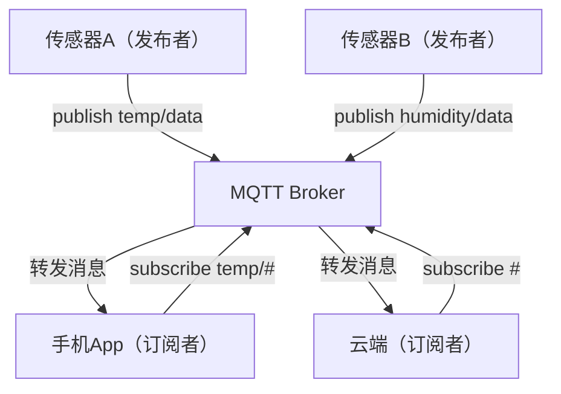

# 嵌入式协议栈与IoT安全

> 📊 **本章难度等级：** <span class="badge-e">**高级 (Expert)**</span> → <span class="badge-m">**大师 (Master)**</span>

---

## <strong>核心定义与价值</strong>

### <strong>为什么嵌入式需要专属协议栈</strong>

<span class="badge-e">E</span><br>
<span class="red">嵌入式协议栈</span>在资源受限硬件上实现TCP-IP网络通信。与Linux内核网络子系统（占用数MB RAM）不同，嵌入式协议栈将代码体积压缩至数十KB，RAM占用降至数KB，使8位与32位MCU具备联网能力。

协议栈是嵌入式设备的"网络操作系统"——没有它，传感器、控制器、执行器只能是局域网孤岛。协议栈的选择直接决定设备的连接方式、功耗曲线与安全基线。

<span class="blue">协议栈不是应用的附属品，而是嵌入式网络架构的根基层。</span><br>

---

## <strong>lwIP-uIP-TinyTCP资源对比</strong>

### <strong>三代嵌入式协议栈</strong>

<span class="badge-e">E</span><br>
嵌入式TCP-IP协议栈按资源占用与功能完整度分为三代。

| 协议栈 | ROM | RAM | 特性 | 适用平台 |
|--------|-----|-----|------|----------|
| uIP | ~5KB | ~300B | TCP+ICMP+ARP，无UDP | 8位AVR/8051 |
| TinyTCP | ~12KB | ~2KB | TCP+UDP+IP，无路由 | 16位MSP430 |
| lwIP | ~40KB | ~10KB | TCP+UDP+IP+DHCP+DNS+SNMP | 32位ARM/MIPS |

<span class="orange"><strong>1. uIP的事件驱动哲学：</strong></span><br>
* Adam Dunkels设计的uIP采用回调函数处理网络事件，无独立任务栈。应用层与协议栈深度融合，节省上下文切换开销。

<span class="orange"><strong>2. lwIP的模块化架构：</strong></span><br>
* <span class="green">lwIP</span>将协议分层为API层、核心层与驱动层。支持<span class="green">NO_SYS</span>（裸机回调）与<span class="green">OS</span>（RTOS线程）两种模式，同一套代码可运行在无OS MCU与嵌入式Linux上。

```c
/* 文件路径：lwip_netif_init.c */
/* 行号：1-30 */
#include "lwip/netif.h"
#include "lwip/etharp.h"
#include "netif/ethernet.h"

struct netif gnetif;

void lwip_netif_init(void)
{
    ip4_addr_t ipaddr, netmask, gw;
    IP4_ADDR(&ipaddr, 192, 168, 1, 100);
    IP4_ADDR(&netmask, 255, 255, 255, 0);
    IP4_ADDR(&gw, 192, 168, 1, 1);

    netif_add(&gnetif, &ipaddr, &netmask, &gw,
              NULL, ethernetif_init, ethernet_input);
    netif_set_default(&gnetif);
    netif_set_up(&gnetif);

    dhcp_start(&gnetif);                 /* 启动DHCP客户端 */
}
```

<span class="blue">lwIP是32位嵌入式设备的事实标准。其NO_SYS模式下的回调架构与OS模式下的Socket兼容层，覆盖了从裸机到Linux的全谱系需求。</span><br>

---

## <strong>MQTT发布订阅实战</strong>

### <strong>轻量级消息总线</strong>

<span class="badge-e">E</span><br>
<span class="red">MQTT</span>（Message Queuing Telemetry Transport）基于发布-订阅模式，设计目标是在不稳定网络与低带宽环境下实现可靠消息传输。



<span class="orange"><strong>1. QoS等级：</strong></span><br>
* <span class="green">QoS 0</span>：至多一次，无确认，带宽最小。<span class="green">QoS 1</span>：至少一次，带客户端确认，可能重复。<span class="green">QoS 2</span>：恰好一次，四次握手，开销最大。

<span class="orange"><strong>2. 嵌入式保留消息与遗嘱：</strong></span><br>
* <span class="green">保留消息</span>使新订阅者立即收到最后一条消息，无需等待下次发布。<span class="green">遗嘱消息</span>在设备异常断开时由Broker代为发布，用于状态监控。

```c
/* 文件路径：mqtt_client.c */
/* 行号：1-40，基于Eclipse Paho Embedded */
#include "MQTTPacket.h"
#include "transport.h"

#define MQTT_BROKER "mqtt.example.com"
#define MQTT_PORT   1883

int mqtt_publish_sensor(float temp, float hum)
{
    int rc, buflen = 256;
    unsigned char buf[256];
    MQTTString topic = MQTTString_initializer;
    topic.cstring = "device/sensor001/telemetry";

    char payload[64];
    snprintf(payload, sizeof(payload), "{\"t\":%.1f,\"h\":%.1f}", temp, hum);

    int len = MQTTSerialize_publish(buf, buflen, 0, 0, 0, 0,
                                    topic, (unsigned char *)payload,
                                    strlen(payload));
    rc = transport_sendPacketBuffer(MQTT_BROKER, MQTT_PORT, buf, len);
    return rc;
}
```

<span class="blue">MQTT QoS 1是嵌入式传感器的黄金配置：在带宽与可靠性之间取得平衡，且Broker的去重机制屏蔽了应用层的复杂性。</span><br>

---

### <strong>实战场景：NB-IoT水表的MQTT会话管理</strong>

<span class="badge-e">E</span><br>
水表每日上报一次，MQTT连接建立成本（TCP三次握手+MQTT CONNECT）占总传输时间的90%以上。

<span class="orange"><strong>优化策略：</strong></span><br>
* 采用 <span class="green">MQTT over UDP (MQTT-SN)</span> 简化连接过程。<br>
* 或维持TCP长连接，配置 <span class="green">Keepalive=3600秒</span>，Broker在设备休眠期间保留会话状态。<br>
* 启用 <span class="green">Session Present</span> 标志，唤醒后无需重新订阅主题。

<span class="blue">MQTT在嵌入式场景的核心优化方向不是协议本身，而是连接生命周期的管理——建立越少，功耗越低。</span><br>

---

## <strong>CoAP RESTful适配</strong>

### <strong>受限环境的HTTP替代</strong>

<span class="badge-e">E</span><br>
<span class="red">CoAP</span>（Constrained Application Protocol）将HTTP的请求-响应、URI、内容类型等语义映射至UDP之上。头部压缩至4字节，使6LoWPAN网络（IEEE 802.15.4，127字节帧）也能承载RESTful交互。

```
CoAP头部（4字节最小）：

 0                   1                   2                   3
 0 1 2 3 4 5 6 7 8 9 0 1 2 3 4 5 6 7 8 9 0 1 2 3 4 5 6 7 8 9 0 1
+-+-+-+-+-+-+-+-+-+-+-+-+-+-+-+-+-+-+-+-+-+-+-+-+-+-+-+-+-+-+-+-+
|Ver| T |  TKL  |      Code     |          Message ID           |
+-+-+-+-+-+-+-+-+-+-+-+-+-+-+-+-+-+-+-+-+-+-+-+-+-+-+-+-+-+-+-+-+
|   Token (if TKL > 0) ...
+-+-+-+-+-+-+-+-+-+-+-+-+-+-+-+-+-+-+-+-+-+-+-+-+-+-+-+-+-+-+-+-+
```

<span class="orange"><strong>1. 方法映射：</strong></span><br>
* <span class="green">GET/POST/PUT/DELETE</span> 对应HTTP语义，响应码如 <span class="green">2.05 Content</span> 映射HTTP 200。

<span class="orange"><strong>2. 观察模式（Observe）：</strong></span><br>
* 客户端订阅资源后，服务器在数据变化时主动推送（类似MQTT发布订阅）。基于Confirmable/Non-confirmable消息类型实现可靠性分级。

```c
/* 文件路径：coap_server.c */
/* 行号：1-30，基于libcoap */
#include <coap3/coap.h>

static void hnd_get_sensor(coap_resource_t *resource,
                           coap_session_t *session,
                           coap_pdu_t *request,
                           coap_binary_t *token,
                           coap_string_t *query,
                           coap_pdu_t *response)
{
    unsigned char buf[40];
    size_t len = snprintf((char *)buf, sizeof(buf),
                          "{\"temp\":%.1f,\"hum\":%.1f}",
                          get_temperature(), get_humidity());

    coap_pdu_set_code(response, COAP_RESPONSE_CODE_CONTENT);
    coap_add_data_large_response(resource, session, request, response,
                                 token, COAP_MEDIATYPE_APPLICATION_JSON,
                                 -1, 0, len, buf, NULL, NULL);
}
```

<span class="blue">CoAP与MQTT不是竞争关系而是互补关系：CoAP适合局域网内设备直接互操作，MQTT适合广域网经Broker汇聚。</span><br>

---

## <strong>TLS-DTLS嵌入式移植</strong>

### <strong>安全传输的必然性</strong>

<span class="badge-e">E</span><br>
未加密的嵌入式设备通信等同于公开广播。工业控制指令、固件升级包、用户隐私数据在传输层必须受<span class="green">TLS</span>（TCP）或<span class="green">DTLS</span>（UDP）保护。

| 特性 | TLS 1.3 | DTLS 1.3 |
|------|---------|----------|
| 底层协议 | TCP | UDP |
| 握手RTT | 1-RTT（0-RTT恢复） | 2-RTT（无0-RTT） |
| 会话恢复 | PSK + tickets | PSK + cookies |
| 嵌入式库 | mbedTLS | mbedTLS + DTLS |
| RAM占用 | ~50KB（mbedTLS精简配置） | ~40KB |

<span class="orange"><strong>1. 证书链校验的内存压力：</strong></span><br>
* 完整TLS握手需加载CA证书链（通常3-5KB）。RAM仅128KB的MCU难以同时容纳协议栈、应用与证书。优化方案：预置根CA公钥摘要，握手时仅校验服务器证书签名。

<span class="orange"><strong>2. mbedTLS裁剪配置：</strong></span><br>
* 关闭不需要的密码套件（如RSA，保留ECDSA），禁用会话ticket，仅保留AES-128-GCM+SHA256。ROM可压缩至80KB以下。

```c
/* 文件路径：mbedtls_config.h */
/* 行号：裁剪配置片段 */
#define MBEDTLS_AES_C
#define MBEDTLS_GCM_C
#define MBEDTLS_ECDSA_C
#define MBEDTLS_ECP_DP_SECP256R1_ENABLED
/* 禁用以下以节省空间 */
//#define MBEDTLS_RSA_C
//#define MBEDTLS_PKCS12_C
//#define MBEDTLS_PKCS5_C
```

<span class="blue">TLS在嵌入式设备上的核心矛盾是"安全强度"与"资源占用"。工程实践中的解决方案不是追求最高安全等级，而是匹配设备生命周期内的攻击面。</span><br>

---

## <strong>Modbus TCP从站</strong>

### <strong>工业以太网的核心协议</strong>

<span class="badge-e">E</span><br>
<span class="red">Modbus TCP</span>将经典Modbus RTU帧封装于TCP之上，去除CRC校验（由TCP层保证），增加6字节MBAP头部。工业PLC、变频器、HMI面板普遍支持该协议。

```
Modbus TCP帧结构：

[MBAP Header: 6字节] + [Function Code: 1字节] + [Data: N字节]

MBAP:
  Transaction ID (2) | Protocol ID (2=Modbus) | Length (2) | Unit ID (1)
```

```c
/* 文件路径：modbus_tcp_slave.c */
/* 行号：1-40 */
#include <stdint.h>
#include <string.h>

#define MODBUS_TCP_PORT 502
#define HOLDING_REG_COUNT 100

static uint16_t holding_regs[HOLDING_REG_COUNT];

int modbus_process_request(const uint8_t *req, int req_len,
                           uint8_t *resp, int resp_max)
{
    uint16_t trans_id  = (req[0] << 8) | req[1];
    uint16_t len       = (req[4] << 8) | req[5];
    uint8_t  unit_id   = req[6];
    uint8_t  func_code = req[7];

    /* 构建响应MBAP */
    resp[0] = req[0]; resp[1] = req[1];   /* 复制Transaction ID */
    resp[2] = 0; resp[3] = 0;            /* Protocol ID = 0 */
    /* Length与Unit ID稍后填充 */

    if (func_code == 0x03) {              /* Read Holding Registers */
        uint16_t addr  = (req[8]  << 8) | req[9];
        uint16_t count = (req[10] << 8) | req[11];
        if (addr + count > HOLDING_REG_COUNT)
            return -1;                      /* Illegal Data Address */

        resp[4] = 0; resp[5] = 3 + count * 2; /* Length */
        resp[6] = unit_id;
        resp[7] = func_code;
        resp[8] = count * 2;                /* Byte count */

        for (int i = 0; i < count; i++) {
            resp[9 + i*2]     = holding_regs[addr + i] >> 8;
            resp[9 + i*2 + 1] = holding_regs[addr + i] & 0xFF;
        }
        return 9 + count * 2;
    }
    return -1;                              /* Illegal Function */
}
```

<span class="orange"><strong>代码带读：</strong></span><br>
* 第16-19行：MBAP头部字段全部为大端，必须使用字节序转换。<br>
* 第28行：地址越界检查是安全关键——恶意请求可通过超大count值触发缓冲区溢出。

<span class="blue">Modbus TCP从站是嵌入式工业网关的核心功能。其无状态请求-响应模型天然适配迭代式服务端，无需复杂并发架构。</span><br>

---

## <strong>零拷贝与DPDK原理</strong>

### <strong>扩展阅读：极致性能路径</span>

<span class="badge-m">M</span><br>
<span class="red">零拷贝</span>技术消除数据在内核态与用户态之间的冗余复制。标准Socket路径下，网络包经历"网卡→内核缓冲区→用户缓冲区→应用处理"四次内存拷贝。

<span class="orange"><strong>1. Linux零拷贝机制：</strong></span><br>
* <span class="green">sendfile()</span> 将文件内容直接通过内核管道发送至Socket，绕过用户态。<span class="green">SPLICE</span> 与 <span class="green">MSG_ZEROCOPY</span> 进一步消除Socket层拷贝。

<span class="orange"><strong>2. DPDK的嵌入式边界：</strong></span><br>
* <span class="green">DPDK</span>（Data Plane Development Kit）绕过内核网络栈，通过用户态轮询直接驱动网卡。适用于x86高性能网关（如边缘服务器），在ARM嵌入式设备上因缺乏网卡PMD驱动支持而难以部署。

```
标准路径 vs 零拷贝路径：

标准：  网卡 -> 内核sk_buff -> 系统调用拷贝 -> 用户态buffer -> 应用
                ↑ 两次上下文切换

sendfile：文件 -> 内核page cache -> 协议栈 -> 网卡（零用户态拷贝）
```

<span class="blue">零拷贝在嵌入式视频网关（如NVR）中有实际价值：将摄像头H.264流从内核直接转发至存储，减少CPU占用30%以上。普通传感器网关无需此复杂度。</span><br>

---

## <strong>网络安全前沿</strong>

### <strong>嵌入式威胁模型与防御</strong>

<span class="badge-e">E</span><br>
嵌入式设备因长期在线、补丁滞后、物理暴露，成为攻击者重点目标。理解威胁模型是设计防御策略的前提。

| 攻击面 | 攻击方式 | 嵌入式防御 |
|--------|----------|------------|
| 网络协议 | SYN Flood、Slowloris | 连接限速、超时收紧 |
| 固件更新 | 中间人篡改固件包 | 签名验证（ECDSA/Ed25519） |
| 串口调试 | 物理提取固件与密钥 | eFuse烧录、JTAG熔断 |
| 侧信道 | 功耗分析提取密钥 | 掩码实现、随机延迟 |
| 供应链 | 预置后门组件 | SBOM追踪、可信启动 |

<span class="orange"><strong>1. 安全启动链（Secure Boot）：</strong></span><br>
* 从Boot ROM开始，每一级引导程序验证下一级镜像的签名。ARM TrustZone与RISC-V MultiZone提供硬件级隔离。

<span class="orange"><strong>2. 微隔离与mTLS：</strong></span><br>
* 设备间通信采用双向TLS（mTLS），每个设备持有独立证书。Broker拒绝未认证客户端的连接请求，实现"默认不信任"的微隔离架构。

<span class="blue">嵌入式安全的本质不是"完美防护"，而是"提高攻击成本使其超过收益"。每一个防御层都在延长攻击者的时间线。</span><br>

---

## <strong>历史演进</strong>

### <strong>从孤立节点到安全互联</strong>

<span class="badge-e">E</span><br>
2001年，Adam Dunkels发布lwIP与uIP，首次证明TCP-IP可在无MMU的8位MCU上运行。同年Contiki操作系统发布，推动无线传感器网络（WSN）标准化。

2007年，IBM与Eurotech发布MQTT协议，最初用于监控石油管道。2013年OASIS标准化后，AWS IoT Core与Azure IoT Hub全面支持，成为IoT事实标准。

2010年，IETF成立CoRE工作组，2014年发布CoAP（RFC 7252）。6LoWPAN与RPL路由协议使IPv6直达资源受限节点。

2016年，Mirai僵尸网络利用默认密码感染数十万台IoT摄像头，发起史上最大DDoS攻击。事件推动行业重视嵌入式安全，PSA Certified（ARM，2019年）与ioXt Alliance建立设备安全认证体系。

2020年代，<span class="green">TLS 1.3</span>与<span class="green">QUIC</span>向嵌入式设备渗透。Matter协议（Apple/Google/Amazon/Zigbee Alliance，2022年）统一智能家居通信标准，强制要求AES-CCM加密与设备认证。

<span class="blue">嵌入式协议栈与安全机制的历史，是一部从"能联网"到"联网且安全"的进化史。当前阶段的标志是：安全不再是可选项，而是设备进入市场的准入门槛。</span><br>

---

## <strong>本章小结</strong>

| 知识点 | 核心要点 | 难度 |
|--------|----------|------|
| 协议栈选型 | lwIP覆盖32位，uIP覆盖8位，TinyTCP过渡 | E |
| MQTT | 发布订阅、QoS 0/1/2、遗嘱与保留消息 | E |
| CoAP | UDP上的RESTful、Observe模式、4字节头 | E |
| TLS-DTLS | mbedTLS裁剪、证书链优化、PSK会话恢复 | E |
| Modbus TCP | MBAP头部、功能码0x03、地址校验 | E |
| 零拷贝 | sendfile/SPLICE、DPDK边界场景 | M |
| 安全前沿 | Secure Boot、mTLS、微隔离 | E |

---

## <strong>课后练习</strong>

<span class="orange"><strong>练习1：</strong></span><br>
在lwIP NO_SYS模式下实现一个最小TCP Echo服务端（基于raw API），使用回调函数处理connect/recv/sent事件，记录代码体积与RAM占用。
<br>

<span class="orange"><strong>练习2：</strong></span><br>
使用mbedTLS配置一个最小TLS客户端，仅启用AES-128-GCM+ECDSA+SHA256，测量握手阶段的RAM峰值，并与完整配置对比。
<br>

<span class="orange"><strong>练习3：</strong></span><br>
编写一个Modbus TCP从站程序，支持功能码0x03（读保持寄存器）与0x10（写多个寄存器）。设计并实现对addr+count的边界检查与异常响应（0x83/0x90）。
<br>
