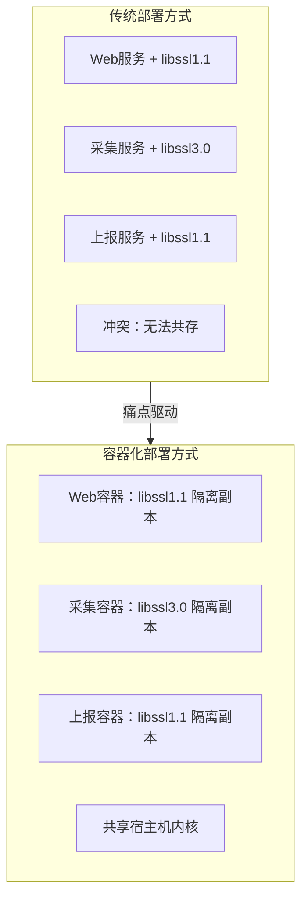
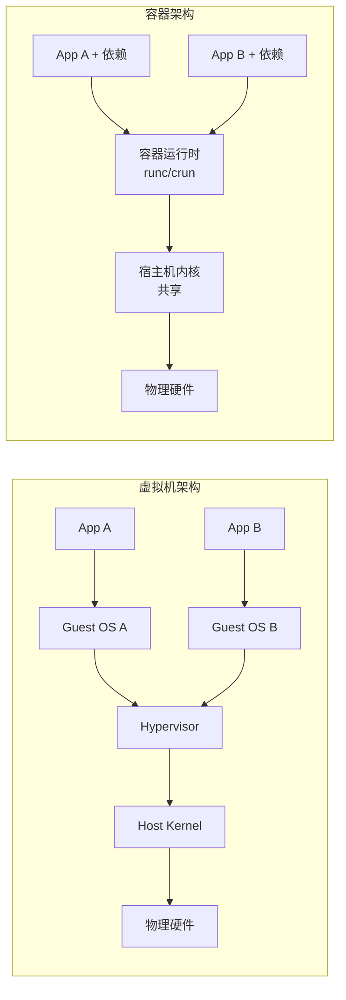
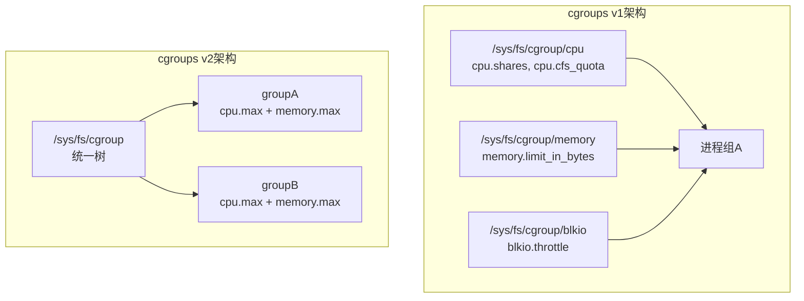

# 嵌入式容器化基础认知

> 📊 **本章难度等级：** <span class="badge-b">**入门 (Beginner)**</span>

<span class="blue">容器技术是嵌入式Linux开发中"一次构建、处处运行"理念的技术基石。理解其隔离原理与选型逻辑，是后续所有容器化实战的前提。</span><br>

---

## <strong>核心定义与价值</strong>

---

### <strong>三大痛点场景</strong>

<span class="badge-b">B</span><br>
<span class="red">嵌入式开发中的环境一致性、依赖冲突和资源浪费</span>，是容器化技术最直接的解决目标。三种典型场景构成了引入容器的核心动机。<br>

<span class="orange"><strong>1. 环境漂移问题：</strong></span><br>
开发者在x86主机交叉编译，在目标ARM板上验证，两者之间的工具链版本、库依赖和头文件路径经常不一致。<span class="green">Docker</span>将完整编译环境封装为镜像，确保"开发机编译什么样，目标板运行什么样"。<br>

<span class="orange"><strong>2. 依赖冲突问题：</strong></span><br>
同一台设备运行多个服务，A服务需要<span class="green">libssl.so.1.1</span>，B服务需要<span class="green">libssl.so.3.0</span>，传统方式难以共存。容器通过文件系统隔离，每个服务携带自己的依赖副本，互不干扰。<br>

<span class="orange"><strong>3. 资源碎片问题：</strong></span><br>
嵌入式设备RAM通常在128MB-1GB之间，每个服务独立运行完整的操作系统副本不现实。容器共享宿主机内核，单个容器仅增加几MB开销，实现"轻量级多租户"。<br>



<span class="blue">关键洞察：容器解决的不是"有没有"的问题，而是"一致性和隔离性"的问题。嵌入式场景下，内核已经稳定，变化的是应用和依赖。</span><br>

---

### <strong>隔离vs虚拟化对比</strong>

<span class="badge-b">B</span><br>
<span class="red">容器与虚拟机</span>的根本差异在于隔离层级。理解这一差异，是正确选型的第一步。<br>

| 维度 | 虚拟机 (VM) | 容器 (Container) |
|------|------------|-----------------|
| 隔离对象 | 硬件抽象层（Hypervisor） | 操作系统进程（OS Kernel） |
| 启动时间 | 数十秒到分钟级 | 毫秒到秒级 |
| 体积开销 | 每VM一个完整OS，GB级 | 共享内核，仅打包应用+依赖，MB级 |
| 性能损耗 | 5-15%（Hypervisor调度） | <1%（接近原生进程） |
| 硬件虚拟化 | 需要 | 不需要 |
| 适用场景 | 多OS共存、强安全隔离 | 同OS内核、轻量隔离 |



<span class="orange"><strong>1. 为什么容器启动更快：</strong></span><br>
虚拟机需要初始化完整的Guest OS（内核初始化、驱动加载、systemd启动），而容器仅创建新的进程命名空间，复用宿主机内核。<span class="green">runc</span>创建容器的过程本质上是<span class="green">clone</span>系统调用加参数组合。<br>

<span class="orange"><strong>2. 为什么容器体积更小：</strong></span><br>
虚拟机镜像包含完整rootfs、内核和initramfs；容器镜像仅包含应用二进制和运行时依赖，宿主机提供内核和所有系统调用接口。<br>

<span class="blue">关键结论：嵌入式场景选择容器而非虚拟机的根本原因是"资源预算不允许"。1GB RAM的设备上运行3个VM不现实，运行3个容器游刃有余。</span><br>

---

## <strong>核心机制原理解析</strong>

---

### <strong>容器演进路线</strong>

<span class="badge-b">B</span><br>
<span class="red">容器技术并非凭空出现</span>，而是从操作系统底层隔离机制逐步演化而来的必然产物。理解演进脉络，有助于把握设计动机。<br>


| 里程碑 | 年份 | 核心贡献 |
|--------|------|----------|
| chroot | 1979 | 改变进程根目录，实现文件系统隔离 |
| FreeBSD Jail | 2000 | 扩展chroot，加入进程ID和网络隔离 |
| LXC | 2008 | Linux首个用户态容器工具，整合cgroups+namespace |
| Docker | 2013 | 引入镜像分层、仓库和Dockerfile，降低使用门槛 |
| OCI | 2015 | 标准化容器运行时和镜像格式，解耦生态 |
| crun | 2019 | 用C语言重写的轻量级运行时，体积<1MB |

<span class="orange"><strong>1. chroot的局限性：</strong></span><br>
chroot仅隔离文件系统的根目录，进程仍能看到所有其他进程、使用所有网络接口、消耗全部CPU和内存。它是有用的起点，但不是完整的隔离方案。<br>

<span class="orange"><strong>2. Docker的革命性：</strong></span><br>
Docker没有发明新的内核机制，它发明的是<span class="green">镜像分层</span>和<span class="green">Dockerfile</span>——将操作系统隔离技术包装为开发者友好的构建-分发-运行工作流。<br>

<span class="blue">核心认知：容器技术的演进主线是"隔离维度不断增加"（从文件系统到进程、网络、资源），而Docker的贡献是"使用体验革命"。</span><br>

---

### <strong>Namespace原理</strong>

<span class="badge-i">I</span><br>
<span class="red">Linux Namespace</span>是容器隔离的核心内核机制，它为一组进程创建独立的系统视图，使这些进程"以为"自己独占整个系统。<br>

<span class="orange"><strong>1. 六种Namespace类型：</strong></span><br>

| Namespace | 隔离内容 | 内核版本 | 容器应用 |
|-----------|---------|---------|---------|
| PID | 进程ID空间 | 2.6.24 | 容器内PID 1是init进程 |
| Network | 网络设备、端口、路由表 | 2.6.29 | 容器拥有独立IP和端口空间 |
| Mount | 文件系统挂载点 | 2.4.19 | 容器有独立的/proc和/sys视图 |
| UTS | 主机名和域名 | 2.6.19 | 容器可设置独立hostname |
| IPC | 信号量、消息队列、共享内存 | 2.6.19 | 容器间IPC互不干扰 |
| User | 用户ID和组ID | 3.8 | 容器内root映射到宿主机普通用户 |

```c
// kernel/namespace.c
// 行号：~200
// clone系统调用创建新Namespace的核心逻辑
SYSCALL_DEFINE5(clone, unsigned long, clone_flags, ...)
{
    // CLONE_NEWPID | CLONE_NEWNET | CLONE_NEWNS 等标志
    // 决定创建哪些新的Namespace
    return do_fork(clone_flags, ...);
}
```

<span class="orange"><strong>2. PID Namespace的运作：</strong></span><br>
PID Namespace为容器创建独立的进程编号空间。容器内的第一个进程成为PID 1（类似init），它负责收养孤儿进程和处理信号。<br>
容器内只能看到本Namespace的进程，通过<span class="green">/proc</span>挂载隔离实现。<span class="green">ps</span>命令读取的<span class="green">/proc</span>目录来自Mount Namespace中的独立挂载。<br>

```bash
# 宿主机查看容器的PID映射关系
# 文件路径：/proc/[container_pid]/status
$ cat /proc/12345/status | grep NSpid
# NSpid: 12345   1    ← 宿主机PID 12345，容器内PID 1
```

<span class="orange"><strong>3. Network Namespace的运作：</strong></span><br>
每个容器可拥有独立的网络栈：回环接口、网卡、路由表、iptables规则。<span class="green">veth pair</span>（虚拟以太网对）连接容器和宿主机bridge，实现容器间通信和外部访问。<br>

```bash
# 在宿主机查看容器的网络Namespace
# 文件路径：/var/run/docker/netns/
$ ls /var/run/docker/netns/
# 输出：7f3a2b...  ← 每个容器一个netns

# 进入容器的网络Namespace执行命令
$ nsenter --net=/var/run/docker/netns/7f3a2b -- ip addr
```

<span class="blue">关键认知：Namespace提供的是"视图隔离"而非"安全隔离"。拥有CAP_SYS_ADMIN权限的进程可以退出Namespace或访问其他Namespace的资源。</span><br>

---

### <strong>cgroups资源控制</strong>

<span class="badge-i">I</span><br>
<span class="red">cgroups（Control Groups）</span>是Linux内核的资源管理机制，它将进程组织成层次化的组，对每个组限制CPU、内存、IO和带宽等资源使用。<br>

<span class="orange"><strong>1. cgroups v1与v2的架构差异：</strong></span><br>

| 特性 | cgroups v1 | cgroups v2 |
|------|-----------|-----------|
| 挂载点 | 多个（cpu、memory、blkio等） | 单一（/sys/fs/cgroup） |
| 控制器 | 各自独立配置 | 统一树形结构 |
| 层级规则 | 不同控制器可独立挂载 | 所有控制器共享同一棵树 |
| 进程归属 | 一个进程可在不同控制器属于不同组 | 一个进程只属于一个组 |
| 默认内核 | < 4.5 | >= 4.5 |



<span class="orange"><strong>2. CPU资源限制实战：</strong></span><br>
cgroups通过<span class="green">cpu.shares</span>（相对权重）和<span class="green">cpu.cfs_quota_us</span>（绝对配额）两种方式控制CPU使用。嵌入式实时场景通常关注绝对配额。<br>

```bash
# 创建cgroups v1 CPU限制组
# 文件路径：/sys/fs/cgroup/cpu/container_a
$ mkdir /sys/fs/cgroup/cpu/container_a
$ echo 50000 > /sys/fs/cgroup/cpu/container_a/cpu.cfs_quota_us
$ echo 100000 > /sys/fs/cgroup/cpu/container_a/cpu.cfs_period_us
# 效果：每100ms周期内，该组最多使用50ms CPU时间

# 将进程加入该组
$ echo 12345 > /sys/fs/cgroup/cpu/container_a/tasks
```

<span class="orange"><strong>3. 内存资源限制与OOM：</strong></span><br>
<span class="green">memory.limit_in_bytes</span>设置硬上限，超出时触发OOM Killer。<span class="green">memory.soft_limit_in_bytes</span>设置软上限，仅在系统内存紧张时生效。<br>

```bash
# 设置容器内存上限为128MB
# 文件路径：/sys/fs/cgroup/memory/container_a
$ echo 134217728 > /sys/fs/cgroup/memory/container_a/memory.limit_in_bytes

# 查看OOM统计
$ cat /sys/fs/cgroup/memory/container_a/memory.oom_control
# oom_kill_disable 0
# under_oom 0
```

<span class="blue">关键认知：cgroups和Namespace是互补的——Namespace负责"看到什么"，cgroups负责"能用多少"。两者结合才构成完整的容器隔离。</span><br>

---

### <strong>OCI标准</strong>

<span class="badge-i">I</span><br>
<span class="red">OCI（Open Container Initiative）</span>是Linux基金会主导的标准化组织，它定义了容器运行时和容器镜像格式的开放标准，防止生态被单一厂商锁定。<br>

<span class="orange"><strong>1. OCI两大核心规范：</strong></span><br>

| 规范 | 定义 | 关键文件 | 实现 |
|------|------|---------|------|
| Runtime Spec | 容器运行时的标准接口 | config.json + rootfs目录 | runc, crun, kata |
| Image Spec | 容器镜像的格式标准 | manifest.json + layer tar包 | Docker, Buildah |

<span class="orange"><strong>2. OCI Runtime Bundle的结构：</strong></span><br>
OCI运行时要求一个<span class="green">runtime bundle</span>，包含配置文件和rootfs。这是容器启动的最小数据单元。<br>

```bash
# 典型的OCI Runtime Bundle结构
runtime-bundle/
├── config.json          # OCI Runtime Spec配置文件
└── rootfs/              # 容器根文件系统
    ├── bin/
    ├── lib/
    └── etc/

# config.json核心字段示例
# 文件路径：runtime-bundle/config.json
{
  "ociVersion": "1.0.2",
  "process": {
    "terminal": false,
    "user": { "uid": 0, "gid": 0 },
    "args": ["/bin/sh"],
    "env": ["PATH=/usr/local/sbin:/usr/local/bin:/usr/sbin:/usr/bin:/sbin:/bin"]
  },
  "linux": {
    "namespaces": [
      { "type": "pid" },
      { "type": "network" },
      { "type": "ipc" },
      { "type": "uts" },
      { "type": "mount" }
    ],
    "cgroupsPath": "container_a",
    "resources": {
      "cpu": { "shares": 512 },
      "memory": { "limit": 134217728 }
    }
  }
}
```

<span class="orange"><strong>3. 为什么嵌入式需要OCI：</strong></span><br>
OCI标准使得嵌入式领域可以选用轻量级运行时（<span class="green">crun</span>仅~1MB），而不必捆绑完整的Docker生态。<span class="green">containerd</span>作为符合OCI的中间层，提供镜像管理和容器生命周期管理，体积约15MB，适合资源受限设备。<br>

<span class="blue">关键结论：OCI标准是容器生态的"USB接口"——任何符合OCI的运行时都可以运行任何符合OCI的镜像，嵌入式因此获得了工具链自由。</span><br>

---

## <strong>嵌入式专属实战场景</strong>

---

### <strong>嵌入式选型</strong>

<span class="badge-e">E</span><br>
<span class="red">嵌入式设备的容器选型</span>需要综合评估资源预算、实时性需求、安全要求和维护成本四个维度。服务器场景的"默认选择"在嵌入式中往往是错误的。<br>

<span class="orange"><strong>1. 运行时选型矩阵：</strong></span><br>

| 运行时 | 体积 | 守护进程 | 适用场景 | 嵌入式推荐度 |
|--------|------|---------|---------|------------|
| Docker | ~100MB | dockerd | 开发调试 | ★★☆ |
| containerd + runc | ~30MB | containerd | 通用部署 | ★★★ |
| containerd + crun | ~16MB | containerd | 资源受限 | ★★★★ |
| Podman + crun | ~10MB | 无 | 安全敏感 | ★★★★ |
| systemd-nspawn | ~0MB | systemd | 极简集成 | ★★★ |

<span class="orange"><strong>2. 基础镜像选型策略：</strong></span><br>

| 基础镜像 | 体积 | libc | 包管理 | 适用场景 |
|---------|------|------|--------|---------|
| Ubuntu/Debian | ~80MB | glibc | apt | 开发调试，非部署 |
| Alpine | ~5MB | musl | apk | 通用部署首选 |
| BusyBox | ~1MB | musl/glibc | 无 | 极致精简 |
| scratch | 0MB | 无 | 无 | 静态链接单二进制 |

<span class="orange"><strong>3. 为什么选crun而不是runc：</strong></span><br>
crun用C语言编写，runc用Go编写。Go运行时自带垃圾回收和协程调度，带来额外的内存开销和不可预测的GC停顿。<span class="green">crun</span>编译后体积约1MB，无GC，启动延迟可预测，更适合实时性嵌入式场景。<br>

```bash
# 编译crun作为嵌入式运行时
# 文件路径：crun源码目录
$ ./autogen.sh
$ ./configure --disable-systemd --disable-dl  # 精简编译，去掉systemd依赖
$ make
$ ls -lh crun
# -rwxr-xr-x 1 user user 1.2M crun
```

<span class="blue">关键结论：嵌入式容器选型的核心原则是"刚好够用"。每个额外的组件都意味着更大的攻击面和更长的启动时间。从crun + Alpine起步，需要时再扩展。</span><br>

---

## <strong>历史演进与前沿</strong>

---

### <strong>容器技术演进时间线</strong>

<span class="badge-b">B</span><br>
容器技术从操作系统底层隔离机制出发，经历了从"技术可用"到"体验友好"再到"标准化"三个阶段，最终惠及嵌入式领域。<br>

| 时期 | 代表技术 | 核心突破 | 对嵌入式的影响 |
|------|---------|---------|--------------|
| 1979-2007 | chroot, Jail, OpenVZ | 隔离技术探索 | 奠定理论基础 |
| 2008-2012 | LXC, systemd-nspawn | Linux原生容器 | 内核支持成熟 |
| 2013-2014 | Docker, LXC | 镜像+仓库体验 | 概念普及 |
| 2015-2018 | OCI, containerd, runc | 标准化+解耦 | 运行时可选 |
| 2019-2022 | crun, Podman, Buildah | 无守护进程+精简 | 体积适配嵌入式 |
| 2023+ | systemd-nspawn主流化 | 系统集成化 | 与systemd深度整合 |

<span class="blue">关键洞察：嵌入式容器化比服务器晚5-7年，但可以直接跳过"体验优化"阶段，直接采用经过验证的最小工具链组合。</span><br>

---

## <strong>本章小结</strong>

| 要点 | 核心结论 |
|------|---------|
| 三大痛点 | 环境漂移、依赖冲突、资源碎片 |
| 隔离vs虚拟化 | 容器共享内核<1MB开销，VM独立内核GB级开销 |
| Namespace | 六种类型隔离进程视图，PID/Network/Mount最关键 |
| cgroups | v2统一树形结构，CPU配额+内存硬限控制资源 |
| OCI标准 | 防止锁定，crun/containerd/Podman可互换 |
| 嵌入式选型 | crun + Alpine/scratch，体积<20MB可运行 |

---

## <strong>练习</strong>

<span class="badge-b">B</span><br>

**1.** 在一台Linux主机上执行以下命令，观察PID Namespace的效果：
```bash
$ unshare --fork --pid --mount-proc /bin/bash
$ echo $$
$ ps aux
```
解释为什么`ps`输出中只能看到极少进程，而宿主机上`ps`能看到全部进程。<br>

**2.** 编写一个cgroups v1内存限制实验：创建一个内存限制为64MB的cgroup组，运行一个故意分配100MB内存的程序，观察OOM Killer的行为和日志输出。对比设置`memory.oom_control`中`oom_kill_disable`为1时的不同表现。<br>

**3.** 对比Docker、containerd+crun、Podman三种方案在嵌入式ARM设备上的部署体积。假设目标设备有256MB RAM和128MB rootfs空间，选择最合适的方案并给出理由（包括启动时间、内存占用和功能完整性三个维度）。<br>

---

<span class="red">为什么容器化是嵌入式开发的必然趋势？</span><br>
传统嵌入式部署将应用和依赖混装在单一rootfs中，升级任一组件都可能破坏其他组件。容器通过文件系统隔离和镜像版本化，将"整体替换"变为"精准更新"，这在OTA频繁、现场维护困难的嵌入式场景中是不可替代的优势。Namespace和cgroups是Linux内核的内建能力，容器只是以用户友好的方式包装了这些能力——理解底层原理，才能在嵌入式场景做出正确裁剪。
