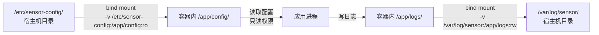

# Docker核心操作与命令实战

> 📊 **本章难度等级：** <span class="badge-b">**入门 (Beginner)**</span> → <span class="badge-i">**中级 (Intermediate)**</span>

<span class="blue">掌握Docker命令行是容器化开发的起点。本章从最常用的生命周期命令入手，逐步深入到资源限制和文件操作，最终以嵌入式场景常见的"容器内编译"实验收尾。</span><br>

---

## <strong>核心定义与价值</strong>

---

### <strong>docker run-ps-exec-images</strong>

<span class="badge-b">B</span><br>
<span class="red">Docker命令行</span>遵循"动词+对象"的语法结构：`docker [verb] [object] [options]`。理解这一模式后，所有命令都可类推。<br>

<span class="orange"><strong>1. 容器生命周期核心命令：</strong></span><br>

| 命令 | 作用 | 常用场景 |
|------|------|---------|
| docker run | 从镜像创建并启动容器 | 首次运行某个应用 |
| docker ps | 列出运行中的容器 | 查看容器状态 |
| docker ps -a | 列出所有容器（含已停止） | 排查问题容器 |
| docker exec | 在运行中的容器内执行命令 | 进入容器调试 |
| docker start/stop/restart | 启停已有容器 | 容器维护 |
| docker rm | 删除容器 | 清理资源 |

```bash
# docker run：创建并启动容器
# 文件路径：宿主机终端
$ docker run -d --name webapp -p 8080:80 nginx:latest
# -d：后台运行（detached）
# --name：命名容器
# -p：端口映射 宿主机8080 -> 容器80

# 验证容器运行状态
$ docker ps
# CONTAINER ID   IMAGE          COMMAND                  STATUS          PORTS
# 7f3a2b8c9d1e   nginx:latest   "nginx -g 'daemon…"   Up 2 minutes    0.0.0.0:8080->80/tcp

# 进入容器执行命令
$ docker exec -it webapp /bin/bash
# -i：交互模式（保持stdin打开）
# -t：分配伪终端（TTY）
```

<span class="orange"><strong>2. 镜像管理核心命令：</strong></span><br>

```bash
# 列出本地镜像
$ docker images
# REPOSITORY    TAG       IMAGE ID       CREATED         SIZE
# nginx         latest    605c77e624dd   2 weeks ago     141MB
# alpine        latest    c059bfaa849c   3 weeks ago     5.59MB

# 从仓库拉取镜像
$ docker pull arm32v7/alpine:latest

# 删除本地镜像
$ docker rmi nginx:latest
```

<span class="orange"><strong>3. run命令的完整参数解析：</strong></span><br>
<span class="green">docker run</span>是最复杂的命令，它集成了创建、配置和启动三个操作。嵌入式场景常用的参数组合需要熟记。<br>

```bash
# 嵌入式场景常用run参数组合
$ docker run -d \
    --name sensor_daemon \
    --restart unless-stopped \
    --memory=128m \
    --cpus=0.5 \
    --read-only \
    -v /data:/app/data:rw \
    -e TZ=Asia/Shanghai \
    arm32v7/alpine:latest \
    /app/sensor_daemon
# --restart unless-stopped：设备重启后自动恢复（嵌入式关键）
# --memory=128m：硬内存限制
# --cpus=0.5：限制使用半个CPU核心
# --read-only：根文件系统只读
# -v：bind mount数据目录
# -e：环境变量
```

<span class="blue">关键认知：docker run的参数顺序有严格要求——镜像名必须在所有选项之后，命令和参数在镜像名之后。</span><br>

---

### <strong>bind mount与docker cp</strong>

<span class="badge-i">I</span><br>
<span class="red">容器与宿主机之间的文件交互</span>有两种模式：bind mount（运行时挂载）和docker cp（一次性复制）。两者适用于不同场景，不可混用。<br>

<span class="orange"><strong>1. bind mount机制：</strong></span><br>
<span class="green">-v /host/path:/container/path:mode</span>将宿主机的目录或文件映射到容器内部。容器内的读写操作直接作用于宿主机文件系统，数据持久化不依赖容器生命周期。<br>

```bash
# bind mount示例：将宿主机的配置目录映射进容器
# 文件路径：宿主机 /etc/sensor-config/
$ docker run -d \
    -v /etc/sensor-config:/app/config:ro \
    -v /var/log/sensor:/app/logs:rw \
    sensor-app:latest
# :ro = 只读挂载，防止容器修改配置
# :rw = 读写挂载，日志输出到宿主机持久存储
```



<span class="orange"><strong>2. docker cp机制：</strong></span><br>
<span class="green">docker cp</span>在宿主机和容器之间复制文件，独立于容器运行状态（即使容器已停止也可复制）。适用于一次性文件注入或提取。<br>

```bash
# 从宿主机复制文件到容器
$ docker cp /home/build/firmware.bin sensor_container:/app/

# 从容器复制文件到宿主机
$ docker cp sensor_container:/app/logs/crash.log ./crash.log

# 复制目录（递归）
$ docker cp ./configs/ sensor_container:/app/configs/
```

<span class="orange"><strong>3. bind mount vs docker cp 对比：</strong></span><br>

| 维度 | bind mount | docker cp |
|------|-----------|-----------|
| 持久性 | 实时同步，容器销毁后数据仍在 | 一次性复制，不自动同步 |
| 方向 | 双向（宿主机↔容器） | 单向（需指定方向） |
| 实时性 | 实时 | 手动触发 |
| 适用场景 | 配置文件、日志目录、持久数据 | 调试文件注入、日志提取、镜像构建 |
| 性能 | 原生文件系统性能 | 额外tar打包开销 |

<span class="blue">关键结论：嵌入式持久数据（日志、配置、采集数据）必须用bind mount；临时调试文件用docker cp。</span><br>

---

### <strong>资源限制参数</strong>

<span class="badge-i">I</span><br>
<span class="red">Docker资源限制</span>底层通过cgroups实现，命令行参数是cgroups配置的用户友好包装。嵌入式场景必须设置资源限制，防止单一容器耗尽系统资源。<br>

<span class="orange"><strong>1. CPU限制参数：</strong></span><br>

```bash
# 限制容器最多使用半个CPU核心
$ docker run --cpus=0.5 ubuntu:latest stress -c 1
# --cpus=0.5 等价于 --cpu-period=100000 --cpu-quota=50000

# 限制容器使用特定的CPU核心（绑核）
$ docker run --cpuset-cpus="0,1" ubuntu:latest ./app
# 仅允许在物理核心0和1上运行

# 设置CPU相对权重（默认1024，用于竞争场景）
$ docker run --cpu-shares=512 ubuntu:latest ./app
# 当CPU饱和时，该容器获得512/(512+1024)=1/3的CPU时间
```

<span class="orange"><strong>2. 内存限制参数：</strong></span><br>

```bash
# 设置内存硬上限和交换空间
$ docker run --memory=128m --memory-swap=256m ubuntu:latest ./app
# --memory=128m：物理内存上限128MB
# --memory-swap=256m：总内存+swap上限256MB，swap可用128MB

# 禁用OOM Killer（不推荐用于生产）
$ docker run --memory=128m --oom-kill-disable ubuntu:latest ./app
# 容器内存超限后不会被杀死，而是被内核冻结等待内存释放

# 设置内存保留量（soft limit）
$ docker run --memory-reservation=64m --memory=128m ubuntu:latest ./app
# 64m是soft limit，128m是hard limit
```

<span class="orange"><strong>3. IO限制参数：</strong></span><br>

```bash
# 限制块设备读写带宽
$ docker run \
    --device-read-bps /dev/sda:10mb \
    --device-write-bps /dev/sda:5mb \
    ubuntu:latest ./app

# 限制每秒IO操作次数
$ docker run \
    --device-read-iops /dev/sda:100 \
    --device-write-iops /dev/sda:50 \
    ubuntu:latest ./app
```

```bash
# 查看容器的资源限制配置
# 文件路径：/sys/fs/cgroup/.../docker/[container_id]
$ docker inspect sensor_container --format='{{.HostConfig.Memory}}'
# 输出：134217728  (128MB in bytes)

$ docker inspect sensor_container --format='{{.HostConfig.CpuQuota}}'
# 输出：50000  (--cpus=0.5 的底层值)
```

<span class="blue">关键认知：--memory限制的是"内存+swap"总和。如果不设置--memory-swap，默认swap空间等于--memory值，即禁用额外swap。</span><br>

---

## <strong>技术教学与实战</strong>

---

### <strong>十个核心命令完整输出</strong>

<span class="badge-i">I</span><br>
<span class="red">以下十个命令</span>覆盖了Docker日常使用的90%场景。每个命令附带典型输出解析，培养"看输出就能判断状态"的能力。<br>

<span class="orange"><strong>1. docker run（创建并启动）：</strong></span><br>

```bash
$ docker run -d --name test-app --memory=64m alpine:latest sleep 3600
# 输出：a1b2c3d4e5f6...  ← 新容器的ID

# 查看创建的容器
$ docker ps --filter "name=test-app"
# CONTAINER ID   IMAGE            COMMAND        CREATED         STATUS         PORTS   NAMES
# a1b2c3d4e5f6   alpine:latest    "sleep 3600"   3 seconds ago   Up 2 seconds           test-app
```

<span class="orange"><strong>2. docker ps（列出容器）：</strong></span><br>

```bash
$ docker ps -a --format "table {{.Names}}\t{{.Status}}\t{{.Image}}"
# NAMES       STATUS                   IMAGE
# test-app    Up 5 minutes             alpine:latest
# webapp      Exited (137) 2 hours ago nginx:latest
# database    Up 3 days                postgres:14
```

<span class="orange"><strong>3. docker exec（执行命令）：</strong></span><br>

```bash
$ docker exec test-app cat /etc/alpine-release
# 输出：3.18.4  ← 容器内Alpine版本

$ docker exec -it test-app /bin/sh
# 进入交互式shell，退出不会停止容器
```

<span class="orange"><strong>4. docker logs（查看日志）：</strong></span><br>

```bash
$ docker logs --tail 50 --timestamps test-app
# 输出带时间戳的最后50行日志
# 2024-01-15T08:30:01.234567Z [INFO] Sensor initialized
# 2024-01-15T08:30:02.456789Z [WARN] Connection timeout
```

<span class="orange"><strong>5. docker inspect（查看元数据）：</strong></span><br>

```bash
$ docker inspect test-app --format='{{json .State}}' | python -m json.tool
# 输出容器的完整状态JSON，包括Pid、StartedAt、Status、Health等
```

<span class="orange"><strong>6. docker stats（资源监控）：</strong></span><br>

```bash
$ docker stats --no-stream test-app
# CONTAINER ID   NAME       CPU %   MEM USAGE / LIMIT   MEM %   NET I/O    BLOCK I/O   PIDS
# a1b2c3d4e5f6   test-app   0.01%   1.5MiB / 64MiB      2.34%   0B / 0B    0B / 0B     1
```

<span class="orange"><strong>7. docker top（查看进程）：</strong></span><br>

```bash
$ docker top test-app
# UID   PID   PPID   C   STIME   TTY     TIME       CMD
# root  1234  1200   0   08:30   ?       00:00:00   sleep 3600
# 注意：PID列是宿主机PID，不是容器内PID
```

<span class="orange"><strong>8. docker diff（文件变更）：</strong></span><br>

```bash
$ docker exec test-app touch /tmp/newfile
$ docker diff test-app
# 输出：
# A /tmp/newfile  ← A=Added（新增）
# C /var/log      ← C=Changed（修改）
# D /etc/old.conf ← D=Deleted（删除）
```

<span class="orange"><strong>9. docker commit（保存变更）：</strong></span><br>

```bash
$ docker commit test-app my-custom-alpine:v1
# 输出：sha256:7f8a9b...
# 将容器的当前文件系统状态保存为新镜像

$ docker images | grep my-custom
# my-custom-alpine   v1        7f8a9b...   2 seconds ago   5.6MB
```

<span class="orange"><strong>10. docker system prune（清理资源）：</strong></span><br>

```bash
$ docker system prune -f
# 删除所有停止的容器、未使用的网络和悬空镜像
# -f：不提示确认（脚本中常用）
# ⚠️ 生产环境慎用，会删除数据

$ docker system df
# TYPE            TOTAL     ACTIVE    SIZE      RECLAIMABLE
# Images          5         3         450MB     120MB
# Containers      8         4         64MB      0B
# Local Volumes   2         1         100MB     100MB
# Build Cache     10        0         200MB     200MB
```

<span class="blue">关键认知：docker inspect是最强的诊断工具，它能暴露容器的所有配置和状态。学会用--format过滤关键字段，是高效排查问题的前提。</span><br>

---

### <strong>小白实验：容器内编译C程序</strong>

<span class="badge-i">I</span><br>
<span class="red">"容器内编译"</span>是嵌入式开发中的典型工作流：在x86宿主机上运行ARM工具链容器，编译出目标二进制，然后部署到ARM设备。本实验演示完整流程。<br>

<span class="orange"><strong>1. 实验目标：</strong></span><br>
在x86宿主机上使用<span class="green">arm32v7/gcc</span>容器，交叉编译一个"Hello, Embedded!"程序，输出ARM二进制。<br>

<span class="orange"><strong>2. 实验步骤：</strong></span><br>

```bash
# 步骤1：准备源代码
# 文件路径：~/embedded_lab/hello.c
$ mkdir -p ~/embedded_lab && cd ~/embedded_lab
$ cat > hello.c << 'EOF'
#include <stdio.h>
int main() {
    printf("Hello, Embedded!\n");
    return 0;
}
EOF

# 步骤2：拉取ARM交叉编译工具链镜像
$ docker pull arm32v7/gcc:latest

# 步骤3：运行编译容器，bind mount源代码目录
$ docker run --rm \
    -v ~/embedded_lab:/src \
    -w /src \
    arm32v7/gcc:latest \
    arm-linux-gnueabihf-gcc -static -o hello_arm hello.c
# --rm：编译完成后自动删除容器
# -v ~/embedded_lab:/src：将源代码目录映射进容器
# -w /src：设置工作目录
# arm-linux-gnueabihf-gcc：ARM交叉编译器
# -static：静态链接，避免目标板缺少库依赖

# 步骤4：验证输出文件
$ file hello_arm
# hello_arm: ELF 32-bit LSB executable, ARM, EABI5 version 1 (SYSV), 
# statically linked, for GNU/Linux 3.2.0, not stripped

$ ls -lh hello_arm
# -rwxr-xr-x 1 user user 780K hello_arm  ← 静态链接体积780KB
```

<span class="orange"><strong>3. 优化编译：使用musl减小体积：</strong></span><br>

```bash
# 使用musl工具链进一步减小体积
$ docker run --rm \
    -v ~/embedded_lab:/src \
    -w /src \
    muslcc/x86_64:arm-linux-musleabihf \
    arm-linux-musleabihf-gcc -Os -static -o hello_musl hello.c

$ ls -lh hello_musl
# -rwxr-xr-x 1 user user 12K hello_musl  ← musl静态链接仅12KB！

# 对比
$ size hello_arm hello_musl
#    text    data     bss     dec     hex filename
#  722234    3532    4820  730586   b25da hello_arm    (glibc)
#    8234     480     488    9202    23f2 hello_musl   (musl)
```

<span class="orange"><strong>4. 将编译产物部署到目标板：</strong></span><br>

```bash
# 复制到目标板（假设通过SSH）
$ scp hello_musl root@192.168.1.100:/usr/bin/

# 在目标板上运行
$ ssh root@192.168.1.100 ./hello_musl
# Hello, Embedded!
```

<span class="blue">关键结论：容器内编译将"交叉编译环境配置"简化为一条docker run命令。工具链版本锁定在镜像中，团队成员无需各自安装和配置交叉编译器，"一次构建镜像，全员使用"。</span><br>

---

## <strong>本章小结</strong>

| 要点 | 核心结论 |
|------|---------|
| docker run | 最复杂的命令，参数顺序：选项 → 镜像 → 命令 |
| docker ps/exec/logs | 状态查看和调试的三件套 |
| bind mount | 持久数据实时映射，-v host:container:mode |
| docker cp | 一次性文件复制，容器停止也可操作 |
| 资源限制 | --memory/--cpus/--device-read-bps 通过cgroups生效 |
| 容器内编译 | 工具链容器化，保证环境一致，musl体积最小 |

---

## <strong>练习</strong>

<span class="badge-b">B</span> → <span class="badge-i">I</span><br>

**1.** 执行以下命令序列，观察每个步骤的输出变化，解释docker commit的作用和局限：
```bash
$ docker run -it --name commit-test alpine:latest /bin/sh
# 容器内：touch /myfile && echo "test" > /myfile
# 容器内：exit
$ docker diff commit-test
$ docker commit commit-test my-test:v1
$ docker run my-test:v1 cat /myfile
```
与Dockerfile构建的镜像相比，commit生成的镜像有何不同？<br>

**2.** 设计一个资源限制实验：创建两个容器，一个限制--cpu-shares=512，另一个限制--cpu-shares=2048，同时运行CPU密集型任务（如<span class="green">stress -c 4</span>），用<span class="green">docker stats</span>观察两者的CPU使用率比例，验证权重分配是否生效。<br>

**3.** 编写一个完整的"容器内交叉编译+容器外运行"工作流脚本：从源代码编译一个读取I2C设备的ARM程序，使用bind mount映射源代码目录，编译产物自动出现在宿主机目录。要求最终二进制体积小于100KB，并说明使用的优化编译参数。<br>

---

<span class="red">为什么Docker命令是嵌入式容器化的入门必修课？</span><br>
容器技术最终都要落实到命令和配置。Docker命令行是行业标准交互方式，containerd、Podman等替代方案都兼容或借鉴了Docker CLI语法。掌握Docker命令后，迁移到其他运行时几乎没有学习成本。更重要的是，Docker命令的参数（如--memory、--cpus）直接映射到cgroups内核接口，理解命令就是理解底层机制。
