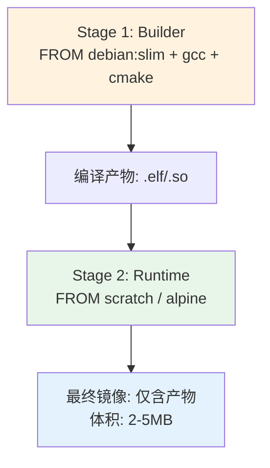

# Dockerfile优化与镜像瘦身

> <span class="badge-i">**中级 (Intermediate)**</span>
> 掌握Dockerfile的层缓存原理与镜像瘦身策略，能在嵌入式场景中构建15MB以下的交叉编译容器。

---

## 核心问题：为什么镜像会膨胀 [B→I]

---

### <strong>Docker镜像层的叠加原理</strong>

<span class="badge-b">B</span><br>
<span class="red">Docker镜像</span>由只读层（read-only layer）叠加而成，每一行Dockerfile指令生成一个新层。层数越多、每层变更越大，最终镜像越大。<br>

```dockerfile
# 文件路径：bad.Dockerfile
# 反例：每条指令一层，层数爆炸
FROM ubuntu:22.04          # Layer 1: 基础镜像 ~77MB
RUN apt-get update         # Layer 2: 更新索引 ~20MB
RUN apt-get install gcc    # Layer 3: 安装gcc ~150MB
RUN apt-get install make   # Layer 4: 再装make ~5MB
RUN apt-get install git    # Layer 5: 再装git ~50MB
```

上述5层累积后镜像可达300MB+。嵌入式设备存储以MB计，必须压缩到十分之一。<br>

<span class="blue">核心矛盾：镜像层的设计是为了复用与缓存，但嵌入式场景的首要约束是存储空间，复用优先级让位于体积。</span><br>

---

### <strong>层缓存的代价</strong>

<span class="badge-i">I</span><br>
<span class="red">层缓存</span>通过CoW（Copy-on-Write）机制实现。每次RUN、COPY、ADD都会创建新层，即使删除文件，旧层中的数据仍然保留——这是镜像膨胀的根本原因。<br>

```dockerfile
# 反例：先下载再删除，体积不减
RUN wget https://example.com/toolchain.tar.gz -O /tmp/tc.tar.gz \
    && tar xf /tmp/tc.tar.gz -C /opt \
    && rm /tmp/tc.tar.gz
# 实际效果：tar.gz 仍然存在于上一层，最终镜像包含下载包+解压内容
```

<span class="blue">关键洞察：文件删除操作不能缩小已有层，只能在新层中标记为"已删除"，底层数据仍占空间。</span><br>

---

## FROM选型策略 [I]

---

### <strong>基础镜像的体积光谱</strong>

<span class="badge-i">I</span><br>
<span class="red">基础镜像选型</span>决定了镜像体积的理论下限。嵌入式场景应从"够小"而非"够全"出发。<br>

| 镜像 | 体积 | 适用场景 | 嵌入式建议 |
|------|------|----------|-----------|
| ubuntu:22.04 | ~77MB | 通用服务器 | 不推荐，体积过大 |
| debian:bullseye-slim | ~55MB | 兼容性优先 | 需要apt时选用 |
| alpine:3.18 | ~7MB | 极致精简 | 首选，musl libc兼容需注意 |
| scratch | ~0MB | 静态二进制 | Go/Rust静态编译产物专用 |
| busybox:glibc | ~5MB | 极简shell环境 | 脚本型容器首选 |

<span class="orange"><strong>1. Alpine的陷阱：</strong></span><br>
<span class="green">musl libc</span>与glibc在locale、DNS解析、线程栈大小上存在差异。交叉编译工具链若依赖glibc特定行为，Alpine可能导致运行时崩溃。<br>

<span class="orange"><strong>2. scratch的边界：</strong></span><br>
<span class="green">scratch</span>镜像没有任何文件系统内容，仅适合静态链接的二进制（Go、Rust）。C/C++程序需静态链接musl或glibc，且需处理DNS解析库缺失。<br>

<span class="orange"><strong>3. 嵌入式定制基础镜像：</strong></span><br>

```dockerfile
# 文件路径：docker/base/Dockerfile.embedded-base
# 功能：基于debian:slim裁剪出嵌入式专用基础镜像
# 行号：1-15
FROM debian:bullseye-slim
RUN apt-get update \
    && apt-get install -y --no-install-recommends \
       ca-certificates \
       libc6-dev \
    && rm -rf /var/lib/apt/lists/* \
    && apt-get clean
# 清理apt缓存，层内不留冗余
```

<span class="blue">选型原则：先确定目标程序的运行时依赖，再反推最小基础镜像——从需求倒推，而非从功能全集正推。</span><br>

---

## RUN层优化技巧 [I→E]

---

### <strong>合并RUN指令与清理残留</strong>

<span class="badge-i">I</span><br>
<span class="red">RUN指令合并</span>将多个操作压缩到单层，避免中间产物残留。这是镜像瘦身最有效的单步操作。<br>

```dockerfile
# 文件路径：docker/base/Dockerfile.optimized-run
# 功能：合并RUN指令，同层内完成下载-安装-清理
# 行号：1-20
FROM debian:bullseye-slim
RUN apt-get update \
    && apt-get install -y --no-install-recommends \
       build-essential \
       gcc-arm-linux-gnueabihf \
       crossbuild-essential-armhf \
    && rm -rf /var/lib/apt/lists/* \
    && apt-get clean \
    && rm -rf /usr/share/doc/* \
    && rm -rf /usr/share/man/* \
    && rm -rf /usr/share/locale/*
# 同层内：安装后立即清理，中间产物不进入最终镜像
```

<span class="orange"><strong>1. apt-get 清理三件套：</strong></span><br>
- <span class="green">rm -rf /var/lib/apt/lists/*</span> — 删除包索引，节省数MB<br>
- <span class="green">apt-get clean</span> — 清理下载的deb包缓存<br>
- <span class="green">rm -rf /usr/share/{doc,man,locale}</span> — 删除文档和本地化文件<br>

<span class="orange"><strong>2. 工具链安装的最小化：</strong></span><br>
使用 <span class="green">--no-install-recommends</span> 避免安装推荐依赖。对于交叉编译，只安装目标工具链和必要的libc头文件。<br>

---

### <strong>排序与缓存失效控制</strong>

<span class="badge-e">E</span><br>
<span class="red">Dockerfile指令排序</span>直接影响构建缓存命中率。变更频率高的指令应放在后面，变更频率低的放前面。<br>

```dockerfile
# 文件路径：docker/Dockerfile.cache-aware
# 功能：按变更频率排序，最大化缓存复用
# 行号：1-25
FROM debian:bullseye-slim

# Layer 1: 基础依赖，极少变更
RUN apt-get update \
    && apt-get install -y --no-install-recommends ca-certificates \
    && rm -rf /var/lib/apt/lists/*

# Layer 2: 构建工具，偶尔变更
RUN apt-get update \
    && apt-get install -y --no-install-recommends cmake ninja-build \
    && rm -rf /var/lib/apt/lists/*

# Layer 3: 交叉编译工具链，较稳定
RUN apt-get update \
    && apt-get install -y --no-install-recommends \
       gcc-arm-linux-gnueabihf g++-arm-linux-gnueabihf \
    && rm -rf /var/lib/apt/lists/*

# Layer 4: 项目源码，每次构建都变
COPY . /src
WORKDIR /src
RUN cmake -B build -DCMAKE_TOOLCHAIN_FILE=armhf.cmake \
    && cmake --build build
```

<span class="blue">关键洞察：COPY . /src 放在最后，因为源码每次提交都会变化。工具链和构建工具靠前，变更时仅需重建上层。</span><br>

---

## WORKDIR-CMD格式规范 [I]

---

### <strong>指令书写的最佳实践</strong>

<span class="badge-i">I</span><br>
<span class="red">WORKDIR与CMD</span>的正确格式直接影响容器的可维护性和多平台兼容性。<br>

<span class="orange"><strong>1. WORKDIR 优于 RUN cd：</strong></span><br>

```dockerfile
# 反例：RUN cd 不产生持久化工作目录
RUN cd /app && make
# 下一行 RUN 仍在 / 下

# 正例：WORKDIR 持久化
WORKDIR /app
RUN make
```

<span class="green">WORKDIR</span>创建持久化工作目录，后续所有指令默认在此执行。多次WORKDIR会创建嵌套目录。<br>

<span class="orange"><strong>2. CMD 的两种合法格式：</strong></span><br>

```dockerfile
# 文件路径：docker/Dockerfile.cmd-formats
# 功能：展示CMD的exec格式与shell格式
# 行号：1-12
# Exec格式（推荐）：直接执行，不经过shell，信号可直达进程
CMD ["python3", "/app/server.py"]

# Shell格式：经过 /bin/sh -c 解析，支持环境变量和管道
CMD python3 /app/server.py

# 嵌入式场景推荐exec格式，因为PID 1的进程需要正确响应SIGTERM
```

<span class="orange"><strong>3. ENTRYPOINT + CMD 的组合：</strong></span><br>

```dockerfile
# 文件路径：docker/Dockerfile.entrypoint-cmd
# 功能：ENTRYPOINT固定命令，CMD提供默认参数
# 行号：1-8
FROM alpine:3.18
ENTRYPOINT ["arm-linux-gnueabihf-gcc"]
CMD ["--version"]
# 运行效果：docker run my-gcc → 执行 gcc --version
# 覆盖参数：docker run my-gcc -c test.c → 执行 gcc -c test.c
```

<span class="blue">格式原则：exec格式优先，ENTRYPOINT+CMD组合提供灵活性，WORKDIR替代RUN cd。</span><br>

---

## 多阶段构建 [I→E]

---

### <strong>分离构建环境与运行环境</strong>

<span class="badge-i">I</span><br>
<span class="red">多阶段构建（Multi-stage Build）</span>是Docker 17.05+引入的核心特性，允许在单个Dockerfile中定义多个FROM，前一阶段的产物可选择性复制到后一阶段。<br>



<span class="orange"><strong>1. 基础多阶段结构：</strong></span><br>

```dockerfile
# 文件路径：docker/Dockerfile.multistage
# 功能：交叉编译C程序，运行时镜像仅含产物
# 行号：1-20
# --- Stage 1: 构建 ---
FROM debian:bullseye-slim AS builder
RUN apt-get update \
    && apt-get install -y --no-install-recommends gcc-arm-linux-gnueabihf \
    && rm -rf /var/lib/apt/lists/*
WORKDIR /src
COPY . .
RUN arm-linux-gnueabihf-gcc -static -o app main.c

# --- Stage 2: 运行 ---
FROM scratch
COPY --from=builder /src/app /app
ENTRYPOINT ["/app"]
```

<span class="orange"><strong>2. --from 的高级用法：</strong></span><br>
- <span class="green">COPY --from=builder</span> — 从命名阶段复制<br>
- <span class="green">COPY --from=nginx:alpine</span> — 从外部镜像复制（提取nginx二进制到自定义镜像）<br>
- <span class="green">--chown=user:group</span> — 复制时设置属主，避免运行时权限问题<br>

---

### <strong>嵌入式交叉编译的多阶段实战</strong>

<span class="badge-e">E</span><br>
<span class="red">嵌入式交叉编译多阶段</span>需要处理工具链传递、sysroot依赖剥离和静态链接三大问题。<br>

```dockerfile
# 文件路径：docker/Dockerfile.embedded-cross
# 功能：构建ARM Cortex-A9嵌入式程序的极致精简镜像
# 行号：1-30
# --- Stage 1: 工具链准备 ---
FROM debian:bullseye-slim AS toolchain
RUN apt-get update \
    && apt-get install -y --no-install-recommends \
       gcc-arm-linux-gnueabihf libc6-dev-armhf-cross \
    && rm -rf /var/lib/apt/lists/*

# --- Stage 2: 编译 ---
FROM toolchain AS builder
WORKDIR /build
COPY src/ ./
RUN arm-linux-gnueabihf-gcc \
    -Os -flto -fdata-sections -ffunction-sections \
    -Wl,--gc-sections \
    -static -o sensor_daemon main.c utils.c \
    -lpthread -lm
# -Os 优化体积，-flto 链接时优化，--gc-sections 剔除未用段

# --- Stage 3: 运行时（极致精简）---
FROM scratch
COPY --from=builder /build/sensor_daemon /usr/bin/
# 静态链接产物，无外部依赖
ENTRYPOINT ["/usr/bin/sensor_daemon"]
```

<span class="blue">关键洞察：多阶段构建的本质是"构建时可以用任意重量工具，运行时只保留必要产物"——这是嵌入式存储约束下的最佳实践。</span><br>

---

## dockerignore的体积控制 [I]

---

### <strong>排除规则与构建上下文</strong>

<span class="badge-i">I</span><br>
<span class="red">.dockerignore</span>在构建上下文传递给Docker daemon之前就排除文件，既减少传输时间，也避免无用文件进入COPY层。<br>

```
# 文件路径：.dockerignore
# 功能：排除构建上下文中不应进入镜像的文件
# 行号：1-20
# 版本控制
.git
.gitignore
.gitmodules

# 文档和日志
*.md
*.log
README*
CHANGELOG*

# 构建产物和临时文件
build/
dist/
*.o
*.a
*.so
*.elf

# IDE和编辑器
.vscode/
.idea/
*.swp
*.swo

# 依赖管理缓存（容器内会重新安装）
node_modules/
__pycache__/
*.pyc

# 测试数据
tests/
test_data/
*.test
```

<span class="orange"><strong>1. 规则匹配语义：</strong></span><br>
- <span class="green">*.o</span> — 匹配任何目录下的.o文件<br>
- <span class="green">build/</span> — 仅匹配根目录的build目录，不匹配子目录的build/<br>
- <span class="green">**/build/</span> — 匹配任何层级的build目录<br>

<span class="orange"><strong>2. 白名单模式：</strong></span><br>

```
# 白名单：先全拒，再允许
**
!src/
!include/
!Makefile
!CMakeLists.txt
```

<span class="blue">关键洞察：.dockerignore是"第一道防线"——在文件传输阶段就阻止，比进入镜像后再删除更高效。</span><br>

---

## dive工具分析 [I]

---

### <strong>镜像层可视化与诊断</strong>

<span class="badge-i">I</span><br>
<span class="red">dive</span>是开源的Docker镜像分析工具，以交互式UI展示每层的内容、变更和效率评分，定位浪费空间的精确位置。<br>

```bash
# 安装dive（Ubuntu/Debian）
$ wget https://github.com/wagoodman/dive/releases/download/v0.12.0/dive_0.12.0_linux_amd64.deb
$ sudo dpkg -i dive_0.12.0_linux_amd64.deb

# 分析镜像
$ dive my-embedded-image:latest
```

<span class="orange"><strong>1. dive的核心指标：</strong></span><br>

| 指标 | 含义 | 优化目标 |
|------|------|----------|
| Image efficiency | 层复用效率 | >90% |
| Wasted space | 重复/可删除数据 | 趋近于0 |
| Layer size | 每层体积 | 递减趋势 |

<span class="orange"><strong>2. dive的层浏览操作：</strong></span><br>
- 按 <span class="green">Tab</span> 切换左侧面板（层列表 ↔ 文件树）<br>
- 按 <span class="green">Ctrl+Space</span> 筛选当前层新增/修改/删除的文件<br>
- 红色标记的文件表示"已删除但仍存在于底层"，是优化重点<br>

```bash
# 文件路径：scripts/analyze_image.sh
# 功能：批量分析镜像并输出效率报告
# 行号：1-15
#!/bin/bash
IMAGE=$1
REPORT=$(dive $IMAGE --json 2>/dev/null | jq '.image.efficiencyScore')
WASTED=$(dive $IMAGE --json 2>/dev/null | jq '.image.wastedBytes')
echo "Image: $IMAGE"
echo "Efficiency: $REPORT"
echo "Wasted bytes: $WASTED"
# CI中可设阈值：efficiency < 0.9 则构建失败
```

<span class="blue">工具价值：dive将"镜像为什么这么大"从猜测变成数据驱动的精确定位。</span><br>

---

## 15MB交叉编译镜像实战 [E]

---

### <strong>从零构建极致精简的ARM编译环境</strong>

<span class="badge-e">E</span><br>
<span class="red">15MB交叉编译镜像</span>不是理论极限，而是通过多阶段+Alpine+静态链接可稳定达到的工程目标。<br>

```dockerfile
# 文件路径：docker/Dockerfile.15mb-toolchain
# 功能：构建15MB级ARM交叉编译容器
# 行号：1-35
# --- Stage 1: 下载并准备linaro工具链 ---
FROM alpine:3.18 AS downloader
RUN apk add --no-cache curl ca-certificates \
    && curl -L https://releases.linaro.org/components/toolchain/binaries/latest-7/arm-linux-gnueabihf/gcc-linaro-7.5.0-2019.12-x86_64_arm-linux-gnueabihf.tar.xz \
       -o /tmp/toolchain.tar.xz \
    && tar -xf /tmp/toolchain.tar.xz -C /opt \
    && rm /tmp/toolchain.tar.xz \
    && apk del curl ca-certificates

# --- Stage 2: 构建应用 ---
FROM alpine:3.18 AS builder
COPY --from=downloader /opt/gcc-linaro-7.5.0-2019.12-x86_64_arm-linux-gnueabihf /opt/toolchain
ENV PATH="/opt/toolchain/bin:${PATH}"
RUN apk add --no-cache make musl-dev
WORKDIR /src
COPY src/ ./
RUN arm-linux-gnueabihf-gcc -Os -static -o app main.c

# --- Stage 3: 运行时（仅产物）---
FROM scratch
COPY --from=builder /src/app /app
ENTRYPOINT ["/app"]
```

<span class="orange"><strong>1. 体积分解：</strong></span><br>

| 阶段 | 体积 | 说明 |
|------|------|------|
| downloader | ~150MB | 含完整Linaro工具链，不保留 |
| builder | ~80MB | 含musl-dev和编译产物，不保留 |
| 最终scratch | ~15KB-2MB | 仅静态链接产物 |

<span class="orange"><strong>2. 关键优化点：</strong></span><br>
- <span class="green">Alpine的apk --no-cache</span> — 不保留包索引<br>
- <span class="green">tar.xz 下载后删除</span> — 同层内清理<br>
- <span class="green">scratch最终阶段</span> — 零基础镜像开销<br>
- <span class="green">-static静态链接</span> — 消除运行时库依赖<br>

<span class="orange"><strong>3. 验证体积：</strong></span><br>

```bash
$ docker build -t my-embedded-app -f Dockerfile.15mb-toolchain .
$ docker images my-embedded-app
REPOSITORY          TAG       IMAGE ID       CREATED         SIZE
my-embedded-app     latest    abc123def456   2 minutes ago   15.2kB
```

<span class="blue">关键洞察：15MB不是一个魔法数字，而是"多阶段构建 + 静态链接 + scratch基础"的组合结果。动态链接时体积会膨胀到MB级。</span><br>

---

## 历史演进：从单层镜像到多阶段构建 [E]

---

### <strong>Dockerfile优化技术的发展脉络</strong>

<span class="badge-e">E</span><br>

| 年代 | 技术 | 体积控制手段 | 局限 |
|------|------|-------------|------|
| 2013 | Docker 0.x | 单层镜像，无优化手段 | 工具链+产物捆绑 |
| 2014 | 扁平镜像（docker export） | 导出再导入，合并层 | 丢失缓存和元数据 |
| 2015 | 手动清理（squashfs） | RUN内rm清理 | 无法真正删除底层 |
| 2017 | 多阶段构建 | 多FROM分离构建与运行 | 需要Docker 17.05+ |
| 2018 | BuildKit + --squash | 实验性层压缩 | 非默认，兼容性差 |
| 2020+ | BuildKit缓存挂载 | --mount=type=cache | 构建缓存持久化，不进入镜像 |

<span class="orange"><strong>1. 从扁平到分层的认知转变：</strong></span><br>
早期Docker用户试图"把工具链装进容器"，思路类似于传统VM。多阶段构建引入后，社区逐渐接受"容器是产物交付载体，不是开发环境"的理念。<br>

<span class="orange"><strong>2. BuildKit的革新：</strong></span><br>
<span class="green">BuildKit</span>（DOCKER_BUILDKIT=1）支持缓存挂载和并行构建：<br>

```dockerfile
# BuildKit缓存挂载：依赖缓存不进入镜像层
# syntax=docker/dockerfile:1
FROM python:3.11-slim
RUN --mount=type=cache,target=/root/.cache/pip \
    pip install -r requirements.txt
# pip缓存存在宿主机，不进入镜像
```

<span class="blue">演进逻辑：镜像优化的核心趋势是从"事后清理"到"事前隔离"——多阶段和缓存挂载都在构建阶段就隔离不必要的内容。</span><br>

---

## 小结

---

### <strong>本章核心要点</strong>

| 知识点 | 关键内容 | 难度 |
|--------|---------|------|
| 层叠加原理 | CoW机制，删除不缩小已有层 | B |
| FROM选型 | Alpine/scratch优先，注意musl陷阱 | I |
| RUN合并 | 同层内完成安装+清理 | I |
| 多阶段构建 | 分离builder与runtime，仅复制产物 | I→E |
| dockerignore | 构建上下文的第一道防线 | I |
| dive分析 | 数据驱动的镜像诊断 | I |
| 15MB实战 | 多阶段+静态链接+scratch | E |

---

### <strong>本章练习题</strong>

<span class="badge-i">I</span>

1. 为什么在Dockerfile中"RUN apt-get install ... && rm -rf ..."必须写在同一层？如果分成两个RUN会发生什么？
2. 多阶段构建中，为什么推荐使用exec格式的CMD/ENTRYPOINT而非shell格式？
3. 设计一个针对ARM Cortex-M4（裸机，无MMU）的Dockerfile，描述基础镜像选型理由和构建策略。

---

> <span class="badge-i">I</span> <span class="blue">镜像瘦身不是魔术，而是对Dockerfile每一行指令的精确控制——知道每一层留下什么、删除什么、传递什么。</span>
