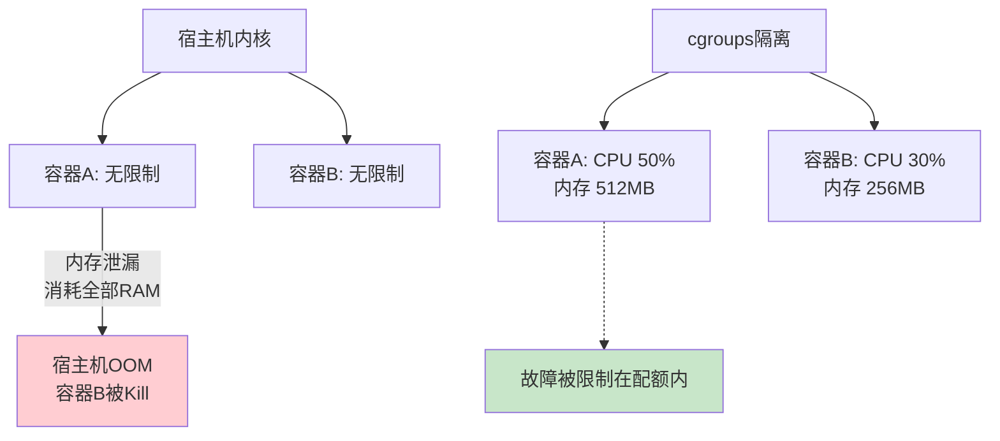

# 资源隔离深度配置

> <span class="badge-i">**中级→高级 (Intermediate→Expert)**</span>
> 深入cgroups v1/v2的资源隔离机制，掌握CPU/内存/设备/网络的精确配额与嵌入式实时性调优。

---

## 核心问题：为什么需要资源隔离 [B→I]

---

### <strong>容器资源竞争的根源</strong>

<span class="badge-b">B</span><br>
<span class="red">Linux容器</span>本质上是共享宿主机内核的进程集合。若无资源隔离，单个容器的内存泄漏、CPU死循环或IO风暴将直接影响宿主机及其他容器。<br>



<span class="blue">核心矛盾：容器提供了进程隔离，但隔离不等于资源配额——没有cgroups的容器只是chroot升级版。</span><br>

---

### <strong>cgroups的架构定位</strong>

<span class="badge-i">I</span><br>
<span class="red">cgroups（Control Groups）</span>是Linux内核的资源管理框架，通过伪文件系统暴露接口，将进程分组并对每组施加资源限制。<br>

| 子系统 | 控制资源 | 内核路径 | 嵌入式 relevance |
|--------|----------|----------|-----------------|
| cpu | CPU时间分配 | /sys/fs/cgroup/cpu | 限制后台任务CPU占用 |
| cpuacct | CPU使用统计 | /sys/fs/cgroup/cpuacct | 计费与监控 |
| memory | 内存分配与OOM | /sys/fs/cgroup/memory | 防止内存泄漏扩散 |
| blkio | 块设备IO | /sys/fs/cgroup/blkio | SD卡/eMMC寿命保护 |
| devices | 设备访问权限 | /sys/fs/cgroup/devices | 设备直通的安全边界 |
| freezer | 进程挂起/恢复 | /sys/fs/cgroup/freezer | OTA更新时冻结容器 |
| net_cls/net_prio | 网络标记与优先级 | /sys/fs/cgroup/net_cls | 流量整形与QoS |

<span class="orange"><strong>1. cgroups v1 vs v2 的本质差异：</strong></span><br>
- <span class="green">cgroups v1</span> — 各子系统独立挂载，目录结构混乱，存在竞争条件<br>
- <span class="green">cgroups v2</span> — 统一层级树（unified hierarchy），所有控制器挂载到同一目录，支持线程级委派<br>

<span class="blue">关键洞察：cgroups v2不是v1的增量升级，而是重新设计的统一资源模型。Docker 20.10+默认使用v2（宿主机内核4.15+）。</span><br>

---

## CPU隔离策略 [I→E]

---

### <strong>CPU配额与权重模型</strong>

<span class="badge-i">I</span><br>
<span class="red">CPU资源隔离</span>有两种模型：硬限制（quota/period）和软限制（shares）。嵌入式场景根据实时性需求选择。<br>

```bash
# 文件路径：/sys/fs/cgroup/cpu/docker/容器ID/
# cgroups v1 CPU配额配置

# 1. 硬限制：每100ms周期内最多使用50ms CPU时间
$ echo 50000 > cpu.cfs_quota_us    # 配额：50ms
$ echo 100000 > cpu.cfs_period_us  # 周期：100ms
# 效果：容器最多占用50%的单核CPU

# 2. 软限制：相对权重（默认值1024）
$ echo 512 > cpu.shares
# 效果：CPU竞争时，该容器获得512/(512+1024)=1/3的CPU时间
```

<span class="orange"><strong>1. cfs_quota_us 与 cfs_period_us 的数学关系：</strong></span><br>
CPU上限比例 = quota / period。quota可超过period，表示允许占用多核。quota=-1表示无限制。<br>

<span class="orange"><strong>2. 多核场景的配置：</strong></span><br>

```bash
# 允许容器使用2个完整CPU核心
$ echo 200000 > cpu.cfs_quota_us   # 2 × period
$ echo 100000 > cpu.cfs_period_us
```

---

### <strong>CPU亲和性与实时调度 [E]</strong>

<span class="badge-e">E</span><br>
<span class="red">CPU亲和性（affinity）</span>将容器绑定到特定物理核心，消除跨核调度开销和缓存失效。这是嵌入式实时系统的关键配置。<br>

```bash
# 文件路径：docker run 命令或docker-compose.yml
# 功能：将容器绑定到CPU 2和3，并设置实时调度策略

# Docker命令行
$ docker run --cpuset-cpus="2,3" --cpu-rt-period=1000000 --cpu-rt-runtime=800000 \
    --ulimit rtprio=99 --cap-add=sys_nice \
    my-rt-app

# docker-compose.yml 片段
# 文件路径：docker-compose.yml
# 行号：1-15
services:
  rt-sensor:
    image: my-rt-app:latest
    cpuset: "2,3"
    cpu_rt_period: 1000000
    cpu_rt_runtime: 800000
    ulimits:
      rtprio: 99
    cap_add:
      - SYS_NICE
```

<span class="orange"><strong>1. cpuset-cpus 与 cpu-quota 的区别：</strong></span><br>
- <span class="green">--cpuset-cpus</span> — 限定可使用的物理核心（硬分区）<br>
- <span class="green">--cpu-quota</span> — 限定时间片比例（软限制，可在任意核心上运行）<br>

<span class="orange"><strong>2. 实时调度参数解析：</strong></span><br>
- <span class="green">--cpu-rt-period=1000000</span> — 实时周期1ms（微秒）<br>
- <span class="green">--cpu-rt-runtime=800000</span> — 每周期内实时任务可运行800us（80%）<br>
- <span class="green">--ulimit rtprio=99</span> — 允许容器内进程设置实时优先级（SCHED_FIFO/RR）<br>

<span class="blue">关键洞察：实时CPU隔离需要内核启用CONFIG_RT_GROUP_SCHED。标准Linux内核通常已启用，但某些裁剪内核可能关闭此选项。</span><br>

---

## 内存隔离与OOM [I→E]

---

### <strong>内存限制的层次结构</strong>

<span class="badge-i">I</span><br>
<span class="red">内存资源隔离</span>包含硬性上限、软性缓冲和交换控制三个层次。嵌入式设备无swap时，硬性上限是最后一道防线。<br>

```bash
# 文件路径：/sys/fs/cgroup/memory/docker/容器ID/
# cgroups v1 内存控制

# 1. 硬性内存上限（OOM触发线）
$ echo 536870912 > memory.limit_in_bytes  # 512MB

# 2. 软性内存上限（内核尽力维持，可短暂超出）
$ echo 419430400 > memory.soft_limit_in_bytes  # 400MB

# 3. 禁止交换（嵌入式通常无swap，但需显式确认）
$ echo 0 > memory.swappiness

# 4. OOM行为控制：禁用OOM killer，改为阻塞分配
$ echo 1 > memory.oom_control
```

<span class="orange"><strong>1. limit_in_bytes 的边界行为：</strong></span><br>
当容器内存达到limit_in_bytes时，内核触发OOM killer，选择容器内最占用内存的进程终止。若oom_control=1，分配请求被阻塞直到内存释放。<br>

<span class="orange"><strong>2. 内存统计节点：</strong></span><br>

```bash
# 读取容器内存使用详情
$ cat /sys/fs/cgroup/memory/docker/容器ID/memory.stat
cache 1048576        # 页缓存
rss 268435456        # 常驻内存（匿名页+映射文件）
rss_huge 0           # 大页RSS
mapped_file 524288   # 映射文件
swap 0               # 交换空间使用
```

---

### <strong>嵌入式内存保护的实战策略 [E]</strong>

<span class="badge-e">E</span><br>
<span class="red">嵌入式内存保护</span>需要结合cgroups限制、内核参数和应用程序设计三层防护。仅依赖cgroups不够。<br>

```bash
# 文件路径：scripts/setup_memory_guard.sh
# 功能：为嵌入式容器配置内存隔离
# 行号：1-30
#!/bin/bash
CGROUP="/sys/fs/cgroup/memory/docker/$1"
LIMIT_MB=${2:-256}

# 1. 设置硬限制（字节）
echo $((LIMIT_MB * 1024 * 1024)) > "$CGROUP/memory.limit_in_bytes"

# 2. 设置软限制（硬限制的80%）
echo $((LIMIT_MB * 1024 * 1024 * 8 / 10)) > "$CGROUP/memory.soft_limit_in_bytes"

# 3. 禁用OOM killer，改为通知（需应用层配合释放）
echo 1 > "$CGROUP/memory.oom_control"

# 4. 内核层面：预留内存给关键系统进程
echo $((LIMIT_MB * 1024)) > /proc/sys/vm/min_free_kbytes

# 5. 禁用OOM dump（嵌入式存储有限）
echo 0 > /proc/sys/vm/oom_dump_tasks

echo "Memory guard configured: ${LIMIT_MB}MB hard limit"
```

<span class="orange"><strong>1. OOM通知机制：</strong></span><br>
当oom_control=1时，内存超限触发 <span class="green">eventfd</span> 通知而非直接杀进程。容器内的监控程序可监听此事件，执行优雅降级（释放缓存、降低采样率）。<br>

<span class="orange"><strong>2. 内核参数协同：</strong></span><br>
- <span class="green">vm.min_free_kbytes</span> — 保证内核始终有可用的紧急内存池<br>
- <span class="green">vm.oom_kill_allocating_task</span>=1 — OOM时优先杀死触发OOM的进程，而非最大内存占用者<br>

<span class="blue">关键洞察：嵌入式内存管理的终极目标是"在资源耗尽前主动降级"，而非"耗尽后被动杀死"。</span><br>

---

## 设备直通与权限控制 [I→E]

---

### <strong>cgroups devices子系统</strong>

<span class="badge-i">I</span><br>
<span class="red">devices子系统</span>控制容器对字符设备和块设备的访问权限。嵌入式中常用USB设备、串口、GPIO和I2C/SPI设备的直通。<br>

```bash
# 文件路径：/sys/fs/cgroup/devices/docker/容器ID/
# cgroups v1 设备权限配置

# 规则格式：type major:minor access
# type: c(字符), b(块); access: r(读), w(写), m(mknod)

# 1. 允许访问串口 /dev/ttyUSB0 (major=188, minor=0)
$ echo 'c 188:0 rwm' > devices.allow

# 2. 允许访问所有USB设备（动态minor，用*通配）
$ echo 'c 189:* rwm' > devices.allow

# 3. 默认拒绝所有设备（Docker已预置）
$ cat devices.deny
c *:* m
b *:* m
```

<span class="orange"><strong>1. Docker的 --device 参数映射：</strong></span><br>

```bash
# Docker命令行直通设备
$ docker run --device=/dev/ttyUSB0:/dev/ttyUSB0:rwm \
    --device-cgroup-rule='c 188:* rmw' \
    my-embedded-app
```

<span class="orange"><strong>2. 动态USB设备的处理：</strong></span><br>
USB设备热插拔时minor号动态分配，固定规则会失效。解决方案：<br>
- 使用 <span class="green">udev规则</span> 为特定设备创建固定符号链接<br>
- 使用 <span class="green">--privileged</span>（不推荐，破坏安全隔离）<br>
- 使用 <span class="green">--device-cgroup-rule='c 189:* rmw'</span> 允许全部USB字符设备<br>

---

### <strong>USB JTAG/GDB设备的直通实战 [E]</strong>

<span class="badge-e">E</span><br>
<span class="red">USB JTAG直通</span>是嵌入式调试的核心需求，但涉及设备节点动态创建、权限同步和驱动加载三个难点。<br>

```bash
# 文件路径：scripts/usb_jtag_docker.sh
# 功能：启动带USB JTAG直通的调试容器
# 行号：1-25
#!/bin/bash
DEVICE_SERIAL="${1:-FTDI_ABCD1234}"

# 1. 查找udev创建的固定符号链接
DEVICE_PATH=$(find /dev -name "*jtag*" -o -name "*ftdi*" | head -n1)

# 2. 获取设备的主次设备号
MAJOR=$(stat -c '%t' "$DEVICE_PATH")
MINOR=$(stat -c '%T' "$DEVICE_PATH")
MAJOR_DEC=$((0x$MAJOR))
MINOR_DEC=$((0x$MINOR))

# 3. 启动容器，直通设备并设置cgroups规则
docker run -it --rm \
    --device="$DEVICE_PATH:$DEVICE_PATH:rwm" \
    --device-cgroup-rule="c $MAJOR_DEC:$MINOR_DEC rwm" \
    --cap-add=SYS_PTRACE \
    --security-opt seccomp=unconfined \
    -v $(pwd):/workspace \
    embedded-gdb:latest \
    /bin/bash -c "openocd -f /workspace/board.cfg && arm-none-eabi-gdb /workspace/firmware.elf"
```

<span class="blue">关键洞察：设备直通的安全模型是"默认拒绝、显式允许"。每个--device参数都应在安全审计中留下记录。</span><br>

---

## cgroups v2与实时性 [I→E]

---

### <strong>cgroups v2的统一层级模型</strong>

<span class="badge-i">I</span><br>
<span class="red">cgroups v2</span>将所有控制器整合到单一树形结构中，通过 <span class="green">/sys/fs/cgroup/</span> 统一管理，解决了v1中"进程只能属于一个层级"的限制。<br>

```bash
# 文件路径：/sys/fs/cgroup/（cgroups v2 统一挂载点）
# v2 的目录结构与v1完全不同

# 根目录：所有控制器在此汇聚
$ ls /sys/fs/cgroup/
cgroup.controllers      # 当前层级可用的控制器列表
cgroup.subtree_control  # 子树启用的控制器
cgroup.procs            # 当前cgroup中的进程ID
memory.max              # 内存硬限制（对应v1的limit_in_bytes）
memory.high             # 内存软限制（对应v1的soft_limit_in_bytes）
cpu.max                 # CPU配额（格式："quota period"）
cpuset.cpus             # CPU亲和性
```

<span class="orange"><strong>1. v2 核心文件映射：</strong></span><br>

| v1 文件 | v2 文件 | 语义变化 |
|---------|---------|----------|
| cpu.cfs_quota_us | cpu.max | 格式变为"quota period" |
| memory.limit_in_bytes | memory.max | 语义一致，可写"max"表示无限制 |
| memory.soft_limit_in_bytes | memory.high | 名称更直观 |
| cpu.shares | cpu.weight | 默认100，范围1-10000 |
| devices.allow | cgroup.permissions | 通过BPF或eBPF实现 |

<span class="orange"><strong>2. Docker使用v2的配置：</strong></span><br>

```bash
# Docker 20.10+ 在v2宿主机上自动使用v2
$ docker run -m 512m --cpus=1.5 --memory-swap=512m my-app

# 等效的手动v2配置
$ echo "750000 500000" > /sys/fs/cgroup/docker/容器ID/cpu.max  # 1.5核 = 750ms/500ms
$ echo 536870912 > /sys/fs/cgroup/docker/容器ID/memory.max    # 512MB
```

---

### <strong>cgroups v2的实时性增强 [E]</strong>

<span class="badge-e">E</span><br>
<span class="red">cgroups v2</span>通过 <span class="green">cpu.uclamp.min/max</span> 引入了利用率夹紧（utilization clamping）机制，为实时任务提供更细粒度的CPU性能约束。<br>

```bash
# 文件路径：/sys/fs/cgroup/docker/容器ID/
# v2 利用率夹紧配置

# 保证最低20%的CPU性能（防止DVFS降频导致延迟抖动）
$ echo 20000 > cpu.uclamp.min   # 值范围：0-100000（对应0%-100%）

# 限制最高80%的CPU性能（降低功耗和散热）
$ echo 80000 > cpu.uclamp.max

# 实时任务的完整配置
$ echo "0-1" > cpuset.cpus           # 绑定到CPU 0,1
$ echo "950000 1000000" > cpu.max   # 95%的1核配额
$ echo 100000 > cpu.uclamp.min     # 强制最低100%性能（禁止降频）
```

<span class="blue">关键洞察：uclamp是cgroups v2对实时嵌入式系统最重要的新增特性。它将CPU频率选择和任务调度绑定，消除了\"调度器选中了任务但CPU在低频运行\"的延迟不确定性。</span><br>

---

## 网络隔离抉择 [I]

---

### <strong>容器网络模式的嵌入式选型</strong>

<span class="badge-i">I</span><br>
<span class="red">容器网络隔离</span>在嵌入式中存在性能与隔离的权衡。桥接模式提供完整隔离但增加转发延迟，host模式零开销但无隔离。<br>

| 模式 | 隔离级别 | 性能 | 适用场景 | 嵌入式建议 |
|------|---------|------|----------|-----------|
| bridge | 完整NAT隔离 | 中等（NAT开销） | 多容器服务 | 默认，通用场景 |
| host | 无隔离 | 最高（零拷贝） | 性能敏感型 | 单容器独占时使用 |
| none | 无网络 | N/A | 纯计算任务 | 安全关键系统 |
| ipvlan/macvlan | L2/L3隔离 | 高（无NAT） | 需要独立MAC | 工业以太网设备 |

```bash
# 文件路径：docker run 命令
# host模式：容器直接使用宿主机网络栈
$ docker run --network=host --cap-drop=NET_ADMIN my-sensor-app

# ipvlan模式：容器获得独立IP但共享MAC
$ docker network create -d ipvlan \
    --subnet=192.168.1.0/24 \
    --gateway=192.168.1.1 \
    -o parent=eth0 \
    ipvlan-net
$ docker run --network=ipvlan-net my-ethernet-app
```

<span class="orange"><strong>1. 嵌入式桥接的性能陷阱：</strong></span><br>
Docker默认的bridge模式使用 <span class="green">veth pair + iptables NAT</span>。在高频数据采集场景（>1KHz），NAT转发和软中断可能成为瓶颈。<br>

<span class="orange"><strong>2. ipvlan/macvlan的硬件绑定：</strong></span><br>
<span class="green">macvlan</span>为每个容器分配独立MAC地址，适合需要与PLC或工业交换机直接通信的场景。但需要网卡支持混杂模式。<br>

<span class="blue">选型原则：先评估网络性能需求（带宽+延迟），再评估安全隔离需求，两者冲突时优先满足实时性——因为嵌入式通常运行可信代码。</span><br>

---

## 扩展：systemd-nspawn [E]

---

### <strong>systemd原生的轻量级容器方案</strong>

<span class="badge-e">E</span><br>
<span class="red">systemd-nspawn</span>是systemd提供的容器工具，不需要Docker daemon，直接利用systemd的cgroup和命名空间管理能力。适合已有systemd的嵌入式Linux发行版。<br>

```bash
# 文件路径：/etc/systemd/nspawn/embedded-app.nspawn
# 功能：systemd-nspawn容器配置
# 行号：1-25
[Exec]
Boot=false
Parameters=/usr/bin/my-app

[Network]
Private=yes                          # 独立网络命名空间
VirtualEthernet=yes                  # veth对连接主机

[Files]
Bind=/dev/ttyUSB0:/dev/ttyUSB0       # 设备直通
Bind=/data:/data:rw                  # 目录映射
PrivateUsers=yes                     # 用户命名空间隔离

[Resource]
MemoryMax=256M                       # 内存硬限制（v2语法）
CPUQuota=50%                         # CPU配额
TasksMax=50                          # 最大线程数
```

<span class="orange"><strong>1. systemd-nspawn vs Docker 的嵌入式对比：</strong></span><br>

| 维度 | systemd-nspawn | Docker |
|------|---------------|--------|
| 依赖 | systemd | Docker daemon |
| 镜像格式 | 目录树/rootfs | OCI镜像 |
| cgroup版本 | 原生v2 | 兼容v1/v2 |
| 存储开销 | 无镜像层，直接挂载 | 层叠加，需overlayfs |
| 启动速度 | 快（无daemon通信） | 中等 |
| 生态 | 弱 | 强 |

<span class="orange"><strong>2. machinectl 管理容器：</strong></span><br>

```bash
# 启动容器
$ machinectl start embedded-app

# 查看容器状态（含资源使用）
$ machinectl status embedded-app

# 进入容器shell
$ machinectl shell embedded-app

# 停止容器
$ machinectl stop embedded-app
```

<span class="blue">关键洞察：systemd-nspawn适合"以systemd-first"的嵌入式发行版（如Yocto systemd镜像）。它消除了Docker daemon的常驻内存开销（~20-50MB），在RAM受限设备上是值得考虑的替代方案。</span><br>

---

## 历史演进：从chroot到cgroups v2 [E]

---

### <strong>Linux资源隔离的三十年</strong>

<span class="badge-e">E</span><br>

| 年代 | 技术 | 隔离维度 | 资源控制 |
|------|------|---------|----------|
| 1979 | chroot | 文件系统 | 无 |
| 2002 | Linux-VServer | 进程、网络 | 无 |
| 2006 | OpenVZ | 完整OS虚拟化 | VSwap |
| 2007 | cgroups v1 | 进程组 | CPU/内存/IO/设备 |
| 2008 | LXC | 命名空间+cgroups | 完整 |
| 2013 | Docker | 镜像+容器 | 基于cgroups v1 |
| 2016 | cgroups v2 | 统一层级 | 更细粒度+线程级 |
| 2020+ | Docker cgroups v2 | 统一资源模型 | uclamp实时增强 |

<span class="orange"><strong>1. chroot到容器的本质跨越：</strong></span><br>
chroot仅改变根目录视图，进程仍能看到所有系统资源、与其他进程竞争。cgroups+namespaces的组合才实现了真正的资源边界。<br>

<span class="orange"><strong>2. 嵌入式场景的演进驱动力：</strong></span><br>
- 从"单应用独占设备"到"多应用共存"<br>
- 从"手动调优每个进程优先级"到"声明式资源配额"<br>
- 从"OOM后人工排查"到"自动限制+优雅降级"<br>

<span class="blue">演进逻辑：资源隔离的发展始终沿着"更细粒度、更低开销、更易配置"三个方向推进。cgroups v2的线程级委派和uclamp是嵌入式实时系统的关键里程碑。</span><br>

---

## 小结

---

### <strong>本章核心要点</strong>

| 知识点 | 关键内容 | 难度 |
|--------|---------|------|
| cgroups架构 | v1独立子系统 vs v2统一层级 | I |
| CPU隔离 | quota/period硬限制、shares软限制、cpuset亲和性 | I→E |
| 内存隔离 | limit_in_bytes/max硬限制、OOM通知机制 | I→E |
| 设备直通 | devices.allow/deny规则、动态USB处理 | I→E |
| cgroups v2 | cpu.max、memory.max、uclamp实时增强 | E |
| 网络隔离 | bridge/host/ipvlan/macvlan选型 | I |
| systemd-nspawn | 无daemon开销的原生容器方案 | E |

---

### <strong>本章练习题</strong>

<span class="badge-i">I</span>

1. cgroups v1中，为什么devices子系统无法与cpu子系统协作限制同一组进程？v2如何解决这个问题？
2. 在嵌入式实时系统中，cpu.uclamp.min=100000的配置意味着什么？为什么能消除调度延迟的不确定性？
3. 比较systemd-nspawn和Docker在嵌入式128MB RAM设备上的资源开销差异，给出选型建议。

---

> <span class="badge-e">E</span> <span class="blue">cgroups是容器的骨骼——namespaces提供隔离的"墙"，cgroups提供隔离的"天花板"，两者缺一不可。</span>
