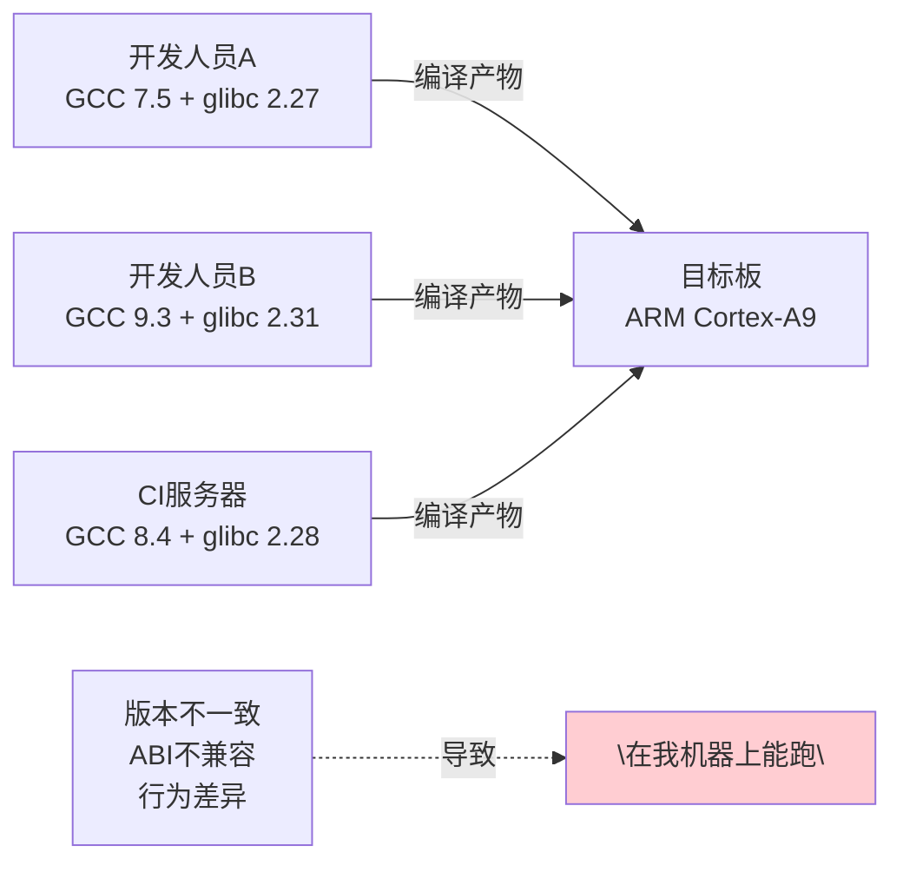
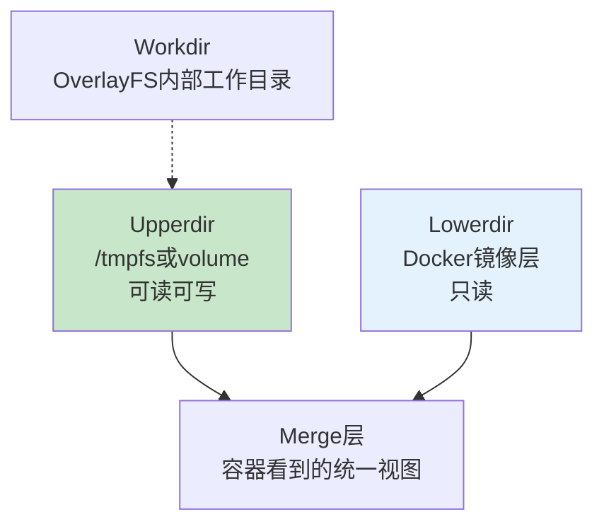

# 嵌入式容器高级实战

> <span class="badge-e">**高级 (Expert)**</span>
> 将容器技术深度集成到嵌入式工作流中，覆盖工具链容器化、CI/CD集成、设备直通、时区同步、OTA更新和只读rootfs。

---

## 核心问题：容器如何改变嵌入式开发 [I→E]

---

### <strong>嵌入式开发的传统痛点</strong>

<span class="badge-i">I</span><br>
<span class="red">嵌入式开发环境</span>长期面临"编译一次，配置一周"的困境：工具链版本冲突、依赖库不一致、新成员入职搭建环境耗时数天。<br>



<span class="blue">核心矛盾：嵌入式开发环境的一致性需求与工具链快速迭代之间的矛盾，传统虚拟机方案又太重。</span><br>

---

### <strong>容器化带来的范式转变</strong>

<span class="badge-e">E</span><br>
<span class="red">容器化嵌入式工作流</span>将"环境配置"变成"版本化的Dockerfile"，每次构建都基于相同的层，消除了环境差异。<br>

| 维度 | 传统方式 | 容器化方式 | 收益 |
|------|---------|-----------|------|
| 环境搭建 | 手动安装工具链 | docker pull toolchain | 分钟级 |
| 版本锁定 | 文档记录 | Dockerfile版本控制 | 可复现 |
| 多项目切换 | 虚拟机/多系统 | 多容器并行 | 零切换成本 |
| CI/CD | 远程服务器配环境 | 统一容器镜像 | 构建一致性 |
| 新人入职 | 1-2天环境搭建 | 10分钟拉取镜像 | 效率提升 |

<span class="blue">关键洞察：容器对嵌入式的核心价值不是"隔离"，而是"一致性"——在资源受限的设备上，容器作为构建和交付工具的价值远超运行时隔离。</span><br>

---

## 工具链容器化 [I→E]

---

### <strong>交叉编译工具链的容器封装</strong>

<span class="badge-i">I</span><br>
<span class="red">工具链容器化</span>将特定版本的编译器、链接器、库文件和构建工具封装为OCI镜像，开发者只需拉取即可使用。<br>

```dockerfile
# 文件路径：docker/toolchain/Dockerfile.armhf-linaro
# 功能：ARM Cortex-A9 交叉编译工具链容器
# 行号：1-30
FROM debian:bullseye-slim

# 安装基础依赖
RUN apt-get update \
    && apt-get install -y --no-install-recommends \
       ca-certificates curl make cmake git \
    && rm -rf /var/lib/apt/lists/*

# 下载并安装Linaro工具链
ARG TOOLCHAIN_URL=https://releases.linaro.org/components/toolchain/binaries/latest-7/arm-linux-gnueabihf/gcc-linaro-7.5.0-2019.12-x86_64_arm-linux-gnueabihf.tar.xz
RUN curl -L "${TOOLCHAIN_URL}" -o /tmp/toolchain.tar.xz \
    && tar -xf /tmp/toolchain.tar.xz -C /opt \
    && rm /tmp/toolchain.tar.xz \
    && ln -s /opt/gcc-linaro-7.5.0-2019.12-x86_64_arm-linux-gnueabihf /opt/toolchain

# 环境变量
ENV PATH="/opt/toolchain/bin:${PATH}"
ENV ARCH=arm
ENV CROSS_COMPILE=arm-linux-gnueabihf-

# sysroot配置
ENV SYSROOT=/opt/toolchain/arm-linux-gnueabihf/libc

WORKDIR /workspace
ENTRYPOINT ["/bin/bash"]
```

<span class="orange"><strong>1. 镜像版本标签策略：</strong></span><br>
- <span class="green">toolchain:armhf-linaro-7.5</span> — 精确版本标签，不可变<br>
- <span class="green">toolchain:armhf-latest</span> — 浮动标签，指向最新稳定版<br>
- <span class="green">toolchain:armhf-7.5-{date}</span> — 日期标签，追踪每日构建<br>

<span class="orange"><strong>2. 容器内编译命令：</strong></span><br>

```bash
# 使用容器进行交叉编译
$ docker run --rm -v $(pwd):/workspace \
    toolchain:armhf-linaro-7.5 \
    -c "make CROSS_COMPILE=arm-linux-gnueabihf-"

# 交互式开发（保留容器状态用于调试）
$ docker run -it --name my-build-env \
    -v $(pwd):/workspace \
    toolchain:armhf-linaro-7.5
```

---

### <strong>多工具链并行与sysroot管理 [E]</strong>

<span class="badge-e">E</span><br>
<span class="red">多工具链并行</span>在同时维护不同架构产品线时是刚需。容器天然支持多版本共存，避免了宿主机PATH污染。<br>

```bash
# 文件路径：Makefile 片段
# 功能：通过容器选择不同工具链
# 行号：1-25
# Makefile中定义工具链容器映射
TOOLCHAINS := \
    armhf=toolchain:armhf-linaro-7.5 \
    aarch64=toolchain:aarch64-linaro-7.5 \
    cortex-m=toolchain:arm-none-eabi-gcc-10

# 构建目标
.PHONY: build-%
build-%:
    @echo "Building for $* using $(word 2,$(subst =, ,$(filter $*=%,$(TOOLCHAINS))))"
    docker run --rm \
        -v $(PWD):/workspace \
        -e TARGET=$* \
        $(word 2,$(subst =, ,$(filter $*=%,$(TOOLCHAINS)))) \
        -c "cd /workspace && make TARGET=$* _local_build"

# 使用：make build-armhf
```

<span class="orange"><strong>1. sysroot隔离方案：</strong></span><br>
每个工具链容器携带独立的sysroot（标准库头文件和链接库），编译时通过 <span class="green">--sysroot=</span> 指定，避免宿主机库污染。<br>

<span class="orange"><strong>2. 私有库的管理：</strong></span><br>

```dockerfile
# 将自定义SDK作为独立镜像层
FROM toolchain:armhf-linaro-7.5 AS sdk
COPY vendor-sdk/ /opt/vendor-sdk/
ENV CFLAGS="-I/opt/vendor-sdk/include ${CFLAGS}"
ENV LDFLAGS="-L/opt/vendor-sdk/lib ${LDFLAGS}"
```

<span class="blue">关键洞察：工具链容器的本质是将"环境配置"从口头文档变成可执行的代码。Dockerfile是 Infrastructure as Code 在嵌入式领域的具体实践。</span><br>

---

## CI-CD集成 [I→E]

---

### <strong>容器化CI流水线设计</strong>

<span class="badge-i">I</span><br>
<span class="red">容器化CI/CD</span>将构建、测试和打包阶段全部封装在容器中，确保本地开发与CI服务器的行为完全一致。<br>

```yaml
# 文件路径：.github/workflows/embedded-ci.yml
# 功能：GitHub Actions嵌入式CI流水线
# 行号：1-50
name: Embedded CI

on: [push, pull_request]

jobs:
  build:
    runs-on: ubuntu-latest
    strategy:
      matrix:
        target: [armhf, aarch64, cortex-m4]
        build_type: [debug, release]
    container:
      image: myregistry/toolchain:${{ matrix.target }}-latest
      credentials:
        username: ${{ secrets.REGISTRY_USER }}
        password: ${{ secrets.REGISTRY_PASS }}
    steps:
      - uses: actions/checkout@v4

      - name: Configure
        run: cmake -B build -DCMAKE_BUILD_TYPE=${{ matrix.build_type }} \
            -DCMAKE_TOOLCHAIN_FILE=cmake/${{ matrix.target }}.cmake

      - name: Build
        run: cmake --build build -j$(nproc)

      - name: Static Analysis
        run: cppcheck --enable=all --error-exitcode=1 src/

      - name: Unit Tests (x86仿真)
        run: cd build && ctest --output-on-failure

      - name: Package
        run: cmake --build build --target package

      - name: Upload Artifact
        uses: actions/upload-artifact@v4
        with:
          name: firmware-${{ matrix.target }}-${{ matrix.build_type }}
          path: build/*.elf
```

<span class="orange"><strong>1. 流水线阶段设计：</strong></span><br>

| 阶段 | 容器角色 | 产出物 |
|------|---------|--------|
| 编译 | 工具链容器 | .elf/.bin |
| 静态分析 | cppcheck容器 | 报告 |
| 仿真测试 | QEMU容器 | 测试日志 |
| 固件打包 | 工具链容器 | .zip/.tar.gz |
| 镜像构建 | Docker daemon | OCI镜像 |

<span class="orange"><strong>2. QEMU仿真测试的容器化：</strong></span><br>

```dockerfile
# 文件路径：docker/test/Dockerfile.qemu-test
# 功能：QEMU用户态仿真测试环境
# 行号：1-15
FROM debian:bullseye-slim
RUN apt-get update \
    && apt-get install -y --no-install-recommends \
       qemu-user-static qemu-user binfmt-support \
    && rm -rf /var/lib/apt/lists/*
# 注册QEMU binfmt
RUN docker run --rm --privileged multiarch/qemu-user-static --reset -p yes
WORKDIR /test
ENTRYPOINT ["qemu-arm-static"]
```

---

### <strong>嵌入式专属CI优化 [E]</strong>

<span class="badge-e">E</span><br>
<span class="red">嵌入式CI</span>需要处理固件签名、版本矩阵管理和硬件在环（HIL）测试等特殊需求。<br>

```yaml
# 文件路径：.gitlab-ci.yml
# 功能：GitLab CI嵌入式流水线，含签名和HIL测试
# 行号：1-40
stages:
  - build
  - sign
  - hil_test
  - deploy

variables:
  DOCKER_DRIVER: overlay2
  DOCKER_TLS_CERTDIR: ""

build:firmware:
  stage: build
  image: myregistry/toolchain:armhf-linaro-7.5
  script:
    - cmake -B build -DCMAKE_BUILD_TYPE=Release
    - cmake --build build
  artifacts:
    paths:
      - build/firmware.elf
      - build/firmware.bin

sign:firmware:
  stage: sign
  image: myregistry/signing-tool:latest
  script:
    - openssl dgst -sha256 -sign private.pem \
        -out build/firmware.sig build/firmware.bin
  dependencies:
    - build:firmware

hil_test:
  stage: hil_test
  image: myregistry/hil-runner:latest
  tags:
    - hardware-lab           # 必须运行在带物理设备的runner上
  script:
    - flash --target=stm32f4 --file=build/firmware.bin
    - pytest tests/hil/ --device=/dev/ttyACM0
```

<span class="blue">关键洞察：嵌入式CI与普通软件CI的核心差异在于"硬件在环测试"——代码在QEMU中通过不等于在真实芯片上通过，必须保留物理测试环节。</span><br>

---

## USB JTAG直通 [E]

---

### <strong>调试设备的容器化接入</strong>

<span class="badge-e">E</span><br>
<span class="red">USB JTAG直通</span>将调试探针（J-Link、ST-Link、DAP-Link）接入容器，使容器内的GDB和OpenOCD能够直接操作目标芯片。<br>

```bash
# 文件路径：docker-compose.yml
# 功能：调试容器配置，含USB设备直通
# 行号：1-30
version: '3.8'
services:
  debugger:
    image: embedded-debug:latest
    container_name: gdb-server
    privileged: false            # 不推荐全特权，改用精确设备规则
    devices:
      - /dev/bus/usb/001/004:/dev/bus/usb/001/004  # J-Link USB设备
    device_cgroup_rules:
      - 'c 189:* rmw'             # USB字符设备全允许（动态minor）
    volumes:
      - ./firmware:/firmware:ro
      - ./scripts:/scripts:ro
    command: >
      openocd -f interface/jlink.cfg
              -f target/stm32f4x.cfg
              -c "program /firmware/firmware.bin verify reset exit"
```

<span class="orange"><strong>1. USB设备路径的稳定性问题：</strong></span><br>
USB设备热插拔后 <span class="green">/dev/bus/usb/XXX/YYY</span> 路径会变化。解决方案：<br>
- <span class="green">udev规则</span> 固定符号链接：<span class="green">/dev/jlink-</span><br>
- <span class="green">--device=/dev/jlink-probe:/dev/jlink-probe</span> 使用固定链接<br>

<span class="orange"><strong>2. OpenOCD + GDB 的容器内调试流程：</strong></span><br>

```bash
# 文件路径：scripts/docker-debug.sh
# 功能：一键启动容器内GDB调试
# 行号：1-20
#!/bin/bash
FIRMWARE="${1:-build/firmware.elf}"

# 1. 启动OpenOCD容器（后台运行）
docker run -d --name openocd-server \
    --device=/dev/jlink-probe:/dev/jlink-probe:rwm \
    -v $(pwd):/workspace:ro \
    embedded-debug:latest \
    openocd -f /workspace/board.cfg

# 2. 在另一个容器中启动GDB，连接到openocd-server
docker run -it --rm \
    --network=container:openocd-server \
    -v $(pwd):/workspace \
    embedded-debug:latest \
    arm-none-eabi-gdb /workspace/$FIRMWARE \
    -ex "target remote localhost:3333"
```

<span class="blue">关键洞察：USB JTAG直通的核心挑战不是技术实现，而是"动态设备节点 + 权限同步 + 容器生命周期管理"的三重复杂性。</span><br>

---

## 时区与UID同步 [I]

---

### <strong>容器内外身份映射</strong>

<span class="badge-i">I</span><br>
<span class="red">UID/GID同步</span>解决容器内写入文件的所有权问题。默认情况下容器内root（UID=0）写入的文件在宿主机上也是root所有，导致普通用户无法编辑。<br>

```dockerfile
# 文件路径：docker/Dockerfile.uid-sync
# 功能：容器内用户与宿主机用户UID/GID同步
# 行号：1-25
FROM debian:bullseye-slim

# 创建与宿主机用户同UID的用户（构建时传入）
ARG HOST_UID=1000
ARG HOST_GID=1000
RUN groupadd -g ${HOST_GID} builder \
    && useradd -u ${HOST_UID} -g ${HOST_GID} -m builder

# 时区配置
ARG TZ=Asia/Shanghai
RUN ln -snf /usr/share/zoneinfo/${TZ} /etc/localtime \
    && echo ${TZ} > /etc/timezone

# 工作目录权限
WORKDIR /workspace
RUN chown builder:builder /workspace

USER builder

# 工具链安装在用户可写路径
ENV PATH="/home/builder/.local/bin:${PATH}"
```

<span class="orange"><strong>1. 构建时传入宿主机UID：</strong></span><br>

```bash
# 动态获取宿主机UID并构建
$ docker build \
    --build-arg HOST_UID=$(id -u) \
    --build-arg HOST_GID=$(id -g) \
    --build-arg TZ=$(cat /etc/timezone) \
    -t dev-env:latest .

# 运行后，容器内builder用户创建的文件，宿主机上属主正确
$ docker run --rm -v $(pwd):/workspace dev-env:latest \
    touch /workspace/test.txt
$ ls -l test.txt
-rw-r--r-- 1 user user 0 Jan 1 12:00 test.txt
```

<span class="orange"><strong>2. 时区同步的必要性：</strong></span><br>
嵌入式日志和固件编译时间戳需要与本地时间一致。容器默认UTC时区会导致日志时间错位。<br>

<span class="blue">关键洞察：UID同步不是安全需求，而是"开发体验需求"——消除容器内外文件所有权不一致带来的sudo和chmod操作。</span><br>

---

## OTA更新策略 [E]

---

### <strong>容器化固件交付与更新</strong>

<span class="badge-e">E</span><br>
<span class="red">OTA容器化策略</span>将固件打包为OCI镜像的一部分，利用Docker registry作为固件分发基础设施，复用成熟的镜像签名和增量传输机制。<br>

```dockerfile
# 文件路径：docker/Dockerfile.firmware-ota
# 功能：固件OTA容器，内含更新脚本和版本元数据
# 行号：1-35
FROM scratch AS firmware
COPY build/firmware.bin /firmware/app.bin
COPY build/firmware.sig /firmware/app.sig
COPY metadata.json /firmware/metadata.json

# OTA编排容器（从firmware阶段提取固件并执行更新）
FROM alpine:3.18 AS updater
RUN apk add --no-cache curl openssl jq

# 从registry拉取固件镜像
COPY --from=firmware /firmware/ /opt/firmware/

# 更新脚本
COPY scripts/ota-update.sh /usr/local/bin/
RUN chmod +x /usr/local/bin/ota-update.sh

ENTRYPOINT ["/usr/local/bin/ota-update.sh"]
```

<span class="orange"><strong>1. 固件镜像的分层复用：</strong></span><br>
OTA容器利用Docker层的增量传输特性：若固件只有少量变化，只需传输差异层。<br>

```bash
# 推送固件镜像到registry
$ docker build --target firmware -t registry/firmware:v1.2.3 .
$ docker push registry/firmware:v1.2.3

# 目标设备拉取并更新
$ docker pull registry/firmware:v1.2.3
$ docker run --rm --privileged \
    -v /dev/mmcblk0:/dev/mmcblk0 \
    registry/firmware:v1.2.3
```

<span class="orange"><strong>2. A/B分区和原子更新：</strong></span><br>

```bash
# 文件路径：scripts/ota-update.sh
# 功能：A/B分区原子更新
# 行号：1-40
#!/bin/sh
FIRMWARE_DIR="/opt/firmware"
ACTIVE_SLOT=$(fw_printenv active_slot | cut -d= -f2)
NEW_SLOT=$((1 - ACTIVE_SLOT))  # 切换A/B槽

# 验证固件签名
openssl dgst -sha256 -verify /etc/pubkey.pem \
    -signature "${FIRMWARE_DIR}/app.sig" \
    "${FIRMWARE_DIR}/app.bin" || exit 1

# 写入新分区
dd if="${FIRMWARE_DIR}/app.bin" of="/dev/mmcblk0p$((NEW_SLOT + 1))" bs=4M status=progress
sync

# 标记新槽为可启动，旧槽为备份
fw_setenv active_slot "${NEW_SLOT}"
fw_setenv fallback_slot "${ACTIVE_SLOT}"
fw_setenv boot_count 0

echo "Update complete. Reboot to activate slot ${NEW_SLOT}."
```

<span class="blue">关键洞察：将固件作为OCI镜像分发，复用了Docker的增量传输、签名验证和版本管理基础设施，避免了自建OTA服务器的重复建设。</span><br>

---

## rootfs只读化与Overlay [E]

---

### <strong>嵌入式容器的不可变基础设施</strong>

<span class="badge-e">E</span><br>
<span class="red">rootfs只读化</span>将容器根文件系统挂载为只读，防止运行时的意外写入导致状态漂移和安全漏洞。OverlayFS提供可写的上层以容纳临时文件。<br>

```bash
# 文件路径：docker run 命令
# 功能：以只读rootfs启动容器，OverlayFS处理临时写入

$ docker run --read-only \
    --tmpfs /tmp:noexec,nosuid,size=50m \
    --tmpfs /var/cache:size=10m \
    --tmpfs /var/run:size=5m \
    -v /data:/data:rw \
    my-embedded-app
```

<span class="orange"><strong>1. --read-only 的防护范围：</strong></span><br>
- 容器层（镜像层）全部只读<br>
- <span class="green">--tmpfs</span> 挂载的目录可写，但数据不持久化（宿主机内存中）<br>
- <span class="green">-v 挂载的宿主机目录</span> 不受只读限制<br>

<span class="orange"><strong>2. OverlayFS的三层结构：</strong></span><br>



---

### <strong>嵌入式场景的Overlay实战 [E]</strong>

<span class="badge-e">E</span><br>
<span class="red">嵌入式Overlay配置</span>需要平衡只读安全性与持久化数据需求。关键数据目录通过宿主机bind mount持久化，临时目录通过tmpfs隔离。<br>

```yaml
# 文件路径：docker-compose.yml
# 功能：嵌入式设备的只读容器配置
# 行号：1-35
version: '3.8'
services:
  edge-gateway:
    image: edge-gateway:v2.1.0
    read_only: true
    tmpfs:
      - /tmp:noexec,nosuid,size=100m
      - /var/log:size=20m,mode=755
      - /var/cache:size=50m
    volumes:
      # 持久化数据：配置文件和数据库存储在宿主机
      - /data/edge/config:/etc/edge:ro     # 配置只读传入
      - /data/edge/db:/var/lib/edge:rw     # 数据库可写持久化
      - /data/edge/logs:/var/log/edge:rw   # 日志持久化
      # 设备节点
      - /dev/ttyUSB0:/dev/ttyUSB0:rwm
    security_opt:
      - no-new-privileges:true              # 禁止提升权限
    cap_drop:
      - ALL
    cap_add:
      - SYS_NICE                             # 仅保留必要能力
      - NET_BIND_SERVICE
```

<span class="orange"><strong>1. 只读容器的安全收益：</strong></span><br>
- 防止恶意软件写入可执行文件<br>
- 防止日志文件无限增长占满存储<br>
- 运行时状态可预测，便于故障排查<br>

<span class="orange"><strong>2. 宿主机目录的安全边界：</strong></span><br>
宿主机bind mount的目录在容器内以指定权限出现。建议配置目录为 <span class="green">:r</span>（只读）或 <span class="green">:ro</span>，仅在必要时开放写入。<br>

<span class="blue">关键洞察：只读rootfs + OverlayFS + 最小能力集（cap_drop ALL, cap_add 必要）是嵌入式容器安全的三支柱。攻击面从"整个rootfs"缩小到"几个bind mount目录"。</span><br>

---

## 历史演进：从交叉编译到云原生嵌入式 [E]

---

### <strong>嵌入式容器化的发展脉络</strong>

<span class="badge-e">E</span><br>

| 年代 | 阶段 | 特征 | 容器角色 |
|------|------|------|----------|
| 2000s | 本地交叉编译 | 每人一台Linux工作站 | 无 |
| 2010s | 虚拟机标准化 | VMware/VirtualBox开发镜像 | 替代方案 |
| 2015s | Docker工具链 | 轻量级工具链容器 | 构建环境 |
| 2018s | CI容器化 | Jenkins + Docker slaves | 构建+测试 |
| 2020s | 边缘容器 | K3s/K3OS在设备上运行 | 运行时+编排 |
| 2024+ | 云原生嵌入式 | GitOps + OTA + 容器监控 | 全生命周期 |

<span class="orange"><strong>1. 从构建工具到运行时的演进逻辑：</strong></span><br>
容器最初解决"编译环境一致性问题"，随后扩展到"测试环境一致性"，最终覆盖"运行时一致性"。每一步都是"确定性"的扩展。<br>

<span class="orange"><strong>2. 边缘容器编排的兴起：</strong></span><br>
<span class="green">K3s</span>（轻量级Kubernetes）和 <span class="green">K3OS</span>将容器编排引入嵌入式设备。单节点即可运行Pod和Deployment，实现边缘侧的GitOps部署。<br>

```bash
# 在ARM边缘设备上运行K3s
$ curl -sfL https://get.k3s.io | INSTALL_K3S_EXEC="--disable traefik" sh -
# 内存占用约500MB，支持容器编排、服务发现和自动重启
```

<span class="blue">演进逻辑：嵌入式容器化沿着"构建标准化 → 交付标准化 → 运行标准化"的路径推进，最终目标是让嵌入式软件获得与云软件相同的开发和运维体验。</span><br>

---

## 小结

---

### <strong>本章核心要点</strong>

| 知识点 | 关键内容 | 难度 |
|--------|---------|------|
| 工具链容器化 | Dockerfile封装工具链、多版本并行 | I→E |
| CI/CD集成 | GitHub Actions/GitLab CI容器化流水线 | I→E |
| USB JTAG直通 | 设备节点映射、udev固定链接 | E |
| UID/时区同步 | 构建时传入宿主机参数 | I |
| OTA更新 | OCI镜像作为固件载体、A/B分区 | E |
| rootfs只读 | --read-only + tmpfs + OverlayFS | E |

---

### <strong>本章练习题</strong>

<span class="badge-e">E</span>

1. 工具链容器化后，为什么还需要保留本地宿主机工具链？列举至少两种容器无法替代的场景。
2. 设计一个支持A/B分区OTA的容器镜像结构，说明签名验证、回滚机制和版本降级策略。
3. 在只读rootfs容器中，如果应用程序需要写入配置文件，应如何设计持久化方案以兼顾安全性和可用性？

---

> <span class="badge-e">E</span> <span class="blue">容器不是嵌入式的终极目标，而是手段——它将不可复现的手工配置变成可版本化的代码，将碎片化环境变成统一流水线。</span>
