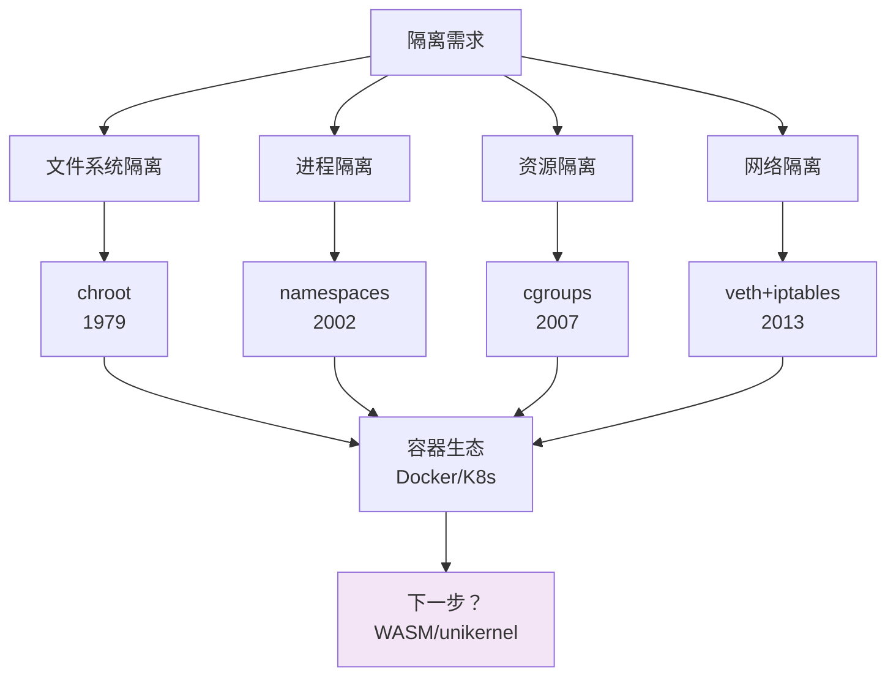
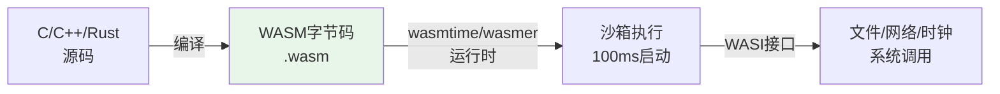
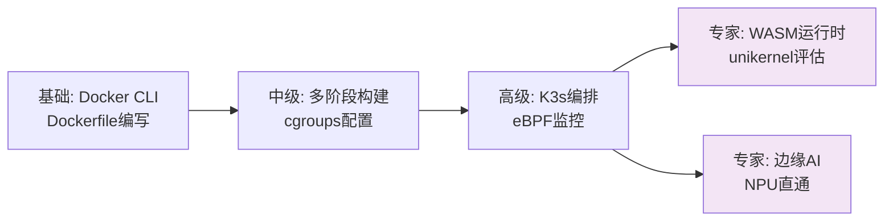

# 历史演进与前沿趋势

> <span class="badge-e">**高级→大师 (Expert→Master)**</span>
> 追溯从chroot到Docker到Kubernetes的隔离技术演进，洞察WebAssembly容器、unikernel、RISC-V生态和边缘AI容器化的前沿方向。

---

## 核心问题：为什么隔离技术持续演进 [B→E]

---

### <strong>隔离需求的驱动力分析</strong>

<span class="badge-b">B</span><br>
<span class="red">操作系统隔离技术</span>的演进始终围绕三个核心矛盾：隔离强度与资源开销的权衡、通用性与专用性的取舍、标准化与定制化的平衡。<br>



<span class="blue">核心洞察：每一次隔离技术的突破，都源于前一代技术在特定场景下的"不够快"或"不够安全"——需求驱动演进，而非技术自驱。</span><br>

---

### <strong>嵌入式场景的特殊约束</strong>

<span class="badge-i">I</span><br>
<span class="red">嵌入式隔离</span>与云服务器隔离的核心差异在于资源预算和安全模型的根本不同。<br>

| 维度 | 云服务器 | 嵌入式设备 |
|------|---------|-----------|
| CPU | 多核/数十核 | 单核/双核 |
| 内存 | GB-TB级 | MB-GB级 |
| 存储 | SSD/TB级 | eMMC/Flash几十MB-GB |
| 启动时间 | 秒级可接受 | 毫秒-秒级要求 |
| 安全边界 | 多租户不可信 | 单租户可信 |
| 网络 | 高带宽 | 受限/间歇连接 |

<span class="blue">关键洞察：云原生容器追求"强隔离、高密度、弹性伸缩"，嵌入式容器追求"低开销、确定性、快速启动"。两者目标不同，技术路线必然分化。</span><br>

---

## 从chroot到Docker到K8s [I→E]

---

### <strong>隔离技术的三代里程碑</strong>

<span class="badge-i">I</span><br>
<span class="red">三代隔离技术</span>构成了从进程沙箱到分布式容器编排的完整演进链。每一代都在前一代基础上填补一个关键空白。<br>

<span class="orange"><strong>1. chroot：文件系统隔离的鼻祖（1979）</strong></span><br>

```c
// chroot系统调用原型
// 文件路径：unistd.h
int chroot(const char *path);
// 效果：将进程的根目录切换到指定路径，进程无法访问path之外的路径
// 局限：不隔离进程、网络、设备，root用户可轻易逃逸
```

chroot最初用于FTP服务器的安全沙箱。它不创建真正的隔离边界，只是限制了文件系统的根视图。<br>

<span class="orange"><strong>2. LXC：命名空间+cgroups的容器雏形（2008）</strong></span><br>
<span class="green">LXC（Linux Containers）</span>首次将namespaces、cgroups和chroot组合为统一的容器接口，提供了接近VM的隔离体验。<br>

```bash
# LXC容器创建示例
$ lxc-create -n my-container -t ubuntu
$ lxc-start -n my-container
$ lxc-attach -n my-container
```

LXC的局限在于管理接口原始、缺乏镜像分发机制、生态碎片化。<br>

<span class="orange"><strong>3. Docker：镜像标准化与生态爆发（2013）</strong></span><br>
<span class="green">Docker</span>不是技术创新（底层仍是LXC），而是标准创新——它定义了镜像格式、分发协议和构建规范，将容器从系统管理员工具变成开发者工具。<br>

```bash
# Docker的标准化接口
$ docker pull ubuntu:22.04          # 标准镜像拉取
$ docker build -t my-app .          # 标准镜像构建
$ docker push registry/my-app:v1    # 标准镜像分发
$ docker run -d my-app              # 标准容器运行
```

<span class="blue">关键洞察：Docker的成功证明，容器技术的瓶颈从来不是内核隔离能力，而是"开发者体验"——镜像标准化和工具链友好性决定了技术普及速度。</span><br>

---

### <strong>Kubernetes：从单机容器到分布式编排 [E]</strong>

<span class="badge-e">E</span><br>
<span class="red">Kubernetes</span>将容器从单机运行时扩展到分布式系统的编排层。它不关心容器内部，只管理容器的生命周期、调度、网络和服务发现。<br>

```yaml
# 文件路径：k8s/deployment-edge.yaml
# 功能：边缘设备上的Kubernetes Deployment
# 行号：1-35
apiVersion: apps/v1
kind: Deployment
metadata:
  name: edge-gateway
spec:
  replicas: 1                  # 边缘节点通常单副本
  selector:
    matchLabels:
      app: edge-gateway
  template:
    metadata:
      labels:
        app: edge-gateway
    spec:
      nodeSelector:
        node-type: edge        # 仅调度到边缘节点
      containers:
        - name: gateway
          image: edge-gateway:v2.1
          resources:
            limits:
              memory: "256Mi"
              cpu: "500m"
            requests:
              memory: "128Mi"
              cpu: "250m"
          securityContext:
            readOnlyRootFilesystem: true
            allowPrivilegeEscalation: false
```

<span class="orange"><strong>1. K8s在嵌入式中的适配挑战：</strong></span><br>
- <span class="green">etcd</span> 内存占用过高（最低256MB），不适合128MB设备<br>
- <span class="green">kubelet</span> 的默认巡检间隔（10秒）对电池供电设备过于频繁<br>
- <span class="green">CNI网络插件</span> 增加数十MB内存开销<br>

<span class="orange"><strong>2. 边缘K8s方案：</strong></span><br>

| 方案 | 内存占用 | 特点 | 适用场景 |
|------|---------|------|----------|
| K3s | ~512MB | 单二进制，内置SQLite替代etcd | 边缘网关、工业控制器 |
| MicroK8s | ~1GB | 完整K8s功能，snap包管理 | 开发测试 |
| KubeEdge | ~200MB | 云边协同，边缘轻量 | 大规模边缘集群 |
| OpenYurt | ~300MB | 阿里云开源，无缝兼容K8s | 公有云边缘延伸 |

<span class="blue">关键洞察：K8s向嵌入式下沉的障碍不是容器技术本身，而是控制平面的资源消耗。K3s等轻量方案通过裁剪控制平面和替换etcd解决了这一矛盾。</span><br>

---

## WebAssembly容器 [E]

---

### <strong>WASM作为新兴容器运行时</strong>

<span class="badge-e">E</span><br>
<span class="red">WebAssembly（WASM）</span>最初为浏览器设计，但其沙箱安全模型、跨平台字节码和毫秒级启动特性使其成为嵌入式容器的有力竞争者。<br>



<span class="orange"><strong>1. WASM容器的核心优势：</strong></span><br>

| 特性 | Docker容器 | WASM容器 |
|------|-----------|----------|
| 启动时间 | 秒级 | 毫秒级 |
| 冷启动体积 | MB-GB | KB-MB |
| 沙箱边界 | namespaces+cgroups | 内存安全+能力模型 |
| 跨架构 | 需要不同镜像 | 单字节码跨平台 |
| 运行时开销 | Linux内核 | 用户态运行时 |

<span class="orange"><strong>2. WASI：WASM的系统接口标准：</strong></span><br>

```rust
// 文件路径：src/main.rs
// 功能：Rust编写的WASI程序，读取文件并处理
// 行号：1-15
use std::fs;

fn main() {
    let data = fs::read_to_string("/data/sensor.txt")
        .expect("Failed to read sensor data");
    let value: f32 = data.trim().parse().unwrap();
    println!("Sensor value: {}", value);
}
// 编译为WASM：cargo build --target wasm32-wasi
// 运行：wasmtime --dir=/data target/wasm32-wasi/debug/app.wasm
```

<span class="blue">关键洞察：WASM容器不是替代Docker，而是填补Docker无法覆盖的缝隙——亚秒级启动、KB级体积、跨架构单一二进制。在嵌入式无状态函数场景中，WASM是理想选择。</span><br>

---

## unikernel [E]

---

### <strong>库操作系统与专用内核</strong>

<span class="badge-e">E</span><br>
<span class="red">unikernel</span>将应用程序与所需内核组件链接为单一二进制镜像，运行在hypervisor或裸机上。没有通用OS层，启动极快、攻击面极小。<br>

```
// 传统VM架构：
应用 → libc → 通用内核（调度/驱动/网络/VFS） → 硬件

// unikernel架构：
应用 → 专用内核库（仅含应用需要的组件） → 硬件/hypervisor
```

| 特性 | Linux容器 | unikernel |
|------|----------|-----------|
| 启动时间 | 1-10秒 | 10-100毫秒 |
| 镜像体积 | MB-GB | MB- tens of MB |
| 内存占用 | MB-GB | MB |
| 攻击面 | 完整Linux内核 | 仅应用+所需库 |
| 调试难度 | 标准工具链 | 需要专用工具 |
| 生态成熟度 | 成熟 | 实验性/小众 |

<span class="orange"><strong>1. 主流unikernel框架：</strong></span><br>
- <span class="green">MirageOS</span>（OCaml）— 学术先驱，内存安全<br>
- <span class="green">IncludeOS</span>（C++）— 面向云原生，已停产<br>
- <span class="green">Unikraft</span> — 目前最活跃，支持POSIX兼容层，可运行Linux应用<br>
- <span class="green">HermitTux</span> — Rust编写，AArch64支持<br>

<span class="orange"><strong>2. Unikraft在嵌入式中的潜力：</strong></span><br>

```bash
# Unikraft构建示例
$ git clone https://github.com/unikraft/app-helloworld
$ cd app-helloworld
$ make menuconfig          # 选择目标平台（KVM/Xen/baremetal）
$ make                     # 构建unikernel镜像
# 产出：build/app-helloworld_kvm-x86_64 — 单一二进制，可直接qemu启动
```

<span class="blue">关键洞察：unikernel的困境是"生态隔离"——它不能运行现有Linux应用，需要重写或适配。Unikraft的POSIX兼容层正在打破这一壁垒，但距离生产可用仍有距离。</span><br>

---

## RISC-V容器生态 [E]

---

### <strong>开放ISA与容器化的交汇</strong>

<span class="badge-e">E</span><br>
<span class="red">RISC-V</span>作为开放指令集架构，正在重塑嵌入式芯片生态。容器化需要跨越架构边界——x86宿主机构建RISC-V容器镜像，目标设备直接运行。<br>

```bash
# 文件路径：docker/Dockerfile.riscv64
# 功能：构建RISC-V 64位容器镜像
# 行号：1-20
FROM riscv64/ubuntu:22.04
# 官方已提供RISC-V基础镜像

RUN apt-get update \
    && apt-get install -y --no-install-recommends \
       build-essential \
    && rm -rf /var/lib/apt/lists/*

# 交叉编译：在x86上构建RISC-V镜像
# docker buildx build --platform linux/riscv64 -t my-riscv-app .
```

<span class="orange"><strong>1. Docker BuildKit的多架构支持：</strong></span><br>

```bash
# 安装QEMU用户态仿真（binfmt_misc）
$ docker run --rm --privileged multiarch/qemu-user-static --reset -p yes

# 创建buildx builder
$ docker buildx create --name multiarch --use

# 构建多架构镜像
$ docker buildx build --platform linux/amd64,linux/arm64,linux/riscv64 \
    -t registry/app:latest --push .
```

<span class="orange"><strong>2. RISC-V容器的现状与缺口：</strong></span><br>

| 组件 | 状态 | 说明 |
|------|------|------|
| RISC-V基础镜像 | 可用 | Ubuntu/Debian/Alpine官方支持 |
| Docker Engine | 可用 | 社区移植版 |
| Kubernetes | 实验性 | kubelet需移植，etcd测试通过 |
| 硬件浮点支持 | 部分 | D/F扩展芯片逐渐普及 |
| 向量扩展（V） | 早期 | 容器化SIMD应用尚不成熟 |

<span class="blue">关键洞察：RISC-V容器生态的成熟度取决于硬件普及速度。芯片出货量上去后，Docker Hub的官方镜像、CI/CD的交叉编译支持、K8s的调度适配都会自然跟进。</span><br>

---

## 边缘AI容器化 [E→M]

---

### <strong>AI推理与容器技术的融合</strong>

<span class="badge-e">E</span><br>
<span class="red">边缘AI容器化</span>将推理引擎（TensorFlow Lite、ONNX Runtime、PyTorch Mobile）和模型打包为容器，实现AI工作负载的标准化交付和生命周期管理。<br>

```dockerfile
# 文件路径：docker/Dockerfile.edge-ai
# 功能：边缘AI推理容器，含TFLite和硬件加速
# 行号：1-35
FROM arm64v8/python:3.9-slim

# 安装推理引擎
RUN apt-get update \
    && apt-get install -y --no-install-recommends \
       libedgetpu1-std python3-pycoral \
    && rm -rf /var/lib/apt/lists/*

# 安装Python依赖
RUN pip install --no-cache-dir tensorflow-lite numpy pillow

# 模型和推理脚本
COPY models/mobilenet_v1_1.0_224_quant_edgetpu.tflite /models/
COPY src/inference.py /app/

# Coral TPU设备直通
CMD ["python3", "/app/inference.py", \"--model\", "/models/model.tflite\"]
```

<span class="orange"><strong>1. AI容器的特殊需求：</strong></span><br>
- <span class="green">NPU/GPU设备直通</span> — /dev/accelerator0 等专用设备节点<br>
- <span class="green">模型热更新</span> — 不停机替换模型文件（通过volume挂载）<br>
- <span class="green">批量推理与流式推理</span> — 不同的资源分配策略<br>

<span class="orange"><strong>2. 模型服务化（Model Serving）容器：</strong></span><br>

```yaml
# 文件路径：docker-compose.yml
# 功能：边缘AI服务编排
# 行号：1-25
version: '3.8'
services:
  inference:
    image: edge-ai-inference:v1
    devices:
      - /dev/bus/usb/002/005:/dev/bus/usb/002/005  # Coral USB
    volumes:
      - /data/models:/models:ro                    # 模型目录
      - /data/input:/input:ro                      # 输入数据
      - /data/output:/output:rw                    # 推理结果
    environment:
      - MODEL_PATH=/models/mobilenet_quant.tflite
      - BATCH_SIZE=1
    deploy:
      resources:
        limits:
          memory: 512M
          cpus: '2.0'
```

---

### <strong>AI容器的实时性挑战 [M]</strong>

<span class="badge-m">M</span><br>
<span class="red">AI推理的实时性</span>与容器的资源隔离存在张力：cgroups的CPU配额可能导致推理中断，内存限制可能在模型加载时触发OOM。<br>

```bash
# 文件路径：scripts/ai-rt-setup.sh
# 功能：为AI容器配置实时资源保障
# 行号：1-25
#!/bin/bash
CONTAINER=$1

# 1. CPU亲和性：绑定到非系统核心
DOCKER_CGROUP="/sys/fs/cgroup/docker/${CONTAINER}"
echo "2-3" > "${DOCKER_CGROUP}/cpuset.cpus"

# 2. 高内存上限（模型通常占用数百MB）
echo 1073741824 > "${DOCKER_CGROUP}/memory.limit_in_bytes"  # 1GB

# 3. 禁用OOM killer，改为阻塞（防止推理中断）
echo 1 > "${DOCKER_CGROUP}/memory.oom_control"

# 4. 实时调度（需特权）
docker update --cpu-rt-period=1000000 --cpu-rt-runtime=900000 ${CONTAINER}
```

<span class="blue">关键洞察：边缘AI容器化仍处于早期——硬件加速接口不统一、模型格式碎片化、推理延迟难以保证。这是未来3-5年容器技术需要解决的核心问题。</span><br>

---

## 学习路径与未来展望 [M]

---

### <strong>嵌入式容器技术的学习地图</strong>

<span class="badge-m">M</span><br>
<span class="red">学习路径</span>应根据当前角色和目标场景设计，避免在不相干的技术上过度投入。<br>



| 阶段 | 技能 | 实践项目 | 验证标准 |
|------|------|----------|----------|
| 入门 | Docker基础、镜像构建 | 构建交叉编译工具链容器 | 镜像<100MB |
| 中级 | 多阶段、资源隔离、CI集成 | GitLab CI容器化流水线 | 构建时间<5min |
| 高级 | K3s部署、设备直通、安全加固 | 边缘网关容器化部署 | 故障自动恢复 |
| 专家 | WASM/unikernel评估、AI容器 | RISC-V设备容器化运行 | 启动时间<1s |

<span class="orange"><strong>1. 未来3年的技术预判：</strong></span><br>
- <span class="green">cgroups v2全面普及</span> — 2025年后新发行版默认v2，v1进入维护模式<br>
- <span class="green">WASM容器标准化</span> — WASI预览2完成后，WASM将获得完整的网络+文件能力<br>
- <span class="green">AI容器运行时</span> — 专门针对NPU调度的容器运行时可能出现（类似NVIDIA Docker）<br>
- <span class="green">RISC-V容器生态成熟</span> — Docker Hub官方镜像覆盖主流发行版<br>

<span class="blue">关键洞察：容器技术的前沿方向可以归纳为"更轻、更快、更专用"。通用容器（Docker）已经成熟，未来的增量价值来自特定场景的专用化运行时。</span><br>

---

## 历史演进总结：隔离技术的六十年 [E]

---

### <strong>从分时系统到云原生的完整脉络</strong>

<span class="badge-e">E</span><br>

| 年代 | 技术 | 隔离层级 | 关键突破 | 嵌入式启示 |
|------|------|---------|----------|-----------|
| 1960s | 分时系统 | 进程级 | 多用户共享主机 | 无 |
| 1979 | chroot | 文件系统 | 根目录切换 | 早期安全沙箱 |
| 1990s | FreeBSD jail | 进程+文件系统 | 扩展chroot | 监狱概念雏形 |
| 2002 | Linux namespaces | 六维隔离 | PID/NET/IPC/UTS/MOUNT/USER | 容器基石 |
| 2007 | cgroups v1 | 资源控制 | CPU/内存/IO/设备配额 | 资源边界 |
| 2008 | LXC | 容器封装 | 统一接口 | 容器化先驱 |
| 2013 | Docker | 生态标准化 | 镜像+分发+构建 | 开发者体验 |
| 2014 | Kubernetes | 编排层 | 分布式容器管理 | 边缘集群 |
| 2016 | cgroups v2 | 统一模型 | 层级树+线程委派 | 实时增强 |
| 2018 | WASM/WASI | 语言级沙箱 | 内存安全+能力模型 | 毫秒启动 |
| 2020+ | 边缘K8s | 轻量编排 | K3s/KubeEdge | 资源适配 |

<span class="orange"><strong>1. 演进的内在逻辑：</strong></span><br>
隔离技术的演进遵循"发现问题→局部解决→统一框架→生态成熟"的循环。每一代技术都是在前一代的边界处突破：chroot不隔离进程，namespaces补上；namespaces不控制资源，cgroups补上；cgroups缺少标准接口，Docker补上。<br>

<span class="orange"><strong>2. 嵌入式容器的独特位置：</strong></span><br>
嵌入式容器化不是云原生的简单下沉，而是"逆需求驱动"——云场景追求高密度和弹性，嵌入式追求低开销和确定性。这种目标差异将导致容器技术路线分化：通用容器继续服务于云，专用运行时（WASM、unikernel、K3s）服务于边缘。<br>

<span class="blue">演进逻辑：容器技术的下一个十年属于"场景化"——脱离具体场景的通用容器已触及天花板，专用化、轻量化、实时化是嵌入式领域的增量空间。</span><br>

---

## 小结

---

### <strong>本章核心要点</strong>

| 知识点 | 关键内容 | 难度 |
|--------|---------|------|
| chroot到Docker | 文件系统隔离→生态标准化 | I |
| K8s到边缘 | 控制平面裁剪、K3s/KubeEdge | E |
| WASM容器 | 毫秒启动、跨架构、WASI接口 | E |
| unikernel | 库OS、启动速度、生态隔离困境 | E |
| RISC-V容器 | 多架构镜像、BuildKit交叉编译 | E |
| 边缘AI容器 | NPU直通、模型热更新、实时保障 | E→M |
| 学习路径 | 入门→中级→高级→专家的分阶段地图 | M |

---

### <strong>本章练习题</strong>

<span class="badge-e">E</span>

1. 如果unikernel不能运行现有Linux应用，它的生态破局点在哪里？Unikraft的POSIX兼容层是否能从根本上解决这一问题？
2. WASM容器的安全模型（内存安全+能力模型）与Linux容器的安全模型（namespaces+cgroups）相比，各适用于什么场景？是否存在融合的可能？
3. 假设你需要为一个RISC-V边缘网关选择容器运行时，候选方案有Docker、K3s和WASM runtime。列出决策矩阵并给出选型理由。

---

> <span class="badge-m">M</span> <span class="blue">容器技术的演进从未停止，但嵌入式的核心命题始终不变：在资源受限中追求确定性，在快速迭代中保持可靠性。</span>
