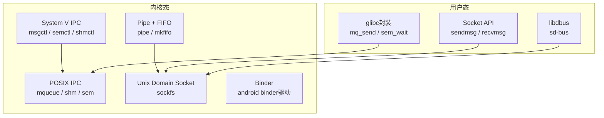

# IPC基础认知与Linux通信机制

> 📊 **本章难度等级：** <span class="badge-b">**B级 (Beginner)**</span> → <span class="badge-i">**I级 (Intermediate)**</span>

---

## IPC定义与嵌入式必要性

---

### <strong>为什么进程间需要通信</strong>

<span class="badge-b">B</span><br>
<span class="red">进程间通信（Inter-Process Communication，IPC）</span>是操作系统为独立进程提供的协同数据交换机制。<br>
现代操作系统采用进程隔离模型，每个进程拥有独立的虚拟地址空间，彼此无法直接访问对方内存。<br>
当多个进程需要协作完成任务时，必须依赖内核提供的IPC原语传递数据或同步状态。<br>

<span class="blue">核心洞察：IPC是操作系统从"多任务并行"走向"多任务协同"的基石设施。</span><br>

---

### <strong>嵌入式场景为何IPC尤为关键</strong>

<span class="badge-b">B</span><br>
<span class="red">嵌入式Linux系统</span>通常采用多进程架构解耦功能模块，IPC成为系统内部的数据主动脉。<br>
典型场景包括：传感器采集进程向UI进程推送数据、网络服务进程向存储进程下发配置、实时控制进程与安全监控进程的状态同步。<br>

与通用服务器不同，嵌入式IPC选型受四大约束：<br>

| 约束维度 | 通用服务器 | 嵌入式系统 |
|----------|-----------|-----------|
| 内存预算 | GB级缓存池 | MB级甚至KB级缓冲区 |
| 延迟容忍 | 毫秒级可接受 | 微秒级至毫秒级硬性要求 |
| 实时等级 | 软实时为主 | 硬实时或准硬实时 |
| 掉电安全 | 依赖日志恢复 | 要求数据持久化与原子性 |

<span class="blue">关键结论：嵌入式IPC选型不是"哪个最快"，而是"在给定约束下哪个最稳"。</span><br>

---

## Linux IPC子系统全景图

---

### <strong>内核IPC设施的分层架构</strong>

<span class="badge-i">I</span><br>
<span class="red">Linux内核IPC子系统</span>按数据传递语义分为两层：内核原语层与用户态封装层。<br>
内核原语直接操作内核数据结构，用户态封装通过glibc或专用库提供更友好的API。<br>



<span class="blue">架构要义：上层API的选择决定了代码的可移植性，下层原语的选择决定了系统的性能上限。</span><br>

---

### <strong>五大IPC分类对比表</strong>

<span class="badge-i">I</span><br>
<span class="red">Linux IPC机制</span>按数据模型可归纳为五大类，每类在语义、性能和适用场景上存在本质差异。<br>

| 分类 | 代表机制 | 数据模型 | 方向 | 内核介入频率 | 典型场景 |
|------|---------|---------|------|-------------|---------|
| 管道类 | Pipe、FIFO | 字节流 | 单向 | 每次读写 | Shell流水线、父子进程简单通信 |
| 消息类 | System V消息队列、POSIX消息队列 | 离散消息 | 双向 | 每次收发 | 异步事件通知、任务分发 |
| 共享内存类 | POSIX shm、mmap | 共享页 | 双向 | 仅mmap时 | 高频数据共享、视频帧缓冲 |
| 信号量类 | System V信号量、POSIX信号量 | 计数器 | 无数据 | P/V操作时 | 资源计数、临界区保护 |
| 套接字类 | Unix Domain Socket、TCP/UDP | 字节流/报文 | 双向 | 每次收发 | 跨主机通信、服务解耦 |

<span class="orange"><strong>1. 管道类：</strong></span>内核维护环形缓冲区，数据按FIFO顺序流动，天然流式语义，无消息边界。<br>
<span class="orange"><strong>2. 消息类：</strong></span>内核维护消息链表，每次读写以完整消息为单位，支持优先级和异步通知。<br>
<span class="orange"><strong>3. 共享内存类：</strong></span>内核仅负责建立页表映射，后续访问完全绕过内核，速度最快但需自同步。<br>
<span class="orange"><strong>4. 信号量类：</strong></span>不传递数据，仅传递同步信号，本质是计数器的原子操作。<br>
<span class="orange"><strong>5. 套接字类：</strong></span>通用性最强，支持本地与远程，支持流式和报文两种语义。<br>

---

## 性能-实时性-资源矩阵

---

### <strong>从三个维度评估IPC机制</strong>

<span class="badge-i">I</span><br>
<span class="red">IPC选型</span>本质是性能、实时性与资源消耗之间的三角权衡。<br>
嵌入式工程师需要在特定约束下找到最优解，而非追求单指标极致。<br>

| 机制 | 单次延迟（典型） | 吞吐量 | 内存占用 | 实时确定性 | 内核态比例 |
|------|----------------|--------|---------|-----------|-----------|
| 匿名管道 | 10~50 us | 中等 | 64KB缓冲 | 一般 | 100% |
| FIFO | 15~60 us | 中等 | 64KB缓冲 | 一般 | 100% |
| POSIX消息队列 | 20~80 us | 中高 | 可配置 | 良好 | 100% |
| 共享内存+自旋锁 | <1 us | 极高 | 共享区大小 | 优秀 | 接近0% |
| 共享内存+互斥锁 | 2~10 us | 极高 | 共享区大小 | 良好 | 仅futex时 |
| Unix Domain Socket | 30~100 us | 中高 | socket缓冲 | 一般 | 100% |
| D-Bus | 100~500 us | 低 | 较大 | 差 | 多次拷贝 |

<span class="blue">推导逻辑：共享内存之所以最快，是因为内核仅在mmap阶段介入；此后所有数据访问均为用户态直接内存读写，完全消除了系统调用开销。</span><br>

---

### <strong>实时性考量的核心指标</strong>

<span class="badge-i">I</span><br>
<span class="red">实时系统IPC</span>评估需要关注三个时间维度：最小延迟、延迟抖动、最坏情况延迟。<br>

```c
// 测量IPC延迟的基准代码框架
// 文件路径：benchmarks/ipc_latency.c
// 行号：1-30
#include <time.h>
#include <stdint.h>

static inline uint64_t get_ns(void) {
    struct timespec ts;
    clock_gettime(CLOCK_MONOTONIC, &ts);
    return (uint64_t)ts.tv_sec * 1000000000ULL + ts.tv_nsec;
}

// 发送方：记录t0，发送，等待确认
// 接收方：接收，记录t1 = get_ns()，发送确认
// 延迟 = t1 - t0
```

<span class="orange"><strong>1. 最小延迟：</strong></span>缓存命中、无抢占时的理论最优值。<br>
<span class="orange"><strong>2. 延迟抖动：</strong></span>多次测量的标准差，反映系统负载稳定性。<br>
<span class="orange"><strong>3. 最坏情况延迟：</strong></span>高负载、中断密集场景下的上限值，硬实时系统必须可证明。<br>

<span class="blue">关键结论：硬实时场景优先选择共享内存+自旋锁，软实时场景可接受消息队列或UDS。</span><br>

---

## 与线程同步的边界辨析

---

### <strong>IPC与线程同步的本质差异</strong>

<span class="badge-i">I</span><br>
<span class="red">线程同步</span>解决的是同一进程内多线程的竞态问题，而<span class="red">IPC</span>解决的是不同进程间的数据交换问题。<br>
两者在实现上存在交集（如futex、互斥锁均可跨进程），但设计目标截然不同。<br>

| 对比维度 | 线程同步（pthread） | 进程间通信（IPC） |
|---------|-------------------|-----------------|
| 地址空间 | 共享虚拟地址 | 独立虚拟地址 |
| 数据可见性 | 天然全局可见 | 需显式传递 |
| 典型原语 | mutex、cond、rwlock | pipe、mq、shm、socket |
| 内核介入 | futex快速路径用户态 | 多数机制每次系统调用 |
| 适用场景 | 临界区保护、生产者-消费者 | 模块化解耦、跨进程服务 |

<span class="blue">边界原则：同一进程内优先用线程同步，跨进程必须选IPC；不要为了"性能"把本应隔离的模块塞进同一进程。</span><br>

---

## 历史演进与小结

---

### <strong>Unix IPC演进脉络</strong>

<span class="badge-i">I</span><br>
<span class="red">Unix IPC</span>的历史几乎等同于Unix操作系统本身的历史，经历了从简单到复杂、从统一到分化的演进。<br>

| 年代 | 里程碑 | 意义 |
|------|--------|------|
| 1973 | pipe()引入Unix V3 | 首个IPC原语，奠定"一切皆文件"哲学 |
| 1983 | System V IPC | msg/sem/shm三元组，AT&T标准化 |
| 1993 | POSIX IPC | 更简洁的API，文件系统命名 |
| 2003 | D-Bus 1.0 | 桌面级消息总线，对象模型化 |
| 2008 | Android Binder | 面向对象IPC，内存仅一次拷贝 |
| 2014 | RPMsg | 异构多核IPC标准化 |

<span class="blue">演进规律：IPC机制从"内核黑盒"走向"文件系统可见"，从"字节流"走向"对象消息"，从"单机"走向"异构多核"。</span><br>

---

## 本章小结

| 要点 | 核心结论 |
|------|---------|
| IPC必要性 | 进程隔离导致必须依赖内核原语交换数据 |
| 五大分类 | 管道、消息、共享内存、信号量、套接字 |
| 选型三维度 | 性能（延迟/吞吐）、实时性（抖动/WCET）、资源（内存/CPU） |
| 线程边界 | 同进程用同步，跨进程用IPC |
| 演进趋势 | 从流式到消息式，从黑盒到透明，从单核到异构 |

---

## 课后练习

1. **理论推导**：为什么共享内存的"零拷贝"特性在高频数据场景下具有决定性优势？请从页表、TLB和系统调用开销三个角度分析。<br>
2. **实验设计**：在同一ARM Cortex-A53平台上，分别测量管道、POSIX消息队列和Unix Domain Socket的单次往返延迟（RTT），绘制CDF分布图并分析抖动差异。<br>
3. **工程决策**：一个128MB RAM的工业网关需要在前端采集进程与后端上报进程之间传输传感器数据（每秒100条，每条512字节）。要求掉电不丢最近10条数据。请选择IPC机制并给出理由。<br>
