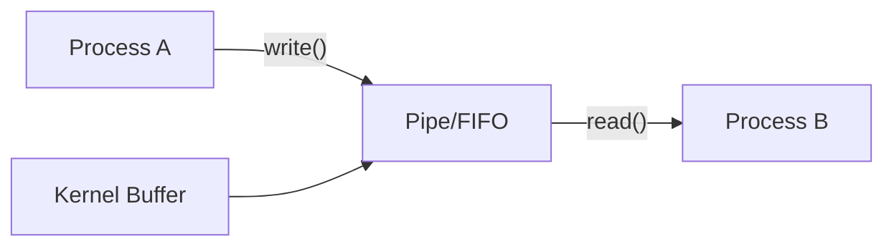

# 管道与FIFO实战

> 📊 **本章难度等级：** <span class="badge-i">**I级 (Intermediate)**</span>

---

## 匿名管道原理

---

### <strong>管道的内核实现机制</strong>

<span class="badge-i">I</span><br>
<span class="red">匿名管道（Anonymous Pipe）</span>是Linux最古老的IPC机制，由Doug McIlroy于1973年在Unix V3中引入。<br>
管道在内核中表现为一对关联的<span class="green">pipe_inode_info</span>结构，管理一个环形缓冲区。<br>

```c
// 创建管道的系统调用
// 文件路径：fs/pipe.c（内核源码参考）
// 行号：约 700 行起
SYSCALL_DEFINE1(pipe2, int __user *, fildes, int, flags)
{
    struct file *files[2];
    int fd[2];
    int error;

    error = __do_pipe_flags(fd, files, flags);  // 分配两个file结构
    if (!error) {
        if (unlikely(copy_to_user(fildes, fd, sizeof(fd)))) {
            // 将fd数组拷贝回用户态
            fput(files[0]);
            fput(files[1]);
            put_unused_fd(fd[0]);
            put_unused_fd(fd[1]);
            error = -EFAULT;
        }
    }
    return error;
}
```

<span class="orange"><strong>1. pipefd[0]为读端：</strong></span>只读打开，从内核缓冲区读取数据。<br>
<span class="orange"><strong>2. pipefd[1]为写端：</strong></span>只写打开，向内核缓冲区写入数据。<br>
<span class="orange"><strong>3. 半双工特性：</strong></span>数据只能单向流动，双向通信需要两对管道。<br>

<span class="blue">内核原理：管道本质上是内存中的FIFO队列，由内核的pipe_inode_info管理读写指针和等待队列。</span><br>

---

### <strong>管道容量与原子性保证</strong>

<span class="badge-i">I</span><br>
<span class="red">Linux管道</span>的默认容量为64KB（自Linux 2.6.11起），可通过<span class="green">/proc/sys/fs/pipe-max-size</span>调整上限。<br>
当写入数据量小于<span class="green">PIPE_BUF</span>（Linux下为4096字节）时，内核保证写入操作的原子性。<br>

```c
// 检查管道容量与原子性边界
// 文件路径：tests/pipe_capacity.c
#include <unistd.h>
#include <fcntl.h>
#include <stdio.h>

int main(void) {
    int pipefd[2];
    pipe(pipefd);

    // 查询管道容量（fcntl F_GETPIPE_SZ）
    long cap = fcntl(pipefd[1], F_GETPIPE_SZ);
    printf("pipe capacity: %ld bytes\n", cap);
    // 典型输出：pipe capacity: 65536 bytes

    // PIPE_BUF 定义原子写入上限
    printf("PIPE_BUF (atomic limit): %d\n", (int)PIPE_BUF);
    // 典型输出：4096

    close(pipefd[0]);
    close(pipefd[1]);
    return 0;
}
```

<span class="blue">关键结论：当写入超过PIPE_BUF时，内核可能将数据拆分多次写入，不再保证原子性。</span><br>

---

## 父子进程双向通信

---

### <strong>双向管道通信的实现模式</strong>

<span class="badge-i">I</span><br>
<span class="red">匿名管道天然半双工</span>，实现父子进程双向通信需要创建两对管道。<br>
未使用的文件描述符必须及时关闭，否则会导致EOF无法到达、进程阻塞等典型问题。<br>

```c
// 双向管道：父进程发送命令，子进程处理后返回结果
// 文件路径：examples/pipe_bidirectional.c
#include <unistd.h>
#include <stdio.h>
#include <string.h>
#include <sys/wait.h>

int main(void) {
    int parent_to_child[2];  // 父 -> 子 管道
    int child_to_parent[2];  // 子 -> 父 管道
    pipe(parent_to_child);
    pipe(child_to_parent);

    pid_t pid = fork();
    if (pid == 0) {
        // 子进程：关闭不需要的端
        close(parent_to_child[1]);  // 关闭写端（父用的写端）
        close(child_to_parent[0]);  // 关闭读端（父用的读端）

        char cmd[64];
        read(parent_to_child[0], cmd, sizeof(cmd));  // 接收命令

        // 模拟处理：字符串反转
        int len = strlen(cmd);
        for (int i = 0; i < len / 2; i++) {
            char t = cmd[i]; cmd[i] = cmd[len-1-i]; cmd[len-1-i] = t;
        }

        write(child_to_parent[1], cmd, len);  // 返回结果
        close(parent_to_child[0]);
        close(child_to_parent[1]);
        return 0;
    }

    // 父进程：关闭不需要的端
    close(parent_to_child[0]);
    close(child_to_parent[1]);

    char *cmd = "reverse_me";
    write(parent_to_child[1], cmd, strlen(cmd));
    close(parent_to_child[1]);  // 关闭写端，触发子进程EOF感知

    char result[64];
    int n = read(child_to_parent[0], result, sizeof(result));
    result[n] = '\0';
    printf("result: %s\n", result);  // 输出：em_esrever

    close(child_to_parent[0]);
    wait(NULL);
    return 0;
}
```

<span class="blue">代码带读：第23-24行关闭未使用的端是关键——子进程关闭parent_to_child[1]确保自己不会意外写入父进程的写端，避免管道混乱。</span><br>

---

## 有名管道FIFO跨进程

---

### <strong>FIFO的文件系统语义</strong>

<span class="badge-i">I</span><br>
<span class="red">有名管道（FIFO）</span>突破匿名管道的亲缘关系限制，通过文件系统路径名实现任意进程间的通信。<br>
FIFO在磁盘上仅保留一个目录项（inode），不存储实际数据，数据仍驻留在内核缓冲区。<br>

```c
// FIFO跨进程通信示例
// 文件路径：examples/fifo_writer.c（写端）
#include <sys/types.h>
#include <sys/stat.h>
#include <fcntl.h>
#include <unistd.h>
#include <stdio.h>

#define FIFO_PATH "/tmp/embedded_fifo"

int main(void) {
    mkfifo(FIFO_PATH, 0666);      // 创建FIFO节点
    int fd = open(FIFO_PATH, O_WRONLY);  // 阻塞直到有读端打开
    write(fd, "sensor_data", 11);
    close(fd);
    unlink(FIFO_PATH);            // 清理FIFO文件
    return 0;
}
```

```c
// 文件路径：examples/fifo_reader.c（读端）
#include <fcntl.h>
#include <unistd.h>
#include <stdio.h>

#define FIFO_PATH "/tmp/embedded_fifo"

int main(void) {
    int fd = open(FIFO_PATH, O_RDONLY);  // 阻塞直到有写端打开
    char buf[64];
    int n = read(fd, buf, sizeof(buf));
    buf[n] = '\0';
    printf("received: %s\n", buf);
    close(fd);
    return 0;
}
```

<span class="orange"><strong>1. 阻塞特性：</strong></span>O_RDONLY在无写端时阻塞，O_WRONLY在无读端时阻塞。<br>
<span class="orange"><strong>2. O_NONBLOCK标志：</strong></span>以非阻塞模式打开，读端立得0（EOF），写端得ENXIO错误。<br>
<span class="orange"><strong>3. 多写端竞争：</strong></span>多个进程同时写入FIFO时，数据会交错，需应用层自行分帧。<br>

<span class="blue">本质理解：FIFO是"有名字的管道"，内核行为与匿名管道完全一致，区别仅在于打开方式。</span><br>

---

## Shell管道协同

---

### <strong>Shell管道符的内核实现</strong>

<span class="badge-i">I</span><br>
<span class="red">Shell管道符"|"</span>是管道机制最直观的应用，它将前一个进程的标准输出重定向到后一个进程的标准输入。<br>
Shell通过fork()创建子进程，在子进程中使用<span class="green">dup2()</span>重定向标准文件描述符，再exec()执行目标程序。<br>

```c
// 模拟Shell管道：cmd1 | cmd2
// 文件路径：examples/shell_pipe_sim.c
#include <unistd.h>
#include <sys/wait.h>
#include <stdio.h>

int main(void) {
    int pipefd[2];
    pipe(pipefd);

    if (fork() == 0) {
        // 子进程1：执行cmd1，stdout重定向到管道写端
        close(pipefd[0]);              // 关闭读端
        dup2(pipefd[1], STDOUT_FILENO); // stdout -> pipe写端
        close(pipefd[1]);
        execlp("ls", "ls", "-l", NULL);
        _exit(1);
    }

    if (fork() == 0) {
        // 子进程2：执行cmd2，stdin重定向到管道读端
        close(pipefd[1]);              // 关闭写端
        dup2(pipefd[0], STDIN_FILENO);  // stdin -> pipe读端
        close(pipefd[0]);
        execlp("wc", "wc", "-l", NULL);
        _exit(1);
    }

    close(pipefd[0]);
    close(pipefd[1]);
    wait(NULL);
    wait(NULL);
    return 0;
}
```

<span class="blue">核心洞察：Shell管道的本质是"dup2 + exec"的组合技，管道作为进程间的字节流通道，不关心数据语义。</span><br>

---

## 管道容量与原子性

---

### <strong>深入理解PIPE_BUF边界</strong>

<span class="badge-i">I</span><br>
<span class="red">PIPE_BUF</span>定义了管道写入的原子性边界，该值在POSIX中至少为512字节，Linux中通常为4096字节。<br>
当多个写进程同时写入且单次写入量不超过PIPE_BUF时，内核保证每个写操作的数据不会被其他写者穿插。<br>

```c
// 验证PIPE_BUF原子性
// 文件路径：tests/pipe_atomic_test.c
#include <unistd.h>
#include <stdio.h>
#include <string.h>

#define MSG "AABBCCDDEEFFGGHHIIJJKKLLMMNNOOPP"

int main(void) {
    int pipefd[2];
    pipe(pipefd);

    // 两个子进程同时写入小于PIPE_BUF的消息
    for (int i = 0; i < 2; i++) {
        if (fork() == 0) {
            close(pipefd[0]);
            char buf[64];
            snprintf(buf, sizeof(buf), "%s-%d", MSG, i);
            write(pipefd[1], buf, strlen(buf));
            close(pipefd[1]);
            return 0;
        }
    }

    close(pipefd[1]);
    char result[256] = {0};
    read(pipefd[0], result, sizeof(result));
    printf("%s\n", result);
    // 输出中不会出现单条消息被拆散的情况
    close(pipefd[0]);
    return 0;
}
```

<span class="blue">结论：在嵌入式日志聚合等场景中，利用PIPE_BUF保证原子性可简化应用层协议设计。</span><br>

---

## 嵌入式场景限制

---

### <strong>管道与FIFO在嵌入式中的适用边界</strong>

<span class="badge-i">I</span><br>
<span class="red">嵌入式系统</span>使用管道和FIFO时面临三方面限制：资源受限、持久性缺失、实时性不足。<br>

| 限制维度 | 具体表现 | 应对策略 |
|---------|---------|---------|
| 缓冲区大小 | 固定64KB，不可按需扩展 | 控制生产速率，或改用mmap环形缓冲 |
| 无持久化 | 掉电即失，无法恢复 | 关键数据配合文件系统或数据库 |
| 阻塞语义 | 默认阻塞，实时性不可控 | O_NONBLOCK + select/poll/epoll |
| 无消息边界 | 字节流语义，需自行分帧 | 长度头+载荷的协议封装 |
| 单向限制 | 半双工，双向需双管道 | 评估通信模式，必要时改用UDS |

<span class="blue">嵌入式选型建议：管道适合父子进程间简单数据流（如日志转发）；FIFO适合无亲缘进程的一次性通信；高频或双向场景应考虑UDS或共享内存。</span><br>

---

## 历史演进与小结

---

### <strong>管道机制的历史演进</strong>

<span class="badge-i">I</span><br>

| 年代 | 事件 | 意义 |
|------|------|------|
| 1973 | Unix V3引入pipe() | 首个IPC原语，"一切皆文件"的起点 |
| 1977 | Unix V7引入FIFO | 突破亲缘限制，任意进程可通信 |
| 1991 | Linux 0.01实现pipe | 继承Unix哲学，内核用pipe_inode_info管理 |
| 2005 | Linux 2.6.11增大容量 | 管道容量从4KB提升到64KB，适配大数据流 |
| 2018 | pipe2()系统调用 | 增加O_CLOEXEC、O_NONBLOCK等标志位 |

---

## 本章小结

| 要点 | 核心结论 |
|------|---------|
| 匿名管道 | 内核环形缓冲，半双工，仅限亲缘进程 |
| 双向通信 | 需两对管道，必须关闭未使用端 |
| FIFO | 文件系统命名，突破亲缘限制 |
| 原子性 | 单次写入<=PIPE_BUF时原子 |
| 嵌入式限制 | 资源、持久性、实时性三方面约束 |

---




## 课后练习

1. **代码实现**：编写一个使用两对管道实现父子进程"请求-响应"协议的程序，要求支持命令类型区分（如QUERY/UPDATE/DELETE）。<br>
2. **问题诊断**：某嵌入式系统中FIFO读进程始终阻塞不返回，列出至少三种可能原因及排查方法。<br>
3. **工程优化**：在256MB RAM的ARM设备上，两个进程需要每秒传输1000条日志（平均200字节/条）。评估管道、FIFO、UDS三种方案的可行性并给出选型建议。<br>
