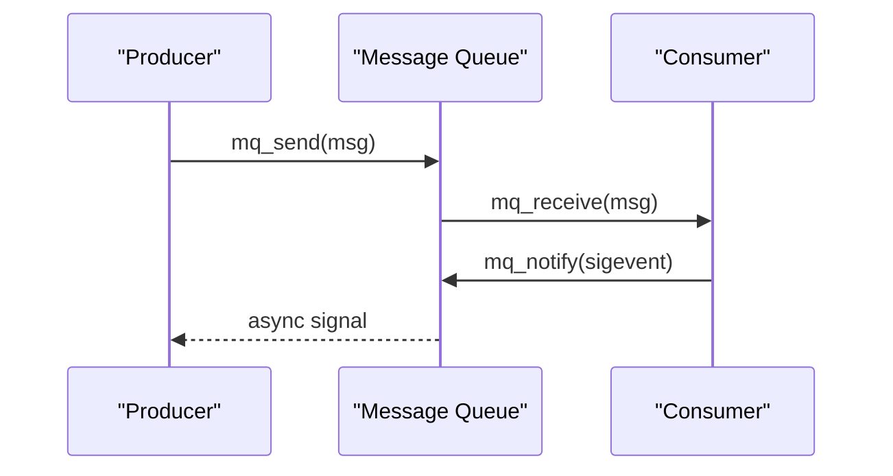

# 消息队列与信号量

> 📊 **本章难度等级：** <span class="badge-i">**I级 (Intermediate)**</span> → <span class="badge-e">**E级 (Expert)**</span>

---

## System V消息队列结构

---

### <strong>System V消息队列的内核数据结构</strong>

<span class="badge-i">I</span><br>
<span class="red">System V消息队列</span>是AT&T Unix时代引入的IPC三元组之一，至今仍在大量遗留系统中服役。
<br>
内核通过<span class="green">msgid_ds</span>结构管理每个消息队列，包含权限、队列大小、当前消息数和时间戳等元数据。
<br>

```c
// System V消息队列核心结构
// 文件路径：include/linux/msg.h（内核源码参考）
// 行号：约 40-80 行
struct msqid_ds {
    struct ipc_perm msg_perm;       // 权限结构
    struct msg *msg_first;          // 队列头指针
    struct msg *msg_last;           // 队列尾指针
    __kernel_time_t msg_stime;      // 最后发送时间
    __kernel_time_t msg_rtime;      // 最后接收时间
    __kernel_time_t msg_ctime;      // 最后变更时间
    unsigned long msg_lcbytes;      // 当前队列字节数
    unsigned long msg_lqbytes;      // 队列最大字节数
    unsigned short msg_cbytes;      // 当前字节数
    unsigned short msg_qnum;      // 当前消息数
    unsigned short msg_qbytes;    // 队列最大字节数
    __kernel_ipc_pid_t msg_lspid;   // 最后发送进程PID
    __kernel_ipc_pid_t msg_lrpid;   // 最后接收进程PID
};
```

<span class="orange"><strong>1. 消息标识：</strong></span>通过<span class="green">key_t</span>类型的键值创建或获取队列，键值可通过<span class="green">ftok()</span>从文件路径生成。
<br>
<span class="orange"><strong>2. 内核链表：</strong></span>消息以链表形式挂接在队列上，每条消息包含类型字段<span class="green">mtype</span>，支持按类型选择性接收。
<br>
<span class="orange"><strong>3. 生命周期：</strong></span>消息队列在内核中持久化，即使所有进程退出也不会自动销毁，必须显式调用<span class="green">msgctl(IPC_RMID)</span>。
<br>

<span class="blue">设计哲学：System V IPC将持久化责任交给创建者，这种"创建即持久"的语义在嵌入式场景中既是优势也是陷阱。</span><br>

---

### <strong>System V消息队列API实战</strong>

<span class="badge-i">I</span><br>
<span class="red">System V消息队列</span>的典型使用模式包括创建/附加队列、发送消息、接收消息和销毁队列四个步骤。
<br>

```c
// System V消息队列收发示例
// 文件路径：examples/sysv_msg_queue.c
#include <sys/types.h>
#include <sys/ipc.h>
#include <sys/msg.h>
#include <string.h>
#include <stdio.h>

#define MSG_KEY 0x1234
#define MSG_TYPE 1

struct msgbuf {
    long mtype;        // 消息类型，必须放在第一个
    char mtext[256];   // 消息正文
};

int main(void) {
    // 创建消息队列（不存在则创建，存在则获取）
    int msgid = msgget(MSG_KEY, IPC_CREAT | 0666);
    if (msgid < 0) { perror("msgget"); return 1; }

    // 发送消息
    struct msgbuf send_msg = { MSG_TYPE, "sensor_alert" };
    msgsnd(msgid, &send_msg, strlen(send_msg.mtext)+1, 0);
    // 第四个参数为0表示阻塞发送

    // 接收消息（按类型筛选）
    struct msgbuf recv_msg;
    msgrcv(msgid, &recv_msg, sizeof(recv_msg.mtext), MSG_TYPE, 0);
    // 第三个参数>0表示只接收该类型的消息
    printf("received: %s\n", recv_msg.mtext);

    // 销毁队列
    msgctl(msgid, IPC_RMID, NULL);
    return 0;
}
```

<span class="blue">代码带读：第20行msgget的IPC_CREAT标志表示"不存在则创建"，这是守护进程启动时复用已有队列的标准做法。</span><br>

---

## POSIX消息队列mq_open

---

### <strong>POSIX消息队列的设计改进</strong>

<span class="badge-i">I</span><br>
<span class="red">POSIX消息队列（POSIX Message Queue）</span>是IEEE标准定义的IPC接口，相比System V在命名方式和API简洁性上有显著改进。
<br>
POSIX消息队列以文件系统路径命名（如<span class="green">/mq/sensor</span>），支持<span class="green">mq_notify()</span>异步通知，并且最大消息数和单条消息大小可在创建时配置。
<br>

| 对比维度 | System V消息队列 | POSIX消息队列 |
|---------|------------------|---------------|
| 命名方式 | 数值键值（key_t） | 文件路径字符串 |
| 消息筛选 | 按mtype类型 | 按优先级 |
| 异步通知 | 不支持 | mq_notify + sigevent |
| 消息大小 | 固定上限 | 创建时配置（mq_msgsize） |
| 队列容量 | 系统全局限制 | 创建时配置（mq_maxmsg） |
| 文件系统可见 | 否 | 是（/dev/mqueue/ 下可见） |

<span class="blue">关键差异：POSIX mq将消息队列映射为文件系统节点，实现了"一切皆文件"的Unix哲学统一，便于权限管理和调试。</span><br>

---

### <strong>mq_open与mq_notify实战</strong>

<span class="badge-i">I</span><br>
<span class="red">mq_open()</span>是POSIX消息队列的创建与打开入口，行为类似文件系统的open()。
<br>

```c
// POSIX消息队列创建与异步通知
// 文件路径：examples/posix_mq_notify.c
#include <mqueue.h>
#include <signal.h>
#include <stdio.h>
#include <string.h>

#define MQ_NAME "/sensor_mq"

static void mq_notify_handler(int sig, siginfo_t *si, void *ctx) {
    // 信号处理函数：SIGEV_THREAD模式下在线程上下文执行
    mqd_t mq = mq_open(MQ_NAME, O_RDONLY | O_NONBLOCK);
    char buf[256];
    unsigned prio;
    ssize_t n = mq_receive(mq, buf, sizeof(buf), &prio);
    if (n > 0) {
        buf[n] = '\0';
        printf("prio=%u, msg=%s\n", prio, buf);
    }
    mq_close(mq);
}

int main(void) {
    struct mq_attr attr = {
        .mq_flags = 0,
        .mq_maxmsg = 10,      // 最多缓存10条消息
        .mq_msgsize = 256,    // 单条最大256字节
        .mq_curmsgs = 0
    };

    // 创建队列（O_CREAT | O_EXCL确保原子创建）
    mqd_t mq = mq_open(MQ_NAME, O_CREAT | O_RDWR | O_EXCL, 0644, &attr);
    if (mq < 0) { perror("mq_open"); return 1; }

    // 注册异步通知：新消息到达时发送SIGUSR1
    struct sigevent sev;
    sev.sigev_notify = SIGEV_SIGNAL;
    sev.sigev_signo = SIGUSR1;
    sev.sigev_value.sival_ptr = &mq;
    mq_notify(mq, &sev);

    // 安装信号处理函数
    struct sigaction sa;
    sa.sa_flags = SA_SIGINFO;
    sa.sa_sigaction = mq_notify_handler;
    sigaction(SIGUSR1, &sa, NULL);

    // 发送测试消息
    mq_send(mq, "temperature=42.5", 18, 5);  // 优先级5

    // 主循环...
    pause();
    mq_close(mq);
    mq_unlink(MQ_NAME);
    return 0;
}
```

<span class="blue">代码带读：第12-20行的通知处理函数中，需要重新打开队列（O_NONBLOCK）以避免在信号上下文中阻塞；mq_notify为一次性通知，每次触发后需重新注册。</span><br>

---

## 信号量PV原语

---

### <strong>信号量的核心语义与分类</strong>

<span class="badge-i">I</span><br>
<span class="red">信号量（Semaphore）</span>是Dijkstra于1965年提出的同步原语，本质上是一个带原子操作的非负整数计数器。
<br>
Linux提供两类信号量：System V信号量（数组形式，进程间共享）和POSIX信号量（无名/有名，线程/进程级）。
<br>

| 类型 | API | 共享范围 | 典型用途 |
|------|-----|---------|---------|
| System V信号量 | semget/semop/semctl | 任意进程 | 复杂资源计数、PV批量操作 |
| POSIX无名信号量 | sem_init/sem_wait/sem_post | 线程/共享内存中的进程 | 轻量同步 |
| POSIX有名信号量 | sem_open/sem_wait/sem_post | 任意进程 | 跨进程互斥 |

<span class="orange"><strong>1. P操作（Wait/Down）：</strong></span>计数器减1，若结果为负则阻塞等待。
<br>
<span class="orange"><strong>2. V操作（Signal/Up）：</strong></span>计数器加1，若有等待进程则唤醒一个。
<br>
<span class="orange"><strong>3. 二值信号量：</strong></span>计数器上限为1，等价于互斥锁。
<br>

```c
// POSIX有名信号量进程间互斥
// 文件路径：examples/posix_named_sem.c
#include <semaphore.h>
#include <fcntl.h>
#include <stdio.h>
#include <unistd.h>

#define SEM_NAME "/shared_resource"

int main(void) {
    // 创建/打开有名信号量（O_CREAT创建，初始值1）
    sem_t *sem = sem_open(SEM_NAME, O_CREAT, 0644, 1);
    if (sem == SEM_FAILED) { perror("sem_open"); return 1; }

    sem_wait(sem);          // P操作：进入临界区
    printf("entered critical section\n");
    sleep(2);               // 模拟临界区操作
    printf("leaving critical section\n");
    sem_post(sem);          // V操作：离开临界区

    sem_close(sem);
    // sem_unlink(SEM_NAME);  // 最后一个进程退出时销毁
    return 0;
}
```

<span class="blue">关键结论：信号量不传递数据，只传递同步信号；在嵌入式中常用于保护共享内存的临界区或管理有限资源池。</span><br>

---

## 异步通知sigevent

---

### <strong>sigevent的通用异步通知框架</strong>

<span class="badge-e">E</span><br>
<span class="red">sigevent</span>是POSIX定义的通用异步通知结构体，被POSIX消息队列、POSIX定时器、aio等子系统复用。
<br>
通过<span class="green">sigev_notify</span>字段，可配置三种通知方式：发送信号、启动新线程、或调用回调函数。
<br>

| sigev_notify值 | 行为 | 适用场景 |
|---------------|------|---------|
| SIGEV_NONE | 不通知 | 轮询模式 |
| SIGEV_SIGNAL | 发送指定信号 | 轻量通知，避免线程创建开销 |
| SIGEV_THREAD | 启动新线程执行回调 | 需要复杂处理逻辑 |

```c
// sigevent在POSIX消息队列中的高级用法
// 文件路径：examples/sigev_thread.c
#include <mqueue.h>
#include <pthread.h>
#include <stdio.h>

#define MQ_NAME "/event_mq"

static void thread_notify(union sigval sv) {
    // 在独立线程中处理消息
    mqd_t mq = *(mqd_t*)sv.sival_ptr;
    char buf[256];
    unsigned prio;
    ssize_t n = mq_receive(mq, buf, sizeof(buf), &prio);
    if (n > 0) {
        buf[n] = '\0';
        printf("[thread] handled: %s (prio=%u)\n", buf, prio);
    }
    // 重新注册通知
    struct sigevent sev;
    sev.sigev_notify = SIGEV_THREAD;
    sev.sigev_notify_function = thread_notify;
    sev.sigev_value.sival_ptr = &mq;
    mq_notify(mq, &sev);
}

int main(void) {
    struct mq_attr attr = {0, 10, 256, 0};
    mqd_t mq = mq_open(MQ_NAME, O_CREAT | O_RDWR, 0644, &attr);

    struct sigevent sev;
    sev.sigev_notify = SIGEV_THREAD;
    sev.sigev_notify_function = thread_notify;
    sev.sigev_value.sival_ptr = &mq;
    mq_notify(mq, &sev);

    mq_send(mq, "async_event", 11, 1);
    sleep(2);
    mq_close(mq); mq_unlink(MQ_NAME);
    return 0;
}
```

<span class="blue">设计要点：SIGEV_THREAD模式每次通知都会创建新线程，在高频场景下应使用线程池或改用SIGEV_SIGNAL。</span><br>

---

## 实时性考量

---

### <strong>消息队列与信号量的实时属性</strong>

<span class="badge-e">E</span><br>
<span class="red">消息队列在实时系统</span>中的适用性取决于两个核心指标：消息传递延迟的可预测性和优先级反转风险。
<br>
POSIX消息队列支持按优先级接收（<span class="green">mq_receive</span>的<span class="green">prio</span>参数），数字越大优先级越高，内核按优先级链表管理消息。
<br>

```c
// 实时优先级消息队列示例
// 文件路径：examples/rt_mq_prio.c
#include <mqueue.h>
#include <stdio.h>

#define MQ_NAME "/rt_mq"

int main(void) {
    struct mq_attr attr = {0, 20, 64, 0};
    mqd_t mq = mq_open(MQ_NAME, O_CREAT | O_RDWR, 0644, &attr);

    // 按优先级从高到低发送
    mq_send(mq, "critical_fault", 14, 10);   // 最高优先级
    mq_send(mq, "warning_01",      10,  5);   // 中等优先级
    mq_send(mq, "info_log",         8,  1);   // 最低优先级

    // 接收方按优先级顺序获得消息
    char buf[64];
    unsigned prio;
    for (int i = 0; i < 3; i++) {
        mq_receive(mq, buf, sizeof(buf), &prio);
        printf("prio=%2u: %s\n", prio, buf);
    }
    // 输出顺序：critical_fault(10) -> warning_01(5) -> info_log(1)

    mq_close(mq); mq_unlink(MQ_NAME);
    return 0;
}
```

<span class="blue">实时约束：PREEMPT_RT补丁下，mq_send/mq_receive为可抢占的系统调用，延迟抖动显著降低；但System V消息队列不受PREEMPT_RT优化影响。</span><br>

---

## 历史演进与小结

---

### <strong>消息队列与信号量的演进</strong>

<span class="badge-i">I</span><br>

| 年代 | 事件 | 意义 |
|------|------|------|
| 1965 | Dijkstra提出信号量 | 并发同步的理论基石 |
| 1983 | System V IPC标准化 | msg/sem/shm进入Unix主流 |
| 1993 | POSIX IPC标准化 | 统一API、文件系统命名 |
| 2001 | Linux 2.4引入POSIX mq | mqueue文件系统支持 |
| 2015 | PREEMPT_RT与mq结合 | 实时消息队列延迟优化 |

---

## 本章小结

| 要点 | 核心结论 |
|------|---------|
| System V mq | 键值命名、链表结构、mtype筛选、需显式销毁 |
| POSIX mq | 路径命名、优先级、异步通知、文件系统可见 |
| 信号量PV | 计数器原子操作，二值信号量等价于互斥锁 |
| sigevent | 通用异步通知框架，支持信号/线程/回调 |
| 实时性 | PREEMPT_RT优化POSIX mq，System V mq不受惠 |

---




## 课后练习

1. **代码实现**：使用POSIX消息队列实现一个"发布-订阅"模型，要求支持多个订阅者各接收全量消息（提示：每个订阅者独立mq_open）。<br>
2. **问题诊断**：分析System V消息队列在重启后残留导致的"key冲突"问题，给出检测和清理脚本。<br>
3. **工程决策**：一个硬实时控制系统需要在10us内完成进程间同步。评估信号量+共享内存、自旋锁+共享内存、以及RT-PREEMPT下futex三种方案的可行性。<br>
